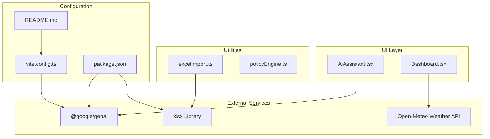
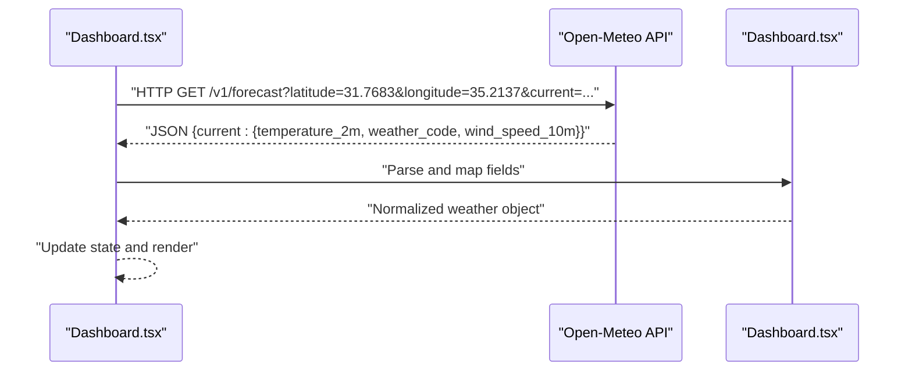
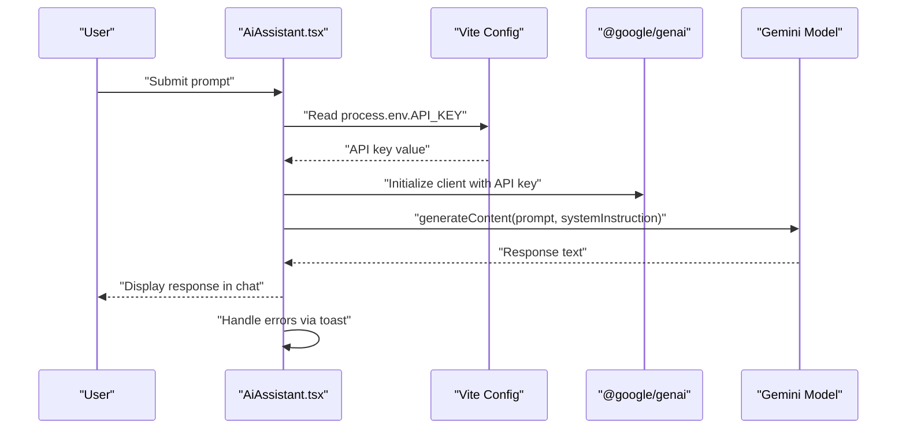
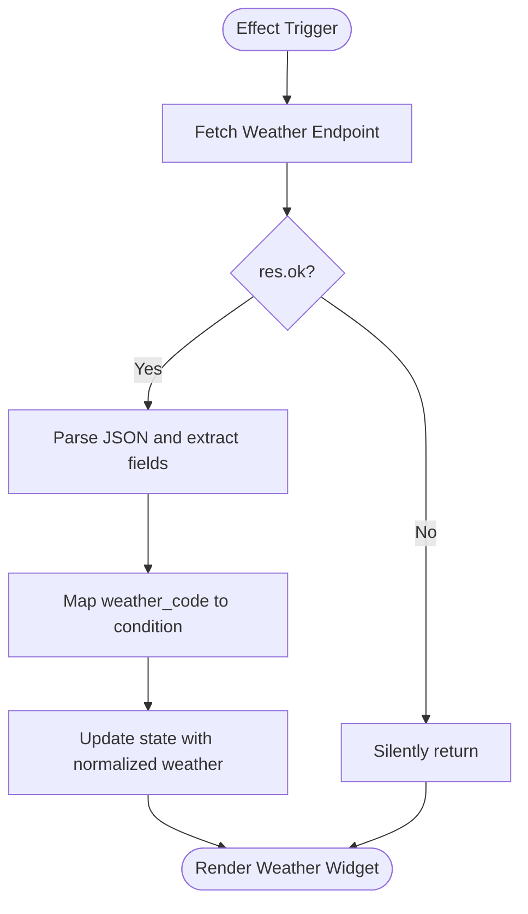
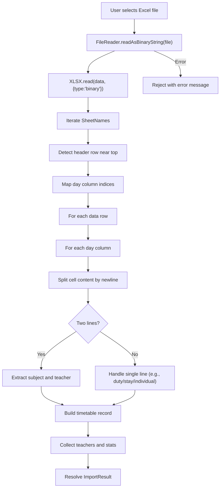
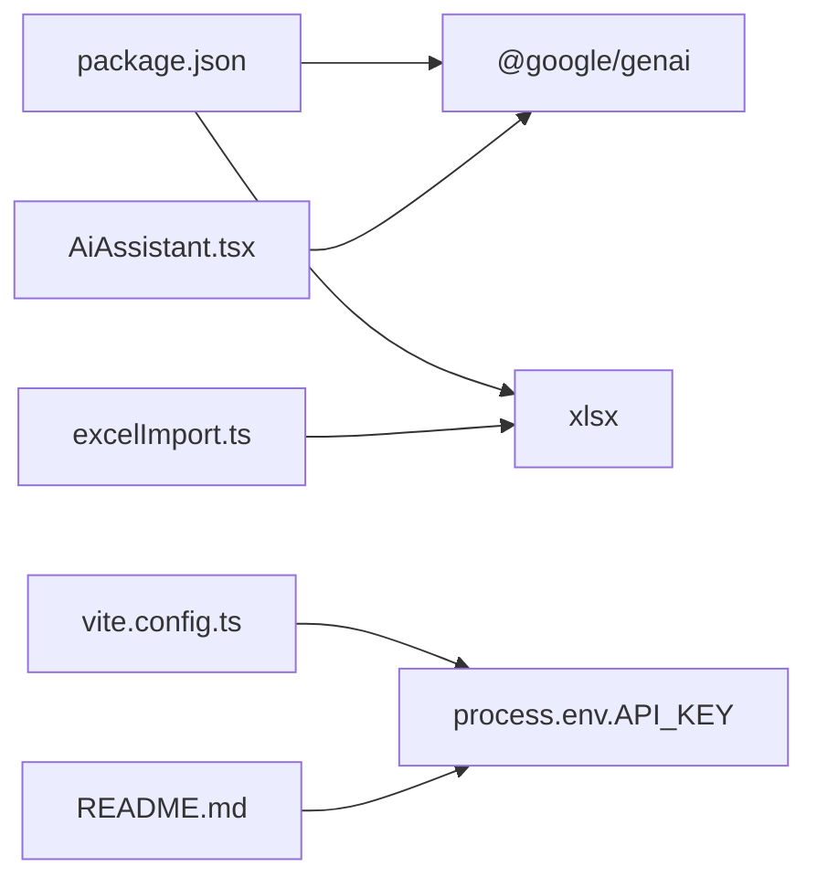

# API Integration

<cite>
**Referenced Files in This Document**
- [AiAssistant.tsx](file://components/AiAssistant.tsx)
- [policyEngine.ts](file://utils/policyEngine.ts)
- [Dashboard.tsx](file://components/Dashboard.tsx)
- [excelImport.ts](file://utils/excelImport.ts)
- [vite.config.ts](file://vite.config.ts)
- [README.md](file://README.md)
- [package.json](file://package.json)
- [policy.ts](file://types/policy.ts)
- [constants.ts](file://constants.ts)
</cite>

## Table of Contents
1. [Introduction](#introduction)
2. [Project Structure](#project-structure)
3. [Core Components](#core-components)
4. [Architecture Overview](#architecture-overview)
5. [Detailed Component Analysis](#detailed-component-analysis)
6. [Dependency Analysis](#dependency-analysis)
7. [Performance Considerations](#performance-considerations)
8. [Troubleshooting Guide](#troubleshooting-guide)
9. [Conclusion](#conclusion)

## Introduction
This document provides API integration documentation for three external services used by the application:
- Google AI/ML integration via @google/genai for the AI assistant chat.
- Open-Meteo Weather API for live weather display on the dashboard.
- Excel file processing via xlsx for importing timetables and teacher records.

It covers initialization, prompt formatting, request patterns, response handling, error handling, rate limiting considerations, security practices for API keys, and client implementation guidelines with debugging tips.

## Project Structure
The relevant integration points are located in:
- components/AiAssistant.tsx: Google AI integration for chat-based insights.
- components/Dashboard.tsx: Open-Meteo Weather API integration for live weather.
- utils/excelImport.ts: Excel file reading and parsing using xlsx.
- vite.config.ts: Environment variable exposure for API keys.
- README.md: Setup instructions for API keys.
- package.json: Dependencies for @google/genai and xlsx.

**Diagram sources**
- [AiAssistant.tsx](file://components/AiAssistant.tsx#L1-L99)
- [Dashboard.tsx](file://components/Dashboard.tsx#L1-L120)
- [excelImport.ts](file://utils/excelImport.ts#L1-L189)
- [vite.config.ts](file://vite.config.ts#L1-L24)
- [README.md](file://README.md#L13-L21)
- [package.json](file://package.json#L11-L18)

**Section sources**
- [AiAssistant.tsx](file://components/AiAssistant.tsx#L1-L99)
- [Dashboard.tsx](file://components/Dashboard.tsx#L1-L120)
- [excelImport.ts](file://utils/excelImport.ts#L1-L189)
- [vite.config.ts](file://vite.config.ts#L1-L24)
- [README.md](file://README.md#L13-L21)
- [package.json](file://package.json#L11-L18)

## Core Components
- Google AI/ML (@google/genai) integration in AiAssistant.tsx:
  - Initializes the client with an API key from environment variables.
  - Builds a system instruction embedding contextual awareness.
  - Sends a prompt to the model and handles responses and errors.
- Open-Meteo Weather API in Dashboard.tsx:
  - Performs periodic HTTP GET requests to forecast endpoint.
  - Parses current weather fields and maps codes to localized conditions.
  - Handles network errors gracefully without noisy logs.
- Excel file processing via xlsx in excelImport.ts:
  - Reads binary Excel data from a File object.
  - Parses sheets into arrays, detects headers, and extracts lessons and teachers.
  - Normalizes Arabic text and infers lesson types.

**Section sources**
- [AiAssistant.tsx](file://components/AiAssistant.tsx#L25-L57)
- [Dashboard.tsx](file://components/Dashboard.tsx#L50-L78)
- [excelImport.ts](file://utils/excelImport.ts#L41-L188)

## Architecture Overview
The integrations are layered as follows:
- Environment configuration exposes API keys to the client.
- UI components trigger external API calls.
- Utilities encapsulate parsing and data transformation.
- Types define the shape of data used across integrations.

**Diagram sources**
- [Dashboard.tsx](file://components/Dashboard.tsx#L50-L78)

**Section sources**
- [Dashboard.tsx](file://components/Dashboard.tsx#L50-L78)

## Detailed Component Analysis

### Google AI/ML Integration (@google/genai) via AiAssistant.tsx
- Initialization
  - The component checks for the presence of the API key in environment variables before proceeding.
  - It constructs a GoogleGenAI client instance using the API key.
- Prompt formatting
  - The system instruction embeds contextual awareness including current date, active absences, completed substitutions, and staff reliability.
  - The prompt passed to the model is the user’s input.
- Response handling
  - On successful response, the model’s text is appended to the message history.
  - Errors are caught and surfaced via a toast notification.
- Authentication
  - The API key is exposed via Vite’s define mechanism and loaded from environment files.
- Rate limiting and retries
  - The integration does not implement explicit retry logic; consider adding exponential backoff and user feedback for transient failures.
- Security practices
  - API keys are loaded from environment variables and exposed only at build time via Vite define.
  - Ensure .env files are not committed and restrict access to deployment environments.
- Error handling strategies
  - Missing API key prevents requests.
  - Network or service errors are caught and surfaced to the user via toast.
- Client implementation guidelines
  - Ensure the environment variable is present before enabling the assistant.
  - Add loading states and user feedback during long-running prompts.
  - Consider batching or throttling prompts to respect provider quotas.
- Debugging tips
  - Verify the API key is correctly set in the environment file and loaded by Vite.
  - Test with a minimal prompt to isolate model availability issues.

**Diagram sources**
- [AiAssistant.tsx](file://components/AiAssistant.tsx#L25-L57)
- [vite.config.ts](file://vite.config.ts#L13-L16)

**Section sources**
- [AiAssistant.tsx](file://components/AiAssistant.tsx#L25-L57)
- [vite.config.ts](file://vite.config.ts#L13-L16)
- [README.md](file://README.md#L13-L21)
- [package.json](file://package.json#L11-L18)

### Open-Meteo Weather API Integration in Dashboard.tsx
- HTTP request pattern
  - Uses fetch to call the Open-Meteo forecast endpoint with latitude and longitude for the school location.
  - Requests current temperature, weather code, and wind speed.
- Query parameters
  - latitude=31.7683
  - longitude=35.2137
  - current=temperature_2m,weather_code,wind_speed_10m
  - timezone=auto
- Response schema
  - Expects a JSON object containing a current object with:
    - temperature_2m
    - weather_code
    - wind_speed_10m
- Error handling
  - Checks response.ok; on failure, the effect silently returns without updating state.
  - Catches exceptions and suppresses logging to avoid console noise.
- Rate limiting considerations
  - The component fetches weather every 30 minutes using an interval.
  - Consider reducing frequency or caching responses to minimize API calls.
- Security practices
  - No API key is required for this endpoint; ensure no sensitive data is transmitted.
- Client implementation guidelines
  - Keep the interval reasonable to balance freshness and cost.
  - Normalize and map weather_code to localized conditions for display.
- Debugging tips
  - Temporarily log response status and body to diagnose network issues.
  - Validate coordinates and timezone behavior.

**Diagram sources**
- [Dashboard.tsx](file://components/Dashboard.tsx#L50-L78)

**Section sources**
- [Dashboard.tsx](file://components/Dashboard.tsx#L50-L78)

### Excel File Processing via xlsx in excelImport.ts
- File reading workflow
  - Uses FileReader to read the uploaded Excel file as binary data.
  - Passes binary data to XLSX.read with type set to binary.
- Data extraction methods
  - Iterates over workbook sheet names and converts each sheet to JSON arrays.
  - Detects header rows near the top to identify day columns.
  - Extracts lessons by iterating rows and columns, splitting multi-line cells into subject/teacher pairs.
  - Normalizes Arabic text and infers lesson types based on subject and teacher name heuristics.
- Binary format handling
  - Reads file as binary string and passes to the xlsx library for parsing.
- Error handling strategies
  - Catches parsing errors and rejects with a user-friendly message.
  - Skips empty or invalid cells and tracks skipped counts.
- Client implementation guidelines
  - Validate file types and sizes before processing.
  - Provide progress feedback and clear error messages.
  - Ensure normalization and mapping logic accounts for variations in input formatting.
- Debugging tips
  - Log detected header row indices and mapped day columns to verify parsing logic.
  - Inspect raw cell content and split behavior for problematic entries.

**Diagram sources**
- [excelImport.ts](file://utils/excelImport.ts#L41-L188)

**Section sources**
- [excelImport.ts](file://utils/excelImport.ts#L41-L188)

## Dependency Analysis
- External libraries
  - @google/genai: Used by AiAssistant.tsx for chat-based AI responses.
  - xlsx: Used by excelImport.ts for Excel parsing.
- Internal dependencies
  - Vite configuration defines environment variables for the client bundle.
  - README documents setting the GEMINI_API_KEY in .env.local.
- Type definitions
  - Policy-related types support the explainability engine and decision tracing used in policy scenarios.

**Diagram sources**
- [package.json](file://package.json#L11-L18)
- [vite.config.ts](file://vite.config.ts#L13-L16)
- [README.md](file://README.md#L13-L21)
- [AiAssistant.tsx](file://components/AiAssistant.tsx#L25-L57)
- [excelImport.ts](file://utils/excelImport.ts#L41-L188)

**Section sources**
- [package.json](file://package.json#L11-L18)
- [vite.config.ts](file://vite.config.ts#L13-L16)
- [README.md](file://README.md#L13-L21)
- [AiAssistant.tsx](file://components/AiAssistant.tsx#L25-L57)
- [excelImport.ts](file://utils/excelImport.ts#L41-L188)
- [policy.ts](file://types/policy.ts#L1-L162)
- [constants.ts](file://constants.ts#L1-L438)

## Performance Considerations
- Google AI/ML
  - Avoid frequent prompts; batch or debounce user inputs.
  - Implement retry with exponential backoff and user feedback for transient errors.
  - Consider caching repeated prompts with identical context.
- Open-Meteo Weather
  - Reduce polling frequency or cache responses to minimize network overhead.
  - Validate coordinates and handle timezone differences carefully.
- Excel Import
  - Optimize parsing loops and avoid unnecessary allocations.
  - Consider streaming large files and progressive updates to the UI.

[No sources needed since this section provides general guidance]

## Troubleshooting Guide
- Google AI/ML
  - Symptom: Assistant does nothing when prompted.
    - Cause: Missing API key.
    - Fix: Ensure GEMINI_API_KEY is set in .env.local and re-run the app.
  - Symptom: Error toast appears.
    - Cause: Network/service error or quota exceeded.
    - Fix: Retry later; monitor provider status; add retry logic.
- Open-Meteo Weather
  - Symptom: Weather widget shows default values.
    - Cause: Network error or non-OK response.
    - Fix: Check connectivity; temporarily log response status; verify endpoint parameters.
- Excel Import
  - Symptom: Parsing fails or skips rows.
    - Cause: Unexpected cell formats or missing headers.
    - Fix: Validate input file structure; adjust header detection logic; normalize text consistently.

**Section sources**
- [AiAssistant.tsx](file://components/AiAssistant.tsx#L25-L57)
- [Dashboard.tsx](file://components/Dashboard.tsx#L50-L78)
- [excelImport.ts](file://utils/excelImport.ts#L41-L188)
- [README.md](file://README.md#L13-L21)

## Conclusion
This document outlined the external API integrations used by the application:
- Google AI/ML via @google/genai is integrated in the AI assistant with environment-based authentication and contextual prompting.
- Open-Meteo Weather API is integrated in the dashboard with robust error handling and periodic updates.
- Excel file processing via xlsx is implemented with binary reading and structured extraction.

Follow the security and rate limiting recommendations, and leverage the provided debugging tips to maintain reliable integrations.