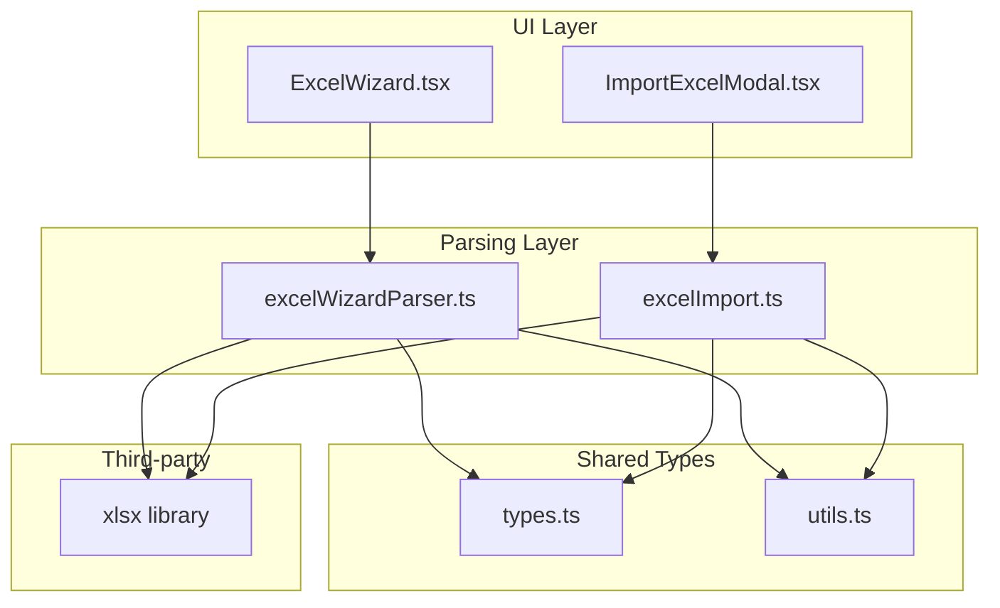
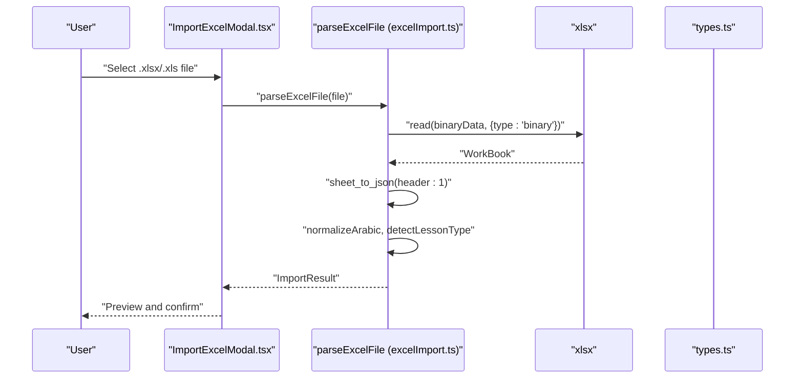
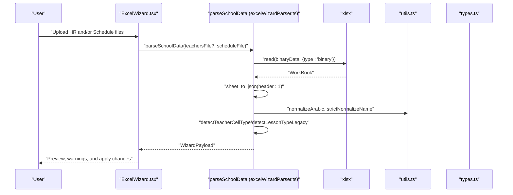
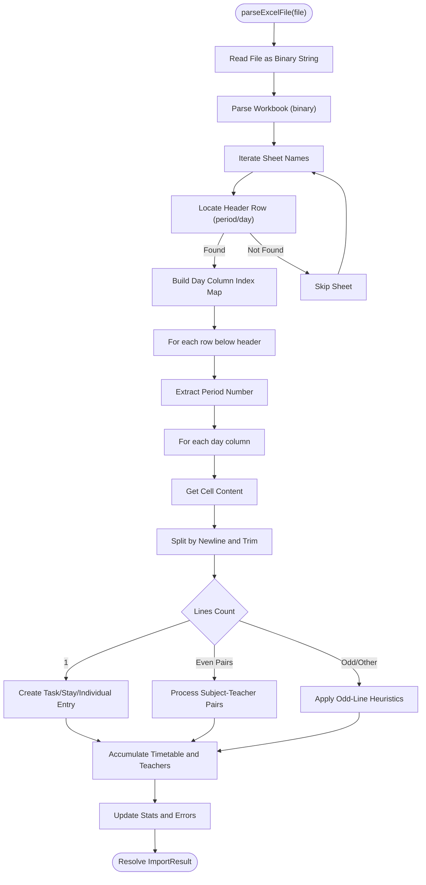
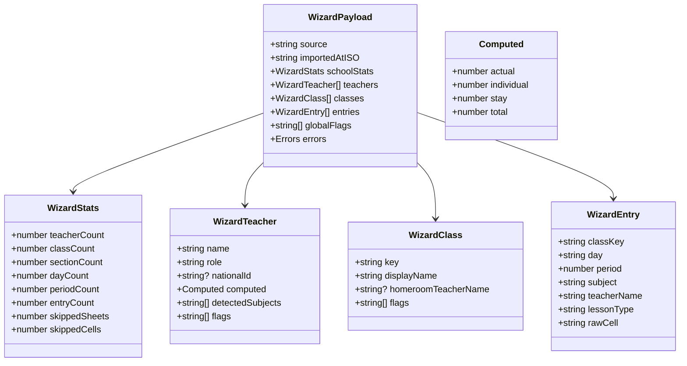
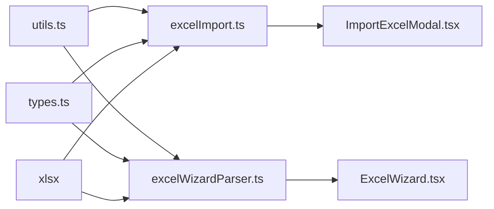

# Excel File Processing Integration

<cite>
**Referenced Files in This Document**
- [excelImport.ts](file://utils/excelImport.ts)
- [excelWizardParser.ts](file://utils/excelWizardParser.ts)
- [ExcelWizard.tsx](file://components/ExcelWizard.tsx)
- [ImportExcelModal.tsx](file://components/ImportExcelModal.tsx)
- [types.ts](file://types.ts)
- [utils.ts](file://utils.ts)
</cite>

## Table of Contents
1. [Introduction](#introduction)
2. [Project Structure](#project-structure)
3. [Core Components](#core-components)
4. [Architecture Overview](#architecture-overview)
5. [Detailed Component Analysis](#detailed-component-analysis)
6. [Dependency Analysis](#dependency-analysis)
7. [Performance Considerations](#performance-considerations)
8. [Troubleshooting Guide](#troubleshooting-guide)
9. [Conclusion](#conclusion)
10. [Appendices](#appendices)

## Introduction
This document provides comprehensive API documentation for Excel file processing in the project, focusing on the workflow implemented in excelImport.ts for reading and parsing Excel matrices, and the advanced dual-file ingestion pipeline in excelWizardParser.ts. It covers binary string conversion, workbook parsing, worksheet extraction, data extraction for employee schedules and structural configurations, schema validation and error detection, encoding and memory considerations, integration points with ExcelWizard and ImportExcelModal, progress reporting and user feedback, security considerations, and performance optimization for large datasets. It also includes guidance for extending supported templates and debugging common parsing issues.

## Project Structure
The Excel processing functionality spans utility modules and UI components:
- Utility parsers: excelImport.ts (single-file matrix parsing), excelWizardParser.ts (dual-file ingestion with reconciliation)
- UI integrations: ExcelWizard.tsx (dual-file wizard), ImportExcelModal.tsx (single-file modal)
- Shared types: types.ts (data models and enums)
- Utilities: utils.ts (encoding normalization and helpers)

**Diagram sources**
- [excelImport.ts](file://utils/excelImport.ts#L1-L189)
- [excelWizardParser.ts](file://utils/excelWizardParser.ts#L1-L716)
- [ExcelWizard.tsx](file://components/ExcelWizard.tsx#L1-L486)
- [ImportExcelModal.tsx](file://components/ImportExcelModal.tsx#L1-L226)
- [types.ts](file://types.ts#L1-L382)
- [utils.ts](file://utils.ts#L1-L120)

**Section sources**
- [excelImport.ts](file://utils/excelImport.ts#L1-L189)
- [excelWizardParser.ts](file://utils/excelWizardParser.ts#L1-L716)
- [ExcelWizard.tsx](file://components/ExcelWizard.tsx#L1-L486)
- [ImportExcelModal.tsx](file://components/ImportExcelModal.tsx#L1-L226)
- [types.ts](file://types.ts#L1-L382)
- [utils.ts](file://utils.ts#L1-L120)

## Core Components
- excelImport.ts
  - Parses a single Excel matrix file (one sheet per class)
  - Converts File to binary string, reads workbook, extracts timetable entries, and builds ImportResult
  - Performs day header normalization, Arabic text normalization, and lesson type detection
- excelWizardParser.ts
  - Dual-file ingestion: teachers HR file (optional) and schedule matrix file (required)
  - Robust identity extraction (ID and name), authoritative slot mapping, reconciliation, and homeroom detection
  - Strict and legacy lesson type classification modes
  - Comprehensive error collection and statistics
- ImportExcelModal.tsx
  - Single-file matrix upload flow, preview, and confirmation
  - Integrates parseExcelFile and displays ImportResult
- ExcelWizard.tsx
  - Dual-file wizard flow, preview, and application of parsed data to app state
  - Merges teachers, classes, and lessons with existing data and updates schedule configuration

**Section sources**
- [excelImport.ts](file://utils/excelImport.ts#L1-L189)
- [excelWizardParser.ts](file://utils/excelWizardParser.ts#L1-L716)
- [ImportExcelModal.tsx](file://components/ImportExcelModal.tsx#L1-L226)
- [ExcelWizard.tsx](file://components/ExcelWizard.tsx#L1-L486)

## Architecture Overview
The system implements two distinct ingestion paths:
- Single-file matrix parsing via ImportExcelModal -> parseExcelFile -> xlsx
- Dual-file reconciliation via ExcelWizard -> parseSchoolData -> xlsx

**Diagram sources**
- [ImportExcelModal.tsx](file://components/ImportExcelModal.tsx#L1-L226)
- [excelImport.ts](file://utils/excelImport.ts#L1-L189)
- [types.ts](file://types.ts#L354-L382)

**Diagram sources**
- [ExcelWizard.tsx](file://components/ExcelWizard.tsx#L1-L486)
- [excelWizardParser.ts](file://utils/excelWizardParser.ts#L1-L716)
- [utils.ts](file://utils.ts#L1-L120)
- [types.ts](file://types.ts#L1-L382)

## Detailed Component Analysis

### excelImport.ts: Single-File Matrix Parser
- Binary string conversion
  - Uses FileReader to read the File as a binary string
  - xlsx.read(data, { type: 'binary' }) parses the workbook
- Workbook parsing and worksheet extraction
  - Iterates workbook.SheetNames and reads each sheet via sheet_to_json({ header: 1 })
  - Scans up to a bounded number of rows to locate the header row containing "period" or "lesson"
- Data extraction for employee schedules and structural configurations
  - Builds a day column index map using normalized Arabic day names
  - For each row below the header, extracts period number and iterates day columns
  - Splits cell content by newline and processes pairs of subject and teacher
  - Supports single-line entries for tasks/stays/individuals
  - Populates ImportResult with timetable entries, teacher map, and stats
- Schema validation and error detection
  - Validates presence of header row and sufficient rows
  - Skips empty cells and invalid periods
  - Tracks skipped cells and aggregates basic errors
- Encoding considerations
  - normalizeArabic is applied to headers and cell content to normalize Arabic characters and whitespace
- Memory management
  - Processes sheets sequentially and uses Map/Set for deduplication and counting
  - Avoids storing entire raw spreadsheets beyond immediate parsing needs

**Diagram sources**
- [excelImport.ts](file://utils/excelImport.ts#L1-L189)

**Section sources**
- [excelImport.ts](file://utils/excelImport.ts#L1-L189)
- [utils.ts](file://utils.ts#L17-L27)
- [types.ts](file://types.ts#L354-L382)

### excelWizardParser.ts: Dual-File Ingestion and Reconciliation
- Binary string conversion and workbook parsing
  - Reuses the same binary read pattern for both files
- Identity extraction
  - extractNationalId scans sheet names and top grid samples to robustly extract 5–9 digit IDs
  - strictNormalizeName removes prefixes and normalizes Arabic characters for deduplication
- Authoritative teacher slot mapping
  - detectTeacherCellType strictly classifies teacher-only entries
  - Maintains a Map keyed by normalized teacher name, day, and period
- Schedule ingestion and reconciliation
  - detectLessonTypeLegacy provides fallback classification when HR file is absent
  - reconcile pass ensures teacher-only entries override or augment schedule entries
  - Injects missing teacher-only entries to balance workload computation
- Structural configuration extraction
  - Computes period count from unique periods in entries
  - Detects homeroom teachers by frequency of specific subjects per class
- Error detection and reporting
  - Collects sheet-level and cell-level errors, plus warnings
  - Tracks skipped sheets and cells
- Integration with UI
  - Returns WizardPayload consumed by ExcelWizard.tsx for preview and application

**Diagram sources**
- [excelWizardParser.ts](file://utils/excelWizardParser.ts#L1-L200)
- [types.ts](file://types.ts#L1-L382)

**Section sources**
- [excelWizardParser.ts](file://utils/excelWizardParser.ts#L1-L716)
- [utils.ts](file://utils.ts#L1-L120)
- [types.ts](file://types.ts#L1-L382)

### ImportExcelModal.tsx: Single-File Matrix Workflow
- Upload and template download
  - Accepts .xlsx/.xls files
  - Provides a downloadable matrix template
- Parsing and preview
  - Calls parseExcelFile and renders ImportResult statistics and preview table
- Confirmation and integration
  - onSave callback receives ImportResult for downstream processing

**Section sources**
- [ImportExcelModal.tsx](file://components/ImportExcelModal.tsx#L1-L226)
- [excelImport.ts](file://utils/excelImport.ts#L1-L189)

### ExcelWizard.tsx: Dual-File Wizard Workflow
- Upload and processing
  - Accepts optional HR file and required schedule file
  - Calls parseSchoolData and transitions to preview step
- Preview and feedback
  - Displays statistics, classification breakdown, and error/warning lists
- Application and merging
  - Applies changes by merging teachers, classes, and lessons into app state
  - Updates schedule configuration periods per imported structure
  - Persists backup and notifies via toast

**Section sources**
- [ExcelWizard.tsx](file://components/ExcelWizard.tsx#L1-L486)
- [excelWizardParser.ts](file://utils/excelWizardParser.ts#L1-L716)

## Dependency Analysis
- Internal dependencies
  - excelImport.ts depends on utils.normalizeArabic and types.LessonType
  - excelWizardParser.ts depends on utils.normalizeArabic, utils.strictNormalizeName, and types.Wizard* interfaces
  - Both parsers depend on xlsx for binary parsing
- UI dependencies
  - ImportExcelModal.tsx depends on parseExcelFile and renders ImportResult
  - ExcelWizard.tsx depends on parseSchoolData and merges WizardPayload into app state

**Diagram sources**
- [excelImport.ts](file://utils/excelImport.ts#L1-L189)
- [excelWizardParser.ts](file://utils/excelWizardParser.ts#L1-L716)
- [ImportExcelModal.tsx](file://components/ImportExcelModal.tsx#L1-L226)
- [ExcelWizard.tsx](file://components/ExcelWizard.tsx#L1-L486)
- [types.ts](file://types.ts#L1-L382)
- [utils.ts](file://utils.ts#L1-L120)

**Section sources**
- [excelImport.ts](file://utils/excelImport.ts#L1-L189)
- [excelWizardParser.ts](file://utils/excelWizardParser.ts#L1-L716)
- [ImportExcelModal.tsx](file://components/ImportExcelModal.tsx#L1-L226)
- [ExcelWizard.tsx](file://components/ExcelWizard.tsx#L1-L486)
- [types.ts](file://types.ts#L1-L382)
- [utils.ts](file://utils.ts#L1-L120)

## Performance Considerations
- Large file handling
  - Binary string reading is synchronous; consider streaming or worker threads for very large files
  - Limit scanning windows (e.g., header search bounds) to reduce overhead
- Memory usage
  - Use Map/Set for deduplication and counting; avoid storing entire sheets beyond immediate parsing
  - Process sheets sequentially to minimize peak memory
- Parsing efficiency
  - sheet_to_json with header:1 is efficient; avoid repeated conversions
  - Normalize text once per cell and reuse normalized keys
- UI responsiveness
  - Show loading states and progress indicators during parsing
  - Debounce or batch UI updates when rendering large previews

[No sources needed since this section provides general guidance]

## Troubleshooting Guide
- Malformed headers
  - Ensure the first cell of the header row contains "period" or "lesson" indicator
  - Verify day headers are recognized by the day map (Arabic and English variants)
- Empty or invalid periods
  - Rows without numeric periods are skipped; confirm numeric formatting
- Unrecognized cell formats
  - For single-line entries, only tasks/stays/individuals are accepted
  - For paired entries, ensure alternating subject and teacher lines
- Missing teacher identification
  - When HR file is absent, teacher names are inferred from schedule; ensure names are consistent and recognizable
- ID extraction failures
  - Confirm sheet names and top grid contain 5–9 digit numeric sequences
- Encoding issues
  - normalizeArabic is applied; ensure input uses standard Arabic characters
- Excessive skipped cells/sheets
  - Review formatting and header placement; adjust template accordingly

**Section sources**
- [excelImport.ts](file://utils/excelImport.ts#L60-L189)
- [excelWizardParser.ts](file://utils/excelWizardParser.ts#L180-L716)
- [utils.ts](file://utils.ts#L17-L27)

## Conclusion
The Excel processing pipeline offers two complementary ingestion paths:
- A streamlined single-file matrix parser for quick imports
- A robust dual-file ingestion with reconciliation, identity extraction, and structural configuration updates

Both paths leverage xlsx for binary parsing, normalize Arabic text, and provide structured results with statistics and error reporting. Integration with ExcelWizard and ImportExcelModal ensures a smooth user experience with clear feedback and safe application of parsed data.

[No sources needed since this section summarizes without analyzing specific files]

## Appendices

### API Definitions

- parseExcelFile(file: File): Promise<ImportResult>
  - Reads a single Excel matrix file and returns timetable entries, teacher map, and stats
  - Throws on parsing errors

- parseSchoolData(teachersFile: File | null, scheduleFile: File): Promise<WizardPayload>
  - Reads HR and schedule files, reconciles entries, detects identities and homerooms, and returns a comprehensive payload

- ImportResult
  - Fields: teachers, timetable, errors, stats
  - Used by ImportExcelModal.tsx

- WizardPayload
  - Fields: source, importedAtISO, schoolStats, teachers, classes, entries, globalFlags, errors
  - Used by ExcelWizard.tsx

**Section sources**
- [excelImport.ts](file://utils/excelImport.ts#L41-L189)
- [excelWizardParser.ts](file://utils/excelWizardParser.ts#L199-L716)
- [types.ts](file://types.ts#L354-L382)

### Security and Input Sanitization
- Binary format handling
  - Uses xlsx.read with type: 'binary' for robust parsing of .xls and .xlsx
- Encoding considerations
  - normalizeArabic and strictNormalizeName ensure consistent keying and comparison
- Risk mitigation
  - Validate header rows and skip malformed sheets
  - Limit scanning windows to reduce resource consumption
  - Avoid executing macros or external content; rely on xlsx parsing only

**Section sources**
- [excelImport.ts](file://utils/excelImport.ts#L41-L90)
- [excelWizardParser.ts](file://utils/excelWizardParser.ts#L180-L220)
- [utils.ts](file://utils.ts#L17-L27)

### Extending Supported Templates
- Single-file matrix
  - Ensure each sheet represents a class and contains a header row with "period" and day columns
  - Use newline-separated subject and teacher pairs or single-line tasks/stays/individuals
- Dual-file ingestion
  - HR file: optional; support list or matrix formats
  - Schedule file: required; same matrix structure as single-file
- Validation hooks
  - Add header detection heuristics and scanning bounds to improve robustness

**Section sources**
- [excelImport.ts](file://utils/excelImport.ts#L60-L120)
- [excelWizardParser.ts](file://utils/excelWizardParser.ts#L220-L320)