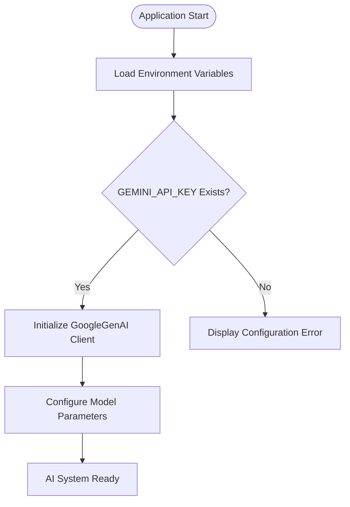
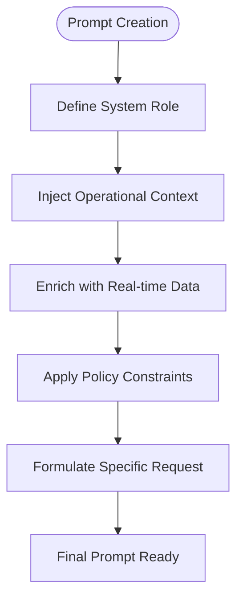
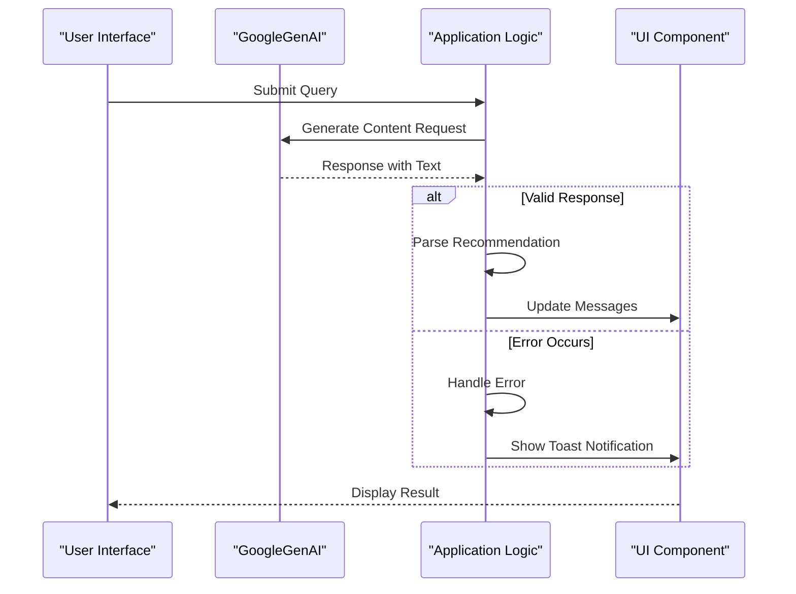
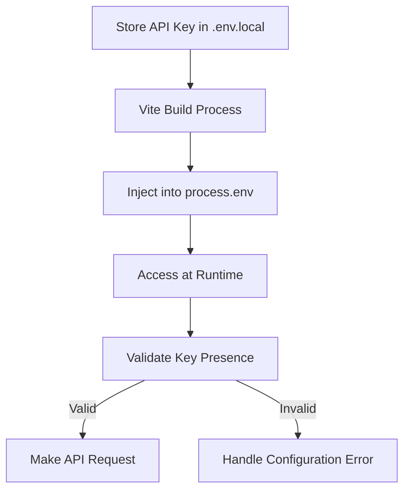
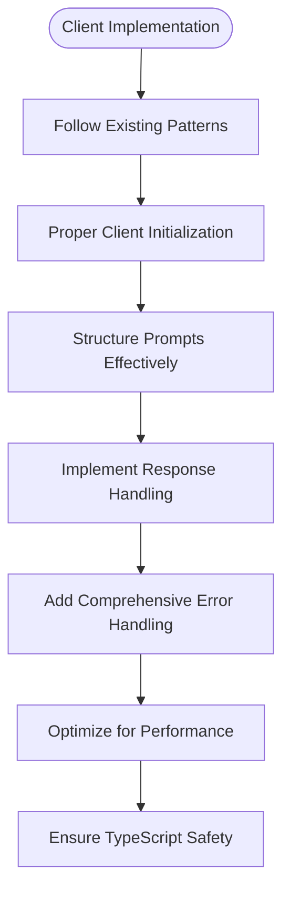
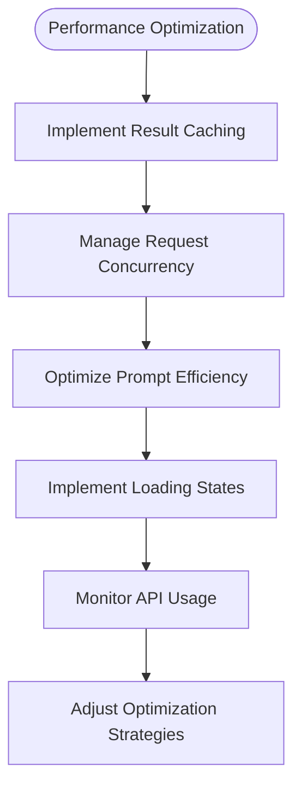

# Google AI/ML Integration

<cite>
**Referenced Files in This Document**   
- [AiAssistant.tsx](file://components/AiAssistant.tsx)
- [policyEngine.ts](file://utils/policyEngine.ts)
- [vite.config.ts](file://vite.config.ts)
- [README.md](file://README.md)
- [package.json](file://package.json)
</cite>

## Table of Contents
1. [Introduction](#introduction)
2. [Initialization and Environment Configuration](#initialization-and-environment-configuration)
3. [Prompt Formatting and Context Injection](#prompt-formatting-and-context-injection)
4. [Response Handling and Error Recovery](#response-handling-and-error-recovery)
5. [Authentication and Security](#authentication-and-security)
6. [Client Implementation and Debugging](#client-implementation-and-debugging)
7. [Performance Optimization](#performance-optimization)

## Introduction
This document provides comprehensive API documentation for the Google AI/ML integration via @google/genai in the school management system. The integration powers intelligent substitution recommendations and strategic decision support through the AI Assistant component. The system leverages Gemini AI to analyze real-time operational data, historical patterns, and institutional policies to generate context-aware recommendations for staff substitution and resource allocation.

## Initialization and Environment Configuration
The Google AI integration is initialized through environment variable configuration and runtime setup. The GEMINI_API_KEY must be configured in the .env.local file for authentication with the Google AI service. During application startup, the Vite configuration loads this environment variable and makes it available to the client-side application through process.env.API_KEY.

The initialization process follows these steps:
1. Set the GEMINI_API_KEY in .env.local
2. Import the GoogleGenAI client from @google/genai
3. Instantiate the AI client with the API key during runtime
4. Configure the model parameters for content generation

**Diagram sources**
- [vite.config.ts](file://vite.config.ts#L5-L23)
- [AiAssistant.tsx](file://components/AiAssistant.tsx#L25-L30)

**Section sources**
- [README.md](file://README.md#L18)
- [vite.config.ts](file://vite.config.ts#L13-L16)
- [AiAssistant.tsx](file://components/AiAssistant.tsx#L25-L30)

## Prompt Formatting and Context Injection
The system employs sophisticated prompt formatting strategies to generate intelligent substitution recommendations. The prompt engineering approach combines constraint-based prompting with dynamic context injection to ensure relevant and actionable responses.

Context injection includes real-time operational data such as:
- Current date and day of week
- Active absences for the day
- Completed substitutions
- Staff reliability metrics
- Recent activity logs (last 5 substitutions)

The prompt structure follows a systematic approach:
1. Establish system role and identity
2. Inject current operational context
3. Include recent activity patterns
4. Apply institutional policies and constraints
5. Request specific, actionable recommendations

**Diagram sources**
- [AiAssistant.tsx](file://components/AiAssistant.tsx#L31-L48)
- [policyEngine.ts](file://utils/policyEngine.ts#L75-L202)

**Section sources**
- [AiAssistant.tsx](file://components/AiAssistant.tsx#L31-L48)
- [policyEngine.ts](file://utils/policyEngine.ts#L75-L202)

## Response Handling and Error Recovery
The system implements robust response handling mechanisms to process AI-generated content and recover from potential errors. The response parsing logic extracts meaningful recommendations from the AI output and integrates them into the application workflow.

Key aspects of response handling include:
- Validation of AI response structure
- Extraction of substitution recommendations
- Integration with the substitution logging system
- User interface updates with AI suggestions
- Error recovery for malformed or incomplete responses

The error recovery strategy follows a tiered approach:
1. Catch network and API errors
2. Handle empty or invalid responses
3. Provide fallback recommendations
4. Log errors for debugging
5. Notify users of AI system status

**Diagram sources**
- [AiAssistant.tsx](file://components/AiAssistant.tsx#L43-L56)
- [AbsenceForm.tsx](file://components/AbsenceForm.tsx#L429-L439)

**Section sources**
- [AiAssistant.tsx](file://components/AiAssistant.tsx#L43-L56)
- [AbsenceForm.tsx](file://components/AbsenceForm.tsx#L429-L439)

## Authentication and Security
The authentication mechanism for the Google AI integration relies on API key-based authentication with environmental protection measures. The GEMINI_API_KEY serves as the primary authentication credential, which must be kept confidential to prevent unauthorized access and potential billing implications.

Security best practices implemented in the system include:
- Storing API keys in environment variables (.env.local)
- Excluding environment files from version control via .gitignore
- Using Vite's environment loading mechanism to inject variables at build time
- Validating the presence of API keys before making requests
- Providing clear error messages for configuration issues

Rate limiting considerations are addressed through:
- Monitoring API usage patterns
- Implementing request queuing if necessary
- Providing fallback mechanisms during high-load periods
- Caching frequent queries to reduce API calls

**Diagram sources**
- [vite.config.ts](file://vite.config.ts#L5-L16)
- [README.md](file://README.md#L18)
- [AiAssistant.tsx](file://components/AiAssistant.tsx#L26)

**Section sources**
- [vite.config.ts](file://vite.config.ts#L5-L16)
- [README.md](file://README.md#L18)
- [AiAssistant.tsx](file://components/AiAssistant.tsx#L26)

## Client Implementation and Debugging
Client implementation guidelines provide developers with best practices for extending AI capabilities and debugging issues. The AiAssistant component serves as the primary interface for Google AI integration, offering a reusable pattern for AI-powered features.

Key implementation guidelines include:
- Proper initialization of the GoogleGenAI client
- Structured prompt engineering with context injection
- Error handling and user feedback mechanisms
- Performance optimization through request management
- Type safety with TypeScript interfaces

Debugging tips for AI integration:
- Enable request/response logging to trace API interactions
- Monitor network requests in browser developer tools
- Check environment variable configuration
- Validate API key permissions and quotas
- Test with simplified prompts to isolate issues
- Use console logging to trace execution flow

**Diagram sources**
- [AiAssistant.tsx](file://components/AiAssistant.tsx#L1-L99)
- [types.ts](file://types.ts#L1-L382)

**Section sources**
- [AiAssistant.tsx](file://components/AiAssistant.tsx#L1-L99)
- [types.ts](file://types.ts#L1-L382)

## Performance Optimization
The system implements several performance optimization techniques to ensure efficient AI integration and responsive user experience. These optimizations address both client-side performance and API usage efficiency.

Key optimization strategies include:
- Caching AI results to avoid redundant requests
- Managing request concurrency to prevent overwhelming the API
- Implementing loading states to improve perceived performance
- Optimizing prompt size to reduce processing time
- Using efficient data structures for context injection

Caching mechanisms are particularly important for:
- Frequently requested operational summaries
- Historical pattern analyses
- Common substitution scenarios
- Repeated queries on the same data set

Request concurrency management ensures that:
- Multiple simultaneous requests are properly queued
- Rate limits are respected
- User interface remains responsive
- Error recovery is consistent across requests

**Diagram sources**
- [AiAssistant.tsx](file://components/AiAssistant.tsx#L22-L23)
- [utils.ts](file://utils.ts#L326-L445)

**Section sources**
- [AiAssistant.tsx](file://components/AiAssistant.tsx#L22-L23)
- [utils.ts](file://utils.ts#L326-L445)