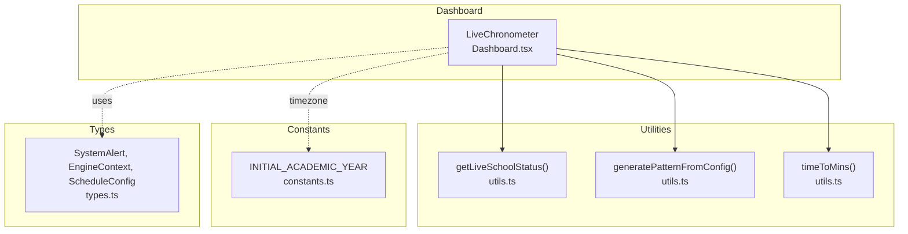
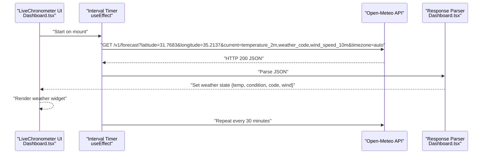
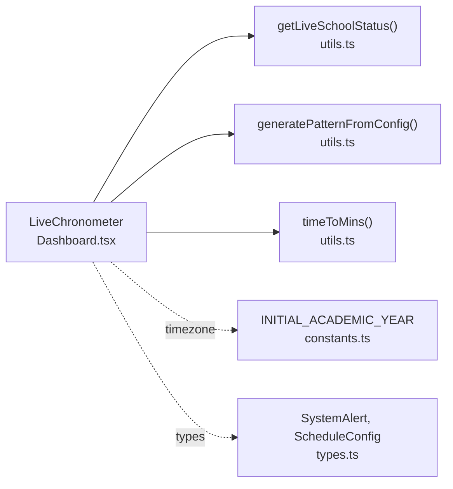
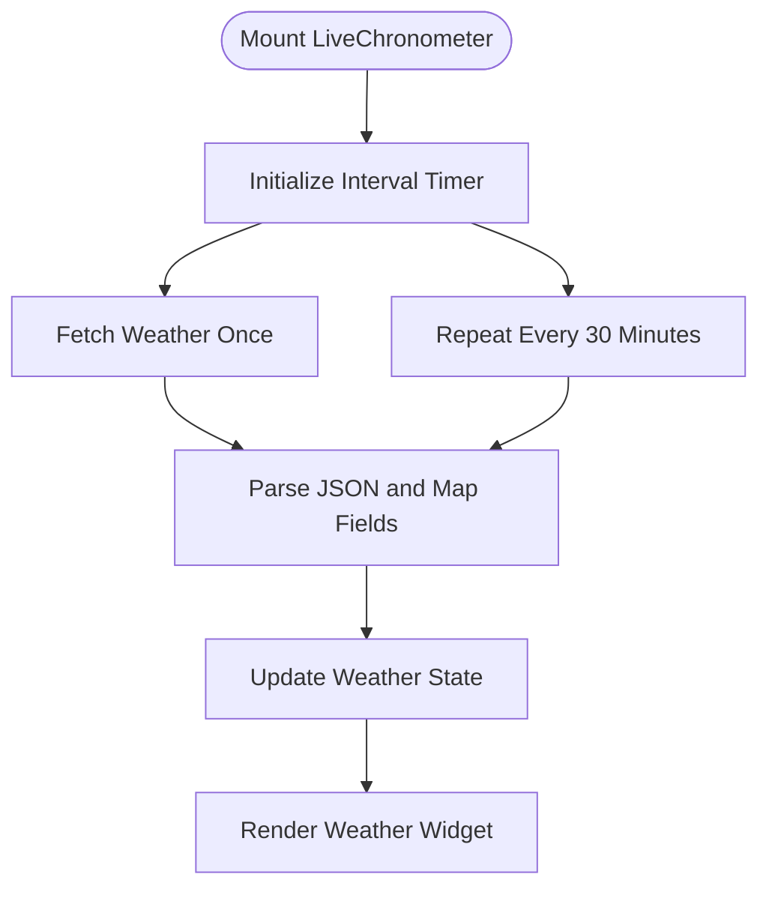

# Open-Meteo Weather API Integration

<cite>
**Referenced Files in This Document**
- [Dashboard.tsx](file://components/Dashboard.tsx)
- [utils.ts](file://utils.ts)
- [constants.ts](file://constants.ts)
- [types.ts](file://types.ts)
</cite>

## Table of Contents
1. [Introduction](#introduction)
2. [Project Structure](#project-structure)
3. [Core Components](#core-components)
4. [Architecture Overview](#architecture-overview)
5. [Detailed Component Analysis](#detailed-component-analysis)
6. [Dependency Analysis](#dependency-analysis)
7. [Performance Considerations](#performance-considerations)
8. [Troubleshooting Guide](#troubleshooting-guide)
9. [Conclusion](#conclusion)
10. [Appendices](#appendices)

## Introduction
This document describes the Open-Meteo Weather API integration implemented in the Live Chronometer component of the Dashboard. It covers the HTTP request pattern, endpoint construction, query parameters, polling strategy, response schema, data extraction, error handling, and how weather data influences UI rendering. It also includes security considerations, rate limiting implications, fallback behavior, and debugging guidance.

## Project Structure
The weather integration resides in the Live Chronometer component within the Dashboard. The component performs periodic weather fetches and renders current temperature, weather condition, and wind speed in the UI. Utility functions support schedule pattern generation and live status calculation, which indirectly influence how weather impacts operational decisions.

**Diagram sources**
- [Dashboard.tsx](file://components/Dashboard.tsx#L1-L120)
- [utils.ts](file://utils.ts#L183-L223)
- [utils.ts](file://utils.ts#L85-L115)
- [utils.ts](file://utils.ts#L74-L83)
- [constants.ts](file://constants.ts#L23-L30)
- [types.ts](file://types.ts#L55-L75)
- [types.ts](file://types.ts#L218-L228)

**Section sources**
- [Dashboard.tsx](file://components/Dashboard.tsx#L1-L120)
- [utils.ts](file://utils.ts#L74-L115)
- [constants.ts](file://constants.ts#L23-L30)
- [types.ts](file://types.ts#L55-L75)

## Core Components
- LiveChronometer: Renders the live clock, timeline, and weather widget. It fetches weather data from Open-Meteo and updates the UI accordingly.
- Weather widget: Displays temperature, localized Arabic condition, and wind speed.
- Polling mechanism: Fetches weather data on mount and repeats every 30 minutes.
- Fallback behavior: Uses default weather values if fetch fails.

Key implementation references:
- Weather fetch and parsing: [Dashboard.tsx](file://components/Dashboard.tsx#L50-L78)
- Weather UI rendering: [Dashboard.tsx](file://components/Dashboard.tsx#L313-L328)
- Weather icon mapping: [Dashboard.tsx](file://components/Dashboard.tsx#L149-L156)

**Section sources**
- [Dashboard.tsx](file://components/Dashboard.tsx#L50-L78)
- [Dashboard.tsx](file://components/Dashboard.tsx#L149-L156)
- [Dashboard.tsx](file://components/Dashboard.tsx#L313-L328)

## Architecture Overview
The weather integration is a client-side HTTP call within the LiveChronometer component. It does not depend on backend services and uses a public weather API. The fetched data is stored in component state and rendered in the weather widget. The schedule utilities are used for live status calculations and do not directly consume weather data.

**Diagram sources**
- [Dashboard.tsx](file://components/Dashboard.tsx#L50-L78)

## Detailed Component Analysis

### HTTP Request Pattern and Endpoint Construction
- Endpoint: https://api.open-meteo.com/v1/forecast
- Query parameters:
  - latitude: 31.7683
  - longitude: 35.2137
  - current: temperature_2m, weather_code, wind_speed_10m
  - timezone: auto
- Method: GET
- Headers: None explicitly set; relies on default browser behavior
- Authentication: None (public endpoint)

Notes:
- Coordinates are hardcoded in the component.
- Timezone alignment uses the API’s auto feature.

**Section sources**
- [Dashboard.tsx](file://components/Dashboard.tsx#L53-L55)

### Polling Frequency Strategy
- Initial fetch: On component mount
- Repeat interval: Every 30 minutes (30 * 60 * 1000 ms)
- Cleanup: Clears timer on unmount

Implications:
- Reduces API load compared to frequent polling.
- Provides near-real-time weather updates suitable for UI display.

**Section sources**
- [Dashboard.tsx](file://components/Dashboard.tsx#L75-L78)

### Response Schema and Data Extraction
Expected response shape (from the parser):
- current.temperature_2m: numeric
- current.weather_code: numeric
- current.wind_speed_10m: numeric

Extraction steps:
- Round temperature and wind speed to integers.
- Map weather_code to localized Arabic condition string.
- Store in state: { temp, condition, code, wind }.

Weather code mapping:
- 0–3: Partly cloudy
- 45–48: Foggy
- 51–67: Drizzle/rain
- 71–77: Snow
- 80–82: Heavy showers
- 95+: Storm

Rendering:
- Temperature and condition displayed in the weather card.
- Wind speed displayed in the weather card.
- Icon selected based on weather_code.

**Section sources**
- [Dashboard.tsx](file://components/Dashboard.tsx#L58-L70)
- [Dashboard.tsx](file://components/Dashboard.tsx#L149-L156)
- [Dashboard.tsx](file://components/Dashboard.tsx#L313-L328)

### Error Handling
- Network errors: Silently ignored; component remains in previous state.
- JSON parsing errors: Suppressed; no error logging.
- Fallback: Default weather state initialized on mount with sensible defaults.

Security note: The component does not log or expose sensitive information.

**Section sources**
- [Dashboard.tsx](file://components/Dashboard.tsx#L50-L74)

### Influence on UI and Operational Decisions
- UI indicator: Weather widget displays current conditions and wind speed.
- Iconography: Weather icon changes based on weather_code.
- Operational mode decisions: The weather data itself is not consumed by the scheduling engine. However, the system defines operational modes (e.g., rainy mode) that could incorporate weather conditions in future enhancements.

Relevant operational modes (not directly consuming weather API):
- Rainy mode: Adjusts break actions and merging strategies.
- Emergency mode: Relaxes rules for coverage.
- Exam/trip/holiday modes: Context-dependent operational adjustments.

**Section sources**
- [constants.ts](file://constants.ts#L129-L168)
- [constants.ts](file://constants.ts#L297-L336)
- [constants.ts](file://constants.ts#L169-L248)
- [constants.ts](file://constants.ts#L237-L296)
- [constants.ts](file://constants.ts#L337-L385)

## Dependency Analysis
- LiveChronometer depends on:
  - utils.getLiveSchoolStatus for live status calculations.
  - utils.generatePatternFromConfig for schedule pattern generation.
  - utils.timeToMins for time conversions.
  - constants.INITIAL_ACADEMIC_YEAR for timezone context.
  - types.SystemAlert and types.ScheduleConfig for prop typing.

**Diagram sources**
- [Dashboard.tsx](file://components/Dashboard.tsx#L1-L120)
- [utils.ts](file://utils.ts#L183-L223)
- [utils.ts](file://utils.ts#L85-L115)
- [utils.ts](file://utils.ts#L74-L83)
- [constants.ts](file://constants.ts#L23-L30)
- [types.ts](file://types.ts#L55-L75)
- [types.ts](file://types.ts#L218-L228)

**Section sources**
- [Dashboard.tsx](file://components/Dashboard.tsx#L1-L120)
- [utils.ts](file://utils.ts#L74-L115)
- [utils.ts](file://utils.ts#L183-L223)
- [constants.ts](file://constants.ts#L23-L30)
- [types.ts](file://types.ts#L55-L75)

## Performance Considerations
- Polling interval: 30 minutes balances freshness with minimal network overhead.
- Parsing cost: Minimal; only rounds numeric fields and maps a small integer code.
- Rendering cost: Lightweight; uses memoized computations for icons and progress.

Recommendations:
- Keep polling interval consistent to avoid excessive requests.
- Consider caching at the browser level if needed, though current approach is sufficient for UI display.

[No sources needed since this section provides general guidance]

## Troubleshooting Guide
Common issues and resolutions:
- Weather widget shows default values:
  - Verify network connectivity and API availability.
  - Check browser console for fetch errors (silent handling currently).
- Incorrect timezone:
  - Confirm timezone setting is auto and the device/system timezone is correct.
- Weather icon not updating:
  - Ensure weather_code falls within expected ranges mapped by the component.

Debugging steps:
- Open browser developer tools (Network tab).
  - Observe the GET request to the Open-Meteo endpoint.
  - Inspect response payload for current fields.
- Console tab:
  - Look for suppressed exceptions (parser catches and suppresses errors).
- Throttling:
  - Reduce polling frequency temporarily to test stability.

Testing under various conditions:
- Simulate network failure: Disable network or block the API endpoint.
- Test different weather_code values to verify icon mapping.
- Validate localization of Arabic condition strings.

**Section sources**
- [Dashboard.tsx](file://components/Dashboard.tsx#L50-L78)
- [Dashboard.tsx](file://components/Dashboard.tsx#L149-L156)

## Security Considerations
- Public API: The integration uses a public weather API without authentication.
- Client-side exposure: Coordinates and query parameters are visible in the browser.
- Recommendation: For production deployments, consider:
  - Using a reverse proxy or server-side wrapper to hide credentials and origin.
  - Implementing rate limiting at the proxy layer.
  - Adding request validation and sanitization.

[No sources needed since this section provides general guidance]

## Rate Limiting Implications
- Current client-side polling: 1 request on mount + 1 every 30 minutes.
- Impact: Low load on the client; potential impact depends on concurrent users.
- Recommendations:
  - Centralize weather fetching behind a proxy with shared caching.
  - Enforce per-client rate limits at the proxy.
  - Consider batching requests across multiple dashboards.

[No sources needed since this section provides general guidance]

## Fallback Behavior During Service Outages
- Default weather state: Initialized on mount with a warm default (e.g., sunny).
- Graceful degradation: UI remains functional; weather data simply does not update.
- Recovery: Automatic retry on subsequent intervals.

**Section sources**
- [Dashboard.tsx](file://components/Dashboard.tsx#L40-L45)
- [Dashboard.tsx](file://components/Dashboard.tsx#L50-L74)

## Conclusion
The Open-Meteo integration in the Live Chronometer provides a lightweight, resilient weather display. It uses a simple GET request with auto timezone alignment, rounds up to a 30-minute polling cadence, and gracefully degrades to default values on failure. While the weather data does not directly drive operational modes, the system’s mode definitions (e.g., rainy mode) indicate potential future integration points for weather-aware scheduling.

[No sources needed since this section summarizes without analyzing specific files]

## Appendices

### API Definition Summary
- Endpoint: https://api.open-meteo.com/v1/forecast
- Method: GET
- Query parameters:
  - latitude: 31.7683
  - longitude: 35.2137
  - current: temperature_2m, weather_code, wind_speed_10m
  - timezone: auto
- Response fields used:
  - current.temperature_2m
  - current.weather_code
  - current.wind_speed_10m

**Section sources**
- [Dashboard.tsx](file://components/Dashboard.tsx#L53-L55)

### Data Flow Diagram (Code-Level)

**Diagram sources**
- [Dashboard.tsx](file://components/Dashboard.tsx#L50-L78)