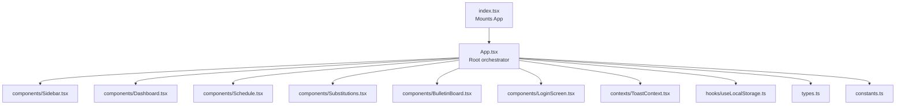
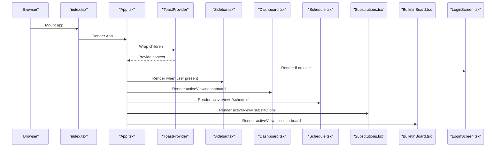
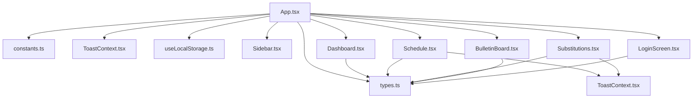

# Component Architecture

<cite>
**Referenced Files in This Document**
- [App.tsx](file://App.tsx)
- [index.tsx](file://index.tsx)
- [Sidebar.tsx](file://components/Sidebar.tsx)
- [Dashboard.tsx](file://components/Dashboard.tsx)
- [Schedule.tsx](file://components/Schedule.tsx)
- [Substitutions.tsx](file://components/Substitutions.tsx)
- [BulletinBoard.tsx](file://components/BulletinBoard.tsx)
- [LoginScreen.tsx](file://components/LoginScreen.tsx)
- [ToastContext.tsx](file://contexts/ToastContext.tsx)
- [useLocalStorage.ts](file://hooks/useLocalStorage.ts)
- [types.ts](file://types.ts)
- [constants.ts](file://constants.ts)
</cite>

## Table of Contents
1. [Introduction](#introduction)
2. [Project Structure](#project-structure)
3. [Core Components](#core-components)
4. [Architecture Overview](#architecture-overview)
5. [Detailed Component Analysis](#detailed-component-analysis)
6. [Dependency Analysis](#dependency-analysis)
7. [Performance Considerations](#performance-considerations)
8. [Troubleshooting Guide](#troubleshooting-guide)
9. [Conclusion](#conclusion)

## Introduction
This document describes the component architecture of the React application centered around App.tsx. It explains how state is orchestrated at the root level, how data flows unidirectionally down to child components, and how configuration-driven logic is implemented. The major views—Sidebar, Dashboard, Schedule, and Substitutions—are documented alongside their relationships and integration patterns with context providers and custom hooks.

## Project Structure
The application follows a feature-based component organization under the components/ directory, with shared utilities in hooks/, contexts/, and typed data in types.ts and constants.ts. The root entry point mounts App.tsx, which manages global state and routing.

**Diagram sources**
- [index.tsx](file://index.tsx#L1-L17)
- [App.tsx](file://App.tsx#L1-L120)
- [Sidebar.tsx](file://components/Sidebar.tsx#L1-L120)
- [Dashboard.tsx](file://components/Dashboard.tsx#L1-L120)
- [Schedule.tsx](file://components/Schedule.tsx#L1-L120)
- [Substitutions.tsx](file://components/Substitutions.tsx#L1-L120)
- [BulletinBoard.tsx](file://components/BulletinBoard.tsx#L1-L120)
- [LoginScreen.tsx](file://components/LoginScreen.tsx#L1-L60)
- [ToastContext.tsx](file://contexts/ToastContext.tsx#L1-L56)
- [useLocalStorage.ts](file://hooks/useLocalStorage.ts#L1-L23)
- [types.ts](file://types.ts#L1-L60)
- [constants.ts](file://constants.ts#L60-L120)

**Section sources**
- [index.tsx](file://index.tsx#L1-L17)
- [App.tsx](file://App.tsx#L1-L120)

## Core Components
- App.tsx: Orchestrates global state, routing, authentication, and renders the active view. It also provides a ToastProvider and integrates configuration-driven logic via engineContext and scheduleConfig.
- Sidebar.tsx: Navigation drawer that controls active view and exposes system indicators and actions.
- Dashboard.tsx: Primary landing view focused on live chronometer and school status.
- Schedule.tsx: Timetable management with filtering, transposition, and mode-aware rendering.
- Substitutions.tsx: Absence handling and substitution management with resource pools and daily coverage analytics.
- BulletinBoard.tsx: Full-screen bulletin board for real-time schedule monitoring and announcements.
- LoginScreen.tsx: Authentication screen invoked when no user is present.
- ToastContext.tsx: Global toast notifications provider and hook.
- useLocalStorage.ts: Custom hook for persisting state to localStorage.
- types.ts/constants.ts: Shared types and initial configuration.

**Section sources**
- [App.tsx](file://App.tsx#L36-L120)
- [Sidebar.tsx](file://components/Sidebar.tsx#L27-L120)
- [Dashboard.tsx](file://components/Dashboard.tsx#L378-L417)
- [Schedule.tsx](file://components/Schedule.tsx#L14-L60)
- [Substitutions.tsx](file://components/Substitutions.tsx#L20-L60)
- [BulletinBoard.tsx](file://components/BulletinBoard.tsx#L156-L220)
- [LoginScreen.tsx](file://components/LoginScreen.tsx#L1-L60)
- [ToastContext.tsx](file://contexts/ToastContext.tsx#L1-L56)
- [useLocalStorage.ts](file://hooks/useLocalStorage.ts#L1-L23)
- [types.ts](file://types.ts#L1-L60)
- [constants.ts](file://constants.ts#L60-L120)

## Architecture Overview
The system follows a unidirectional data flow:
- App.tsx holds all state and passes it down as props to child components.
- Child components receive props and trigger callbacks upward to update state in App.tsx.
- Context providers (ToastProvider) encapsulate cross-cutting concerns like notifications.
- Custom hooks (useLocalStorage) abstract persistence and rehydration logic.

**Diagram sources**
- [index.tsx](file://index.tsx#L1-L17)
- [App.tsx](file://App.tsx#L228-L444)
- [ToastContext.tsx](file://contexts/ToastContext.tsx#L17-L56)
- [Sidebar.tsx](file://components/Sidebar.tsx#L108-L253)
- [Dashboard.tsx](file://components/Dashboard.tsx#L378-L417)
- [Schedule.tsx](file://components/Schedule.tsx#L264-L333)
- [Substitutions.tsx](file://components/Substitutions.tsx#L44-L120)
- [BulletinBoard.tsx](file://components/BulletinBoard.tsx#L334-L400)
- [LoginScreen.tsx](file://components/LoginScreen.tsx#L1-L60)

## Detailed Component Analysis

### App.tsx: Root Orchestrator
- State orchestration: Manages employees, classes, lessons, scheduleConfig, roles, absences, engineContext, calendar-related entities, and UI flags (activeView, sidebarOpen, isFlashAlertMode, etc.).
- Routing: Renders the active view based on activeView and handles kiosk mode for bulletin board.
- Authentication: Provides handleLogin and handleLogout, persists user to localStorage, and redirects based on role.
- Configuration-driven logic: Integrates engineContext for mode toggling and smart scheduling behavior.
- Data flow: Props are passed down to child components (e.g., scheduleConfig, absences, engineContext) and callbacks are used to update state.

Examples of state propagation:
- Passing scheduleConfig and absences to Dashboard and Schedule.
- Passing engineContext and toggling modes to Schedule and Substitutions.
- Passing calendar-related arrays to Calendar modules.

Integration patterns:
- ToastProvider wraps the app for global notifications.
- useLocalStorage hook is used for all persisted state.
- Custom types and constants define shapes and defaults.

**Section sources**
- [App.tsx](file://App.tsx#L36-L120)
- [App.tsx](file://App.tsx#L140-L176)
- [App.tsx](file://App.tsx#L228-L444)
- [ToastContext.tsx](file://contexts/ToastContext.tsx#L17-L56)
- [useLocalStorage.ts](file://hooks/useLocalStorage.ts#L1-L23)
- [types.ts](file://types.ts#L1-L60)
- [constants.ts](file://constants.ts#L60-L120)

### Sidebar.tsx: Navigation and System Indicators
- Receives active view, open state, and handlers to update them.
- Exposes system alerts and uncovered counts via indicators.
- Provides navigation to views and admin-only actions.
- Uses scheduleConfig for branding and currentUser for role-based visibility.

**Section sources**
- [Sidebar.tsx](file://components/Sidebar.tsx#L27-L120)
- [Sidebar.tsx](file://components/Sidebar.tsx#L120-L253)

### Dashboard.tsx: Live Chronometer and Status
- Focuses on live school status, weather, upcoming events, and timeline visualization.
- Receives scheduleConfig, engineContext, absences, substitutionLogs, employees, events, and navigation callbacks.
- Implements memoization and derived computations for efficient rendering.

**Section sources**
- [Dashboard.tsx](file://components/Dashboard.tsx#L1-L120)
- [Dashboard.tsx](file://components/Dashboard.tsx#L378-L417)

### Schedule.tsx: Timetable Management
- Supports class/teacher/subject views, transposition, filtering, and mode-aware rendering.
- Uses engineContext to highlight active modes affecting periods.
- Resolves layered content considering absences, substitutions, and calendar events.
- Integrates with calendar and mode toggling.

**Section sources**
- [Schedule.tsx](file://components/Schedule.tsx#L14-L60)
- [Schedule.tsx](file://components/Schedule.tsx#L119-L170)
- [Schedule.tsx](file://components/Schedule.tsx#L170-L255)
- [Schedule.tsx](file://components/Schedule.tsx#L256-L333)

### Substitutions.tsx: Absence Handling and Coverage
- Manages daily absences, available internal/external resources, and substitution logs.
- Provides quick actions to edit absences, cancel assignments, and manage a global resource pool.
- Computes uncovered lessons and displays coverage statistics.

**Section sources**
- [Substitutions.tsx](file://components/Substitutions.tsx#L20-L60)
- [Substitutions.tsx](file://components/Substitutions.tsx#L120-L210)
- [Substitutions.tsx](file://components/Substitutions.tsx#L210-L330)
- [Substitutions.tsx](file://components/Substitutions.tsx#L330-L470)

### BulletinBoard.tsx: Full-Screen Monitoring
- Displays live status, available resources, staff meetings, absences, and a compressed schedule grid.
- Supports date navigation and class ordering persistence.
- Integrates with engineContext modes and calendar events.

**Section sources**
- [BulletinBoard.tsx](file://components/BulletinBoard.tsx#L156-L220)
- [BulletinBoard.tsx](file://components/BulletinBoard.tsx#L281-L330)
- [BulletinBoard.tsx](file://components/BulletinBoard.tsx#L492-L660)

### LoginScreen.tsx: Authentication
- Handles form submission, validation, and async login callback.
- Integrates with App’s handleLogin to redirect and set user state.

**Section sources**
- [LoginScreen.tsx](file://components/LoginScreen.tsx#L1-L60)
- [App.tsx](file://App.tsx#L140-L176)

### ToastContext.tsx and useLocalStorage.ts
- ToastProvider supplies a global addToast function via useToast.
- useLocalStorage abstracts localStorage persistence and rehydration.

**Section sources**
- [ToastContext.tsx](file://contexts/ToastContext.tsx#L1-L56)
- [useLocalStorage.ts](file://hooks/useLocalStorage.ts#L1-L23)

## Dependency Analysis
The following diagram shows key dependencies among major components and shared modules:

**Diagram sources**
- [App.tsx](file://App.tsx#L1-L120)
- [types.ts](file://types.ts#L1-L60)
- [constants.ts](file://constants.ts#L60-L120)
- [ToastContext.tsx](file://contexts/ToastContext.tsx#L1-L56)
- [useLocalStorage.ts](file://hooks/useLocalStorage.ts#L1-L23)
- [Sidebar.tsx](file://components/Sidebar.tsx#L1-L120)
- [Dashboard.tsx](file://components/Dashboard.tsx#L1-L120)
- [Schedule.tsx](file://components/Schedule.tsx#L1-L120)
- [Substitutions.tsx](file://components/Substitutions.tsx#L1-L120)
- [BulletinBoard.tsx](file://components/BulletinBoard.tsx#L1-L120)
- [LoginScreen.tsx](file://components/LoginScreen.tsx#L1-L60)

**Section sources**
- [App.tsx](file://App.tsx#L1-L120)
- [types.ts](file://types.ts#L1-L60)
- [constants.ts](file://constants.ts#L60-L120)
- [ToastContext.tsx](file://contexts/ToastContext.tsx#L1-L56)
- [useLocalStorage.ts](file://hooks/useLocalStorage.ts#L1-L23)

## Performance Considerations
- Memoization: Components use useMemo for derived data (e.g., Dashboard timeline, Schedule visibleDays, Substitutions availableInternals) to minimize recomputation.
- Efficient rendering: Large tables (Schedule, BulletinBoard) use virtualized-like strategies (scroll containers) and conditional rendering to reduce DOM overhead.
- Local storage persistence: useLocalStorage avoids unnecessary writes and parses only once per mount.
- Conditional rendering: App renders only the active view and optional overlays (e.g., ModeConfigModal, ExcelWizard) to limit DOM size.

[No sources needed since this section provides general guidance]

## Troubleshooting Guide
- Authentication issues: Verify handleLogin logic and localStorage keys. Ensure currentUser is persisted and restored on mount.
- State not persisting: Confirm useLocalStorage hook is used consistently and localStorage is accessible.
- Toast not appearing: Ensure ToastProvider wraps the app and useToast is used within provider scope.
- View not updating: Check activeView transitions and prop forwarding to child components.

**Section sources**
- [App.tsx](file://App.tsx#L134-L176)
- [useLocalStorage.ts](file://hooks/useLocalStorage.ts#L1-L23)
- [ToastContext.tsx](file://contexts/ToastContext.tsx#L1-L56)
- [LoginScreen.tsx](file://components/LoginScreen.tsx#L1-L60)

## Conclusion
The component architecture centers on App.tsx as the single source of truth for state and routing. Unidirectional data flow ensures predictable updates, while configuration-driven logic powered by engineContext enables dynamic behavior across views. Sidebar provides navigation, Dashboard offers a live overview, Schedule manages timetables, and Substitutions handles absence and coverage. Context providers and custom hooks encapsulate cross-cutting concerns, keeping components focused and reusable.