# Dashboard Component

<cite>
**Referenced Files in This Document**
- [Dashboard.tsx](file://components/Dashboard.tsx)
- [App.tsx](file://App.tsx)
- [Schedule.tsx](file://components/Schedule.tsx)
- [Substitutions.tsx](file://components/Substitutions.tsx)
- [utils.ts](file://utils.ts)
- [constants.ts](file://constants.ts)
- [types.ts](file://types.ts)
</cite>

## Table of Contents
1. [Introduction](#introduction)
2. [Project Structure](#project-structure)
3. [Core Components](#core-components)
4. [Architecture Overview](#architecture-overview)
5. [Detailed Component Analysis](#detailed-component-analysis)
6. [Dependency Analysis](#dependency-analysis)
7. [Performance Considerations](#performance-considerations)
8. [Troubleshooting Guide](#troubleshooting-guide)
9. [Conclusion](#conclusion)
10. [Appendices](#appendices)

## Introduction
The Dashboard component serves as the primary landing view of the application, delivering a real-time overview of school operations. It integrates multiple data visualizations, weather information, and system alerts into a cohesive, full-screen Live Chronometer widget. The component receives operational data from App.tsx and orchestrates drill-down navigation to Schedule and Substitutions views. This document explains the implementation, data flow, composition, and best practices for extending the Dashboard.

## Project Structure
The Dashboard is implemented as a single-file React component with a memoized subcomponent for the Live Chronometer. It relies on shared types, constants, and utility functions for schedule computation and live status detection.

```mermaid
graph TB
App["App.tsx<br/>Root container and state"] --> Dashboard["Dashboard.tsx<br/>Primary landing view"]
Dashboard --> LiveChronometer["LiveChronometer (memo)<br/>Full-screen chronometer"]
LiveChronometer --> Utils["utils.ts<br/>getLiveSchoolStatus, generatePatternFromConfig, timeToMins"]
LiveChronometer --> Constants["constants.ts<br/>DAYS_AR"]
LiveChronometer --> Types["types.ts<br/>Employee, ClassItem, Lesson, AbsenceRecord, ScheduleConfig, SubstitutionLog, SystemAlert, CalendarEvent, EngineContext"]
App --> Schedule["Schedule.tsx<br/>Drill-down view"]
App --> Substitutions["Substitutions.tsx<br/>Drill-down view"]
```

**Diagram sources**
- [Dashboard.tsx](file://components/Dashboard.tsx#L1-L417)
- [App.tsx](file://App.tsx#L228-L313)
- [Schedule.tsx](file://components/Schedule.tsx#L1-L120)
- [Substitutions.tsx](file://components/Substitutions.tsx#L1-L120)
- [utils.ts](file://utils.ts#L74-L115)
- [constants.ts](file://constants.ts#L1-L10)
- [types.ts](file://types.ts#L1-L120)

**Section sources**
- [Dashboard.tsx](file://components/Dashboard.tsx#L1-L417)
- [App.tsx](file://App.tsx#L228-L313)

## Core Components
- Dashboard: Thin wrapper that renders the LiveChronometer with full-screen height and passes all props.
- LiveChronometer: Memoized widget that displays:
  - Real-time clock and school status (before, in-period, in-break, after, holiday)
  - Remaining minutes indicator and progress ring
  - Today’s absences count
  - Next break countdown
  - Upcoming calendar events
  - Weather widget (open-meteo API)
  - Vertical timeline of periods/breaks with auto-scroll to current slot
  - Navigation buttons to Calendar, Substitutions, Schedule, and Alerts

Key props received from App.tsx:
- employees, classes, lessons, scheduleConfig, absences, engineContext, substitutionLogs, events, systemAlerts
- onNavigateToView(view)
- onNavigateToSchedule(mode, id)

Navigation callbacks enable drill-down:
- onNavigateToView('calendar' | 'substitutions' | 'reports' | ...)
- onNavigateToSchedule('class' | 'teacher' | 'subject', id)

**Section sources**
- [Dashboard.tsx](file://components/Dashboard.tsx#L378-L417)
- [Dashboard.tsx](file://components/Dashboard.tsx#L1-L170)
- [App.tsx](file://App.tsx#L282-L284)

## Architecture Overview
The Dashboard is the central hub for operational awareness. App.tsx manages global state and routes to Dashboard as the default view. From Dashboard, users can navigate to Schedule and Substitutions via callback props. LiveChronometer encapsulates all visuals and live updates.

**Diagram sources**
- [App.tsx](file://App.tsx#L282-L284)
- [Dashboard.tsx](file://components/Dashboard.tsx#L378-L417)
- [utils.ts](file://utils.ts#L194-L223)
- [utils.ts](file://utils.ts#L85-L115)

## Detailed Component Analysis

### LiveChronometer Implementation
LiveChronometer is a memoized component that:
- Maintains a live time state and updates every second
- Fetches weather data from an external API with periodic retries and robust error handling
- Computes live school status and timeline from schedule configuration
- Renders:
  - Large digital clock and date
  - Circular progress ring indicating slot progress
  - Status label and countdown
  - Today’s absences card
  - Next break countdown card
  - Upcoming events list
  - Weather widget with condition icons
  - Vertical timeline of periods/breaks with auto-scroll to current slot
  - Navigation buttons for Calendar, Substitutions, Schedule, Alerts

**Diagram sources**
- [Dashboard.tsx](file://components/Dashboard.tsx#L1-L170)
- [utils.ts](file://utils.ts#L194-L223)
- [utils.ts](file://utils.ts#L85-L115)

**Section sources**
- [Dashboard.tsx](file://components/Dashboard.tsx#L1-L170)
- [utils.ts](file://utils.ts#L74-L115)
- [utils.ts](file://utils.ts#L194-L223)
- [constants.ts](file://constants.ts#L1-L10)

### Data Flow from App.tsx
App.tsx holds all application state and passes it to Dashboard. It also defines navigation callbacks:
- onNavigateToView(view): switches active view (e.g., 'calendar', 'substitutions')
- onNavigateToSchedule(mode, id): sets schedule filter and navigates to Schedule view

**Diagram sources**
- [App.tsx](file://App.tsx#L282-L284)
- [Dashboard.tsx](file://components/Dashboard.tsx#L378-L417)

**Section sources**
- [App.tsx](file://App.tsx#L282-L284)
- [Dashboard.tsx](file://components/Dashboard.tsx#L378-L417)

### Relationship with Schedule and Substitutions
- Schedule: The Dashboard’s “Schedule” button triggers onNavigateToSchedule with mode and id, which App.tsx uses to set scheduleFilter and navigate to the Schedule view. Schedule then computes layered content considering absences, substitutions, and calendar events.
- Substitutions: The Dashboard’s “Absences” button triggers onNavigateToView('substitutions'), navigating to the Substitutions view where absences and substitutions are managed.

**Diagram sources**
- [App.tsx](file://App.tsx#L282-L284)
- [Schedule.tsx](file://components/Schedule.tsx#L1-L120)
- [Substitutions.tsx](file://components/Substitutions.tsx#L1-L120)

**Section sources**
- [App.tsx](file://App.tsx#L282-L284)
- [Schedule.tsx](file://components/Schedule.tsx#L1-L120)
- [Substitutions.tsx](file://components/Substitutions.tsx#L1-L120)

### Data Structures and Complexity
- ScheduleConfig drives timeline generation and live status calculation.
- AbsenceRecord and SubstitutionLog inform absences count and substitution coverage.
- CalendarEvent feeds upcoming events list.
- EngineContext influences smart modes and timeline adjustments.

Complexity considerations:
- Timeline generation: O(P) where P is number of periods/breaks derived from ScheduleConfig
- Live status computation: O(P) to scan periods
- Upcoming events filtering/sorting: O(E log E) where E is number of events on or after today
- Weather fetch: O(1) network call with periodic retry

**Section sources**
- [utils.ts](file://utils.ts#L85-L115)
- [utils.ts](file://utils.ts#L194-L223)
- [types.ts](file://types.ts#L52-L116)

## Dependency Analysis
- Dashboard depends on:
  - utils.ts for schedule pattern generation and live status
  - constants.ts for localized day names
  - types.ts for shape of props and state
- App.tsx composes Dashboard and provides navigation callbacks and data
- Schedule and Substitutions are downstream consumers of shared data and navigation

**Diagram sources**
- [Dashboard.tsx](file://components/Dashboard.tsx#L1-L40)
- [App.tsx](file://App.tsx#L228-L313)
- [utils.ts](file://utils.ts#L1-L20)
- [constants.ts](file://constants.ts#L1-L10)
- [types.ts](file://types.ts#L1-L40)

**Section sources**
- [Dashboard.tsx](file://components/Dashboard.tsx#L1-L40)
- [App.tsx](file://App.tsx#L228-L313)

## Performance Considerations
- Memoization: LiveChronometer is wrapped with memo to prevent unnecessary re-renders.
- Efficient computations:
  - Use useMemo for timeline, upcoming events, and live status to avoid recomputation on every render.
  - Use refs to scroll to current slot only when timeline or current period changes.
- Network resilience:
  - Robust error handling for weather API with silent failure and periodic retry.
- Rendering optimization:
  - Virtualize or limit upcoming events list if data grows large.
  - Avoid heavy DOM in timeline nodes; keep hover effects minimal.

[No sources needed since this section provides general guidance]

## Troubleshooting Guide
Common issues and resolutions:
- Weather API failures:
  - Symptom: Weather widget shows default values or empty.
  - Cause: Network errors or API downtime.
  - Resolution: The component suppresses errors and retries periodically; ensure network connectivity and CORS policies.
- Timeline not scrolling to current slot:
  - Symptom: Current period not highlighted.
  - Cause: Ref not attached or current period not found.
  - Resolution: Verify timelineRef is mounted and liveStatus.currentPeriod is set; ensure scheduleConfig is valid.
- Incorrect live status:
  - Symptom: Wrong state or countdown.
  - Cause: Holidays list mismatch or invalid scheduleConfig.
  - Resolution: Confirm scheduleConfig.holidays includes the current day name and periodsPerDay is correct.
- Navigation not working:
  - Symptom: Clicking buttons does nothing.
  - Cause: Callbacks not passed or not bound.
  - Resolution: Ensure onNavigateToView and onNavigateToSchedule are provided by App.tsx and invoked from LiveChronometer.

**Section sources**
- [Dashboard.tsx](file://components/Dashboard.tsx#L45-L78)
- [Dashboard.tsx](file://components/Dashboard.tsx#L98-L106)
- [utils.ts](file://utils.ts#L194-L223)
- [App.tsx](file://App.tsx#L282-L284)

## Conclusion
The Dashboard component consolidates real-time school operations into a single, visually rich view. Its LiveChronometer subcomponent integrates time, schedule, weather, and events, while navigation callbacks enable seamless drill-down to Schedule and Substitutions. By leveraging memoization, computed values, and resilient network handling, it provides a responsive overview suitable for operational dashboards.

[No sources needed since this section summarizes without analyzing specific files]

## Appendices

### Best Practices for Extending the Dashboard
- Add new widgets as small, self-contained memoized components.
- Use useMemo for expensive computations and filter operations.
- Keep network calls isolated and guarded with error handling.
- Prefer passing callbacks from App.tsx to maintain separation of concerns.
- Use localized constants and types consistently across components.

[No sources needed since this section provides general guidance]