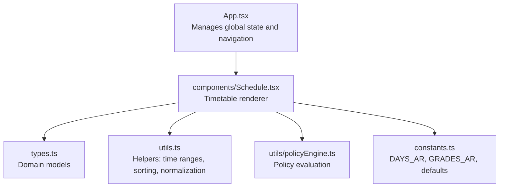
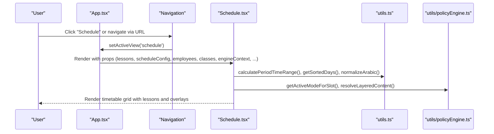
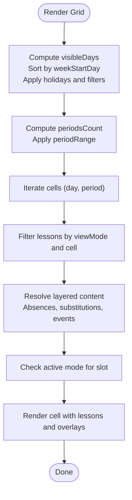
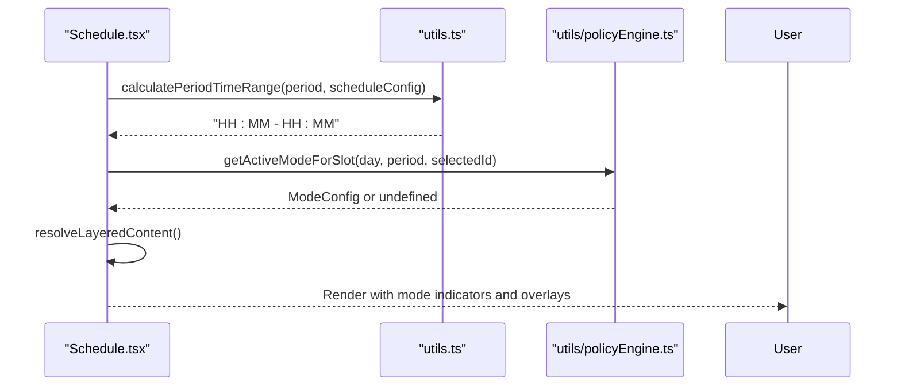
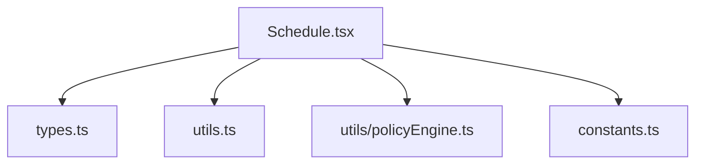

# Schedule Component

<cite>
**Referenced Files in This Document**
- [components/Schedule.tsx](file://components/Schedule.tsx)
- [App.tsx](file://App.tsx)
- [types.ts](file://types.ts)
- [utils.ts](file://utils.ts)
- [utils/policyEngine.ts](file://utils/policyEngine.ts)
- [constants.ts](file://constants.ts)
</cite>

## Table of Contents
1. [Introduction](#introduction)
2. [Project Structure](#project-structure)
3. [Core Components](#core-components)
4. [Architecture Overview](#architecture-overview)
5. [Detailed Component Analysis](#detailed-component-analysis)
6. [Dependency Analysis](#dependency-analysis)
7. [Performance Considerations](#performance-considerations)
8. [Troubleshooting Guide](#troubleshooting-guide)
9. [Conclusion](#conclusion)
10. [Appendices](#appendices)

## Introduction
This document explains the Schedule component responsible for timetable management. It covers how the component renders class schedules, teacher assignments, and subject blocks across different time periods. It documents the props it receives from App.tsx, the invocation relationship when activeView is set to schedule, the domain model of schedule data, filtering mechanisms, state management via callbacks, integration with the policy engine for mode-specific schedules, and common issues such as schedule conflicts and data synchronization.

## Project Structure
The Schedule component resides under components and integrates with App.tsx, types, utilities, and constants. App.tsx manages global state and passes props to Schedule, while utilities provide helpers for time ranges, sorting, normalization, and policy engine integration.

**Diagram sources**
- [App.tsx](file://App.tsx#L280-L310)
- [components/Schedule.tsx](file://components/Schedule.tsx#L14-L31)
- [types.ts](file://types.ts#L1-L120)
- [utils.ts](file://utils.ts#L176-L243)
- [utils/policyEngine.ts](file://utils/policyEngine.ts#L1-L60)
- [constants.ts](file://constants.ts#L1-L10)

**Section sources**
- [App.tsx](file://App.tsx#L280-L310)
- [components/Schedule.tsx](file://components/Schedule.tsx#L14-L31)

## Core Components
- Schedule component: Renders a timetable grid with lessons, integrates with policy engine modes, and supports filtering by class, teacher, or subject.
- App.tsx: Provides state (lessons, employees, classes, scheduleConfig, academicYear, patterns, holidays, overrides, events, engineContext) and navigation to the schedule view.
- Types: Defines domain models for lessons, schedule configuration, employees, classes, calendar events, substitutions, absences, and engine context.
- Utilities: Provide helpers for calculating period time ranges, sorting days, normalizing Arabic text, resolving days, and policy evaluation.
- Policy Engine: Evaluates policy rules and priority ladders to determine assignment feasibility and scores.

**Section sources**
- [components/Schedule.tsx](file://components/Schedule.tsx#L14-L31)
- [App.tsx](file://App.tsx#L36-L73)
- [types.ts](file://types.ts#L1-L120)
- [utils.ts](file://utils.ts#L176-L243)
- [utils/policyEngine.ts](file://utils/policyEngine.ts#L1-L60)

## Architecture Overview
The Schedule component is invoked when App.tsx sets activeView to schedule. It receives props including lessons, scheduleConfig, employees, classes, academicYear, patterns, holidays, overrides, events, engineContext, and callbacks for toggling modes and updating engineContext. Internally, it computes visible days, period ranges, and cell content based on view mode and filters. It also integrates with the policy engine to reflect mode-specific constraints and highlights.

**Diagram sources**
- [App.tsx](file://App.tsx#L280-L310)
- [components/Schedule.tsx](file://components/Schedule.tsx#L138-L254)
- [utils.ts](file://utils.ts#L176-L243)
- [utils/policyEngine.ts](file://utils/policyEngine.ts#L1-L60)

## Detailed Component Analysis

### Props and Invocation Relationship
- Props received by Schedule:
  - lessons: array of scheduled lessons
  - setLessons: callback to update lessons
  - scheduleConfig: school schedule configuration
  - employees: array of employees
  - classes: array of classes
  - initialFilter: optional filter { mode, id } to preselect view and entity
  - academicYear, patterns, holidays, overrides, events: contextual data
  - engineContext: active modes configuration
  - setEngineContext: callback to update engine context
  - onToggleMode: callback to toggle a mode
  - substitutionLogs, absences: substitution and absence records
- Invocation: App.tsx sets activeView to 'schedule' and passes props to Schedule. It also sets an initial filter for teacher view when a teacher logs in.

**Section sources**
- [components/Schedule.tsx](file://components/Schedule.tsx#L14-L31)
- [App.tsx](file://App.tsx#L160-L170)
- [App.tsx](file://App.tsx#L286-L288)

### Domain Model of Schedule Data
- Lesson: represents a scheduled slot with day, period, teacherId, classId, subject, and type.
- Employee: includes personal info, workload, constraints, and subjects.
- ClassItem: includes class id, name, grade level, type, and assistant requirement.
- ScheduleConfig: includes school info, week start day, school start time, period duration, periods per day, holidays, breaks, and structure.
- CalendarEvent: includes title, description, date, eventType, status, planner, appliesTo, and optional operational context.
- SubstitutionLog: records substitution assignments with timestamps and reasons.
- AbsenceRecord: records teacher absences with type and affected periods.
- EngineContext: holds active modes with settings, golden rules, priority ladder, and operational settings.

These types define the core data structures used by Schedule for rendering and policy integration.

**Section sources**
- [types.ts](file://types.ts#L42-L116)
- [types.ts](file://types.ts#L169-L221)
- [types.ts](file://types.ts#L229-L301)
- [types.ts](file://types.ts#L302-L382)

### Rendering Logic and Filtering
- View modes:
  - class: filter lessons by selected class
  - teacher: filter lessons by selected teacher
  - subject: filter lessons by selected subject
- Selection sync:
  - selectedEntityId updates based on view mode and available entities
  - useEffect ensures selection remains valid when data changes
- Visible days:
  - computed from scheduleConfig.weekStartDay
  - filtered by hideHolidays and filteredDays
- Period range:
  - derived from scheduleConfig.periodsPerDay and periodRange state
- Cell content:
  - getCellContent filters lessons by day, period, and view mode
- Layered content resolution:
  - resolveLayeredContent adjusts lessons based on absences, substitutions, and events
  - Highlights teacher absence, substitution coverage, and event overlays
- Mode overlay:
  - getActiveModeForSlot determines if a mode affects a slot and target class/period
  - Visual indicator shown on cells when a mode is active

**Diagram sources**
- [components/Schedule.tsx](file://components/Schedule.tsx#L119-L180)
- [components/Schedule.tsx](file://components/Schedule.tsx#L138-L155)
- [components/Schedule.tsx](file://components/Schedule.tsx#L168-L254)

**Section sources**
- [components/Schedule.tsx](file://components/Schedule.tsx#L43-L118)
- [components/Schedule.tsx](file://components/Schedule.tsx#L119-L180)
- [components/Schedule.tsx](file://components/Schedule.tsx#L138-L254)

### Integration with the Policy Engine
- Mode activation:
  - engineContext holds active modes (e.g., rainyMode, examMode, tripMode, emergencyMode, holidayMode, examPrepMode)
  - onToggleMode toggles a mode’s isActive flag
- Slot-level mode evaluation:
  - getActiveModeForSlot checks if a mode is active, affects the period, and targets the selected class/teacher
- Evaluation context:
  - resolveLayeredContent integrates absences and substitutions to adjust lesson types (e.g., TEACHER_ABSENT, SUBSTITUTED, COVERAGE)
  - CalendarEvent overlays are considered for teacher/class-specific views
- Utility helpers:
  - calculatePeriodTimeRange uses scheduleConfig to compute time ranges for periods
  - getSortedDays sorts week days according to scheduleConfig.weekStartDay
  - normalizeArabic normalizes Arabic text for consistent comparisons

**Diagram sources**
- [components/Schedule.tsx](file://components/Schedule.tsx#L157-L167)
- [components/Schedule.tsx](file://components/Schedule.tsx#L168-L254)
- [utils.ts](file://utils.ts#L176-L181)
- [utils.ts](file://utils.ts#L224-L228)
- [utils/policyEngine.ts](file://utils/policyEngine.ts#L1-L60)

**Section sources**
- [components/Schedule.tsx](file://components/Schedule.tsx#L157-L167)
- [components/Schedule.tsx](file://components/Schedule.tsx#L168-L254)
- [utils.ts](file://utils.ts#L176-L181)
- [utils.ts](file://utils.ts#L224-L228)
- [utils/policyEngine.ts](file://utils/policyEngine.ts#L1-L60)

### State Management Through Callbacks
- App.tsx manages state for lessons, employees, classes, scheduleConfig, academicYear, patterns, holidays, overrides, events, engineContext, absences, and substitutionLogs using useLocalStorage.
- App.tsx passes callbacks to Schedule:
  - setLessons: updates lessons in App.tsx
  - setEngineContext: updates engineContext in App.tsx
  - onToggleMode: toggles mode isActive and opens configuration modal when needed
- Navigation to schedule:
  - App.tsx sets activeView to 'schedule' and can prefill scheduleFilter to show a specific teacher’s schedule

**Section sources**
- [App.tsx](file://App.tsx#L36-L73)
- [App.tsx](file://App.tsx#L160-L170)
- [App.tsx](file://App.tsx#L177-L181)
- [App.tsx](file://App.tsx#L286-L288)

### Usage Patterns and Examples
- Filtering by teacher:
  - viewMode = 'teacher'
  - selectedEntityId = teacher id
  - resolves lessons for the teacher and overlays absences/substitutions
- Filtering by class:
  - viewMode = 'class'
  - selectedEntityId = class id
  - resolves lessons for the class and overlays substitutions
- Filtering by subject:
  - viewMode = 'subject'
  - selectedEntityId = subject string
  - resolves lessons for the subject across all classes/teachers
- Transpose view:
  - isTransposed flips axes so periods become rows and days become columns
- Hide holidays:
  - hideHolidays toggles display of holiday days
- Print view:
  - handlePrint triggers browser print dialog with print-specific styles

**Section sources**
- [components/Schedule.tsx](file://components/Schedule.tsx#L303-L331)
- [components/Schedule.tsx](file://components/Schedule.tsx#L334-L430)

## Dependency Analysis
The Schedule component depends on:
- Types for domain models
- Utilities for time range calculation, day sorting, normalization, and day resolution
- Policy engine for mode evaluation and decision traces
- Constants for day names and grade names

**Diagram sources**
- [components/Schedule.tsx](file://components/Schedule.tsx#L1-L13)
- [types.ts](file://types.ts#L1-L120)
- [utils.ts](file://utils.ts#L176-L243)
- [utils/policyEngine.ts](file://utils/policyEngine.ts#L1-L60)
- [constants.ts](file://constants.ts#L1-L10)

**Section sources**
- [components/Schedule.tsx](file://components/Schedule.tsx#L1-L13)
- [types.ts](file://types.ts#L1-L120)
- [utils.ts](file://utils.ts#L176-L243)
- [utils/policyEngine.ts](file://utils/policyEngine.ts#L1-L60)
- [constants.ts](file://constants.ts#L1-L10)

## Performance Considerations
- Memoization:
  - groupedSubjects and allSubjectsFlattened computed via useMemo to avoid recomputation on re-renders
  - visibleDays and periodsCount computed via useMemo to minimize filtering overhead
- Efficient filtering:
  - getCellContent uses normalized day comparison and numeric period comparison
  - resolveLayeredContent performs targeted lookups for absences, substitutions, and events
- Rendering:
  - Grid iteration scales with days × periods; transpose reduces render cost for wide screens
  - Conditional rendering avoids unnecessary DOM nodes for empty cells

[No sources needed since this section provides general guidance]

## Troubleshooting Guide
Common issues and resolutions:
- Schedule conflicts:
  - Symptom: Multiple lessons in the same period/day for the same teacher/class
  - Resolution: Use resolveLayeredContent to mark TEACHER_ABSENT or SUBSTITUTED; ensure absences and substitutionLogs are synchronized
- Data synchronization:
  - Symptom: Selected teacher/class disappears after data change
  - Resolution: useEffect ensures selectedEntityId stays valid; confirm initialFilter is passed when navigating to schedule
- Mode-specific overlays not appearing:
  - Symptom: Mode indicators missing
  - Resolution: Verify engineContext has active modes; ensure getActiveModeForSlot receives correct targetId and viewMode
- Holiday display:
  - Symptom: Holidays still visible
  - Resolution: Toggle hideHolidays; ensure scheduleConfig.holidays includes the correct day names
- Time range mismatch:
  - Symptom: Period time labels incorrect
  - Resolution: Confirm scheduleConfig.periodsPerDay and periodDuration/customPeriodDurations; recalculate via calculatePeriodTimeRange

**Section sources**
- [components/Schedule.tsx](file://components/Schedule.tsx#L92-L117)
- [components/Schedule.tsx](file://components/Schedule.tsx#L157-L167)
- [components/Schedule.tsx](file://components/Schedule.tsx#L326-L331)
- [utils.ts](file://utils.ts#L176-L181)

## Conclusion
The Schedule component provides a flexible, mode-aware timetable renderer that supports filtering by class, teacher, or subject. It integrates tightly with App.tsx for state management and with the policy engine for mode-specific constraints. By leveraging memoization, efficient filtering, and layered content resolution, it delivers responsive rendering across different time periods and days. Proper synchronization of lessons, absences, substitutions, and engine context ensures accurate and conflict-free schedules.

[No sources needed since this section summarizes without analyzing specific files]

## Appendices

### Appendix A: Props Reference
- lessons: Lesson[]
- setLessons: React.Dispatch<React.SetStateAction<Lesson[]>>
- scheduleConfig: ScheduleConfig
- employees: Employee[]
- classes: ClassItem[]
- initialFilter: { mode: 'class' | 'teacher' | 'subject', id: string | number } | null
- academicYear: AcademicYear
- patterns: DayPattern[]
- holidays: CalendarHoliday[]
- overrides: DayOverride[]
- events: CalendarEvent[]
- engineContext: EngineContext
- setEngineContext: React.Dispatch<React.SetStateAction<EngineContext>>
- onToggleMode: (modeId: string) => void
- substitutionLogs: SubstitutionLog[]
- absences: AbsenceRecord[]

**Section sources**
- [components/Schedule.tsx](file://components/Schedule.tsx#L14-L31)

### Appendix B: Example Navigation to Schedule
- App.tsx sets activeView to 'schedule' and optionally preselects a teacher filter for logged-in teachers.

**Section sources**
- [App.tsx](file://App.tsx#L160-L170)
- [App.tsx](file://App.tsx#L286-L288)