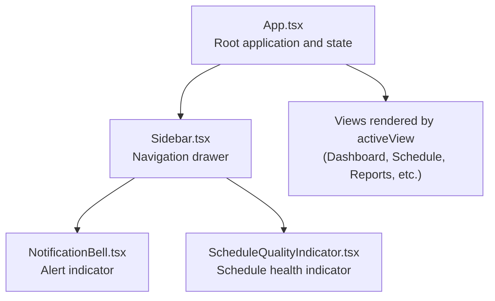
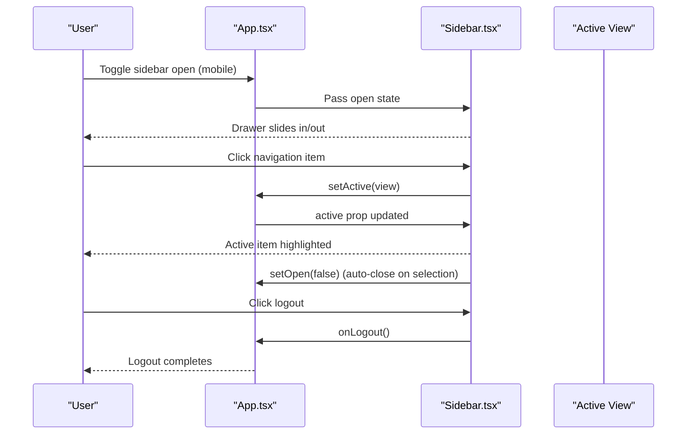
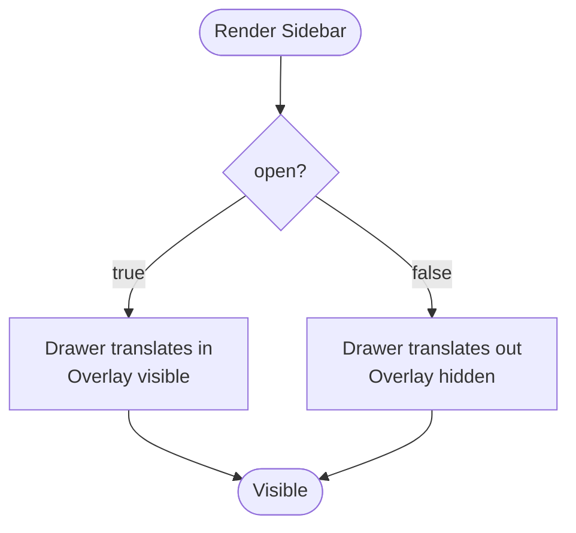
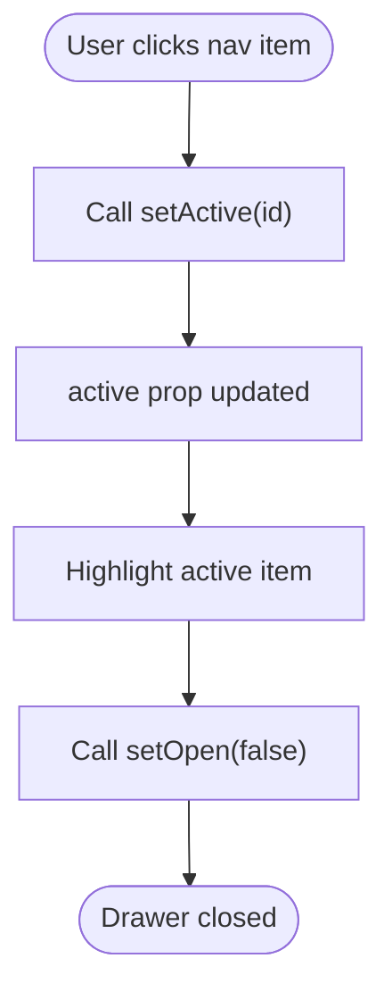
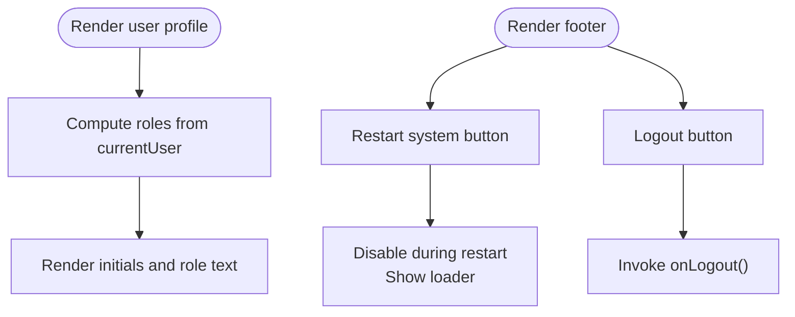
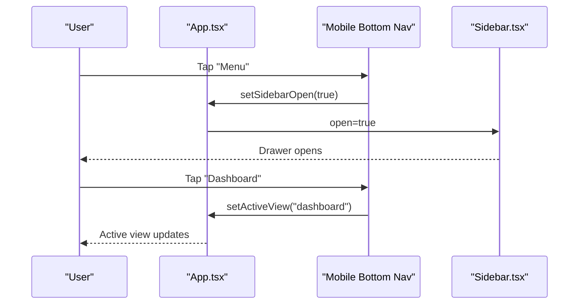
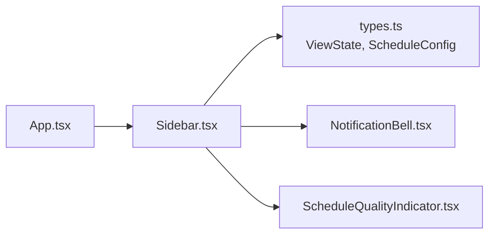

# Sidebar Component

<cite>
**Referenced Files in This Document**
- [Sidebar.tsx](file://components/Sidebar.tsx)
- [App.tsx](file://App.tsx)
- [types.ts](file://types.ts)
- [NotificationBell.tsx](file://components/NotificationBell.tsx)
- [ScheduleQualityIndicator.tsx](file://components/ScheduleQualityIndicator.tsx)
</cite>

## Table of Contents
1. [Introduction](#introduction)
2. [Project Structure](#project-structure)
3. [Core Components](#core-components)
4. [Architecture Overview](#architecture-overview)
5. [Detailed Component Analysis](#detailed-component-analysis)
6. [Dependency Analysis](#dependency-analysis)
7. [Performance Considerations](#performance-considerations)
8. [Troubleshooting Guide](#troubleshooting-guide)
9. [Conclusion](#conclusion)
10. [Appendices](#appendices)

## Introduction
This document provides comprehensive documentation for the Sidebar UI component. It explains the visual appearance as a navigation drawer that adapts between mobile and desktop layouts, its behavior including open/close states and active view highlighting, and user interaction patterns such as click navigation and overlay dismissal. It also documents the component’s props, their types and usage, and shows how the Sidebar integrates with the root App component to control the active view. Accessibility considerations, responsive design, and integration with the mobile bottom navigation bar are covered. Guidance is included for customization, such as adding new navigation items or modifying the user profile section.

## Project Structure
The Sidebar component resides under components and is integrated into the root application layout. The App component manages global state (active view, sidebar open state, current user) and passes these as props to the Sidebar. The Sidebar renders navigation items, user profile, indicators, and footer actions.

**Diagram sources**
- [App.tsx](file://App.tsx#L228-L314)
- [Sidebar.tsx](file://components/Sidebar.tsx#L118-L248)
- [NotificationBell.tsx](file://components/NotificationBell.tsx#L1-L98)
- [ScheduleQualityIndicator.tsx](file://components/ScheduleQualityIndicator.tsx#L1-L65)

**Section sources**
- [App.tsx](file://App.tsx#L228-L314)
- [Sidebar.tsx](file://components/Sidebar.tsx#L118-L248)

## Core Components
- Sidebar: A navigation drawer that displays a header, user profile snippet, indicators, navigation items, and footer actions. It is fixed on mobile and static on desktop. It receives state and callbacks from the parent App component to manage active view and open state.
- App: Manages activeView, sidebarOpen, currentUser, and other application-wide state. It passes these props to Sidebar and renders the active view content.

Key responsibilities:
- Manage mobile overlay and drawer transitions.
- Render navigation items filtered by permissions.
- Highlight the active view and close the drawer after selection.
- Provide quick actions (restart system, logout) and optional import launch button for administrators.
- Integrate with mobile bottom navigation for seamless navigation on small screens.

**Section sources**
- [Sidebar.tsx](file://components/Sidebar.tsx#L27-L51)
- [App.tsx](file://App.tsx#L55-L85)

## Architecture Overview
The Sidebar acts as the primary navigation interface for the application. It is controlled by the App component’s state and updates the active view when users select a navigation item. On mobile, the Sidebar appears as a slide-in drawer with an overlay; on desktop, it remains static. The mobile bottom navigation complements the Sidebar for quick access to core views.

**Diagram sources**
- [App.tsx](file://App.tsx#L233-L248)
- [Sidebar.tsx](file://components/Sidebar.tsx#L166-L201)
- [Sidebar.tsx](file://components/Sidebar.tsx#L234-L242)

## Detailed Component Analysis

### Sidebar Props and Types
The Sidebar accepts the following props:
- active: ViewState — current active view identifier.
- setActive: (view: ViewState) => void — callback to update the active view.
- open: boolean — whether the drawer is open.
- setOpen: (open: boolean) => void — callback to toggle the drawer.
- systemAlerts: SystemAlert[] — used by indicators to compute health metrics.
- scheduleConfig: ScheduleConfig — provides school name and configuration.
- uncoveredCount?: number — optional operational health metric for indicators.
- onLogout?: () => void — optional callback invoked on logout.
- currentUser?: Employee | null — current user data for profile display.
- onLaunchImport?: () => void — optional callback to open the import wizard.

These props are passed from the App component and typed via shared types.

**Section sources**
- [Sidebar.tsx](file://components/Sidebar.tsx#L27-L51)
- [types.ts](file://types.ts#L1-L10)
- [types.ts](file://types.ts#L55-L75)

### Visual Appearance and Responsive Behavior
- Mobile layout:
  - Fixed drawer positioned on the right with a full-height container.
  - Overlay behind the drawer fades in/out when the drawer opens/closes.
  - Close button inside the header for mobile.
- Desktop layout:
  - Static drawer with no translation; width constrained to 64 units.
- Transition:
  - Smooth transform transition for drawer movement.
  - Overlay opacity transition for visibility.

**Diagram sources**
- [Sidebar.tsx](file://components/Sidebar.tsx#L118-L122)

**Section sources**
- [Sidebar.tsx](file://components/Sidebar.tsx#L118-L142)

### Navigation Items and Active View Highlighting
- Menu items are defined as an array of objects with identifiers, labels, icons, optional colors, and admin-only flags.
- Items are filtered so only permitted items are shown based on the current user’s role.
- Active item is highlighted with a distinct background, text color, and a trailing chevron.
- Clicking an item updates the active view and closes the drawer.

**Diagram sources**
- [Sidebar.tsx](file://components/Sidebar.tsx#L166-L201)

**Section sources**
- [Sidebar.tsx](file://components/Sidebar.tsx#L55-L69)
- [Sidebar.tsx](file://components/Sidebar.tsx#L166-L201)

### User Profile and Footer Actions
- User profile snippet shows initials and roles derived from currentUser.
- Footer includes:
  - Restart system button with a rotating icon and loader state.
  - Logout button styled with a rose palette.
  - Version label.

**Diagram sources**
- [Sidebar.tsx](file://components/Sidebar.tsx#L144-L157)
- [Sidebar.tsx](file://components/Sidebar.tsx#L220-L246)

**Section sources**
- [Sidebar.tsx](file://components/Sidebar.tsx#L88-L106)
- [Sidebar.tsx](file://components/Sidebar.tsx#L220-L246)

### Indicators Integration
- Schedule quality indicator and notification bell are rendered in the sidebar header area.
- These components receive system alerts and use them to compute visual states and counts.

**Section sources**
- [Sidebar.tsx](file://components/Sidebar.tsx#L160-L163)
- [ScheduleQualityIndicator.tsx](file://components/ScheduleQualityIndicator.tsx#L1-L65)
- [NotificationBell.tsx](file://components/NotificationBell.tsx#L1-L98)

### Interaction Patterns and Accessibility
- Click navigation:
  - Each menu item triggers setActive and setOpen(false).
- Overlay dismissal:
  - Clicking the overlay closes the drawer on mobile.
- Keyboard and screen reader:
  - Buttons use semantic button elements and appropriate aria semantics.
  - Focusable elements are reachable via keyboard navigation.
- Touch gestures:
  - No explicit gesture handlers are present; the drawer relies on click/tap interactions.

**Section sources**
- [Sidebar.tsx](file://components/Sidebar.tsx#L110-L117)
- [Sidebar.tsx](file://components/Sidebar.tsx#L166-L201)

### Integration with Mobile Bottom Navigation
- On mobile devices, a bottom navigation bar provides quick access to dashboard, schedule, calendar, and a floating action button for substitutions.
- The bottom navigation complements the Sidebar by offering fast access to frequently used views without opening the drawer.

**Diagram sources**
- [App.tsx](file://App.tsx#L368-L413)
- [App.tsx](file://App.tsx#L233-L248)

**Section sources**
- [App.tsx](file://App.tsx#L368-L413)

### Example Usage from App.tsx
The App component initializes state for activeView and sidebarOpen, and passes these to the Sidebar along with other props. It also defines the onLogout handler and provides an onLaunchImport callback for administrators.

- Passing props to Sidebar:
  - active={activeView}
  - setActive={setActiveView}
  - open={sidebarOpen}
  - setOpen={setSidebarOpen}
  - currentUser={currentUser}
  - onLogout={handleLogout}
  - onLaunchImport={() => setShowImportWizard(true)}

- Managing active view:
  - activeView is updated by the Sidebar’s setActive callback.
  - The App component conditionally renders the active view content.

**Section sources**
- [App.tsx](file://App.tsx#L55-L85)
- [App.tsx](file://App.tsx#L233-L248)
- [App.tsx](file://App.tsx#L281-L314)

### Customization Guide
- Adding a new navigation item:
  - Extend the menuItems array with a new object containing id, label, icon, optional color, and adminOnly flag.
  - Ensure the id matches a valid ViewState.
- Removing or hiding items:
  - Adjust the adminOnly flag or remove items from the array.
- Modifying the user profile section:
  - Update the user profile rendering logic to include additional fields or styling.
- Adding quick actions:
  - Add buttons in the footer area with appropriate callbacks and icons.

**Section sources**
- [Sidebar.tsx](file://components/Sidebar.tsx#L55-L69)
- [Sidebar.tsx](file://components/Sidebar.tsx#L144-L157)
- [Sidebar.tsx](file://components/Sidebar.tsx#L203-L216)

## Dependency Analysis
The Sidebar depends on shared types for ViewState and ScheduleConfig, and composes two smaller UI components for indicators. The App component orchestrates state and passes props down to the Sidebar.

**Diagram sources**
- [App.tsx](file://App.tsx#L228-L314)
- [Sidebar.tsx](file://components/Sidebar.tsx#L27-L51)
- [types.ts](file://types.ts#L1-L10)
- [types.ts](file://types.ts#L55-L75)

**Section sources**
- [types.ts](file://types.ts#L1-L10)
- [types.ts](file://types.ts#L55-L75)

## Performance Considerations
- Rendering cost:
  - The menu items array is filtered on render; keep the list concise to minimize re-computation.
- Transitions:
  - CSS transforms and opacity transitions are hardware-accelerated; ensure minimal heavy computations during open/close animations.
- Overlay:
  - The overlay uses pointer-events-none when hidden to avoid unnecessary event handling.

[No sources needed since this section provides general guidance]

## Troubleshooting Guide
- Drawer does not close after selecting an item:
  - Verify that setOpen(false) is called after setActive in the navigation item handler.
- Active item highlight not visible:
  - Confirm that active equals the selected item id and that the highlight classes are applied.
- Overlay not closing the drawer:
  - Ensure the overlay click handler invokes setOpen(false).
- Logout not working:
  - Confirm onLogout is passed and invoked from the footer button.
- Import wizard not launching:
  - Ensure onLaunchImport is provided and that the user has admin privileges.

**Section sources**
- [Sidebar.tsx](file://components/Sidebar.tsx#L166-L201)
- [Sidebar.tsx](file://components/Sidebar.tsx#L234-L242)
- [App.tsx](file://App.tsx#L233-L248)

## Conclusion
The Sidebar component serves as the central navigation interface, seamlessly adapting to mobile and desktop environments. It manages open/close states, highlights the active view, and integrates with the App component’s state to control the active view. Its modular design allows straightforward customization for adding new navigation items or adjusting the user profile section. Combined with the mobile bottom navigation, it provides efficient navigation across core application views.

[No sources needed since this section summarizes without analyzing specific files]

## Appendices

### Props Reference
- active: ViewState — current active view identifier.
- setActive: (view: ViewState) => void — updates the active view.
- open: boolean — controls drawer visibility.
- setOpen: (open: boolean) => void — toggles drawer open state.
- systemAlerts: SystemAlert[] — used by indicators.
- scheduleConfig: ScheduleConfig — provides school name and configuration.
- uncoveredCount?: number — operational health metric for indicators.
- onLogout?: () => void — invoked on logout.
- currentUser?: Employee | null — user data for profile display.
- onLaunchImport?: () => void — opens import wizard for admins.

**Section sources**
- [Sidebar.tsx](file://components/Sidebar.tsx#L27-L51)
- [types.ts](file://types.ts#L1-L10)
- [types.ts](file://types.ts#L55-L75)