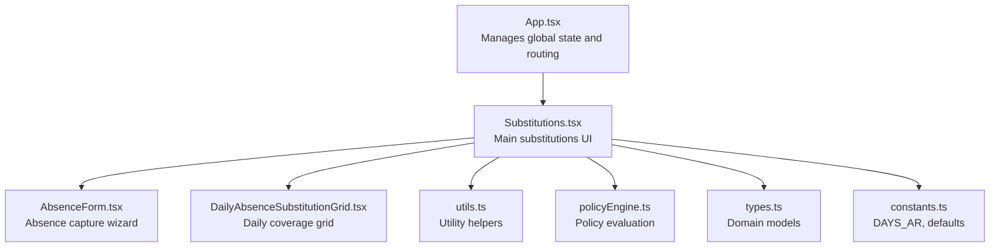
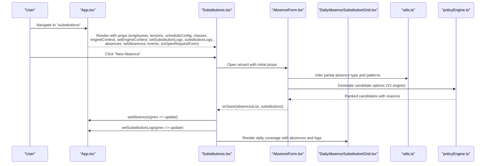
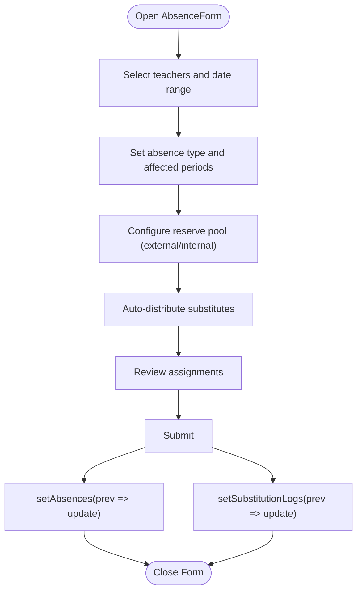
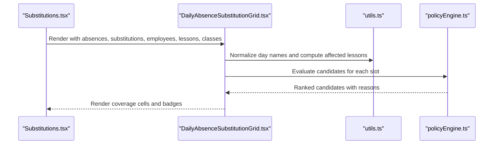
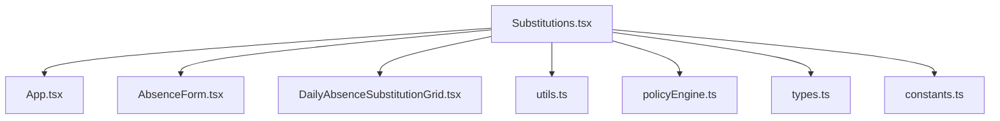

# Substitutions Component

<cite>
**Referenced Files in This Document**
- [Substitutions.tsx](file://components/Substitutions.tsx)
- [App.tsx](file://App.tsx)
- [DailyAbsenceSubstitutionGrid.tsx](file://components/DailyAbsenceSubstitutionGrid.tsx)
- [AbsenceForm.tsx](file://components/AbsenceForm.tsx)
- [policyEngine.ts](file://utils/policyEngine.ts)
- [utils.ts](file://utils.ts)
- [types.ts](file://types.ts)
- [constants.ts](file://constants.ts)
</cite>

## Table of Contents
1. [Introduction](#introduction)
2. [Project Structure](#project-structure)
3. [Core Components](#core-components)
4. [Architecture Overview](#architecture-overview)
5. [Detailed Component Analysis](#detailed-component-analysis)
6. [Dependency Analysis](#dependency-analysis)
7. [Performance Considerations](#performance-considerations)
8. [Troubleshooting Guide](#troubleshooting-guide)
9. [Conclusion](#conclusion)

## Introduction
This document explains the Substitutions component, which manages teacher absences and class coverage. It covers the absence reporting workflow, substitution assignment logic, and resource pool management. It also documents the props received from App.tsx, how the component is activated when activeView equals 'substitutions', and how it integrates with the policy engine for intelligent substitution recommendations. Domain models for absence records and substitution logs are described along with usage patterns for different user roles. Concrete examples show how state updates propagate via setAbsences and setSubstitutionLogs. Finally, it addresses common issues such as overlapping absences and performance considerations for large datasets.

## Project Structure
The Substitutions component is part of the components directory and orchestrates absence recording, daily coverage visualization, and substitution assignment. It relies on shared utilities, types, and the policy engine.

**Diagram sources**
- [App.tsx](file://App.tsx#L280-L310)
- [Substitutions.tsx](file://components/Substitutions.tsx#L1-L120)
- [AbsenceForm.tsx](file://components/AbsenceForm.tsx#L1-L120)
- [DailyAbsenceSubstitutionGrid.tsx](file://components/DailyAbsenceSubstitutionGrid.tsx#L1-L60)
- [utils.ts](file://utils.ts#L1-L40)
- [policyEngine.ts](file://utils/policyEngine.ts#L1-L40)
- [types.ts](file://types.ts#L89-L116)
- [constants.ts](file://constants.ts#L1-L10)

**Section sources**
- [App.tsx](file://App.tsx#L280-L310)
- [Substitutions.tsx](file://components/Substitutions.tsx#L1-L120)

## Core Components
- Substitutions: Orchestrates absence reporting, daily coverage grid, resource pool, and state updates.
- AbsenceForm: Multi-step wizard to record absences and assign substitutes.
- DailyAbsenceSubstitutionGrid: Visualizes absent teachers’ lessons and substitute coverage.
- Policy Engine: Evaluates candidates against active modes and golden rules/priority ladder.
- Utilities: Provide normalization, time range calculation, and intelligent substitution option generation.

**Section sources**
- [Substitutions.tsx](file://components/Substitutions.tsx#L1-L120)
- [AbsenceForm.tsx](file://components/AbsenceForm.tsx#L1-L120)
- [DailyAbsenceSubstitutionGrid.tsx](file://components/DailyAbsenceSubstitutionGrid.tsx#L1-L60)
- [policyEngine.ts](file://utils/policyEngine.ts#L204-L406)
- [utils.ts](file://utils.ts#L326-L558)

## Architecture Overview
The Substitutions component is rendered when activeView equals 'substitutions'. It receives state from App.tsx and updates it via callbacks. It computes available internal substitutes based on schedule constraints and filters, maintains a global resource pool, and renders a daily coverage grid. Absence entries and substitution logs are persisted via setAbsences and setSubstitutionLogs.

**Diagram sources**
- [App.tsx](file://App.tsx#L280-L310)
- [Substitutions.tsx](file://components/Substitutions.tsx#L160-L209)
- [AbsenceForm.tsx](file://components/AbsenceForm.tsx#L559-L580)
- [utils.ts](file://utils.ts#L326-L558)
- [policyEngine.ts](file://utils/policyEngine.ts#L255-L406)
- [DailyAbsenceSubstitutionGrid.tsx](file://components/DailyAbsenceSubstitutionGrid.tsx#L1-L60)

## Detailed Component Analysis

### Props Received from App.tsx
The Substitutions component receives the following props from App.tsx when activeView is 'substitutions':
- employees: Array of Employee
- lessons: Array of Lesson
- scheduleConfig: ScheduleConfig
- classes: Array of ClassItem
- engineContext: EngineContext
- setEngineContext: React.Dispatch to update engine context
- setLessons: React.Dispatch to update lessons
- setSubstitutionLogs: React.Dispatch to update substitution logs
- substitutionLogs: Array of SubstitutionLog
- absences: Array of AbsenceRecord
- setAbsences: React.Dispatch to update absences
- onNavigateToView: Callback to navigate to views
- academicYear: AcademicYear
- patterns: DayPattern[]
- holidays: CalendarHoliday[]
- overrides: DayOverride[]
- setOverrides: React.Dispatch to update overrides
- events: CalendarEvent[]
- setEvents: React.Dispatch to update events
- onOpenRequestForm: Callback to open calendar request form

These props enable the component to compute availability, render the daily grid, manage the global resource pool, and persist changes.

**Section sources**
- [App.tsx](file://App.tsx#L280-L310)
- [Substitutions.tsx](file://components/Substitutions.tsx#L20-L42)

### Invocation Relationship and View Activation
- App.tsx sets activeView to 'substitutions' either via navigation or a quick action on mobile.
- Substitutions is rendered with the above props and initializes internal state (selectedDate, showAbsenceForm, editingAbsence, activePoolIds).
- The component listens to events and displays an active mode banner when events with opContext.isActive are present on the selectedDate.

**Section sources**
- [App.tsx](file://App.tsx#L387-L413)
- [Substitutions.tsx](file://components/Substitutions.tsx#L44-L75)

### Absence Reporting Workflow
- The component opens AbsenceForm when the user clicks "New Absence".
- AbsenceForm supports:
  - Selecting multiple teachers for a date range
  - Choosing absence type (FULL/PARTIAL) and reasons
  - Inferring partial absence patterns (contiguous/non-contiguous) and labels
  - Managing a global reserve pool (external/internal) for immediate assignment
  - Auto-distribution of substitutes using the policy engine
- On submit, AbsenceForm invokes onSave with:
  - absencesList: Array of Omit<AbsenceRecord, 'id'>
  - substitutions: Array of Omit<SubstitutionLog, 'id' | 'timestamp'>
- Substitutions updates state via setAbsences and setSubstitutionLogs and shows a toast.

**Diagram sources**
- [AbsenceForm.tsx](file://components/AbsenceForm.tsx#L559-L580)
- [Substitutions.tsx](file://components/Substitutions.tsx#L170-L199)

**Section sources**
- [AbsenceForm.tsx](file://components/AbsenceForm.tsx#L1-L120)
- [AbsenceForm.tsx](file://components/AbsenceForm.tsx#L559-L580)
- [Substitutions.tsx](file://components/Substitutions.tsx#L170-L199)

### Substitution Assignment Logic
- Internal availability is computed by filtering employees who:
  - Are not external
  - Are not already absent on the selectedDate
  - Have lessons on the selected day
  - Are categorized as FULL (no lessons), LATE_START (free before first lesson), or EARLY_END (free after last lesson)
- External substitutes are filtered separately.
- The global resource pool (activePoolIds) allows quick selection of available substitutes for immediate assignment.
- DailyAbsenceSubstitutionGrid:
  - Renders absent teachers on the right and substitutes on the left
  - Highlights coverage vs. free slots
  - Supports manual unassignment and editing of absences
- The policy engine (evaluatePolicyV2) is used to rank candidates when auto-assigning:
  - Builds evaluation context (teacher load, consecutive periods, domain match, continuity, immunity)
  - Applies settings, golden rules, and priority ladder
  - Returns a DecisionTrace with allowed flag, score, and breakdown

**Diagram sources**
- [DailyAbsenceSubstitutionGrid.tsx](file://components/DailyAbsenceSubstitutionGrid.tsx#L1-L144)
- [utils.ts](file://utils.ts#L16-L27)
- [policyEngine.ts](file://utils/policyEngine.ts#L255-L406)

**Section sources**
- [Substitutions.tsx](file://components/Substitutions.tsx#L76-L119)
- [DailyAbsenceSubstitutionGrid.tsx](file://components/DailyAbsenceSubstitutionGrid.tsx#L1-L144)
- [policyEngine.ts](file://utils/policyEngine.ts#L255-L406)

### Resource Pool Management
- The component maintains activePoolIds to track selected substitutes for the current date.
- Two categories are supported:
  - External substitutes (ready-to-call)
  - Internal substitutes (available based on schedule constraints)
- Filters allow categorizing internal candidates by availability type (FULL/LATE_START/EARLY_END).
- The pool can be pre-populated from the wizard or set via the AbsenceForm.

**Section sources**
- [Substitutions.tsx](file://components/Substitutions.tsx#L54-L75)
- [Substitutions.tsx](file://components/Substitutions.tsx#L277-L377)
- [AbsenceForm.tsx](file://components/AbsenceForm.tsx#L246-L292)

### Domain Model: Absence Records and Substitution Logs
- AbsenceRecord
  - Fields include teacherId, date, reason, type (FULL/PARTIAL), affectedPeriods, and optional partial absence metadata.
- SubstitutionLog
  - Fields include date, period, classId, absentTeacherId, substituteTeacherId, substituteName, type (assign_internal/assign_external/merge/dismissal/assign_distribution), reason, modeContext, and timestamp.

These models are used to:
- Persist absence entries and their associated substitution decisions
- Drive the daily coverage grid and uncovered lessons computation

**Section sources**
- [types.ts](file://types.ts#L89-L116)

### Usage Patterns by Role
- Principal/Vice Principal:
  - Full access to view and edit absences, configure engine modes, and review coverage statistics.
- Teachers:
  - Typically redirected to schedule view; can be configured as external staff for coverage.
- Counselors/Coordinators:
  - May assist in reviewing coverage and managing calendar events that influence substitution policies.

**Section sources**
- [App.tsx](file://App.tsx#L140-L173)
- [constants.ts](file://constants.ts#L50-L56)

### State Updates Propagated via Callbacks
- setAbsences: Updates absence records for the selected date and teacher IDs.
- setSubstitutionLogs: Updates substitution logs for the selected date and teacher IDs, adding timestamps and IDs.
- These updates are triggered from:
  - AbsenceForm onSave
  - Substitutions handleSaveAbsence
  - Substitutions handleDeleteAbsenceEntry
  - DailyAbsenceSubstitutionGrid onUnassign

Concrete examples:
- AbsenceForm submits:
  - onSave(absencesList, substitutions)
  - Substitutions updates state and shows a toast
- Substitutions deletes an absence:
  - Removes both absence and related logs for the selected date and teacher

**Section sources**
- [Substitutions.tsx](file://components/Substitutions.tsx#L170-L209)
- [AbsenceForm.tsx](file://components/AbsenceForm.tsx#L559-L580)
- [DailyAbsenceSubstitutionGrid.tsx](file://components/DailyAbsenceSubstitutionGrid.tsx#L1-L60)

## Dependency Analysis
The Substitutions component depends on:
- App.tsx for state and navigation
- AbsenceForm for multi-step absence capture and auto-assignment
- DailyAbsenceSubstitutionGrid for visualization
- utils.ts for normalization, time range calculation, and intelligent substitution option generation
- policyEngine.ts for candidate evaluation under active modes
- types.ts for domain models
- constants.ts for localized day names

**Diagram sources**
- [Substitutions.tsx](file://components/Substitutions.tsx#L1-L120)
- [App.tsx](file://App.tsx#L280-L310)
- [AbsenceForm.tsx](file://components/AbsenceForm.tsx#L1-L120)
- [DailyAbsenceSubstitutionGrid.tsx](file://components/DailyAbsenceSubstitutionGrid.tsx#L1-L60)
- [utils.ts](file://utils.ts#L1-L40)
- [policyEngine.ts](file://utils/policyEngine.ts#L1-L40)
- [types.ts](file://types.ts#L89-L116)
- [constants.ts](file://constants.ts#L1-L10)

**Section sources**
- [Substitutions.tsx](file://components/Substitutions.tsx#L1-L120)
- [utils.ts](file://utils.ts#L326-L558)
- [policyEngine.ts](file://utils/policyEngine.ts#L255-L406)

## Performance Considerations
- Computationally intensive parts:
  - Computing available internals: O(E × P) per day, where E is number of employees and P is periods per day
  - Uncovered lessons computation: O(A × L) where A is number of absences and L is lessons per teacher-day
  - Policy evaluation per candidate: O(R) where R is rules/priority steps
- Recommendations:
  - Memoize derived computations (availableInternals, internalCounts, dailyAbsences, uncoveredLessons) using useMemo
  - Limit daily pool size and avoid re-computing on every keystroke
  - Batch updates to setAbsences and setSubstitutionLogs to reduce re-renders
  - Use virtualized lists for large grids if needed
  - Debounce heavy operations like auto-assignment when iterating many lessons

**Section sources**
- [Substitutions.tsx](file://components/Substitutions.tsx#L76-L161)
- [utils.ts](file://utils.ts#L326-L558)
- [policyEngine.ts](file://utils/policyEngine.ts#L255-L406)

## Troubleshooting Guide
Common issues and resolutions:
- Overlapping absences:
  - Ensure absences for the same teacher on the same date are consolidated before saving; the component filters out duplicates by date and teacherId during updates.
- Conflicting calendar events:
  - When editing or assigning, the component checks for active events and may prompt for confirmation before allowing changes.
- External vs internal constraints:
  - External substitutes are treated differently; ensure the global pool includes external IDs when needed.
- Immunity and continuity:
  - The policy engine considers recent load and continuity of care; candidates may be penalized or blocked accordingly.
- Performance with large datasets:
  - Use memoization and limit recomputation; avoid unnecessary re-renders by passing stable arrays and objects.

**Section sources**
- [Substitutions.tsx](file://components/Substitutions.tsx#L170-L209)
- [AbsenceForm.tsx](file://components/AbsenceForm.tsx#L473-L504)
- [policyEngine.ts](file://utils/policyEngine.ts#L296-L346)

## Conclusion
The Substitutions component provides a comprehensive solution for managing teacher absences and class coverage. It integrates tightly with the policy engine to offer intelligent substitution recommendations, supports a flexible resource pool, and offers robust UI for absence reporting and daily coverage visualization. By leveraging memoization and careful state updates, it remains responsive even with larger datasets. Administrators can configure engine modes and policies, while teachers and counselors can rely on clear coverage insights and automated suggestions.