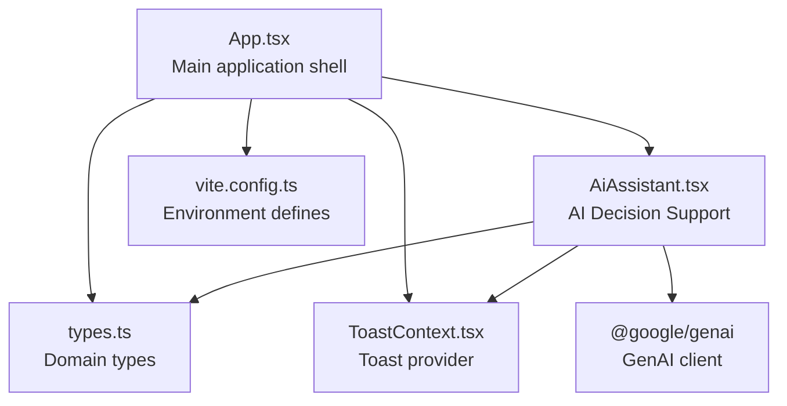
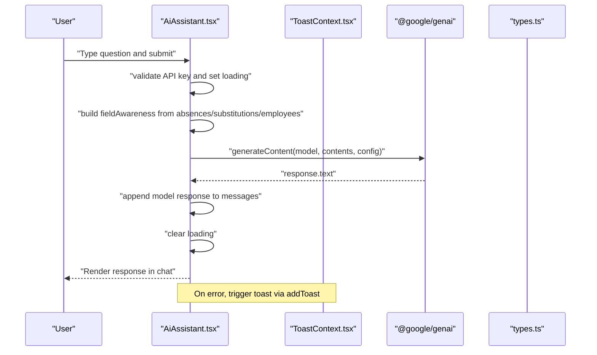
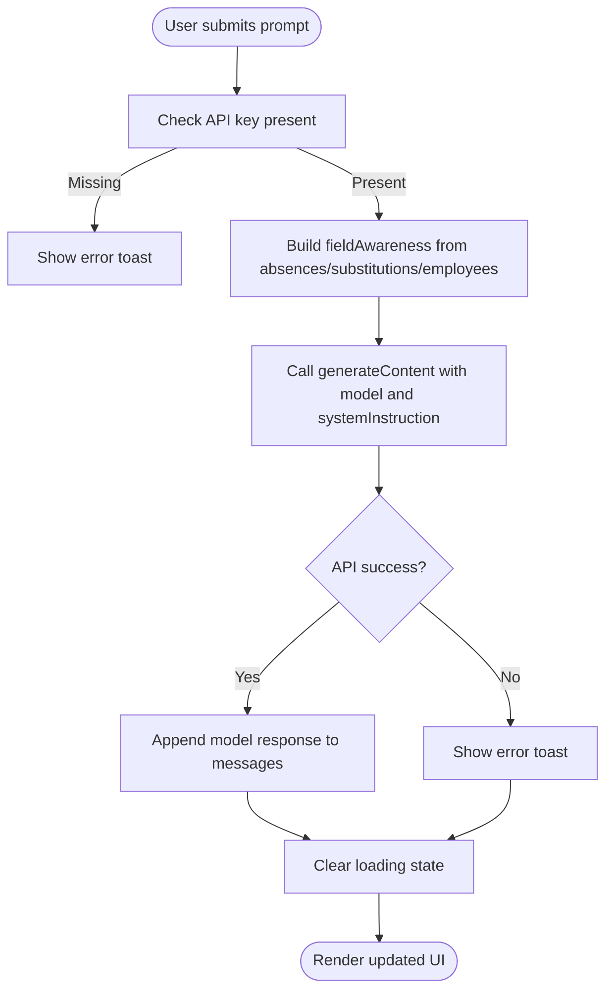
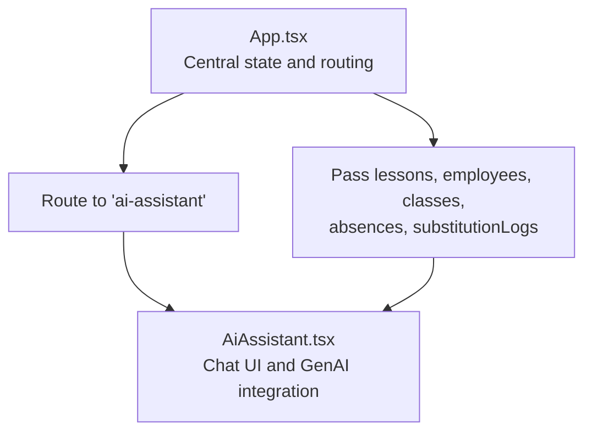
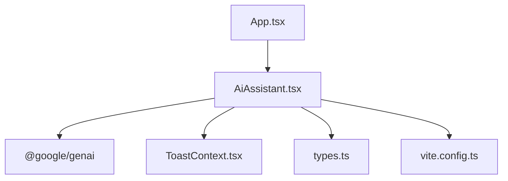

# AI Assistant

<cite>
**Referenced Files in This Document**
- [AiAssistant.tsx](file://components/AiAssistant.tsx)
- [App.tsx](file://App.tsx)
- [ToastContext.tsx](file://contexts/ToastContext.tsx)
- [types.ts](file://types.ts)
- [vite.config.ts](file://vite.config.ts)
- [README.md](file://README.md)
- [Substitutions.tsx](file://components/Substitutions.tsx)
</cite>

## Table of Contents
1. [Introduction](#introduction)
2. [Project Structure](#project-structure)
3. [Core Components](#core-components)
4. [Architecture Overview](#architecture-overview)
5. [Detailed Component Analysis](#detailed-component-analysis)
6. [Dependency Analysis](#dependency-analysis)
7. [Performance Considerations](#performance-considerations)
8. [Troubleshooting Guide](#troubleshooting-guide)
9. [Conclusion](#conclusion)
10. [Appendices](#appendices)

## Introduction
The AI Assistant is an intelligent decision support system integrated into the Madrasati school scheduling platform. It leverages Google’s GenAI to provide contextual insights and strategic recommendations for operational decisions such as absences, substitutions, and class coverage. The component is designed to be embedded within the main application and is fed real-time operational data (lessons, employees, classes, absences, and substitution logs) to construct context-aware prompts. It manages API key exposure via environment configuration, handles loading states, and communicates errors to users through a toast notification system.

## Project Structure
The AI Assistant resides under the components directory and is wired into the main application routing. It receives operational datasets from the parent application and renders a chat-like interface for asking operational questions and receiving AI-generated recommendations.

**Diagram sources**
- [App.tsx](file://App.tsx#L280-L310)
- [AiAssistant.tsx](file://components/AiAssistant.tsx#L1-L99)
- [types.ts](file://types.ts#L1-L120)
- [ToastContext.tsx](file://contexts/ToastContext.tsx#L1-L56)
- [vite.config.ts](file://vite.config.ts#L12-L16)

**Section sources**
- [App.tsx](file://App.tsx#L280-L310)
- [AiAssistant.tsx](file://components/AiAssistant.tsx#L1-L99)

## Core Components
- AiAssistant: The primary component that renders the chat UI, collects user prompts, injects field awareness into the system instruction, invokes the GenAI service, and displays responses. It also manages loading states and error notifications.
- ToastContext: Provides a toast notification mechanism used to surface API errors and other system messages.
- Domain types: Define the shape of lessons, employees, classes, absences, and substitution logs used by the component.

Key responsibilities:
- Prompt construction and system instruction composition
- Real-time context injection from absences, substitutions, and staff availability
- API key management and secure invocation of Google GenAI
- Graceful error handling and user feedback

**Section sources**
- [AiAssistant.tsx](file://components/AiAssistant.tsx#L1-L99)
- [ToastContext.tsx](file://contexts/ToastContext.tsx#L1-L56)
- [types.ts](file://types.ts#L1-L120)

## Architecture Overview
The AI Assistant integrates with the broader system by consuming live operational data and invoking Google’s GenAI to produce context-aware recommendations. The flow below maps the actual code paths and dependencies.

**Diagram sources**
- [AiAssistant.tsx](file://components/AiAssistant.tsx#L25-L57)
- [ToastContext.tsx](file://contexts/ToastContext.tsx#L17-L56)
- [types.ts](file://types.ts#L89-L116)

## Detailed Component Analysis

### AiAssistant Component
The AiAssistant component is a self-contained React component that:
- Receives props: lessons, employees, classes, substitutionLogs, absences
- Maintains internal state: messages, input, isLoading
- Renders a chat UI with user and model messages
- Invokes Google GenAI with a system instruction augmented by field awareness
- Handles loading states and error notifications

Field awareness injection:
- Uses today’s date, counts of active absences and completed substitutions, and recent activity logs to enrich the system instruction.
- Ensures the AI understands the current operational status and educational priorities.

API invocation:
- Reads the API key from environment configuration.
- Calls the GenAI generateContent method with a model identifier and the constructed system instruction.
- Appends the model’s response to the message history.

Error handling:
- Catches exceptions during API calls and displays a user-friendly error toast.
- Resets loading state in the finally block.

Usage patterns:
- Users can ask operational questions (e.g., “What are the risks of absences today?”) and receive strategic recommendations tailored to the current schedule and staff availability.

Concrete examples from the code:
- API key management and invocation: [AiAssistant.tsx](file://components/AiAssistant.tsx#L25-L57)
- Field awareness injection: [AiAssistant.tsx](file://components/AiAssistant.tsx#L31-L41)
- Messages rendering and loading indicator: [AiAssistant.tsx](file://components/AiAssistant.tsx#L71-L93)

**Diagram sources**
- [AiAssistant.tsx](file://components/AiAssistant.tsx#L25-L57)
- [ToastContext.tsx](file://contexts/ToastContext.tsx#L17-L56)

**Section sources**
- [AiAssistant.tsx](file://components/AiAssistant.tsx#L1-L99)

### Integration with the Application
The AiAssistant is integrated into the main application routing and receives operational data from the central state. The parent component passes lessons, employees, classes, absences, and substitution logs to the assistant.

**Diagram sources**
- [App.tsx](file://App.tsx#L280-L310)
- [AiAssistant.tsx](file://components/AiAssistant.tsx#L8-L14)

**Section sources**
- [App.tsx](file://App.tsx#L280-L310)

### Domain Model and Context Injection
The component consumes the following domain entities:
- Lesson: Defines scheduled teaching slots
- Employee: Represents staff members and constraints
- ClassItem: Represents classes and grade levels
- AbsenceRecord: Tracks teacher absences with dates and types
- SubstitutionLog: Records completed substitutions with timestamps and reasons

Field awareness augments the system instruction with:
- Current date
- Number of active absences today
- Number of completed substitutions today
- Staff reliability (count of active teachers)
- Recent activity logs (last five substitutions)

These values are computed from the provided props and injected into the system instruction to guide the AI’s reasoning.

**Section sources**
- [types.ts](file://types.ts#L42-L116)
- [AiAssistant.tsx](file://components/AiAssistant.tsx#L31-L41)

### API Key Management and Environment Configuration
- The component reads the API key from the environment using a Vite define directive.
- The Vite configuration maps the environment variable to process.env.API_KEY and process.env.GEMINI_API_KEY.
- The README instructs setting GEMINI_API_KEY in the local environment file.

Security considerations:
- The API key is exposed to the frontend via Vite’s define. Ensure the environment is controlled and consider backend proxying for production deployments.

**Section sources**
- [vite.config.ts](file://vite.config.ts#L12-L16)
- [README.md](file://README.md#L16-L20)
- [AiAssistant.tsx](file://components/AiAssistant.tsx#L25-L30)

### Usage Patterns and Recommendations
Operational questions:
- “How many absences are expected today?”
- “Which classes are at risk due to substitutions?”
- “Can we cover all gaps with internal staff?”

Strategic recommendations:
- The AI prioritizes educational stability and considers current operational status when formulating advice.
- Responses are appended to the message history and rendered in the chat UI.

**Section sources**
- [AiAssistant.tsx](file://components/AiAssistant.tsx#L18-L24)
- [AiAssistant.tsx](file://components/AiAssistant.tsx#L43-L49)

### Parameters and State
- Props:
  - lessons: Lesson[]
  - employees: Employee[]
  - classes: ClassItem[]
  - substitutionLogs: SubstitutionLog[] (default empty)
  - absences: AbsenceRecord[] (default empty)
- State:
  - messages: Array of chat messages (user and model)
  - input: String typed by the user
  - isLoading: Boolean indicating API call progress

UI behavior:
- Loading indicator appears during API calls.
- Input is disabled while loading.
- Enter key triggers submission when input is non-empty and not loading.

**Section sources**
- [AiAssistant.tsx](file://components/AiAssistant.tsx#L8-L14)
- [AiAssistant.tsx](file://components/AiAssistant.tsx#L18-L24)
- [AiAssistant.tsx](file://components/AiAssistant.tsx#L86-L93)

## Dependency Analysis
The AiAssistant component depends on:
- @google/genai for content generation
- ToastContext for user notifications
- Domain types for data modeling
- Vite environment configuration for API key access

**Diagram sources**
- [AiAssistant.tsx](file://components/AiAssistant.tsx#L1-L99)
- [ToastContext.tsx](file://contexts/ToastContext.tsx#L1-L56)
- [types.ts](file://types.ts#L1-L120)
- [vite.config.ts](file://vite.config.ts#L12-L16)
- [App.tsx](file://App.tsx#L280-L310)

**Section sources**
- [AiAssistant.tsx](file://components/AiAssistant.tsx#L1-L99)
- [App.tsx](file://App.tsx#L280-L310)

## Performance Considerations
- Network latency: API calls to GenAI can be slow; keep the loading indicator visible to manage perceived performance.
- Message history growth: Long conversations increase DOM rendering overhead; consider pagination or truncation for very long sessions.
- Context size: The field awareness string is appended to the system instruction; keep it concise to avoid token limits.
- Rate limiting: If the API returns throttling errors, surface a user-friendly toast and suggest retrying later.

[No sources needed since this section provides general guidance]

## Troubleshooting Guide
Common issues and resolutions:
- Missing API key:
  - Symptom: No response and immediate exit from the generation function.
  - Resolution: Ensure GEMINI_API_KEY is set in the environment and reloaded by Vite.
  - Reference: [AiAssistant.tsx](file://components/AiAssistant.tsx#L25-L30), [vite.config.ts](file://vite.config.ts#L12-L16), [README.md](file://README.md#L16-L20)
- API rate limiting or service unavailability:
  - Symptom: Error toast indicating the AI engine is busy.
  - Resolution: Retry after a short delay; consider debouncing rapid submissions.
  - Reference: [AiAssistant.tsx](file://components/AiAssistant.tsx#L52-L56), [ToastContext.tsx](file://contexts/ToastContext.tsx#L17-L56)
- Empty or stale context:
  - Symptom: AI responses lack situational awareness.
  - Resolution: Ensure absences, substitutionLogs, and employees props are up to date.
  - Reference: [AiAssistant.tsx](file://components/AiAssistant.tsx#L31-L41), [Substitutions.tsx](file://components/Substitutions.tsx#L72-L74)

**Section sources**
- [AiAssistant.tsx](file://components/AiAssistant.tsx#L25-L56)
- [ToastContext.tsx](file://contexts/ToastContext.tsx#L17-L56)
- [Substitutions.tsx](file://components/Substitutions.tsx#L72-L74)

## Conclusion
The AiAssistant component provides a practical, context-aware decision support layer for the Madrasati platform. By integrating real-time operational data and leveraging Google’s GenAI, it offers actionable insights for managing absences and substitutions. Its design emphasizes user feedback, loading states, and graceful error handling, making it robust for both beginners and experienced users.

[No sources needed since this section summarizes without analyzing specific files]

## Appendices

### API Definition Summary
- Endpoint: Google GenAI generateContent
- Method: POST
- Request body fields:
  - model: string (Gemini model identifier)
  - contents: string (user prompt)
  - config.systemInstruction: string (augmented with field awareness)
- Response: text (model’s generated content)
- Error handling: Catch exceptions and display a toast

**Section sources**
- [AiAssistant.tsx](file://components/AiAssistant.tsx#L43-L49)

### Configuration Options
- systemInstruction: A dynamic instruction that includes field awareness to guide the AI’s reasoning.
- messages: Chat history array with user and model entries.
- input: Current user prompt string.
- isLoading: Boolean controlling loading indicator visibility.

**Section sources**
- [AiAssistant.tsx](file://components/AiAssistant.tsx#L18-L24)
- [AiAssistant.tsx](file://components/AiAssistant.tsx#L43-L49)