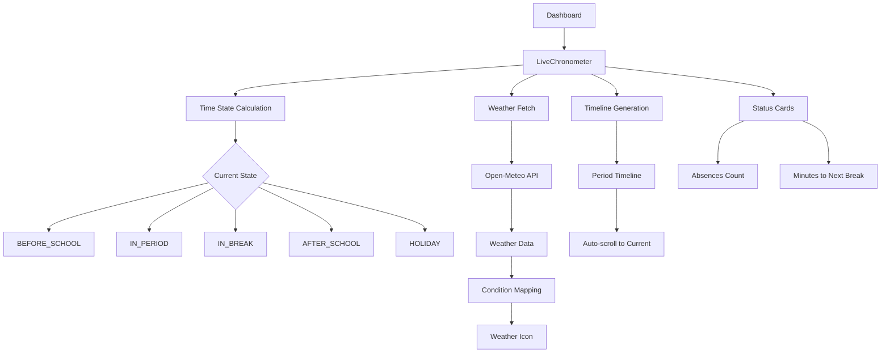
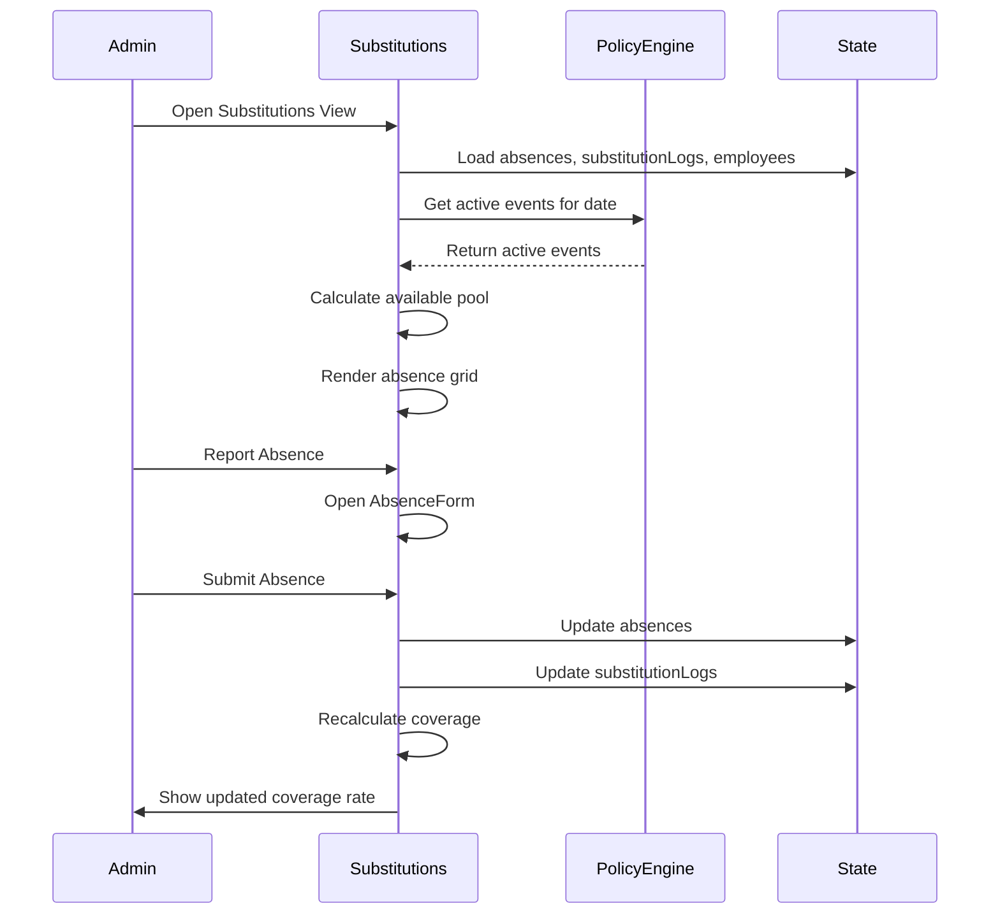
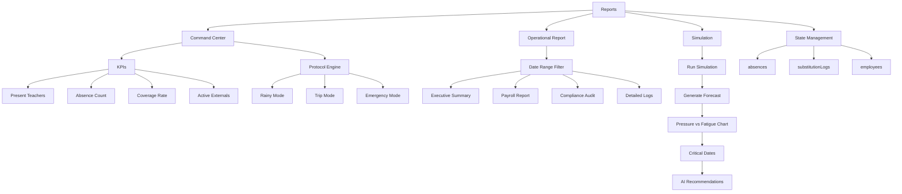
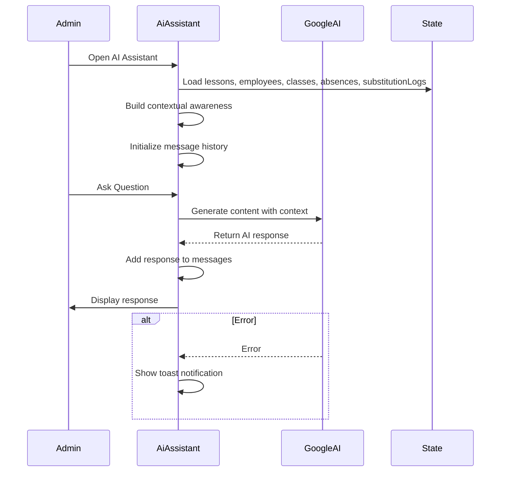

# Core Features

<cite>
**Referenced Files in This Document**   
- [Dashboard.tsx](file://components/Dashboard.tsx)
- [Schedule.tsx](file://components/Schedule.tsx)
- [Substitutions.tsx](file://components/Substitutions.tsx)
- [Reports.tsx](file://components/Reports.tsx)
- [Settings.tsx](file://components/Settings.tsx)
- [AiAssistant.tsx](file://components/AiAssistant.tsx)
- [policyEngine.ts](file://utils/policyEngine.ts)
- [App.tsx](file://App.tsx)
</cite>

## Table of Contents
1. [Dashboard with Live Chronometer and Weather Integration](#dashboard-with-live-chronometer-and-weather-integration)
2. [Schedule with Filtering and Transposition](#schedule-with-filtering-and-transposition)
3. [Substitutions for Absence Management and Assignment Logic](#substitutions-for-absence-management-and-assignment-logic)
4. [Reports with Command Center and Simulation Capabilities](#reports-with-command-center-and-simulation-capabilities)
5. [Settings for Comprehensive Configuration](#settings-for-comprehensive-configuration)
6. [AI Assistant for Insights Generation](#ai-assistant-for-insights-generation)

## Dashboard with Live Chronometer and Weather Integration

The Dashboard component serves as the central operational hub, featuring a live chronometer that visualizes the school's real-time status and a weather integration system. The `LiveChronometer` component calculates the current state of the school day (before school, in period, in break, after school, or holiday) based on the `scheduleConfig` and current time. It displays a dynamic progress ring that shows the remaining time in the current period or break, with different colors indicating the current state (green for before school, amber for break, indigo for active period, gray for after school, and rose for holiday).

The weather integration fetches real-time weather data from the Open-Meteo API for Jerusalem (latitude 31.7683, longitude 35.2137), displaying temperature, condition, and wind speed. Weather conditions are mapped to Arabic labels and corresponding icons (Sun, CloudSun, CloudRain, CloudFog, CloudLightning) based on the weather code. The component includes status cards showing the number of absences for the day and minutes until the next break, as well as a vertical timeline that highlights the current period and scrolls to keep it in view.

User workflows involve administrators and staff accessing the dashboard to quickly assess the school's operational status. The component integrates with the state management system through props like `engineContext`, `absences`, and `substitutionLogs`, which are passed down from the App component. The dashboard also provides navigation buttons to other core features like the calendar, substitutions, and schedule views.



**Diagram sources**
- [Dashboard.tsx](file://components/Dashboard.tsx#L16-L376)

**Section sources**
- [Dashboard.tsx](file://components/Dashboard.tsx#L16-L376)

## Schedule with Filtering and Transposition

The Schedule component provides a flexible interface for viewing timetables from multiple perspectives (class, teacher, subject) with advanced filtering and transposition capabilities. The component supports three view modes: class, teacher, and subject, allowing users to filter the schedule based on a specific entity. The transposition feature swaps the axes of the schedule table, enabling users to view periods as rows and days as columns, or vice versa, improving readability based on user preference.

The component implements comprehensive filtering through state variables like `filteredDays`, `periodRange`, and `hideHolidays`, which allow users to focus on specific days, periods, or hide holiday days. The schedule table is dynamically generated based on the selected view mode, with cell content determined by the `getCellContent` function that filters lessons based on the current day, period, and selected entity. The component also integrates with the policy engine through the `engineContext`, displaying active modes (rainy, trip, emergency) as toggleable buttons that affect schedule rendering.

User workflows involve administrators viewing class schedules, teachers checking their personal timetables, and coordinators examining subject distribution. The component integrates with the state management system through props like `lessons`, `employees`, `classes`, and `setLessons`, which are managed in the App component. The schedule also displays contextual information like active events and substitution status, providing a comprehensive view of daily operations.

```mermaid
classDiagram
class Schedule {
+viewMode : ViewMode
+selectedEntityId : string | number
+isTransposed : boolean
+filteredDays : string[]
+periodRange : {start : number, end : number}
+showFilterPanel : boolean
+handlePrint()
+resolveLayeredContent(day, period)
+getCellContent(day, period)
}
Schedule --> "1" ViewMode
Schedule --> "1..*" Lesson
Schedule --> "1..*" Employee
Schedule --> "1..*" ClassItem
Schedule --> "1" ScheduleConfig
Schedule --> "1" EngineContext
class ViewMode {
<<enumeration>>
class
teacher
subject
}
class Lesson {
+id : string
+teacherId : number
+classId : string
+day : string
+period : number
+subject : string
+type : LessonType
}
class Employee {
+id : number
+name : string
+subjects : string[]
+baseRoleId : string
}
class ClassItem {
+id : string
+name : string
+gradeLevel : number
+type : 'general' | 'special'
}
class ScheduleConfig {
+periodsPerDay : number
+weekStartDay : string
+holidays : string[]
+schoolStartTime : string
}
class EngineContext {
+rainyMode : ModeConfig
+tripMode : ModeConfig
+emergencyMode : ModeConfig
}
```

**Diagram sources**
- [Schedule.tsx](file://components/Schedule.tsx#L33-L434)

**Section sources**
- [Schedule.tsx](file://components/Schedule.tsx#L33-L434)

## Substitutions for Absence Management and Assignment Logic

The Substitutions component manages absence reporting and substitution assignment through a comprehensive workflow. It features a global resource pool system that categorizes available teachers (internal and external) based on their availability patterns (full day free, late start, early end). The component displays a daily absence substitution grid that allows drag-and-drop or click-based assignment of substitutes to uncovered lessons.

The assignment logic is driven by the policy engine, with the `resolveLayeredContent` function determining the final state of each schedule cell based on absences, substitutions, and active events. For teacher view mode, the component shows whether a teacher is absent (cancelling their lessons) or covering another class (adding a coverage lesson). For class view mode, it shows whether a lesson has a substitute teacher or if the teacher is absent without coverage.

User workflows involve administrators processing absence reports, assigning substitutes, and monitoring coverage rates. The component integrates with the state management system through props like `absences`, `setAbsences`, `substitutionLogs`, and `setSubstitutionLogs`, which are managed in the App component. The component also integrates with the policy engine through `engineContext`, displaying active events that affect substitution rules. The interface includes a statistics widget showing coverage rate, present teachers, and active external substitutes.



**Diagram sources**
- [Substitutions.tsx](file://components/Substitutions.tsx#L20-L531)

**Section sources**
- [Substitutions.tsx](file://components/Substitutions.tsx#L20-L531)

## Reports with Command Center and Simulation Capabilities

The Reports component functions as a strategic command center with operational reporting and simulation capabilities. It features three main tabs: Command Center, Operational Report, and Simulation. The Command Center provides real-time KPIs including present teachers, absence count, coverage rate, and active external substitutes, along with a protocol engine interface for activating special modes (rainy, trip, emergency).

The Operational Report allows date-range filtering and generates detailed reports on substitution coverage, payroll for external substitutes, and compliance audit of absence justifications. The report includes expandable sections for executive summary, payroll, compliance, and detailed operational logs. The Simulation capability runs an annual simulation of absence patterns and substitution outcomes, generating strategic insights about system resilience and potential critical dates.

User workflows involve administrators monitoring daily operations, generating compliance reports, and running simulations to test system robustness. The component integrates with the state management system through props like `absences`, `substitutionLogs`, and `employees`, which are passed from the App component. The simulation feature uses the `runAnnualSimulation` function from utils to generate forecast data, which is then visualized in an area chart showing pressure versus fatigue over time.



**Diagram sources**
- [Reports.tsx](file://components/Reports.tsx#L23-L784)

**Section sources**
- [Reports.tsx](file://components/Reports.tsx#L23-L784)

## Settings for Comprehensive Configuration

The Settings component provides comprehensive configuration for school identity, structure, roles, and protocol engine. It is organized into five tabs: Identity & Time, Structure Builder, Roles & Permissions, Protocol Engine, and Data Import. The Identity & Time tab allows configuration of school information, calendar settings, and time flow engineering with customizable period and break durations.

The Structure Builder enables administrators to define the school's class structure by grade level, including general and special education classes, with options for naming conventions and stage activation (primary, middle, secondary). The Roles & Permissions tab manages staff roles with customizable workload details and access permissions. The Protocol Engine tab configures the policy rules and priority ladders for the substitution system.

User workflows involve administrators setting up the school's foundational configuration, defining staff roles, and configuring operational protocols. The component integrates with the state management system through props like `scheduleConfig`, `setScheduleConfig`, `roles`, `setRoles`, and `classes`, which are managed in the App component. The component also includes data import functionality for onboarding teacher and timetable data from Excel files, with validation to prevent duplicates.

```mermaid
graph TD
A[Settings] --> B[Identity & Time]
A --> C[Structure Builder]
A --> D[Roles & Permissions]
A --> E[Protocol Engine]
A --> F[Data Import]
B --> G[School Info]
G --> H[Name]
G --> I[Logo]
B --> J[Calendar]
J --> K[Week Start]
J --> L[Holidays]
B --> M[Time Flow]
M --> N[Period Durations]
M --> O[Break Types]
C --> P[Stage Selection]
P --> Q[Primary]
P --> R[Middle]
P --> S[Secondary]
C --> T[Grade Configuration]
T --> U[General Classes]
T --> V[Special Classes]
T --> W[Naming Convention]
D --> X[Role Management]
X --> Y[Add Role]
X --> Z[Edit Permissions]
X --> AA[Workload Settings]
E --> AB[Mode Configuration]
AB --> AC[Golden Rules]
AB --> AD[Priority Ladder]
AB --> AE[Policy Rules]
F --> AF[Import Data]
AF --> AG[Teachers]
AF --> AH[Timetable]
AF --> AI[Clear Data]
A --> AJ[State Management]
AJ --> AK[scheduleConfig]
AJ --> AL[roles]
AJ --> AM[classes]
AJ --> AN[employees]
AJ --> AO[lessons]
```



**Diagram sources**
- [Settings.tsx](file://components/Settings.tsx#L33-L800)

**Section sources**
- [Settings.tsx](file://components/Settings.tsx#L33-L800)

## AI Assistant for Insights Generation

The AI Assistant component provides strategic insights through a conversational interface powered by Google's Generative AI. It functions as a decision support system that analyzes current operational data and provides recommendations. The assistant is initialized with contextual awareness about the current date, active absences, completed substitutions, and recent activity logs, which are injected into the system instruction for the AI model.

User workflows involve administrators and coordinators asking questions about scheduling conflicts, absence patterns, or requesting analysis of weekly absence trends. The assistant generates responses based on the current state of the system, providing insights that help with decision-making. The interface includes a message history with user and AI messages, an input field for queries, and a send button to submit questions.

The component integrates with the state management system through props like `lessons`, `employees`, `classes`, `substitutionLogs`, and `absences`, which are used to build the contextual awareness for the AI model. The assistant connects to the Google Generative AI API using an API key from environment variables, with error handling to display toast notifications if the AI service is unavailable. The component displays a connection status indicator showing it is connected to the live calendar.



**Diagram sources**
- [AiAssistant.tsx](file://components/AiAssistant.tsx#L8-L99)

**Section sources**
- [AiAssistant.tsx](file://components/AiAssistant.tsx#L8-L99)