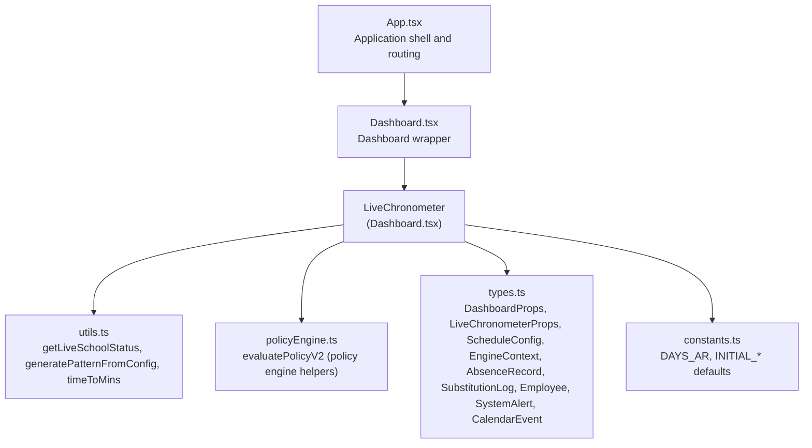
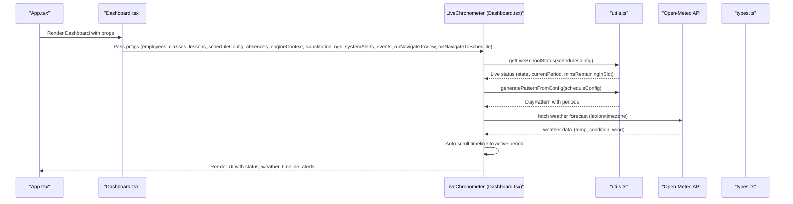
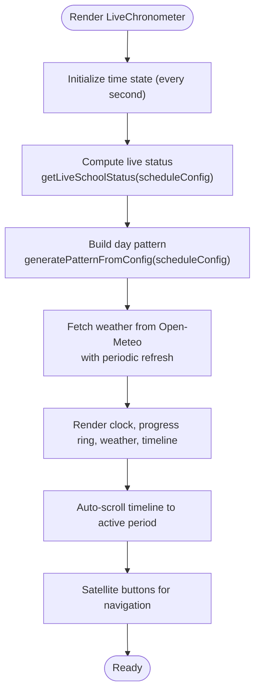
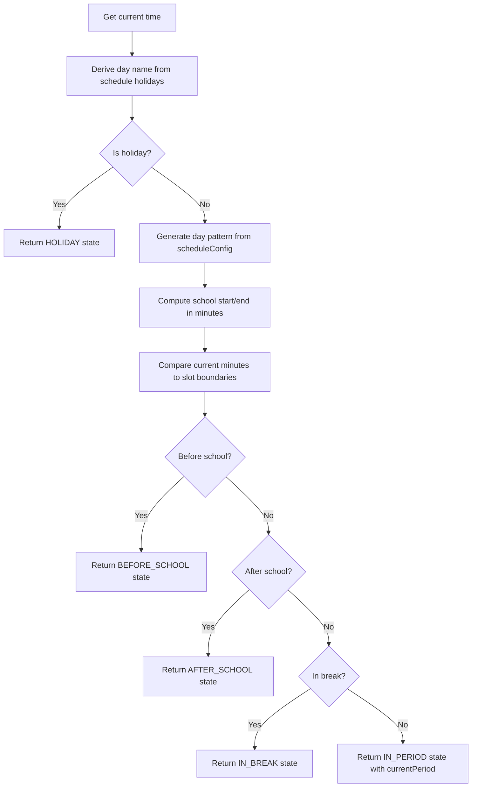
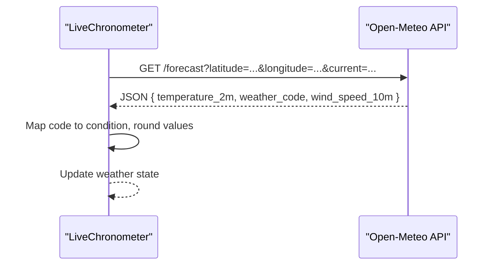
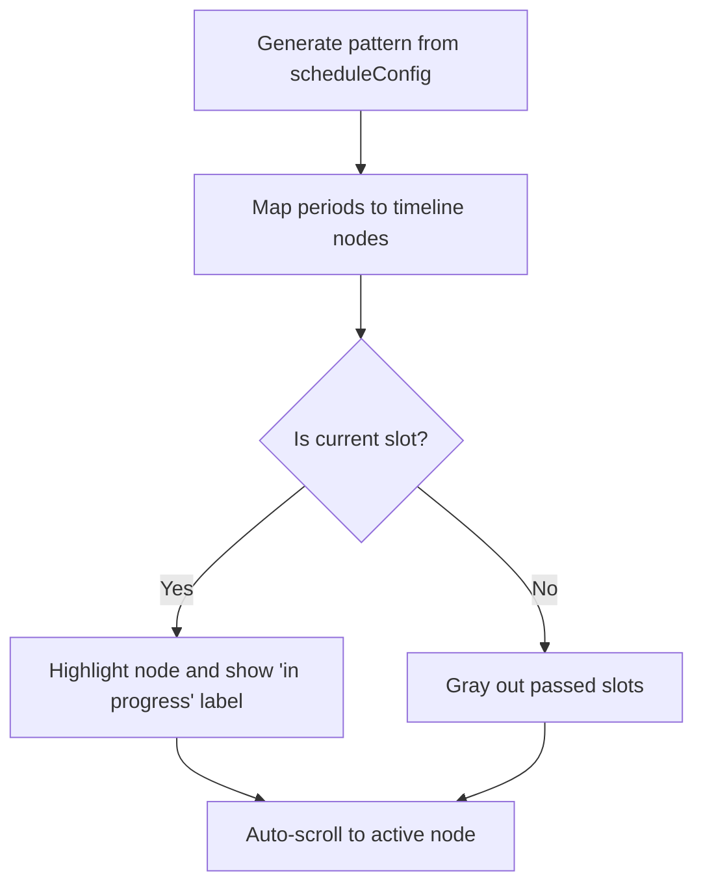
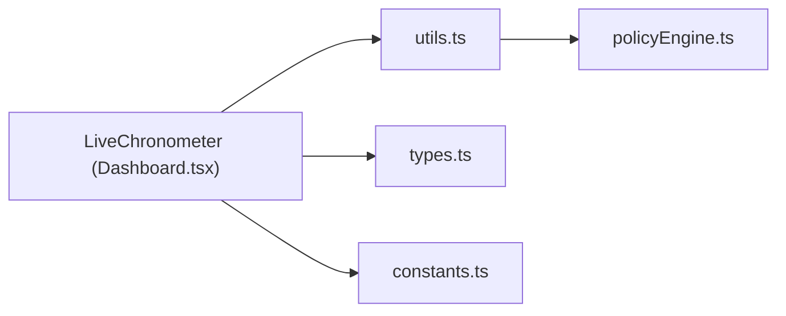

# Dashboard

<cite>
**Referenced Files in This Document**
- [Dashboard.tsx](file://components/Dashboard.tsx)
- [utils.ts](file://utils.ts)
- [policyEngine.ts](file://utils/policyEngine.ts)
- [types.ts](file://types.ts)
- [constants.ts](file://constants.ts)
- [App.tsx](file://App.tsx)
</cite>

## Table of Contents
1. [Introduction](#introduction)
2. [Project Structure](#project-structure)
3. [Core Components](#core-components)
4. [Architecture Overview](#architecture-overview)
5. [Detailed Component Analysis](#detailed-component-analysis)
6. [Dependency Analysis](#dependency-analysis)
7. [Performance Considerations](#performance-considerations)
8. [Troubleshooting Guide](#troubleshooting-guide)
9. [Conclusion](#conclusion)

## Introduction
The Dashboard feature serves as the central monitoring hub for real-time school status. It presents a LiveChronometer component that continuously tracks the current school phase (before school, in period, in break, after school, or holiday), visualizes the dynamic daily schedule, and integrates weather data from Open-Meteo. The component also surfaces upcoming calendar events, absence counts, and system alerts, and provides quick navigation to related views via satellite buttons.

## Project Structure
The Dashboard is implemented as a single-file React component that renders the LiveChronometer. The LiveChronometer consumes scheduling configuration, policy engine context, absence records, substitution logs, employee data, system alerts, and calendar events to compute the live status and render the UI.

**Diagram sources**
- [App.tsx](file://App.tsx#L281-L310)
- [Dashboard.tsx](file://components/Dashboard.tsx#L378-L417)
- [utils.ts](file://utils.ts#L183-L223)
- [policyEngine.ts](file://utils/policyEngine.ts#L1-L406)
- [types.ts](file://types.ts#L1-L382)
- [constants.ts](file://constants.ts#L1-L438)

**Section sources**
- [App.tsx](file://App.tsx#L281-L310)
- [Dashboard.tsx](file://components/Dashboard.tsx#L378-L417)

## Core Components
- Dashboard: A thin wrapper that passes props to LiveChronometer and renders it in full-screen mode.
- LiveChronometer: The core real-time monitor that computes school status, renders the clock and progress ring, displays weather, and shows a vertical timeline with auto-scroll to the active period.

Key responsibilities:
- Real-time updates: Ticks every second to keep the clock and progress accurate.
- Weather integration: Fetches Open-Meteo forecast data with robust error handling and refreshes periodically.
- Dynamic timeline: Builds a schedule pattern from configuration and highlights the current slot.
- Navigation: Provides satellite buttons to navigate to calendar, substitutions, schedule, and alerts.
- Alerts display: Shows a badge indicator when system alerts exist.

**Section sources**
- [Dashboard.tsx](file://components/Dashboard.tsx#L16-L175)
- [Dashboard.tsx](file://components/Dashboard.tsx#L176-L376)
- [Dashboard.tsx](file://components/Dashboard.tsx#L378-L417)

## Architecture Overview
The Dashboard orchestrates the LiveChronometer, which depends on:
- Schedule configuration to derive the daily pattern and current slot.
- Engine context to inform policy-driven adjustments (e.g., merging breaks).
- Absences and substitution logs to contextualize the day’s activity.
- Calendar events to surface upcoming tasks.
- System alerts to highlight operational concerns.
- Open-Meteo API for ambient weather conditions.

**Diagram sources**
- [App.tsx](file://App.tsx#L281-L310)
- [Dashboard.tsx](file://components/Dashboard.tsx#L378-L417)
- [utils.ts](file://utils.ts#L183-L223)
- [utils.ts](file://utils.ts#L85-L115)

## Detailed Component Analysis

### LiveChronometer Component
The LiveChronometer encapsulates the real-time monitoring experience. It:
- Maintains a live time state and updates every second.
- Computes school status using schedule configuration.
- Generates a dynamic day pattern from schedule configuration.
- Fetches weather from Open-Meteo with periodic refresh and silent error handling.
- Renders a circular progress ring indicating slot progress.
- Displays a vertical timeline of periods and breaks, highlighting the current slot and auto-scrolling to it.
- Provides satellite buttons for navigation to calendar, substitutions, schedule, and alerts.

**Diagram sources**
- [Dashboard.tsx](file://components/Dashboard.tsx#L16-L175)
- [Dashboard.tsx](file://components/Dashboard.tsx#L176-L376)
- [utils.ts](file://utils.ts#L183-L223)
- [utils.ts](file://utils.ts#L85-L115)

**Section sources**
- [Dashboard.tsx](file://components/Dashboard.tsx#L16-L175)
- [Dashboard.tsx](file://components/Dashboard.tsx#L176-L376)

### School Status Calculation
The LiveChronometer uses a deterministic algorithm to determine the current school phase:
- Determines if the current day is a holiday based on schedule configuration.
- Derives school start/end times from the generated day pattern.
- Compares current minutes since midnight to slot boundaries to decide state.
- Calculates remaining minutes in the current slot and minutes to the next break.

**Diagram sources**
- [utils.ts](file://utils.ts#L183-L223)

**Section sources**
- [utils.ts](file://utils.ts#L183-L223)

### Weather Integration with Open-Meteo
The component fetches weather data from Open-Meteo at a fixed latitude/longitude and timezone. It:
- Performs a fetch on mount and at intervals.
- Parses temperature, weather code, and wind speed.
- Maps weather codes to localized conditions.
- Updates state with sanitized values and suppresses errors to avoid noisy logs.

**Diagram sources**
- [Dashboard.tsx](file://components/Dashboard.tsx#L50-L78)

**Section sources**
- [Dashboard.tsx](file://components/Dashboard.tsx#L50-L78)

### Dynamic Timeline Visualization
The timeline is derived from the schedule configuration and rendered vertically:
- Generates periods and breaks with start/end times.
- Highlights the current slot with a pulsing dot and accent color.
- Uses scroll indicators and fade overlays for readability.
- Auto-scrolls to the active period whenever the live status or timeline changes.

**Diagram sources**
- [utils.ts](file://utils.ts#L85-L115)
- [Dashboard.tsx](file://components/Dashboard.tsx#L330-L370)
- [Dashboard.tsx](file://components/Dashboard.tsx#L98-L106)

**Section sources**
- [utils.ts](file://utils.ts#L85-L115)
- [Dashboard.tsx](file://components/Dashboard.tsx#L330-L370)
- [Dashboard.tsx](file://components/Dashboard.tsx#L98-L106)

### User Interaction Patterns
- Navigation via satellite buttons:
  - Calendar: Navigates to the calendar view.
  - Substitutions: Navigates to the substitutions view.
  - Schedule: Opens the schedule view in teacher/class/subject mode.
  - Alerts: Shows alert indicator with a badge when system alerts exist.
- Mobile-friendly grid layout for satellite buttons.
- Clicking the center clock area triggers navigation to the schedule view.

**Section sources**
- [Dashboard.tsx](file://components/Dashboard.tsx#L232-L307)
- [Dashboard.tsx](file://components/Dashboard.tsx#L308-L370)
- [App.tsx](file://App.tsx#L281-L310)

### Data Dependencies
- scheduleConfig: Defines school start time, period durations, breaks, and holidays.
- engineContext: Supplies active modes that can modify the schedule pattern (e.g., merging breaks).
- absences: Filters absences by the current date to show daily absence count.
- substitutionLogs: Used by higher-level features; influences candidate availability for substitutions.
- employees: Provides staff data for substitution decisions and UI labels.
- systemAlerts: Controls visibility of alert badges and can trigger flash alert mode.
- events: Provides upcoming calendar events for the “Upcoming Tasks” panel.

**Section sources**
- [Dashboard.tsx](file://components/Dashboard.tsx#L16-L175)
- [Dashboard.tsx](file://components/Dashboard.tsx#L176-L376)
- [types.ts](file://types.ts#L52-L116)
- [types.ts](file://types.ts#L218-L228)
- [types.ts](file://types.ts#L269-L289)

### Integration with the Policy Engine via engineContext
While the Dashboard itself focuses on visualization, the policy engine context informs schedule transformations:
- Active modes can change break actions (internal or merge) and merge strategies.
- These transformations are applied to the generated day pattern before rendering the timeline.
- The engine context also underpins substitution logic used elsewhere in the app.

Note: The Dashboard component does not directly call the policy engine evaluation functions; it relies on the schedule pattern generation and the presence of active modes to adjust the timeline.

**Section sources**
- [utils.ts](file://utils.ts#L117-L175)
- [policyEngine.ts](file://utils/policyEngine.ts#L1-L406)

### Interface Details: DashboardProps and LiveChronometerProps
- DashboardProps
  - employees: Employee[]
  - classes: ClassItem[]
  - lessons: Lesson[]
  - scheduleConfig: ScheduleConfig
  - absences: AbsenceRecord[]
  - engineContext: EngineContext
  - substitutionLogs: SubstitutionLog[]
  - systemAlerts: SystemAlert[]
  - events: CalendarEvent[]
  - onNavigateToView: (view: ViewState) => void
  - onNavigateToSchedule: (mode: 'class' | 'teacher' | 'subject', id: string | number) => void

- LiveChronometerProps
  - scheduleConfig: ScheduleConfig
  - engineContext: EngineContext
  - absences: AbsenceRecord[]
  - substitutionLogs: SubstitutionLog[]
  - employees: Employee[]
  - systemAlerts: SystemAlert[]
  - events: CalendarEvent[]
  - onNavigateToView: (view: ViewState) => void
  - onNavigateToSchedule: (mode: 'class' | 'teacher' | 'subject', id: string | number) => void

These interfaces define the contract between the Dashboard wrapper and the LiveChronometer component, ensuring all required data and callbacks are supplied.

**Section sources**
- [Dashboard.tsx](file://components/Dashboard.tsx#L16-L39)
- [Dashboard.tsx](file://components/Dashboard.tsx#L378-L391)
- [types.ts](file://types.ts#L52-L116)
- [types.ts](file://types.ts#L218-L228)
- [types.ts](file://types.ts#L269-L289)

## Dependency Analysis
The LiveChronometer depends on:
- utils.ts for schedule pattern generation and live status computation.
- constants.ts for localized day names.
- types.ts for strongly typed props and models.
- policyEngine.ts for engine evaluation helpers (used indirectly via schedule pattern application).

**Diagram sources**
- [Dashboard.tsx](file://components/Dashboard.tsx#L16-L175)
- [utils.ts](file://utils.ts#L85-L115)
- [policyEngine.ts](file://utils/policyEngine.ts#L1-L406)
- [types.ts](file://types.ts#L1-L382)
- [constants.ts](file://constants.ts#L1-L438)

**Section sources**
- [Dashboard.tsx](file://components/Dashboard.tsx#L16-L175)
- [utils.ts](file://utils.ts#L85-L115)
- [policyEngine.ts](file://utils/policyEngine.ts#L1-L406)
- [types.ts](file://types.ts#L1-L382)
- [constants.ts](file://constants.ts#L1-L438)

## Performance Considerations
- LiveChronometer uses memoization for expensive computations:
  - Live status calculation is recomputed only when the minute changes or schedule configuration changes.
  - Timeline generation is recomputed when schedule configuration changes.
- Auto-scroll uses DOM queries only when the active period changes, minimizing layout thrash.
- Weather fetch runs on an interval to balance freshness with network usage; errors are suppressed to avoid console noise.
- Rendering uses lightweight SVG for the progress ring and minimal re-renders via memoization.

[No sources needed since this section provides general guidance]

## Troubleshooting Guide
- Weather fetch failures:
  - Symptom: Weather widget shows default values.
  - Cause: Network error or API response issues.
  - Resolution: The component silently handles non-OK responses and exceptions; ensure network connectivity and API availability.

- Timeline not auto-scrolling:
  - Symptom: Active period is not centered in the timeline.
  - Cause: Active element not found or timeline ref not ready.
  - Resolution: Confirm that the active period exists in the timeline and that the ref is attached.

- Incorrect live status:
  - Symptom: Status does not reflect current time.
  - Cause: Holidays list mismatch or schedule configuration misalignment.
  - Resolution: Verify scheduleConfig.holidays and schoolStartTime/periodsPerDay.

- Navigation not working:
  - Symptom: Satellite buttons do not change views.
  - Cause: Callbacks not wired or wrong view state.
  - Resolution: Ensure onNavigateToView/onNavigateToSchedule are passed correctly from the parent.

**Section sources**
- [Dashboard.tsx](file://components/Dashboard.tsx#L50-L78)
- [Dashboard.tsx](file://components/Dashboard.tsx#L98-L106)
- [utils.ts](file://utils.ts#L183-L223)

## Conclusion
The Dashboard’s LiveChronometer provides a comprehensive, real-time view of school operations. By combining schedule configuration, policy engine context, absence and event data, and ambient weather, it delivers actionable insights and smooth navigation. Its modular design and strong typing ensure maintainability and reliability across diverse operational scenarios.