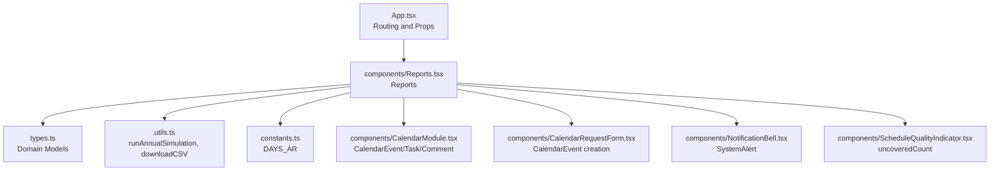
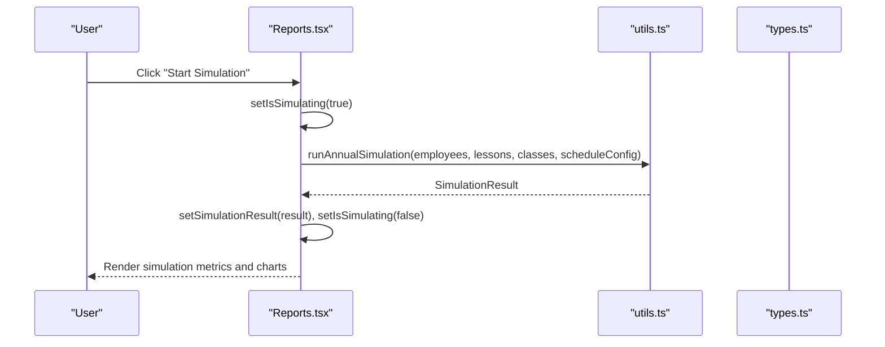
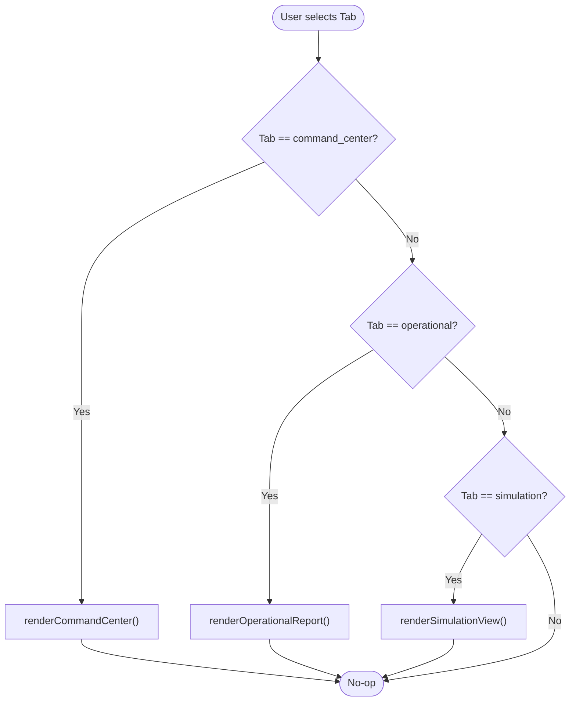
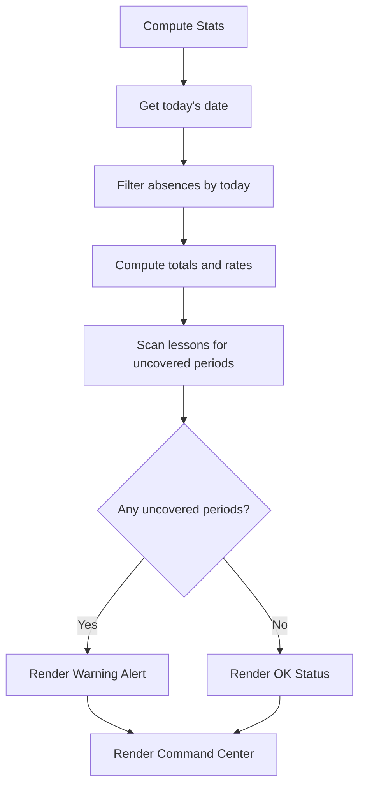
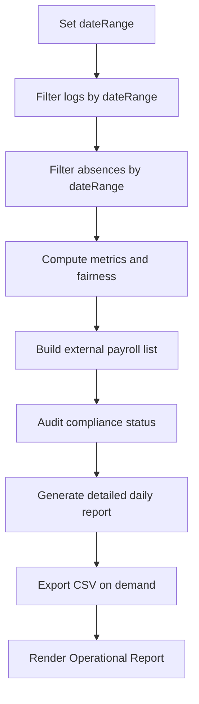
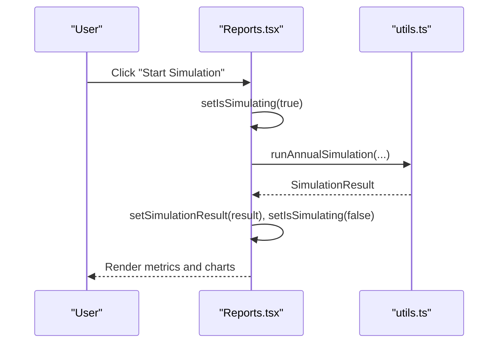
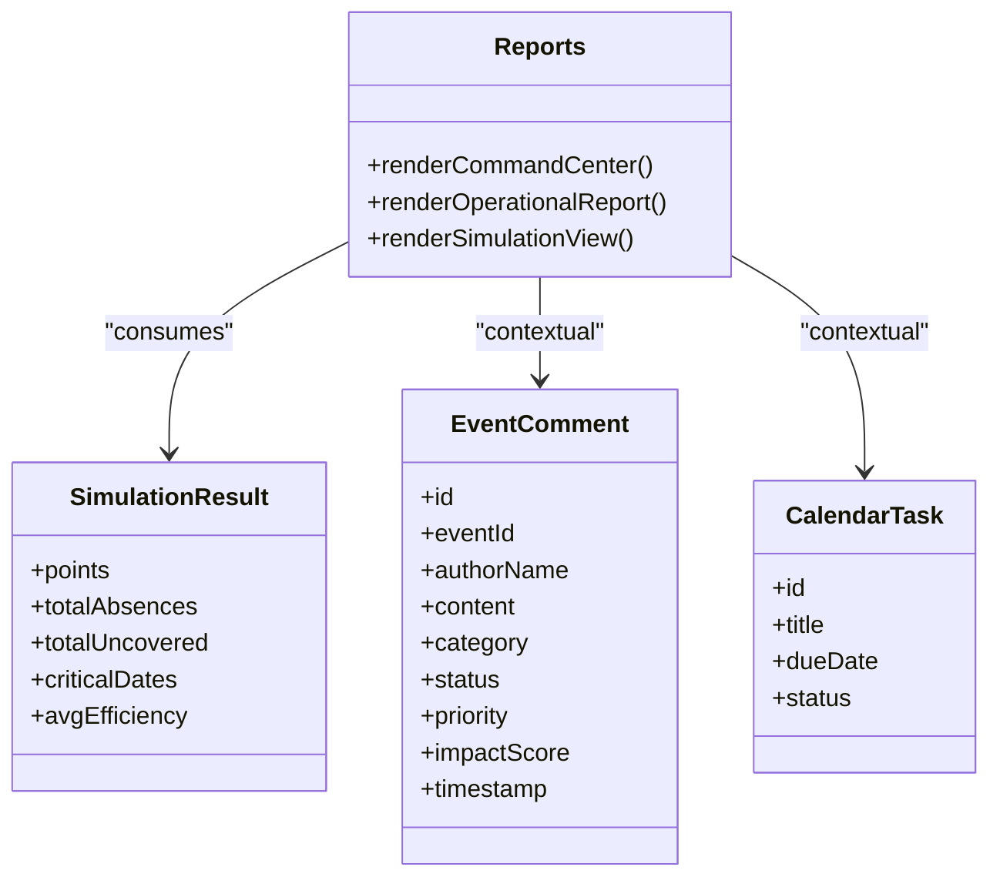
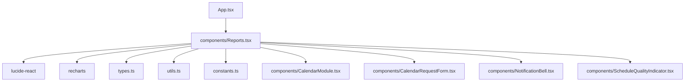

# Reports

<cite>
**Referenced Files in This Document**
- [components/Reports.tsx](file://components/Reports.tsx)
- [types.ts](file://types.ts)
- [utils.ts](file://utils.ts)
- [App.tsx](file://App.tsx)
- [constants.ts](file://constants.ts)
- [components/CalendarModule.tsx](file://components/CalendarModule.tsx)
- [components/CalendarRequestForm.tsx](file://components/CalendarRequestForm.tsx)
- [components/NotificationBell.tsx](file://components/NotificationBell.tsx)
- [components/ScheduleQualityIndicator.tsx](file://components/ScheduleQualityIndicator.tsx)
</cite>

## Table of Contents
1. [Introduction](#introduction)
2. [Project Structure](#project-structure)
3. [Core Components](#core-components)
4. [Architecture Overview](#architecture-overview)
5. [Detailed Component Analysis](#detailed-component-analysis)
6. [Dependency Analysis](#dependency-analysis)
7. [Performance Considerations](#performance-considerations)
8. [Troubleshooting Guide](#troubleshooting-guide)
9. [Conclusion](#conclusion)
10. [Appendices](#appendices)

## Introduction
The Reports feature is a strategic analytics center that consolidates operational insights, command center KPIs, and AI-driven simulation capabilities. It provides three primary tabs:
- command_center: A centralized command center dashboard showcasing live KPIs, protocol modes, system alerts, agenda, tasks, and AI insights.
- operational: A detailed operational report covering coverage metrics, payroll summaries for external substitutes, compliance audits, and a daily operational table.
- simulation: An annual resilience simulator that runs predictive analytics across 365 days to estimate coverage efficiency, uncoverable lessons, and critical dates.

The component orchestrates rendering via a simple activeTab state and delegates to dedicated renderers for each tab. It integrates tightly with domain models such as SimulationResult, EventComment, and CalendarTask, and consumes data from props passed by the application shell.

## Project Structure
The Reports component is located under components and is integrated into the main application routing in App.tsx. It relies on shared types and utilities for domain modeling and data transformations.

**Diagram sources**
- [App.tsx](file://App.tsx#L295-L295)
- [components/Reports.tsx](file://components/Reports.tsx#L1-L120)
- [types.ts](file://types.ts#L218-L237)
- [utils.ts](file://utils.ts#L560-L562)
- [constants.ts](file://constants.ts#L2-L10)
- [components/CalendarModule.tsx](file://components/CalendarModule.tsx#L83-L119)
- [components/CalendarRequestForm.tsx](file://components/CalendarRequestForm.tsx#L700-L739)
- [components/NotificationBell.tsx](file://components/NotificationBell.tsx#L2-L68)
- [components/ScheduleQualityIndicator.tsx](file://components/ScheduleQualityIndicator.tsx#L2-L23)

**Section sources**
- [App.tsx](file://App.tsx#L295-L295)
- [components/Reports.tsx](file://components/Reports.tsx#L1-L120)

## Core Components
- Reports component: Hosts the three tabs, manages state for activeTab, dateRange, expandedSections, and simulation flow. It computes stats and operational metrics using memoization and renders specialized views.
- Domain models:
  - SimulationResult: Aggregates simulation outcomes (points, totals, critical dates, average efficiency).
  - EventComment: Captures strategic/operational/risk comments associated with calendar events.
  - CalendarTask: Tracks tasks with due dates and completion status.
- Utilities:
  - runAnnualSimulation: Placeholder for predictive analytics; returns a typed SimulationResult.
  - downloadCSV: Utility for exporting operational report data.

**Section sources**
- [components/Reports.tsx](file://components/Reports.tsx#L23-L61)
- [types.ts](file://types.ts#L340-L353)
- [utils.ts](file://utils.ts#L560-L562)

## Architecture Overview
The Reports component acts as a controller for three renderers:
- renderCommandCenter: Displays KPIs, protocol modes, alerts, charts, agenda, tasks, and AI insights.
- renderOperationalReport: Filters data by dateRange, computes metrics, and presents payroll, compliance, and detailed logs.
- renderSimulationView: Provides a simulation control panel and visualization of predicted outcomes.

**Diagram sources**
- [components/Reports.tsx](file://components/Reports.tsx#L135-L142)
- [utils.ts](file://utils.ts#L560-L562)

## Detailed Component Analysis

### Invocation Relationships and Tabs
- activeTab drives which renderer is invoked:
  - command_center -> renderCommandCenter
  - operational -> renderOperationalReport
  - simulation -> renderSimulationView
- Navigation between tabs updates activeTab and re-renders the appropriate section.

**Diagram sources**
- [components/Reports.tsx](file://components/Reports.tsx#L769-L778)

**Section sources**
- [components/Reports.tsx](file://components/Reports.tsx#L48-L61)
- [components/Reports.tsx](file://components/Reports.tsx#L769-L778)

### Command Center (command_center)
Key responsibilities:
- Computes live stats (present, absent, coverage rate, active externals, uncovered count).
- Renders KPI cards, protocol mode toggles, system alerts, weekly stress chart, agenda, tasks, and AI insight.
- Integrates with engineContext and ModeConfig to reflect protocol modes.

**Diagram sources**
- [components/Reports.tsx](file://components/Reports.tsx#L63-L89)
- [components/Reports.tsx](file://components/Reports.tsx#L261-L389)

**Section sources**
- [components/Reports.tsx](file://components/Reports.tsx#L63-L89)
- [components/Reports.tsx](file://components/Reports.tsx#L261-L389)

### Operational Report (operational)
Key responsibilities:
- Filters substitutionLogs and absences by dateRange.
- Aggregates metrics: total coverage, total absences, unique absent teachers, fairness status, max load.
- Builds payroll summary for external substitutes.
- Audits compliance by classifying absence records as delivered or pending.
- Generates a detailed daily report per absence with substitute counts and coverage flags.
- Exports CSV via downloadCSV.

**Diagram sources**
- [components/Reports.tsx](file://components/Reports.tsx#L145-L244)
- [components/Reports.tsx](file://components/Reports.tsx#L246-L257)
- [utils.ts](file://utils.ts#L564-L572)

**Section sources**
- [components/Reports.tsx](file://components/Reports.tsx#L145-L244)
- [components/Reports.tsx](file://components/Reports.tsx#L246-L257)

### Simulation View (simulation)
Key responsibilities:
- Provides a control panel to start a 365-day simulation.
- Displays executive metrics (average efficiency, total absences, uncovered lessons, critical dates).
- Renders a dual-area chart showing pressure vs. team fatigue.
- Offers strategic AI insights and highlights critical dates.

**Diagram sources**
- [components/Reports.tsx](file://components/Reports.tsx#L135-L142)
- [components/Reports.tsx](file://components/Reports.tsx#L623-L754)
- [utils.ts](file://utils.ts#L560-L562)

**Section sources**
- [components/Reports.tsx](file://components/Reports.tsx#L623-L754)
- [utils.ts](file://utils.ts#L560-L562)

### Domain Model Integration
- SimulationResult: Returned by runAnnualSimulation and consumed by renderSimulationView to display metrics and charts.
- EventComment: Used in CalendarModule to attach strategic/operational comments to calendar events; integrates with Reports’ operational reporting context.
- CalendarTask: Represents tasks surfaced in the command center; supports operational planning and follow-ups.

**Diagram sources**
- [types.ts](file://types.ts#L340-L353)
- [types.ts](file://types.ts#L309-L319)
- [types.ts](file://types.ts#L302-L307)
- [components/Reports.tsx](file://components/Reports.tsx#L23-L41)

**Section sources**
- [types.ts](file://types.ts#L340-L353)
- [types.ts](file://types.ts#L309-L319)
- [types.ts](file://types.ts#L302-L307)
- [components/CalendarModule.tsx](file://components/CalendarModule.tsx#L83-L119)

### Usage Patterns and Examples
- Annual simulation:
  - Triggered by clicking the simulation control button; internally calls runAnnualSimulation with employees, lessons, classes, and scheduleConfig, then sets simulationResult.
  - Example path: [components/Reports.tsx](file://components/Reports.tsx#L135-L142), [utils.ts](file://utils.ts#L560-L562)
- Viewing operational reports:
  - Adjust dateRange to filter logs and absences; expand/collapse sections; export CSV.
  - Example path: [components/Reports.tsx](file://components/Reports.tsx#L145-L244), [components/Reports.tsx](file://components/Reports.tsx#L246-L257)
- Analyzing AI insights:
  - Command center displays a randomly selected AI insight; CalendarModule supports saving AI notes as EventComment entries.
  - Example path: [components/Reports.tsx](file://components/Reports.tsx#L92-L101), [components/CalendarModule.tsx](file://components/CalendarModule.tsx#L100-L119)

**Section sources**
- [components/Reports.tsx](file://components/Reports.tsx#L92-L101)
- [components/Reports.tsx](file://components/Reports.tsx#L135-L142)
- [components/Reports.tsx](file://components/Reports.tsx#L145-L244)
- [components/Reports.tsx](file://components/Reports.tsx#L246-L257)
- [components/CalendarModule.tsx](file://components/CalendarModule.tsx#L100-L119)

### Configuration Options and Parameters
- activeTab: Controls which tab is currently rendered.
- dateRange: Defines the operational report’s date window; used to filter logs and absences.
- expandedSections: Tracks visibility of report sections for user preference persistence.
- onNavigateToSettings: Callback to navigate to settings from Reports.
- Props for command center:
  - engineContext, setEngineContext, onToggleMode, systemAlerts, tasks, onNavigateToView, onNavigateToSettings.

**Section sources**
- [components/Reports.tsx](file://components/Reports.tsx#L23-L61)
- [components/Reports.tsx](file://components/Reports.tsx#L44-L61)

## Dependency Analysis
- Internal dependencies:
  - Reports imports icons from lucide-react, charts from recharts, and types for domain models.
  - Uses constants.DAYS_AR for day-of-week mapping and utils.toLocalISOString for date normalization.
- External integrations:
  - App.tsx passes all required props to Reports and routes to the reports view.
  - CalendarModule and CalendarRequestForm create and manage CalendarEvent and EventComment, which complement operational reporting.

**Diagram sources**
- [components/Reports.tsx](file://components/Reports.tsx#L1-L22)
- [App.tsx](file://App.tsx#L295-L295)
- [components/CalendarModule.tsx](file://components/CalendarModule.tsx#L83-L119)
- [components/CalendarRequestForm.tsx](file://components/CalendarRequestForm.tsx#L700-L739)
- [components/NotificationBell.tsx](file://components/NotificationBell.tsx#L2-L68)
- [components/ScheduleQualityIndicator.tsx](file://components/ScheduleQualityIndicator.tsx#L2-L23)

**Section sources**
- [components/Reports.tsx](file://components/Reports.tsx#L1-L22)
- [App.tsx](file://App.tsx#L295-L295)

## Performance Considerations
- Expensive computations are guarded by useMemo:
  - Stats computation for command center.
  - Operational report aggregation (filtered logs, absences, payroll, compliance, detailed report).
  - These memoizations prevent recomputation on unrelated state changes.
- Large dataset handling:
  - Prefer filtering by dateRange to limit dataset size.
  - Use pagination or virtualized lists for large tables if needed.
  - Avoid unnecessary re-renders by keeping derived data in memoized values.

**Section sources**
- [components/Reports.tsx](file://components/Reports.tsx#L63-L89)
- [components/Reports.tsx](file://components/Reports.tsx#L145-L244)

## Troubleshooting Guide
- Simulation does not start:
  - Ensure handleStartSimulation is triggered and isSimulating is toggled; verify runAnnualSimulation returns a SimulationResult.
  - Example path: [components/Reports.tsx](file://components/Reports.tsx#L135-L142), [utils.ts](file://utils.ts#L560-L562)
- Operational report empty:
  - Confirm dateRange covers relevant data; check that absences and substitutionLogs are populated.
  - Example path: [components/Reports.tsx](file://components/Reports.tsx#L145-L244)
- Alerts not appearing:
  - Uncovered count must exceed zero for warnings; otherwise OK status is shown.
  - Example path: [components/Reports.tsx](file://components/Reports.tsx#L307-L318)
- Export fails:
  - Ensure downloadCSV is called with correct headers and rows.
  - Example path: [components/Reports.tsx](file://components/Reports.tsx#L246-L257), [utils.ts](file://utils.ts#L564-L572)

**Section sources**
- [components/Reports.tsx](file://components/Reports.tsx#L135-L142)
- [components/Reports.tsx](file://components/Reports.tsx#L145-L244)
- [components/Reports.tsx](file://components/Reports.tsx#L307-L318)
- [components/Reports.tsx](file://components/Reports.tsx#L246-L257)
- [utils.ts](file://utils.ts#L564-L572)

## Conclusion
The Reports feature centralizes analytics across command center KPIs, operational coverage insights, and AI-driven simulation. Its modular renderers, robust memoization, and clear domain model integration enable scalable and maintainable analytics. By leveraging dateRange filtering and memoized computations, it remains responsive even with larger datasets. The component’s props-based design allows seamless integration with the broader application context.

## Appendices

### Domain Model Reference
- SimulationResult: Aggregates simulation outcomes for rendering.
- EventComment: Supports strategic/operational/risk commentary linked to calendar events.
- CalendarTask: Supports task tracking surfaced in the command center.

**Section sources**
- [types.ts](file://types.ts#L340-L353)
- [types.ts](file://types.ts#L309-L319)
- [types.ts](file://types.ts#L302-L307)