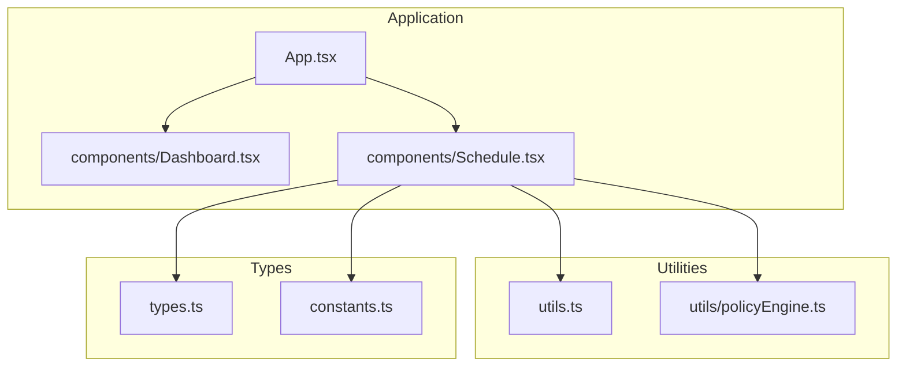
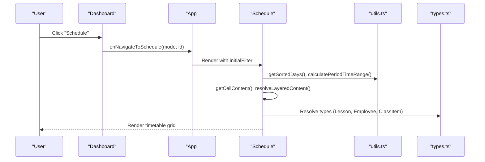
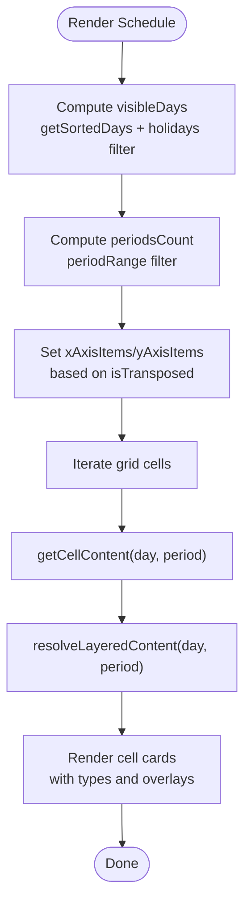
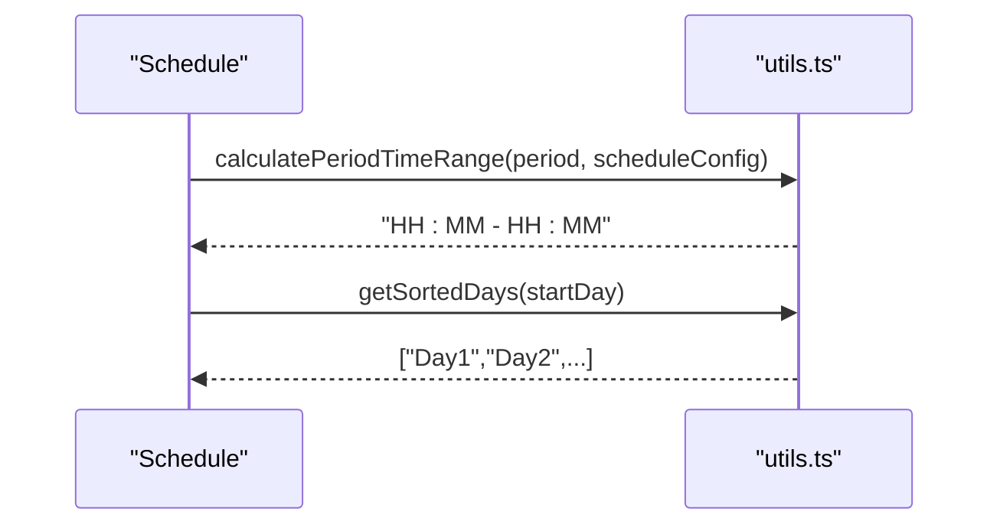
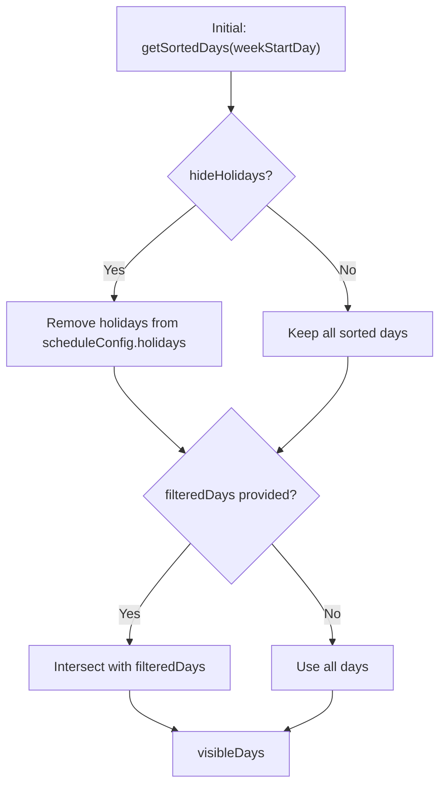
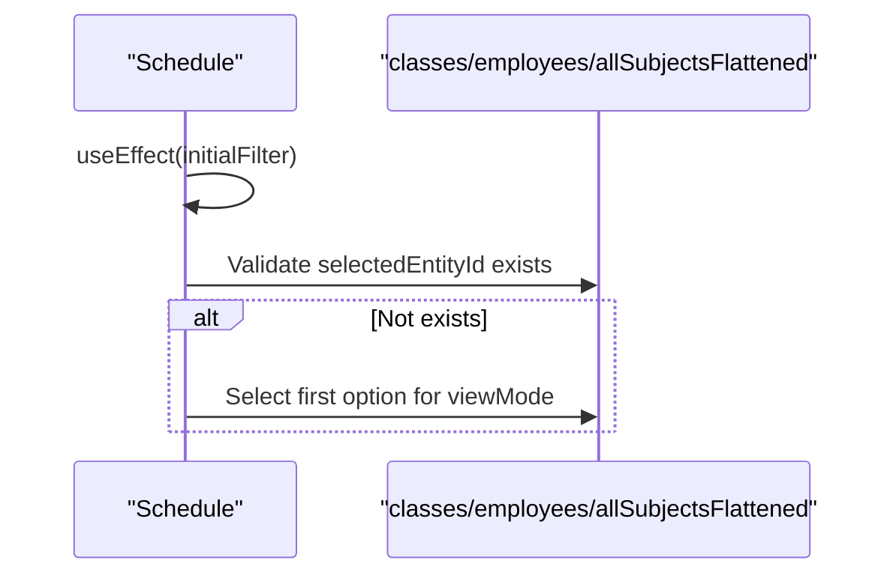
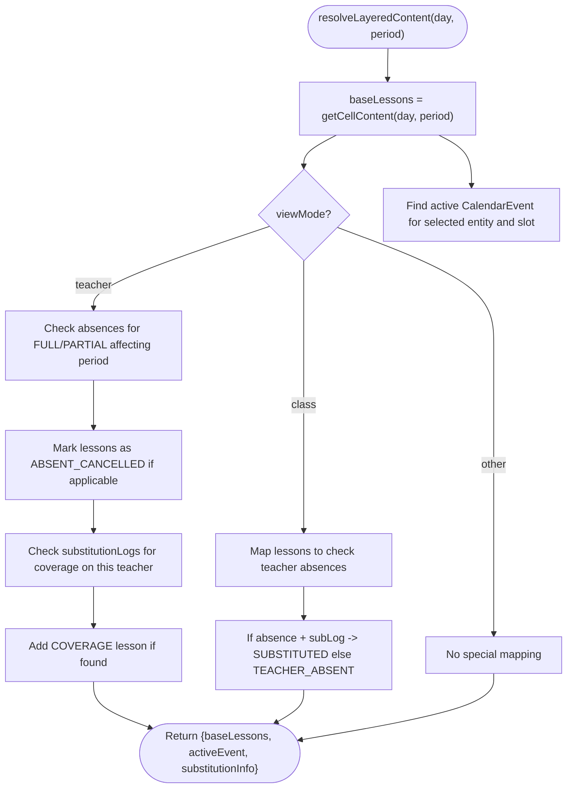
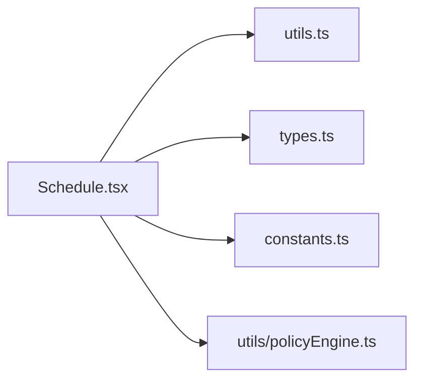

# Schedule

<cite>
**Referenced Files in This Document**
- [components/Schedule.tsx](file://components/Schedule.tsx)
- [utils.ts](file://utils.ts)
- [types.ts](file://types.ts)
- [constants.ts](file://constants.ts)
- [App.tsx](file://App.tsx)
- [components/Dashboard.tsx](file://components/Dashboard.tsx)
- [utils/policyEngine.ts](file://utils/policyEngine.ts)
- [types/policy.ts](file://types/policy.ts)
</cite>

## Table of Contents
1. [Introduction](#introduction)
2. [Project Structure](#project-structure)
3. [Core Components](#core-components)
4. [Architecture Overview](#architecture-overview)
5. [Detailed Component Analysis](#detailed-component-analysis)
6. [Dependency Analysis](#dependency-analysis)
7. [Performance Considerations](#performance-considerations)
8. [Troubleshooting Guide](#troubleshooting-guide)
9. [Conclusion](#conclusion)
10. [Appendices](#appendices)

## Introduction
The Schedule feature is a smart timetable viewer that presents academic timetables across multiple view modes: class, teacher, and subject. It integrates with supporting utilities to compute time ranges, sort days, and resolve layered content including substitutions and absences. The component also supports transposition of axes, filtering by days and periods, and toggling holidays visibility. It is embedded within the application’s navigation and can be initialized with a preselected view mode and entity.

## Project Structure
The Schedule component resides under components and is composed with utilities and types from the project root. It is integrated into the application via App.tsx and can be navigated to from the Dashboard.

**Diagram sources**
- [App.tsx](file://App.tsx#L280-L310)
- [components/Dashboard.tsx](file://components/Dashboard.tsx#L238-L307)
- [components/Schedule.tsx](file://components/Schedule.tsx#L1-L120)
- [utils.ts](file://utils.ts#L1-L120)
- [utils/policyEngine.ts](file://utils/policyEngine.ts#L1-L120)
- [types.ts](file://types.ts#L1-L120)
- [constants.ts](file://constants.ts#L1-L40)

**Section sources**
- [App.tsx](file://App.tsx#L280-L310)
- [components/Dashboard.tsx](file://components/Dashboard.tsx#L238-L307)
- [components/Schedule.tsx](file://components/Schedule.tsx#L1-L120)

## Core Components
- Schedule component: Renders a responsive timetable grid with view mode switching, entity selection, transposition, and advanced filtering. It computes cell content per day/period and resolves layered content for substitutions and absences.
- Supporting utilities:
  - calculatePeriodTimeRange: Computes the start/end time for a given period based on schedule configuration.
  - getSortedDays: Returns the ordered list of days starting from a specified day.
  - resolveDay: Produces a resolved day object with pattern and events for a given date.
- Types and constants:
  - ScheduleFilter interface defines the shape of initial filters passed to the component.
  - AcademicYear, ScheduleConfig, Lesson, Employee, ClassItem, SubstitutionLog, AbsenceRecord, CalendarEvent, ResolvedDay, and ModeConfig define the domain model.

Key responsibilities:
- View modes: class, teacher, subject.
- Entity selection: dynamically updates based on view mode and available data.
- Transposition: swaps rows and columns for alternate visualization.
- Filtering: hides holidays, restricts visible days, and limits periods.
- Layered content resolution: applies substitutions, absences, and calendar events.

**Section sources**
- [components/Schedule.tsx](file://components/Schedule.tsx#L1-L120)
- [utils.ts](file://utils.ts#L177-L243)
- [types.ts](file://types.ts#L381-L382)
- [constants.ts](file://constants.ts#L1-L40)

## Architecture Overview
The Schedule component orchestrates rendering and data transformations. It relies on utilities for time and day computations and on the policy engine for advanced scenarios during substitution generation. The component is wired into the app via navigation and can be preloaded with a filter.

**Diagram sources**
- [components/Dashboard.tsx](file://components/Dashboard.tsx#L238-L307)
- [App.tsx](file://App.tsx#L280-L310)
- [components/Schedule.tsx](file://components/Schedule.tsx#L120-L260)
- [utils.ts](file://utils.ts#L177-L243)
- [types.ts](file://types.ts#L1-L120)

## Detailed Component Analysis

### Schedule Component
The Schedule component manages:
- View state: viewMode, selectedEntityId, isTransposed, hideHolidays.
- Advanced filters: filteredDays, periodRange.
- Derived data: groupedSubjects, allSubjectsFlattened.
- Visibility computation: visibleDays, periodsCount.
- Rendering: xAxisItems, yAxisItems, and grid cells.

Rendering highlights:
- View mode selector buttons for class, teacher, subject.
- Entity selector dropdown bound to the current view mode.
- Transpose button to swap axes.
- Toggle to hide holidays.
- Print button for PDF export.
- Grid table with day/period headers and cells computed by getCellContent and resolveLayeredContent.

Data flow:
- getCellContent filters lessons by day, period, and view mode.
- resolveLayeredContent enriches lessons with substitutions, absences, and calendar events, then returns baseLessons and activeEvent/substitutionInfo.

Effects:
- useEffect initializes viewMode and selectedEntityId from initialFilter.
- useEffect ensures selectedEntityId exists in the current dataset when data changes.

**Diagram sources**
- [components/Schedule.tsx](file://components/Schedule.tsx#L119-L260)

**Section sources**
- [components/Schedule.tsx](file://components/Schedule.tsx#L1-L434)

### Invocation Relationships with Utilities
- calculatePeriodTimeRange: Used to render period time labels in the grid header when not transposed.
- getSortedDays: Computes the ordered list of visible days, respecting weekStartDay and optional holiday filtering.
- resolveDay: Utility to produce a ResolvedDay object for a given date; used in broader scheduling logic and can be leveraged for day-level computations.

**Diagram sources**
- [components/Schedule.tsx](file://components/Schedule.tsx#L350-L360)
- [utils.ts](file://utils.ts#L177-L229)

**Section sources**
- [components/Schedule.tsx](file://components/Schedule.tsx#L340-L360)
- [utils.ts](file://utils.ts#L177-L229)

### Domain Model and Filtering
The ScheduleFilter interface defines the shape of the initial filter:
- mode: 'class' | 'teacher' | 'subject'
- id: string | number

The component’s advanced filtering pipeline:
- visibleDays: starts with getSortedDays, then filters out holidays if hideHolidays is true, and further filters by filteredDays if provided.
- periodRange: restricts the displayed periods to start..end.

**Diagram sources**
- [components/Schedule.tsx](file://components/Schedule.tsx#L119-L131)
- [utils.ts](file://utils.ts#L225-L229)

**Section sources**
- [types.ts](file://types.ts#L381-L382)
- [components/Schedule.tsx](file://components/Schedule.tsx#L119-L131)
- [utils.ts](file://utils.ts#L225-L229)

### View Mode Switching and Entity Selection
Behavior:
- viewMode determines which entity list to render in the selector.
- selectedEntityId is validated against the current dataset; if missing, it falls back to the first available option for the current view mode.
- initialFilter prop synchronizes viewMode and selectedEntityId on mount.

Usage patterns:
- Class mode: selectedEntityId is a class id; selector lists classes.
- Teacher mode: selectedEntityId is an employee id; selector lists employees.
- Subject mode: selectedEntityId is a subject string; selector lists flattened subjects.

**Diagram sources**
- [components/Schedule.tsx](file://components/Schedule.tsx#L92-L118)

**Section sources**
- [components/Schedule.tsx](file://components/Schedule.tsx#L92-L118)

### Transposition and Axis Items
When isTransposed is true:
- xAxisItems becomes periodsCount.
- yAxisItems becomes visibleDays.

This allows an alternate orientation of the timetable grid.

**Section sources**
- [components/Schedule.tsx](file://components/Schedule.tsx#L256-L262)

### Cell Content and Layered Resolution
getCellContent:
- Normalizes the day string.
- Filters lessons by normalized day and exact period.
- Applies view-mode-specific filters:
  - subject: match selectedEntityId.
  - class: match classId.
  - teacher: match teacherId.

resolveLayeredContent:
- Base lessons are derived from getCellContent.
- Adds overlays for:
  - Substitutions and absences for teacher view mode.
  - Coverage records for teacher view mode.
  - Absent teacher indicators for class view mode.
  - Calendar events applicable to the selected entity and slot.
- Returns baseLessons, activeEvent, and substitutionInfo.

**Diagram sources**
- [components/Schedule.tsx](file://components/Schedule.tsx#L138-L254)

**Section sources**
- [components/Schedule.tsx](file://components/Schedule.tsx#L138-L254)

### Configuration Options and Parameters
- initialFilter: Preselects viewMode and selectedEntityId on mount.
- academicYear: Used by utilities to compute resolved days and dates consistently.
- viewMode: 'class' | 'teacher' | 'subject'.
- selectedEntityId: Current selection based on viewMode.
- isTransposed: Swaps axes for visualization.
- Advanced filters:
  - filteredDays: Restricts visible days.
  - periodRange: Restricts periods to start..end.

Integration points:
- App.tsx passes initialFilter to Schedule and wires onToggleMode to engineContext toggles.
- Dashboard triggers navigation to Schedule with onNavigateToSchedule.

**Section sources**
- [components/Schedule.tsx](file://components/Schedule.tsx#L14-L31)
- [components/Schedule.tsx](file://components/Schedule.tsx#L92-L118)
- [App.tsx](file://App.tsx#L280-L310)
- [components/Dashboard.tsx](file://components/Dashboard.tsx#L238-L307)

### Usage Patterns
- View mode switching: Click class/teacher/subject buttons; entity selector updates accordingly.
- Entity selection: Choose from the dropdown; the component validates and falls back if invalid.
- Transposition: Toggle to transpose axes for alternate layout.
- Advanced filtering: Use filter panel to select days and adjust period range; toggle hide holidays.
- Navigation: From Dashboard, click “Schedule” to open the component; for teachers, the filter can be preloaded to their schedule.

**Section sources**
- [components/Schedule.tsx](file://components/Schedule.tsx#L303-L331)
- [components/Dashboard.tsx](file://components/Dashboard.tsx#L238-L307)
- [App.tsx](file://App.tsx#L140-L170)

### Data Synchronization and useEffect Hooks
Two key effects ensure data consistency:
- initialFilter effect: On mount, sets viewMode and selectedEntityId from initialFilter.
- selection sync effect: When viewMode or datasets change, ensures selectedEntityId exists in the current dataset; otherwise selects the first option.

Common issues and solutions:
- Invalid selectedEntityId after data update: Handled by the selection sync effect.
- View mode mismatch with entity: Handled by resetting to first available option for the new view mode.

**Section sources**
- [components/Schedule.tsx](file://components/Schedule.tsx#L92-L118)

## Dependency Analysis
The Schedule component depends on:
- Utilities for time/day computations and CSV operations.
- Types for domain modeling.
- Constants for day names and defaults.
- Policy engine for advanced substitution scenarios and decision tracing.

**Diagram sources**
- [components/Schedule.tsx](file://components/Schedule.tsx#L1-L20)
- [utils.ts](file://utils.ts#L1-L20)
- [types.ts](file://types.ts#L1-L40)
- [constants.ts](file://constants.ts#L1-L40)
- [utils/policyEngine.ts](file://utils/policyEngine.ts#L1-L40)

**Section sources**
- [components/Schedule.tsx](file://components/Schedule.tsx#L1-L20)
- [utils.ts](file://utils.ts#L1-L20)
- [types.ts](file://types.ts#L1-L40)
- [constants.ts](file://constants.ts#L1-L40)
- [utils/policyEngine.ts](file://utils/policyEngine.ts#L1-L40)

## Performance Considerations
- Memoization: visibleDays and periodsCount are computed with useMemo to avoid unnecessary recalculations.
- Cell filtering: getCellContent performs linear filtering over lessons; ensure lessons arrays are reasonably sized.
- Transposition: isTransposed increases grid iterations; keep periodsCount bounded.
- Overlays: resolveLayeredContent iterates baseLessons and checks absences/logs/events; keep absences and logs minimal or indexed for faster lookups.

[No sources needed since this section provides general guidance]

## Troubleshooting Guide
Common issues and resolutions:
- Selected entity not found after data change:
  - Cause: selectedEntityId was removed or renamed.
  - Resolution: The selection sync effect automatically falls back to the first available option for the current view mode.
- Holidays still visible:
  - Cause: hideHolidays is false.
  - Resolution: Toggle the hide holidays button to true.
- Unexpected empty cells:
  - Cause: filteredDays excludes the current day or periodRange excludes the current period.
  - Resolution: Adjust filteredDays or periodRange.
- Transposed grid looks odd:
  - Cause: periodsCount vs visibleDays mismatch.
  - Resolution: Verify isTransposed and ensure periodsCount reflects the intended range.

**Section sources**
- [components/Schedule.tsx](file://components/Schedule.tsx#L92-L118)
- [components/Schedule.tsx](file://components/Schedule.tsx#L119-L131)
- [components/Schedule.tsx](file://components/Schedule.tsx#L256-L262)

## Conclusion
The Schedule component provides a flexible, data-driven timetable viewer with robust view modes, entity selection, transposition, and advanced filtering. Its integration with utilities and types ensures consistent time and day computations, while layered content resolution enhances readability with substitutions and absences. The component’s effects and memoization help maintain performance and correctness across dynamic datasets.

[No sources needed since this section summarizes without analyzing specific files]

## Appendices

### API and Props Summary
- Props:
  - lessons, setLessons, scheduleConfig, employees, classes, initialFilter, academicYear, patterns, holidays, overrides, events, engineContext, setEngineContext, onToggleMode, substitutionLogs, absences.
- State:
  - viewMode, selectedEntityId, isTransposed, hideHolidays, showFilterPanel, filteredDays, periodRange.
- Derived:
  - groupedSubjects, allSubjectsFlattened, visibleDays, periodsCount, xAxisItems, yAxisItems.

**Section sources**
- [components/Schedule.tsx](file://components/Schedule.tsx#L14-L31)
- [components/Schedule.tsx](file://components/Schedule.tsx#L55-L91)
- [components/Schedule.tsx](file://components/Schedule.tsx#L119-L137)
- [components/Schedule.tsx](file://components/Schedule.tsx#L256-L262)

### Domain Model Highlights
- ScheduleFilter: { mode: 'class' | 'teacher' | 'subject', id: string | number } | null
- AcademicYear: { id, name, timezone, startDate, endDate, defaultWeekdays }
- Lesson, Employee, ClassItem, SubstitutionLog, AbsenceRecord, CalendarEvent, ResolvedDay, ModeConfig, EngineContext

**Section sources**
- [types.ts](file://types.ts#L381-L382)
- [types.ts](file://types.ts#L229-L300)
- [types.ts](file://types.ts#L1-L120)

### Policy Engine Integration Notes
- The policy engine supports advanced scenarios for substitution decisions and can be used to generate candidate lists and traces. While not directly invoked by Schedule, it informs the broader substitution workflow and can be leveraged by higher-level components.

**Section sources**
- [utils/policyEngine.ts](file://utils/policyEngine.ts#L255-L406)
- [types/policy.ts](file://types/policy.ts#L1-L162)