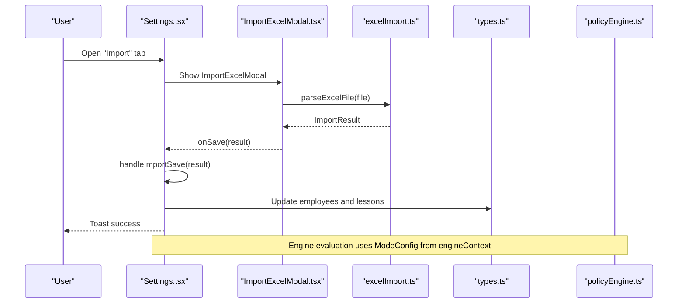
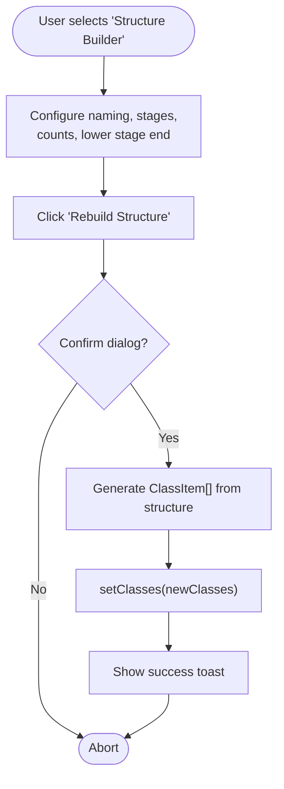
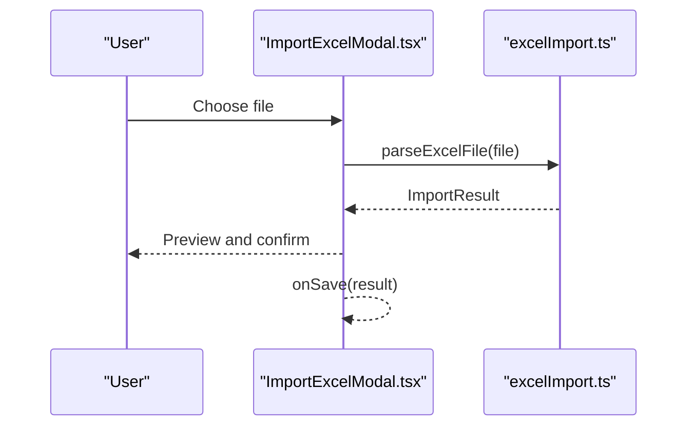
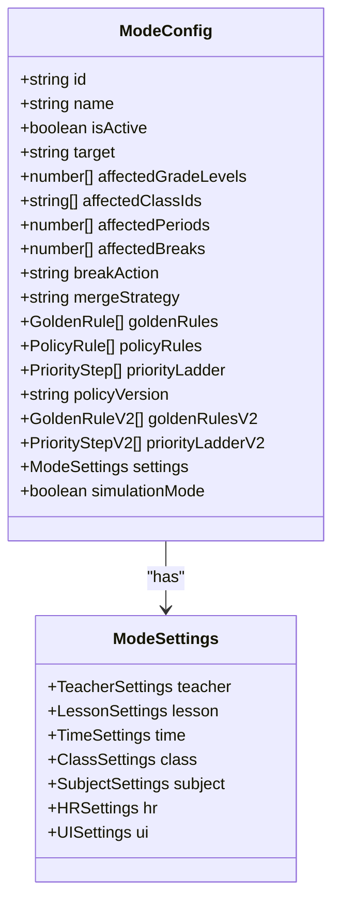
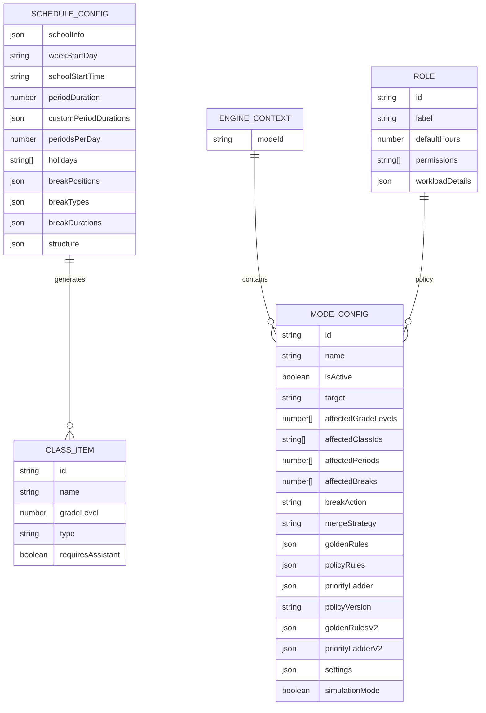
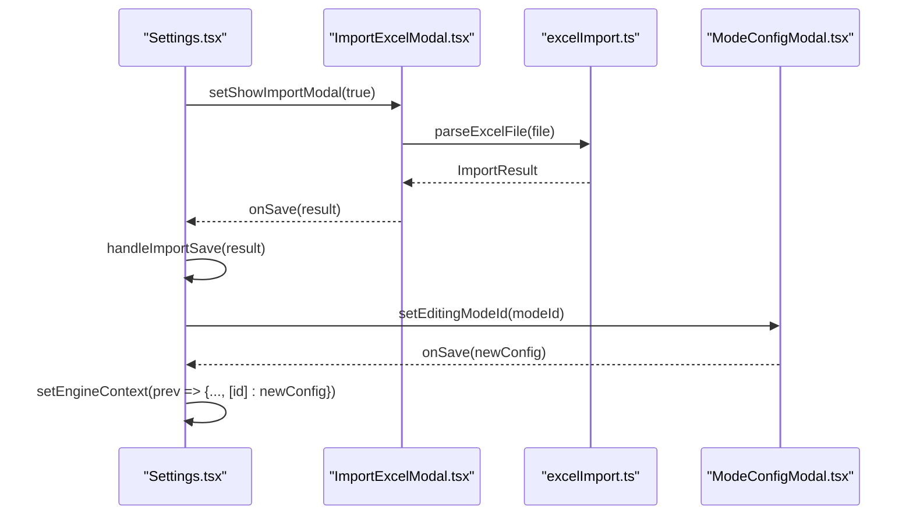
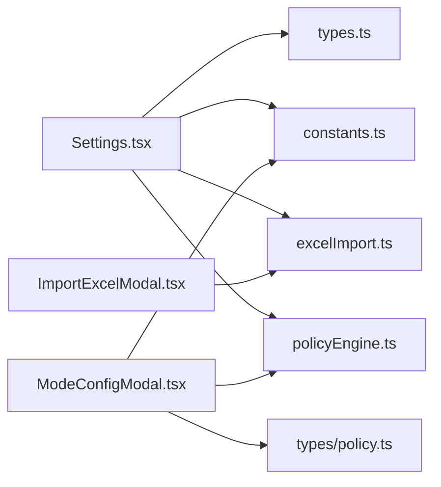

# Settings

<cite>
**Referenced Files in This Document**
- [Settings.tsx](file://components/Settings.tsx)
- [ImportExcelModal.tsx](file://components/ImportExcelModal.tsx)
- [ModeConfigModal.tsx](file://components/ModeConfigModal.tsx)
- [excelImport.ts](file://utils/excelImport.ts)
- [policyEngine.ts](file://utils/policyEngine.ts)
- [policy.ts](file://types/policy.ts)
- [types.ts](file://types.ts)
- [constants.ts](file://constants.ts)
- [excelWizardParser.ts](file://utils/excelWizardParser.ts)
</cite>

## Table of Contents
1. [Introduction](#introduction)
2. [Project Structure](#project-structure)
3. [Core Components](#core-components)
4. [Architecture Overview](#architecture-overview)
5. [Detailed Component Analysis](#detailed-component-analysis)
6. [Dependency Analysis](#dependency-analysis)
7. [Performance Considerations](#performance-considerations)
8. [Troubleshooting Guide](#troubleshooting-guide)
9. [Conclusion](#conclusion)
10. [Appendices](#appendices)

## Introduction
This document explains the Settings feature as a comprehensive configuration hub for a school scheduling and policy engine. It covers the main Settings component and its child modals, the domain model (ScheduleConfig, Role, ClassItem, EngineContext, ModeConfig), and how they enable complex school configuration. It also documents usage patterns for configuring school identity, building class structure, managing roles and permissions, and configuring protocol modes. Concrete examples show how handleRebuildStructure generates classes and how handleAddWeightedMode creates new operational modes. The document addresses configuration options like validateDeleteClass, and parameters such as activeTab, editingModeId, and isGenerating. It also explains how the component integrates with the policy engine via engineContext and supports data import/export, with guidance for data consistency during structural changes.

## Project Structure
The Settings feature spans several files:
- Main Settings component orchestrates tabs and state.
- Child modals: ImportExcelModal for data import and ModeConfigModal for protocol mode configuration.
- Utilities: Excel parsing and policy engine evaluation.
- Types: Domain models and policy structures.
- Constants: Defaults and golden rules.

```mermaid
graph TB
subgraph "UI Components"
Settings["Settings.tsx"]
ImportModal["ImportExcelModal.tsx"]
ModeModal["ModeConfigModal.tsx"]
end
subgraph "Utilities"
Excel["excelImport.ts"]
Engine["policyEngine.ts"]
Wizard["excelWizardParser.ts"]
end
subgraph "Types"
Types["types.ts"]
PolicyTypes["types/policy.ts"]
Consts["constants.ts"]
end
Settings --> ImportModal
Settings --> ModeModal
ImportModal --> Excel
ModeModal --> PolicyTypes
Settings --> Types
Settings --> Consts
Settings --> Engine
Wizard -. "alternative import flow" .-> Settings
```

**Diagram sources**
- [Settings.tsx](file://components/Settings.tsx#L1-L120)
- [ImportExcelModal.tsx](file://components/ImportExcelModal.tsx#L1-L60)
- [ModeConfigModal.tsx](file://components/ModeConfigModal.tsx#L1-L60)
- [excelImport.ts](file://utils/excelImport.ts#L1-L60)
- [policyEngine.ts](file://utils/policyEngine.ts#L1-L60)
- [excelWizardParser.ts](file://utils/excelWizardParser.ts#L1-L60)
- [types.ts](file://types.ts#L55-L221)
- [policy.ts](file://types/policy.ts#L1-L60)
- [constants.ts](file://constants.ts#L86-L140)

**Section sources**
- [Settings.tsx](file://components/Settings.tsx#L1-L120)
- [ImportExcelModal.tsx](file://components/ImportExcelModal.tsx#L1-L60)
- [ModeConfigModal.tsx](file://components/ModeConfigModal.tsx#L1-L60)
- [excelImport.ts](file://utils/excelImport.ts#L1-L60)
- [policyEngine.ts](file://utils/policyEngine.ts#L1-L60)
- [excelWizardParser.ts](file://utils/excelWizardParser.ts#L1-L60)
- [types.ts](file://types.ts#L55-L221)
- [policy.ts](file://types/policy.ts#L1-L60)
- [constants.ts](file://constants.ts#L86-L140)

## Core Components
- Settings: Main configuration hub with five tabs—Identity & Time Flow, Structure Builder, Roles & Permissions, Protocol Engine, and Import. Manages scheduleConfig, roles, classes, engineContext, and validation callbacks.
- ImportExcelModal: Excel-based import wizard that parses matrix-style timetables and previews results before saving.
- ModeConfigModal: Deep editor for operational modes (ModeConfig), including settings, golden rules, priority ladder, scope, and impact simulation.

Key props and state:
- activeTab: Tracks currently selected tab.
- editingModeId: Tracks which mode is being edited.
- editingRoleId: Tracks which role is being edited.
- isGenerating: Prevents concurrent rebuilds.
- showImportModal: Controls visibility of the import modal.

**Section sources**
- [Settings.tsx](file://components/Settings.tsx#L62-L120)
- [ImportExcelModal.tsx](file://components/ImportExcelModal.tsx#L8-L25)
- [ModeConfigModal.tsx](file://components/ModeConfigModal.tsx#L24-L41)

## Architecture Overview
The Settings component coordinates configuration across multiple domains:
- Identity and time flow: scheduleConfig controls school info, calendar, and time slots.
- Structure builder: scheduleConfig.structure defines class counts and naming conventions; handleRebuildStructure regenerates classes.
- Roles and permissions: roles array with permission flags and workload details.
- Protocol engine: engineContext holds ModeConfig instances; ModeConfigModal edits modes; policyEngine evaluates decisions.
- Import/export: ImportExcelModal parses Excel matrices; Settings integrates parsed data into employees and lessons.



**Diagram sources**
- [Settings.tsx](file://components/Settings.tsx#L249-L324)
- [ImportExcelModal.tsx](file://components/ImportExcelModal.tsx#L36-L60)
- [excelImport.ts](file://utils/excelImport.ts#L41-L189)
- [policyEngine.ts](file://utils/policyEngine.ts#L255-L406)
- [types.ts](file://types.ts#L10-L51)

## Detailed Component Analysis

### Settings Component
- Tabs and navigation: activeTab drives rendering of identity, structure, roles, protocol, and import sections.
- Identity & Time Flow:
  - School info: name and logo upload.
  - Calendar: week start day and holidays.
  - Time Flow Engineering: dynamic timeline calculation from scheduleConfig, with per-period durations and break types/durations.
- Structure Builder:
  - Naming convention (alpha/numeric), merge special naming, active stages (primary/middle/secondary), lower stage end threshold.
  - Per-grade counts for general and special classes.
  - handleRebuildStructure: generates ClassItem[] based on structure configuration and updates classes state.
- Roles & Permissions:
  - Manage roles with labels, default hours, workload details, and permissions.
  - validateDeleteRole prevents deletion if not allowed.
- Protocol Engine:
  - View and activate/deactivate modes; edit via ModeConfigModal.
  - handleAddWeightedMode: creates a new ModeConfig with default settings and adds it to engineContext.
- Import:
  - ImportExcelModal triggers parseExcelFile and merges results into employees and lessons.
  - handleClearData clears employees and lessons with confirmation.



**Diagram sources**
- [Settings.tsx](file://components/Settings.tsx#L149-L217)

**Section sources**
- [Settings.tsx](file://components/Settings.tsx#L120-L217)
- [Settings.tsx](file://components/Settings.tsx#L219-L324)
- [Settings.tsx](file://components/Settings.tsx#L326-L333)
- [Settings.tsx](file://components/Settings.tsx#L800-L828)
- [Settings.tsx](file://components/Settings.tsx#L832-L920)

### ImportExcelModal
- Uploads Excel files and parses them into ImportResult.
- Provides preview statistics and error reporting.
- Saves parsed data via onSave callback.



**Diagram sources**
- [ImportExcelModal.tsx](file://components/ImportExcelModal.tsx#L36-L60)
- [excelImport.ts](file://utils/excelImport.ts#L41-L189)

**Section sources**
- [ImportExcelModal.tsx](file://components/ImportExcelModal.tsx#L1-L120)
- [excelImport.ts](file://utils/excelImport.ts#L1-L189)

### ModeConfigModal
- Edits ModeConfig with tabs for settings, rules, priority ladder, scope, and impact.
- Validates mode activation and syncs settings between V1 and V2.
- Computes active grades from class names.



**Diagram sources**
- [ModeConfigModal.tsx](file://components/ModeConfigModal.tsx#L1-L60)
- [types.ts](file://types.ts#L169-L217)
- [policy.ts](file://types/policy.ts#L83-L140)

**Section sources**
- [ModeConfigModal.tsx](file://components/ModeConfigModal.tsx#L61-L132)
- [ModeConfigModal.tsx](file://components/ModeConfigModal.tsx#L133-L210)
- [policy.ts](file://types/policy.ts#L1-L162)

### Domain Model
- ScheduleConfig: schoolInfo, weekStartDay, schoolStartTime, periodDuration, periodsPerDay, holidays, breakPositions, breakTypes, breakDurations, and structure.
- Role: id, label, defaultHours, permissions, workloadDetails.
- ClassItem: id, name, gradeLevel, type, requiresAssistant.
- EngineContext: map of modeId to ModeConfig.
- ModeConfig: operational mode configuration including golden rules, priority ladder, settings, and scenario-specific fields.



**Diagram sources**
- [types.ts](file://types.ts#L55-L116)
- [types.ts](file://types.ts#L169-L217)
- [types.ts](file://types.ts#L218-L221)

**Section sources**
- [types.ts](file://types.ts#L55-L116)
- [types.ts](file://types.ts#L169-L217)
- [types.ts](file://types.ts#L218-L221)

### Usage Patterns and Examples

- Configuring school identity:
  - Update schoolInfo.name and upload logo via handleLogoUpload.
  - Set weekStartDay and toggle holidays.
  - Adjust schoolStartTime and periodsPerDay.

- Building class structure:
  - Select naming convention and whether to merge special naming.
  - Toggle active stages and set lowerStageEnd.
  - Adjust generalCounts and specialCounts per grade.
  - Trigger handleRebuildStructure to regenerate classes.

- Managing roles and permissions:
  - Add role with handleAddRole.
  - Edit role label and workload details.
  - Toggle permissions via togglePermission.
  - Delete role with validateDeleteRole check.

- Configuring protocol modes:
  - Activate/deactivate modes from the protocol dashboard.
  - Create new weighted mode with handleAddWeightedMode.
  - Deep-edit via ModeConfigModal, including settings, golden rules, priority ladder, scope, and impact.

- Import/export:
  - Use ImportExcelModal to upload Excel files and preview results.
  - handleImportSave merges teachers and lessons into app state.
  - handleClearData resets employees and lessons with confirmation.

**Section sources**
- [Settings.tsx](file://components/Settings.tsx#L102-L118)
- [Settings.tsx](file://components/Settings.tsx#L141-L148)
- [Settings.tsx](file://components/Settings.tsx#L149-L217)
- [Settings.tsx](file://components/Settings.tsx#L219-L247)
- [Settings.tsx](file://components/Settings.tsx#L652-L724)
- [Settings.tsx](file://components/Settings.tsx#L249-L324)
- [Settings.tsx](file://components/Settings.tsx#L832-L920)

### Invocation Relationships
- Settings invokes ImportExcelModal and ModeConfigModal via state flags and handlers.
- ModeConfigModal receives initialConfig from engineContext and saves back to engineContext.
- ImportExcelModal delegates parsing to excelImport.ts and returns ImportResult to Settings.



**Diagram sources**
- [Settings.tsx](file://components/Settings.tsx#L896-L920)
- [ImportExcelModal.tsx](file://components/ImportExcelModal.tsx#L36-L60)
- [excelImport.ts](file://utils/excelImport.ts#L41-L189)
- [ModeConfigModal.tsx](file://components/ModeConfigModal.tsx#L90-L132)

## Dependency Analysis
- Settings depends on:
  - types.ts for ScheduleConfig, Role, ClassItem, ModeConfig, EngineContext.
  - constants.ts for default schedule config, roles, golden rules, and default engine context.
  - policyEngine.ts for evaluation logic and decision traces.
  - utils/excelImport.ts for parsing Excel files.
- ModeConfigModal depends on:
  - types/policy.ts for GoldenRuleV2, PriorityStepV2, ModeSettings.
  - constants.ts for STANDARD_STAY_RULE and default ladder.
  - policyEngine.ts for validation helpers.



**Diagram sources**
- [Settings.tsx](file://components/Settings.tsx#L1-L120)
- [ModeConfigModal.tsx](file://components/ModeConfigModal.tsx#L1-L60)
- [types.ts](file://types.ts#L55-L221)
- [policy.ts](file://types/policy.ts#L1-L60)
- [constants.ts](file://constants.ts#L86-L140)
- [excelImport.ts](file://utils/excelImport.ts#L1-L60)
- [policyEngine.ts](file://utils/policyEngine.ts#L1-L60)

**Section sources**
- [Settings.tsx](file://components/Settings.tsx#L1-L120)
- [ModeConfigModal.tsx](file://components/ModeConfigModal.tsx#L1-L60)
- [types.ts](file://types.ts#L55-L221)
- [policy.ts](file://types/policy.ts#L1-L60)
- [constants.ts](file://constants.ts#L86-L140)
- [excelImport.ts](file://utils/excelImport.ts#L1-L60)
- [policyEngine.ts](file://utils/policyEngine.ts#L1-L60)

## Performance Considerations
- Time Flow Engineering computes a timeline array based on scheduleConfig; memoization avoids unnecessary recalculations.
- Rebuilding structure uses a short timeout to simulate work and then updates classes; keep the UI responsive by avoiding heavy synchronous operations.
- Import parsing reads entire sheets; large files may take time; consider progress indicators and cancellation where appropriate.
- ModeConfigModal validates configurations before saving; ensure validation logic remains efficient.

[No sources needed since this section provides general guidance]

## Troubleshooting Guide
Common issues and resolutions:
- Data consistency during structural changes:
  - Use confirmation dialogs before rebuilding classes to prevent accidental loss.
  - Validate deletions of classes and roles using validateDeleteClass and validateDeleteRole.
- Import conflicts:
  - Normalize names and IDs to reduce duplicates; the import logic checks for normalized name matches and national ID collisions.
  - Review preview errors and adjust file formatting accordingly.
- Mode configuration errors:
  - ModeConfigModal performs validation; address reported errors before saving.
  - For exam mode, ensure governing subject is set to pass validation.

**Section sources**
- [Settings.tsx](file://components/Settings.tsx#L149-L156)
- [Settings.tsx](file://components/Settings.tsx#L326-L333)
- [Settings.tsx](file://components/Settings.tsx#L656-L664)
- [excelImport.ts](file://utils/excelImport.ts#L1-L60)
- [ModeConfigModal.tsx](file://components/ModeConfigModal.tsx#L105-L132)

## Conclusion
The Settings feature provides a unified configuration hub for school identity, class structure, roles, protocol modes, and data import/export. Through clear separation of concerns—Settings orchestrating state, child modals handling specialized UI, and utilities managing parsing and policy evaluation—the system supports complex educational scheduling scenarios. By leveraging validateDeleteClass, validateDeleteRole, confirmation dialogs, and state validation, it maintains data integrity during structural changes. Integration with the policy engine via engineContext enables robust, configurable operational modes tailored to various school contexts.

[No sources needed since this section summarizes without analyzing specific files]

## Appendices

### Configuration Options and Parameters
- activeTab: Determines which Settings tab is visible.
- editingModeId: Tracks the mode being edited; opens ModeConfigModal.
- editingRoleId: Tracks the role being edited; enables inline editing.
- isGenerating: Prevents concurrent rebuilds during handleRebuildStructure.
- validateDeleteClass and validateDeleteRole: Validation callbacks to prevent unsafe deletions.

**Section sources**
- [Settings.tsx](file://components/Settings.tsx#L62-L120)
- [Settings.tsx](file://components/Settings.tsx#L656-L664)

### Example Paths
- handleRebuildStructure: [Settings.tsx](file://components/Settings.tsx#L149-L217)
- handleAddWeightedMode: [Settings.tsx](file://components/Settings.tsx#L233-L247)
- handleImportSave: [Settings.tsx](file://components/Settings.tsx#L249-L324)
- parseExcelFile: [excelImport.ts](file://utils/excelImport.ts#L41-L189)
- evaluatePolicyV2: [policyEngine.ts](file://utils/policyEngine.ts#L255-L406)