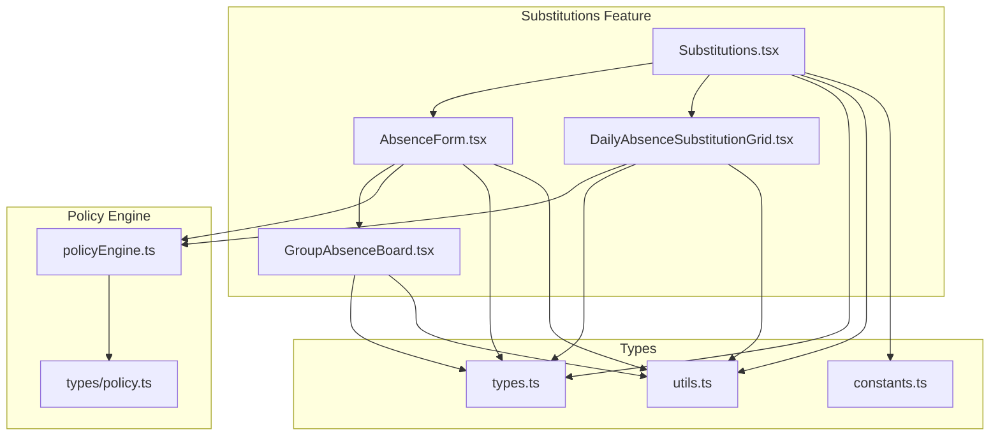
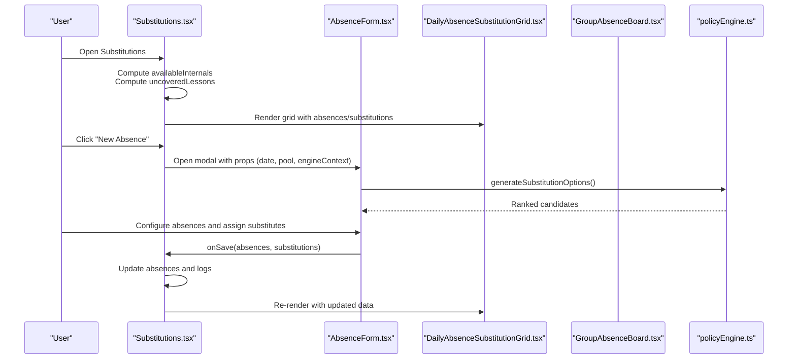
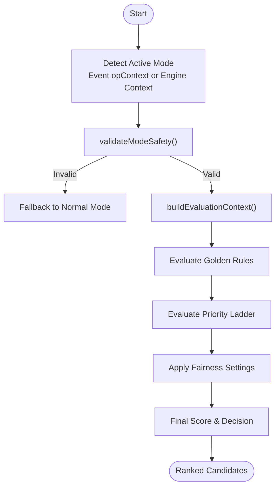
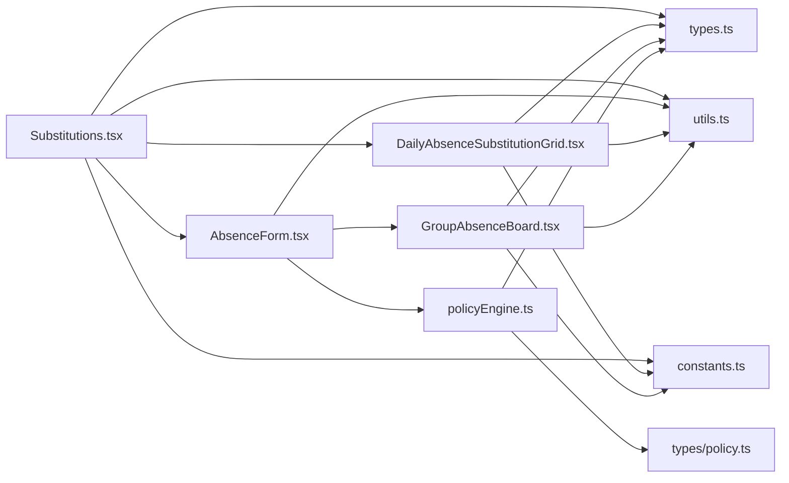
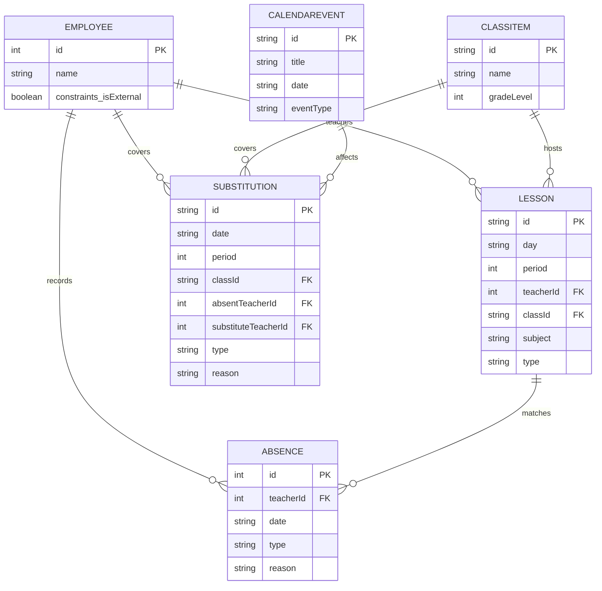

# Substitutions

<cite>
**Referenced Files in This Document**
- [Substitutions.tsx](file://components/Substitutions.tsx)
- [AbsenceForm.tsx](file://components/AbsenceForm.tsx)
- [DailyAbsenceSubstitutionGrid.tsx](file://components/DailyAbsenceSubstitutionGrid.tsx)
- [GroupAbsenceBoard.tsx](file://components/GroupAbsenceBoard.tsx)
- [policyEngine.ts](file://utils/policyEngine.ts)
- [policy.ts](file://types/policy.ts)
- [types.ts](file://types.ts)
- [utils.ts](file://utils.ts)
- [constants.ts](file://constants.ts)
</cite>

## Table of Contents
1. [Introduction](#introduction)
2. [Project Structure](#project-structure)
3. [Core Components](#core-components)
4. [Architecture Overview](#architecture-overview)
5. [Detailed Component Analysis](#detailed-component-analysis)
6. [Dependency Analysis](#dependency-analysis)
7. [Performance Considerations](#performance-considerations)
8. [Troubleshooting Guide](#troubleshooting-guide)
9. [Conclusion](#conclusion)
10. [Appendices](#appendices)

## Introduction
This document explains the Substitutions feature as a comprehensive absence management system. It covers how the main Substitutions component orchestrates absence recording, resource pool management, and substitution assignment, and how it integrates with the policy engine to enforce rules and produce explainable decisions. It also documents the domain model (AbsenceRecord, SubstitutionLog) and how it relates to Employee, Lesson, and ClassItem, and provides practical usage patterns and configuration options.

## Project Structure
The Substitutions feature is composed of:
- A main container component that manages state, computes availability and gaps, and renders child components.
- A modal form for recording absences and assigning substitutes.
- A grid view for visualizing daily absences and substitutions.
- A board for bulk assignment and candidate recommendation.
- A policy engine that evaluates candidates and enforces mode-specific rules.

**Diagram sources**
- [Substitutions.tsx](file://components/Substitutions.tsx#L1-L531)
- [AbsenceForm.tsx](file://components/AbsenceForm.tsx#L1-L935)
- [DailyAbsenceSubstitutionGrid.tsx](file://components/DailyAbsenceSubstitutionGrid.tsx#L1-L363)
- [GroupAbsenceBoard.tsx](file://components/GroupAbsenceBoard.tsx#L1-L525)
- [policyEngine.ts](file://utils/policyEngine.ts#L1-L406)
- [policy.ts](file://types/policy.ts#L1-L162)
- [types.ts](file://types.ts#L1-L382)
- [utils.ts](file://utils.ts#L1-L593)
- [constants.ts](file://constants.ts#L1-L438)

**Section sources**
- [Substitutions.tsx](file://components/Substitutions.tsx#L1-L120)
- [AbsenceForm.tsx](file://components/AbsenceForm.tsx#L1-L120)
- [DailyAbsenceSubstitutionGrid.tsx](file://components/DailyAbsenceSubstitutionGrid.tsx#L1-L60)
- [GroupAbsenceBoard.tsx](file://components/GroupAbsenceBoard.tsx#L1-L60)
- [policyEngine.ts](file://utils/policyEngine.ts#L1-L60)
- [types.ts](file://types.ts#L1-L120)
- [utils.ts](file://utils.ts#L1-L60)
- [constants.ts](file://constants.ts#L1-L40)

## Core Components
- Substitutions: Orchestrates absence recording, resource pool, and substitution visualization. Computes available internals, active events banner, and uncovered lessons. Manages handlers for saving/deleting absences and logs.
- AbsenceForm: Multi-step wizard to record absences, configure partial absences, and auto/manual assign substitutes. Integrates with the policy engine to propose candidates and respects calendar events.
- DailyAbsenceSubstitutionGrid: Visual grid showing absent teachers’ lessons and substitutes’ coverage, with badges for roles and actions to edit or unassign.
- GroupAbsenceBoard: Interactive board for manual and bulk assignment, with candidate filtering and priority logic.

**Section sources**
- [Substitutions.tsx](file://components/Substitutions.tsx#L1-L210)
- [AbsenceForm.tsx](file://components/AbsenceForm.tsx#L1-L200)
- [DailyAbsenceSubstitutionGrid.tsx](file://components/DailyAbsenceSubstitutionGrid.tsx#L1-L120)
- [GroupAbsenceBoard.tsx](file://components/GroupAbsenceBoard.tsx#L1-L120)

## Architecture Overview
The Substitutions feature follows a parent-child composition:
- Substitutions holds global state (selectedDate, activePoolIds, internalFilter) and derived computations (availableInternals, uncoveredLessons).
- AbsenceForm is a modal invoked from Substitutions to create/update absences and manage substitution logs.
- DailyAbsenceSubstitutionGrid renders the daily view of absences vs. substitutions.
- GroupAbsenceBoard is embedded inside AbsenceForm for interactive assignment.

**Diagram sources**
- [Substitutions.tsx](file://components/Substitutions.tsx#L1-L210)
- [AbsenceForm.tsx](file://components/AbsenceForm.tsx#L1-L200)
- [DailyAbsenceSubstitutionGrid.tsx](file://components/DailyAbsenceSubstitutionGrid.tsx#L1-L120)
- [GroupAbsenceBoard.tsx](file://components/GroupAbsenceBoard.tsx#L1-L120)
- [policyEngine.ts](file://utils/policyEngine.ts#L326-L445)

## Detailed Component Analysis

### Substitutions Component
Responsibilities:
- Manage selectedDate, activePoolIds, internalFilter.
- Compute availableInternals based on teacher availability and absence status.
- Compute uncoveredLessons by cross-checking absences and substitution logs.
- Integrate with engineContext to display active events and trigger protocol actions.
- Provide handlers to save/delete absences and manage logs.

Key computations:
- availableInternals: Filters out externals and absentees; determines FULL/LATE_START/EARLY_END statuses based on lessons on the selected day; excludes BUSY candidates.
- uncoveredLessons: For each absence on the selected date, collects lessons that are not yet covered by a substitution log for that date.

Configuration options:
- onOpenRequestForm: Opens a request form pre-filled with date, title, type, description, autoSmartMode, and poolIds.
- selectedDate: Controls the current day’s view and calculations.
- activePoolIds: Global resource pool identifiers for quick assignment.
- internalFilter: 'ALL' | 'FULL' | 'LATE' | 'EARLY' to categorize available internals.

Usage patterns:
- Recording absences: Click “New Absence” to open the form; configure dates, types, reasons, and affected periods; assign substitutes; submit.
- Managing resource pool: Toggle activePoolIds to mark available externals and internals for immediate call-out.
- Assigning substitutes: Use the grid to edit absences or unassign substitutions; use the form’s board to assign/bulk assign.

Common issues and solutions:
- Concurrent edits: The component uses React state and memoized derivations to keep views consistent. Handlers update absences and logs atomically to prevent stale reads. For advanced scenarios, consider moving to a centralized state manager or optimistic updates with conflict resolution.

**Section sources**
- [Substitutions.tsx](file://components/Substitutions.tsx#L50-L120)
- [Substitutions.tsx](file://components/Substitutions.tsx#L120-L210)
- [Substitutions.tsx](file://components/Substitutions.tsx#L210-L360)
- [Substitutions.tsx](file://components/Substitutions.tsx#L360-L531)

### AbsenceForm Component
Responsibilities:
- Multi-step workflow: Scope selection, details configuration, and resolution with substitution assignment.
- Pool wizard: Select active external/internal candidates for the day.
- Auto-assignment: Uses generateSubstitutionOptions to propose candidates based on the active mode and engine context.
- Manual assignment: Board-based drag-and-drop or click-to-assign; bulk assign to all lessons for a teacher.

Key computations:
- availableInternals (wizard): Same availability logic as Substitutions, scoped to the board view date.
- generateSubstitutionOptions: Determines active mode (event-specific or global), validates mode safety, checks event overlays and off-duty constraints, and evaluates candidates via evaluatePolicyV2.

Usage patterns:
- Partial absence inference: Detects contiguous/non-contiguous patterns and labels for LATE/LEAVE_UNTIL_END/LEAVE_AND_RETURN.
- Batch auto-assign: Iterates through affected lessons and assigns the best candidate considering load, events, and mode settings.
- Manual board assign/unassign: Updates logs and assignments reactively.

**Section sources**
- [AbsenceForm.tsx](file://components/AbsenceForm.tsx#L1-L200)
- [AbsenceForm.tsx](file://components/AbsenceForm.tsx#L200-L520)
- [AbsenceForm.tsx](file://components/AbsenceForm.tsx#L520-L935)

### DailyAbsenceSubstitutionGrid Component
Responsibilities:
- Visual grid layout: Right-side absentees, left-side substitutes.
- Coverage detection: Marks uncovered lessons and shows substitute initials.
- Role badges: Educator, subject specialist, proctor, or support proctor based on events and subject match.
- Actions: Edit absence, cancel absence, unassign substitution.

Usage patterns:
- Drag-and-drop or click to assign substitutes.
- Hover actions to unassign or edit entries.

**Section sources**
- [DailyAbsenceSubstitutionGrid.tsx](file://components/DailyAbsenceSubstitutionGrid.tsx#L1-L120)
- [DailyAbsenceSubstitutionGrid.tsx](file://components/DailyAbsenceSubstitutionGrid.tsx#L120-L363)

### GroupAbsenceBoard Component
Responsibilities:
- Interactive board for manual and bulk assignment.
- Candidate prioritization: Pool-ready, educator, subject specialist, support proctor, released slots, free windows, stay/individual/support/busy.
- Event-awareness: Respects calendar events and exam modes to block or elevate candidates.

Usage patterns:
- Bulk assign to a teacher for all their lessons on the board date.
- Filter candidates by RECOMMENDED or ALL.

**Section sources**
- [GroupAbsenceBoard.tsx](file://components/GroupAbsenceBoard.tsx#L1-L200)
- [GroupAbsenceBoard.tsx](file://components/GroupAbsenceBoard.tsx#L200-L525)

### Policy Engine Integration
The policy engine drives substitution decisions:
- Mode activation: Event-specific opContext takes precedence; otherwise global engineContext.
- Safety validation: validateModeSafety ensures mode configuration is valid.
- Evaluation: evaluatePolicyV2 builds context (teacher, slot, relationships), applies settings, golden rules, and priority ladder, and produces a DecisionTrace with breakdown and final decision.
- Candidate scoring: generateSubstitutionOptions uses evaluatePolicyV2 to rank candidates and returns decisionType and reason.

**Diagram sources**
- [policyEngine.ts](file://utils/policyEngine.ts#L25-L66)
- [policyEngine.ts](file://utils/policyEngine.ts#L74-L202)
- [policyEngine.ts](file://utils/policyEngine.ts#L204-L406)
- [utils.ts](file://utils.ts#L326-L445)

**Section sources**
- [policyEngine.ts](file://utils/policyEngine.ts#L1-L406)
- [policy.ts](file://types/policy.ts#L1-L162)
- [utils.ts](file://utils.ts#L326-L558)

## Dependency Analysis
- Substitutions depends on:
  - types.ts for domain models (Employee, Lesson, ClassItem, AbsenceRecord, SubstitutionLog, EngineContext, CalendarEvent).
  - utils.ts for helpers (normalizeArabic, toLocalISOString, generateSubstitutionOptions).
  - constants.ts for DAYS_AR.
  - policyEngine.ts for evaluatePolicyV2 and validateModeSafety.
  - AbsenceForm and DailyAbsenceSubstitutionGrid as children.
- AbsenceForm depends on:
  - GroupAbsenceBoard for interactive assignment.
  - utils.ts for generateSubstitutionOptions.
  - policyEngine.ts for evaluatePolicyV2.
- DailyAbsenceSubstitutionGrid and GroupAbsenceBoard depend on:
  - types.ts for shapes.
  - utils.ts for normalization and helpers.
  - constants.ts for day names.

**Diagram sources**
- [Substitutions.tsx](file://components/Substitutions.tsx#L1-L120)
- [AbsenceForm.tsx](file://components/AbsenceForm.tsx#L1-L120)
- [DailyAbsenceSubstitutionGrid.tsx](file://components/DailyAbsenceSubstitutionGrid.tsx#L1-L60)
- [GroupAbsenceBoard.tsx](file://components/GroupAbsenceBoard.tsx#L1-L60)
- [policyEngine.ts](file://utils/policyEngine.ts#L1-L60)
- [policy.ts](file://types/policy.ts#L1-L60)
- [types.ts](file://types.ts#L1-L120)
- [utils.ts](file://utils.ts#L1-L60)
- [constants.ts](file://constants.ts#L1-L40)

**Section sources**
- [Substitutions.tsx](file://components/Substitutions.tsx#L1-L120)
- [AbsenceForm.tsx](file://components/AbsenceForm.tsx#L1-L120)
- [DailyAbsenceSubstitutionGrid.tsx](file://components/DailyAbsenceSubstitutionGrid.tsx#L1-L60)
- [GroupAbsenceBoard.tsx](file://components/GroupAbsenceBoard.tsx#L1-L60)
- [policyEngine.ts](file://utils/policyEngine.ts#L1-L60)
- [policy.ts](file://types/policy.ts#L1-L60)
- [types.ts](file://types.ts#L1-L120)
- [utils.ts](file://utils.ts#L1-L60)
- [constants.ts](file://constants.ts#L1-L40)

## Performance Considerations
- Memoization: Substitutions uses useMemo extensively for availableInternals, internalCounts, and uncoveredLessons to avoid recomputation on trivial state changes.
- Filtering and sorting: Candidate ranking in AbsenceForm and generateSubstitutionOptions sorts arrays; keep datasets bounded for large schools.
- Event checks: Multiple event lookups occur during auto-assign; cache event sets per date if performance becomes a concern.
- Rendering: Grid cells are rendered per period; consider virtualization for very long schedules.

[No sources needed since this section provides general guidance]

## Troubleshooting Guide
Common issues and resolutions:
- Duplicate assignments: The grid and form prevent assigning the same substitute to the same slot at the same time by filtering existing logs before adding new ones.
- Conflicting calendar events: Both AbsenceForm and DailyAbsenceSubstitutionGrid check for event overlays and may block or prompt for confirmation before editing.
- Off-duty teachers: The engine and form consider teachers who are not present during the period as unavailable for automatic assignment.
- Concurrency: Handlers update absences and logs atomically; for multi-user environments, consider backend synchronization or optimistic updates with conflict resolution.

**Section sources**
- [AbsenceForm.tsx](file://components/AbsenceForm.tsx#L325-L520)
- [DailyAbsenceSubstitutionGrid.tsx](file://components/DailyAbsenceSubstitutionGrid.tsx#L120-L240)
- [utils.ts](file://utils.ts#L326-L445)
- [policyEngine.ts](file://utils/policyEngine.ts#L376-L445)

## Conclusion
The Substitutions feature provides a robust, policy-driven absence and substitution management system. It combines a powerful policy engine with intuitive UI components to ensure fair, transparent, and efficient coverage decisions. By leveraging memoization, event-awareness, and mode-specific rules, it scales to complex scenarios like exams and trips while remaining accessible to users.

[No sources needed since this section summarizes without analyzing specific files]

## Appendices

### Domain Model and Relationships
- Employee: Person with constraints, subjects, addons, and workload.
- Lesson: Scheduled teaching slot with day, period, teacherId, classId, subject, type.
- ClassItem: Classroom with grade level and type.
- AbsenceRecord: Records a teacher’s absence on a given date with type and affected periods.
- SubstitutionLog: Tracks who covered which absent teacher’s lesson, including type and reason.
- CalendarEvent: Operational events affecting coverage (e.g., exams, trips).
- EngineContext: Active modes and settings influencing candidate evaluation.

**Diagram sources**
- [types.ts](file://types.ts#L1-L120)
- [types.ts](file://types.ts#L89-L116)
- [types.ts](file://types.ts#L218-L221)
- [types.ts](file://types.ts#L269-L289)

### How availableInternals is calculated
- Filters out external teachers and those already absent on the selected day.
- Retrieves the teacher’s lessons on the selected day (normalized day name).
- Computes status:
  - FULL if no lessons today.
  - LATE_START if first lesson starts later than early threshold.
  - EARLY_END if last lesson ends earlier than late threshold.
- Excludes BUSY candidates.

**Section sources**
- [Substitutions.tsx](file://components/Substitutions.tsx#L77-L121)
- [AbsenceForm.tsx](file://components/AbsenceForm.tsx#L246-L292)
- [utils.ts](file://utils.ts#L17-L27)
- [constants.ts](file://constants.ts#L1-L10)

### How uncoveredLessons identifies gaps
- For each absence on the selected date, finds lessons for that teacher on the same normalized day.
- Filters by absence type (FULL vs. affectedPeriods).
- Checks if a substitution log exists for the same date, period, and absent teacher.
- Collects lessons that are not covered.

**Section sources**
- [Substitutions.tsx](file://components/Substitutions.tsx#L130-L161)

### Integration with the policy engine via engineContext
- AbsenceForm and DailyAbsenceSubstitutionGrid pass engineContext to generateSubstitutionOptions and evaluatePolicyV2.
- generateSubstitutionOptions selects active mode (event opContext or global), validates safety, and ranks candidates.
- evaluatePolicyV2 builds context, applies settings, golden rules, and priority ladder, and returns a DecisionTrace.

**Section sources**
- [AbsenceForm.tsx](file://components/AbsenceForm.tsx#L326-L445)
- [DailyAbsenceSubstitutionGrid.tsx](file://components/DailyAbsenceSubstitutionGrid.tsx#L180-L240)
- [policyEngine.ts](file://utils/policyEngine.ts#L255-L406)
- [utils.ts](file://utils.ts#L326-L445)

### Displaying active events
- Substitutions computes activeEvents by filtering events where date equals selectedDate and opContext indicates active.
- Renders a banner indicating active modes (e.g., exams, smart patterns).

**Section sources**
- [Substitutions.tsx](file://components/Substitutions.tsx#L67-L75)

### Usage patterns
- Recording absences:
  - Open AbsenceForm, select teachers and date range, configure type and affected periods, and assign substitutes.
- Managing resource pool:
  - Toggle activePoolIds to include externals and internals for immediate call-out.
- Assigning substitutes:
  - Use grid actions to edit or unassign; use form board to assign or bulk assign.

**Section sources**
- [Substitutions.tsx](file://components/Substitutions.tsx#L210-L360)
- [AbsenceForm.tsx](file://components/AbsenceForm.tsx#L520-L935)
- [DailyAbsenceSubstitutionGrid.tsx](file://components/DailyAbsenceSubstitutionGrid.tsx#L120-L240)