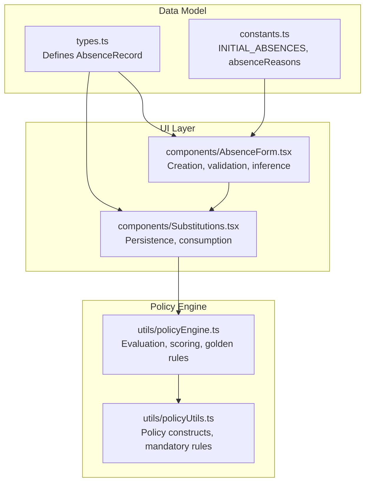
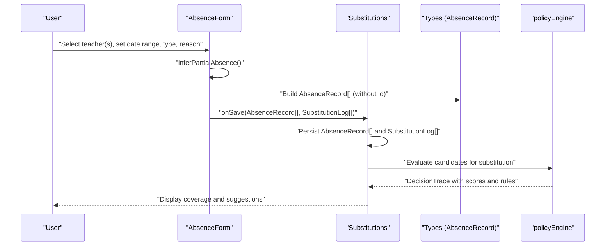
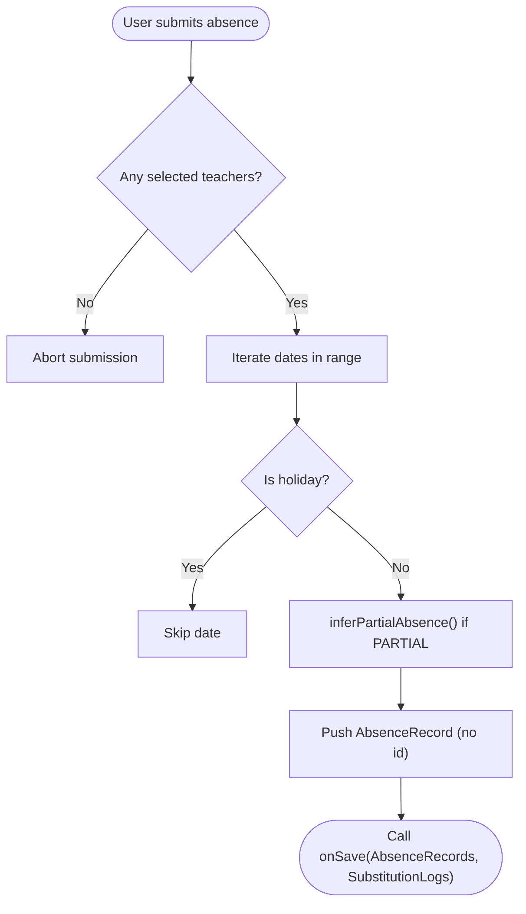
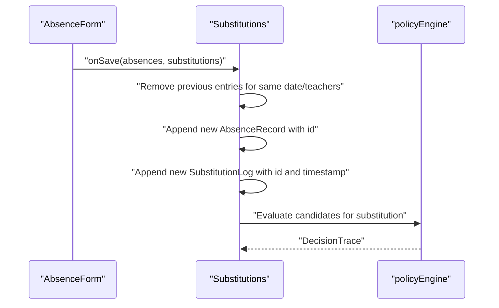
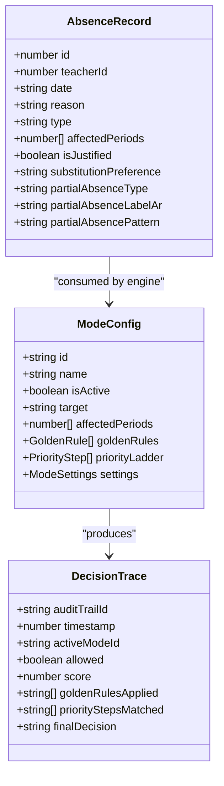
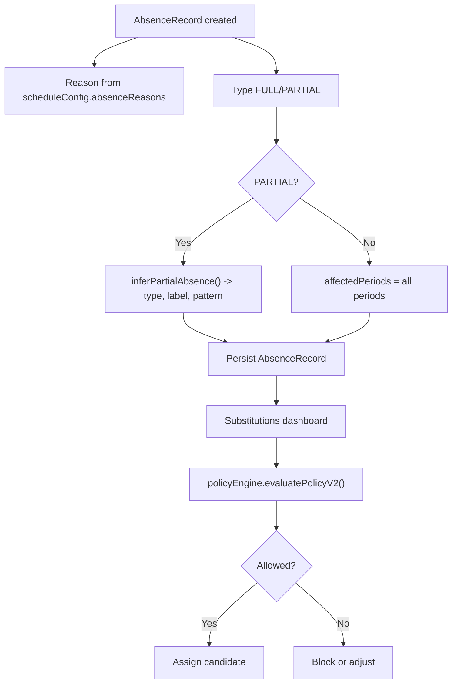
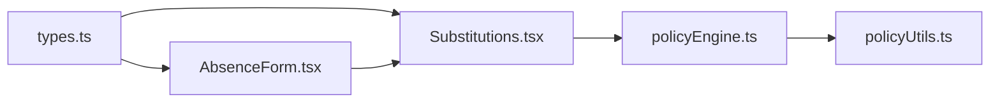

# Absence Record Data Model

<cite>
**Referenced Files in This Document**
- [types.ts](file://types.ts)
- [constants.ts](file://constants.ts)
- [components/AbsenceForm.tsx](file://components/AbsenceForm.tsx)
- [components/Substitutions.tsx](file://components/Substitutions.tsx)
- [utils/policyEngine.ts](file://utils/policyEngine.ts)
- [utils/policyUtils.ts](file://utils/policyUtils.ts)
</cite>

## Table of Contents
1. [Introduction](#introduction)
2. [Project Structure](#project-structure)
3. [Core Components](#core-components)
4. [Architecture Overview](#architecture-overview)
5. [Detailed Component Analysis](#detailed-component-analysis)
6. [Dependency Analysis](#dependency-analysis)
7. [Performance Considerations](#performance-considerations)
8. [Troubleshooting Guide](#troubleshooting-guide)
9. [Conclusion](#conclusion)
10. [Appendices](#appendices)

## Introduction
This document provides comprehensive data model documentation for AbsenceRecord, focusing on the structure, lifecycle, validation rules, persistence, and integration with the substitution evaluation engine. It explains each field, the partial absence inference logic, and how the system enforces business rules during creation, persistence, and substitution evaluation.

## Project Structure
The AbsenceRecord data model is defined in the shared types module and consumed by the AbsenceForm UI, Substitutions dashboard, and the policy engine. Constants define allowable absence reasons and initial datasets. The policy engine evaluates candidates for substitution considering absence types and mode-specific constraints.

**Diagram sources**
- [types.ts](file://types.ts#L89-L101)
- [constants.ts](file://constants.ts#L80-L84)
- [components/AbsenceForm.tsx](file://components/AbsenceForm.tsx#L559-L579)
- [components/Substitutions.tsx](file://components/Substitutions.tsx#L170-L199)
- [utils/policyEngine.ts](file://utils/policyEngine.ts#L255-L405)
- [utils/policyUtils.ts](file://utils/policyUtils.ts#L59-L117)

**Section sources**
- [types.ts](file://types.ts#L89-L101)
- [constants.ts](file://constants.ts#L80-L84)

## Core Components
- AbsenceRecord: The canonical absence entity persisted in application state.
- AbsenceForm: Creates and validates absence records, infers partial absence properties, and persists to state.
- Substitutions: Consumes AbsenceRecord to compute uncovered lessons and manage substitution logs.
- Policy Engine: Evaluates candidates for substitution using mode-configured golden rules and priority ladder.

**Section sources**
- [types.ts](file://types.ts#L89-L101)
- [components/AbsenceForm.tsx](file://components/AbsenceForm.tsx#L559-L579)
- [components/Substitutions.tsx](file://components/Substitutions.tsx#L170-L199)
- [utils/policyEngine.ts](file://utils/policyEngine.ts#L255-L405)

## Architecture Overview
The lifecycle of an AbsenceRecord follows these stages:
1. Creation via AbsenceForm: Users select teachers, configure type and affected periods, and optionally infer partial absence characteristics.
2. Validation and normalization: AbsenceForm validates ranges, excludes holidays, and computes inferred partial absence metadata.
3. Persistence: Substitutions updates application state with new AbsenceRecord entries and associated substitution logs.
4. Consumption by policyEngine: The engine evaluates candidates for substitution considering absence type, lesson type, and mode settings.

**Diagram sources**
- [components/AbsenceForm.tsx](file://components/AbsenceForm.tsx#L559-L579)
- [components/Substitutions.tsx](file://components/Substitutions.tsx#L170-L199)
- [utils/policyEngine.ts](file://utils/policyEngine.ts#L255-L405)
- [types.ts](file://types.ts#L89-L101)

## Detailed Component Analysis

### AbsenceRecord Field Reference
- id: Unique identifier assigned upon persistence.
- teacherId: Identifier of the absent employee.
- date: ISO string representing the absence date.
- reason: String enum drawn from scheduleConfig.absenceReasons.
- type: Enumerated as FULL or PARTIAL.
- affectedPeriods: Array of period indices included in the absence.
- isJustified: Optional boolean flag indicating justification status.
- substitutionPreference: Optional preferred substitute identifier.
- partialAbsenceType: Inferred for PARTIAL absences; values include LATE, LEAVE_AND_RETURN, LEAVE_UNTIL_END.
- partialAbsenceLabelAr: Localized label for the partial absence classification.
- partialAbsencePattern: Inferred pattern; CONTIGUOUS or NON_CONTIGUOUS.

These fields are defined in the shared types module and used across UI and engine components.

**Section sources**
- [types.ts](file://types.ts#L89-L101)

### AbsenceForm: Creation, Validation, and Inference
- Partial absence inference:
  - Computes contiguous vs non-contiguous sets of affected periods.
  - Derives type and label based on whether the absence covers the start/end of the day.
- Date range expansion:
  - Generates all dates between start and end dates, excluding holidays.
- Submission:
  - Builds an array of AbsenceRecord without id, then invokes onSave to persist.

**Diagram sources**
- [components/AbsenceForm.tsx](file://components/AbsenceForm.tsx#L559-L579)
- [components/AbsenceForm.tsx](file://components/AbsenceForm.tsx#L49-L80)

**Section sources**
- [components/AbsenceForm.tsx](file://components/AbsenceForm.tsx#L49-L80)
- [components/AbsenceForm.tsx](file://components/AbsenceForm.tsx#L559-L579)

### Substitutions: Persistence and Consumption
- Persistence:
  - Removes prior entries for the same date and teachers, then appends new AbsenceRecord entries with generated ids.
  - Cleans and appends new substitution logs with generated ids and timestamps.
- Consumption:
  - Filters absences by selected date to compute uncovered lessons and display coverage statistics.

**Diagram sources**
- [components/Substitutions.tsx](file://components/Substitutions.tsx#L170-L199)
- [utils/policyEngine.ts](file://utils/policyEngine.ts#L255-L405)

**Section sources**
- [components/Substitutions.tsx](file://components/Substitutions.tsx#L170-L199)

### Policy Engine Integration
- Evaluation context:
  - Uses AbsenceRecord and lesson metadata to derive slot state and candidate availability.
- Golden rules and priority ladder:
  - Enforce constraints such as protection of stay/individual lessons and mode-specific rules.
- Decision trace:
  - Produces a structured trace of allowed decisions, scores, and rule application.

**Diagram sources**
- [types.ts](file://types.ts#L89-L101)
- [types.ts](file://types.ts#L169-L216)
- [types.ts](file://types.ts#L141-L156)
- [utils/policyEngine.ts](file://utils/policyEngine.ts#L255-L405)

**Section sources**
- [utils/policyEngine.ts](file://utils/policyEngine.ts#L255-L405)
- [utils/policyUtils.ts](file://utils/policyUtils.ts#L59-L117)

### Business Rules and Justification Workflows
- Absence reasons:
  - Defined centrally and used by AbsenceForm to populate the reason dropdown.
- Partial absence classification:
  - Determined by contiguous/non-contiguous affected periods and whether the absence covers the start or end of the day.
- Golden rules:
  - Mandatory rules prevent assignment from stay/individual lessons and enforce sanctity of actual lessons.
- Mode-specific constraints:
  - Settings in ModeConfig govern lesson types, teacher constraints, and HR limits that influence substitution eligibility.

**Diagram sources**
- [constants.ts](file://constants.ts#L80-L84)
- [components/AbsenceForm.tsx](file://components/AbsenceForm.tsx#L49-L80)
- [components/Substitutions.tsx](file://components/Substitutions.tsx#L170-L199)
- [utils/policyEngine.ts](file://utils/policyEngine.ts#L255-L405)
- [utils/policyUtils.ts](file://utils/policyUtils.ts#L59-L117)

**Section sources**
- [constants.ts](file://constants.ts#L80-L84)
- [utils/policyUtils.ts](file://utils/policyUtils.ts#L59-L117)

### Integration Context with Substitutions.tsx
- AbsenceForm is launched from Substitutions, passing engineContext and existingAbsences/substitutionLogs.
- After saving, Substitutions updates state and re-evaluates coverage.

**Section sources**
- [components/Substitutions.tsx](file://components/Substitutions.tsx#L505-L525)
- [components/Substitutions.tsx](file://components/Substitutions.tsx#L170-L199)

### Example Instances from INITIAL_ABSENCES
- The repository defines an empty array for INITIAL_ABSENCES, indicating no pre-populated absence records at startup.

**Section sources**
- [constants.ts](file://constants.ts#L84-L84)

## Dependency Analysis
- Types dependency:
  - AbsenceRecord is defined in types.ts and referenced by AbsenceForm and Substitutions.
- UI-to-engine dependency:
  - Substitutions persists AbsenceRecord and feeds policyEngine for evaluation.
- Policy dependency:
  - policyEngine consumes AbsenceRecord and ModeConfig to produce DecisionTrace.

**Diagram sources**
- [types.ts](file://types.ts#L89-L101)
- [components/AbsenceForm.tsx](file://components/AbsenceForm.tsx#L559-L579)
- [components/Substitutions.tsx](file://components/Substitutions.tsx#L170-L199)
- [utils/policyEngine.ts](file://utils/policyEngine.ts#L255-L405)
- [utils/policyUtils.ts](file://utils/policyUtils.ts#L59-L117)

**Section sources**
- [types.ts](file://types.ts#L89-L101)
- [components/AbsenceForm.tsx](file://components/AbsenceForm.tsx#L559-L579)
- [components/Substitutions.tsx](file://components/Substitutions.tsx#L170-L199)
- [utils/policyEngine.ts](file://utils/policyEngine.ts#L255-L405)
- [utils/policyUtils.ts](file://utils/policyUtils.ts#L59-L117)

## Performance Considerations
- Partial absence inference operates on sorted arrays of affected periods; complexity is linear in the number of affected periods.
- Batch auto-assignment iterates over affected lessons and candidate pools; performance depends on the number of lessons and available candidates.
- Policy evaluation builds context and traverses priority ladder; complexity scales with the number of applicable rules and candidates.

[No sources needed since this section provides general guidance]

## Troubleshooting Guide
- Validation and error states:
  - AbsenceForm prevents selecting teachers already absent on the chosen date and displays toast notifications for conflicts.
  - AbsenceForm excludes holidays from the date range and skips those dates during submission.
  - Substitutions handles deletion of absence entries and clears related substitution logs.
- Common issues:
  - Attempting to assign substitutes to stay/individual/shared lessons may be blocked by golden rules.
  - Exceeding daily coverage limits or violating mode settings can reduce candidate scores or disallow assignments.

**Section sources**
- [components/AbsenceForm.tsx](file://components/AbsenceForm.tsx#L295-L306)
- [components/Substitutions.tsx](file://components/Substitutions.tsx#L196-L209)
- [utils/policyEngine.ts](file://utils/policyEngine.ts#L296-L315)

## Conclusion
AbsenceRecord encapsulates absence data with robust inference for partial absences and integrates tightly with UI forms and the policy engine. The lifecycle ensures validation, persistence, and intelligent substitution evaluation aligned with institutional rules and mode configurations.

[No sources needed since this section summarizes without analyzing specific files]

## Appendices

### Appendix A: AbsenceRecord Fields Summary
- id: Unique identifier assigned on persistence.
- teacherId: Reference to the absent employee.
- date: ISO date string.
- reason: From scheduleConfig.absenceReasons.
- type: FULL or PARTIAL.
- affectedPeriods: Array of period indices.
- isJustified: Optional boolean flag.
- substitutionPreference: Optional preferred substitute identifier.
- partialAbsenceType: LATE, LEAVE_AND_RETURN, LEAVE_UNTIL_END.
- partialAbsenceLabelAr: Localized label for partial absence.
- partialAbsencePattern: CONTIGUOUS or NON_CONTIGUOUS.

**Section sources**
- [types.ts](file://types.ts#L89-L101)

### Appendix B: Absence Reasons Enumeration
- Defined in constants.ts and used by AbsenceForm to populate the reason dropdown.

**Section sources**
- [constants.ts](file://constants.ts#L80-L84)