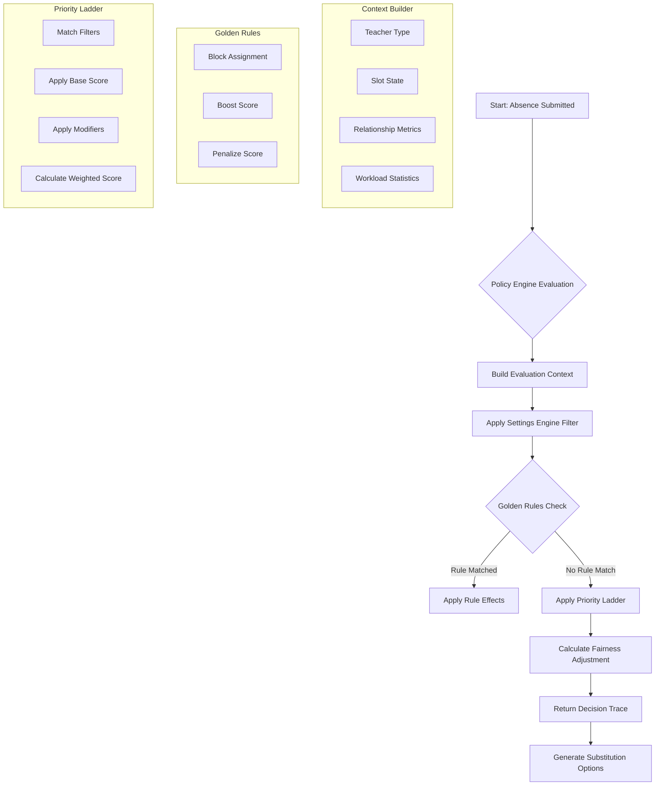
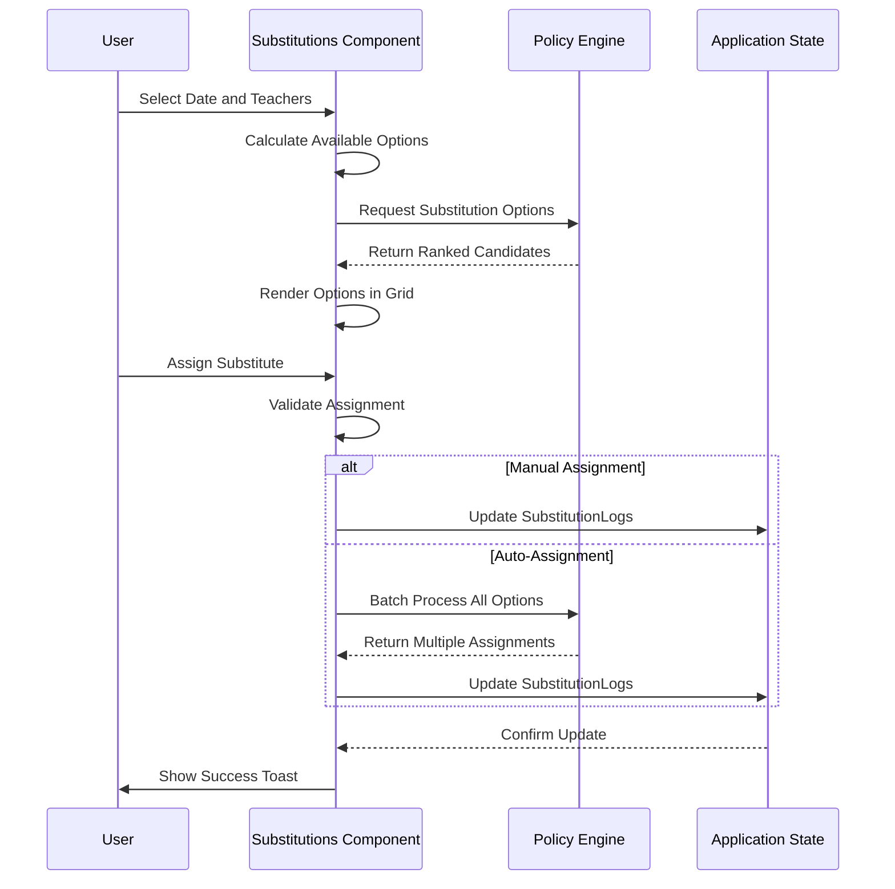
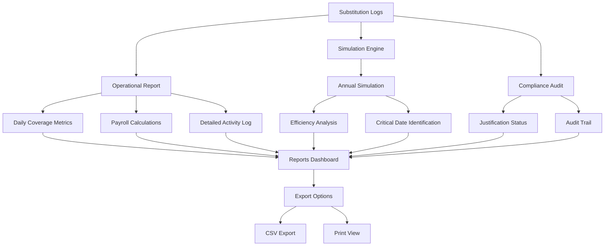

# Absence and Substitution Record Workflows

<cite>
**Referenced Files in This Document**   
- [AbsenceForm.tsx](file://components/AbsenceForm.tsx)
- [policyEngine.ts](file://utils/policyEngine.ts)
- [Substitutions.tsx](file://components/Substitutions.tsx)
- [Reports.tsx](file://components/Reports.tsx)
- [Settings.tsx](file://components/Settings.tsx)
- [AiAssistant.tsx](file://components/AiAssistant.tsx)
- [types.ts](file://types.ts)
- [policy.ts](file://types/policy.ts)
</cite>

## Table of Contents
1. [Introduction](#introduction)
2. [Absence Form Lifecycle](#absence-form-lifecycle)
3. [Policy Engine Decision Flow](#policy-engine-decision-flow)
4. [Substitution Management and Commitment](#substitution-management-and-commitment)
5. [Reporting and Analytics](#reporting-and-analytics)
6. [Settings and Compliance](#settings-and-compliance)
7. [AI Assistant Integration](#ai-assistant-integration)
8. [Error Handling and Edge Cases](#error-handling-and-edge-cases)
9. [Real-World Usage Scenarios](#real-world-usage-scenarios)
10. [Debugging and State Tracking](#debugging-and-state-tracking)

## Introduction
This document details the end-to-end lifecycle of absence and substitution records within the school management system. The workflow begins with user input through the AbsenceForm, where teachers or administrators record absences. These records trigger the policy engine to evaluate optimal substitution strategies based on predefined rules, golden rules, and a priority ladder. The system then renders available substitution options in the Substitutions interface, allowing users to commit assignments which generate SubstitutionLog entries. These logs feed into reporting tools for analytics and simulation tracking, while also supporting audit and compliance functions in the Settings module. The AI Assistant provides intelligent recommendations throughout the process. The documentation covers form structure, state management, decision logic, error handling, and real-world usage scenarios.

## Absence Form Lifecycle

The AbsenceForm component serves as the primary interface for recording teacher absences. It manages a three-stage workflow: scope definition, detail configuration, and resolution planning. The form uses React state hooks to manage selected teachers, date ranges, and substitution assignments. When a user selects a teacher, the form creates a SelectedTeacherState object containing the teacher's ID, start and end dates, absence type (full or partial), affected periods, and reason. The form supports both single and batch operations, allowing users to apply configurations across multiple teachers simultaneously.

For partial absences, the system infers the absence pattern (contiguous or non-contiguous) and type (late, leave until end, or leave and return) based on the selected periods. The form integrates with the toast notification system to provide user feedback and includes validation to prevent conflicts with existing absences. When submitted, the form generates AbsenceRecord objects and triggers the substitution process through the onSave callback, passing both absence records and substitution logs to the parent component.

**Section sources**
- [AbsenceForm.tsx](file://components/AbsenceForm.tsx#L1-L800)

## Policy Engine Decision Flow

**Diagram sources** 
- [policyEngine.ts](file://utils/policyEngine.ts#L255-L405)

**Section sources**
- [policyEngine.ts](file://utils/policyEngine.ts#L2-L406)

The policy engine evaluates substitution candidates through a multi-layered decision process. It begins by building an evaluation context that includes teacher attributes, slot characteristics, relationship metrics, and workload statistics. The settings engine acts as a preliminary filter, immediately rejecting candidates who are off-duty or immune from assignment. Golden rules are then evaluated based on condition groups that use AND, OR, or NAND logic operations. Active rules can block assignments, boost or penalize scores, or require specific actions.

If no golden rules block the assignment, the priority ladder is applied. Each priority step contains filters (condition groups) that determine eligibility, a base score, and modifiers that adjust the score based on additional conditions. The engine calculates a weighted score for each candidate, with steps potentially stopping on first match. Finally, fairness adjustments are applied based on the teacher's weekly coverage deviation, with strict modes applying a 50% score reduction for teachers with high workloads.

## Substitution Management and Commitment

**Diagram sources** 
- [Substitutions.tsx](file://components/Substitutions.tsx#L44-L620)
- [policyEngine.ts](file://utils/policyEngine.ts#L255-L405)

**Section sources**
- [Substitutions.tsx](file://components/Substitutions.tsx#L1-L620)

The Substitutions component manages the assignment of substitute teachers to cover absent staff. It provides a date selector and a pool management interface where administrators can designate available internal and external substitutes. The component calculates available options based on teacher schedules, current absences, and system constraints. When a user initiates auto-assignment, the system processes all uncovered lessons, checking candidate availability against schedule conflicts, existing substitutions, and event participation.

The assignment process follows a specific priority: external candidates from the active pool are considered first, followed by internal candidates ranked by availability (full day, late start, or early end). For each lesson, the system generates substitution options using the policy engine and assigns the highest-scoring candidate who meets all constraints. Manual assignments require explicit user action and include confirmation dialogs for protected slots. All assignments generate SubstitutionLog entries that capture the date, period, class, absent and substitute teacher IDs, assignment type, reason, mode context, and timestamp.

## Reporting and Analytics

**Diagram sources** 
- [Reports.tsx](file://components/Reports.tsx#L44-L784)

**Section sources**
- [Reports.tsx](file://components/Reports.tsx#L1-L784)

The Reports component aggregates substitution data for operational reporting, compliance auditing, and strategic simulation. The operational report provides executive summaries with key metrics including total coverage, absence counts, and fairness status. It includes specialized widgets for external payroll processing and compliance auditing, tracking which absence records have been justified and which remain pending.

The simulation engine runs annual projections to identify potential system vulnerabilities, calculating metrics like average efficiency, total uncovered periods, and critical dates with high risk. The reporting interface supports date-range filtering and provides export functionality for detailed reports in CSV format. The command center view offers real-time monitoring with KPIs for present staff, coverage rate, and uncovered lessons, enabling immediate intervention when coverage falls below acceptable thresholds.

## Settings and Compliance

The Settings component provides comprehensive configuration for the absence and substitution system. It includes modules for school identity, structural configuration, role management, and protocol engineering. Administrators can define school information, configure the daily time flow with custom period durations and break types, and set up the class structure by grade level and type. The role management interface allows creation of positions with specific permissions and workload expectations.

The protocol engine section enables configuration of mode-specific policies, including golden rules and priority ladders. Golden rules can be set with compliance percentages that introduce randomness in enforcement, while priority steps can be weighted and ordered to create sophisticated assignment hierarchies. The settings also support audit requirements, with options to make rule violations require justification and generate audit trails. This comprehensive configuration system ensures the substitution process aligns with institutional policies and regulatory requirements.

**Section sources**
- [Settings.tsx](file://components/Settings.tsx#L1-L800)

## AI Assistant Integration

The AI Assistant component provides intelligent support for absence and substitution management. It integrates with the Google Generative AI API to analyze current system state and provide context-aware recommendations. The assistant maintains a conversation history and can respond to queries about scheduling conflicts, absence patterns, and optimal substitution strategies. When activated, it receives contextual awareness data including current date, active absences, completed substitutions, and recent activity logs.

The assistant's responses are generated with consideration for educational stability and operational efficiency. It can identify trends in absence data, suggest staffing adjustments, and provide insights into system performance. The interface includes a chat-like input field where users can ask questions or request analysis, with responses displayed in a threaded conversation format. This AI-powered guidance helps administrators make informed decisions and optimize the substitution process.

**Section sources**
- [AiAssistant.tsx](file://components/AiAssistant.tsx#L1-L99)

## Error Handling and Edge Cases

The system implements comprehensive error handling for various edge cases in the absence and substitution workflow. When no substitutes are available for a lesson, the system flags the lesson as uncovered in the Substitutions interface, displaying a warning icon and including it in the uncovered lessons count. The auto-assignment process includes validation checks for schedule conflicts, daily coverage limits (maximum of 5 substitutions per day), and event participation conflicts.

For protected slots such as stay periods or exam supervision, the system requires explicit confirmation before allowing manual reassignment, displaying a warning dialog that explains the security implications. The form validation prevents submission of absences that conflict with existing records on the same date. The policy engine includes safety checks that validate mode configurations and prevent invalid rule definitions. Toast notifications provide immediate feedback for both successful operations and error conditions, helping users understand and resolve issues quickly.

**Section sources**
- [AbsenceForm.tsx](file://components/AbsenceForm.tsx#L295-L304)
- [Substitutions.tsx](file://components/Substitutions.tsx#L489-L498)
- [policyEngine.ts](file://utils/policyEngine.ts#L26-L43)

## Real-World Usage Scenarios

The absence and substitution system supports several key operational scenarios in educational institutions. For routine daily absences, administrators use the AbsenceForm to record teacher absences, with the system automatically suggesting optimal substitutes based on the configured policy engine. During exam periods, the exam mode activates specialized rules that prioritize subject specialists and homeroom teachers for supervision roles, ensuring academic integrity.

When multiple teachers are absent simultaneously, the system's batch processing capabilities allow efficient coverage of all affected lessons. The pool wizard enables rapid designation of available substitutes, particularly useful during staff shortages or special events. For long-term absences spanning multiple days, the system applies consistent substitution strategies across the entire period, maintaining educational continuity. The reporting tools help identify patterns in absence data, enabling proactive staffing adjustments and resource planning.

**Section sources**
- [AbsenceForm.tsx](file://components/AbsenceForm.tsx#L559-L579)
- [Substitutions.tsx](file://components/Substitutions.tsx#L344-L361)
- [Reports.tsx](file://components/Reports.tsx#L391-L621)

## Debugging and State Tracking

Effective debugging of absence and substitution records requires monitoring the state changes throughout the workflow. Key state variables to track include the selectedTeachers array in AbsenceForm, the substitutionLogs array in the application state, and the activeMode configuration in the engine context. The policy engine's decision trace provides detailed insight into the evaluation process, logging each rule applied, priority step matched, and score calculation.

When investigating assignment issues, developers should examine the context builder output to verify that teacher availability, workload statistics, and relationship metrics are correctly calculated. The sequence of operations from form submission to log creation should be traced through the onSave callback chain. For UI-related issues, the component's memoized values such as affectedLessons, boardViewLessons, and assignments should be inspected to ensure they accurately reflect the current state. The toast notification system provides additional visibility into user-facing operations and error conditions.

**Section sources**
- [AbsenceForm.tsx](file://components/AbsenceForm.tsx#L108-L127)
- [Substitutions.tsx](file://components/Substitutions.tsx#L50-L56)
- [policyEngine.ts](file://utils/policyEngine.ts#L268-L294)