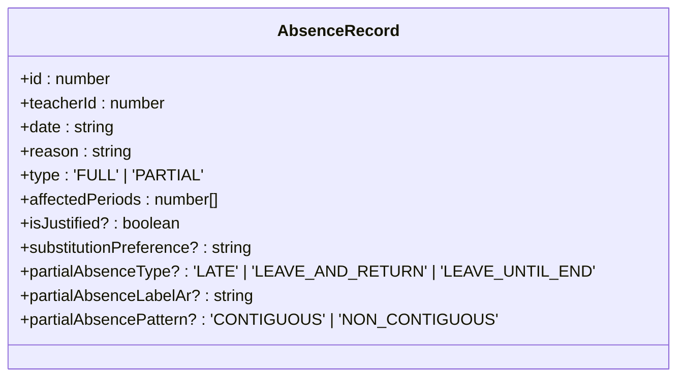
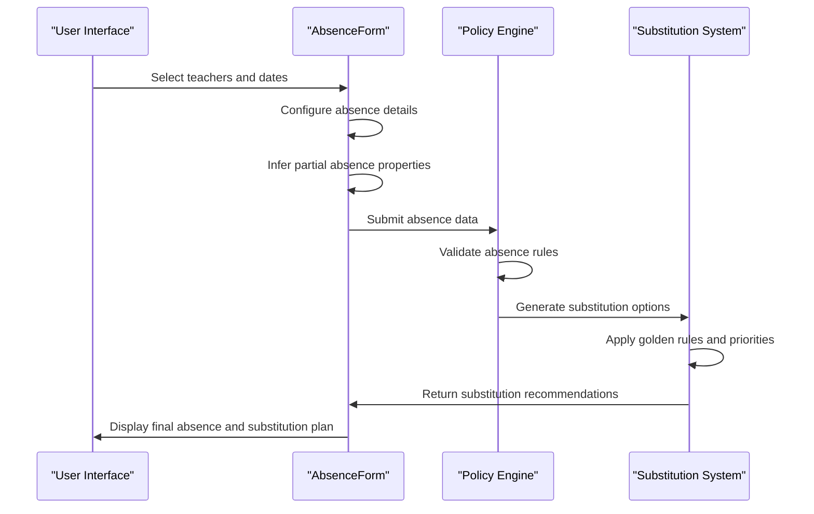
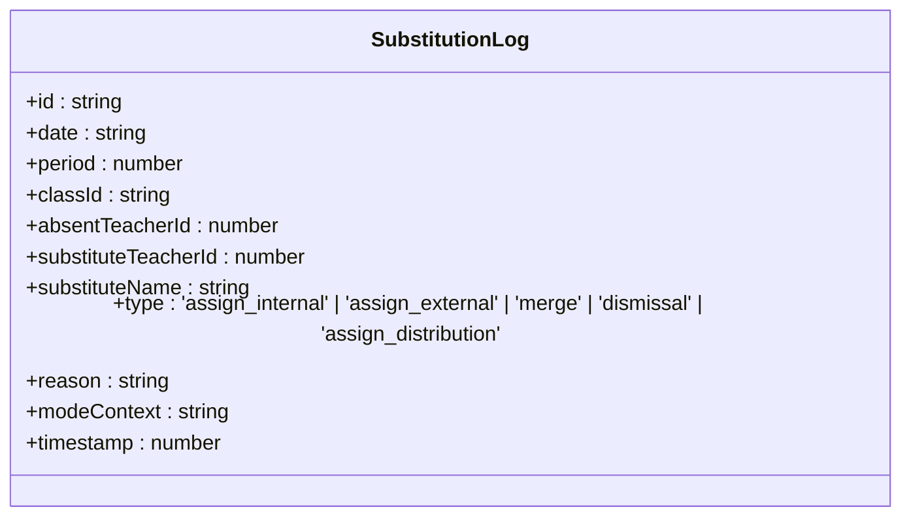
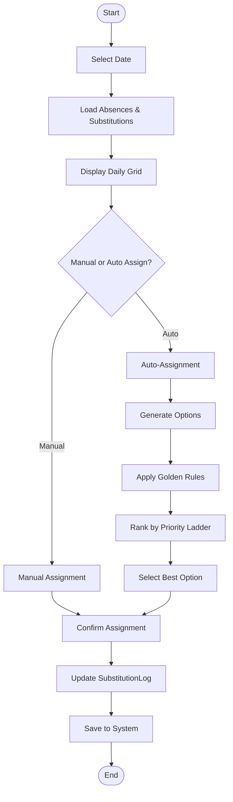

# Absence and Substitution Records

<cite>
**Referenced Files in This Document**   
- [types.ts](file://types.ts#L89-L115)
- [AbsenceForm.tsx](file://components/AbsenceForm.tsx)
- [policyEngine.ts](file://utils/policyEngine.ts)
- [Substitutions.tsx](file://components/Substitutions.tsx)
- [Reports.tsx](file://components/Reports.tsx)
- [Settings.tsx](file://components/Settings.tsx)
</cite>

## Table of Contents
1. [Introduction](#introduction)
2. [AbsenceRecord Data Model](#absencerecord-data-model)
3. [Partial Absence Properties](#partial-absence-properties)
4.. [Absence Lifecycle](#absence-lifecycle)
5. [SubstitutionLog Data Model](#substitutionlog-data-model)
6. [Substitution Workflow](#substitution-workflow)
7. [Reporting and Audit](#reporting-and-audit)
8. [Conclusion](#conclusion)

## Introduction
This document provides comprehensive documentation for the AbsenceRecord and SubstitutionLog data models within the school management system. It details the structure, lifecycle, and integration of these critical records that govern teacher absence management and substitution workflows. The AbsenceRecord captures comprehensive information about teacher absences, including full or partial absences with detailed properties, while the SubstitutionLog tracks all substitution assignments and decisions made by the system. These records are central to maintaining educational continuity, ensuring proper coverage of classes, and generating compliance reports.

## AbsenceRecord Data Model

The AbsenceRecord interface defines the structure for tracking teacher absences within the system. Each absence record contains comprehensive information about the absent teacher, date, reason, type, and affected periods. The data model supports both full-day and partial absences, with additional properties to capture the nature of partial absences.

**Diagram sources**
- [types.ts](file://types.ts#L89-L101)

**Section sources**
- [types.ts](file://types.ts#L89-L101)
- [AbsenceForm.tsx](file://components/AbsenceForm.tsx)

### Field Definitions
- **id**: Unique identifier for the absence record
- **teacherId**: Reference to the employee ID of the absent teacher
- **date**: Date of absence in ISO format (YYYY-MM-DD)
- **reason**: Textual reason for the absence (e.g., "مرضي", "مهمة")
- **type**: Indicates whether the absence is 'FULL' (full day) or 'PARTIAL' (specific periods)
- **affectedPeriods**: Array of period numbers affected by the absence
- **isJustified**: Optional boolean indicating if the absence has been justified
- **substitutionPreference**: Optional field for specifying substitution preferences
- **partialAbsenceType**: For partial absences, indicates the type ('LATE', 'LEAVE_AND_RETURN', 'LEAVE_UNTIL_END')
- **partialAbsenceLabelAr**: Arabic label describing the partial absence pattern
- **partialAbsencePattern**: Indicates if affected periods are 'CONTIGUOUS' or 'NON_CONTIGUOUS'

## Partial Absence Properties

The AbsenceRecord data model includes specialized properties for handling partial absences, which provide detailed information about the nature and pattern of the absence. These properties are automatically inferred based on the selected affected periods and are used to categorize and visualize partial absences.

### Partial Absence Type
The `partialAbsenceType` field categorizes partial absences into three distinct types:
- **LATE**: The teacher arrives after the first period (covers start but not end)
- **LEAVE_UNTIL_END**: The teacher leaves after their last period (covers end but not start)
- **LEAVE_AND_RETURN**: The teacher is absent for non-contiguous periods during the day

### Pattern Recognition
The system automatically determines the `partialAbsencePattern` based on the continuity of affected periods:
- **CONTIGUOUS**: Affected periods form a continuous sequence (e.g., periods 2, 3, 4)
- **NON_CONTIGUOUS**: Affected periods are discontinuous (e.g., periods 1, 3, 5)

The inference logic is implemented in the `inferPartialAbsence` function within AbsenceForm.tsx, which analyzes the selected periods and determines both the type and pattern of the partial absence. This information is then used to generate appropriate labels and inform substitution decisions.

**Section sources**
- [AbsenceForm.tsx](file://components/AbsenceForm.tsx#L50-L79)

## Absence Lifecycle

The lifecycle of an AbsenceRecord begins in the AbsenceForm component and progresses through processing in the policy engine. The process involves creation, validation, and integration with the substitution system to ensure proper coverage of affected classes.

**Diagram sources**
- [AbsenceForm.tsx](file://components/AbsenceForm.tsx)
- [policyEngine.ts](file://utils/policyEngine.ts)

**Section sources**
- [AbsenceForm.tsx](file://components/AbsenceForm.tsx)
- [policyEngine.ts](file://utils/policyEngine.ts)

### Creation Process
The absence creation process begins in the AbsenceForm component, where users select teachers, dates, and absence details. The form supports both individual and group absence entries, allowing for efficient processing of multiple absences. When a user selects partial absence, the interface provides a period selector to specify exactly which periods are affected.

### Processing in Policy Engine
Once submitted, absence data is processed by the policy engine, which evaluates golden rules and priority ladders to determine appropriate substitution strategies. The engine considers factors such as teacher availability, subject expertise, and institutional policies to generate optimal substitution recommendations. This processing occurs in the `evaluatePolicyV2` function within policyEngine.ts, which applies the configured rules and returns a decision trace.

## SubstitutionLog Data Model

The SubstitutionLog interface tracks all substitution assignments and decisions within the system. Each log entry captures detailed information about the substitution, including the date, period, class, teachers involved, assignment type, and contextual information.

**Diagram sources**
- [types.ts](file://types.ts#L103-L115)

**Section sources**
- [types.ts](file://types.ts#L103-L115)
- [Substitutions.tsx](file://components/Substitutions.tsx)

### Field Definitions
- **id**: Unique identifier for the substitution log entry
- **date**: Date of the substitution in ISO format
- **period**: Period number being covered
- **classId**: Identifier of the class being covered
- **absentTeacherId**: ID of the teacher who is absent
- **substituteTeacherId**: ID of the teacher assigned as substitute
- **substituteName**: Name of the substitute teacher
- **type**: Type of substitution assignment
- **reason**: Explanation for the substitution decision
- **modeContext**: Name of the operational mode during assignment
- **timestamp**: Unix timestamp of when the substitution was recorded

## Substitution Workflow

The substitution workflow is managed through the Substitutions component, which provides an interactive interface for handling absences and assigning substitutes. The workflow supports both automated recommendations and manual assignments, with comprehensive tracking of all decisions.

**Diagram sources**
- [Substitutions.tsx](file://components/Substitutions.tsx)
- [policyEngine.ts](file://utils/policyEngine.ts)

**Section sources**
- [Substitutions.tsx](file://components/Substitutions.tsx)
- [policyEngine.ts](file://utils/policyEngine.ts)

### Assignment Types
The SubstitutionLog supports several assignment types that reflect different substitution scenarios:
- **assign_internal**: Assignment of an internal teacher as substitute
- **assign_external**: Assignment of an external substitute teacher
- **merge**: Merging of classes due to absence
- **dismissal**: Dismissal of a class due to lack of coverage
- **assign_distribution**: Distribution of students to other classes

These types are used to categorize substitution decisions and inform reporting and analysis. The system generates these logs during various substitution workflows, including manual assignments through the interface and automated recommendations from the policy engine.

## Reporting and Audit

The AbsenceRecord and SubstitutionLog data models serve as the foundation for comprehensive reporting and audit capabilities within the system. The Reports component leverages these records to generate operational reports, compliance audits, and strategic insights.

### Reporting in Reports.tsx
The Reports component uses absence and substitution data to create detailed operational reports that track coverage rates, identify trends, and monitor compliance. The system calculates key metrics such as coverage rate, uncovered lessons, and external substitute usage, which are displayed in the command center view.

### Audit Trails in Settings
The Settings component maintains audit trails of absence and substitution decisions, providing transparency into the system's operations. Compliance audits track whether absence justifications have been delivered, with status indicators for pending and completed submissions. This information is used to ensure accountability and adherence to institutional policies.

The integration between these components ensures that all absence and substitution activities are properly documented and available for review. The system also supports exporting detailed reports in CSV format for external analysis and record-keeping.

**Section sources**
- [Reports.tsx](file://components/Reports.tsx)
- [Settings.tsx](file://components/Settings.tsx)

## Conclusion
The AbsenceRecord and SubstitutionLog data models form the core of the school's absence management system, providing a comprehensive framework for tracking teacher absences and ensuring proper class coverage. These models support both full and partial absences with detailed properties that capture the nature of each absence. The lifecycle from creation in AbsenceForm.tsx to processing in policyEngine.ts ensures that all absences are handled according to institutional policies and priorities. The SubstitutionLog captures all assignment decisions, enabling comprehensive reporting in Reports.tsx and audit trails in Settings. Together, these components create a robust system for managing teacher absences while maintaining educational continuity and accountability.