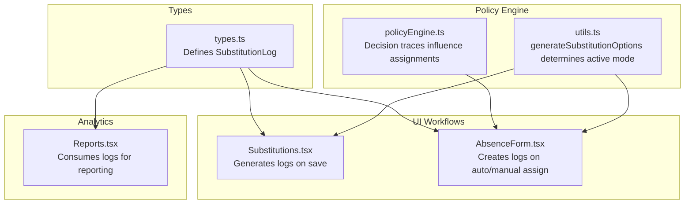
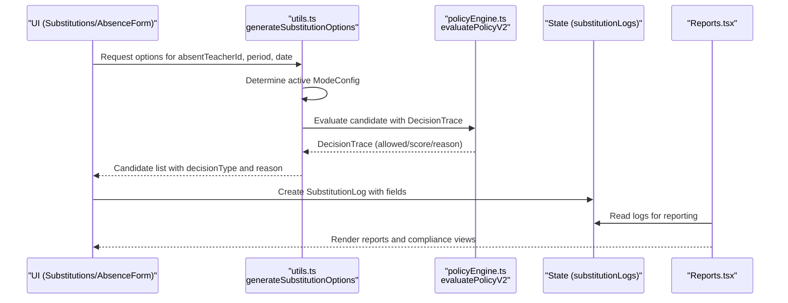
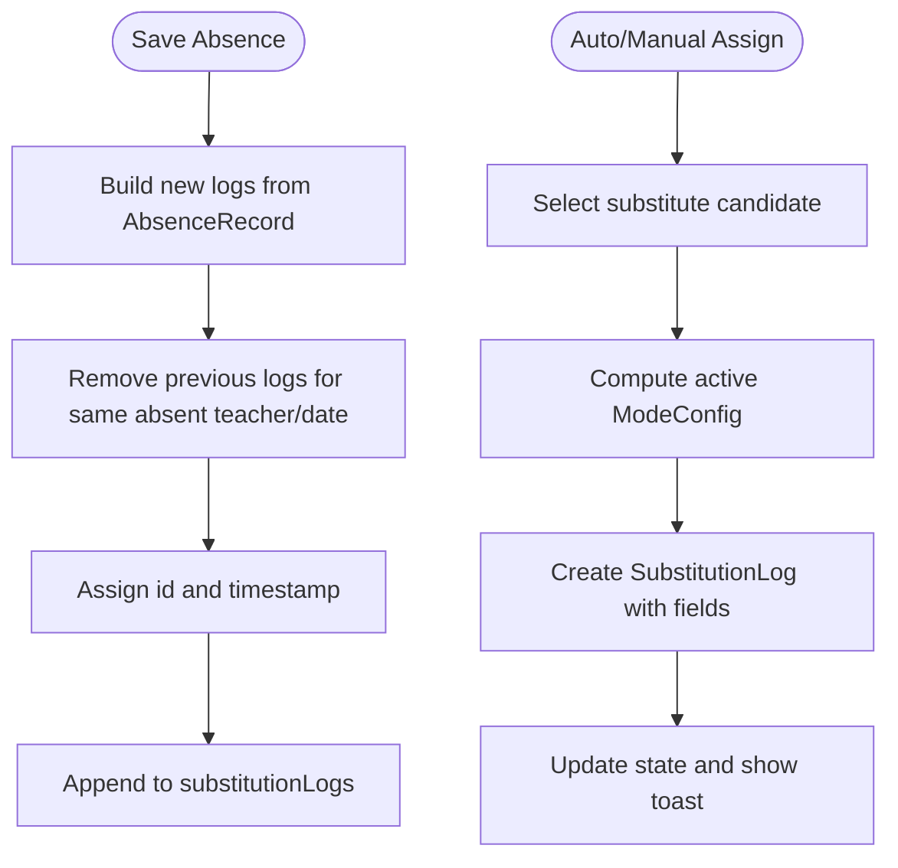
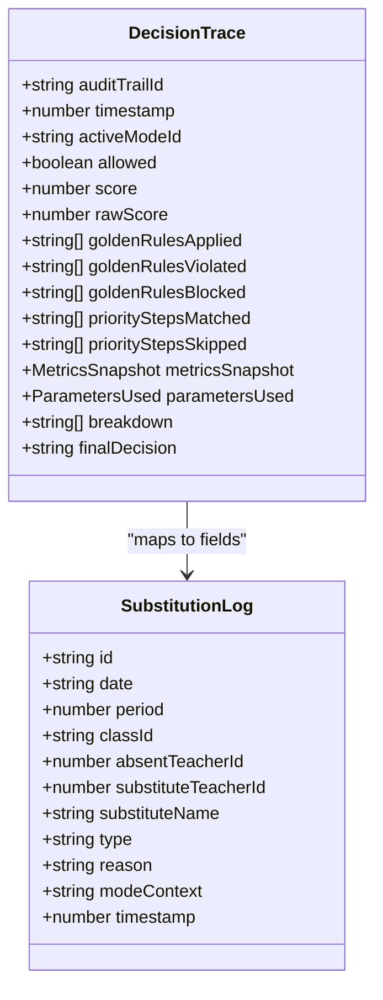
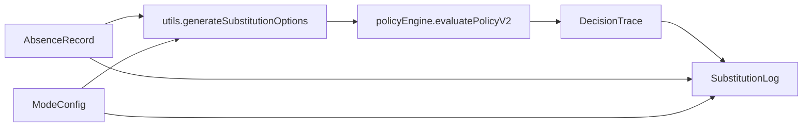

# Substitution Log Data Model

<cite>
**Referenced Files in This Document**
- [types.ts](file://types.ts)
- [Substitutions.tsx](file://components/Substitutions.tsx)
- [AbsenceForm.tsx](file://components/AbsenceForm.tsx)
- [Reports.tsx](file://components/Reports.tsx)
- [policyEngine.ts](file://utils/policyEngine.ts)
- [utils.ts](file://utils.ts)
</cite>

## Table of Contents
1. [Introduction](#introduction)
2. [Project Structure](#project-structure)
3. [Core Components](#core-components)
4. [Architecture Overview](#architecture-overview)
5. [Detailed Component Analysis](#detailed-component-analysis)
6. [Dependency Analysis](#dependency-analysis)
7. [Performance Considerations](#performance-considerations)
8. [Troubleshooting Guide](#troubleshooting-guide)
9. [Conclusion](#conclusion)

## Introduction
This document provides comprehensive data model documentation for SubstitutionLog, focusing on how substitution records are structured, generated, and consumed across the system. It explains each field’s purpose, how logs are produced during substitution workflows, how policy decisions influence log creation, and how logs support traceability, reporting, and policy refinement. It also covers performance considerations for log retention and indexing in memory, and outlines data integrity requirements and synchronization across UI components.

## Project Structure
The SubstitutionLog data model is defined in the shared types module and is used by multiple UI components and utilities:
- Data model definition: types.ts
- UI workflows that generate logs: Substitutions.tsx, AbsenceForm.tsx
- Reporting and analytics that consume logs: Reports.tsx
- Policy engine that influences assignment decisions: policyEngine.ts
- Utilities that compute options and derive active modes: utils.ts

**Diagram sources**
- [types.ts](file://types.ts#L103-L116)
- [Substitutions.tsx](file://components/Substitutions.tsx#L170-L199)
- [AbsenceForm.tsx](file://components/AbsenceForm.tsx#L443-L471)
- [Reports.tsx](file://components/Reports.tsx#L145-L244)
- [policyEngine.ts](file://utils/policyEngine.ts#L255-L406)
- [utils.ts](file://utils.ts#L326-L558)

**Section sources**
- [types.ts](file://types.ts#L103-L116)
- [Substitutions.tsx](file://components/Substitutions.tsx#L170-L199)
- [AbsenceForm.tsx](file://components/AbsenceForm.tsx#L443-L471)
- [Reports.tsx](file://components/Reports.tsx#L145-L244)
- [policyEngine.ts](file://utils/policyEngine.ts#L255-L406)
- [utils.ts](file://utils.ts#L326-L558)

## Core Components
- SubstitutionLog: The canonical record of a substitution decision and assignment outcome.
- AbsenceRecord: The trigger for substitution decisions.
- EngineContext/ModeConfig: Operational modes that influence assignment strategy and log type.
- DecisionTrace: The policy decision record produced by the policy engine, influencing whether a substitution is allowed and how it is categorized.

Key relationships:
- Logs are created from AbsenceRecord entries and the chosen substitute.
- The active ModeConfig determines the log type and modeContext.
- The policy engine produces a DecisionTrace that informs whether a candidate is approved and influences the log reason.

**Section sources**
- [types.ts](file://types.ts#L89-L116)
- [policyEngine.ts](file://utils/policyEngine.ts#L255-L406)
- [utils.ts](file://utils.ts#L326-L558)

## Architecture Overview
The substitution lifecycle:
1. An absence is recorded (AbsenceRecord).
2. The system computes substitution options using generateSubstitutionOptions, which selects the active ModeConfig.
3. The policy engine evaluates candidates and produces a DecisionTrace.
4. The UI creates a SubstitutionLog entry with fields derived from the decision and context.
5. Reports and dashboards consume SubstitutionLog for analytics and compliance.

**Diagram sources**
- [utils.ts](file://utils.ts#L326-L558)
- [policyEngine.ts](file://utils/policyEngine.ts#L255-L406)
- [AbsenceForm.tsx](file://components/AbsenceForm.tsx#L443-L471)
- [Substitutions.tsx](file://components/Substitutions.tsx#L170-L199)
- [Reports.tsx](file://components/Reports.tsx#L145-L244)

## Detailed Component Analysis

### SubstitutionLog Field Reference
Each SubstitutionLog entry captures a single substitution decision and assignment outcome. The fields are defined as follows:

- id: Unique log entry identifier. Generated when saving absence entries or assigning substitutes.
- date: Assignment date in YYYY-MM-DD string format.
- period: Class period index (1..N).
- classId: Target class identifier linked to the lesson.
- absentTeacherId: Original teacher who is absent.
- substituteTeacherId: Assigned substitute teacher identifier.
- substituteName: Display name of the substitute teacher.
- type: Assignment strategy type indicating how the substitution was handled.
- reason: Contextual explanation for the assignment decision.
- modeContext: Current operational mode from ModeConfig used for the assignment.
- timestamp: Creation time as a Unix epoch number.

Field categories and typical values:
- Identity and context: id, date, period, classId, absentTeacherId, substituteTeacherId, substituteName
- Strategy and classification: type (e.g., assign_internal, assign_external, merge, dismissal, assign_distribution)
- Operational context: reason, modeContext
- Audit and provenance: timestamp

How fields are populated:
- id: Generated at save-time in UI workflows.
- date, period, classId: Derived from the target lesson.
- absentTeacherId: From the AbsenceRecord.
- substituteTeacherId, substituteName: From the selected candidate.
- type: Determined by the active ModeConfig and decision outcome.
- reason: From the policy decision trace or manual assignment reason.
- modeContext: From the active ModeConfig name.
- timestamp: Captured at creation time.

**Section sources**
- [types.ts](file://types.ts#L103-L116)
- [Substitutions.tsx](file://components/Substitutions.tsx#L170-L199)
- [AbsenceForm.tsx](file://components/AbsenceForm.tsx#L443-L471)
- [utils.ts](file://utils.ts#L326-L558)
- [policyEngine.ts](file://utils/policyEngine.ts#L255-L406)

### How Logs Are Generated During Substitution Workflows
- On absence save:
  - The UI composes a list of new SubstitutionLog entries and assigns ids and timestamps before appending to the logs array.
  - The save handler replaces any prior logs for the same absent teacher on the same date to avoid duplication.

- On auto/manual assignment:
  - The UI constructs a SubstitutionLog entry with fields mapped from the selected candidate and active mode.
  - Manual assignments set modeContext to “Manual” or “Manual Bulk”.

- During option generation:
  - The system determines the active ModeConfig and uses the policy engine to evaluate candidates.
  - The resulting DecisionTrace influences whether a candidate is approved and how the log reason is recorded.

**Diagram sources**
- [Substitutions.tsx](file://components/Substitutions.tsx#L170-L199)
- [AbsenceForm.tsx](file://components/AbsenceForm.tsx#L443-L471)
- [utils.ts](file://utils.ts#L326-L558)

**Section sources**
- [Substitutions.tsx](file://components/Substitutions.tsx#L170-L199)
- [AbsenceForm.tsx](file://components/AbsenceForm.tsx#L443-L471)
- [utils.ts](file://utils.ts#L326-L558)

### How Policy Decisions Influence Log Types and Reasons
- The policy engine builds a DecisionTrace that includes:
  - allowed flag
  - score
  - breakdown reasons
  - finalDecision
- The UI maps these outcomes to SubstitutionLog.type and reason fields.
- The active ModeConfig determines the modeContext stored in the log.

**Diagram sources**
- [policyEngine.ts](file://utils/policyEngine.ts#L255-L406)
- [types.ts](file://types.ts#L103-L116)

**Section sources**
- [policyEngine.ts](file://utils/policyEngine.ts#L255-L406)
- [utils.ts](file://utils.ts#L326-L558)

### Simulation Examples from Reports.tsx
- Reports.tsx consumes SubstitutionLog to:
  - Aggregate coverage metrics
  - Compute payroll summaries for external substitutes
  - Generate compliance audits based on absence reasons
  - Produce detailed daily reports grouped by absence and aggregated by substitute

These usages demonstrate how logs enable traceability and reporting across operational and financial perspectives.

**Section sources**
- [Reports.tsx](file://components/Reports.tsx#L145-L244)

### Audit Trail Usage in Settings.tsx
- Settings.tsx manages operational modes (ModeConfig) that influence substitution decisions and log types.
- While Settings.tsx does not directly write SubstitutionLog, it controls the active modes that drive the policy engine and, consequently, the log modeContext and type.

**Section sources**
- [Settings.tsx](file://components/Settings.tsx#L800-L923)
- [policyEngine.ts](file://utils/policyEngine.ts#L255-L406)

## Dependency Analysis
- SubstitutionLog depends on:
  - AbsenceRecord for the absence trigger
  - ModeConfig for the operational context
  - DecisionTrace for the policy decision outcome
- UI components depend on:
  - utils.generateSubstitutionOptions to compute candidates and active mode
  - policyEngine.evaluatePolicyV2 to produce DecisionTrace
  - SubstitutionLog for rendering and reporting

**Diagram sources**
- [utils.ts](file://utils.ts#L326-L558)
- [policyEngine.ts](file://utils/policyEngine.ts#L255-L406)
- [types.ts](file://types.ts#L89-L116)

**Section sources**
- [utils.ts](file://utils.ts#L326-L558)
- [policyEngine.ts](file://utils/policyEngine.ts#L255-L406)
- [types.ts](file://types.ts#L89-L116)

## Performance Considerations
- Memory indexing:
  - Use date and absentTeacherId as primary keys for quick filtering in UI components.
  - Maintain a daily subset of logs (e.g., last 30–90 days) to keep memory usage bounded.
- Sorting and aggregation:
  - Precompute daily totals and substitute counts to avoid repeated scans over large arrays.
- Log retention:
  - Implement a sliding window retention policy (e.g., keep logs for the past 90 days) to limit growth.
- Rendering performance:
  - Virtualize large tables and lists that display logs.
  - Debounce heavy computations when applying filters or date ranges.

[No sources needed since this section provides general guidance]

## Troubleshooting Guide
Common issues and resolutions:
- Duplicate logs on save:
  - Ensure deduplication by absent teacher and date before appending new logs.
- Incorrect modeContext:
  - Verify the active ModeConfig selection logic and that the mode name is propagated to the log.
- Missing external substitute payroll entries:
  - Confirm that type is assign_external and that substituteName is populated.
- Inconsistent reasons:
  - Validate that the DecisionTrace breakdown is captured and mapped to the log reason.

**Section sources**
- [Substitutions.tsx](file://components/Substitutions.tsx#L170-L199)
- [AbsenceForm.tsx](file://components/AbsenceForm.tsx#L443-L471)
- [Reports.tsx](file://components/Reports.tsx#L145-L244)

## Conclusion
SubstitutionLog is the central audit trail for substitution decisions. Its fields capture identity, strategy, operational context, and provenance. The policy engine and active modes shape how logs are categorized and reported. By following the outlined data integrity and performance practices, teams can maintain reliable, traceable, and efficient substitution workflows that support reporting, compliance, and continuous policy refinement.