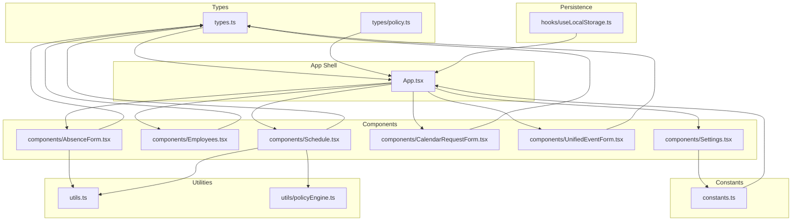
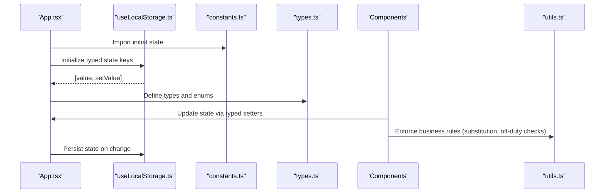
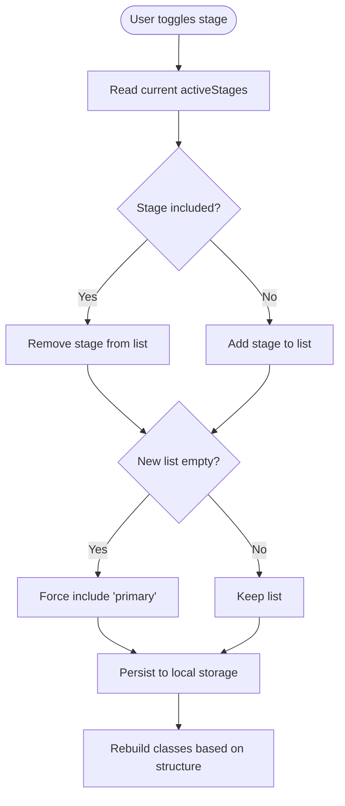
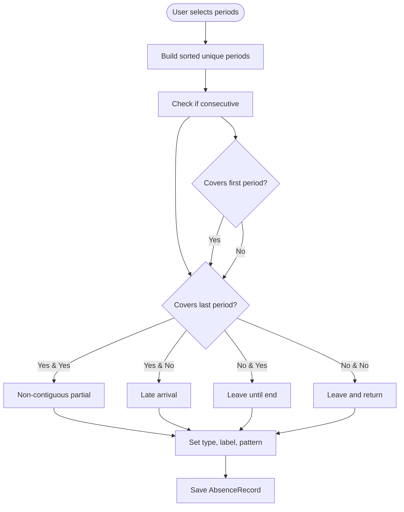
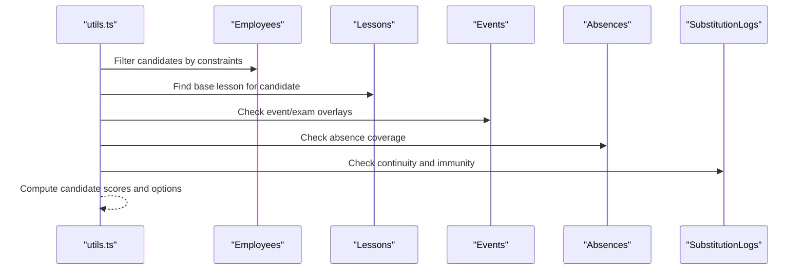
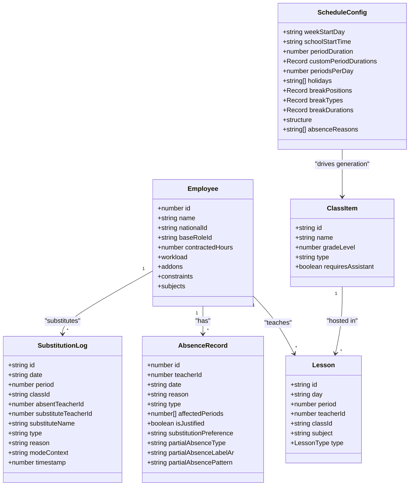
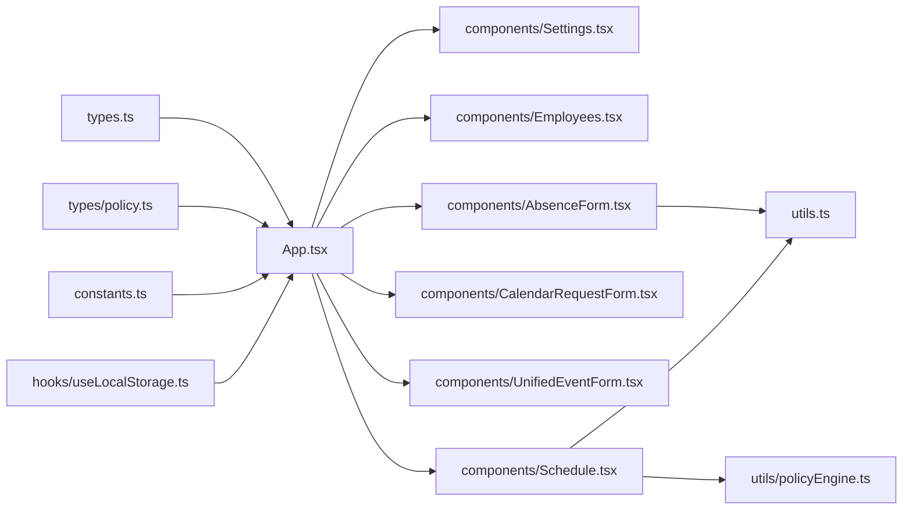

# Data Models & Types

<cite>
**Referenced Files in This Document**
- [types.ts](file://types.ts)
- [constants.ts](file://constants.ts)
- [hooks/useLocalStorage.ts](file://hooks/useLocalStorage.ts)
- [types/policy.ts](file://types/policy.ts)
- [App.tsx](file://App.tsx)
- [components/Settings.tsx](file://components/Settings.tsx)
- [components/AbsenceForm.tsx](file://components/AbsenceForm.tsx)
- [components/CalendarRequestForm.tsx](file://components/CalendarRequestForm.tsx)
- [components/Employees.tsx](file://components/Employees.tsx)
- [components/UnifiedEventForm.tsx](file://components/UnifiedEventForm.tsx)
- [components/Schedule.tsx](file://components/Schedule.tsx)
- [utils.ts](file://utils.ts)
- [utils/policyEngine.ts](file://utils/policyEngine.ts)
</cite>

## Table of Contents
1. [Introduction](#introduction)
2. [Project Structure](#project-structure)
3. [Core Components](#core-components)
4. [Architecture Overview](#architecture-overview)
5. [Detailed Component Analysis](#detailed-component-analysis)
6. [Dependency Analysis](#dependency-analysis)
7. [Performance Considerations](#performance-considerations)
8. [Troubleshooting Guide](#troubleshooting-guide)
9. [Conclusion](#conclusion)
10. [Appendices](#appendices)

## Introduction
This document provides comprehensive data model documentation for the application’s core entities and their relationships. It focuses on the primary TypeScript interfaces used across the system: ScheduleConfig, Role, AbsenceRecord, Lesson, and ClassItem. It explains how these structures are defined, how they constrain and guide business logic, and how they integrate with user input forms and persistence. It also documents the lifecycle of these entities from creation to persistence via local storage, and highlights validation rules enforced during user input.

## Project Structure
The data model is defined centrally in a shared types file and complemented by constants that initialize default states. Persistence is handled by a reusable hook that stores typed arrays and objects in browser local storage. Components consume these types and constants to render UI, collect user input, and enforce business rules.

**Diagram sources**
- [types.ts](file://types.ts#L1-L382)
- [types/policy.ts](file://types/policy.ts#L1-L162)
- [constants.ts](file://constants.ts#L1-L438)
- [hooks/useLocalStorage.ts](file://hooks/useLocalStorage.ts#L1-L23)
- [App.tsx](file://App.tsx#L1-L200)
- [components/Settings.tsx](file://components/Settings.tsx#L62-L160)
- [components/Employees.tsx](file://components/Employees.tsx#L106-L190)
- [components/AbsenceForm.tsx](file://components/AbsenceForm.tsx#L1-L120)
- [components/CalendarRequestForm.tsx](file://components/CalendarRequestForm.tsx#L639-L671)
- [components/UnifiedEventForm.tsx](file://components/UnifiedEventForm.tsx#L1-L120)
- [components/Schedule.tsx](file://components/Schedule.tsx#L191-L220)
- [utils.ts](file://utils.ts#L326-L412)
- [utils/policyEngine.ts](file://utils/policyEngine.ts#L143-L161)

**Section sources**
- [types.ts](file://types.ts#L1-L382)
- [constants.ts](file://constants.ts#L1-L120)
- [hooks/useLocalStorage.ts](file://hooks/useLocalStorage.ts#L1-L23)
- [App.tsx](file://App.tsx#L36-L54)

## Core Components
This section defines the key interfaces and their fields, types, and constraints. It also explains how these types embed business rules and how they are initialized.

- ScheduleConfig
  - Purpose: Defines school-wide schedule configuration including school info, weekly start day, school start time, period durations, periods per day, holidays, break positions/types/durations, structure (active stages, counts, naming convention), and absence reasons.
  - Notable constraint: structure.activeStages controls which academic stages are active and drives dynamic class generation and UI filtering.
  - Example initialization: See [INITIAL_SCHEDULE_CONFIG](file://constants.ts#L62-L82).

- Role
  - Purpose: Describes job roles with permissions, default hours, and workload distribution across actual, individual, and stay categories.
  - Example initialization: See [INITIAL_ROLES](file://constants.ts#L50-L56).

- AbsenceRecord
  - Purpose: Captures teacher absences with identifiers, date, reason, type (full or partial), affected periods, and optional details for partial absence type, label, and pattern.
  - Validation rules: Partial absence inference logic determines contiguous vs non-contiguous patterns and labels based on selected periods.
  - Example initialization: See [INITIAL_ABSENCES](file://constants.ts#L84-L84).

- Lesson
  - Purpose: Represents scheduled teaching slots with identifiers, day, period, teacherId, classId, subject, and type (actual, stay, individual, duty).
  - Constraints: For non-class lessons (e.g., stay/individual/duty), classId may be empty or omitted depending on type.
  - Example initialization: See [INITIAL_LESSONS](file://constants.ts#L58-L61).

- ClassItem
  - Purpose: Represents classes with identifiers, name, grade level, type (general or special), and whether an assistant is required.
  - Example initialization: See [INITIAL_CLASSES](file://constants.ts#L57-L61).

- Additional types embedded in the models:
  - LessonType: actual | stay | individual | duty
  - SchoolStage: primary | middle | secondary
  - BreakType: none | short | long
  - EnforcementLevel: STRICT | FLEXIBLE | EMERGENCY_ONLY | SOFT
  - Priority criteria and steps for substitution logic are defined in [types/policy.ts](file://types/policy.ts#L1-L162).

**Section sources**
- [types.ts](file://types.ts#L8-L101)
- [types.ts](file://types.ts#L55-L75)
- [types.ts](file://types.ts#L169-L216)
- [types.ts](file://types.ts#L1-L33)
- [types.ts](file://types.ts#L34-L41)
- [types.ts](file://types.ts#L42-L51)
- [types.ts](file://types.ts#L117-L118)
- [types.ts](file://types.ts#L52-L54)
- [types.ts](file://types.ts#L119-L138)
- [types.ts](file://types.ts#L140-L168)
- [types.ts](file://types.ts#L170-L216)
- [types/policy.ts](file://types/policy.ts#L1-L162)
- [constants.ts](file://constants.ts#L50-L84)

## Architecture Overview
The application initializes typed state from constants and persists it to local storage using a generic hook. Components update state via typed setters, and utilities enforce business rules during substitution and scheduling decisions.

**Diagram sources**
- [App.tsx](file://App.tsx#L36-L54)
- [hooks/useLocalStorage.ts](file://hooks/useLocalStorage.ts#L1-L23)
- [constants.ts](file://constants.ts#L23-L84)
- [types.ts](file://types.ts#L1-L382)
- [utils.ts](file://utils.ts#L326-L412)

## Detailed Component Analysis

### ScheduleConfig: Structure and Active Stages
- Structure.activeStages controls which academic stages are active. The UI toggles this list and rebuilds classes accordingly.
- Business rule embedding:
  - activeStages must be non-empty; the UI enforces a fallback to at least primary if the user attempts to deselect all.
  - The structure enables grade-level counts per stage and naming convention for class generation.
- Lifecycle:
  - Initialization: [INITIAL_SCHEDULE_CONFIG](file://constants.ts#L62-L82)
  - UI updates: [toggleStage](file://components/Settings.tsx#L143-L147) and [rebuild structure](file://components/Settings.tsx#L149-L160)
  - Persistence: [App.tsx](file://App.tsx#L36-L40)

**Diagram sources**
- [components/Settings.tsx](file://components/Settings.tsx#L143-L147)
- [components/Settings.tsx](file://components/Settings.tsx#L149-L160)
- [constants.ts](file://constants.ts#L62-L82)
- [App.tsx](file://App.tsx#L36-L40)

**Section sources**
- [components/Settings.tsx](file://components/Settings.tsx#L143-L147)
- [components/Settings.tsx](file://components/Settings.tsx#L149-L160)
- [constants.ts](file://constants.ts#L62-L82)
- [App.tsx](file://App.tsx#L36-L40)

### Role: Permissions and Workload Distribution
- Role defines permissions and workload distribution across actual, individual, and stay categories.
- Initialization: [INITIAL_ROLES](file://constants.ts#L50-L56)
- Usage: Employees select a role that sets default hours and workload split.

**Section sources**
- [types.ts](file://types.ts#L77-L87)
- [constants.ts](file://constants.ts#L50-L56)

### AbsenceRecord: Full vs Partial Absences and Validation
- AbsenceRecord captures teacher absences with type FULL or PARTIAL and affected periods.
- Validation and inference:
  - Partial absence type and pattern are inferred based on selected periods (contiguous vs non-contiguous) and whether they cover start/end of the day.
  - The inference logic populates partialAbsenceType, partialAbsenceLabelAr, and partialAbsencePattern.
- UI and lifecycle:
  - AbsenceForm manages multi-day ranges and builds substitution logs.
  - Persistence: [INITIAL_ABSENCES](file://constants.ts#L84-L84) and [App.tsx](file://App.tsx#L40-L44)

**Diagram sources**
- [components/AbsenceForm.tsx](file://components/AbsenceForm.tsx#L49-L80)
- [constants.ts](file://constants.ts#L84-L84)
- [App.tsx](file://App.tsx#L40-L44)

**Section sources**
- [types.ts](file://types.ts#L89-L101)
- [components/AbsenceForm.tsx](file://components/AbsenceForm.tsx#L49-L80)
- [constants.ts](file://constants.ts#L84-L84)
- [App.tsx](file://App.tsx#L40-L44)

### Lesson: Employee-to-Class Coverage
- Lesson links employees to classes for specific days and periods.
- Special lesson types:
  - stay, individual, duty may not have a classId and are handled accordingly in import logic.
- Off-duty and availability checks:
  - Utilities enforce that internal staff must be present for the period; external staff are treated differently.
- Lifecycle:
  - Initialization: [INITIAL_LESSONS](file://constants.ts#L58-L61)
  - Persistence: [App.tsx](file://App.tsx#L36-L40)
  - Usage in substitution and schedule views: [generateSubstitutionOptions](file://utils.ts#L326-L366), [Schedule.tsx](file://components/Schedule.tsx#L191-L220)

**Diagram sources**
- [utils.ts](file://utils.ts#L326-L412)
- [utils/policyEngine.ts](file://utils/policyEngine.ts#L143-L161)
- [components/Schedule.tsx](file://components/Schedule.tsx#L191-L220)

**Section sources**
- [types.ts](file://types.ts#L42-L51)
- [components/ExcelWizard.tsx](file://components/ExcelWizard.tsx#L154-L174)
- [utils.ts](file://utils.ts#L326-L412)
- [utils/policyEngine.ts](file://utils/policyEngine.ts#L143-L161)
- [components/Schedule.tsx](file://components/Schedule.tsx#L191-L220)
- [constants.ts](file://constants.ts#L58-L61)
- [App.tsx](file://App.tsx#L36-L40)

### ClassItem: Class Generation and Naming
- ClassItem defines class identity, grade level, and attributes used to build class lists.
- Dynamic generation:
  - The UI rebuilds classes based on active stages, counts, and naming convention.
- Persistence: [INITIAL_CLASSES](file://constants.ts#L57-L61), [App.tsx](file://App.tsx#L36-L40)

**Section sources**
- [types.ts](file://types.ts#L34-L41)
- [components/Settings.tsx](file://components/Settings.tsx#L149-L160)
- [constants.ts](file://constants.ts#L57-L61)
- [App.tsx](file://App.tsx#L36-L40)

### Entity Relationships and Business Rules
- Employee constraints influence coverage eligibility:
  - cannotCoverAlone and isExternal constraints restrict substitution eligibility.
  - Off-duty checks ensure internal staff are present for the period.
- Absences affect schedule coverage:
  - AbsenceRecord affects which lessons are considered absent and triggers substitution logic.
  - SubstitutionLog records the chosen substitute and mode context.
- Events and modes:
  - CalendarEvent and ModeConfig drive contextual rules for substitutions (e.g., exams, trips, rainy days).
- Priority ladder and golden rules:
  - Policy types define priority steps and rule conditions that influence candidate selection.

**Diagram sources**
- [types.ts](file://types.ts#L10-L101)
- [types.ts](file://types.ts#L42-L51)
- [types.ts](file://types.ts#L34-L41)
- [types.ts](file://types.ts#L89-L115)
- [types.ts](file://types.ts#L55-L75)

**Section sources**
- [types.ts](file://types.ts#L10-L101)
- [types.ts](file://types.ts#L42-L51)
- [types.ts](file://types.ts#L34-L41)
- [types.ts](file://types.ts#L89-L115)
- [types.ts](file://types.ts#L55-L75)

## Dependency Analysis
- Centralized types and enums in [types.ts](file://types.ts#L1-L382) and [types/policy.ts](file://types/policy.ts#L1-L162) are consumed by components and utilities.
- Constants in [constants.ts](file://constants.ts#L23-L84) seed initial state for all entities.
- Persistence via [hooks/useLocalStorage.ts](file://hooks/useLocalStorage.ts#L1-L23) ensures typed state remains consistent across sessions.
- Components depend on these shared definitions for rendering and validation.

**Diagram sources**
- [types.ts](file://types.ts#L1-L382)
- [types/policy.ts](file://types/policy.ts#L1-L162)
- [constants.ts](file://constants.ts#L23-L84)
- [hooks/useLocalStorage.ts](file://hooks/useLocalStorage.ts#L1-L23)
- [App.tsx](file://App.tsx#L36-L54)
- [components/Settings.tsx](file://components/Settings.tsx#L62-L160)
- [components/Employees.tsx](file://components/Employees.tsx#L106-L190)
- [components/AbsenceForm.tsx](file://components/AbsenceForm.tsx#L1-L120)
- [components/CalendarRequestForm.tsx](file://components/CalendarRequestForm.tsx#L639-L671)
- [components/UnifiedEventForm.tsx](file://components/UnifiedEventForm.tsx#L1-L120)
- [components/Schedule.tsx](file://components/Schedule.tsx#L191-L220)
- [utils.ts](file://utils.ts#L326-L412)
- [utils/policyEngine.ts](file://utils/policyEngine.ts#L143-L161)

**Section sources**
- [types.ts](file://types.ts#L1-L382)
- [types/policy.ts](file://types/policy.ts#L1-L162)
- [constants.ts](file://constants.ts#L23-L84)
- [hooks/useLocalStorage.ts](file://hooks/useLocalStorage.ts#L1-L23)
- [App.tsx](file://App.tsx#L36-L54)

## Performance Considerations
- Local storage reads/writes occur on every state change; keep payloads minimal and avoid frequent deep mutations.
- Prefer memoization for derived computations (e.g., candidate lists) to reduce re-renders.
- Batch updates when rebuilding classes or updating schedule configuration to minimize redundant writes.

## Troubleshooting Guide
- Active stages validation:
  - If all stages are deselected, the UI forces inclusion of primary stage. Ensure this fallback is respected when toggling stages.
  - Reference: [toggleStage](file://components/Settings.tsx#L143-L147)
- Employee validation:
  - Name uniqueness and national ID uniqueness are enforced; educator flag requires a class assignment.
  - Reference: [Employees.tsx validation](file://components/Employees.tsx#L146-L173)
- Absence partial type inference:
  - If periods appear contiguous, the system infers late/leave patterns; otherwise non-contiguous partial absence.
  - Reference: [AbsenceForm inference](file://components/AbsenceForm.tsx#L49-L80)
- Off-duty and availability:
  - Internal staff must have lessons in the period; external staff are treated differently.
  - Reference: [utils off-duty checks](file://utils.ts#L392-L412)
- Substitution continuity and immunity:
  - Recent substitution history influences candidate selection.
  - Reference: [policyEngine continuity/immunity](file://utils/policyEngine.ts#L143-L161)

**Section sources**
- [components/Settings.tsx](file://components/Settings.tsx#L143-L147)
- [components/Employees.tsx](file://components/Employees.tsx#L146-L173)
- [components/AbsenceForm.tsx](file://components/AbsenceForm.tsx#L49-L80)
- [utils.ts](file://utils.ts#L392-L412)
- [utils/policyEngine.ts](file://utils/policyEngine.ts#L143-L161)

## Conclusion
The application’s data model centers on strongly typed interfaces that encode business rules and constraints. ScheduleConfig’s activeStages govern class generation and UI filtering. AbsenceRecord and Lesson types collaborate to manage coverage and substitution. Role and ClassItem define staffing and class structures. Persistence via useLocalStorage ensures typed state remains consistent across sessions. Components enforce validation and business logic, while utilities centralize substitution and policy evaluation.

## Appendices

### Sample Data Instances
- Employee
  - Fields: id, name, nationalId, baseRoleId, phoneNumber?, contractedHours, workload, addons, constraints, subjects
  - Example path: [INITIAL_EMPLOYEES](file://constants.ts#L57-L61)
- ClassItem
  - Fields: id, name, gradeLevel, type, requiresAssistant
  - Example path: [INITIAL_CLASSES](file://constants.ts#L57-L61)
- Lesson
  - Fields: id, day, period, teacherId, classId, subject, type
  - Example path: [INITIAL_LESSONS](file://constants.ts#L58-L61)
- ScheduleConfig
  - Fields: schoolInfo?, weekStartDay, schoolStartTime, periodDuration, customPeriodDurations?, periodsPerDay, holidays, breakPositions, breakTypes?, breakDurations?, structure, absenceReasons
  - Example path: [INITIAL_SCHEDULE_CONFIG](file://constants.ts#L62-L82)
- Role
  - Fields: id, label, defaultHours, permissions, workloadDetails
  - Example path: [INITIAL_ROLES](file://constants.ts#L50-L56)
- AbsenceRecord
  - Fields: id, teacherId, date, reason, type, affectedPeriods, isJustified?, substitutionPreference?, partialAbsenceType?, partialAbsenceLabelAr?, partialAbsencePattern?
  - Example path: [INITIAL_ABSENCES](file://constants.ts#L84-L84)

### Data Integrity Across Components
- TypeScript interfaces ensure compile-time safety for all state updates and component props.
- useLocalStorage enforces typed persistence, preventing mismatched data shapes.
- Components validate user input before committing changes to state.

**Section sources**
- [types.ts](file://types.ts#L1-L382)
- [hooks/useLocalStorage.ts](file://hooks/useLocalStorage.ts#L1-L23)
- [App.tsx](file://App.tsx#L36-L54)
- [constants.ts](file://constants.ts#L50-L84)