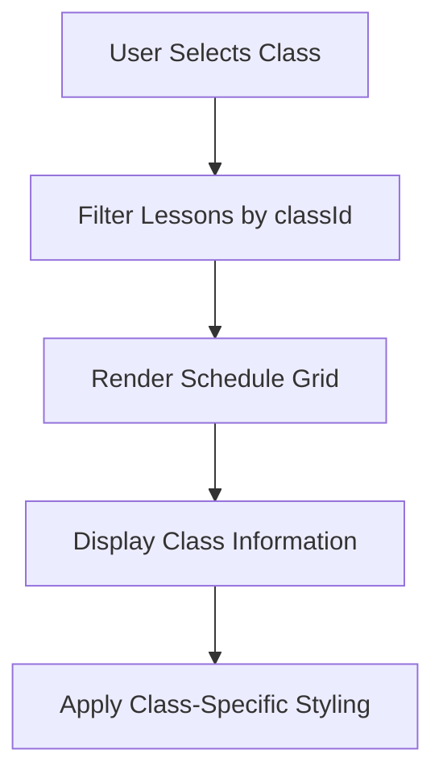
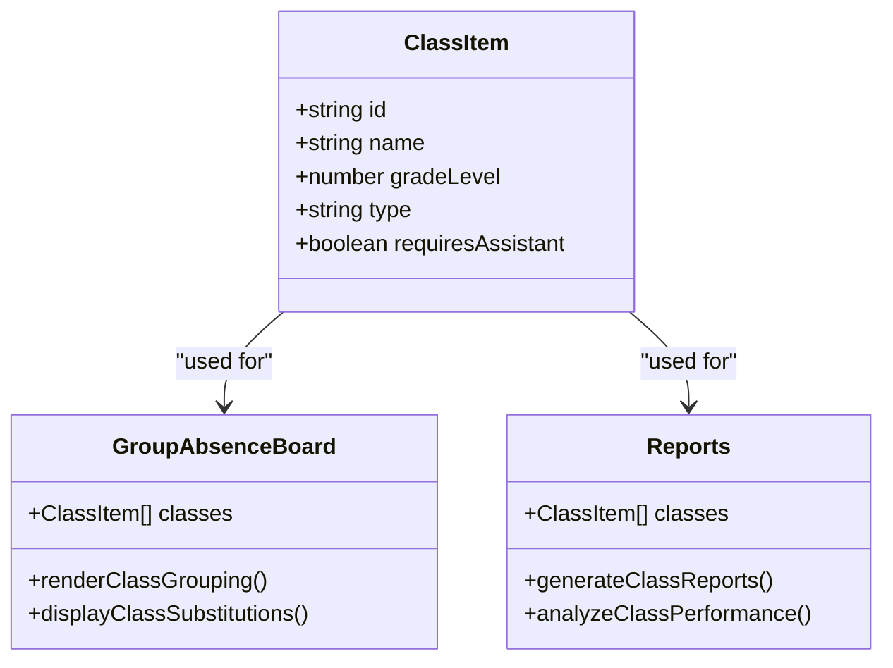

# Class Model

<cite>
**Referenced Files in This Document**   
- [types.ts](file://types.ts#L34-L40)
- [constants.ts](file://constants.ts#L5-L9)
- [Schedule.tsx](file://components/Schedule.tsx#L485-L489)
- [GroupAbsenceBoard.tsx](file://components/GroupAbsenceBoard.tsx#L70-L71)
- [Reports.tsx](file://components/Reports.tsx#L28)
- [Settings.tsx](file://components/Settings.tsx#L180-L185)
</cite>

## Table of Contents
1. [Introduction](#introduction)
2. [ClassItem Model Definition](#classitem-model-definition)
3. [Field Specifications](#field-specifications)
4. [Grade Level Integration](#grade-level-integration)
5. [Class Type Significance](#class-type-significance)
6. [Assistant Requirement Logic](#assistant-requirement-logic)
7. [Usage in Lesson Objects](#usage-in-lesson-objects)
8. [Schedule Rendering](#schedule-rendering)
9. [Class Grouping in Operational Components](#class-grouping-in-operational-components)

## Introduction
The ClassItem model serves as the foundational structure for representing academic classes within the school management system. This document provides a comprehensive analysis of the ClassItem model, detailing its fields, relationships, and operational significance across various components of the application. The model plays a critical role in scheduling, substitution management, and reporting functionalities.

## ClassItem Model Definition

The ClassItem interface defines the structure for academic classes within the school system. It contains essential properties that determine how classes are displayed, processed, and managed throughout the application. The model is used consistently across multiple components for scheduling, reporting, and operational oversight.

**Section sources**
- [types.ts](file://types.ts#L34-L40)

## Field Specifications

The ClassItem model consists of five key fields that define the characteristics of each academic class:

- **id**: A unique string identifier for the class, used as a primary key for database operations and component references.
- **name**: The display name of the class, following a standardized naming convention that combines grade level and section identifier.
- **gradeLevel**: A numeric value (1-12) representing the academic grade of the class, which determines its position in the school's organizational hierarchy.
- **type**: An enumeration with values 'general' or 'special', indicating whether the class follows the standard curriculum or has specialized educational requirements.
- **requiresAssistant**: A boolean flag that determines staffing requirements and triggers special handling in the substitution engine.

These fields work together to provide a complete representation of each class, enabling the system to make intelligent decisions about resource allocation, scheduling, and substitution rules.

**Section sources**
- [types.ts](file://types.ts#L34-L40)

## Grade Level Integration

The gradeLevel field (1-12) is a critical component that integrates with the GRADES_AR array from constants.ts to provide localized UI display and enable grade-based scheduling logic. The GRADES_AR array contains Arabic names for each grade level:

```typescript
export const GRADES_AR = [
  "طبقة أول", "طبقة ثاني", "طبقة ثالث", "طبقة رابع", "طبقة خامس", "طبقة سادس", // Primary
  "طبقة سابع", "طبقة ثامن", "طبقة تاسع", // Middle
  "طبقة عاشر", "طبقة حادي عشر", "طبقة ثاني عشر" // High
];
```

This integration allows the system to automatically display the appropriate Arabic name for each grade level in the user interface. The gradeLevel also serves as a key factor in scheduling algorithms, determining which teachers are eligible for substitution based on their assigned grade levels and subject specializations. Additionally, gradeLevel is used in filtering and grouping operations across various reports and dashboards.

**Section sources**
- [constants.ts](file://constants.ts#L5-L9)
- [types.ts](file://types.ts#L34-L40)

## Class Type Significance

The type field in the ClassItem model, with values 'general' or 'special', plays a crucial role in determining resource allocation and substitution rules within the system. This field differentiates between standard academic classes and those with specialized educational requirements.

In resource allocation, special classes receive priority for specialized teachers and additional support staff. The substitution engine uses this field to apply different rules when a teacher is absent from a special class, often requiring a substitute with specific qualifications or experience in special education.

The type field also influences scheduling logic, as special classes may have different period lengths, break schedules, or classroom requirements. When generating timetables, the system takes into account the type of class to ensure appropriate time allocations and resource assignments.

**Section sources**
- [types.ts](file://types.ts#L34-L40)

## Assistant Requirement Logic

The requiresAssistant flag is a boolean property that significantly impacts staffing requirements and triggers special handling in the substitution engine. This flag is automatically set based on the class's gradeLevel, with classes in lower grades (typically grades 1-3) requiring an assistant.

When requiresAssistant is true, the system ensures that:
1. The class is staffed with both a primary teacher and an assistant
2. Substitution rules prioritize finding both a primary substitute and an assistant when the primary teacher is absent
3. The substitution engine triggers special handling procedures to maintain adequate supervision

This flag is particularly important in maintaining educational quality and student safety in younger grades, where additional supervision is required. The system uses this flag to generate alerts and recommendations when staffing levels fall below the required threshold.

**Section sources**
- [types.ts](file://types.ts#L34-L40)
- [Settings.tsx](file://components/Settings.tsx#L184)

## Usage in Lesson Objects

Classes are referenced in Lesson objects through the classId field, establishing a critical relationship between scheduled lessons and their corresponding classes. The Lesson interface includes a classId property that serves as a foreign key to link each lesson to its associated class:

```typescript
export interface Lesson {
  id: string;
  day: string;
  period: number;
  teacherId: number;
  classId: string;
  subject: string;
  type: LessonType | string;
}
```

This relationship enables the system to:
- Display class-specific information in lesson cards
- Filter lessons by class in scheduling views
- Generate class-specific reports and analytics
- Implement class-based substitution rules

The classId reference ensures data integrity and allows for efficient querying of lessons by class, which is essential for timetable generation and operational reporting.

**Section sources**
- [types.ts](file://types.ts#L42-L50)
- [Schedule.tsx](file://components/Schedule.tsx#L485-L489)

## Schedule Rendering

The ClassItem model is integral to the Schedule.tsx component, where it is used for timetable rendering and interactive scheduling. The Schedule component uses the classes array as a prop to populate the class selection dropdown and render class-specific schedules.

When a user selects a class from the dropdown, the component filters lessons based on the selected classId and displays them in a grid format organized by day and period. The class name is prominently displayed in the schedule header, and lesson cards show relevant class information.

The schedule rendering logic also takes into account class-specific properties such as gradeLevel and type to apply appropriate styling and display special indicators for special classes or classes requiring assistants.



**Diagram sources **
- [Schedule.tsx](file://components/Schedule.tsx#L37)
- [types.ts](file://types.ts#L34-L40)

**Section sources**
- [Schedule.tsx](file://components/Schedule.tsx#L37)
- [types.ts](file://types.ts#L34-L40)

## Class Grouping in Operational Components

The ClassItem model is leveraged for class grouping in operational components such as GroupAbsenceBoard.tsx and Reports.tsx, enabling comprehensive oversight and management of class-related activities.

In GroupAbsenceBoard.tsx, classes are used to group absence records and substitution assignments. The component uses the classes array to:
- Display class names in lesson cards
- Filter and group absences by class
- Show class-specific substitution patterns
- Provide visual indicators for special classes

Similarly, in Reports.tsx, classes are used for operational reporting and analytics. The component uses class information to:
- Generate class-specific attendance reports
- Track substitution patterns by class type
- Analyze resource allocation across different grade levels
- Provide insights into class performance and staffing

This class grouping functionality enables administrators to monitor and manage school operations at both the individual class level and across class groups, providing valuable insights for decision-making and resource planning.



**Diagram sources **
- [GroupAbsenceBoard.tsx](file://components/GroupAbsenceBoard.tsx#L20)
- [Reports.tsx](file://components/Reports.tsx#L28)
- [types.ts](file://types.ts#L34-L40)

**Section sources**
- [GroupAbsenceBoard.tsx](file://components/GroupAbsenceBoard.tsx#L20)
- [Reports.tsx](file://components/Reports.tsx#L28)
- [types.ts](file://types.ts#L34-L40)