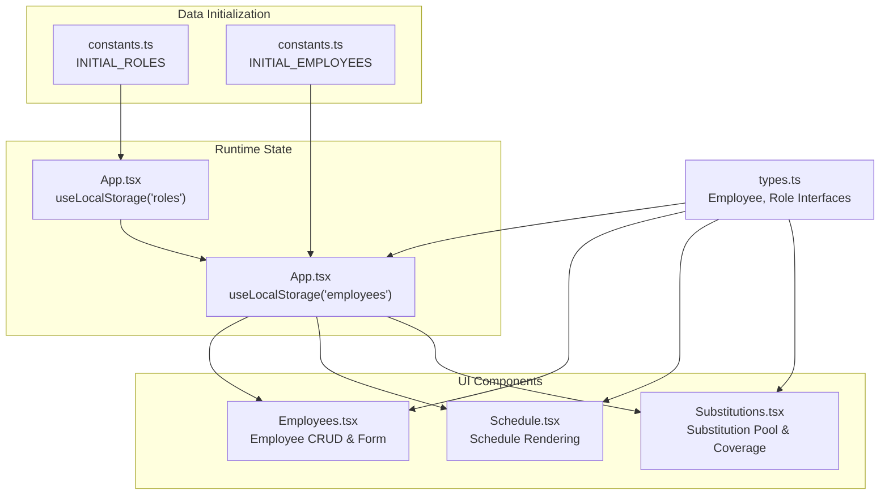
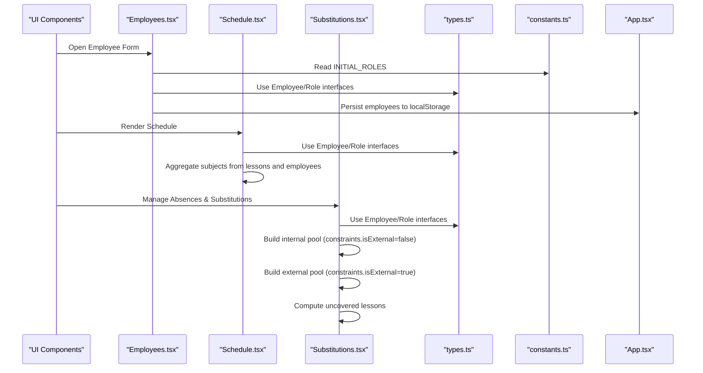
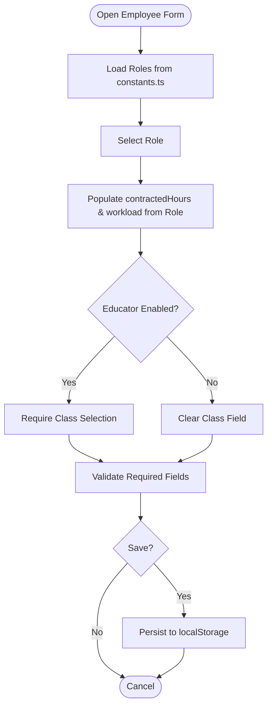
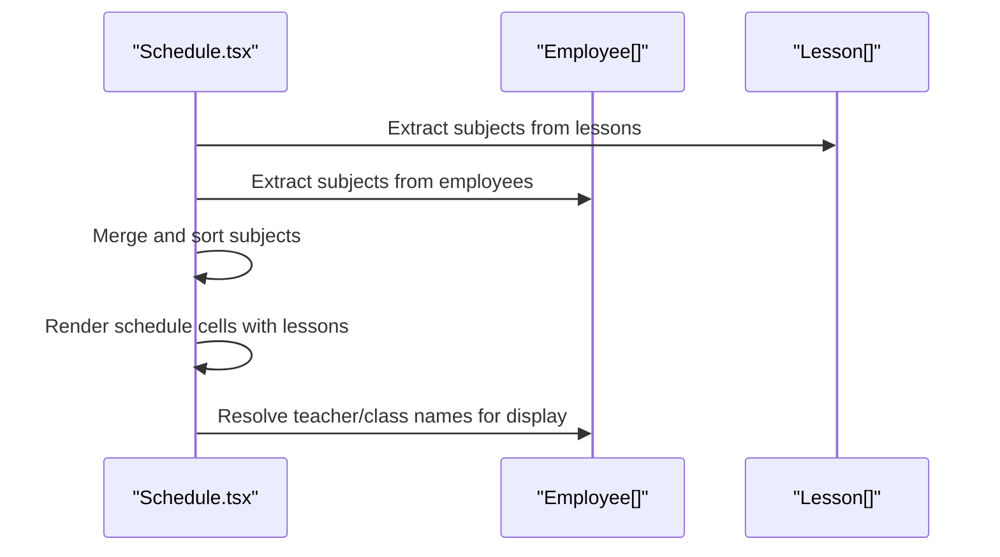
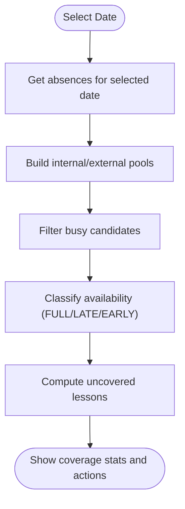
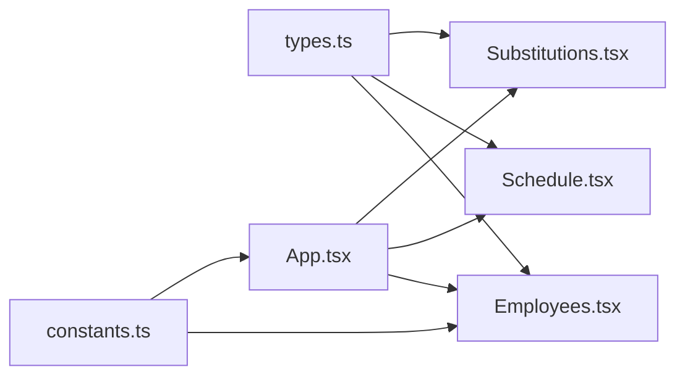

# Employee Model

<cite>
**Referenced Files in This Document**
- [types.ts](file://types.ts)
- [constants.ts](file://constants.ts)
- [App.tsx](file://App.tsx)
- [components/Employees.tsx](file://components/Employees.tsx)
- [components/Schedule.tsx](file://components/Schedule.tsx)
- [components/Substitutions.tsx](file://components/Substitutions.tsx)
</cite>

## Table of Contents
1. [Introduction](#introduction)
2. [Project Structure](#project-structure)
3. [Core Components](#core-components)
4. [Architecture Overview](#architecture-overview)
5. [Detailed Component Analysis](#detailed-component-analysis)
6. [Dependency Analysis](#dependency-analysis)
7. [Performance Considerations](#performance-considerations)
8. [Troubleshooting Guide](#troubleshooting-guide)
9. [Conclusion](#conclusion)

## Introduction
This document provides a comprehensive guide to the Employee model used to represent staff members in the school system. It explains all model fields, how they link to roles and workload distributions, how constraints influence substitution logic, and how subject expertise drives lesson assignment compatibility. It also demonstrates real-world usage through examples from constants and illustrates how the model is consumed in Employees.tsx, Schedule.tsx, and Substitutions.tsx for rendering, filtering, and AI-driven recommendations.

## Project Structure
The Employee model is defined in a shared types file and used across multiple components and initialization constants. The following diagram shows how the model fits into the application’s data flow.

**Diagram sources**
- [constants.ts](file://constants.ts#L49-L58)
- [App.tsx](file://App.tsx#L36-L44)
- [types.ts](file://types.ts#L10-L33)
- [components/Employees.tsx](file://components/Employees.tsx#L1-L60)
- [components/Schedule.tsx](file://components/Schedule.tsx#L1-L40)
- [components/Substitutions.tsx](file://components/Substitutions.tsx#L1-L40)

**Section sources**
- [constants.ts](file://constants.ts#L49-L58)
- [App.tsx](file://App.tsx#L36-L44)
- [types.ts](file://types.ts#L10-L33)

## Core Components
- Employee model fields:
  - Identity: id, name, nationalId, phoneNumber
  - Role linkage: baseRoleId
  - Contract and workload: contractedHours, workload { actual, individual, stay }
  - Addons: educator flag, educatorClassId, coordinators[]
  - Constraints: cannotCoverAlone, isExternal
  - Expertise: subjects[]
- Role model fields:
  - id, label, defaultHours, permissions[], workloadDetails { actual, individual, stay }

How the model is initialized and persisted:
- INITIAL_ROLES defines default role templates with workload allocations.
- INITIAL_EMPLOYEES is an empty array placeholder; runtime employees are loaded from local storage keyed by 'employees'.
- App.tsx initializes employees and roles from constants and persists them to local storage.

**Section sources**
- [types.ts](file://types.ts#L10-L33)
- [types.ts](file://types.ts#L77-L87)
- [constants.ts](file://constants.ts#L49-L58)
- [App.tsx](file://App.tsx#L36-L44)

## Architecture Overview
The Employee model underpins three major UI areas:
- Employees.tsx: CRUD and form for managing employees, including role-based workload defaults and educator/coordinator toggles.
- Schedule.tsx: Renders schedules across class, teacher, and subject views; aggregates subject lists from lessons and employee expertise.
- Substitutions.tsx: Builds internal and external resource pools, filters candidates by availability and constraints, and computes coverage gaps.

**Diagram sources**
- [components/Employees.tsx](file://components/Employees.tsx#L106-L118)
- [components/Schedule.tsx](file://components/Schedule.tsx#L55-L90)
- [components/Substitutions.tsx](file://components/Substitutions.tsx#L77-L120)
- [types.ts](file://types.ts#L10-L33)
- [constants.ts](file://constants.ts#L49-L58)
- [App.tsx](file://App.tsx#L36-L44)

## Detailed Component Analysis

### Employee Model Fields and Semantics
- Identity and contact:
  - id: Unique numeric identifier for the employee.
  - name: Full name used for display and filtering.
  - nationalId: Unique identification number used for deduplication and login.
  - phoneNumber?: Optional contact number.
- Role linkage:
  - baseRoleId: Links to a Role definition; determines default hours and workload distribution.
- Contract and workload:
  - contractedHours: Total contracted hours; used for totals and validation.
  - workload: { actual, individual, stay } representing the distribution of hours across lesson types.
- Addons:
  - educator: Boolean indicating whether the employee supervises a class.
  - educatorClassId?: The class identifier the educator supervises; required when educator is true.
  - coordinators: Array of coordinator focus labels (e.g., subject or team).
- Constraints:
  - cannotCoverAlone: If true, prohibits assigning this employee to cover alone without others.
  - isExternal: Marks the employee as an external substitute; affects internal pool eligibility and UI styling.
- Expertise:
  - subjects: Array of subject names the employee can teach; used to match lesson assignments and AI recommendations.

How baseRoleId links to Role and affects workload:
- When a role is selected in the Employee form, contractedHours and workload are populated from the Role’s defaultHours and workloadDetails.
- The sum of workload.actual + workload.individual + workload.stay should equal contractedHours.

Educator flag and class supervision:
- When educator is true, educatorClassId must be set to a valid class identifier.
- The UI prevents saving without a class when educator is enabled and clears the field when disabled.

Constraints in substitution logic:
- isExternal:
  - Excludes internal candidates from the internal availability pool.
  - Enables external substitutes to be included in the external pool.
- cannotCoverAlone:
  - Used by substitution logic to enforce pairing rules when required by policies.

Subject arrays and lesson assignment compatibility:
- The subject array enables matching employees to lessons by subject.
- Schedule.tsx aggregates subjects from lessons and employees to build a unified subject list for filtering and rendering.

**Section sources**
- [types.ts](file://types.ts#L10-L33)
- [types.ts](file://types.ts#L77-L87)
- [components/Employees.tsx](file://components/Employees.tsx#L52-L62)
- [components/Employees.tsx](file://components/Employees.tsx#L106-L118)
- [components/Employees.tsx](file://components/Employees.tsx#L146-L182)
- [components/Employees.tsx](file://components/Employees.tsx#L312-L407)
- [components/Schedule.tsx](file://components/Schedule.tsx#L55-L90)
- [components/Substitutions.tsx](file://components/Substitutions.tsx#L77-L120)

### How the Model Is Consumed in Employees.tsx
- Form population and validation:
  - On role change, contractedHours and workload are set from the selected Role.
  - Validation ensures required fields are present and unique identifiers are not duplicated.
  - Educator flag requires a class selection; otherwise, saving is blocked.
- Filtering and badges:
  - View filters support internal, external, educators, and coordinators.
  - Badges display role, educator class, and coordinator focus labels.
- Workload totals:
  - The form shows actual, individual, stay totals and compares them to contractedHours.

**Diagram sources**
- [components/Employees.tsx](file://components/Employees.tsx#L106-L118)
- [components/Employees.tsx](file://components/Employees.tsx#L146-L182)
- [components/Employees.tsx](file://components/Employees.tsx#L312-L407)
- [constants.ts](file://constants.ts#L49-L58)

**Section sources**
- [components/Employees.tsx](file://components/Employees.tsx#L1-L60)
- [components/Employees.tsx](file://components/Employees.tsx#L106-L118)
- [components/Employees.tsx](file://components/Employees.tsx#L146-L182)
- [components/Employees.tsx](file://components/Employees.tsx#L254-L262)
- [components/Employees.tsx](file://components/Employees.tsx#L312-L407)

### How the Model Is Consumed in Schedule.tsx
- Subject aggregation:
  - Builds grouped subjects from lessons and employees’ subjects to provide a unified subject list for filtering and rendering.
- Rendering:
  - Displays lessons across class, teacher, and subject views, using employee names and class names for context.
- Availability and coverage:
  - Uses employee constraints and lessons to compute availability and coverage status.

**Diagram sources**
- [components/Schedule.tsx](file://components/Schedule.tsx#L55-L90)
- [components/Schedule.tsx](file://components/Schedule.tsx#L138-L156)
- [components/Schedule.tsx](file://components/Schedule.tsx#L384-L411)

**Section sources**
- [components/Schedule.tsx](file://components/Schedule.tsx#L55-L90)
- [components/Schedule.tsx](file://components/Schedule.tsx#L138-L156)
- [components/Schedule.tsx](file://components/Schedule.tsx#L384-L411)

### How the Model Is Consumed in Substitutions.tsx
- Internal and external pools:
  - Internal pool excludes employees with constraints.isExternal=true.
  - External pool includes employees with constraints.isExternal=true.
- Availability categorization:
  - Computes availability by day lessons and marks candidates as FULL, LATE_START, EARLY_END, or BUSY.
- Coverage computation:
  - Identifies uncovered lessons by comparing absences and substitution logs.
- Constraints enforcement:
  - cannotCoverAlone influences pairing decisions aligned with policy rules.

**Diagram sources**
- [components/Substitutions.tsx](file://components/Substitutions.tsx#L77-L120)
- [components/Substitutions.tsx](file://components/Substitutions.tsx#L130-L161)

**Section sources**
- [components/Substitutions.tsx](file://components/Substitutions.tsx#L77-L120)
- [components/Substitutions.tsx](file://components/Substitutions.tsx#L130-L161)

## Dependency Analysis
- Employee depends on Role for workload defaults and permissions.
- Employees.tsx depends on constants.ts for INITIAL_ROLES and uses types.ts for Employee and Role interfaces.
- Schedule.tsx and Substitutions.tsx depend on types.ts for Employee and Lesson interfaces and on App.tsx state for runtime data.
- App.tsx initializes employees and roles from constants and persists them to local storage.

**Diagram sources**
- [types.ts](file://types.ts#L10-L33)
- [types.ts](file://types.ts#L77-L87)
- [constants.ts](file://constants.ts#L49-L58)
- [App.tsx](file://App.tsx#L36-L44)
- [components/Employees.tsx](file://components/Employees.tsx#L1-L60)
- [components/Schedule.tsx](file://components/Schedule.tsx#L1-L40)
- [components/Substitutions.tsx](file://components/Substitutions.tsx#L1-L40)

**Section sources**
- [types.ts](file://types.ts#L10-L33)
- [types.ts](file://types.ts#L77-L87)
- [constants.ts](file://constants.ts#L49-L58)
- [App.tsx](file://App.tsx#L36-L44)
- [components/Employees.tsx](file://components/Employees.tsx#L1-L60)
- [components/Schedule.tsx](file://components/Schedule.tsx#L1-L40)
- [components/Substitutions.tsx](file://components/Substitutions.tsx#L1-L40)

## Performance Considerations
- Memoization:
  - UseMemo is used in Employees.tsx to compute available educator classes and smart suggestions, reducing re-computation on unrelated state changes.
  - UseMemo is used in Schedule.tsx to compute grouped subjects and visible days, minimizing render cost during filtering.
- Local storage persistence:
  - Employees and roles are persisted to local storage to avoid recomputation across sessions.
- Conditional rendering:
  - External employees are visually separated in Employees.tsx to reduce confusion and improve scanning speed.

[No sources needed since this section provides general guidance]

## Troubleshooting Guide
- Duplicate IDs:
  - Employees.tsx detects duplicate IDs and sanitizes them automatically to prevent UI anomalies.
- Validation errors:
  - Saving an employee requires name, baseRoleId, and nationalId; nationalId must be unique; educator requires a class selection.
- External vs internal:
  - isExternal toggles eligibility for internal availability; ensure constraints are set correctly when building substitution pools.
- Workload totals:
  - The form highlights mismatches between contractedHours and the sum of workload.actual + workload.individual + workload.stay.

**Section sources**
- [components/Employees.tsx](file://components/Employees.tsx#L33-L51)
- [components/Employees.tsx](file://components/Employees.tsx#L146-L182)
- [components/Employees.tsx](file://components/Employees.tsx#L514-L542)

## Conclusion
The Employee model is central to the school scheduling system. It captures identity, role-linked workload, supervision responsibilities, constraints, and subject expertise. Through Employees.tsx, Schedule.tsx, and Substitutions.tsx, the model enables robust rendering, filtering, and substitution logic. Proper use of baseRoleId, constraints, and subjects ensures accurate lesson assignment compatibility and efficient substitution workflows.