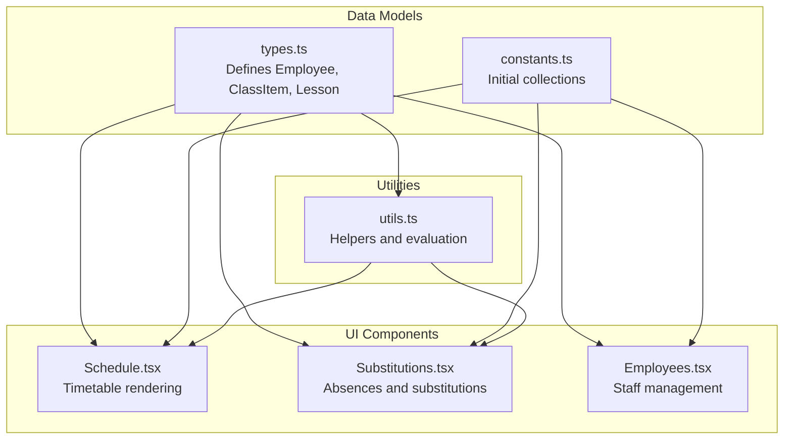
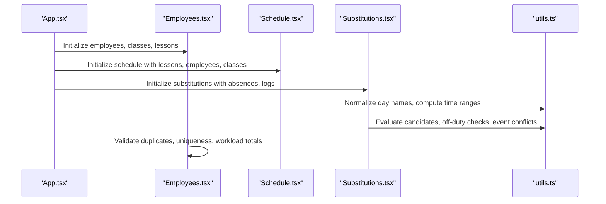
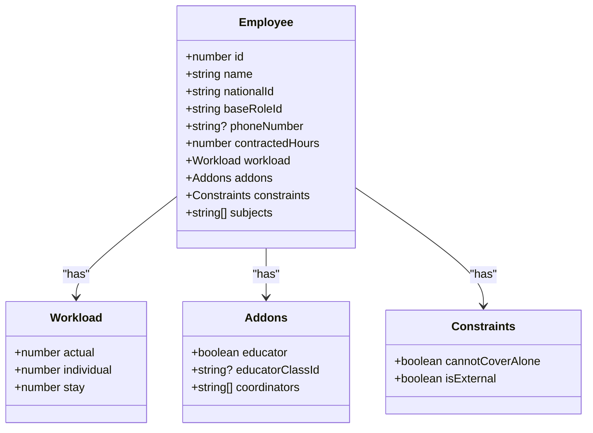
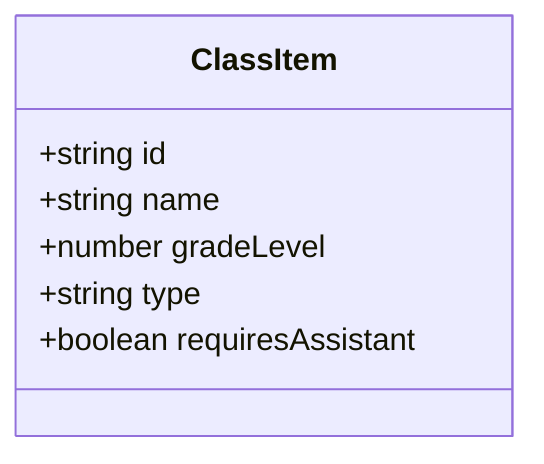
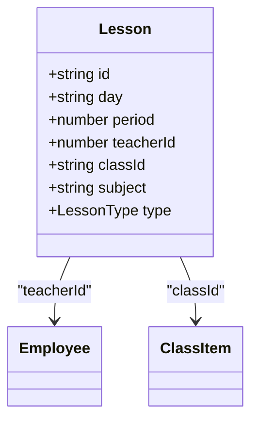
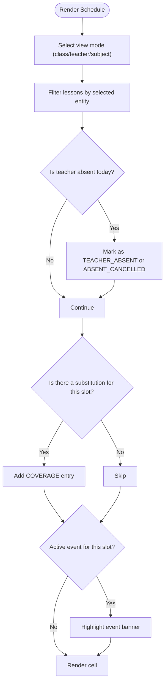
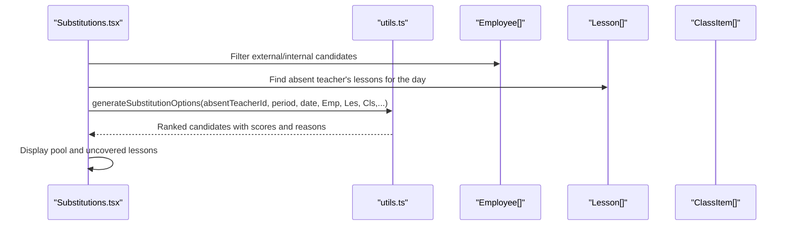
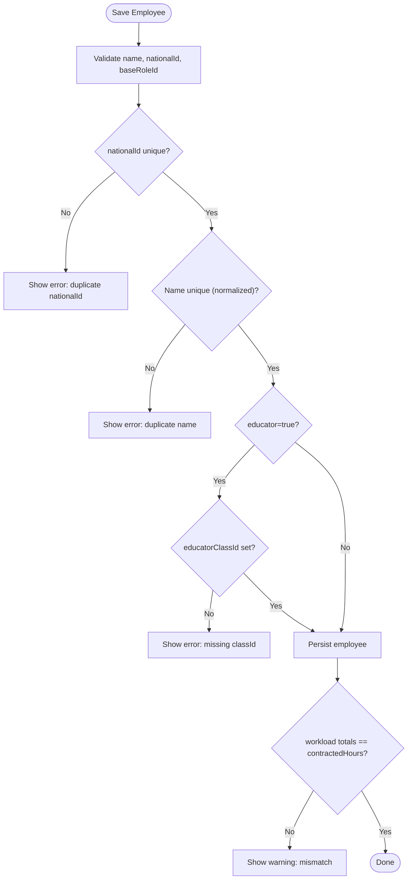
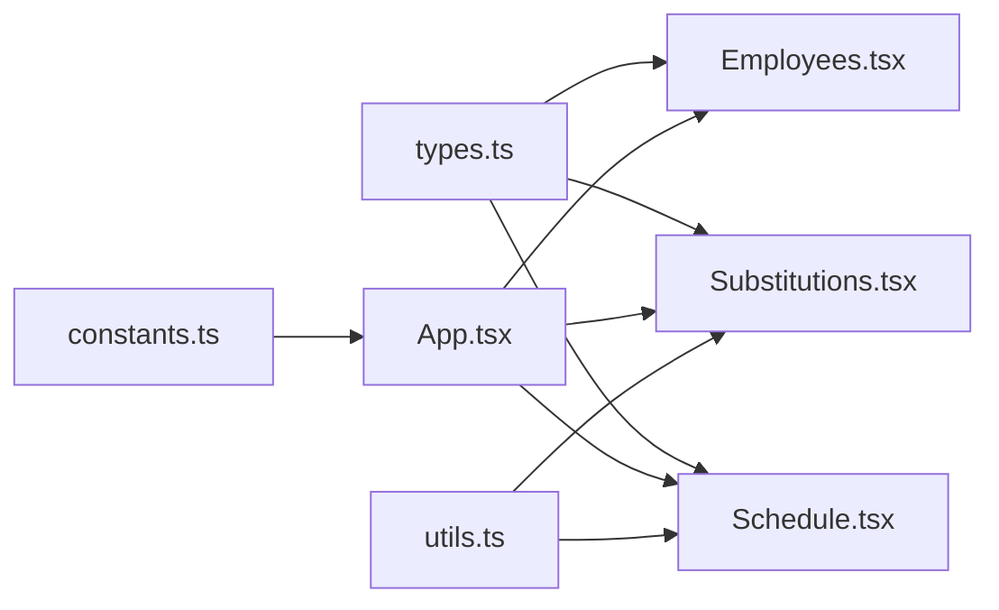

# Employee, Class, and Lesson Models

<cite>
**Referenced Files in This Document**
- [types.ts](file://types.ts)
- [constants.ts](file://constants.ts)
- [App.tsx](file://App.tsx)
- [Schedule.tsx](file://components/Schedule.tsx)
- [Substitutions.tsx](file://components/Substitutions.tsx)
- [Employees.tsx](file://components/Employees.tsx)
- [utils.ts](file://utils.ts)
</cite>

## Table of Contents
1. [Introduction](#introduction)
2. [Project Structure](#project-structure)
3. [Core Components](#core-components)
4. [Architecture Overview](#architecture-overview)
5. [Detailed Component Analysis](#detailed-component-analysis)
6. [Dependency Analysis](#dependency-analysis)
7. [Performance Considerations](#performance-considerations)
8. [Troubleshooting Guide](#troubleshooting-guide)
9. [Conclusion](#conclusion)

## Introduction
This document explains the core academic entities used in the application: Employee, ClassItem, and Lesson. It details their fields, constraints, and relationships, and shows how these models are used across Schedule.tsx, Substitutions.tsx, and Employees.tsx. It also documents data integrity rules and how these models influence scheduling decisions and substitution workflows.

## Project Structure
The application defines the core academic models in a shared types file and wires them into UI components and utilities. The models are consumed by:
- Schedule.tsx: renders timetables and overlays absence/substitution events
- Substitutions.tsx: computes availability and generates substitution options
- Employees.tsx: manages staff profiles, roles, workload, and educator assignments
- Utilities: provide helpers for filtering, normalization, and evaluation

**Diagram sources**
- [types.ts](file://types.ts#L1-L120)
- [constants.ts](file://constants.ts#L50-L120)
- [Schedule.tsx](file://components/Schedule.tsx#L1-L120)
- [Substitutions.tsx](file://components/Substitutions.tsx#L1-L120)
- [Employees.tsx](file://components/Employees.tsx#L1-L120)
- [utils.ts](file://utils.ts#L1-L120)

**Section sources**
- [types.ts](file://types.ts#L1-L120)
- [constants.ts](file://constants.ts#L50-L120)
- [App.tsx](file://App.tsx#L24-L60)

## Core Components

### Employee Model
Fields and semantics:
- id: Unique numeric identifier for the employee
- name: Full name
- nationalId: Unique national identity number
- baseRoleId: Reference to a role definition (e.g., principal, vice_principal, teachers, counselor)
- phoneNumber?: Optional contact phone
- contractedHours: Total contracted teaching hours
- workload: Distribution of hours across categories
  - actual: Actual teaching hours
  - individual: Individual instruction hours
  - stay: Stay-on-school-site hours
- addons:
  - educator: Boolean indicating homeroom teacher assignment
  - educatorClassId?: If educator, the classId they lead
  - coordinators: List of coordinator responsibilities
- constraints:
  - cannotCoverAlone: If true, the employee cannot cover a class alone
  - isExternal: If true, treated as an external substitute
- subjects: List of subjects the employee can teach

Data integrity rules:
- nationalId must be unique across employees
- name uniqueness is enforced by normalized comparison
- educatorClassId must be set if educator is true
- workload totals must equal contractedHours
- Duplicate IDs are auto-sanitized in the Employees UI

How roles affect scheduling:
- Role determines default hours and workload distribution
- Constraints like cannotCoverAlone and isExternal influence substitution eligibility

**Section sources**
- [types.ts](file://types.ts#L10-L32)
- [constants.ts](file://constants.ts#L50-L56)
- [Employees.tsx](file://components/Employees.tsx#L106-L182)
- [Employees.tsx](file://components/Employees.tsx#L34-L63)

### ClassItem Model
Fields and semantics:
- id: Unique string identifier for the class
- name: Human-readable class name
- gradeLevel: Numeric grade level (1–12)
- type: Either general or special
- requiresAssistant: Boolean indicating whether the class requires an assistant

Data integrity rules:
- Class names and IDs must be unique
- Grade levels are integers from 1 to 12
- Type must be one of the allowed values

Relationships:
- Classes are associated with lessons via classId
- Educators are assigned to a single class via educatorClassId

**Section sources**
- [types.ts](file://types.ts#L34-L41)
- [Employees.tsx](file://components/Employees.tsx#L66-L74)

### Lesson Model
Fields and semantics:
- id: Unique string identifier for the lesson slot
- day: Day of the week (Arabic)
- period: Period number (1..N)
- teacherId: Numeric identifier of the assigned teacher
- classId: Identifier of the class
- subject: Subject name
- type: LessonType union member or string, including actual, stay, individual, duty

Data integrity rules:
- Lessons must be uniquely identified by day, period, teacherId, and classId
- Lesson type must be one of the allowed values
- Lessons are filtered by view mode in Schedule.tsx (teacher/class/subject)

**Section sources**
- [types.ts](file://types.ts#L42-L51)
- [Schedule.tsx](file://components/Schedule.tsx#L138-L156)

## Architecture Overview
The models flow through the application as follows:
- App.tsx initializes state from constants and passes data to components
- Schedule.tsx renders the timetable and overlays absence/substitution events
- Substitutions.tsx computes available substitutes and builds substitution options
- Employees.tsx manages staff profiles and enforces data integrity
- utils.ts provides helpers for normalization, time ranges, and evaluation

**Diagram sources**
- [App.tsx](file://App.tsx#L24-L60)
- [Schedule.tsx](file://components/Schedule.tsx#L1-L120)
- [Substitutions.tsx](file://components/Substitutions.tsx#L1-L120)
- [utils.ts](file://utils.ts#L1-L120)
- [Employees.tsx](file://components/Employees.tsx#L1-L120)

## Detailed Component Analysis

### Employee Model Details
- Role mapping: baseRoleId maps to Role entries that define defaultHours and workloadDetails
- Educator assignment: When educator is true, educatorClassId must reference a valid classId
- Constraints: cannotCoverAlone and isExternal affect eligibility for substitutions and coverage
- Subjects: Used to match subject-specific substitutions and priority ladder criteria

**Diagram sources**
- [types.ts](file://types.ts#L10-L32)

**Section sources**
- [types.ts](file://types.ts#L10-L32)
- [constants.ts](file://constants.ts#L50-L56)
- [Employees.tsx](file://components/Employees.tsx#L106-L182)

### ClassItem Model Details
- Grade levels: 1 to 12
- Type: general or special
- Assistant requirement: requiresAssistant flag influences coverage decisions

**Diagram sources**
- [types.ts](file://types.ts#L34-L41)

**Section sources**
- [types.ts](file://types.ts#L34-L41)

### Lesson Model Details
- Composite key: day + period + teacherId + classId
- Type: actual, stay, individual, duty
- Relationships: teacherId links to Employee; classId links to ClassItem

**Diagram sources**
- [types.ts](file://types.ts#L42-L51)

**Section sources**
- [types.ts](file://types.ts#L42-L51)

### Schedule.tsx: Rendering and Overlay Logic
- View modes: class, teacher, subject
- Filtering: filters lessons by selected entity and view mode
- Overlays:
  - Absences: marks lessons as TEACHER_ABSENT or ABSENT_CANCELLED
  - Substitution logs: adds COVERAGE entries for substitute teachers
  - Events: highlights calendar events affecting the selected view

**Diagram sources**
- [Schedule.tsx](file://components/Schedule.tsx#L138-L254)

**Section sources**
- [Schedule.tsx](file://components/Schedule.tsx#L138-L254)

### Substitutions.tsx: Availability and Options
- Pool management: separates internal and external substitutes
- Availability calculation: identifies free periods and off-duty windows
- Uncovered lessons: lists lessons without a substitute
- Evaluation: uses utils.generateSubstitutionOptions to rank candidates based on constraints, events, and mode rules

**Diagram sources**
- [Substitutions.tsx](file://components/Substitutions.tsx#L77-L121)
- [utils.ts](file://utils.ts#L326-L558)

**Section sources**
- [Substitutions.tsx](file://components/Substitutions.tsx#L77-L121)
- [utils.ts](file://utils.ts#L326-L558)

### Employees.tsx: Integrity and Workload
- Duplicate ID detection and sanitization
- Unique constraints: nationalId and normalized name
- Educator assignment: ensures educatorClassId is set when educator is true
- Workload totals: actual + individual + stay must equal contractedHours

**Diagram sources**
- [Employees.tsx](file://components/Employees.tsx#L146-L200)
- [Employees.tsx](file://components/Employees.tsx#L34-L63)

**Section sources**
- [Employees.tsx](file://components/Employees.tsx#L34-L63)
- [Employees.tsx](file://components/Employees.tsx#L146-L200)

## Dependency Analysis
- Schedule.tsx depends on:
  - Lesson, Employee, ClassItem, ScheduleConfig, EngineContext, SubstitutionLog, AbsenceRecord
  - Uses utils.normalizeArabic and time helpers
- Substitutions.tsx depends on:
  - Employee, Lesson, ClassItem, EngineContext, AbsenceRecord, SubstitutionLog
  - Uses utils.generateSubstitutionOptions and normalizeArabic
- Employees.tsx depends on:
  - Employee, ClassItem, Role
  - Uses utils.normalizeArabic and CSV helpers
- constants.ts provides:
  - INITIAL_* collections and schedule configuration defaults
- App.tsx wires:
  - Local storage-backed state for employees, classes, lessons, scheduleConfig, roles, absences, engineContext, substitutionLogs

**Diagram sources**
- [types.ts](file://types.ts#L1-L120)
- [constants.ts](file://constants.ts#L50-L120)
- [App.tsx](file://App.tsx#L24-L60)
- [Schedule.tsx](file://components/Schedule.tsx#L1-L120)
- [Substitutions.tsx](file://components/Substitutions.tsx#L1-L120)
- [Employees.tsx](file://components/Employees.tsx#L1-L120)
- [utils.ts](file://utils.ts#L1-L120)

**Section sources**
- [App.tsx](file://App.tsx#L24-L60)
- [Schedule.tsx](file://components/Schedule.tsx#L1-L120)
- [Substitutions.tsx](file://components/Substitutions.tsx#L1-L120)
- [Employees.tsx](file://components/Employees.tsx#L1-L120)
- [utils.ts](file://utils.ts#L1-L120)

## Performance Considerations
- Filtering and memoization:
  - Schedule.tsx uses useMemo to derive grouped subjects and visible days, reducing re-computation
  - Substitutions.tsx uses useMemo to compute available internals and counts
- Normalization:
  - utils.normalizeArabic is used to compare names and days consistently
- Evaluation:
  - utils.generateSubstitutionOptions iterates candidates and evaluates rules; keep candidate sets minimal to improve responsiveness

[No sources needed since this section provides general guidance]

## Troubleshooting Guide
Common issues and resolutions:
- Duplicate nationalId or name:
  - Employees.tsx validates uniqueness and shows errors; correct duplicates before saving
- Educator without classId:
  - When educator is true, educatorClassId must be set; otherwise saving fails
- Workload mismatch:
  - actual + individual + stay must equal contractedHours; otherwise a warning is shown
- Substitute eligibility:
  - Substitutions.tsx excludes external substitutes and those who are off-duty or busy with events
- Absence and coverage:
  - Schedule.tsx overlays absence and substitution logs; ensure logs are synchronized with absences

**Section sources**
- [Employees.tsx](file://components/Employees.tsx#L146-L200)
- [Substitutions.tsx](file://components/Substitutions.tsx#L77-L121)
- [Schedule.tsx](file://components/Schedule.tsx#L184-L239)
- [utils.ts](file://utils.ts#L326-L558)

## Conclusion
The Employee, ClassItem, and Lesson models form the backbone of the scheduling and substitution workflows. Their fields and constraints directly influence how Schedule.tsx renders timetables, how Substitutions.tsx selects substitutes, and how Employees.tsx maintains data integrity. By adhering to the documented data integrity rules and leveraging the provided utilities, the system ensures predictable and fair scheduling outcomes across modes and events.