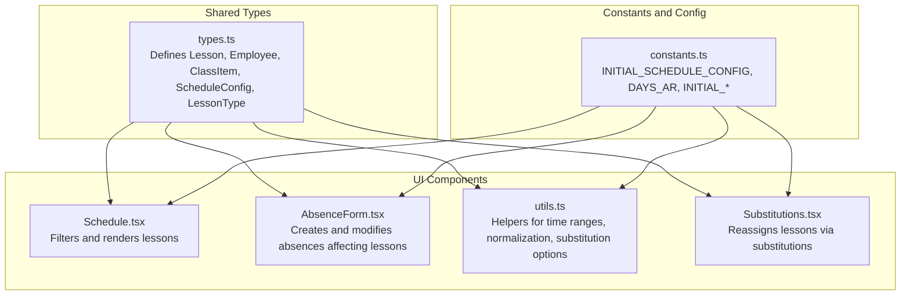
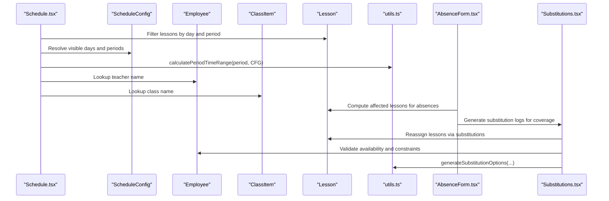
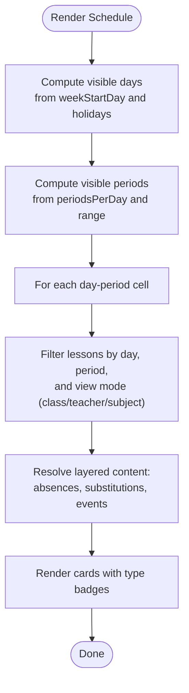
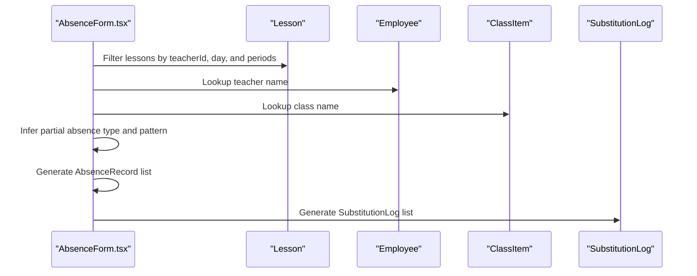
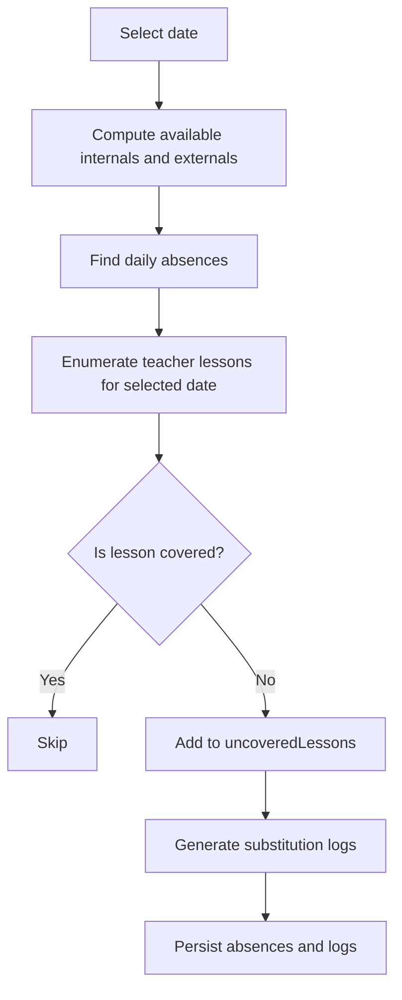
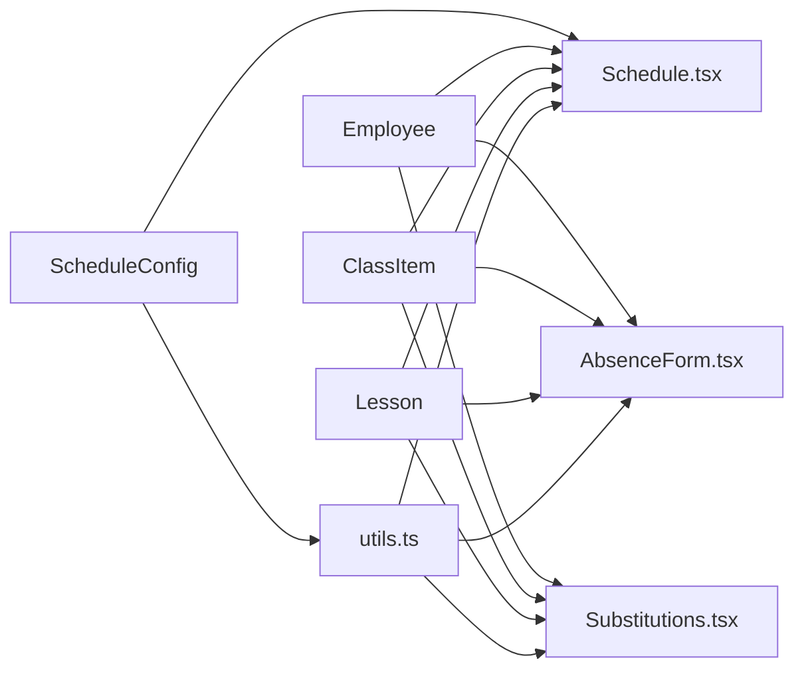

# Lesson Model

<cite>
**Referenced Files in This Document**
- [types.ts](file://types.ts)
- [constants.ts](file://constants.ts)
- [utils.ts](file://utils.ts)
- [components/Schedule.tsx](file://components/Schedule.tsx)
- [components/AbsenceForm.tsx](file://components/AbsenceForm.tsx)
- [components/Substitutions.tsx](file://components/Substitutions.tsx)
- [App.tsx](file://App.tsx)
</cite>

## Table of Contents
1. [Introduction](#introduction)
2. [Project Structure](#project-structure)
3. [Core Components](#core-components)
4. [Architecture Overview](#architecture-overview)
5. [Detailed Component Analysis](#detailed-component-analysis)
6. [Dependency Analysis](#dependency-analysis)
7. [Performance Considerations](#performance-considerations)
8. [Troubleshooting Guide](#troubleshooting-guide)
9. [Conclusion](#conclusion)

## Introduction
This document provides a comprehensive guide to the Lesson model, which represents scheduled instructional periods in the system. It explains the model’s fields, how they relate to weekly scheduling and time slots, and how the model integrates with Employee and ClassItem to form the core scheduling triad. It also documents how LessonType values influence workload accounting and substitution eligibility, and illustrates how lessons are filtered in the Schedule view, modified during absences in the Absence Form, and reassigned in the Substitutions view. Finally, it highlights how type safety and cross-referencing with employee and class registries maintain lesson data integrity.

## Project Structure
The Lesson model is defined in the shared types module and is consumed across several UI components responsible for displaying, editing, and managing schedules and substitutions.

**Diagram sources**
- [types.ts](file://types.ts#L8-L51)
- [constants.ts](file://constants.ts#L49-L82)
- [components/Schedule.tsx](file://components/Schedule.tsx#L1-L120)
- [components/AbsenceForm.tsx](file://components/AbsenceForm.tsx#L1-L120)
- [components/Substitutions.tsx](file://components/Substitutions.tsx#L1-L120)
- [utils.ts](file://utils.ts#L177-L181)

**Section sources**
- [types.ts](file://types.ts#L8-L51)
- [constants.ts](file://constants.ts#L49-L82)
- [components/Schedule.tsx](file://components/Schedule.tsx#L1-L120)
- [components/AbsenceForm.tsx](file://components/AbsenceForm.tsx#L1-L120)
- [components/Substitutions.tsx](file://components/Substitutions.tsx#L1-L120)
- [utils.ts](file://utils.ts#L177-L181)

## Core Components
- Lesson: The core model representing a scheduled instruction slot with fields id, day, period, teacherId, classId, subject, and type.
- Employee: Represents a teacher or staff member, linked to lessons via teacherId.
- ClassItem: Represents a class or section, linked to lessons via classId.
- ScheduleConfig: Defines weekly and daily schedule parameters, including days, periods, and breaks.
- LessonType: Union of values indicating the nature of the lesson for workload and substitution logic.

These components collectively define the scheduling triad: a lesson connects a teacher, a class, and a time slot.

**Section sources**
- [types.ts](file://types.ts#L8-L51)

## Architecture Overview
The Lesson model participates in three primary workflows:
- Display and filtering in the Schedule view
- Absence recording and derived state in the Absence Form
- Substitution assignment and reassignment in the Substitutions view

**Diagram sources**
- [components/Schedule.tsx](file://components/Schedule.tsx#L138-L156)
- [components/Schedule.tsx](file://components/Schedule.tsx#L157-L204)
- [utils.ts](file://utils.ts#L177-L181)
- [components/AbsenceForm.tsx](file://components/AbsenceForm.tsx#L200-L233)
- [components/Substitutions.tsx](file://components/Substitutions.tsx#L130-L161)
- [utils.ts](file://utils.ts#L326-L558)

## Detailed Component Analysis

### Lesson Model Fields and Semantics
- id: Unique identifier for the lesson record.
- day: The weekday name (Arabic) aligned with ScheduleConfig.weekStartDay and constants.DAYS_AR.
- period: Integer slot number within a day, aligned with ScheduleConfig.periodsPerDay and ScheduleConfig.customPeriodDurations.
- teacherId: Foreign key linking to Employee.id.
- classId: Foreign key linking to ClassItem.id.
- subject: The subject taught in the lesson.
- type: LessonType union with values:
  - actual: A face-to-face instructional slot.
  - stay: A “stay” slot where the teacher remains on-site for supervision or administrative duties.
  - individual: An individual instruction slot (often smaller or specialized).
  - duty: A duty-related slot that may not count toward typical teaching load.

These fields enable precise scheduling, workload accounting, and substitution decisions.

**Section sources**
- [types.ts](file://types.ts#L42-L51)
- [types.ts](file://types.ts#L8-L9)

### Weekly Scheduling Alignment (day and ScheduleConfig.weekStartDay)
- The day field is an Arabic weekday name (e.g., "الأحد", "الاثنين", etc.), sourced from constants.DAYS_AR.
- ScheduleConfig.weekStartDay defines the weekly rotation start day. The Schedule component uses getSortedDays to compute the visible week order and filters out holidays based on ScheduleConfig.holidays.
- Lesson filtering in Schedule.tsx compares normalized Arabic day names to ensure robust matching across locale variations.

Practical implication:
- Lessons are grouped and rendered by day according to the configured week start and holiday list, ensuring consistent weekly views.

**Section sources**
- [constants.ts](file://constants.ts#L4-L10)
- [components/Schedule.tsx](file://components/Schedule.tsx#L119-L131)
- [utils.ts](file://utils.ts#L225-L228)

### Period Alignment with ScheduleConfig and Time Slots
- period is a positive integer representing the lesson’s time slot within a day.
- ScheduleConfig.periodsPerDay sets the maximum number of periods per day.
- ScheduleConfig.schoolStartTime, periodDuration, and customPeriodDurations define the start time and durations for each period, including breaks.
- The helper calculatePeriodTimeRange uses a generated DayPattern to return the start and end time for a given period, enabling accurate display and conflict detection.

Practical implication:
- The system dynamically computes period boundaries and can vary per period (e.g., long vs. short breaks), ensuring accurate scheduling and substitution logic.

**Section sources**
- [constants.ts](file://constants.ts#L62-L82)
- [utils.ts](file://utils.ts#L85-L115)
- [utils.ts](file://utils.ts#L177-L181)

### The Scheduling Triad: Lesson ↔ Employee ↔ ClassItem
- Lesson.teacherId references Employee.id, enabling lookup of teacher names and constraints.
- Lesson.classId references ClassItem.id, enabling lookup of class names and attributes.
- The Schedule component resolves teacher and class names for display and uses these links to render contextual information.

Data integrity:
- Cross-references ensure that lessons remain valid only when associated employees and classes exist in the registry.

**Section sources**
- [types.ts](file://types.ts#L10-L41)
- [components/Schedule.tsx](file://components/Schedule.tsx#L398-L407)

### LessonType Values and Their Impacts
- actual: Face-to-face instruction; counts toward teaching load and is eligible for substitution.
- stay: On-site supervision/administrative duty; often restricted from substitution coverage under golden rules.
- individual: Individual instruction; may be eligible for substitution depending on mode and policy.
- duty: Duty-related slot; typically not counted as teaching load and may have special substitution rules.

Workload accounting:
- Roles include workloadDetails with actual, individual, and stay counts. These inform default allocations and policy enforcement.

Substitution eligibility:
- AbsenceForm and Substitutions logic exclude stay, individual, and duty lessons from automatic substitution where policies restrict coverage.
- The generateSubstitutionOptions helper enforces mode-specific golden rules and event constraints to determine viable substitutes.

**Section sources**
- [types.ts](file://types.ts#L8-L9)
- [types.ts](file://types.ts#L77-L87)
- [components/AbsenceForm.tsx](file://components/AbsenceForm.tsx#L364-L368)
- [utils.ts](file://utils.ts#L326-L558)

### Filtering Lessons in Schedule.tsx
- Cell content retrieval:
  - getCellContent filters lessons by normalized day and period, then applies view-mode filters (class, teacher, subject).
- Layered content resolution:
  - resolveLayeredContent adjusts lesson types based on absences and substitution logs (e.g., marking TEACHER_ABSENT or COVERAGE).
- Active mode and events:
  - getActiveModeForSlot identifies active modes affecting a slot, and resolveLayeredContent overlays active events.

**Diagram sources**
- [components/Schedule.tsx](file://components/Schedule.tsx#L119-L156)
- [components/Schedule.tsx](file://components/Schedule.tsx#L168-L254)

**Section sources**
- [components/Schedule.tsx](file://components/Schedule.tsx#L119-L156)
- [components/Schedule.tsx](file://components/Schedule.tsx#L168-L254)

### Modifications During Absences in AbsenceForm.tsx
- Affected lessons computation:
  - affectedLessons enumerates lessons for selected teachers on each date within the chosen range, excluding lessons that overlap with active calendar events.
- Absence persistence:
  - handleSubmit generates AbsenceRecord entries for each date and affected periods, including inferred partial absence patterns.
- Substitution generation:
  - The wizard and board logic compute viable substitutes, respecting constraints, event conflicts, and daily load caps.
  - Substitution logs are created for each assignment.

**Diagram sources**
- [components/AbsenceForm.tsx](file://components/AbsenceForm.tsx#L200-L233)
- [components/AbsenceForm.tsx](file://components/AbsenceForm.tsx#L559-L579)
- [components/AbsenceForm.tsx](file://components/AbsenceForm.tsx#L338-L471)

**Section sources**
- [components/AbsenceForm.tsx](file://components/AbsenceForm.tsx#L200-L233)
- [components/AbsenceForm.tsx](file://components/AbsenceForm.tsx#L559-L579)
- [components/AbsenceForm.tsx](file://components/AbsenceForm.tsx#L338-L471)

### Reassignment in Substitutions.tsx
- Uncovered lessons:
  - uncoveredLessons lists lessons that are absent and not yet covered by a substitution log.
- Pool and availability:
  - availableInternals and availableExternals compute daily availability based on ScheduleConfig and existing lessons/events.
- Save and update:
  - handleSaveAbsence updates absences and substitution logs atomically for the selected date.

**Diagram sources**
- [components/Substitutions.tsx](file://components/Substitutions.tsx#L79-L121)
- [components/Substitutions.tsx](file://components/Substitutions.tsx#L130-L161)
- [components/Substitutions.tsx](file://components/Substitutions.tsx#L170-L200)

**Section sources**
- [components/Substitutions.tsx](file://components/Substitutions.tsx#L79-L121)
- [components/Substitutions.tsx](file://components/Substitutions.tsx#L130-L161)
- [components/Substitutions.tsx](file://components/Substitutions.tsx#L170-L200)

### Data Integrity Through Type Safety and Cross-Referencing
- Strong typing:
  - Lesson, Employee, and ClassItem are strictly typed, preventing invalid combinations at compile time.
- Cross-referencing:
  - Schedule.tsx and AbsenceForm.tsx rely on teacherId and classId lookups to ensure lessons refer to existing records.
- Normalization:
  - normalizeArabic ensures robust matching across locale-specific variations of Arabic weekday names.
- Dynamic schedule generation:
  - generatePatternFromConfig derives period start/end times from ScheduleConfig, ensuring consistency between schedule configuration and lesson timing.

**Section sources**
- [types.ts](file://types.ts#L10-L51)
- [utils.ts](file://utils.ts#L17-L27)
- [utils.ts](file://utils.ts#L85-L115)
- [utils.ts](file://utils.ts#L177-L181)

## Dependency Analysis
The Lesson model depends on ScheduleConfig for temporal context and on Employee/ClassItem for identity. The Schedule, AbsenceForm, and Substitutions components depend on Lesson to render, filter, and modify schedules.

**Diagram sources**
- [types.ts](file://types.ts#L55-L75)
- [components/Schedule.tsx](file://components/Schedule.tsx#L1-L60)
- [components/AbsenceForm.tsx](file://components/AbsenceForm.tsx#L1-L40)
- [components/Substitutions.tsx](file://components/Substitutions.tsx#L1-L40)
- [utils.ts](file://utils.ts#L177-L181)

**Section sources**
- [types.ts](file://types.ts#L55-L75)
- [components/Schedule.tsx](file://components/Schedule.tsx#L1-L60)
- [components/AbsenceForm.tsx](file://components/AbsenceForm.tsx#L1-L40)
- [components/Substitutions.tsx](file://components/Substitutions.tsx#L1-L40)
- [utils.ts](file://utils.ts#L177-L181)

## Performance Considerations
- Efficient filtering:
  - Memoized computations (useMemo) in Schedule.tsx reduce recomputation of grouped subjects and visible days/periods.
- Batch updates:
  - AbsenceForm and Substitutions batch updates to absences and substitution logs to minimize re-renders.
- Dynamic pattern generation:
  - generatePatternFromConfig recalculates period boundaries only when ScheduleConfig changes, avoiding repeated heavy computations.

[No sources needed since this section provides general guidance]

## Troubleshooting Guide
Common issues and resolutions:
- Mismatched day names:
  - Ensure day values are Arabic weekday names aligned with constants.DAYS_AR and ScheduleConfig.weekStartDay. Use normalizeArabic when comparing.
- Period out of range:
  - Verify ScheduleConfig.periodsPerDay and customPeriodDurations; lessons with periods exceeding this limit will not render correctly.
- Substitution blocked by golden rules:
  - stay lessons may be blocked from substitution under strict golden rules. Review engineContext and active modes.
- Conflicting calendar events:
  - Lessons overlapping with active events may be protected from manual edits. Confirm event opContext and periods.
- Absence range errors:
  - For partial absences, ensure affectedPeriods fall within the configured periodsPerDay and are contiguous or non-contiguous as intended.

**Section sources**
- [utils.ts](file://utils.ts#L17-L27)
- [utils.ts](file://utils.ts#L326-L558)
- [components/AbsenceForm.tsx](file://components/AbsenceForm.tsx#L473-L501)
- [components/Substitutions.tsx](file://components/Substitutions.tsx#L476-L501)

## Conclusion
The Lesson model is central to the scheduling system, integrating tightly with ScheduleConfig, Employee, and ClassItem. Its fields and LessonType semantics enable precise scheduling, accurate workload accounting, and safe substitution workflows. The Schedule, AbsenceForm, and Substitutions components enforce data integrity through strong typing, cross-referencing, and normalization, while dynamic schedule generation ensures alignment between configuration and runtime behavior.