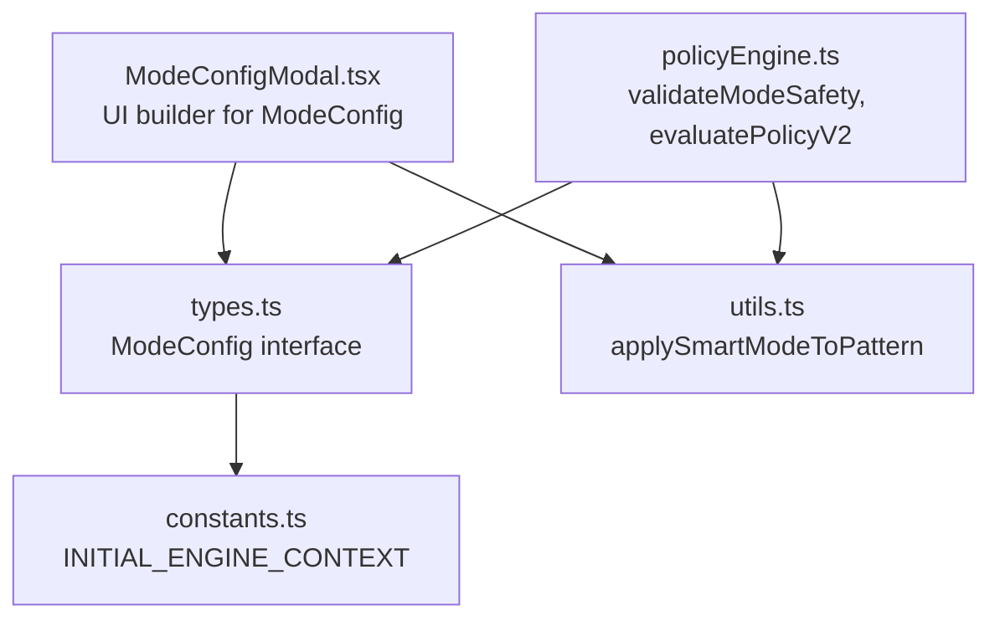
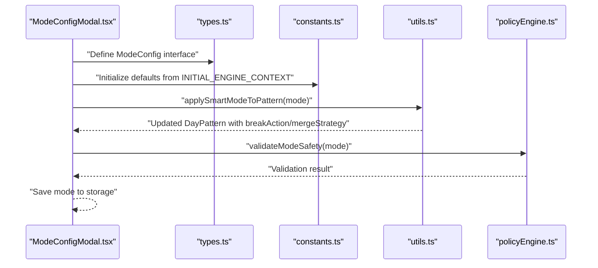
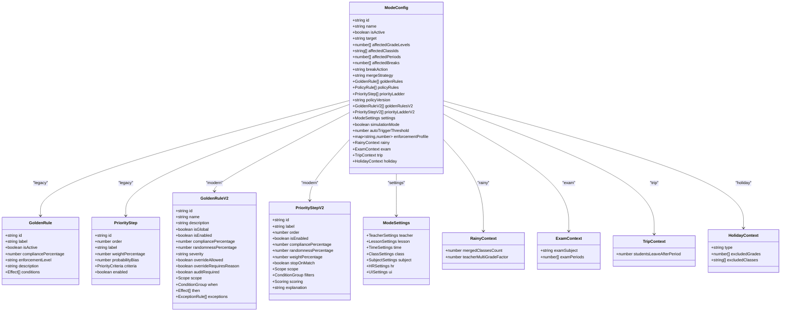
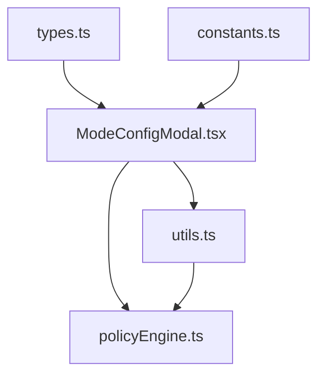

# Core Configuration Fields

<cite>
**Referenced Files in This Document**
- [constants.ts](file://constants.ts)
- [types.ts](file://types.ts)
- [ModeConfigModal.tsx](file://components/ModeConfigModal.tsx)
- [policyEngine.ts](file://utils/policyEngine.ts)
- [utils.ts](file://utils.ts)
</cite>

## Table of Contents
1. [Introduction](#introduction)
2. [Project Structure](#project-structure)
3. [Core Components](#core-components)
4. [Architecture Overview](#architecture-overview)
5. [Detailed Component Analysis](#detailed-component-analysis)
6. [Dependency Analysis](#dependency-analysis)
7. [Performance Considerations](#performance-considerations)
8. [Troubleshooting Guide](#troubleshooting-guide)
9. [Conclusion](#conclusion)

## Introduction
This document explains the core fields of ModeConfig and how they define the scope and behavior of operational modes. It covers each field’s role, how they are configured in the UI, and how they are validated and enforced by the policy engine. Practical usage patterns, common configuration errors, and integration with the broader policy engine are included.

## Project Structure
ModeConfig is the central configuration object for operational modes. It is defined in the types module and populated by the ModeConfigModal UI. The policy engine reads ModeConfig to enforce golden rules, priority ladders, and settings during substitution decisions.

**Diagram sources**
- [ModeConfigModal.tsx](file://components/ModeConfigModal.tsx#L61-L131)
- [types.ts](file://types.ts#L169-L216)
- [constants.ts](file://constants.ts#L109-L426)
- [utils.ts](file://utils.ts#L117-L175)
- [policyEngine.ts](file://utils/policyEngine.ts#L24-L44)

**Section sources**
- [types.ts](file://types.ts#L169-L216)
- [ModeConfigModal.tsx](file://components/ModeConfigModal.tsx#L61-L131)
- [constants.ts](file://constants.ts#L109-L426)
- [utils.ts](file://utils.ts#L117-L175)
- [policyEngine.ts](file://utils/policyEngine.ts#L24-L44)

## Core Components
ModeConfig defines the operational mode’s identity, scope, and behavior. The following fields are central:

- id: Unique identifier for the mode.
- name: Human-readable label for the mode.
- isActive: Whether the mode is currently active.
- target: Scope selector for who/what the mode applies to.
- affectedGradeLevels: Specific grade levels affected.
- affectedClassIds: Specific class identifiers affected.
- affectedPeriods: Period numbers affected by the mode.
- affectedBreaks: Break indices affected by the mode.
- breakAction: How breaks are treated (none, internal supervision, merge).
- mergeStrategy: Strategy for merging breaks when breakAction is merge.
- goldenRules/priorityLadder: Legacy rule sets.
- policyVersion/goldenRulesV2/priorityLadderV2/settings: Modern rule engine fields.
- simulationMode/autoTriggerThreshold/enforcementProfile: Operational controls.
- Specialized contexts: rainy, exam, trip, holiday.

These fields collectively determine:
- Who is impacted (target, affectedGradeLevels, affectedClassIds)
- Which time slots are impacted (affectedPeriods, affectedBreaks)
- How breaks are handled (breakAction, mergeStrategy)
- How substitutions are evaluated (goldenRulesV2, priorityLadderV2, settings)
- Additional operational constraints (simulationMode, autoTriggerThreshold, enforcementProfile)

**Section sources**
- [types.ts](file://types.ts#L169-L216)
- [constants.ts](file://constants.ts#L109-L426)

## Architecture Overview
ModeConfig is consumed by the policy engine to compute substitution decisions and by utilities to adjust the daily schedule pattern. The UI initializes ModeConfig defaults and exposes controls for scope and settings.

**Diagram sources**
- [ModeConfigModal.tsx](file://components/ModeConfigModal.tsx#L61-L131)
- [types.ts](file://types.ts#L169-L216)
- [constants.ts](file://constants.ts#L109-L426)
- [utils.ts](file://utils.ts#L117-L175)
- [policyEngine.ts](file://utils/policyEngine.ts#L24-L44)

## Detailed Component Analysis

### Field-by-Field Documentation

- id
  - Purpose: Uniquely identifies the mode.
  - Behavior: Used in validation and engine logic to branch behavior (e.g., rainy mode mergedClassesCount).
  - Example usage: See INITIAL_ENGINE_CONTEXT entries for ids like normalMode, rainyMode, examMode, tripMode, emergencyMode, holidayMode.
  - Validation: Required for identity checks.
  - Section sources
    - [types.ts](file://types.ts#L169-L176)
    - [policyEngine.ts](file://utils/policyEngine.ts#L24-L44)
    - [constants.ts](file://constants.ts#L109-L426)

- name
  - Purpose: Human-readable label for display.
  - Behavior: Used in UI labels and logs.
  - Validation: Required for identity checks.
  - Section sources
    - [types.ts](file://types.ts#L170-L171)
    - [policyEngine.ts](file://utils/policyEngine.ts#L24-L44)

- isActive
  - Purpose: Enables or disables the mode.
  - Behavior: Modes are combined to produce the active set that affects scheduling and substitution decisions.
  - Section sources
    - [types.ts](file://types.ts#L172-L172)
    - [constants.ts](file://constants.ts#L109-L426)
    - [utils.ts](file://utils.ts#L117-L121)

- target
  - Purpose: Determines the scope of application.
  - Values: all, specific_grades, specific_classes.
  - Behavior: Controls whether the mode applies to the whole school, specific grades, or specific classes.
  - Section sources
    - [types.ts](file://types.ts#L173-L173)
    - [ModeConfigModal.tsx](file://components/ModeConfigModal.tsx#L259-L263)

- affectedGradeLevels
  - Purpose: Selects specific grade levels when target is specific_grades.
  - Behavior: Combined with target to limit scope.
  - Section sources
    - [types.ts](file://types.ts#L174-L174)
    - [ModeConfigModal.tsx](file://components/ModeConfigModal.tsx#L265-L281)

- affectedClassIds
  - Purpose: Selects specific classes when target is specific_classes.
  - Behavior: Combined with target to limit scope.
  - Section sources
    - [types.ts](file://types.ts#L175-L175)
    - [ModeConfigModal.tsx](file://components/ModeConfigModal.tsx#L283-L301)

- affectedPeriods
  - Purpose: Lists the periods affected by the mode.
  - Behavior: Limits where the mode applies in time.
  - Section sources
    - [types.ts](file://types.ts#L176-L176)
    - [constants.ts](file://constants.ts#L109-L426)

- affectedBreaks
  - Purpose: Lists the break indices affected by the mode.
  - Behavior: Drives breakAction and mergeStrategy.
  - Section sources
    - [types.ts](file://types.ts#L177-L177)
    - [ModeConfigModal.tsx](file://components/ModeConfigModal.tsx#L71-L73)

- breakAction
  - Purpose: Defines how breaks are treated.
  - Values: none, internal, merge.
  - Behavior: none leaves breaks unchanged; internal marks breaks as internal supervision; merge merges two breaks according to mergeStrategy.
  - Section sources
    - [types.ts](file://types.ts#L178-L178)
    - [utils.ts](file://utils.ts#L124-L157)

- mergeStrategy
  - Purpose: Strategy for merging breaks when breakAction is merge.
  - Values: advance_second, delay_first.
  - Behavior: Determines which break slot absorbs the duration of the other.
  - Section sources
    - [types.ts](file://types.ts#L179-L179)
    - [utils.ts](file://utils.ts#L133-L157)

- goldenRules and priorityLadder
  - Purpose: Legacy rule sets for golden rules and priority ladder.
  - Behavior: Used by the legacy engine; modern engine uses goldenRulesV2 and priorityLadderV2.
  - Section sources
    - [types.ts](file://types.ts#L180-L182)
    - [constants.ts](file://constants.ts#L109-L426)

- policyVersion, goldenRulesV2, priorityLadderV2, settings
  - Purpose: Modern rule engine fields.
  - Behavior: policyVersion toggles between v1 and v2; settings define teacher, lesson, time, class, subject, HR, and UI constraints.
  - Section sources
    - [types.ts](file://types.ts#L185-L191)
    - [ModeConfigModal.tsx](file://components/ModeConfigModal.tsx#L238-L253)

- simulationMode, autoTriggerThreshold, enforcementProfile
  - Purpose: Operational controls for simulation and enforcement.
  - Behavior: simulationMode enables simulation context; autoTriggerThreshold triggers emergency mode automatically; enforcementProfile adjusts rule enforcement levels.
  - Section sources
    - [types.ts](file://types.ts#L196-L199)
    - [constants.ts](file://constants.ts#L297-L310)

- Specialized contexts
  - rainy: mergedClassesCount, teacherMultiGradeFactor, and coverage quotas.
  - exam: examSubject, examPeriods.
  - trip: studentsLeaveAfterPeriod.
  - holiday: type, excludedGrades, excludedClasses.
  - Section sources
    - [types.ts](file://types.ts#L199-L216)
    - [constants.ts](file://constants.ts#L169-L385)

### Practical Usage Patterns

- Normal mode
  - Scope: all, affects all periods, internal breaks.
  - Behavior: Standard stay rule applies; no special constraints.
  - Section sources
    - [constants.ts](file://constants.ts#L109-L128)

- Rainy mode
  - Scope: all, affects all periods, internal breaks.
  - Behavior: Requires mergedClassesCount; enforces merging and equity rules.
  - Section sources
    - [constants.ts](file://constants.ts#L129-L168)
    - [policyEngine.ts](file://utils/policyEngine.ts#L31-L34)

- Exam mode
  - Scope: all, affects first three periods, no breaks.
  - Behavior: Requires governing subject; restricts external staff; prioritizes homeroom and subject specialists.
  - Section sources
    - [constants.ts](file://constants.ts#L169-L235)

- Trip mode
  - Scope: specific_grades, affects all periods, internal breaks.
  - Behavior: Enforces educator presence; releases trip slots; protects seventh period.
  - Section sources
    - [constants.ts](file://constants.ts#L236-L296)

- Emergency mode
  - Scope: all, affects all periods, no breaks.
  - Behavior: Relaxes stay rule; enforces survival rule; requires documentation.
  - Section sources
    - [constants.ts](file://constants.ts#L297-L336)

- Holiday mode
  - Scope: specific_grades, affects all periods, no breaks.
  - Behavior: Excludes specified grades/classes; allows released teachers; protects original schedule.
  - Section sources
    - [constants.ts](file://constants.ts#L337-L385)

### Configuration in ModeConfigModal.tsx
- Defaults initialization
  - Sets id, name, isActive, target, affectedGradeLevels, affectedClassIds, affectedPeriods, affectedBreaks, breakAction, mergeStrategy, and specialized contexts.
  - Ensures settings exist with defaults.
  - Section sources
    - [ModeConfigModal.tsx](file://components/ModeConfigModal.tsx#L61-L89)

- Scope configuration
  - target toggles between all, specific_grades, specific_classes.
  - affectedGradeLevels and affectedClassIds are populated interactively.
  - Section sources
    - [ModeConfigModal.tsx](file://components/ModeConfigModal.tsx#L259-L301)

- Validation and save
  - validateModeActivation delegates to validateModeSafety.
  - For examMode, ensures governing subject is propagated to legacy examSubject to pass validation.
  - Section sources
    - [ModeConfigModal.tsx](file://components/ModeConfigModal.tsx#L105-L131)
    - [policyEngine.ts](file://utils/policyEngine.ts#L24-L44)

### Validation in policyEngine.ts
- validateModeSafety
  - Checks identity (id, name).
  - Validates rainyMode mergedClassesCount.
  - Exam mode validation is lenient to support both legacy and modern subject settings.
  - Section sources
    - [policyEngine.ts](file://utils/policyEngine.ts#L24-L44)

### Integration with the Policy Engine
- applySmartModeToPattern
  - Uses breakAction and mergeStrategy to modify the daily pattern.
  - Marks breaks as internal or merges them according to mergeStrategy.
  - Section sources
    - [utils.ts](file://utils.ts#L117-L175)

- evaluatePolicyV2
  - Reads settings to enforce constraints (e.g., disable external, disable stay/individual, max daily/weekly coverage).
  - Applies goldenRulesV2 and priorityLadderV2 to compute scores and decisions.
  - Section sources
    - [policyEngine.ts](file://utils/policyEngine.ts#L296-L406)

### Common Configuration Errors and Fixes
- Missing id or name
  - Symptom: Validation fails with identity error.
  - Fix: Ensure id and name are set in the modal.
  - Section sources
    - [policyEngine.ts](file://utils/policyEngine.ts#L24-L44)

- Rainy mode mergedClassesCount negative
  - Symptom: Validation error requiring mergedClassesCount >= 0.
  - Fix: Set mergedClassesCount to zero or a positive integer.
  - Section sources
    - [policyEngine.ts](file://utils/policyEngine.ts#L31-L34)

- Exam mode subject not set
  - Symptom: Modal syncs governing subject to legacy examSubject; if both empty, fallback to a default subject to keep save enabled.
  - Fix: Set governing subject in settings or legacy examSubject.
  - Section sources
    - [ModeConfigModal.tsx](file://components/ModeConfigModal.tsx#L111-L121)

- Break merge without sufficient breaks
  - Symptom: Merge strategy has no effect if fewer than two affected breaks are selected.
  - Fix: Select at least two affected breaks for merge.
  - Section sources
    - [utils.ts](file://utils.ts#L133-L157)

### Data Model Class Diagram

**Diagram sources**
- [types.ts](file://types.ts#L169-L216)

## Dependency Analysis
ModeConfig depends on:
- types.ts for the ModeConfig interface and related types.
- constants.ts for default configurations and mode examples.
- ModeConfigModal.tsx for UI-driven configuration and validation.
- utils.ts for applying mode effects to the schedule pattern.
- policyEngine.ts for validation and policy evaluation.

**Diagram sources**
- [types.ts](file://types.ts#L169-L216)
- [constants.ts](file://constants.ts#L109-L426)
- [ModeConfigModal.tsx](file://components/ModeConfigModal.tsx#L61-L131)
- [utils.ts](file://utils.ts#L117-L175)
- [policyEngine.ts](file://utils/policyEngine.ts#L24-L44)

**Section sources**
- [types.ts](file://types.ts#L169-L216)
- [constants.ts](file://constants.ts#L109-L426)
- [ModeConfigModal.tsx](file://components/ModeConfigModal.tsx#L61-L131)
- [utils.ts](file://utils.ts#L117-L175)
- [policyEngine.ts](file://utils/policyEngine.ts#L24-L44)

## Performance Considerations
- Scope filtering: Narrow target and affected lists to reduce evaluation overhead.
- Settings tuning: Adjust HRSettings and fairness sensitivity to balance load distribution.
- Merge strategy: Prefer minimal break merges to avoid complex pattern recomputation.
- Section sources
  - [policyEngine.ts](file://utils/policyEngine.ts#L397-L406)
  - [utils.ts](file://utils.ts#L117-L175)

## Troubleshooting Guide
- Validation failures
  - Check id and name are present.
  - For rainy mode, ensure mergedClassesCount is non-negative.
  - For exam mode, ensure a governing subject is set in settings or legacy examSubject.
  - Section sources
    - [policyEngine.ts](file://utils/policyEngine.ts#L24-L44)
    - [ModeConfigModal.tsx](file://components/ModeConfigModal.tsx#L111-L121)

- Unexpected break behavior
  - Verify affectedBreaks selection and mergeStrategy.
  - Confirm breakAction is set appropriately.
  - Section sources
    - [utils.ts](file://utils.ts#L124-L157)

- Substitution scoring anomalies
  - Review settings (teacher, lesson, hr) and goldenRulesV2/priorityLadderV2.
  - Section sources
    - [policyEngine.ts](file://utils/policyEngine.ts#L296-L406)

## Conclusion
ModeConfig encapsulates the operational mode’s identity, scope, and behavior. Correct configuration of id, name, isActive, target, affectedGradeLevels, affectedClassIds, affectedPeriods, affectedBreaks, breakAction, and mergeStrategy ensures predictable scheduling and substitution outcomes. The UI provides guided configuration, while the policy engine enforces safety and evaluates policies consistently across modes.