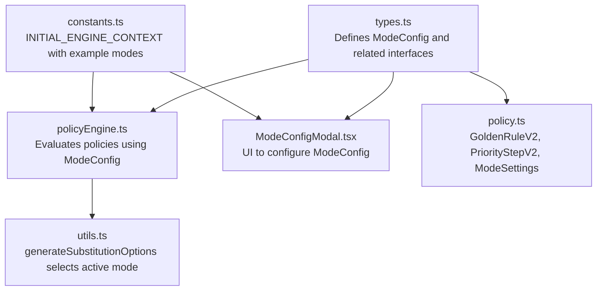
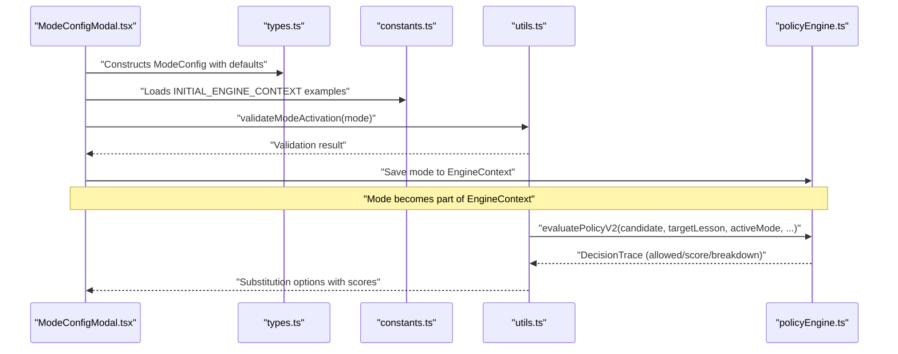
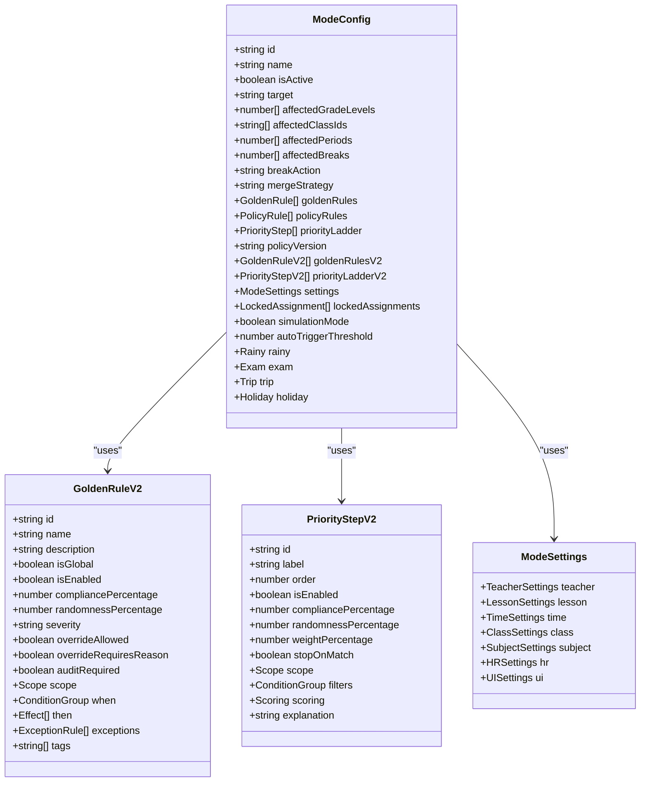

# Operational Mode Configuration

<cite>
**Referenced Files in This Document**
- [constants.ts](file://constants.ts)
- [types.ts](file://types.ts)
- [policy.ts](file://types/policy.ts)
- [policyEngine.ts](file://utils/policyEngine.ts)
- [ModeConfigModal.tsx](file://components/ModeConfigModal.tsx)
- [utils.ts](file://utils.ts)
</cite>

## Table of Contents
1. [Introduction](#introduction)
2. [Project Structure](#project-structure)
3. [Core Components](#core-components)
4. [Architecture Overview](#architecture-overview)
5. [Detailed Component Analysis](#detailed-component-analysis)
6. [Dependency Analysis](#dependency-analysis)
7. [Performance Considerations](#performance-considerations)
8. [Troubleshooting Guide](#troubleshooting-guide)
9. [Conclusion](#conclusion)

## Introduction
This document provides comprehensive data model documentation for ModeConfig, the central configuration object that defines operational modes (e.g., normal, rainy, exam, trip, emergency, holiday) and drives the policy engine. It explains all fields, including legacy and V2 engine additions, and how ModeConfig integrates with GoldenRule and PriorityStep interfaces. It also documents how modes are configured via ModeConfigModal and how the policy engine evaluates decisions using ModeConfig.

## Project Structure
ModeConfig is defined in the shared types module and consumed across the policy engine, modal UI, and constants that initialize default engine contexts.

**Diagram sources**
- [types.ts](file://types.ts#L169-L217)
- [policyEngine.ts](file://utils/policyEngine.ts#L243-L406)
- [ModeConfigModal.tsx](file://components/ModeConfigModal.tsx#L61-L131)
- [policy.ts](file://types/policy.ts#L1-L162)
- [constants.ts](file://constants.ts#L109-L426)
- [utils.ts](file://utils.ts#L326-L445)

**Section sources**
- [types.ts](file://types.ts#L169-L217)
- [constants.ts](file://constants.ts#L109-L426)

## Core Components
- ModeConfig: The primary configuration object for operational modes, including scope, target, periods/breaks, break actions, merge strategy, golden rules, policy rules, priority ladder, and V2 engine extensions.
- GoldenRule and GoldenRuleV2: Rule definitions that govern policy compliance and constraints.
- PriorityStep and PriorityStepV2: Hierarchical prioritization criteria used to score candidates for substitutions.
- ModeSettings: V2 settings engine controlling teacher, lesson, time, class, subject, HR, and UI behaviors.
- EngineContext: A collection of ModeConfig instances keyed by mode ID.

**Section sources**
- [types.ts](file://types.ts#L169-L217)
- [policy.ts](file://types/policy.ts#L1-L162)
- [constants.ts](file://constants.ts#L109-L426)

## Architecture Overview
ModeConfig drives the policy engine by defining:
- Who is affected (target, affectedGradeLevels, affectedClassIds)
- When and where changes occur (affectedPeriods, affectedBreaks)
- How breaks are handled (breakAction)
- How merging is performed (mergeStrategy)
- Which rules apply (goldenRules, goldenRulesV2)
- How candidates are scored (priorityLadder, priorityLadderV2)
- Additional behaviors (settings, lockedAssignments, simulationMode, autoTriggerThreshold)

The policy engine selects the active mode based on calendar events and global engine context, then evaluates candidates using either V1 or V2 logic.

**Diagram sources**
- [ModeConfigModal.tsx](file://components/ModeConfigModal.tsx#L61-L131)
- [constants.ts](file://constants.ts#L109-L426)
- [utils.ts](file://utils.ts#L326-L445)
- [policyEngine.ts](file://utils/policyEngine.ts#L243-L406)

## Detailed Component Analysis

### ModeConfig Data Model
ModeConfig encapsulates the complete policy configuration for a given operational mode. Below are all fields and their roles:

- Identity and scope
  - id: Unique identifier for the mode (e.g., normalMode, rainyMode, examMode).
  - name: Human-readable label for the mode.
  - isActive: Whether the mode is currently active.
  - target: Determines who is affected: all, specific_grades, or specific_classes.
  - affectedGradeLevels: Array of grade levels impacted by the mode.
  - affectedClassIds: Array of class identifiers impacted by the mode.
  - affectedPeriods: Array of periods affected by the mode.
  - affectedBreaks: Array of break periods affected by the mode.
  - breakAction: How breaks are treated: none, internal, or merge.
  - mergeStrategy: How two breaks are merged: advance_second or delay_first.

- Rules and ladder
  - goldenRules: Legacy GoldenRule definitions.
  - policyRules: Legacy PolicyRule definitions.
  - priorityLadder: Legacy PriorityStep definitions.

- V2 engine additions
  - policyVersion: Version indicator for the engine (e.g., v2).
  - goldenRulesV2: Advanced GoldenRuleV2 definitions with condition groups, effects, and exceptions.
  - priorityLadderV2: Advanced PriorityStepV2 definitions with filters, scoring modifiers, and stop-on-match behavior.

- Settings engine
  - settings: ModeSettings controlling teacher, lesson, time, class, subject, HR, and UI behaviors.

- Manual assignments
  - lockedAssignments: Predefined manual assignments for specific slots.

- Operational flags
  - simulationMode: Enables simulation mode for testing.
  - autoTriggerThreshold: Threshold used to auto-trigger emergency mode (e.g., shortage level).
  - enforcementProfile: Optional per-rule enforcement adjustments.

- Extension fields
  - rainy: Rainy-day configuration (mergedClassesCount, teacherMultiGradeFactor).
  - exam: Exam configuration (examSubject, examPeriods).
  - trip: Trip configuration (studentsLeaveAfterPeriod).
  - holiday: Holiday configuration (type, excludedGrades, excludedClasses).

How examples drive the engine:
- INITIAL_ENGINE_CONTEXT initializes multiple modes (normalMode, rainyMode, examMode, tripMode, emergencyMode, holidayMode, examPrepMode) with realistic defaults and V2 fields.
- ModeConfigModal provides UI to edit these fields and toggle policyVersion between v1 and v2.

**Section sources**
- [types.ts](file://types.ts#L169-L217)
- [constants.ts](file://constants.ts#L109-L426)
- [ModeConfigModal.tsx](file://components/ModeConfigModal.tsx#L61-L131)
- [policy.ts](file://types/policy.ts#L1-L162)

### GoldenRule and GoldenRuleV2 Interfaces
- GoldenRule (legacy):
  - Fields include id, label, isActive, compliancePercentage, enforcementLevel, isGlobal, auditRequired, systemCritical, description, action, and conditions.
  - Used by the legacy engine path.

- GoldenRuleV2 (advanced):
  - Fields include id, name, description, isGlobal, isEnabled, compliancePercentage, randomnessPercentage, severity, overrideAllowed, overrideRequiresReason, auditRequired, scope, when (ConditionGroup), then (Effect[]), exceptions (ExceptionRule[]), and tags.
  - Supports granular scoping (targetScope, grades, classIds, days, periods), composite conditions, and effects like BLOCK_ASSIGNMENT, BOOST_SCORE, PENALIZE_SCORE, etc.

**Section sources**
- [types.ts](file://types.ts#L126-L168)
- [policy.ts](file://types/policy.ts#L30-L53)
- [policy.ts](file://types/policy.ts#L1-L29)

### PriorityStep and PriorityStepV2 Interfaces
- PriorityStep (legacy):
  - Fields include id, order, label, weightPercentage, probabilityBias, explanation, criteria (PriorityCriteria), and enabled.
  - PriorityCriteria includes staffCategory, teacherType, relationship, slotState, selectionReason.

- PriorityStepV2 (advanced):
  - Fields include id, label, order, isEnabled, compliancePercentage, randomnessPercentage, weightPercentage, stopOnMatch, scope, filters (ConditionGroup), scoring (baseScore and modifiers), explanation.
  - Scoring modifiers support ADD, SUBTRACT, MULTIPLY, SET_TO operations conditioned on context.

**Section sources**
- [types.ts](file://types.ts#L150-L168)
- [policy.ts](file://types/policy.ts#L65-L81)
- [policy.ts](file://types/policy.ts#L55-L64)

### ModeConfigModal.tsx: Configuring Modes
- Initializes ModeConfig with defaults and merges saved settings to ensure completeness.
- Provides tabs for settings, rules, priority ladder, scope, and impact.
- Supports toggling policyVersion between v1 and v2.
- Auto-syncs V2 governing subject to V1 examSubject for examMode to pass validation.
- Injects STANDARD_STAY_RULE into goldenRules if missing (legacy support).

**Section sources**
- [ModeConfigModal.tsx](file://components/ModeConfigModal.tsx#L61-L131)
- [ModeConfigModal.tsx](file://components/ModeConfigModal.tsx#L190-L193)

### Policy Engine Integration
- Active mode selection:
  - generateSubstitutionOptions determines the active mode by checking targeted events first, then global engine context, and finally falling back to normalMode.
  - If the active mode is V2, validateModeSafety ensures required fields are present before evaluation.

- V2 evaluation:
  - evaluatePolicyV2 builds a context from candidate, target lesson, schedule, and logs, then applies settings, golden rules, and priority ladder to compute a score and decision trace.
  - Settings engine controls teacher availability, lesson types, HR fairness, and UI behavior.
  - GoldenRulesV2 and PriorityLadderV2 are evaluated with condition groups and modifiers.

- Safety validation:
  - validateModeSafety enforces constraints like mergedClassesCount for rainyMode and examSubject presence for examMode.

**Section sources**
- [utils.ts](file://utils.ts#L326-L445)
- [policyEngine.ts](file://utils/policyEngine.ts#L243-L406)
- [policyEngine.ts](file://utils/policyEngine.ts#L24-L44)

### Example Modes from INITIAL_ENGINE_CONTEXT
- normalMode: Base operational mode with standard stay protection and default priority ladder.
- rainyMode: Adjusts breakAction to internal, adds rainy-specific golden rules, and includes rainy settings.
- examMode: Restricts external staff, prioritizes homeroom educators, and includes exam settings.
- tripMode: Requires educators to accompany classes, includes trip settings, and adjusts priority ladder.
- emergencyMode: Relaxes stay protection, enables autoTriggerThreshold, and focuses on operational survival.
- holidayMode: Excludes specific grades/classes from coverage and includes holiday settings.
- examPrepMode: Prioritizes subject specialists and reduces non-academic activities.

These examples demonstrate how ModeConfig fields shape policy behavior and how V2 fields enhance configurability.

**Section sources**
- [constants.ts](file://constants.ts#L109-L426)

## Dependency Analysis
ModeConfig depends on and interacts with several modules:

**Diagram sources**
- [types.ts](file://types.ts#L169-L217)
- [policy.ts](file://types/policy.ts#L1-L162)

**Section sources**
- [types.ts](file://types.ts#L169-L217)
- [policy.ts](file://types/policy.ts#L1-L162)

## Performance Considerations
- V2 evaluation computes a DecisionTrace with breakdowns and metrics; keep condition groups and modifiers concise to reduce evaluation overhead.
- Use isEnabled and stopOnMatch in PriorityStepV2 to limit unnecessary evaluations.
- Prefer targeted scopes (grades/classIds/days/periods) in GoldenRuleV2 to minimize condition checks.
- Avoid excessive randomnessPercentage and fairness sensitivity adjustments that could increase branching complexity.

## Troubleshooting Guide
Common validation and configuration issues:
- Rainy mode mergedClassesCount must be non-negative.
- Exam mode governing subject must be defined; the modal auto-syncs V2 subject to V1 examSubject to pass validation.
- Emergency mode autoTriggerThreshold is used to determine shortage-driven activation.
- Settings engine misconfiguration can block assignments; review teacher.disableExternal, lesson.disableStay/disableIndividual, and HR fairness settings.

**Section sources**
- [policyEngine.ts](file://utils/policyEngine.ts#L24-L44)
- [ModeConfigModal.tsx](file://components/ModeConfigModal.tsx#L111-L121)
- [utils.ts](file://utils.ts#L319-L324)

## Conclusion
ModeConfig is the backbone of the policy engine, enabling precise control over operational modes and substitution decisions. Its V2 enhancements—GoldenRuleV2, PriorityStepV2, and ModeSettings—provide powerful, explainable automation. ModeConfigModal offers a practical UI to configure these fields, while the policy engine selects the appropriate mode and evaluates candidates consistently. By leveraging targeted scopes, clear golden rules, and structured priority steps, administrators can tailor policies to diverse scenarios such as rainy days, exams, trips, emergencies, holidays, and preparation periods.