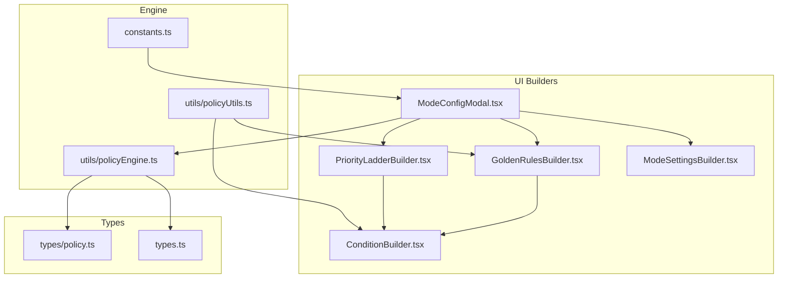
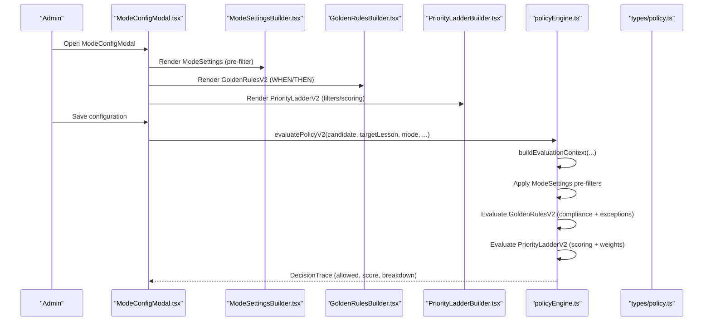
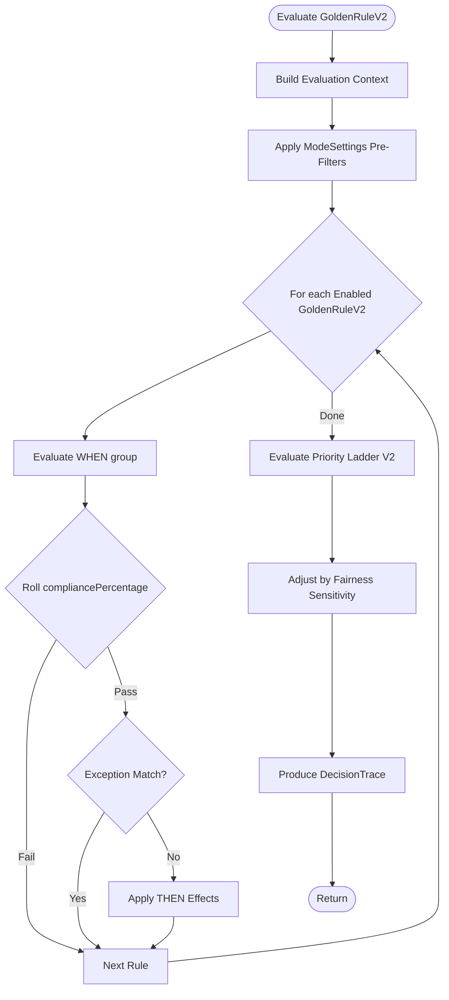
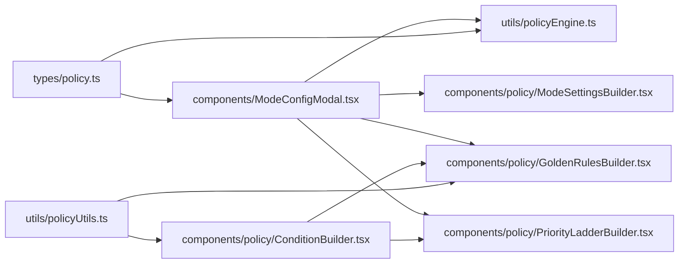
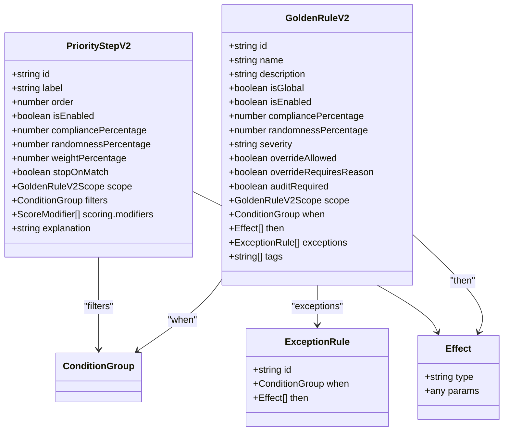

# Policy Rules and Golden Rules

<cite>
**Referenced Files in This Document**
- [ModeConfigModal.tsx](file://components/ModeConfigModal.tsx)
- [GoldenRulesBuilder.tsx](file://components/policy/GoldenRulesBuilder.tsx)
- [ConditionBuilder.tsx](file://components/policy/ConditionBuilder.tsx)
- [PriorityLadderBuilder.tsx](file://components/policy/PriorityLadderBuilder.tsx)
- [ModeSettingsBuilder.tsx](file://components/policy/ModeSettingsBuilder.tsx)
- [policyEngine.ts](file://utils/policyEngine.ts)
- [policy.ts](file://types/policy.ts)
- [policyUtils.ts](file://utils/policyUtils.ts)
- [constants.ts](file://constants.ts)
- [types.ts](file://types.ts)
</cite>

## Table of Contents
1. [Introduction](#introduction)
2. [Project Structure](#project-structure)
3. [Core Components](#core-components)
4. [Architecture Overview](#architecture-overview)
5. [Detailed Component Analysis](#detailed-component-analysis)
6. [Dependency Analysis](#dependency-analysis)
7. [Performance Considerations](#performance-considerations)
8. [Troubleshooting Guide](#troubleshooting-guide)
9. [Conclusion](#conclusion)
10. [Appendices](#appendices)

## Introduction
This document explains how policy rules and golden rules are configured and evaluated in the system. It focuses on the ModeConfig modal, the GoldenRulesBuilder UI, the V2 rule engine, and how rules influence substitution decisions. It also documents the relationship between the GoldenRule interface and the evaluation logic in policyEngine.ts, and provides practical examples drawn from INITIAL_ENGINE_CONTEXT for rainyMode, examMode, tripMode, and emergencyMode.

## Project Structure
The policy configuration experience is centered around a modal that lets administrators switch between policy engines (V1 legacy and V2 advanced), configure ModeSettings, define GoldenRules (V2), and tune the Priority Ladder. The evaluation engine computes a decision trace based on context, settings, golden rules, and ladder steps.

**Diagram sources**
- [ModeConfigModal.tsx](file://components/ModeConfigModal.tsx#L1-L350)
- [GoldenRulesBuilder.tsx](file://components/policy/GoldenRulesBuilder.tsx#L1-L180)
- [PriorityLadderBuilder.tsx](file://components/policy/PriorityLadderBuilder.tsx#L1-L147)
- [ModeSettingsBuilder.tsx](file://components/policy/ModeSettingsBuilder.tsx#L1-L226)
- [ConditionBuilder.tsx](file://components/policy/ConditionBuilder.tsx#L1-L143)
- [policyEngine.ts](file://utils/policyEngine.ts#L1-L406)
- [policy.ts](file://types/policy.ts#L1-L162)
- [policyUtils.ts](file://utils/policyUtils.ts#L1-L117)
- [constants.ts](file://constants.ts#L1-L438)
- [types.ts](file://types.ts#L1-L382)

**Section sources**
- [ModeConfigModal.tsx](file://components/ModeConfigModal.tsx#L1-L350)
- [policyEngine.ts](file://utils/policyEngine.ts#L1-L406)
- [policy.ts](file://types/policy.ts#L1-L162)
- [policyUtils.ts](file://utils/policyUtils.ts#L1-L117)
- [constants.ts](file://constants.ts#L1-L438)
- [types.ts](file://types.ts#L1-L382)

## Core Components
- ModeConfigModal: Hosts the policy configuration UI, toggles between V1 and V2 engines, manages ModeSettings, GoldenRulesV2, and PriorityLadderV2, and validates/saves configurations.
- GoldenRulesBuilder: Manages the GoldenRuleV2 list, enforces mandatory rules, and edits rule attributes including WHEN conditions and THEN effects.
- PriorityLadderBuilder: Manages PriorityStepV2 entries with filters, weights, and scoring modifiers.
- ModeSettingsBuilder: Configures ModeSettings domains (teacher, lesson, time, class, subject, HR, UI) that act as pre-filters before rule evaluation.
- ConditionBuilder: Provides a visual editor for nested ConditionGroup trees with AND/OR/NAND logic.
- policyEngine.ts: Evaluates ModeSettings, GoldenRulesV2, and PriorityLadderV2 to produce a DecisionTrace with allowed flag, score, and breakdown.
- policy.ts: Defines GoldenRuleV2, PriorityStepV2, Effect, ExceptionRule, Condition, ConditionGroup, and ModeSettings interfaces.
- policyUtils.ts: Supplies component options, subject options, empty builders, and mandatory GoldenRuleV2 definitions.
- constants.ts: Contains INITIAL_ENGINE_CONTEXT with example configurations for rainyMode, examMode, tripMode, emergencyMode, and others.

**Section sources**
- [ModeConfigModal.tsx](file://components/ModeConfigModal.tsx#L1-L350)
- [GoldenRulesBuilder.tsx](file://components/policy/GoldenRulesBuilder.tsx#L1-L180)
- [PriorityLadderBuilder.tsx](file://components/policy/PriorityLadderBuilder.tsx#L1-L147)
- [ModeSettingsBuilder.tsx](file://components/policy/ModeSettingsBuilder.tsx#L1-L226)
- [ConditionBuilder.tsx](file://components/policy/ConditionBuilder.tsx#L1-L143)
- [policyEngine.ts](file://utils/policyEngine.ts#L1-L406)
- [policy.ts](file://types/policy.ts#L1-L162)
- [policyUtils.ts](file://utils/policyUtils.ts#L1-L117)
- [constants.ts](file://constants.ts#L1-L438)

## Architecture Overview
The policy configuration flow integrates UI builders with the evaluation engine. ModeSettings acts as a pre-filter; GoldenRulesV2 apply conditional actions; PriorityLadderV2 adds weighted scoring; and the engine produces a DecisionTrace.

**Diagram sources**
- [ModeConfigModal.tsx](file://components/ModeConfigModal.tsx#L1-L350)
- [ModeSettingsBuilder.tsx](file://components/policy/ModeSettingsBuilder.tsx#L1-L226)
- [GoldenRulesBuilder.tsx](file://components/policy/GoldenRulesBuilder.tsx#L1-L180)
- [PriorityLadderBuilder.tsx](file://components/policy/PriorityLadderBuilder.tsx#L1-L147)
- [policyEngine.ts](file://utils/policyEngine.ts#L1-L406)
- [policy.ts](file://types/policy.ts#L1-L162)

## Detailed Component Analysis

### Golden Rules (GoldenRuleV2) and Policy Rules
- GoldenRuleV2 structure:
  - Identification: id, name, description
  - Lifecycle: isGlobal, isEnabled, compliancePercentage, randomnessPercentage
  - Severity and governance: severity, overrideAllowed, overrideRequiresReason, auditRequired
  - Scope: targetScope, grades/classIds/days/periods
  - Logic: when (ConditionGroup), then (Effect[]), exceptions (ExceptionRule[])
  - Tags and metadata: optional tags
- Policy rules (PolicyRule) are lightweight descriptors in the legacy model; V2 focuses on GoldenRuleV2 and PriorityLadderV2.

Key relationships:
- GoldenRuleV2.when evaluates to boolean against the built context.
- Compliance percentage determines whether a rule’s THEN effects are enforced.
- Exceptions allow bypassing otherwise applicable rules.

**Section sources**
- [policy.ts](file://types/policy.ts#L1-L162)
- [GoldenRulesBuilder.tsx](file://components/policy/GoldenRulesBuilder.tsx#L1-L180)
- [policyUtils.ts](file://utils/policyUtils.ts#L1-L117)

### GoldenRule Interface and Evaluation in policyEngine.ts
- Evaluation pipeline:
  - Build context from candidate, target lesson, schedule, and logs.
  - Apply ModeSettings pre-filters (e.g., off-duty, immunity, coverage limits).
  - Iterate GoldenRulesV2:
    - If when(group) matches, roll compliancePercentage to decide enforcement.
    - If not overridden by exceptions, apply THEN effects (e.g., BLOCK_ASSIGNMENT, BOOST_SCORE, PENALIZE_SCORE).
  - Apply PriorityLadderV2 scoring with filters, modifiers, and weights.
  - Adjust for fairness sensitivity.
  - Produce DecisionTrace with allowed flag, score, matched/skipped steps, and breakdown.

**Diagram sources**
- [policyEngine.ts](file://utils/policyEngine.ts#L1-L406)

**Section sources**
- [policyEngine.ts](file://utils/policyEngine.ts#L1-L406)

### V1 vs V2 Rule Builder Interfaces
- V1 (legacy):
  - GoldenRule with label, isActive, compliancePercentage, enforcementLevel, description, action, conditions.
  - ModeConfig includes goldenRules and policyRules arrays.
  - ModeConfigModal maintains legacy helpers for adding/updating/deleting V1 rules.
- V2 (advanced):
  - GoldenRuleV2 with structured WHEN/THEN/exceptions and ModeSettings pre-filtering.
  - PriorityStepV2 with filters, scoring modifiers, and weights.
  - ModeConfigModal toggles policyVersion and renders V2 UI tabs.

**Section sources**
- [types.ts](file://types.ts#L126-L216)
- [ModeConfigModal.tsx](file://components/ModeConfigModal.tsx#L1-L350)
- [policy.ts](file://types/policy.ts#L1-L162)

### GoldenRulesBuilder.tsx
- Ensures mandatory GoldenRuleV2 entries are present.
- Adds, updates, deletes rules.
- Edits rule metadata (name, description, isEnabled, severity), compliance/randomness percentages, scope, WHEN conditions, and THEN effects.
- Disables editing of mandatory rules.

**Section sources**
- [GoldenRulesBuilder.tsx](file://components/policy/GoldenRulesBuilder.tsx#L1-L180)
- [policyUtils.ts](file://utils/policyUtils.ts#L1-L117)

### PriorityLadderBuilder.tsx
- Manages PriorityStepV2 entries with:
  - Label, order, isEnabled, compliancePercentage, randomnessPercentage, weightPercentage, stopOnMatch
  - filters (ConditionGroup), scoring (baseScore, modifiers)
  - Explanation and preview
- Supports moving steps up/down and editing step properties.

**Section sources**
- [PriorityLadderBuilder.tsx](file://components/policy/PriorityLadderBuilder.tsx#L1-L147)
- [policy.ts](file://types/policy.ts#L65-L81)

### ModeSettingsBuilder.tsx
- ModeSettings domains:
  - teacher: disableExternal, treatNoLessonsAsOffDuty, forceHomeroomPresence
  - lesson: disableStay, disableIndividual, disableShared, forceActualOnly
  - time: ignoreGapsAtStart, ignoreGapsAtEnd, maxConsecutivePeriods
  - class: allowMerge, maxMergedCount, priorityGrades, allowSplitStrategy
  - subject: governingSubject, prioritizeGoverningSubject, enableCrossCompetency
  - hr: maxDailyCoverage, maxWeeklyCoverage, fairnessSensitivity, immunityCooldownHours
  - ui: hideForbiddenCandidates, requireJustification, lockManualOverride
- These settings act as pre-filters before rule evaluation.

**Section sources**
- [ModeSettingsBuilder.tsx](file://components/policy/ModeSettingsBuilder.tsx#L1-L226)
- [policy.ts](file://types/policy.ts#L83-L139)

### ConditionBuilder.tsx
- Visual editor for ConditionGroup with:
  - Logic operators: AND/OR/NAND
  - Nested groups
  - Five condition fields: teacherType, lessonType, subject, timeContext, relationship
- Supplies component options and subject options.

**Section sources**
- [ConditionBuilder.tsx](file://components/policy/ConditionBuilder.tsx#L1-L143)
- [policyUtils.ts](file://utils/policyUtils.ts#L1-L117)
- [policy.ts](file://types/policy.ts#L1-L23)

### Examples from INITIAL_ENGINE_CONTEXT
Examples below illustrate how rules are defined for specific modes. These examples show the structure and intent of golden rules and priority ladder adjustments.

- rainyMode
  - Purpose: Manage reduced enrollment and equity.
  - Example rules:
    - Require merged classes count when enrollment is low.
    - Daily equity rule preventing excessive load on a single teacher in a day.
  - Priority ladder emphasizes merging under rainy conditions.

- examMode
  - Purpose: Proctoring stability and subject expertise.
  - Example rules:
    - Require exam subject specification.
    - Educator-first proctoring priority.
    - Swap rule for conflicting schedules.
    - Individual lesson assistance rule.
    - Block external staff for proctoring.
  - Priority ladder prioritizes educators and same-subject teachers.

- tripMode
  - Purpose: Field trip supervision and equity.
  - Example rules:
    - Educator accompanies the class.
    - Companion selection based on class ties.
    - Released slots rule for trips.
    - Equity across trips.
    - Exemption from seventh period for companions.
  - Priority ladder includes released slots and companion selection.

- emergencyMode
  - Purpose: Operational survival with relaxed constraints.
  - Example rules:
    - Relaxed stay protection.
    - Survival rule for maximum coverage.
    - Mandatory documentation rule.
  - Policy version elevated to reflect urgency.

These examples are derived from INITIAL_ENGINE_CONTEXT and demonstrate how golden rules and priority ladder entries align with operational goals.

**Section sources**
- [constants.ts](file://constants.ts#L109-L426)

## Dependency Analysis
- UI depends on types for rule and ladder structures.
- GoldenRulesBuilder and PriorityLadderBuilder depend on ConditionBuilder and policyUtils for building conditions and enforcing mandatory rules.
- ModeConfigModal orchestrates V1/V2 toggling and delegates to builders; it also injects legacy stay rule when missing.
- policyEngine.ts consumes ModeSettings, GoldenRulesV2, and PriorityLadderV2 to compute decisions.

**Diagram sources**
- [policy.ts](file://types/policy.ts#L1-L162)
- [policyEngine.ts](file://utils/policyEngine.ts#L1-L406)
- [ModeConfigModal.tsx](file://components/ModeConfigModal.tsx#L1-L350)
- [GoldenRulesBuilder.tsx](file://components/policy/GoldenRulesBuilder.tsx#L1-L180)
- [PriorityLadderBuilder.tsx](file://components/policy/PriorityLadderBuilder.tsx#L1-L147)
- [ConditionBuilder.tsx](file://components/policy/ConditionBuilder.tsx#L1-L143)
- [policyUtils.ts](file://utils/policyUtils.ts#L1-L117)

**Section sources**
- [policy.ts](file://types/policy.ts#L1-L162)
- [policyEngine.ts](file://utils/policyEngine.ts#L1-L406)
- [ModeConfigModal.tsx](file://components/ModeConfigModal.tsx#L1-L350)
- [GoldenRulesBuilder.tsx](file://components/policy/GoldenRulesBuilder.tsx#L1-L180)
- [PriorityLadderBuilder.tsx](file://components/policy/PriorityLadderBuilder.tsx#L1-L147)
- [ConditionBuilder.tsx](file://components/policy/ConditionBuilder.tsx#L1-L143)
- [policyUtils.ts](file://utils/policyUtils.ts#L1-L117)

## Performance Considerations
- Rule evaluation complexity grows with the number of GoldenRulesV2 and PriorityStepV2 entries. Keep rule sets concise and scoped.
- Use ModeSettings pre-filters to reduce the search space before evaluating rules.
- Compose conditions efficiently; avoid overly deep nesting in ConditionGroup.
- RandomnessPercentage introduces stochasticity; consider its impact on repeatability and testing.

[No sources needed since this section provides general guidance]

## Troubleshooting Guide
Common issues and resolutions:

- Rule conflicts
  - Symptom: Multiple rules with contradictory THEN effects.
  - Resolution: Use exceptions to selectively bypass rules in specific contexts; adjust compliancePercentage to limit enforcement; re-order PriorityLadderV2 steps to ensure desired precedence.

- Enforcement levels and compliance
  - Symptom: Rules appear ignored or inconsistently enforced.
  - Resolution: Verify compliancePercentage and randomnessPercentage; confirm isEnabled flag; ensure WHEN conditions match the evaluation context.

- Condition evaluation mismatches
  - Symptom: Rules trigger unexpectedly or not at all.
  - Resolution: Inspect ConditionBuilder selections (teacherType, lessonType, subject, timeContext, relationship); verify operator logic (AND/OR/NAND); simplify conditions incrementally.

- Scope targeting
  - Symptom: Rules apply globally when scoped to specific grades/classes.
  - Resolution: Configure scope.targetScope and associated filters (grades, classIds, days, periods) in GoldenRuleV2.

- ModeSettings pre-filtering
  - Symptom: Candidates are blocked before rule evaluation.
  - Resolution: Review ModeSettings (e.g., disableExternal, treatNoLessonsAsOffDuty, maxDailyCoverage) to ensure they align with intended behavior.

- Emergency and survival modes
  - Symptom: Overly relaxed constraints causing unintended outcomes.
  - Resolution: Use auditRequired and documentation fields; carefully set compliancePercentage for survival rules; monitor fairness adjustments.

**Section sources**
- [policyEngine.ts](file://utils/policyEngine.ts#L1-L406)
- [GoldenRulesBuilder.tsx](file://components/policy/GoldenRulesBuilder.tsx#L1-L180)
- [ModeSettingsBuilder.tsx](file://components/policy/ModeSettingsBuilder.tsx#L1-L226)
- [ConditionBuilder.tsx](file://components/policy/ConditionBuilder.tsx#L1-L143)

## Conclusion
The V2 policy system provides a robust, configurable framework for substitution decisions. ModeSettings act as pre-filters, GoldenRulesV2 define conditional policies with exceptions, and PriorityLadderV2 adds weighted scoring. The evaluation engine produces a transparent DecisionTrace, enabling administrators to understand and refine policy behavior. Examples from INITIAL_ENGINE_CONTEXT illustrate how rules and ladder entries support operational goals across rainy, exam, trip, and emergency scenarios.

[No sources needed since this section summarizes without analyzing specific files]

## Appendices

### GoldenRuleV2 and PriorityStepV2 Data Model

**Diagram sources**
- [policy.ts](file://types/policy.ts#L1-L162)

### Example Rule Conditions and Their Impact
- Example: Prevent stay-based coverage except for same-day stay swaps.
  - WHEN: lessonType equals stay; timeContext equals same_day_stay.
  - THEN: BLOCK_ASSIGNMENT.
  - Impact: Prevents stay usage for coverage except same-day stay.

- Example: Educator-first proctoring during exams.
  - WHEN: relationship equals same_homeroom; slot state equals actual.
  - THEN: BOOST_SCORE with positive value.
  - Impact: Increases likelihood of selecting the homeroom teacher.

- Example: Block external staff for exam proctoring.
  - WHEN: teacherType equals external.
  - THEN: BLOCK_ASSIGNMENT.
  - Impact: Ensures internal staff for proctoring.

- Example: Companion selection for field trips.
  - WHEN: relationship equals same_grade; slot state equals free.
  - THEN: BOOST_SCORE with moderate value.
  - Impact: Encourages selecting companions tied to the class.

**Section sources**
- [constants.ts](file://constants.ts#L109-L426)
- [policyEngine.ts](file://utils/policyEngine.ts#L1-L406)