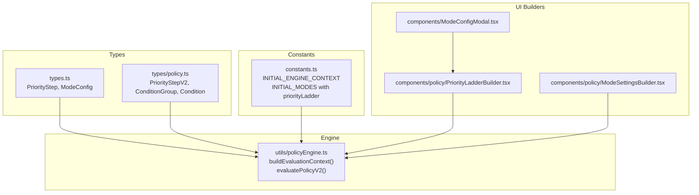
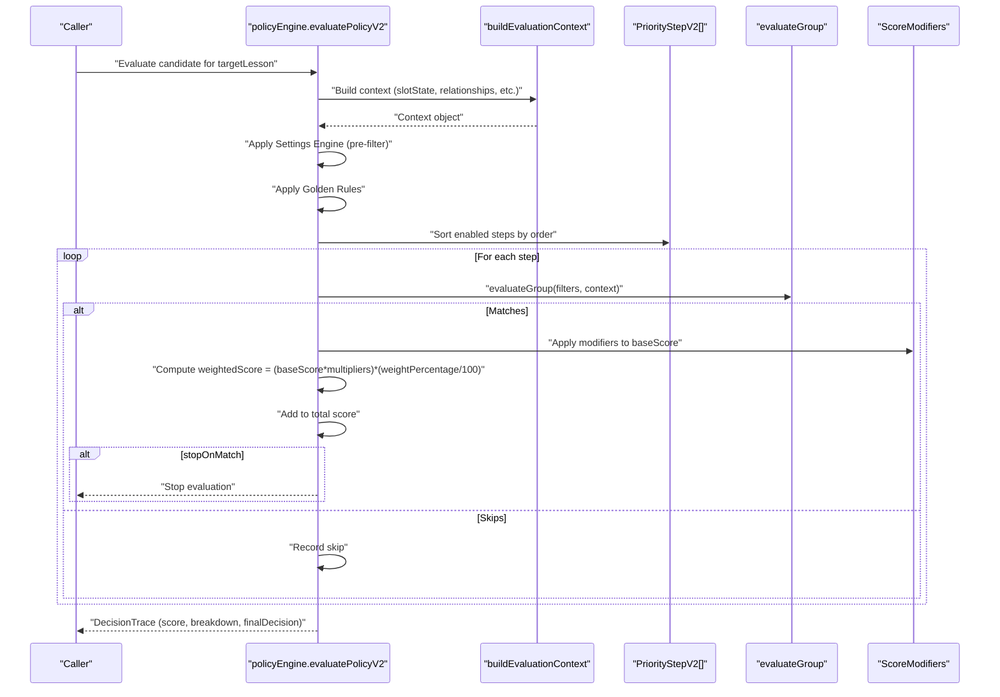
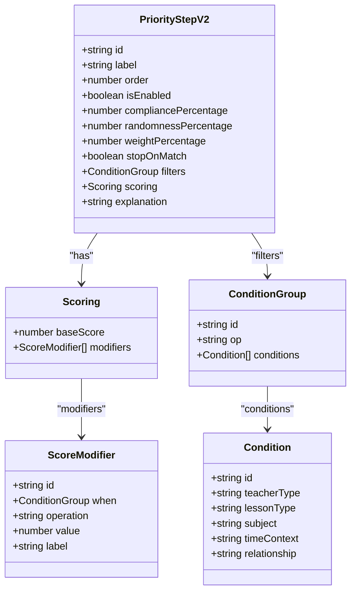
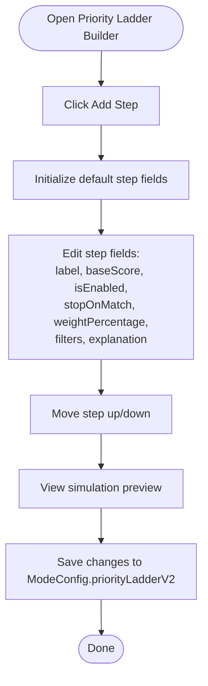
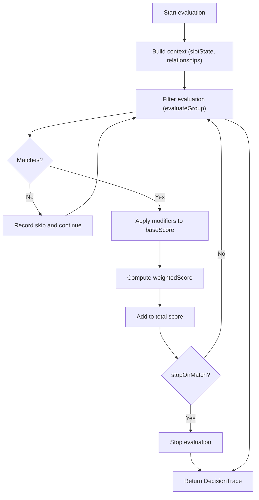
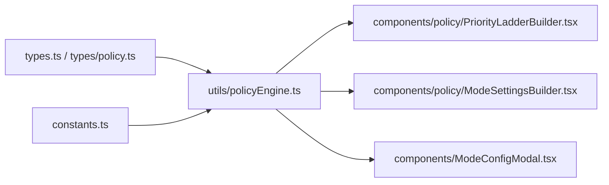

# Priority Ladder Configuration

<cite>
**Referenced Files in This Document**
- [constants.ts](file://constants.ts)
- [types.ts](file://types.ts)
- [types/policy.ts](file://types/policy.ts)
- [utils/policyEngine.ts](file://utils/policyEngine.ts)
- [components/policy/PriorityLadderBuilder.tsx](file://components/policy/PriorityLadderBuilder.tsx)
- [components/policy/ModeSettingsBuilder.tsx](file://components/policy/ModeSettingsBuilder.tsx)
- [utils/policyUtils.ts](file://utils/policyUtils.ts)
- [components/ModeConfigModal.tsx](file://components/ModeConfigModal.tsx)
</cite>

## Table of Contents
1. [Introduction](#introduction)
2. [Project Structure](#project-structure)
3. [Core Components](#core-components)
4. [Architecture Overview](#architecture-overview)
5. [Detailed Component Analysis](#detailed-component-analysis)
6. [Dependency Analysis](#dependency-analysis)
7. [Performance Considerations](#performance-considerations)
8. [Troubleshooting Guide](#troubleshooting-guide)
9. [Conclusion](#conclusion)
10. [Appendices](#appendices)

## Introduction
This document explains the priority ladder configuration in ModeConfig, focusing on the PriorityStepV2 model and how it influences substitution candidate selection in the policy engine. It covers the PriorityStepV2 fields (including label, order, isEnabled, compliancePercentage, randomnessPercentage, weightPercentage, stopOnMatch, filters, scoring, explanation), the relationship between PriorityStepV2 and the legacy PriorityStep, and how the policy engine evaluates priority steps during decision-making. It also provides practical examples from the INITIAL_ENGINE_CONTEXT for rainyMode, examMode, and holidayMode, along with guidance on configuring effective priority sequences and avoiding common pitfalls.

## Project Structure
The priority ladder spans several layers:
- Types define the PriorityStepV2 model and related policy structures.
- Constants provide example configurations for different modes.
- The policy engine builds context and evaluates priority steps.
- UI builders allow editing and previewing priority steps.

**Diagram sources**
- [types.ts](file://types.ts#L150-L216)
- [types/policy.ts](file://types/policy.ts#L65-L81)
- [constants.ts](file://constants.ts#L109-L426)
- [utils/policyEngine.ts](file://utils/policyEngine.ts#L1-L406)
- [components/policy/PriorityLadderBuilder.tsx](file://components/policy/PriorityLadderBuilder.tsx#L1-L147)
- [components/policy/ModeSettingsBuilder.tsx](file://components/policy/ModeSettingsBuilder.tsx#L1-L226)
- [components/ModeConfigModal.tsx](file://components/ModeConfigModal.tsx#L24-L251)

**Section sources**
- [types.ts](file://types.ts#L150-L216)
- [types/policy.ts](file://types/policy.ts#L65-L81)
- [constants.ts](file://constants.ts#L109-L426)
- [utils/policyEngine.ts](file://utils/policyEngine.ts#L1-L406)
- [components/policy/PriorityLadderBuilder.tsx](file://components/policy/PriorityLadderBuilder.tsx#L1-L147)
- [components/policy/ModeSettingsBuilder.tsx](file://components/policy/ModeSettingsBuilder.tsx#L1-L226)
- [components/ModeConfigModal.tsx](file://components/ModeConfigModal.tsx#L24-L251)

## Core Components
- PriorityStepV2: The modern priority step model used by the V2 engine. It includes:
  - Identification: id, label, order
  - Control flags: isEnabled, stopOnMatch
  - Compliance: compliancePercentage, randomnessPercentage
  - Weighting: weightPercentage
  - Scope and filtering: scope (optional), filters (ConditionGroup)
  - Scoring: scoring.baseScore and scoring.modifiers (ScoreModifier[])
  - Explanation: explanation
- ConditionGroup and Condition: Used to define filters that must match for a step to apply. Conditions include teacherType, lessonType, subject, timeContext, and relationship.
- ModeConfig: Contains priorityLadderV2 (PriorityStepV2[]) alongside other mode settings.

Key differences from legacy PriorityStep:
- Legacy PriorityStep had probabilityBias and a simpler criteria object.
- PriorityStepV2 introduces a richer filters system (ConditionGroup) and a scoring system with modifiers.

How the engine uses PriorityStepV2:
- The engine builds a context (including slotState, teacher type, relationships) and then iterates through enabled steps sorted by order.
- For each matching step, it computes a base score, applies modifiers, multiplies by weightPercentage, and adds to the total score.
- If stopOnMatch is true, the engine stops evaluating subsequent steps after the first match.

**Section sources**
- [types.ts](file://types.ts#L150-L216)
- [types/policy.ts](file://types/policy.ts#L65-L81)
- [utils/policyEngine.ts](file://utils/policyEngine.ts#L255-L406)

## Architecture Overview
The priority ladder evaluation pipeline:

**Diagram sources**
- [utils/policyEngine.ts](file://utils/policyEngine.ts#L255-L406)
- [types/policy.ts](file://types/policy.ts#L65-L81)

## Detailed Component Analysis

### PriorityStepV2 Model and Fields
- id, label, order: Unique identifier, display label, and evaluation order.
- isEnabled: Enables/disables the step.
- compliancePercentage, randomnessPercentage: Influence rule application and variability in the broader system.
- weightPercentage: Determines how much a matched step contributes to the final score.
- stopOnMatch: If true, evaluation halts after the first match.
- filters: ConditionGroup defining when a step applies.
- scoring: baseScore plus modifiers (ADD, SUBTRACT, MULTIPLY, SET_TO).
- explanation: Human-readable rationale.

**Diagram sources**
- [types/policy.ts](file://types/policy.ts#L65-L81)
- [types/policy.ts](file://types/policy.ts#L56-L64)
- [types/policy.ts](file://types/policy.ts#L1-L18)

**Section sources**
- [types/policy.ts](file://types/policy.ts#L65-L81)

### Priority Ladder Builder UI
The builder allows:
- Adding new steps with default values (isEnabled true, weightPercentage 50, stopOnMatch false).
- Reordering steps up/down.
- Editing label, baseScore, isEnabled, stopOnMatch, weightPercentage, filters, and explanation.
- Previewing expected score impact.

**Diagram sources**
- [components/policy/PriorityLadderBuilder.tsx](file://components/policy/PriorityLadderBuilder.tsx#L1-L147)

**Section sources**
- [components/policy/PriorityLadderBuilder.tsx](file://components/policy/PriorityLadderBuilder.tsx#L1-L147)

### Examples from INITIAL_ENGINE_CONTEXT
Examples demonstrate how different modes configure priority sequences:

- rainyMode:
  - First step prioritizes merging classes for same-grade relationships.
  - Subsequent steps follow the default ladder.
  - This emphasizes consolidation under reduced capacity.

- examMode:
  - First step prioritizes the homeroom educator for their class.
  - Second step prioritizes the subject specialist who is present.
  - External staff are blocked by golden rules in this mode.

- holidayMode:
  - First step prioritizes released internal staff whose slots were canceled due to student absence.
  - This leverages available internal resources efficiently.

These examples illustrate how the order and criteria of steps reflect operational priorities for each scenario.

**Section sources**
- [constants.ts](file://constants.ts#L109-L426)

### How the Engine Evaluates Priority Steps
- Context building:
  - slotState is derived from whether a lesson exists for the candidate at the target time.
  - Relationships include sameSubject, sameDomain, continuityMatch, isPrimaryTeacherForClass, etc.
- Evaluation:
  - Enabled steps are sorted by order.
  - For each step, filters are evaluated using evaluateGroup and evaluateCondition.
  - If matched:
    - Apply modifiers to baseScore (ADD/SUBTRACT/MULTIPLY/SET_TO).
    - Compute weightedScore = (baseScore * multipliers) * (weightPercentage / 100).
    - Add to total score.
    - If stopOnMatch, halt iteration.
  - If not matched, record skip.

**Diagram sources**
- [utils/policyEngine.ts](file://utils/policyEngine.ts#L255-L406)
- [types/policy.ts](file://types/policy.ts#L65-L81)

**Section sources**
- [utils/policyEngine.ts](file://utils/policyEngine.ts#L255-L406)

### Relationship Between PriorityStepV2 and Legacy PriorityStep
- Legacy PriorityStep (used in older policy versions) included probabilityBias and a simpler criteria object.
- PriorityStepV2 replaces these with:
  - A flexible filters system (ConditionGroup) for precise matching.
  - A scoring system with modifiers for nuanced adjustments.
  - Explicit stopOnMatch behavior.
- ModeConfig supports both priorityLadder (legacy) and priorityLadderV2 (modern).

**Section sources**
- [types.ts](file://types.ts#L150-L216)
- [components/ModeConfigModal.tsx](file://components/ModeConfigModal.tsx#L24-L251)

## Dependency Analysis
- Types drive the structure of PriorityStepV2, ConditionGroup, and Condition.
- Constants provide example configurations for modes, including priorityLadder entries.
- The policy engine depends on these types and constants to evaluate decisions.
- UI builders depend on types and constants to render and edit configurations.

**Diagram sources**
- [types.ts](file://types.ts#L150-L216)
- [types/policy.ts](file://types/policy.ts#L65-L81)
- [constants.ts](file://constants.ts#L109-L426)
- [utils/policyEngine.ts](file://utils/policyEngine.ts#L1-L406)
- [components/policy/PriorityLadderBuilder.tsx](file://components/policy/PriorityLadderBuilder.tsx#L1-L147)
- [components/policy/ModeSettingsBuilder.tsx](file://components/policy/ModeSettingsBuilder.tsx#L1-L226)
- [components/ModeConfigModal.tsx](file://components/ModeConfigModal.tsx#L24-L251)

**Section sources**
- [types.ts](file://types.ts#L150-L216)
- [types/policy.ts](file://types/policy.ts#L65-L81)
- [constants.ts](file://constants.ts#L109-L426)
- [utils/policyEngine.ts](file://utils/policyEngine.ts#L1-L406)
- [components/policy/PriorityLadderBuilder.tsx](file://components/policy/PriorityLadderBuilder.tsx#L1-L147)
- [components/policy/ModeSettingsBuilder.tsx](file://components/policy/ModeSettingsBuilder.tsx#L1-L226)
- [components/ModeConfigModal.tsx](file://components/ModeConfigModal.tsx#L24-L251)

## Performance Considerations
- Keep the number of enabled steps reasonable to minimize evaluation loops.
- Use stopOnMatch strategically to avoid unnecessary computations when earlier steps are sufficient.
- Prefer broad filters that quickly eliminate candidates to reduce modifier evaluations.
- Use weightPercentage to balance the influence of each step without requiring excessive modifier complexity.

[No sources needed since this section provides general guidance]

## Troubleshooting Guide
Common issues and resolutions:
- Conflicting priorities:
  - Symptom: Steps with identical or overlapping filters cause unpredictable outcomes.
  - Resolution: Ensure filters are mutually exclusive or ordered so that higher-priority steps supersede lower ones.
- Overly restrictive criteria:
  - Symptom: Very low coverage because no candidates match filters.
  - Resolution: Relax filters (use "any" where appropriate) or adjust order to allow fallback steps.
- Misordered steps:
  - Symptom: Lower-weight steps dominate despite being less preferred.
  - Resolution: Increase weightPercentage for preferred steps or reorder steps to place higher-priority steps earlier.
- Excessive modifier complexity:
  - Symptom: Difficult-to-trace scoring and unexpected results.
  - Resolution: Simplify modifiers and rely on baseScore and weightPercentage for primary weighting.
- Stop-on-match misuse:
  - Symptom: Later steps never trigger.
  - Resolution: Use stopOnMatch only when a single step should definitively decide.

**Section sources**
- [utils/policyEngine.ts](file://utils/policyEngine.ts#L368-L395)
- [components/policy/PriorityLadderBuilder.tsx](file://components/policy/PriorityLadderBuilder.tsx#L1-L147)

## Conclusion
The PriorityStepV2 model provides a powerful, flexible mechanism for configuring substitution priorities. By combining precise filters, scoring modifiers, and explicit weighting, administrators can tailor decision-making to specific operational scenarios. The examples from INITIAL_ENGINE_CONTEXT demonstrate how modes like rainyMode, examMode, and holidayMode prioritize different factors. Effective configuration requires balancing specificity, order, and weights while avoiding conflicts and overly restrictive criteria.

[No sources needed since this section summarizes without analyzing specific files]

## Appendices

### Appendix A: Field Reference for PriorityStepV2
- id: Unique identifier for the step.
- label: Display label shown in UI.
- order: Evaluation order; lower numbers are processed first.
- isEnabled: Enable/disable the step.
- compliancePercentage: Percentage of time the step is enforced.
- randomnessPercentage: Controls variability in step application.
- weightPercentage: Weight factor for the step’s contribution to the final score.
- stopOnMatch: If true, evaluation stops after the first match.
- filters: ConditionGroup defining when the step applies.
- scoring.baseScore: Base score for the step.
- scoring.modifiers: ScoreModifier[] with operations ADD, SUBTRACT, MULTIPLY, SET_TO.
- explanation: Human-readable description of the step’s purpose.

**Section sources**
- [types/policy.ts](file://types/policy.ts#L65-L81)

### Appendix B: Example Configurations from INITIAL_ENGINE_CONTEXT
- rainyMode:
  - First step: Merge classes for same-grade relationships.
  - Subsequent steps: Default ladder continues.
- examMode:
  - First step: Homeroom educator for their class.
  - Second step: Subject specialist who is present.
  - External staff blocked by golden rules.
- holidayMode:
  - First step: Released internal staff whose slots were canceled due to student absence.

**Section sources**
- [constants.ts](file://constants.ts#L109-L426)

### Appendix C: How Criteria Are Evaluated
- teacherType: internal, external, any.
- lessonType: actual, individual, stay, shared, any.
- subject: specific subject or any.
- timeContext: during_school, same_day_stay, before_end, after_end, emergency, any.
- relationship: same_class, same_grade, same_homeroom, is_homeroom, same_subject, same_domain, continuity_match, any.

**Section sources**
- [utils/policyEngine.ts](file://utils/policyEngine.ts#L205-L241)
- [utils/policyUtils.ts](file://utils/policyUtils.ts#L1-L117)