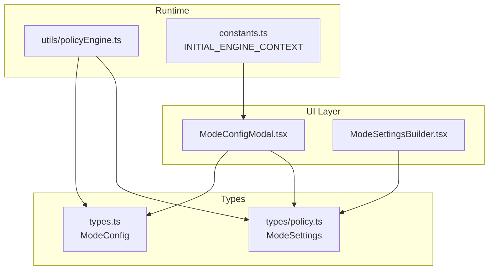
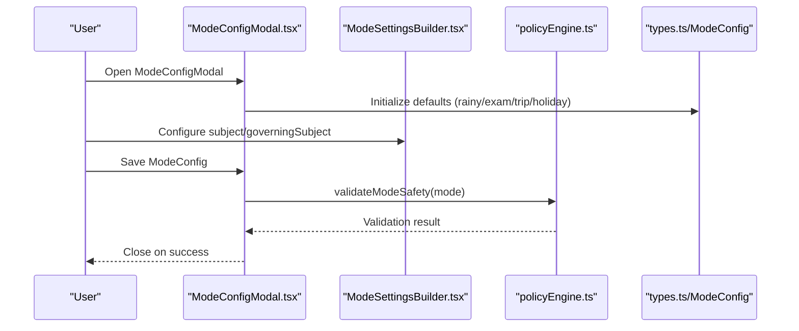
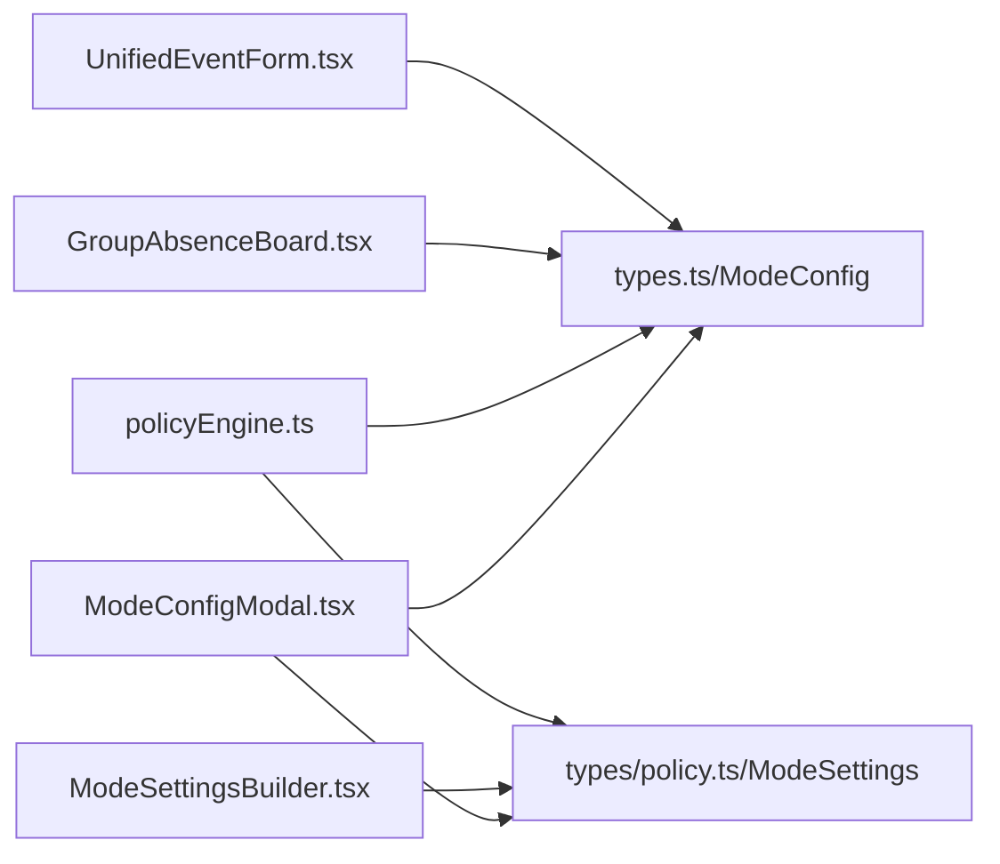

# Specialized Mode Configurations

<cite>
**Referenced Files in This Document**
- [ModeConfigModal.tsx](file://components/ModeConfigModal.tsx)
- [ModeSettingsBuilder.tsx](file://components/policy/ModeSettingsBuilder.tsx)
- [policy.ts](file://types/policy.ts)
- [types.ts](file://types.ts)
- [constants.ts](file://constants.ts)
- [policyEngine.ts](file://utils/policyEngine.ts)
- [GroupAbsenceBoard.tsx](file://components/GroupAbsenceBoard.tsx)
- [UnifiedEventForm.tsx](file://components/UnifiedEventForm.tsx)
- [CalendarRequestForm.tsx](file://components/CalendarRequestForm.tsx)
</cite>

## Table of Contents
1. [Introduction](#introduction)
2. [Project Structure](#project-structure)
3. [Core Components](#core-components)
4. [Architecture Overview](#architecture-overview)
5. [Detailed Component Analysis](#detailed-component-analysis)
6. [Dependency Analysis](#dependency-analysis)
7. [Performance Considerations](#performance-considerations)
8. [Troubleshooting Guide](#troubleshooting-guide)
9. [Conclusion](#conclusion)
10. [Appendices](#appendices)

## Introduction
This document explains the specialized mode configuration fields embedded in ModeConfig for rainy, exam, trip, and holiday modes. It covers how these fields are defined in the codebase, how they are surfaced in the UI, and how they influence operational decisions during real-world scenarios. It also provides best practices and common use cases for each mode type.

## Project Structure
The specialized mode configuration is part of the ModeConfig type and is edited via the ModeConfigModal UI. The modal initializes default values for rainy, exam, trip, and holiday fields and exposes them to users. The policy engine reads these fields to enforce scenario-specific logic.

**Diagram sources**
- [ModeConfigModal.tsx](file://components/ModeConfigModal.tsx#L61-L89)
- [ModeSettingsBuilder.tsx](file://components/policy/ModeSettingsBuilder.tsx#L2-L32)
- [types.ts](file://types.ts#L169-L217)
- [policy.ts](file://types/policy.ts#L83-L139)
- [policyEngine.ts](file://utils/policyEngine.ts#L24-L44)
- [constants.ts](file://constants.ts#L109-L168)

**Section sources**
- [ModeConfigModal.tsx](file://components/ModeConfigModal.tsx#L61-L89)
- [types.ts](file://types.ts#L169-L217)
- [policy.ts](file://types/policy.ts#L83-L139)
- [constants.ts](file://constants.ts#L109-L168)

## Core Components
- ModeConfig type defines the specialized fields for each mode:
  - rainy: mergedClassesCount, teacherMultiGradeFactor
  - exam: examSubject, examPeriods
  - trip: studentsLeaveAfterPeriod
  - holiday: type, excludedGrades, excludedClasses
- ModeConfigModal initializes defaults for these fields and saves them back to ModeConfig.
- ModeSettingsBuilder exposes ModeSettings (including subject governingSubject) used by the policy engine.
- policyEngine validates and evaluates specialized fields during decision-making.

**Section sources**
- [types.ts](file://types.ts#L169-L217)
- [ModeConfigModal.tsx](file://components/ModeConfigModal.tsx#L61-L89)
- [policy.ts](file://types/policy.ts#L83-L139)
- [policyEngine.ts](file://utils/policyEngine.ts#L24-L44)

## Architecture Overview
The specialized mode configuration is a layered system:
- UI initializes and edits ModeConfig.specialized fields.
- ModeSettings (subject domain) is edited via ModeSettingsBuilder.
- policyEngine reads ModeConfig and ModeSettings to compute evaluation context and apply scenario-specific logic.

**Diagram sources**
- [ModeConfigModal.tsx](file://components/ModeConfigModal.tsx#L61-L89)
- [ModeSettingsBuilder.tsx](file://components/policy/ModeSettingsBuilder.tsx#L148-L165)
- [policyEngine.ts](file://utils/policyEngine.ts#L24-L44)
- [types.ts](file://types.ts#L169-L217)

## Detailed Component Analysis

### Rainy Mode: mergedClassesCount and teacherMultiGradeFactor
- Definition and defaults:
  - mergedClassesCount: integer >= 0 indicating the target number of classes to merge when attendance is low.
  - teacherMultiGradeFactor: numeric factor influencing how multi-grade coverage is distributed among teachers.
- UI exposure:
  - ModeConfigModal initializes rainy with default values.
- Runtime usage:
  - policyEngine.validateModeSafety enforces mergedClassesCount >= 0 for rainyMode.
  - The policy engine’s evaluation context considers subject match and roaming to support coverage decisions aligned with rainy constraints.
- Real-world example:
  - INITIAL_ENGINE_CONTEXT demonstrates rainyMode with golden rules requiring merged classes and a priority ladder emphasizing merging.

Best practices:
- Set mergedClassesCount to reflect realistic capacity given student enrollment and teacher availability.
- Adjust teacherMultiGradeFactor to balance workload across multi-grade teachers.

Common use cases:
- Low attendance days where merging classes improves coverage efficiency.
- Ensuring equitable distribution of merged classes across teachers.

**Section sources**
- [types.ts](file://types.ts#L199-L203)
- [ModeConfigModal.tsx](file://components/ModeConfigModal.tsx#L78-L78)
- [policyEngine.ts](file://utils/policyEngine.ts#L24-L44)
- [constants.ts](file://constants.ts#L130-L168)

### Exam Mode: examSubject and examPeriods
- Definition and defaults:
  - examSubject: string representing the subject under exam coverage.
  - examPeriods: optional array of periods to restrict coverage windows.
- UI exposure:
  - ModeSettingsBuilder exposes governingSubject for the mode’s subject domain.
  - ModeConfigModal sets exam.examSubject to empty by default.
  - ModeConfigModal synchronizes governingSubject to examSubject for examMode to pass validation.
- Runtime usage:
  - policyEngine.buildEvaluationContext resolves governingSubject from ModeConfig.settings.subject.governingSubject or falls back to ModeConfig.exam.examSubject.
  - policyEngine.evaluatePolicyV2 uses subject match and roaming flags to prioritize homeroom presence and support proctoring.
- Real-world example:
  - INITIAL_ENGINE_CONTEXT defines examMode with golden rules around exam subject, educator priority, and external staff restrictions.

Best practices:
- Always define a governingSubject in ModeSettings for examMode to ensure consistent proctoring prioritization.
- If using legacy examSubject, keep it synchronized with governingSubject to avoid validation errors.

Common use cases:
- Managing exam coverage with homeroom priority and cross-subject support.
- Restricting coverage to earlier periods when needed.

**Section sources**
- [types.ts](file://types.ts#L204-L207)
- [ModeSettingsBuilder.tsx](file://components/policy/ModeSettingsBuilder.tsx#L148-L165)
- [ModeConfigModal.tsx](file://components/ModeConfigModal.tsx#L79-L81)
- [ModeConfigModal.tsx](file://components/ModeConfigModal.tsx#L111-L121)
- [policyEngine.ts](file://utils/policyEngine.ts#L98-L106)
- [policyEngine.ts](file://utils/policyEngine.ts#L316-L345)
- [constants.ts](file://constants.ts#L169-L235)

### Trip Mode: studentsLeaveAfterPeriod
- Definition and defaults:
  - studentsLeaveAfterPeriod: integer period number indicating when students exit the building for trips.
- UI exposure:
  - ModeConfigModal initializes trip.studentsLeaveAfterPeriod with a default value.
- Runtime usage:
  - The UI uses this value to compute trip-related impacts and recommendations.
  - CalendarRequestForm and related logic leverage this field to distribute educators and companions accordingly.

Best practices:
- Align studentsLeaveAfterPeriod with the school’s actual dismissal policy.
- Use this field to ensure coverage continuity when students leave early.

Common use cases:
- Planning educational trips where educators accompany students and need coverage for remaining periods.
- Distributing companion teachers based on dismissal timing.

**Section sources**
- [types.ts](file://types.ts#L208-L210)
- [ModeConfigModal.tsx](file://components/ModeConfigModal.tsx#L80-L80)
- [CalendarRequestForm.tsx](file://components/CalendarRequestForm.tsx#L223-L257)

### Holiday Mode: type, excludedGrades, excludedClasses
- Definition and defaults:
  - type: 'full' or 'partial' indicating whether the holiday applies school-wide or partially.
  - excludedGrades: array of grade levels excluded from the holiday.
  - excludedClasses: array of class identifiers excluded from the holiday.
- UI exposure:
  - ModeConfigModal initializes holiday with default type and empty exclusions.
- Runtime usage:
  - The policy engine and UI can use these fields to determine which groups remain covered and how released slots are utilized.

Best practices:
- Use 'partial' with explicit exclusions to maintain essential coverage while honoring exemptions.
- Keep excludedGrades and excludedClasses minimal and clearly documented.

Common use cases:
- School-wide holidays with targeted exemptions for specific grades or classes.
- Managing coverage when only certain groups are absent.

**Section sources**
- [types.ts](file://types.ts#L211-L215)
- [ModeConfigModal.tsx](file://components/ModeConfigModal.tsx#L81-L81)
- [constants.ts](file://constants.ts#L337-L385)

### How Specialized Fields Are Exposed in ModeConfigModal.tsx
- Initialization:
  - ModeConfigModal sets default specialized fields for each mode type.
- Validation and synchronization:
  - For examMode, the modal ensures examSubject is populated from governingSubject to satisfy validation.
- Scope and policy version:
  - The modal supports V1/V2 policy engines and exposes scope/targeting controls.

**Section sources**
- [ModeConfigModal.tsx](file://components/ModeConfigModal.tsx#L61-L89)
- [ModeConfigModal.tsx](file://components/ModeConfigModal.tsx#L111-L121)

### How Specialized Fields Influence Operational Decisions
- Rainy Mode:
  - mergedClassesCount drives the requirement to merge classes when attendance is low.
  - teacherMultiGradeFactor influences how evenly merged coverage is distributed.
- Exam Mode:
  - governingSubject determines proctoring priority and support roles.
  - examPeriods can limit coverage windows to align with exam schedules.
- Trip Mode:
  - studentsLeaveAfterPeriod informs educator distribution and companion selection.
- Holiday Mode:
  - type and exclusions determine who remains covered and how released slots are reallocated.

**Section sources**
- [policyEngine.ts](file://utils/policyEngine.ts#L98-L106)
- [policyEngine.ts](file://utils/policyEngine.ts#L316-L345)
- [constants.ts](file://constants.ts#L130-L168)
- [constants.ts](file://constants.ts#L169-L235)
- [constants.ts](file://constants.ts#L337-L385)
- [UnifiedEventForm.tsx](file://components/UnifiedEventForm.tsx#L150-L156)

## Dependency Analysis
- ModeConfigModal depends on:
  - types.ts for ModeConfig shape and specialized fields.
  - types/policy.ts for ModeSettings and subject settings.
  - constants.ts for INITIAL_ENGINE_CONTEXT examples.
- policyEngine depends on:
  - ModeConfig and ModeSettings to compute evaluation context and apply scenario-specific logic.
- UI components:
  - ModeSettingsBuilder reads/writes ModeSettings.subject.governingSubject.
  - GroupAbsenceBoard reads event opContext to extract examSubject for display and logic.

**Diagram sources**
- [ModeConfigModal.tsx](file://components/ModeConfigModal.tsx#L61-L89)
- [ModeSettingsBuilder.tsx](file://components/policy/ModeSettingsBuilder.tsx#L148-L165)
- [policyEngine.ts](file://utils/policyEngine.ts#L24-L44)
- [types.ts](file://types.ts#L169-L217)
- [policy.ts](file://types/policy.ts#L83-L139)
- [GroupAbsenceBoard.tsx](file://components/GroupAbsenceBoard.tsx#L93-L119)
- [UnifiedEventForm.tsx](file://components/UnifiedEventForm.tsx#L150-L156)

**Section sources**
- [ModeConfigModal.tsx](file://components/ModeConfigModal.tsx#L61-L89)
- [ModeSettingsBuilder.tsx](file://components/policy/ModeSettingsBuilder.tsx#L148-L165)
- [policyEngine.ts](file://utils/policyEngine.ts#L24-L44)
- [GroupAbsenceBoard.tsx](file://components/GroupAbsenceBoard.tsx#L93-L119)
- [UnifiedEventForm.tsx](file://components/UnifiedEventForm.tsx#L150-L156)

## Performance Considerations
- Prefer setting realistic values for mergedClassesCount and studentsLeaveAfterPeriod to reduce rework and reassignment churn.
- Keep governingSubject precise to minimize subject roaming checks and improve decision speed.
- Limit scope to specific grades/classes when appropriate to reduce evaluation overhead.

[No sources needed since this section provides general guidance]

## Troubleshooting Guide
- Rainy Mode validation error:
  - Ensure mergedClassesCount >= 0; otherwise validation fails.
- Exam Mode save blocked:
  - Ensure governingSubject is set; the modal syncs it to examSubject automatically, but if left empty, a fallback is applied.
- Trip Mode coverage gaps:
  - Verify studentsLeaveAfterPeriod aligns with actual dismissal; adjust educator distribution accordingly.
- Holiday Mode unintended exclusions:
  - Confirm type and excludedGrades/excludedClasses are set correctly to avoid over- or under-covering.

**Section sources**
- [policyEngine.ts](file://utils/policyEngine.ts#L24-L44)
- [ModeConfigModal.tsx](file://components/ModeConfigModal.tsx#L111-L121)

## Conclusion
The specialized mode configuration fields in ModeConfig enable fine-grained control over operational scenarios. By understanding how rainy, exam, trip, and holiday fields are defined, exposed, and consumed by the policy engine, administrators can configure modes that reflect real-world constraints and priorities. Following best practices and leveraging the provided examples ensures reliable and predictable outcomes.

[No sources needed since this section summarizes without analyzing specific files]

## Appendices

### Appendix A: Field Reference
- Rainy Mode
  - mergedClassesCount: integer >= 0
  - teacherMultiGradeFactor: numeric factor
- Exam Mode
  - examSubject: string
  - examPeriods: optional array of periods
- Trip Mode
  - studentsLeaveAfterPeriod: integer period number
- Holiday Mode
  - type: 'full' or 'partial'
  - excludedGrades: array of grade levels
  - excludedClasses: array of class identifiers

**Section sources**
- [types.ts](file://types.ts#L199-L215)

### Appendix B: Example Configurations from INITIAL_ENGINE_CONTEXT
- Rainy Mode:
  - Golden rules include requiring merged classes and equity.
  - Priority ladder emphasizes merging.
- Exam Mode:
  - Golden rules around exam subject, educator priority, swapping, and external staff restrictions.
  - Priority ladder prioritizes class educators and same-subject teachers.
- Trip Mode:
  - Golden rules around educator accompaniment, released slots, and equity.
- Holiday Mode:
  - Golden rules around exclusions, released staff utilization, and schedule protection.

**Section sources**
- [constants.ts](file://constants.ts#L130-L168)
- [constants.ts](file://constants.ts#L169-L235)
- [constants.ts](file://constants.ts#L236-L296)
- [constants.ts](file://constants.ts#L337-L385)