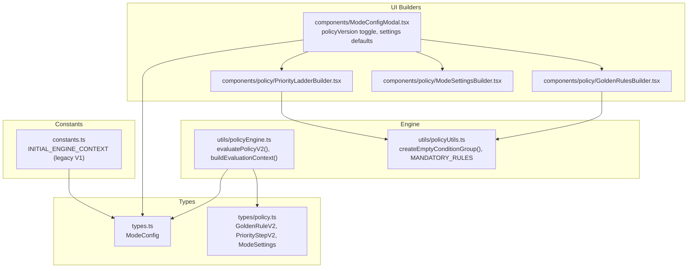
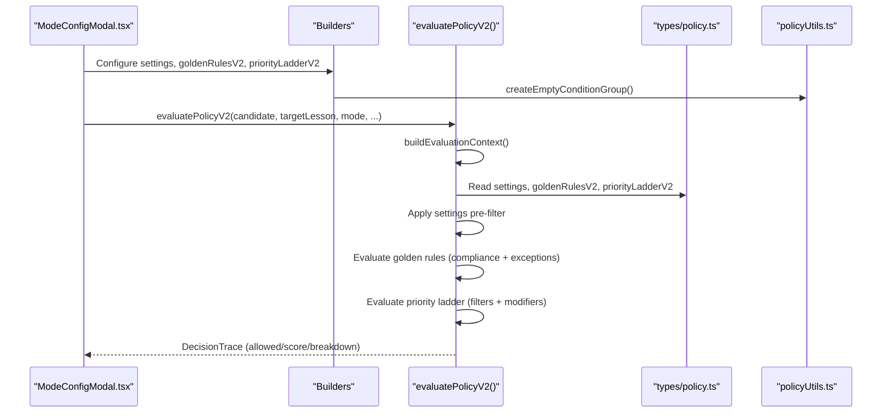
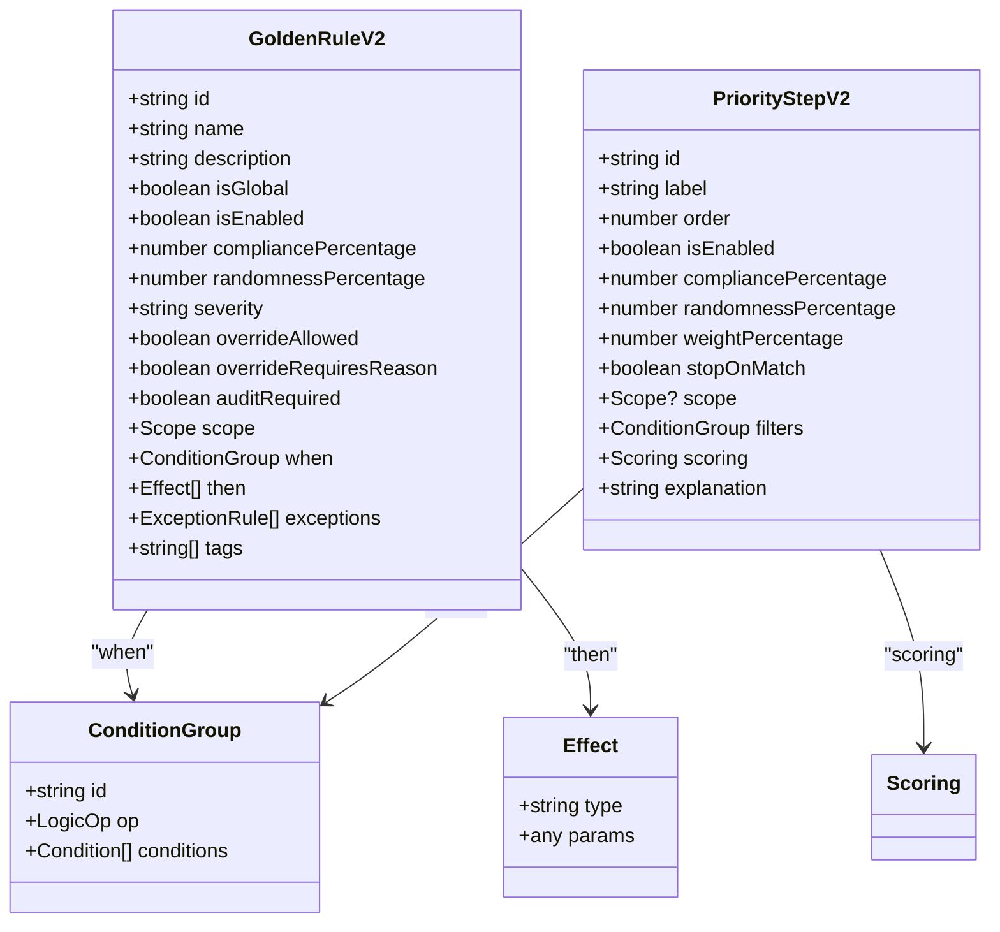
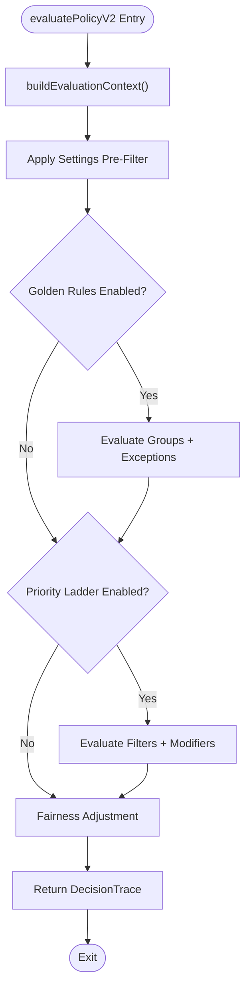
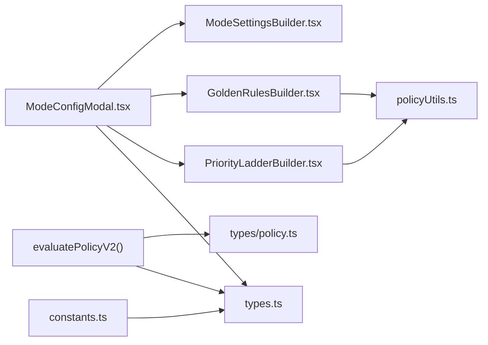

# V2 Engine Extensions

<cite>
**Referenced Files in This Document**
- [constants.ts](file://constants.ts)
- [types.ts](file://types.ts)
- [types/policy.ts](file://types/policy.ts)
- [utils/policyEngine.ts](file://utils/policyEngine.ts)
- [utils/policyUtils.ts](file://utils/policyUtils.ts)
- [components/ModeConfigModal.tsx](file://components/ModeConfigModal.tsx)
- [components/policy/GoldenRulesBuilder.tsx](file://components/policy/GoldenRulesBuilder.tsx)
- [components/policy/PriorityLadderBuilder.tsx](file://components/policy/PriorityLadderBuilder.tsx)
- [components/policy/ModeSettingsBuilder.tsx](file://components/policy/ModeSettingsBuilder.tsx)
</cite>

## Table of Contents
1. [Introduction](#introduction)
2. [Project Structure](#project-structure)
3. [Core Components](#core-components)
4. [Architecture Overview](#architecture-overview)
5. [Detailed Component Analysis](#detailed-component-analysis)
6. [Dependency Analysis](#dependency-analysis)
7. [Performance Considerations](#performance-considerations)
8. [Troubleshooting Guide](#troubleshooting-guide)
9. [Conclusion](#conclusion)
10. [Appendices](#appendices)

## Introduction
This document explains the V2 engine extensions introduced in ModeConfig to enhance the policy engine with advanced rule evaluation and configuration capabilities. It focuses on four key fields:
- policyVersion
- goldenRulesV2
- priorityLadderV2
- settings
- lockedAssignments

It also documents how these fields integrate with the evaluatePolicyV2 function, the ModeSettings interface, and the UI builders that configure them. Migration from V1 to V2 and backward compatibility considerations are addressed with practical examples from constants.ts and ModeConfigModal.tsx.

## Project Structure
The V2 engine spans several modules:
- Types define the data structures for V2 rules, priority steps, settings, and ModeConfig.
- Policy engine implements the evaluation logic for V2 rules and priority ladder.
- Builders provide UI for configuring V2 golden rules, priority ladder, and mode settings.
- Constants initialize default engine contexts and legacy golden rules.
- ModeConfigModal orchestrates V2 configuration and toggles between V1/V2.

**Diagram sources**
- [types.ts](file://types.ts#L169-L216)
- [types/policy.ts](file://types/policy.ts#L30-L161)
- [utils/policyEngine.ts](file://utils/policyEngine.ts#L255-L405)
- [utils/policyUtils.ts](file://utils/policyUtils.ts#L52-L117)
- [components/ModeConfigModal.tsx](file://components/ModeConfigModal.tsx#L61-L131)
- [components/policy/GoldenRulesBuilder.tsx](file://components/policy/GoldenRulesBuilder.tsx#L1-L179)
- [components/policy/PriorityLadderBuilder.tsx](file://components/policy/PriorityLadderBuilder.tsx#L1-L147)
- [components/policy/ModeSettingsBuilder.tsx](file://components/policy/ModeSettingsBuilder.tsx#L1-L226)
- [constants.ts](file://constants.ts#L109-L217)

**Section sources**
- [types.ts](file://types.ts#L169-L216)
- [types/policy.ts](file://types/policy.ts#L30-L161)
- [utils/policyEngine.ts](file://utils/policyEngine.ts#L255-L405)
- [utils/policyUtils.ts](file://utils/policyUtils.ts#L52-L117)
- [components/ModeConfigModal.tsx](file://components/ModeConfigModal.tsx#L61-L131)
- [components/policy/GoldenRulesBuilder.tsx](file://components/policy/GoldenRulesBuilder.tsx#L1-L179)
- [components/policy/PriorityLadderBuilder.tsx](file://components/policy/PriorityLadderBuilder.tsx#L1-L147)
- [components/policy/ModeSettingsBuilder.tsx](file://components/policy/ModeSettingsBuilder.tsx#L1-L226)
- [constants.ts](file://constants.ts#L109-L217)

## Core Components
- ModeConfig (types.ts): Adds V2 fields and settings to the mode configuration model.
- GoldenRuleV2 and PriorityStepV2 (types/policy.ts): Define the V2 rule and priority ladder structures with composite conditions and effects.
- ModeSettings (types/policy.ts): Fine-tunes engine behavior across domains (teacher, lesson, time, class, subject, HR, UI).
- evaluatePolicyV2 (utils/policyEngine.ts): Implements the V2 evaluation pipeline using settings, golden rules, and priority ladder.
- Builders (GoldenRulesBuilder, PriorityLadderBuilder, ModeSettingsBuilder): Provide UI for creating and editing V2 constructs.
- ModeConfigModal (components/ModeConfigModal.tsx): Orchestrates V2 configuration, sets defaults, and toggles policyVersion.

**Section sources**
- [types.ts](file://types.ts#L169-L216)
- [types/policy.ts](file://types/policy.ts#L30-L161)
- [utils/policyEngine.ts](file://utils/policyEngine.ts#L255-L405)
- [components/policy/GoldenRulesBuilder.tsx](file://components/policy/GoldenRulesBuilder.tsx#L1-L179)
- [components/policy/PriorityLadderBuilder.tsx](file://components/policy/PriorityLadderBuilder.tsx#L1-L147)
- [components/policy/ModeSettingsBuilder.tsx](file://components/policy/ModeSettingsBuilder.tsx#L1-L226)
- [components/ModeConfigModal.tsx](file://components/ModeConfigModal.tsx#L61-L131)

## Architecture Overview
The V2 engine augments the legacy V1 configuration with:
- policyVersion: Indicates whether V2 is active.
- goldenRulesV2: Composite rules with WHEN-THEN-EXCEPTIONS and effects.
- priorityLadderV2: Weighted, ordered steps with filters and scoring modifiers.
- settings: Pre-filter engine controlling visibility and constraints.
- lockedAssignments: Optional manual assignments for half-manual mode.

**Diagram sources**
- [components/ModeConfigModal.tsx](file://components/ModeConfigModal.tsx#L61-L131)
- [components/policy/GoldenRulesBuilder.tsx](file://components/policy/GoldenRulesBuilder.tsx#L1-L179)
- [components/policy/PriorityLadderBuilder.tsx](file://components/policy/PriorityLadderBuilder.tsx#L1-L147)
- [components/policy/ModeSettingsBuilder.tsx](file://components/policy/ModeSettingsBuilder.tsx#L1-L226)
- [utils/policyEngine.ts](file://utils/policyEngine.ts#L255-L405)
- [utils/policyUtils.ts](file://utils/policyUtils.ts#L52-L117)
- [types/policy.ts](file://types/policy.ts#L30-L161)

## Detailed Component Analysis

### ModeConfig and V2 Fields
- policyVersion: A string field indicating engine version. ModeConfigModal initializes it to V2 by default and allows toggling between V1 and V2.
- goldenRulesV2: An array of GoldenRuleV2 with composite WHEN condition groups, THEN effects, and EXCEPTIONS.
- priorityLadderV2: An array of PriorityStepV2 with filters, scoring modifiers, weights, and stop-on-match semantics.
- settings: ModeSettings object enabling pre-filtering and behavioral controls.
- lockedAssignments: Optional manual assignments for specific slots.

These fields are declared in the ModeConfig interface and initialized in constants.ts for legacy modes, while ModeConfigModal ensures defaults and synchronization for V2.

**Section sources**
- [types.ts](file://types.ts#L169-L216)
- [components/ModeConfigModal.tsx](file://components/ModeConfigModal.tsx#L61-L131)
- [constants.ts](file://constants.ts#L109-L217)

### GoldenRuleV2 and PriorityStepV2
GoldenRuleV2 adds:
- Composite condition groups (AND/OR/NAND) with nested conditions.
- Severity, compliance, randomness, and scope targeting.
- Exceptions with their own condition groups.
- Effects such as BLOCK_ASSIGNMENT, BOOST_SCORE, PENALIZE_SCORE, FORCE_INTERNAL_ONLY, etc.

PriorityStepV2 adds:
- Ordered steps with filters and scoring modifiers.
- Weight percentage and stop-on-match behavior.
- Base score and modifier operations (ADD/SUBTRACT/MULTIPLY/SET_TO).

**Diagram sources**
- [types/policy.ts](file://types/policy.ts#L30-L161)

**Section sources**
- [types/policy.ts](file://types/policy.ts#L30-L161)

### ModeSettings Interface
ModeSettings enables fine-tuning behavior across seven domains:
- teacher: disableExternal, treatNoLessonsAsOffDuty, allowLateArrivals, forceHomeroomPresence
- lesson: disableStay, disableIndividual, disableShared, forceActualOnly
- time: ignoreGapsAtStart, ignoreGapsAtEnd, maxConsecutivePeriods
- class: allowMerge, maxMergedCount, priorityGrades, allowSplitStrategy
- subject: governingSubject, prioritizeGoverningSubject, enableCrossCompetency
- hr: maxDailyCoverage, maxWeeklyCoverage, fairnessSensitivity, immunityCooldownHours
- ui: hideForbiddenCandidates, requireJustification, lockManualOverride

ModeSettingsBuilder renders these controls and updates the settings object in ModeConfigModal.

**Section sources**
- [types/policy.ts](file://types/policy.ts#L83-L139)
- [components/policy/ModeSettingsBuilder.tsx](file://components/policy/ModeSettingsBuilder.tsx#L1-L226)
- [components/ModeConfigModal.tsx](file://components/ModeConfigModal.tsx#L61-L131)

### evaluatePolicyV2 Function
The V2 evaluation pipeline:
1. Build evaluation context from candidate, target lesson, and logs.
2. Apply settings pre-filter (presence, immunity, coverage limits, subject specialization).
3. Evaluate golden rules with compliance checks and exceptions.
4. Evaluate priority ladder steps with filters and scoring modifiers.
5. Apply fairness adjustments based on settings.
6. Produce a DecisionTrace with breakdown and final decision.

**Diagram sources**
- [utils/policyEngine.ts](file://utils/policyEngine.ts#L255-L405)

**Section sources**
- [utils/policyEngine.ts](file://utils/policyEngine.ts#L255-L405)

### UI Builders and Configuration Patterns
- GoldenRulesBuilder: Manages creation, editing, and deletion of GoldenRuleV2 entries, enforces mandatory rules, and edits WHEN/THEN/exceptions.
- PriorityLadderBuilder: Manages ordering, weights, filters, and scoring modifiers for PriorityStepV2.
- ModeSettingsBuilder: Provides granular controls for all ModeSettings domains.

ModeConfigModal initializes defaults for V2, injects standard stay rule if missing, and synchronizes V2 subject to V1 examSubject for exam mode validation.

**Section sources**
- [components/policy/GoldenRulesBuilder.tsx](file://components/policy/GoldenRulesBuilder.tsx#L1-L179)
- [components/policy/PriorityLadderBuilder.tsx](file://components/policy/PriorityLadderBuilder.tsx#L1-L147)
- [components/policy/ModeSettingsBuilder.tsx](file://components/policy/ModeSettingsBuilder.tsx#L1-L226)
- [components/ModeConfigModal.tsx](file://components/ModeConfigModal.tsx#L61-L131)
- [utils/policyUtils.ts](file://utils/policyUtils.ts#L52-L117)

## Dependency Analysis
- ModeConfigModal depends on:
  - ModeSettingsBuilder for settings UI
  - GoldenRulesBuilder and PriorityLadderBuilder for V2 rule configuration
  - policyUtils for creating empty condition groups and enforcing mandatory rules
- evaluatePolicyV2 depends on:
  - types/policy.ts for rule and step structures
  - types.ts for ModeConfig and context types
  - constants.ts for legacy defaults and standards (e.g., STANDARD_STAY_RULE)

**Diagram sources**
- [components/ModeConfigModal.tsx](file://components/ModeConfigModal.tsx#L61-L131)
- [components/policy/GoldenRulesBuilder.tsx](file://components/policy/GoldenRulesBuilder.tsx#L1-L179)
- [components/policy/PriorityLadderBuilder.tsx](file://components/policy/PriorityLadderBuilder.tsx#L1-L147)
- [components/policy/ModeSettingsBuilder.tsx](file://components/policy/ModeSettingsBuilder.tsx#L1-L226)
- [utils/policyEngine.ts](file://utils/policyEngine.ts#L255-L405)
- [utils/policyUtils.ts](file://utils/policyUtils.ts#L52-L117)
- [types.ts](file://types.ts#L169-L216)
- [types/policy.ts](file://types/policy.ts#L30-L161)
- [constants.ts](file://constants.ts#L109-L217)

**Section sources**
- [components/ModeConfigModal.tsx](file://components/ModeConfigModal.tsx#L61-L131)
- [utils/policyEngine.ts](file://utils/policyEngine.ts#L255-L405)
- [types.ts](file://types.ts#L169-L216)
- [types/policy.ts](file://types/policy.ts#L30-L161)
- [utils/policyUtils.ts](file://utils/policyUtils.ts#L52-L117)
- [constants.ts](file://constants.ts#L109-L217)

## Performance Considerations
- Pre-filtering via ModeSettings reduces unnecessary rule evaluations and speeds up decision-making.
- Weighted priority ladder steps with stop-on-match minimize scoring overhead.
- Composite condition groups should be kept concise to avoid deep recursion during evaluation.
- Fairness adjustments are lightweight multipliers applied at the end of evaluation.

[No sources needed since this section provides general guidance]

## Troubleshooting Guide
Common issues and resolutions:
- Missing mandatory golden rules: The GoldenRulesBuilder ensures mandatory rules exist; if removed, they are re-inserted automatically.
- Validation failures for exam mode: ModeConfigModal synchronizes V2 subject to V1 examSubject to satisfy validation.
- Off-duty or immune candidates: evaluatePolicyV2 rejects candidates who are off-duty or under immunity (except emergency mode).
- Excessive coverage limits: HR settings enforce daily/weekly coverage caps; exceeding them blocks assignment.

**Section sources**
- [components/policy/GoldenRulesBuilder.tsx](file://components/policy/GoldenRulesBuilder.tsx#L1-L179)
- [components/ModeConfigModal.tsx](file://components/ModeConfigModal.tsx#L105-L131)
- [utils/policyEngine.ts](file://utils/policyEngine.ts#L296-L345)

## Conclusion
The V2 engine extensions in ModeConfig deliver a robust, explainable, and configurable policy evaluation system. By combining composite golden rules, weighted priority steps, and fine-grained settings, administrators can tailor substitution policies to diverse scenarios while maintaining transparency through DecisionTrace. ModeConfigModal streamlines configuration, and evaluatePolicyV2 executes the logic efficiently. Migration from V1 to V2 is supported with defaults and legacy compatibility, ensuring smooth adoption.

[No sources needed since this section summarizes without analyzing specific files]

## Appendices

### Migration from V1 to V2 and Backward Compatibility
- ModeConfigModal initializes policyVersion to V2 by default and provides a toggle to switch between V1 and V2.
- Legacy golden rules remain supported; ModeConfigModal injects the standard stay rule if missing to preserve safety.
- For exam mode, V2 subject governs behavior and is synchronized to V1 examSubject to pass validation.
- INITIAL_ENGINE_CONTEXT in constants.ts demonstrates V1 configurations; V2 fields are optional and can be added incrementally.

**Section sources**
- [components/ModeConfigModal.tsx](file://components/ModeConfigModal.tsx#L61-L131)
- [constants.ts](file://constants.ts#L109-L217)