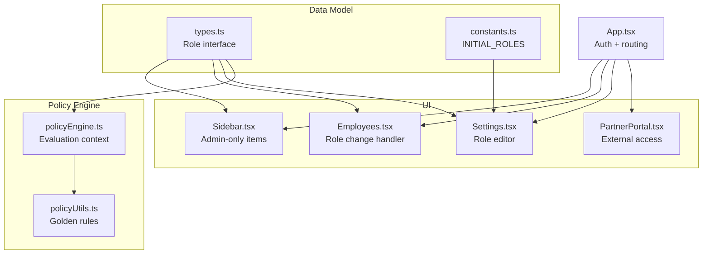
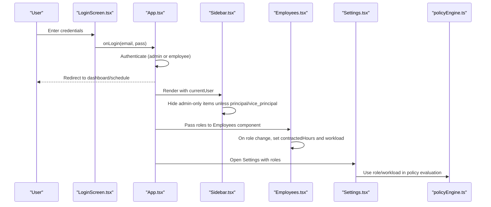
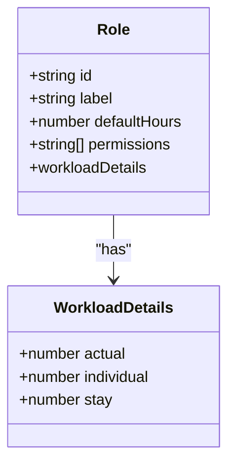
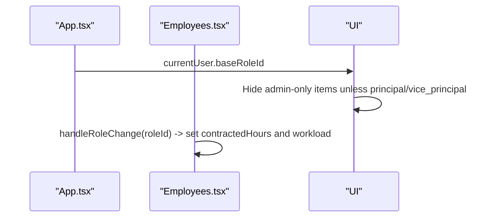
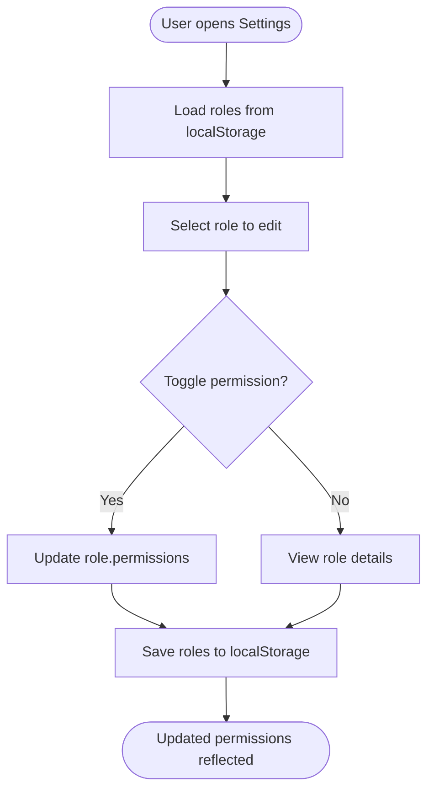
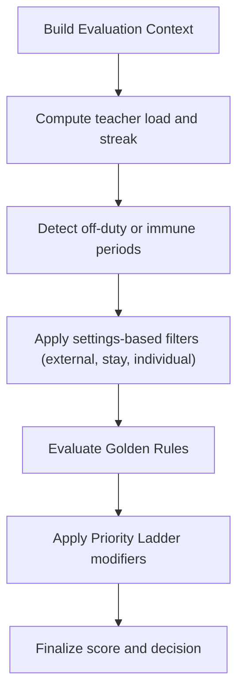
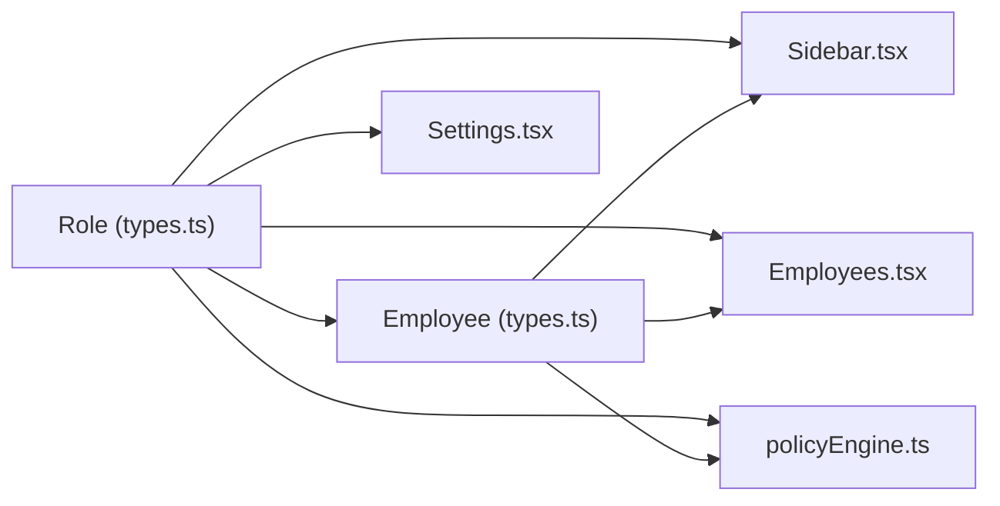

# Role and Permission Model

<cite>
**Referenced Files in This Document**
- [constants.ts](file://constants.ts)
- [types.ts](file://types.ts)
- [App.tsx](file://App.tsx)
- [Sidebar.tsx](file://components/Sidebar.tsx)
- [Employees.tsx](file://components/Employees.tsx)
- [Settings.tsx](file://components/Settings.tsx)
- [PartnerPortal.tsx](file://components/PartnerPortal.tsx)
- [policyEngine.ts](file://utils/policyEngine.ts)
- [policyUtils.ts](file://utils/policyUtils.ts)
</cite>

## Table of Contents
1. [Introduction](#introduction)
2. [Project Structure](#project-structure)
3. [Core Components](#core-components)
4. [Architecture Overview](#architecture-overview)
5. [Detailed Component Analysis](#detailed-component-analysis)
6. [Dependency Analysis](#dependency-analysis)
7. [Performance Considerations](#performance-considerations)
8. [Troubleshooting Guide](#troubleshooting-guide)
9. [Conclusion](#conclusion)

## Introduction
This document provides comprehensive data model documentation for the Role interface and its associated permission model. It explains how roles define access control, how workloadDetails inform scheduling and coverage decisions in the policy engine, and how roles relate to employees via baseRoleId. It also documents how roles influence UI visibility in Employees.tsx and Sidebar.tsx, and outlines security implications and best practices for role management.

## Project Structure
The role and permission model spans several files:
- Data model definition: Role interface in types.ts
- Initial role definitions: INITIAL_ROLES in constants.ts
- UI integration: Sidebar.tsx and Employees.tsx
- Settings management: Settings.tsx
- Policy engine integration: policyEngine.ts and policyUtils.ts
- Application-wide routing and access control: App.tsx
- External portal access: PartnerPortal.tsx

**Diagram sources**
- [types.ts](file://types.ts#L77-L87)
- [constants.ts](file://constants.ts#L50-L55)
- [Sidebar.tsx](file://components/Sidebar.tsx#L53-L69)
- [Employees.tsx](file://components/Employees.tsx#L106-L118)
- [Settings.tsx](file://components/Settings.tsx#L652-L725)
- [PartnerPortal.tsx](file://components/PartnerPortal.tsx#L19-L31)
- [policyEngine.ts](file://utils/policyEngine.ts#L163-L202)
- [policyUtils.ts](file://utils/policyUtils.ts#L59-L117)
- [App.tsx](file://App.tsx#L140-L173)

**Section sources**
- [types.ts](file://types.ts#L77-L87)
- [constants.ts](file://constants.ts#L50-L55)
- [App.tsx](file://App.tsx#L140-L173)
- [Sidebar.tsx](file://components/Sidebar.tsx#L53-L69)
- [Employees.tsx](file://components/Employees.tsx#L106-L118)
- [Settings.tsx](file://components/Settings.tsx#L652-L725)
- [PartnerPortal.tsx](file://components/PartnerPortal.tsx#L19-L31)
- [policyEngine.ts](file://utils/policyEngine.ts#L163-L202)
- [policyUtils.ts](file://utils/policyUtils.ts#L59-L117)

## Core Components
- Role interface fields:
  - id: Unique identifier for the role
  - label: Human-readable role name
  - defaultHours: Contracted hours for the role
  - permissions: Array of permission identifiers controlling UI and administrative access
  - workloadDetails: Breakdown of actual, individual, and stay hours composing defaultHours
- INITIAL_ROLES: Predefined roles including Principal, Vice Principal, Teachers, and Counselor with distinct permissions and workload allocations
- Employee.baseRoleId: Links an employee to a Role, driving UI and access behavior
- Policy engine: Uses role-linked workload and constraints to compute coverage decisions

**Section sources**
- [types.ts](file://types.ts#L77-L87)
- [constants.ts](file://constants.ts#L50-L55)
- [Employees.tsx](file://components/Employees.tsx#L106-L118)
- [policyEngine.ts](file://utils/policyEngine.ts#L163-L202)

## Architecture Overview
The role-permission system integrates with:
- Authentication and redirection in App.tsx based on baseRoleId
- Sidebar navigation filtering by admin-only items for principals/vice-principals
- Employee creation/editing in Employees.tsx that auto-applies role defaultHours and workloadDetails
- Role management UI in Settings.tsx
- Policy engine evaluation that considers teacher presence, immunity, and workload

**Diagram sources**
- [App.tsx](file://App.tsx#L140-L173)
- [Sidebar.tsx](file://components/Sidebar.tsx#L53-L69)
- [Employees.tsx](file://components/Employees.tsx#L106-L118)
- [Settings.tsx](file://components/Settings.tsx#L652-L725)
- [policyEngine.ts](file://utils/policyEngine.ts#L163-L202)

## Detailed Component Analysis

### Role Data Model
- Fields:
  - id: string
  - label: string
  - defaultHours: number
  - permissions: string[]
  - workloadDetails: { actual: number; individual: number; stay: number }
- Purpose:
  - Define baseline workload allocation and access capabilities
  - Drive UI behavior and policy engine scoring

**Diagram sources**
- [types.ts](file://types.ts#L77-L87)

**Section sources**
- [types.ts](file://types.ts#L77-L87)

### INITIAL_ROLES Examples
- Principal: view_all, edit_absences, manage_staff, override_engine, system_admin; workloadDetails reflect leadership coverage
- Vice Principal: view_all, edit_absences, manage_staff, override_engine; slightly reduced workload
- Teachers: view_all; workload emphasizes teaching hours
- Counselor: view_all; workload emphasizes individual support hours

These configurations demonstrate how permissions enable administrative actions and how workloadDetails inform scheduling priorities.

**Section sources**
- [constants.ts](file://constants.ts#L50-L55)

### Role-to-Employee Linkage (baseRoleId)
- Employees carry baseRoleId, which determines:
  - Access control in UI (e.g., admin-only menu items)
  - Default contractedHours and workload distribution when adding/editing employees
  - Role-based redirection after login

**Diagram sources**
- [App.tsx](file://App.tsx#L140-L173)
- [Sidebar.tsx](file://components/Sidebar.tsx#L53-L69)
- [Employees.tsx](file://components/Employees.tsx#L106-L118)

**Section sources**
- [App.tsx](file://App.tsx#L140-L173)
- [Sidebar.tsx](file://components/Sidebar.tsx#L53-L69)
- [Employees.tsx](file://components/Employees.tsx#L106-L118)

### Permissions and UI Control
- Sidebar.tsx hides admin-only items unless currentUser.baseRoleId is principal or vice_principal
- Settings.tsx exposes role editor with permission toggles (view_all, edit_absences, manage_staff, override_engine, system_admin)
- Employees.tsx uses role.defaultHours and role.workloadDetails to initialize new employee records

**Diagram sources**
- [Settings.tsx](file://components/Settings.tsx#L652-L725)

**Section sources**
- [Sidebar.tsx](file://components/Sidebar.tsx#L53-L69)
- [Settings.tsx](file://components/Settings.tsx#L652-L725)
- [Employees.tsx](file://components/Employees.tsx#L106-L118)

### WorkloadDetails in Policy Engine
- The policy engine builds an evaluation context that includes teacher workload and slot state
- WorkloadDetails contributes to:
  - Fairness deviation calculations
  - Daily presence range checks
  - Priority ladder scoring adjustments

**Diagram sources**
- [policyEngine.ts](file://utils/policyEngine.ts#L163-L202)
- [policyEngine.ts](file://utils/policyEngine.ts#L296-L405)
- [policyUtils.ts](file://utils/policyUtils.ts#L59-L117)

**Section sources**
- [policyEngine.ts](file://utils/policyEngine.ts#L163-L202)
- [policyEngine.ts](file://utils/policyEngine.ts#L296-L405)
- [policyUtils.ts](file://utils/policyUtils.ts#L59-L117)

### External Portal Access (PartnerPortal.tsx)
- PartnerPortal is designed for external collaborators and events
- Current implementation passes currentUser to the calendar request form
- Access control for this view is not role-gated in the provided code; administrators can restrict access via routing if desired

**Section sources**
- [PartnerPortal.tsx](file://components/PartnerPortal.tsx#L19-L31)

## Dependency Analysis
- Role interface depends on Employee’s baseRoleId for linkage
- Sidebar depends on currentUser.baseRoleId for admin-only visibility
- Employees depends on roles to set defaultHours and workloadDetails
- Settings depends on roles for editing and deletion validation
- Policy engine depends on role-linked constraints and workload for evaluation

**Diagram sources**
- [types.ts](file://types.ts#L77-L87)
- [Sidebar.tsx](file://components/Sidebar.tsx#L53-L69)
- [Employees.tsx](file://components/Employees.tsx#L106-L118)
- [Settings.tsx](file://components/Settings.tsx#L652-L725)
- [policyEngine.ts](file://utils/policyEngine.ts#L163-L202)

**Section sources**
- [types.ts](file://types.ts#L77-L87)
- [Sidebar.tsx](file://components/Sidebar.tsx#L53-L69)
- [Employees.tsx](file://components/Employees.tsx#L106-L118)
- [Settings.tsx](file://components/Settings.tsx#L652-L725)
- [policyEngine.ts](file://utils/policyEngine.ts#L163-L202)

## Performance Considerations
- Role lookups are O(n) over the roles array; keep the number of roles small
- Workload computations in the policy engine are linear in the number of lessons/substitutions; cache results where appropriate
- UI rendering of roles and permissions should leverage memoization to avoid unnecessary re-renders

[No sources needed since this section provides general guidance]

## Troubleshooting Guide
- Role not applying to new employees:
  - Ensure handleRoleChange is invoked when selecting a role in Employees.tsx
  - Verify role.defaultHours and workloadDetails are set
- Admin-only items missing:
  - Confirm currentUser.baseRoleId is principal or vice_principal
  - Check Sidebar.tsx filtering logic
- Policy engine rejects assignments:
  - Review policyEngine.ts evaluation context for off-duty, immunity, and settings filters
  - Adjust workloadDetails to align with policy constraints

**Section sources**
- [Employees.tsx](file://components/Employees.tsx#L106-L118)
- [Sidebar.tsx](file://components/Sidebar.tsx#L53-L69)
- [policyEngine.ts](file://utils/policyEngine.ts#L296-L405)

## Conclusion
The Role interface defines both access control and scheduling foundation. Permissions gate administrative UI, while workloadDetails shape policy-driven coverage decisions. The baseRoleId ties employees to roles, enabling consistent behavior across Employees.tsx, Sidebar.tsx, and Settings.tsx. For secure operation, enforce role-based access at the application level and maintain strict separation of duties for sensitive permissions.