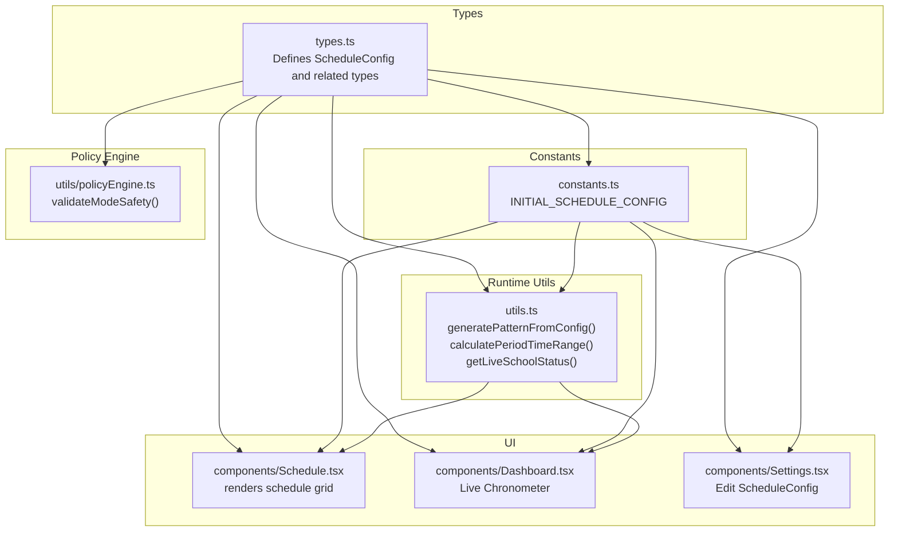
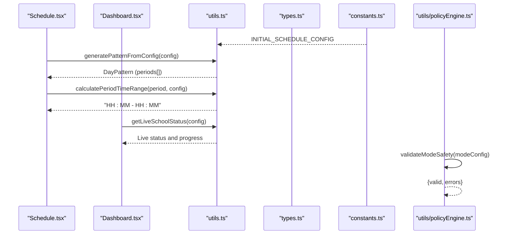
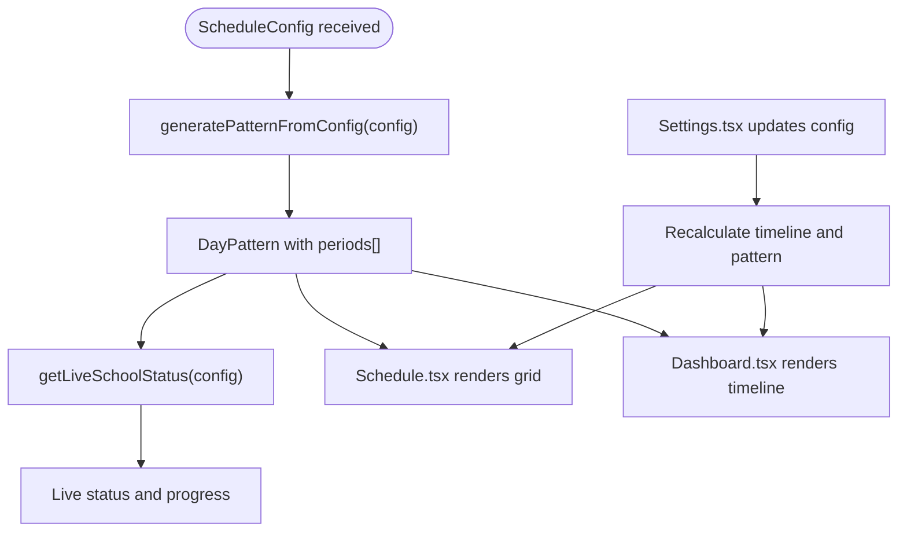
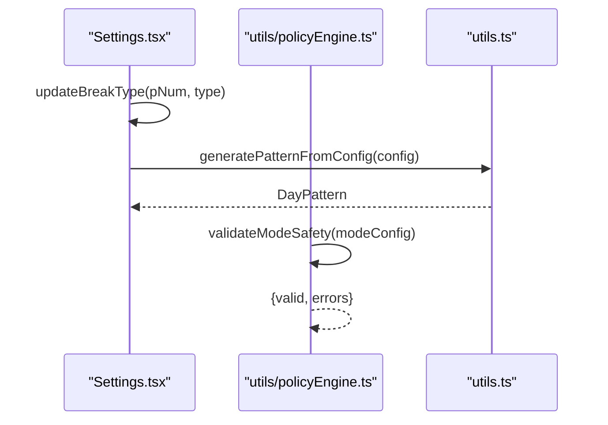
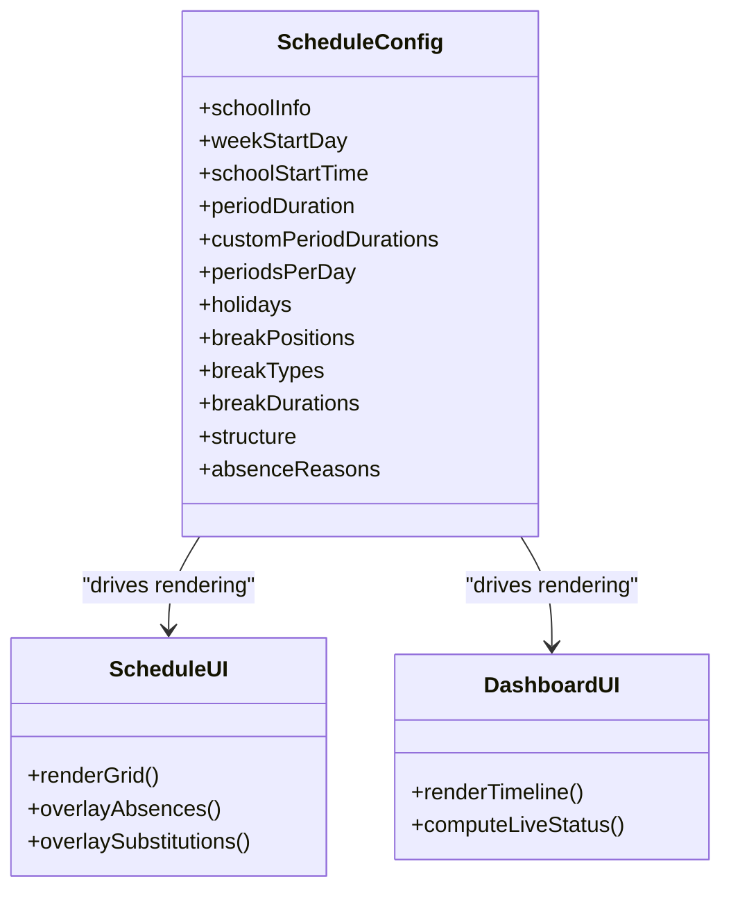
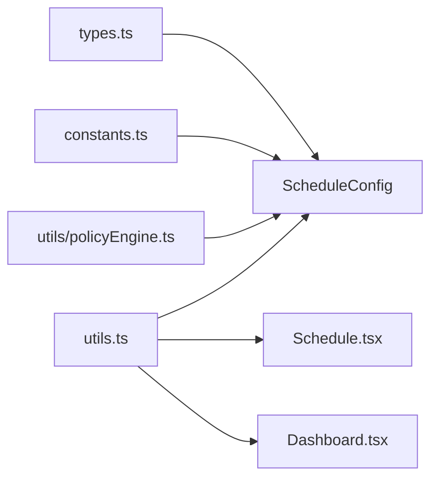

# Schedule Configuration

<cite>
**Referenced Files in This Document**
- [constants.ts](file://constants.ts)
- [types.ts](file://types.ts)
- [utils.ts](file://utils.ts)
- [utils/policyEngine.ts](file://utils/policyEngine.ts)
- [components/Schedule.tsx](file://components/Schedule.tsx)
- [components/Dashboard.tsx](file://components/Dashboard.tsx)
- [components/Settings.tsx](file://components/Settings.tsx)
</cite>

## Table of Contents
1. [Introduction](#introduction)
2. [Project Structure](#project-structure)
3. [Core Components](#core-components)
4. [Architecture Overview](#architecture-overview)
5. [Detailed Component Analysis](#detailed-component-analysis)
6. [Dependency Analysis](#dependency-analysis)
7. [Performance Considerations](#performance-considerations)
8. [Troubleshooting Guide](#troubleshooting-guide)
9. [Conclusion](#conclusion)
10. [Appendices](#appendices)

## Introduction
This document provides comprehensive data model documentation for ScheduleConfig, the central configuration object that defines the school’s schedule structure, operational behavior, and how it drives the scheduling engine and UI rendering. It explains each field, including schoolInfo, weekStartDay, schoolStartTime, periodDuration, customPeriodDurations, periodsPerDay, holidays, breakPositions, breakTypes, breakDurations, and the nested structure object containing activeStages, generalCounts, specialCounts, lowerStageEnd, namingConvention, and mergeSpecialNaming. It also documents how absenceReasons are used in the system, illustrates real-world configuration via INITIAL_SCHEDULE_CONFIG, outlines constraints and validation rules, and explains how changes propagate through the system.

## Project Structure
ScheduleConfig is defined in the shared types module and consumed across the application:
- Data model definition: types.ts
- Example configuration: constants.ts
- Runtime computation and UI integration: utils.ts, components/Schedule.tsx, components/Dashboard.tsx
- Configuration editing UI: components/Settings.tsx
- Policy engine validation: utils/policyEngine.ts

**Diagram sources**
- [types.ts](file://types.ts#L55-L75)
- [constants.ts](file://constants.ts#L62-L82)
- [utils.ts](file://utils.ts#L85-L115)
- [components/Schedule.tsx](file://components/Schedule.tsx#L1-L120)
- [components/Dashboard.tsx](file://components/Dashboard.tsx#L1-L120)
- [components/Settings.tsx](file://components/Settings.tsx#L62-L120)
- [utils/policyEngine.ts](file://utils/policyEngine.ts#L24-L44)

**Section sources**
- [types.ts](file://types.ts#L55-L75)
- [constants.ts](file://constants.ts#L62-L82)

## Core Components
- ScheduleConfig: The primary configuration object that defines school schedule behavior.
- PeriodSlot and DayPattern: Derived runtime structures used to render and compute schedules.
- EngineContext and ModeConfig: Operational modes that can modify the schedule pattern at runtime (e.g., merging breaks, internal breaks).

Key responsibilities:
- ScheduleConfig drives schedule generation, UI rendering, and live status calculation.
- PeriodSlot and DayPattern represent the computed daily schedule.
- EngineContext and ModeConfig can alter the pattern during events or modes.

**Section sources**
- [types.ts](file://types.ts#L55-L75)
- [types.ts](file://types.ts#L238-L253)
- [utils.ts](file://utils.ts#L85-L115)
- [utils.ts](file://utils.ts#L177-L181)

## Architecture Overview
ScheduleConfig is the single source of truth for schedule behavior. It is consumed by:
- Utilities to generate the daily pattern and compute live status.
- UI components to render the schedule grid and dashboard chronometer.
- Settings UI to edit and validate configuration changes.
- Policy engine to validate mode activation and enforce constraints.

**Diagram sources**
- [constants.ts](file://constants.ts#L62-L82)
- [utils.ts](file://utils.ts#L85-L115)
- [utils.ts](file://utils.ts#L177-L181)
- [utils.ts](file://utils.ts#L194-L223)
- [utils/policyEngine.ts](file://utils/policyEngine.ts#L24-L44)

## Detailed Component Analysis

### ScheduleConfig Data Model
ScheduleConfig defines the school’s schedule configuration. Below are the fields and their roles:

- schoolInfo: Optional branding information for the school (name, optional logo).
- weekStartDay: The first day of the week in Arabic (e.g., "الاثنين").
- schoolStartTime: Start time of the first period in HH:MM format.
- periodDuration: Default duration for periods in minutes.
- customPeriodDurations: Optional per-period durations to override periodDuration for specific periods.
- periodsPerDay: Total number of periods per day.
- holidays: List of Arabic day names that are holidays.
- breakPositions: Maps period numbers to break positions ("main" or "transit").
- breakTypes: Maps period numbers to break types ("none", "short", "long").
- breakDurations: Maps period numbers to break durations in minutes.
- structure: Nested object controlling class structure and naming:
  - activeStages: Which educational stages are active ("primary", "middle", "secondary").
  - generalCounts: Array of counts per grade level for general classes.
  - specialCounts: Array of counts per grade level for special classes.
  - lowerStageEnd: Index where lower stage ends (used to decide assistant requirement).
  - namingConvention: "alpha" or "numeric" for class suffixes.
  - mergeSpecialNaming: Whether to merge special classes under the same naming convention.
- absenceReasons: List of acceptable absence reasons used in absence records.

How absenceReasons are used:
- Stored in ScheduleConfig and used to populate absence forms and validation in absence-related components.
- The absenceReasons list ensures consistency across absence entries and UI selections.

Real-world example:
- INITIAL_SCHEDULE_CONFIG demonstrates a typical configuration with:
  - schoolInfo.name set to a school name.
  - weekStartDay set to a weekday.
  - schoolStartTime set to "08:00".
  - periodDuration set to 45.
  - customPeriodDurations overriding the first period to 50 minutes.
  - periodsPerDay set to 7.
  - holidays set to Friday and Sunday.
  - breakPositions indicating breaks at periods 2 and 4.
  - breakTypes specifying long and short breaks at periods 2 and 4.
  - breakDurations specifying 20 and 10 minutes respectively.
  - structure with activeStages, counts arrays, lowerStageEnd, namingConvention, and mergeSpecialNaming.
  - absenceReasons with five Arabic reasons.

Constraints and valid values:
- Break types: "none", "short", "long".
- Naming convention: "alpha" or "numeric".
- Periods per day: integer ≥ 1.
- Custom period durations: positive integers per period index.
- Holidays: must be valid Arabic day names present in the supported days list.
- Break positions: "main" or "transit".
- Structure arrays: indices correspond to grade levels 1–12.

Validation and propagation:
- Settings.tsx updates ScheduleConfig and recalculates a visual timeline to reflect changes immediately.
- utils.ts generates the dynamic DayPattern from ScheduleConfig and computes live status.
- Dashboard.tsx and Schedule.tsx consume the generated pattern and configuration to render UI.
- Policy engine validates mode activation using validateModeSafety to ensure configuration safety.

**Section sources**
- [types.ts](file://types.ts#L55-L75)
- [constants.ts](file://constants.ts#L62-L82)
- [components/Settings.tsx](file://components/Settings.tsx#L62-L120)
- [utils.ts](file://utils.ts#L85-L115)
- [utils.ts](file://utils.ts#L177-L181)
- [utils/policyEngine.ts](file://utils/policyEngine.ts#L24-L44)

### How ScheduleConfig Drives the Scheduling Engine
- Dynamic pattern generation:
  - generatePatternFromConfig builds a DayPattern by iterating periodsPerDay, computing cumulative start/end times, and inserting breaks according to breakTypes and breakDurations.
- Live status computation:
  - getLiveSchoolStatus determines whether the school is before, in a period, in a break, after school, or on a holiday, and calculates remaining minutes and progress.
- UI rendering:
  - Schedule.tsx uses scheduleConfig to:
    - Determine visible days (excluding holidays if configured).
    - Filter periods by range.
    - Render lessons per cell and overlay absence/substitution events.
  - Dashboard.tsx uses scheduleConfig to:
    - Generate the vertical timeline for the current day.
    - Compute live status and progress ring.

**Diagram sources**
- [utils.ts](file://utils.ts#L85-L115)
- [utils.ts](file://utils.ts#L194-L223)
- [components/Schedule.tsx](file://components/Schedule.tsx#L119-L136)
- [components/Dashboard.tsx](file://components/Dashboard.tsx#L92-L118)
- [components/Settings.tsx](file://components/Settings.tsx#L120-L139)

**Section sources**
- [utils.ts](file://utils.ts#L85-L115)
- [utils.ts](file://utils.ts#L194-L223)
- [components/Schedule.tsx](file://components/Schedule.tsx#L119-L136)
- [components/Dashboard.tsx](file://components/Dashboard.tsx#L92-L118)
- [components/Settings.tsx](file://components/Settings.tsx#L120-L139)

### Validation Rules and Safety Checks
- Mode activation validation:
  - validateModeSafety checks mode identity and parameters (e.g., rainy mode requires mergedClassesCount ≥ 0).
- Policy engine safety:
  - evaluatePolicyV2 enforces constraints like teacher presence, immunity windows, and settings-driven restrictions.
- Settings UI safeguards:
  - Settings.tsx updates break types, durations, and positions atomically and recalculates the visual timeline to reflect changes instantly.

**Diagram sources**
- [components/Settings.tsx](file://components/Settings.tsx#L89-L100)
- [utils.ts](file://utils.ts#L85-L115)
- [utils/policyEngine.ts](file://utils/policyEngine.ts#L24-L44)

**Section sources**
- [utils/policyEngine.ts](file://utils/policyEngine.ts#L24-L44)
- [components/Settings.tsx](file://components/Settings.tsx#L89-L100)

### UI Rendering Impact
- Schedule.tsx:
  - Uses scheduleConfig to filter visible days (holidays), adjust period range, and render lessons with overlays for absences and substitutions.
- Dashboard.tsx:
  - Uses scheduleConfig to generate the vertical timeline and compute live status for the chronometer.

**Diagram sources**
- [types.ts](file://types.ts#L55-L75)
- [components/Schedule.tsx](file://components/Schedule.tsx#L119-L136)
- [components/Dashboard.tsx](file://components/Dashboard.tsx#L92-L118)

**Section sources**
- [components/Schedule.tsx](file://components/Schedule.tsx#L119-L136)
- [components/Dashboard.tsx](file://components/Dashboard.tsx#L92-L118)

## Dependency Analysis
- ScheduleConfig depends on:
  - types.ts for type definitions (BreakType, SchoolStage, PeriodSlot, DayPattern).
  - constants.ts for the initial configuration example.
  - utils.ts for runtime computations (pattern generation, live status).
  - components/* for UI consumption and rendering.
  - utils/policyEngine.ts for validation of operational modes.

**Diagram sources**
- [types.ts](file://types.ts#L55-L75)
- [constants.ts](file://constants.ts#L62-L82)
- [utils.ts](file://utils.ts#L85-L115)
- [components/Schedule.tsx](file://components/Schedule.tsx#L1-L120)
- [components/Dashboard.tsx](file://components/Dashboard.tsx#L1-L120)
- [utils/policyEngine.ts](file://utils/policyEngine.ts#L24-L44)

**Section sources**
- [types.ts](file://types.ts#L55-L75)
- [constants.ts](file://constants.ts#L62-L82)
- [utils.ts](file://utils.ts#L85-L115)
- [components/Schedule.tsx](file://components/Schedule.tsx#L1-L120)
- [components/Dashboard.tsx](file://components/Dashboard.tsx#L1-L120)
- [utils/policyEngine.ts](file://utils/policyEngine.ts#L24-L44)

## Performance Considerations
- Pattern generation is O(n) with n equal to periodsPerDay, plus break insertion cost proportional to affected periods.
- Live status computation is O(1) per tick, relying on precomputed DayPattern.
- UI rendering filters and overlays are lightweight; ensure not to recompute patterns unnecessarily by memoizing derived values.

## Troubleshooting Guide
Common issues and resolutions:
- Incorrect holidays list:
  - Ensure holidays contain valid Arabic day names present in the supported days list.
- Break type/duration mismatch:
  - When setting breakTypes to "short" or "long", breakDurations are automatically adjusted; ensure breakPositions align with breakTypes.
- Period count mismatch:
  - periodsPerDay must be ≥ 1; customPeriodDurations and breakTypes must be indexed consistently.
- Live status shows unexpected state:
  - Verify schoolStartTime and periodDuration/customPeriodDurations produce a valid ascending timeline without overlaps.
- Mode activation blocked:
  - validateModeSafety returns errors for invalid parameters; fix mergedClassesCount or other mode-specific fields.

**Section sources**
- [components/Settings.tsx](file://components/Settings.tsx#L89-L100)
- [utils.ts](file://utils.ts#L85-L115)
- [utils.ts](file://utils.ts#L194-L223)
- [utils/policyEngine.ts](file://utils/policyEngine.ts#L24-L44)

## Conclusion
ScheduleConfig is the backbone of the scheduling system. It defines schedule structure, operational behavior, and class naming conventions, and it directly influences UI rendering and live status computation. Proper configuration and validation ensure predictable behavior across the scheduling engine and user interfaces. Changes propagate seamlessly through utilities and UI components, with immediate visual feedback in the Settings UI.

## Appendices

### Field Reference and Constraints
- schoolInfo: Optional branding object.
- weekStartDay: One of the supported Arabic day names.
- schoolStartTime: HH:MM time string.
- periodDuration: Positive integer (minutes).
- customPeriodDurations: Record mapping period numbers to durations.
- periodsPerDay: Integer ≥ 1.
- holidays: Array of Arabic day names.
- breakPositions: Record mapping period numbers to "main" or "transit".
- breakTypes: Record mapping period numbers to "none", "short", "long".
- breakDurations: Record mapping period numbers to durations (minutes).
- structure.activeStages: Subset of ["primary","middle","secondary"].
- structure.generalCounts/specialCounts: Arrays of length 12 (grades 1–12).
- structure.lowerStageEnd: Integer index indicating lower stage boundary.
- structure.namingConvention: "alpha" or "numeric".
- structure.mergeSpecialNaming: Boolean.
- absenceReasons: Array of strings used for absence entries.

**Section sources**
- [types.ts](file://types.ts#L55-L75)
- [constants.ts](file://constants.ts#L62-L82)