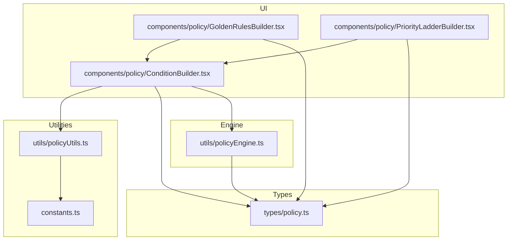
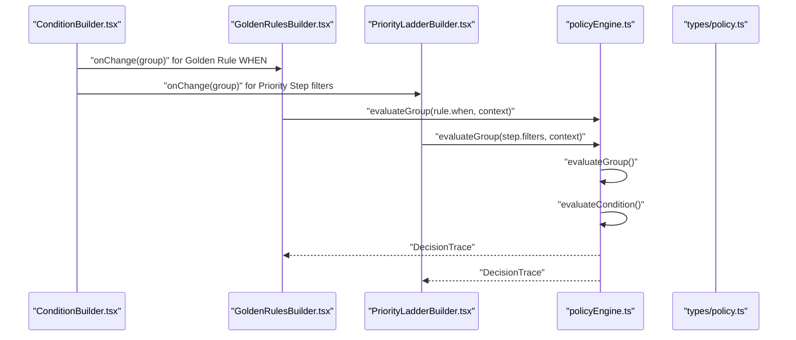
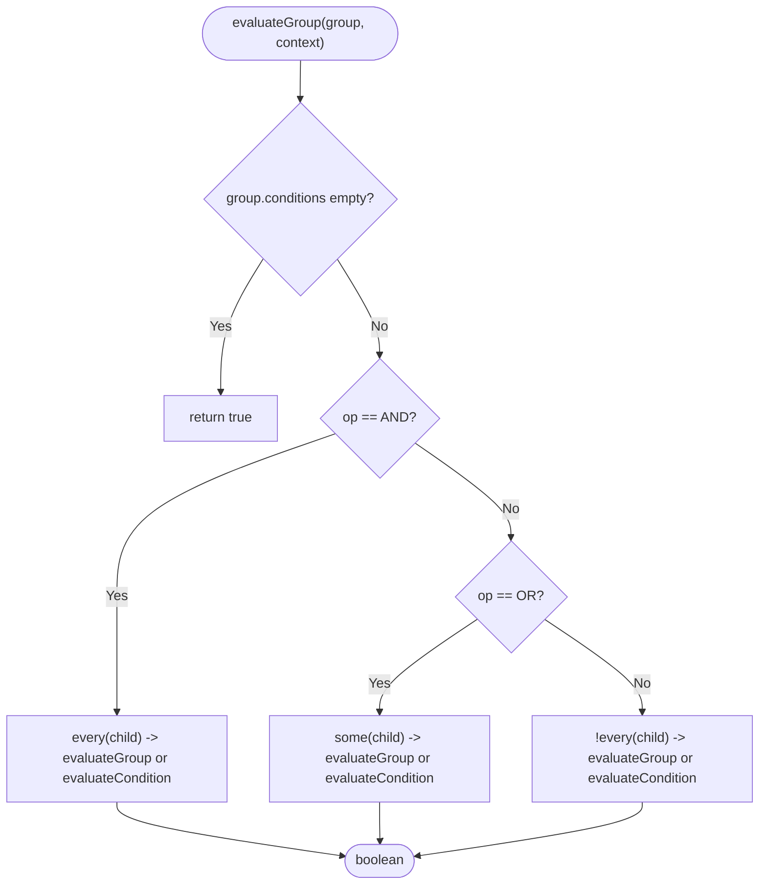
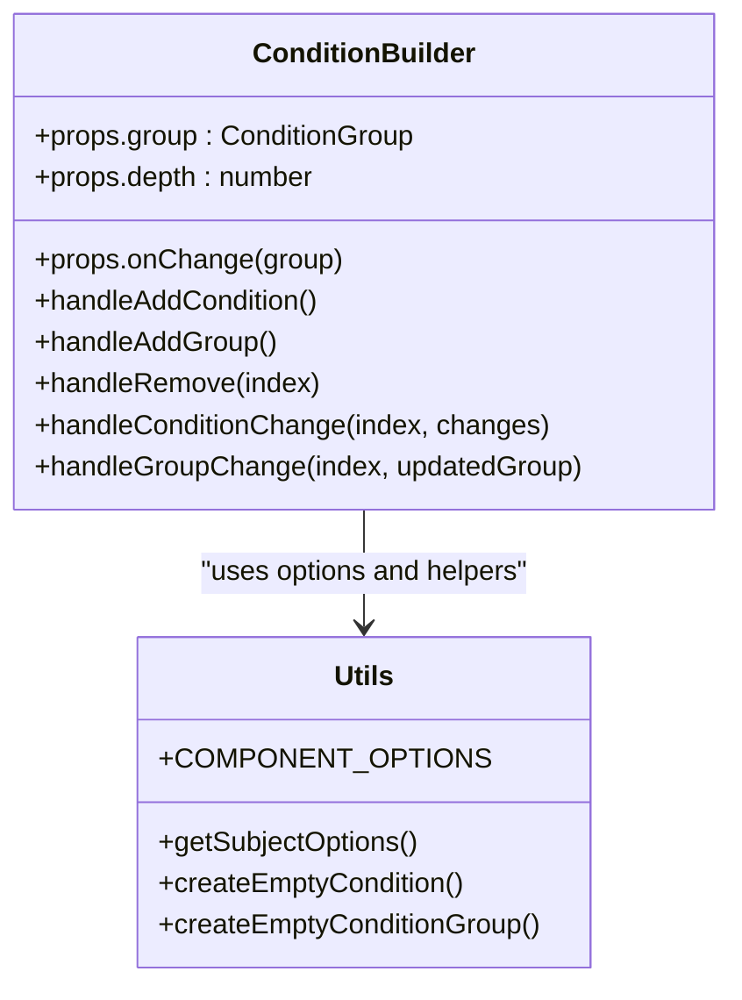
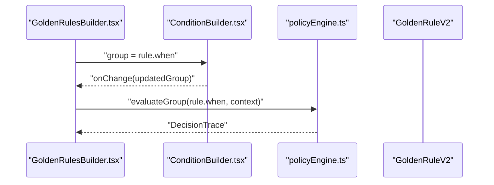
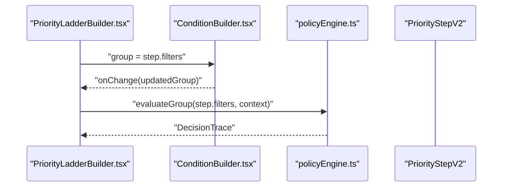
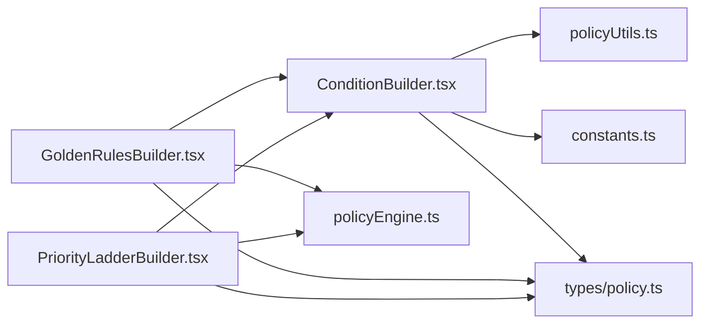

# Condition Builder

<cite>
**Referenced Files in This Document**
- [policy.ts](file://types/policy.ts)
- [policyEngine.ts](file://utils/policyEngine.ts)
- [ConditionBuilder.tsx](file://components/policy/ConditionBuilder.tsx)
- [GoldenRulesBuilder.tsx](file://components/policy/GoldenRulesBuilder.tsx)
- [PriorityLadderBuilder.tsx](file://components/policy/PriorityLadderBuilder.tsx)
- [policyUtils.ts](file://utils/policyUtils.ts)
- [constants.ts](file://constants.ts)
</cite>

## Table of Contents
1. [Introduction](#introduction)
2. [Project Structure](#project-structure)
3. [Core Components](#core-components)
4. [Architecture Overview](#architecture-overview)
5. [Detailed Component Analysis](#detailed-component-analysis)
6. [Dependency Analysis](#dependency-analysis)
7. [Performance Considerations](#performance-considerations)
8. [Troubleshooting Guide](#troubleshooting-guide)
9. [Conclusion](#conclusion)
10. [Appendices](#appendices)

## Introduction
This document explains the Condition Builder component of the Policy Engine. It focuses on how nested condition groups (AND/OR/NAND) are constructed and evaluated to define policy rules. It documents the Condition and ConditionGroup interfaces, the evaluation engine, and how the builder integrates into Golden Rules and Priority Steps. It also covers best practices, pitfalls, and performance considerations for building readable and efficient condition logic.

## Project Structure
The Condition Builder lives in the policy UI layer and integrates with the policy engine. The relevant files are organized as follows:
- Types define the policy model (conditions, groups, rules, steps).
- The policy engine evaluates conditions against runtime context.
- The UI components render the builder and bind it to rule and step definitions.

**Diagram sources**
- [policy.ts](file://types/policy.ts#L1-L162)
- [policyEngine.ts](file://utils/policyEngine.ts#L1-L406)
- [ConditionBuilder.tsx](file://components/policy/ConditionBuilder.tsx#L1-L143)
- [GoldenRulesBuilder.tsx](file://components/policy/GoldenRulesBuilder.tsx#L1-L180)
- [PriorityLadderBuilder.tsx](file://components/policy/PriorityLadderBuilder.tsx#L1-L147)
- [policyUtils.ts](file://utils/policyUtils.ts#L1-L117)
- [constants.ts](file://constants.ts#L1-L120)

**Section sources**
- [policy.ts](file://types/policy.ts#L1-L162)
- [policyEngine.ts](file://utils/policyEngine.ts#L1-L406)
- [ConditionBuilder.tsx](file://components/policy/ConditionBuilder.tsx#L1-L143)
- [GoldenRulesBuilder.tsx](file://components/policy/GoldenRulesBuilder.tsx#L1-L180)
- [PriorityLadderBuilder.tsx](file://components/policy/PriorityLadderBuilder.tsx#L1-L147)
- [policyUtils.ts](file://utils/policyUtils.ts#L1-L117)
- [constants.ts](file://constants.ts#L1-L120)

## Core Components
- Condition: A leaf node representing a single constraint with five axes:
  - teacherType
  - lessonType
  - subject
  - timeContext
  - relationship
- ConditionGroup: A composite node that holds an operator (AND/OR/NAND) and a list of child conditions or nested groups.
- Evaluation engine:
  - evaluateCondition: Applies a single condition against runtime context.
  - evaluateGroup: Recursively evaluates a group using logical operators.
- UI builder:
  - ConditionBuilder.tsx renders a tree of conditions and groups, exposes add/remove actions, and updates parent groups via callbacks.

Key usage patterns:
- Golden Rules define WHEN conditions and THEN effects.
- Priority Steps define filters (matching conditions) and scoring modifiers.

**Section sources**
- [policy.ts](file://types/policy.ts#L1-L162)
- [policyEngine.ts](file://utils/policyEngine.ts#L204-L253)
- [ConditionBuilder.tsx](file://components/policy/ConditionBuilder.tsx#L1-L143)
- [GoldenRulesBuilder.tsx](file://components/policy/GoldenRulesBuilder.tsx#L145-L168)
- [PriorityLadderBuilder.tsx](file://components/policy/PriorityLadderBuilder.tsx#L116-L120)

## Architecture Overview
The Condition Builder composes nested logic trees that are evaluated by the policy engine against a built runtime context.

**Diagram sources**
- [ConditionBuilder.tsx](file://components/policy/ConditionBuilder.tsx#L1-L143)
- [GoldenRulesBuilder.tsx](file://components/policy/GoldenRulesBuilder.tsx#L145-L168)
- [PriorityLadderBuilder.tsx](file://components/policy/PriorityLadderBuilder.tsx#L116-L120)
- [policyEngine.ts](file://utils/policyEngine.ts#L204-L253)
- [policy.ts](file://types/policy.ts#L1-L162)

## Detailed Component Analysis

### Condition and ConditionGroup Interfaces
- Condition fields:
  - teacherType: internal | external | any
  - lessonType: actual | individual | stay | shared | any
  - subject: string (supports any)
  - timeContext: same_day_stay | before_end | after_end | emergency | during_school | is_immune_period | any
  - relationship: same_class | same_grade | same_homeroom | is_homeroom | same_subject | same_domain | continuity_match | any
- ConditionGroup fields:
  - id: unique identifier
  - op: AND | OR | NAND
  - conditions: array of Condition or nested ConditionGroup

These interfaces are used by GoldenRuleV2.when and PriorityStepV2.filters.

**Section sources**
- [policy.ts](file://types/policy.ts#L1-L162)

### Evaluation Engine: evaluateCondition and evaluateGroup
- evaluateCondition applies each axis of the condition against the runtime context:
  - teacherType: compares against context.teacher.type
  - lessonType: checks slot state or shared flag
  - subject: checks inclusion against context.slot.subject
  - timeContext: checks presence flags like during_school, is_immune_period, same_day_stay
  - relationship: checks flags like same_subject, same_domain, continuity_match, is_homeroom, same_class, same_grade
- evaluateGroup:
  - AND: all children must evaluate to true
  - OR: at least one child must evaluate to true
  - NAND: negation of AND (not all children true)

**Diagram sources**
- [policyEngine.ts](file://utils/policyEngine.ts#L243-L252)

**Section sources**
- [policyEngine.ts](file://utils/policyEngine.ts#L204-L253)

### ConditionBuilder.tsx: User-Friendly Logic Tree Construction
- Renders a hierarchical tree of conditions and groups.
- Supports adding/removing conditions and nested groups.
- Provides operator toggles (AND/OR) per group.
- Uses COMPONENT_OPTIONS and subject options from policyUtils.ts and constants.ts.
- Emits onChange(group) updates to parent editors.

**Diagram sources**
- [ConditionBuilder.tsx](file://components/policy/ConditionBuilder.tsx#L1-L143)
- [policyUtils.ts](file://utils/policyUtils.ts#L1-L117)
- [constants.ts](file://constants.ts#L11-L12)

**Section sources**
- [ConditionBuilder.tsx](file://components/policy/ConditionBuilder.tsx#L1-L143)
- [policyUtils.ts](file://utils/policyUtils.ts#L1-L117)
- [constants.ts](file://constants.ts#L11-L12)

### Golden Rules Integration
- GoldenRulesBuilder initializes mandatory rules and allows editing GoldenRuleV2 entries.
- The WHEN clause is a ConditionGroup edited via ConditionBuilder.
- The policy engine evaluates rule.when against the runtime context and applies THEN effects accordingly.

**Diagram sources**
- [GoldenRulesBuilder.tsx](file://components/policy/GoldenRulesBuilder.tsx#L145-L168)
- [ConditionBuilder.tsx](file://components/policy/ConditionBuilder.tsx#L1-L143)
- [policyEngine.ts](file://utils/policyEngine.ts#L347-L367)

**Section sources**
- [GoldenRulesBuilder.tsx](file://components/policy/GoldenRulesBuilder.tsx#L1-L180)
- [policyEngine.ts](file://utils/policyEngine.ts#L347-L367)

### Priority Steps Integration
- PriorityLadderBuilder edits PriorityStepV2 entries.
- The filters property is a ConditionGroup edited via ConditionBuilder.
- The engine evaluates step.filters to compute weighted scores.

**Diagram sources**
- [PriorityLadderBuilder.tsx](file://components/policy/PriorityLadderBuilder.tsx#L116-L120)
- [ConditionBuilder.tsx](file://components/policy/ConditionBuilder.tsx#L1-L143)
- [policyEngine.ts](file://utils/policyEngine.ts#L368-L395)

**Section sources**
- [PriorityLadderBuilder.tsx](file://components/policy/PriorityLadderBuilder.tsx#L1-L147)
- [policyEngine.ts](file://utils/policyEngine.ts#L368-L395)

## Dependency Analysis
- ConditionBuilder depends on:
  - policyUtils.ts for options and helpers
  - constants.ts for subject options
  - types/policy.ts for Condition and ConditionGroup
- GoldenRulesBuilder and PriorityLadderBuilder depend on:
  - ConditionBuilder for editing WHEN/filters
  - policyEngine.ts for evaluation
  - types/policy.ts for rule and step models

**Diagram sources**
- [ConditionBuilder.tsx](file://components/policy/ConditionBuilder.tsx#L1-L143)
- [GoldenRulesBuilder.tsx](file://components/policy/GoldenRulesBuilder.tsx#L1-L180)
- [PriorityLadderBuilder.tsx](file://components/policy/PriorityLadderBuilder.tsx#L1-L147)
- [policyUtils.ts](file://utils/policyUtils.ts#L1-L117)
- [constants.ts](file://constants.ts#L11-L12)
- [policyEngine.ts](file://utils/policyEngine.ts#L1-L406)
- [policy.ts](file://types/policy.ts#L1-L162)

**Section sources**
- [ConditionBuilder.tsx](file://components/policy/ConditionBuilder.tsx#L1-L143)
- [GoldenRulesBuilder.tsx](file://components/policy/GoldenRulesBuilder.tsx#L1-L180)
- [PriorityLadderBuilder.tsx](file://components/policy/PriorityLadderBuilder.tsx#L1-L147)
- [policyEngine.ts](file://utils/policyEngine.ts#L1-L406)
- [policy.ts](file://types/policy.ts#L1-L162)
- [policyUtils.ts](file://utils/policyUtils.ts#L1-L117)
- [constants.ts](file://constants.ts#L11-L12)

## Performance Considerations
- Complexity:
  - evaluateGroup runs in O(n) with respect to the number of conditions in a group.
  - Nested groups increase branching; deep trees can grow exponentially in worst-case evaluations.
- Optimization tips:
  - Prefer shallow trees with clear grouping to reduce recursion depth.
  - Place the most discriminative conditions early to leverage short-circuit evaluation (AND/OR).
  - Avoid redundant conditions; reuse computed flags from the context where possible.
- Practical guidance:
  - Keep groups balanced; avoid extremely long lists under a single operator.
  - Use exceptions sparingly; they add extra evaluation passes.
  - Monitor trace sizes and avoid overly verbose breakdown messages in production.

[No sources needed since this section provides general guidance]

## Troubleshooting Guide
Common pitfalls and remedies:
- Infinite nesting:
  - Symptom: Very deep trees causing slow evaluation.
  - Fix: Limit nesting depth; prefer flattening with explicit AND/OR logic.
- Contradictory conditions:
  - Symptom: Conditions that negate each other lead to unexpected results.
  - Fix: Review operator combinations; ensure AND/OR logic aligns with intent.
- Performance impacts:
  - Symptom: Slow evaluation in complex scenarios.
  - Fix: Simplify trees, remove redundant checks, and cache context-derived flags when appropriate.
- Operator confusion (NAND):
  - Symptom: Unexpected rejections under NAND.
  - Fix: Understand NAND as “not all true”; test with small subsets first.

**Section sources**
- [policyEngine.ts](file://utils/policyEngine.ts#L243-L252)

## Conclusion
The Condition Builder provides a powerful, user-friendly way to construct nested boolean logic for policy rules. By combining Condition and ConditionGroup interfaces with a recursive evaluation engine, it enables expressive policy definitions used in Golden Rules and Priority Steps. Following best practices ensures readability, maintainability, and performance.

[No sources needed since this section summarizes without analyzing specific files]

## Appendices

### Best Practices for Writing Conditions
- Keep trees shallow and readable; prefer explicit grouping over deep nesting.
- Place discriminative conditions first to improve performance.
- Use exceptions judiciously to handle edge cases.
- Test with representative scenarios and review trace outputs.

[No sources needed since this section provides general guidance]