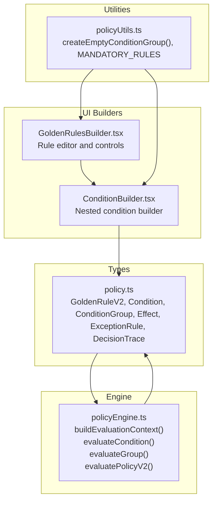
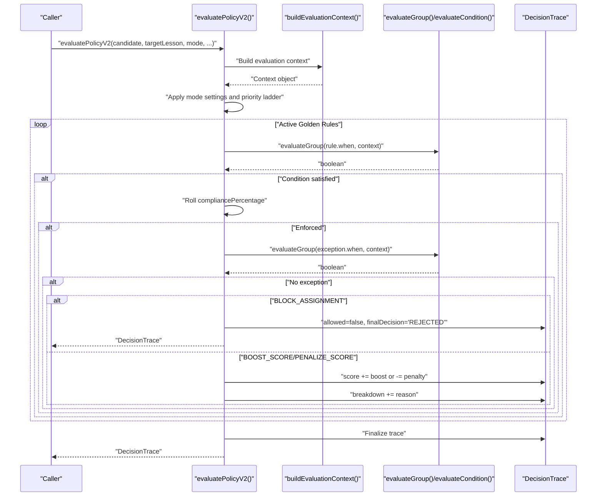
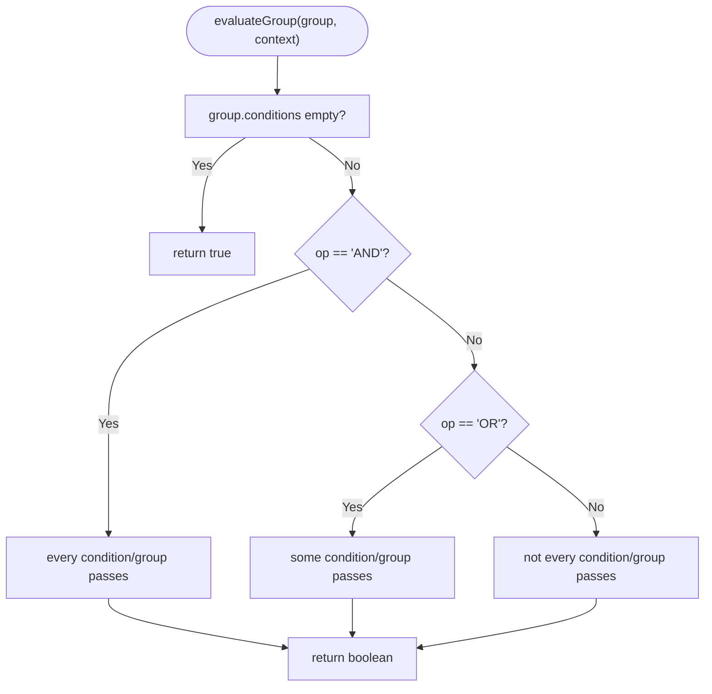
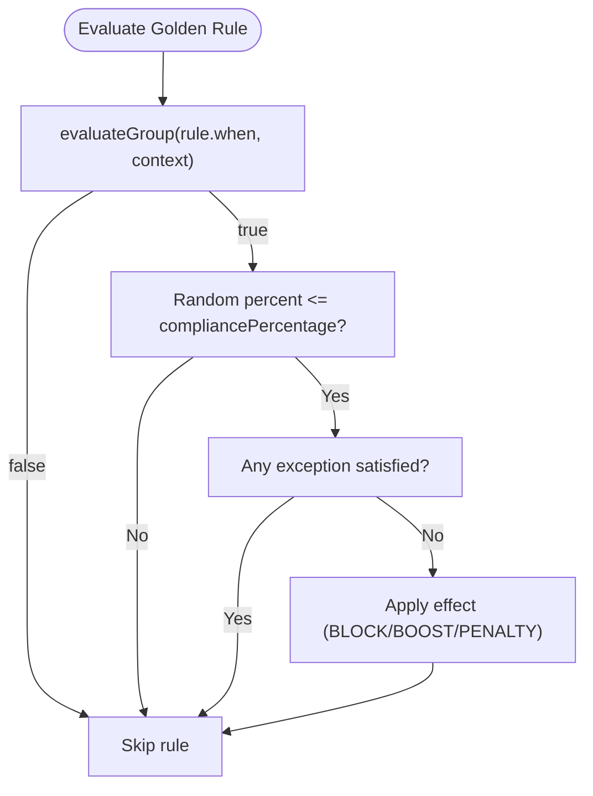
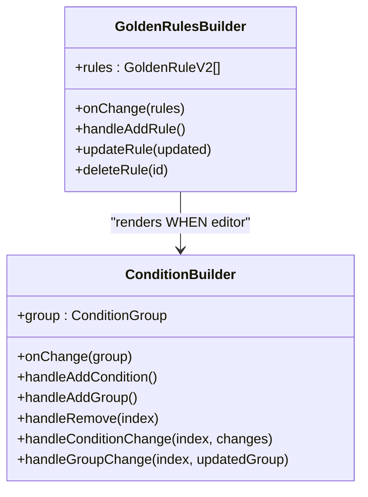
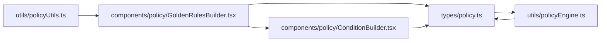

# Golden Rules

<cite>
**Referenced Files in This Document**
- [policyEngine.ts](file://utils/policyEngine.ts)
- [GoldenRulesBuilder.tsx](file://components/policy/GoldenRulesBuilder.tsx)
- [ConditionBuilder.tsx](file://components/policy/ConditionBuilder.tsx)
- [policyUtils.ts](file://utils/policyUtils.ts)
- [policy.ts](file://types/policy.ts)
- [constants.ts](file://constants.ts)
</cite>

## Table of Contents
1. [Introduction](#introduction)
2. [Project Structure](#project-structure)
3. [Core Components](#core-components)
4. [Architecture Overview](#architecture-overview)
5. [Detailed Component Analysis](#detailed-component-analysis)
6. [Dependency Analysis](#dependency-analysis)
7. [Performance Considerations](#performance-considerations)
8. [Troubleshooting Guide](#troubleshooting-guide)
9. [Conclusion](#conclusion)

## Introduction
This document explains the Golden Rules feature of the Policy Engine. Golden Rules are enforceable policies that can block assignments or adjust scores based on complex conditions. They are defined in the GoldenRuleV2 model and evaluated during policy decisions using evaluatePolicyV2. The evaluation process considers rule conditions, exceptions, compliance percentages, and integrates with the DecisionTrace to provide explainability and auditability.

## Project Structure
The Golden Rules feature spans several modules:
- Types define the data models for GoldenRuleV2, Condition, ConditionGroup, ExceptionRule, Effect, and DecisionTrace.
- Policy engine evaluates rules and produces a DecisionTrace.
- UI builders allow administrators to configure Golden Rules and their conditions.

**Diagram sources**
- [policy.ts](file://types/policy.ts#L1-L162)
- [policyEngine.ts](file://utils/policyEngine.ts#L1-L406)
- [GoldenRulesBuilder.tsx](file://components/policy/GoldenRulesBuilder.tsx#L1-L180)
- [ConditionBuilder.tsx](file://components/policy/ConditionBuilder.tsx#L1-L143)
- [policyUtils.ts](file://utils/policyUtils.ts#L1-L117)

**Section sources**
- [policy.ts](file://types/policy.ts#L1-L162)
- [policyEngine.ts](file://utils/policyEngine.ts#L1-L406)
- [GoldenRulesBuilder.tsx](file://components/policy/GoldenRulesBuilder.tsx#L1-L180)
- [ConditionBuilder.tsx](file://components/policy/ConditionBuilder.tsx#L1-L143)
- [policyUtils.ts](file://utils/policyUtils.ts#L1-L117)

## Core Components
- GoldenRuleV2: Defines a single rule with identification, scope, enabling, compliance percentage, severity, and the structure of conditions and effects.
- Condition and ConditionGroup: Provide nested logical conditions (AND/OR/NAND) with attributes for teacher type, lesson type, subject, time context, and relationship.
- Effect: Enumerates actions such as BLOCK_ASSIGNMENT, BOOST_SCORE, PENALIZE_SCORE, and others.
- ExceptionRule: Allows exceptions to Golden Rules with their own when/then clauses.
- DecisionTrace: Captures the evaluation outcome, including allowed flag, score, golden rules applied/violated/blocked, matched/skipped priority steps, metrics snapshot, parameters used, and a textual breakdown.

Key evaluation logic resides in evaluatePolicyV2, which:
- Builds an evaluation context from candidate, target lesson, and logs.
- Applies mode-level settings and priority ladder adjustments.
- Iterates active Golden Rules, checks conditions, enforces compliance percentage, and applies exceptions.
- Updates the DecisionTrace accordingly and returns the final result.

**Section sources**
- [policy.ts](file://types/policy.ts#L1-L162)
- [policyEngine.ts](file://utils/policyEngine.ts#L254-L405)

## Architecture Overview
The Golden Rules evaluation pipeline integrates with the broader policy decision engine. The following sequence diagram maps the actual code paths:

**Diagram sources**
- [policyEngine.ts](file://utils/policyEngine.ts#L254-L405)

**Section sources**
- [policyEngine.ts](file://utils/policyEngine.ts#L254-L405)

## Detailed Component Analysis

### GoldenRuleV2 Structure
GoldenRuleV2 encapsulates:
- Identification and metadata: id, name, description, isGlobal, isEnabled, compliancePercentage, randomnessPercentage, severity, override flags, audit requirement, tags.
- Scope: targetScope and optional filters for grades, classIds, days, periods.
- Conditions: when (ConditionGroup) defines the trigger conditions.
- Effects: then (Effect[]) enumerates actions to apply when conditions are met.
- Exceptions: exceptions (ExceptionRule[]) define when a rule does not apply despite satisfied conditions.

Compliance percentages and randomness are surfaced in the UI for configuration.

**Section sources**
- [policy.ts](file://types/policy.ts#L29-L53)
- [GoldenRulesBuilder.tsx](file://components/policy/GoldenRulesBuilder.tsx#L126-L143)

### Condition and ConditionGroup Evaluation
Conditions support:
- teacherType: internal, external, any
- lessonType: actual, individual, stay, shared, any
- subject: free-text match
- timeContext: during_school, same_day_stay, emergency, is_immune_period, any
- relationship: same_class, same_grade, same_homeroom, is_homeroom, same_subject, same_domain, continuity_match, any

ConditionGroup supports:
- op: AND, OR, NAND
- Nested conditions and groups

The evaluation logic:
- evaluateCondition checks each attribute against the context.
- evaluateGroup recursively evaluates nested groups with the chosen operator.

**Diagram sources**
- [policyEngine.ts](file://utils/policyEngine.ts#L243-L252)

**Section sources**
- [policyEngine.ts](file://utils/policyEngine.ts#L205-L252)
- [policy.ts](file://types/policy.ts#L1-L23)

### Effect Types and Exceptions
Effects supported include:
- BLOCK_ASSIGNMENT: immediately rejects the assignment.
- BOOST_SCORE: adds a numeric score adjustment.
- PENALIZE_SCORE: subtracts a numeric score adjustment.
- Other effects such as REQUIRE_SWAP, FORCE_INTERNAL_ONLY, LIMIT_DAILY_COVER, etc., are defined for completeness.

Exceptions allow fine-grained control by redefining when a rule does not apply. The evaluation checks whether any exception’s when clause is satisfied; if so, the rule is not enforced.

**Section sources**
- [policy.ts](file://types/policy.ts#L19-L23)
- [policyEngine.ts](file://utils/policyEngine.ts#L347-L366)

### Compliance Percentages and Soft Enforcement
Compliance percentage determines whether a rule is enforced on a given evaluation. The engine rolls a random percent against the configured compliancePercentage; if satisfied, the rule is enforced. This enables soft enforcement where rules are probabilistically applied, useful for gradual adoption or human-like bias.

**Diagram sources**
- [policyEngine.ts](file://utils/policyEngine.ts#L347-L366)

**Section sources**
- [policyEngine.ts](file://utils/policyEngine.ts#L347-L366)

### DecisionTrace Integration
DecisionTrace captures:
- Audit trail identifier and timestamp
- Active mode id
- allowed flag and finalDecision
- score and rawScore
- Lists of golden rules applied/violated/blocked
- Priority ladder matched/skipped
- Metrics snapshot and parameters used
- Textual breakdown of decisions

The engine updates the trace throughout evaluation, including adding reasons for blocking, bonuses, and penalties.

**Section sources**
- [policy.ts](file://types/policy.ts#L140-L162)
- [policyEngine.ts](file://utils/policyEngine.ts#L254-L405)

### UI Configuration with GoldenRulesBuilder and ConditionBuilder
GoldenRulesBuilder provides:
- Mandatory rule enforcement (ensuring critical rules are present)
- Add/edit/delete rules
- Toggle enablement and severity
- Configure compliancePercentage and randomnessPercentage
- Define WHEN conditions via nested ConditionBuilder
- Select THEN effects (BLOCK_ASSIGNMENT, BOOST_SCORE, PENALIZE_SCORE, etc.)

ConditionBuilder supports:
- Switching group operators (AND/OR)
- Adding/removing conditions and nested groups
- Editing attributes for each condition row

**Diagram sources**
- [GoldenRulesBuilder.tsx](file://components/policy/GoldenRulesBuilder.tsx#L1-L180)
- [ConditionBuilder.tsx](file://components/policy/ConditionBuilder.tsx#L1-L143)

**Section sources**
- [GoldenRulesBuilder.tsx](file://components/policy/GoldenRulesBuilder.tsx#L1-L180)
- [ConditionBuilder.tsx](file://components/policy/ConditionBuilder.tsx#L1-L143)
- [policyUtils.ts](file://utils/policyUtils.ts#L52-L56)

### Mandatory Rules and Defaults
policyUtils defines MANDATORY_RULES with critical Golden Rules (e.g., protection of stay slots and sanctity of actual lessons). The builder ensures these mandatory rules are always present and cannot be deleted.

**Section sources**
- [policyUtils.ts](file://utils/policyUtils.ts#L58-L117)
- [GoldenRulesBuilder.tsx](file://components/policy/GoldenRulesBuilder.tsx#L16-L23)

## Dependency Analysis
The Golden Rules feature depends on:
- Types for rule and evaluation models
- Policy engine for evaluation and trace creation
- UI builders for configuration
- Utilities for default rule sets and condition scaffolding

**Diagram sources**
- [policy.ts](file://types/policy.ts#L1-L162)
- [policyEngine.ts](file://utils/policyEngine.ts#L1-L406)
- [GoldenRulesBuilder.tsx](file://components/policy/GoldenRulesBuilder.tsx#L1-L180)
- [ConditionBuilder.tsx](file://components/policy/ConditionBuilder.tsx#L1-L143)
- [policyUtils.ts](file://utils/policyUtils.ts#L1-L117)

**Section sources**
- [policy.ts](file://types/policy.ts#L1-L162)
- [policyEngine.ts](file://utils/policyEngine.ts#L1-L406)
- [GoldenRulesBuilder.tsx](file://components/policy/GoldenRulesBuilder.tsx#L1-L180)
- [ConditionBuilder.tsx](file://components/policy/ConditionBuilder.tsx#L1-L143)
- [policyUtils.ts](file://utils/policyUtils.ts#L1-L117)

## Performance Considerations
- Nested conditions: evaluateGroup recurses into nested groups. Deep nesting increases evaluation cost. Prefer flattening where possible.
- Compliance roll: Each active rule triggers a random roll. With many rules, this adds overhead. Consider limiting active rules or pre-filtering by scope.
- Exceptions: Each rule with exceptions incurs an extra evaluation pass for exceptions. Keep exception sets minimal and targeted.
- Context building: buildEvaluationContext computes derived metrics (loads, streaks, domains). Reuse where feasible or cache results if evaluation is repeated for the same inputs.
- Early exits: evaluatePolicyV2 short-circuits on BLOCK_ASSIGNMENT. This reduces unnecessary computation for subsequent rules.

[No sources needed since this section provides general guidance]

## Troubleshooting Guide
Common issues and resolutions:
- Rule conflicts
  - Symptom: Multiple rules block or modify the same assignment.
  - Resolution: Use exceptions to exempt specific scenarios. Adjust compliancePercentage to reduce enforcement overlap. Review rule WHEN conditions to minimize overlap.
  - Evidence: evaluatePolicyV2 applies BLOCK_ASSIGNMENT immediately upon satisfaction and returns early.

- Exception handling
  - Symptom: Rule still applies despite intended exemption.
  - Resolution: Verify exception WHEN conditions are correctly nested and match the context. Confirm evaluateGroup uses the same operator semantics.
  - Evidence: evaluatePolicyV2 checks exceptions before applying effects.

- Debugging evaluation
  - Use DecisionTrace.breakdown to inspect textual reasons for blocking, bonuses, and penalties.
  - Inspect DecisionTrace.metricsSnapshot and parametersUsed to confirm context values.
  - Verify compliancePercentage and randomnessPercentage in the UI; ensure they reflect expectations.

- Randomness and soft enforcement
  - Symptom: Assignment sometimes passes despite violating a rule.
  - Resolution: Lower compliancePercentage to increase enforcement. Alternatively, remove randomnessPercentage to eliminate probabilistic behavior.
  - Evidence: evaluatePolicyV2 compares a random percent to compliancePercentage.

- Mode settings interference
  - Symptom: Assignment blocked by mode settings before Golden Rules.
  - Resolution: Review mode settings (e.g., disabling external staff, disabling stay/individual) and adjust as needed.
  - Evidence: evaluatePolicyV2 applies mode settings before Golden Rules.

**Section sources**
- [policyEngine.ts](file://utils/policyEngine.ts#L296-L366)
- [policy.ts](file://types/policy.ts#L140-L162)

## Conclusion
Golden Rules provide a powerful, configurable mechanism to enforce policies and influence scoring. Their structure supports complex nested conditions, exceptions, and probabilistic enforcement. The policy engine integrates these rules into a comprehensive decision pipeline, capturing detailed traces for transparency and auditing. The UI builders streamline configuration, while utilities ensure critical rules remain intact. By understanding the evaluation flow, compliance mechanics, and trace integration, administrators can effectively tune Golden Rules for their operational needs.