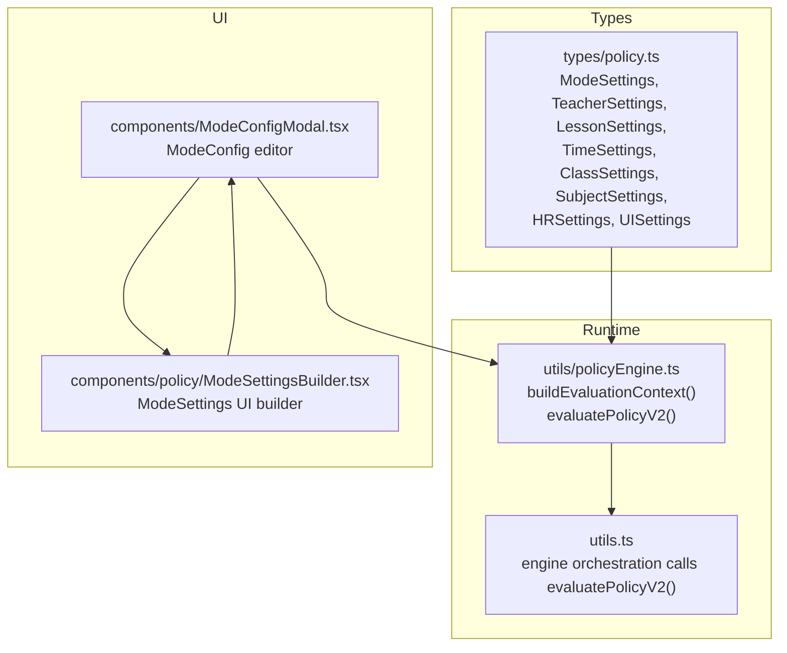
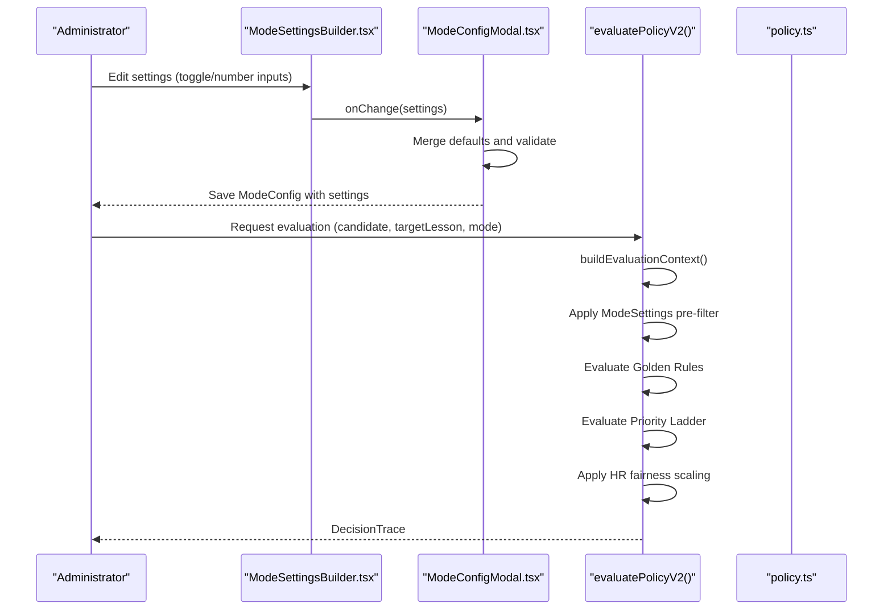
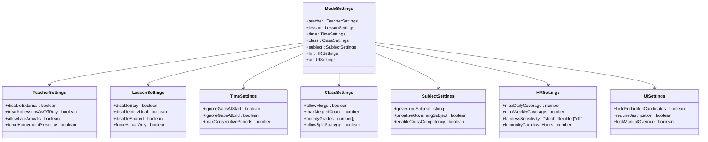
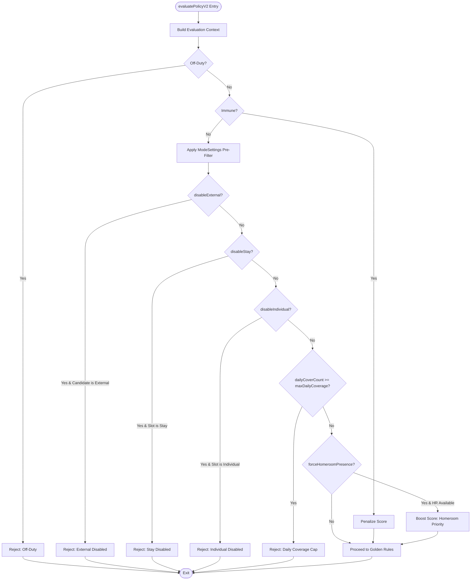
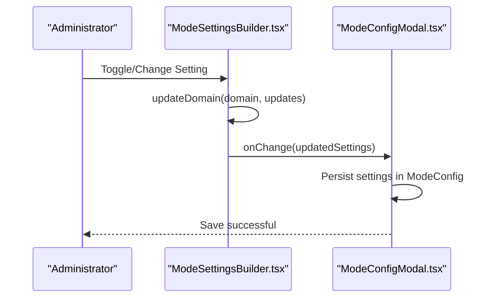
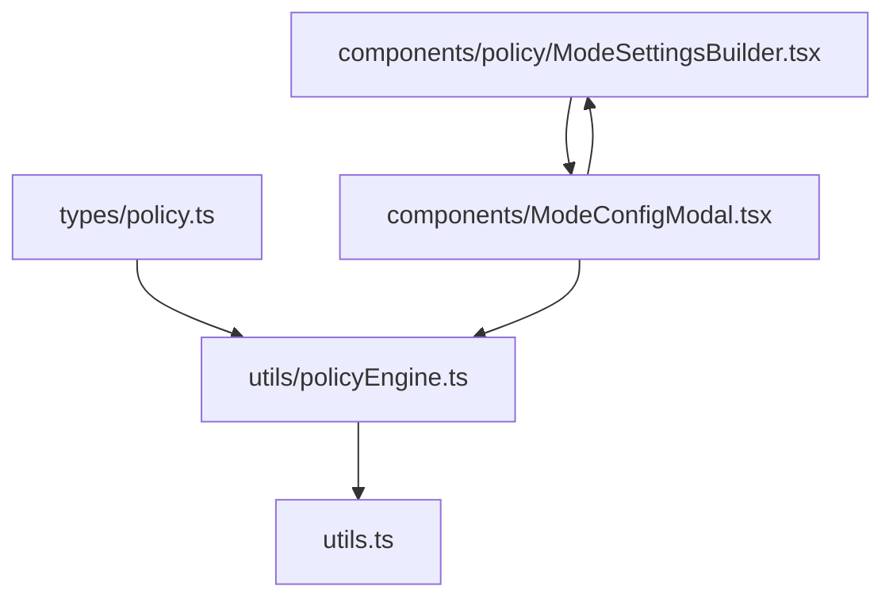

# Mode Settings

<cite>
**Referenced Files in This Document**
- [policy.ts](file://types/policy.ts)
- [policyEngine.ts](file://utils/policyEngine.ts)
- [ModeSettingsBuilder.tsx](file://components/policy/ModeSettingsBuilder.tsx)
- [ModeConfigModal.tsx](file://components/ModeConfigModal.tsx)
- [constants.ts](file://constants.ts)
- [utils.ts](file://utils.ts)
</cite>

## Table of Contents
1. [Introduction](#introduction)
2. [Project Structure](#project-structure)
3. [Core Components](#core-components)
4. [Architecture Overview](#architecture-overview)
5. [Detailed Component Analysis](#detailed-component-analysis)
6. [Dependency Analysis](#dependency-analysis)
7. [Performance Considerations](#performance-considerations)
8. [Troubleshooting Guide](#troubleshooting-guide)
9. [Conclusion](#conclusion)
10. [Appendices](#appendices)

## Introduction
Mode Settings is the global configuration layer of the Policy Engine that acts as a pre-filter to shape the substitution eligibility landscape before rule evaluation. It defines operational modes and their associated settings across seven domains: Teacher, Lesson, Time, Class, Subject, HR (Human Resources/Fairness), and UI. Administrators configure these settings to align the engine’s behavior with real-world constraints and priorities, such as disabling external substitutes, restricting lesson types, enforcing homeroom presence, limiting daily coverage, and tuning fairness sensitivity.

These settings are consumed early in evaluatePolicyV2 to quickly reject candidates that violate explicit constraints, reducing unnecessary computation and ensuring predictable outcomes aligned with institutional policies.

## Project Structure
Mode Settings spans type definitions, runtime evaluation, and UI configuration:
- Types define the ModeSettings model and related structures.
- The Policy Engine applies ModeSettings during evaluation.
- The UI builder allows administrators to edit ModeSettings.
- Mode activation integrates ModeSettings into ModeConfig.

**Diagram sources**
- [policy.ts](file://types/policy.ts#L83-L139)
- [policyEngine.ts](file://utils/policyEngine.ts#L255-L405)
- [ModeSettingsBuilder.tsx](file://components/policy/ModeSettingsBuilder.tsx#L1-L226)
- [ModeConfigModal.tsx](file://components/ModeConfigModal.tsx#L50-L90)
- [utils.ts](file://utils.ts#L414-L445)

**Section sources**
- [policy.ts](file://types/policy.ts#L83-L139)
- [policyEngine.ts](file://utils/policyEngine.ts#L255-L405)
- [ModeSettingsBuilder.tsx](file://components/policy/ModeSettingsBuilder.tsx#L1-L226)
- [ModeConfigModal.tsx](file://components/ModeConfigModal.tsx#L50-L90)
- [utils.ts](file://utils.ts#L414-L445)

## Core Components
- ModeSettings: Aggregates all operational settings under seven domains. See [ModeSettings](file://types/policy.ts#L131-L139).
- TeacherSettings: Controls external staff usage, off-duty behavior, and homeroom presence. See [TeacherSettings](file://types/policy.ts#L85-L90).
- LessonSettings: Restricts lesson types and enforces actual-only swaps. See [LessonSettings](file://types/policy.ts#L92-L97).
- TimeSettings: Manages gap handling and maximum consecutive periods. See [TimeSettings](file://types/policy.ts#L99-L103).
- ClassSettings: Enables merging and splitting strategies. See [ClassSettings](file://types/policy.ts#L105-L110).
- SubjectSettings: Governs governing subject and cross-competency prioritization. See [SubjectSettings](file://types/policy.ts#L112-L116).
- HRSettings: Daily/weekly coverage caps and fairness sensitivity. See [HRSettings](file://types/policy.ts#L118-L123).
- UISettings: UI behavior toggles for visibility and overrides. See [UISettings](file://types/policy.ts#L125-L129).

How ModeSettings influences evaluatePolicyV2:
- Early rejections: Off-duty status and immunity are checked first. See [evaluatePolicyV2](file://utils/policyEngine.ts#L296-L307).
- Pre-filtering: Settings are evaluated before Golden Rules and Priority Ladder. See [evaluatePolicyV2](file://utils/policyEngine.ts#L309-L345).
- Fairness scaling: Final fairness penalties are applied post-scoring. See [evaluatePolicyV2](file://utils/policyEngine.ts#L397-L402).

**Section sources**
- [policy.ts](file://types/policy.ts#L83-L139)
- [policyEngine.ts](file://utils/policyEngine.ts#L296-L402)

## Architecture Overview
Mode Settings sits between the UI and the Policy Engine:
- Administrators configure ModeSettings in the Mode Config Modal using ModeSettingsBuilder.
- ModeConfigModal merges defaults and persists settings into ModeConfig.
- The engine builds context and evaluates ModeSettings early, then applies Golden Rules and Priority Ladder.

**Diagram sources**
- [ModeSettingsBuilder.tsx](file://components/policy/ModeSettingsBuilder.tsx#L1-L226)
- [ModeConfigModal.tsx](file://components/ModeConfigModal.tsx#L50-L90)
- [policyEngine.ts](file://utils/policyEngine.ts#L255-L405)
- [policy.ts](file://types/policy.ts#L83-L139)

## Detailed Component Analysis

### ModeSettings Model and Domains
ModeSettings aggregates domain-specific configurations. Each domain encapsulates a cohesive set of constraints and preferences.

**Diagram sources**
- [policy.ts](file://types/policy.ts#L83-L139)

**Section sources**
- [policy.ts](file://types/policy.ts#L83-L139)

### Early Filtering in evaluatePolicyV2
ModeSettings is applied in evaluatePolicyV2 as a pre-filter to quickly eliminate ineligible candidates and reduce downstream computation.

Key pre-filter checks:
- Off-duty and immunity: Immediate rejection if the teacher is off-duty or immune (except emergency mode). See [evaluatePolicyV2](file://utils/policyEngine.ts#L296-L307).
- External staff restriction: Reject external candidates when disableExternal is enabled. See [evaluatePolicyV2](file://utils/policyEngine.ts#L311-L311).
- Lesson-type restrictions: Reject stay or individual slots when disabled. See [evaluatePolicyV2](file://utils/policyEngine.ts#L312-L314).
- Daily coverage cap: Reject if daily coverage meets or exceeds maxDailyCoverage. See [evaluatePolicyV2](file://utils/policyEngine.ts#L314-L314).
- Homeroom priority: Boost scores for homeroom teachers in specific slot states when forceHomeroomPresence is enabled. See [evaluatePolicyV2](file://utils/policyEngine.ts#L318-L329).
- Governing subject prioritization: Boost scores for candidates who match the governing subject or support roaming specialists. See [evaluatePolicyV2](file://utils/policyEngine.ts#L331-L344).

**Diagram sources**
- [policyEngine.ts](file://utils/policyEngine.ts#L296-L345)

**Section sources**
- [policyEngine.ts](file://utils/policyEngine.ts#L296-L345)

### UI Configuration via ModeSettingsBuilder
Administrators configure ModeSettings through ModeSettingsBuilder, which renders domain-specific sections with toggles and numeric inputs. The component updates settings via updateDomain and invokes onChange to propagate changes upward.

Highlights:
- Teacher domain toggles: disableExternal, treatNoLessonsAsOffDuty, forceHomeroomPresence. See [ModeSettingsBuilder](file://components/policy/ModeSettingsBuilder.tsx#L66-L85).
- Lesson domain toggles: disableStay, disableIndividual, forceActualOnly. See [ModeSettingsBuilder](file://components/policy/ModeSettingsBuilder.tsx#L87-L109).
- Time domain: ignoreGapsAtStart, ignoreGapsAtEnd, maxConsecutivePeriods. See [ModeSettingsBuilder](file://components/policy/ModeSettingsBuilder.tsx#L111-L129).
- Class domain: allowMerge and maxMergedCount. See [ModeSettingsBuilder](file://components/policy/ModeSettingsBuilder.tsx#L131-L146).
- Subject domain: governingSubject and prioritizeGoverningSubject. See [ModeSettingsBuilder](file://components/policy/ModeSettingsBuilder.tsx#L148-L166).
- HR domain: maxDailyCoverage and fairnessSensitivity. See [ModeSettingsBuilder](file://components/policy/ModeSettingsBuilder.tsx#L167-L187).
- UI domain: hideForbiddenCandidates, lockManualOverride, requireJustification. See [ModeSettingsBuilder](file://components/policy/ModeSettingsBuilder.tsx#L189-L209).

**Diagram sources**
- [ModeSettingsBuilder.tsx](file://components/policy/ModeSettingsBuilder.tsx#L1-L226)
- [ModeConfigModal.tsx](file://components/ModeConfigModal.tsx#L241-L243)

**Section sources**
- [ModeSettingsBuilder.tsx](file://components/policy/ModeSettingsBuilder.tsx#L1-L226)
- [ModeConfigModal.tsx](file://components/ModeConfigModal.tsx#L241-L243)

### Interaction Between Settings and Other Policy Components
- HR settings and fairness:
  - fairnessSensitivity scales the final score based on deviation from average load. See [evaluatePolicyV2](file://utils/policyEngine.ts#L397-L402).
  - maxDailyCoverage participates in the pre-filter to reject candidates exceeding the cap. See [evaluatePolicyV2](file://utils/policyEngine.ts#L314-L314).
- Subject settings and specialization:
  - governingSubject enables targeted prioritization and support for roaming specialists. See [evaluatePolicyV2](file://utils/policyEngine.ts#L331-L344).
- Class settings and distribution:
  - allowSplitStrategy influences fallback distribution decisions when no strong candidate is found. See [utils.ts](file://utils.ts#L430-L442).

**Section sources**
- [policyEngine.ts](file://utils/policyEngine.ts#L397-L402)
- [policyEngine.ts](file://utils/policyEngine.ts#L314-L314)
- [policyEngine.ts](file://utils/policyEngine.ts#L331-L344)
- [utils.ts](file://utils.ts#L430-L442)

### Best Practices for Thresholds and Feature Enablement
- Disable external staff when security or policy requires internal-only coverage (e.g., exams). See [evaluatePolicyV2](file://utils/policyEngine.ts#L311-L311).
- Use maxDailyCoverage to balance workload and prevent burnout; adjust based on historical substitution logs. See [evaluatePolicyV2](file://utils/policyEngine.ts#L314-L314).
- Enable forceHomeroomPresence to prioritize classroom continuity during critical periods. See [evaluatePolicyV2](file://utils/policyEngine.ts#L318-L329).
- Tune fairness sensitivity:
  - strict: penalize deviations above a small threshold to enforce equity.
  - flexible: apply milder penalties for larger deviations.
  - off: disable fairness scaling. See [evaluatePolicyV2](file://utils/policyEngine.ts#L397-L402).
- Align governingSubject with exam or critical subjects to prioritize subject specialists and enable support proctoring. See [evaluatePolicyV2](file://utils/policyEngine.ts#L331-L344).
- Combine class.merge and split strategies with ModeSettings to manage capacity and distribution. See [utils.ts](file://utils.ts#L430-L442).

**Section sources**
- [policyEngine.ts](file://utils/policyEngine.ts#L311-L311)
- [policyEngine.ts](file://utils/policyEngine.ts#L314-L314)
- [policyEngine.ts](file://utils/policyEngine.ts#L318-L329)
- [policyEngine.ts](file://utils/policyEngine.ts#L397-L402)
- [policyEngine.ts](file://utils/policyEngine.ts#L331-L344)
- [utils.ts](file://utils.ts#L430-L442)

## Dependency Analysis
ModeSettings depends on and interacts with several parts of the system:

**Diagram sources**
- [policy.ts](file://types/policy.ts#L83-L139)
- [policyEngine.ts](file://utils/policyEngine.ts#L255-L405)
- [ModeSettingsBuilder.tsx](file://components/policy/ModeSettingsBuilder.tsx#L1-L226)
- [ModeConfigModal.tsx](file://components/ModeConfigModal.tsx#L50-L90)
- [utils.ts](file://utils.ts#L414-L445)

**Section sources**
- [policy.ts](file://types/policy.ts#L83-L139)
- [policyEngine.ts](file://utils/policyEngine.ts#L255-L405)
- [ModeSettingsBuilder.tsx](file://components/policy/ModeSettingsBuilder.tsx#L1-L226)
- [ModeConfigModal.tsx](file://components/ModeConfigModal.tsx#L50-L90)
- [utils.ts](file://utils.ts#L414-L445)

## Performance Considerations
- Early filtering reduces rule evaluation overhead by rejecting clearly invalid candidates quickly. See [evaluatePolicyV2](file://utils/policyEngine.ts#L296-L345).
- Fairness scaling is a constant-time operation applied once at the end. See [evaluatePolicyV2](file://utils/policyEngine.ts#L397-L402).
- UI toggles and numeric inputs are lightweight; defaults ensure minimal configuration friction. See [ModeConfigModal.tsx](file://components/ModeConfigModal.tsx#L50-L90).

[No sources needed since this section provides general guidance]

## Troubleshooting Guide
- Candidates unexpectedly rejected:
  - Verify disableExternal and lesson-type restrictions. See [evaluatePolicyV2](file://utils/policyEngine.ts#L311-L314).
  - Check maxDailyCoverage and dailyCoverCount. See [evaluatePolicyV2](file://utils/policyEngine.ts#L314-L314).
  - Confirm off-duty or immunity states. See [evaluatePolicyV2](file://utils/policyEngine.ts#L296-L307).
- Unexpected fairness penalties:
  - Review fairnessSensitivity and deviation from average load. See [evaluatePolicyV2](file://utils/policyEngine.ts#L397-L402).
- Subject-related prioritization not taking effect:
  - Ensure governingSubject is set and matches the target subject. See [evaluatePolicyV2](file://utils/policyEngine.ts#L331-L344).
- UI shows forbidden candidates:
  - Adjust hideForbiddenCandidates and lockManualOverride. See [ModeSettingsBuilder.tsx](file://components/policy/ModeSettingsBuilder.tsx#L189-L209).

**Section sources**
- [policyEngine.ts](file://utils/policyEngine.ts#L296-L402)
- [ModeSettingsBuilder.tsx](file://components/policy/ModeSettingsBuilder.tsx#L189-L209)

## Conclusion
Mode Settings provides a powerful, centralized mechanism to tailor the Policy Engine’s behavior to operational realities. By applying constraints early, administrators can simplify rule logic, improve explainability, and ensure fair, predictable outcomes. Proper configuration of Teacher, Lesson, Time, Class, Subject, HR, and UI settings enables robust substitution decisions aligned with institutional goals.

[No sources needed since this section summarizes without analyzing specific files]

## Appendices

### Appendix A: Default Settings and Defaults
- Default ModeSettings are merged into ModeConfig to ensure all keys exist. See [ModeConfigModal.tsx](file://components/ModeConfigModal.tsx#L50-L90).
- Constants define default academic year, roles, and schedule configuration. See [constants.ts](file://constants.ts#L23-L82).

**Section sources**
- [ModeConfigModal.tsx](file://components/ModeConfigModal.tsx#L50-L90)
- [constants.ts](file://constants.ts#L23-L82)