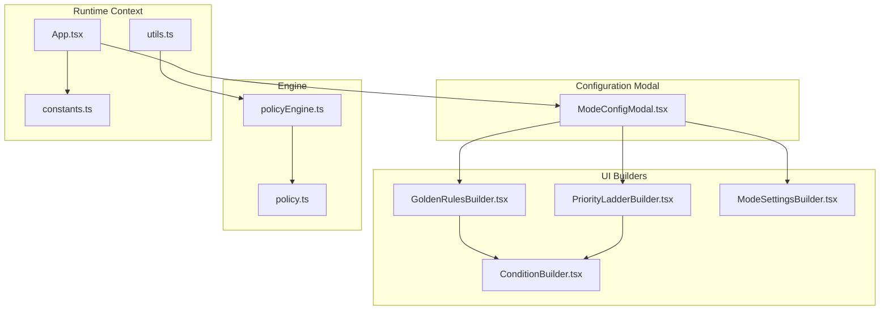
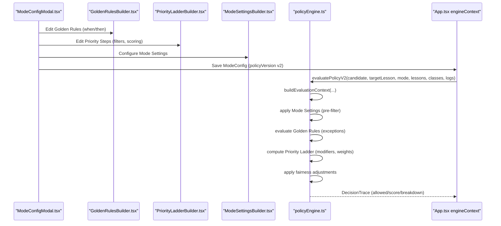
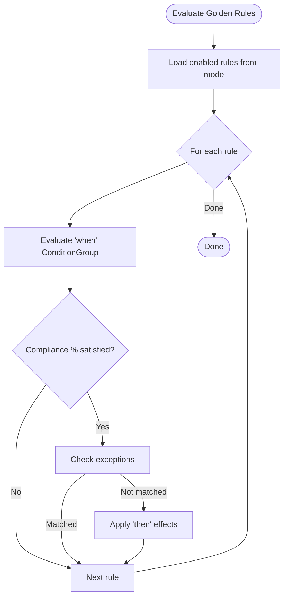
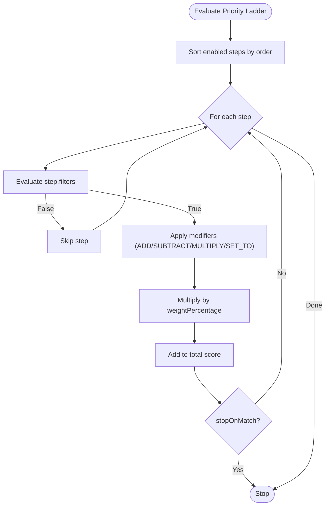
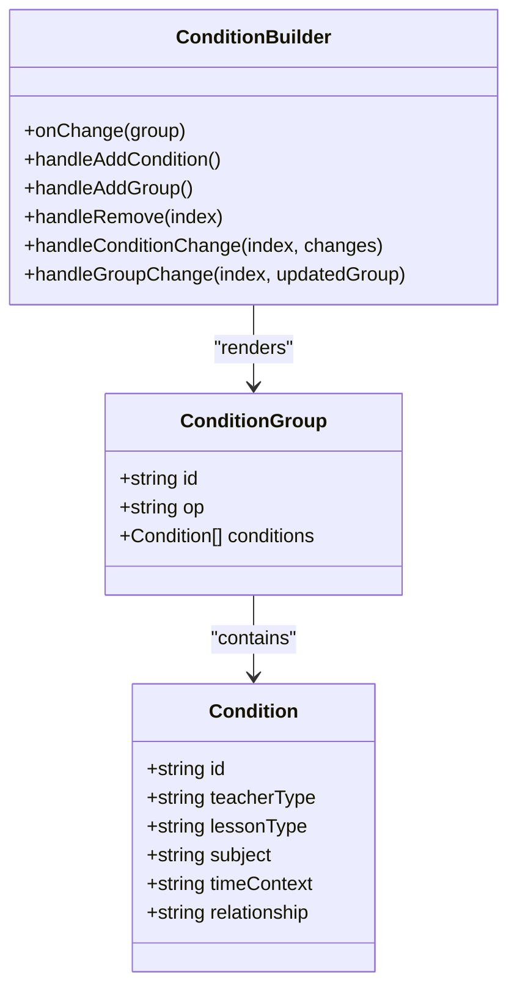
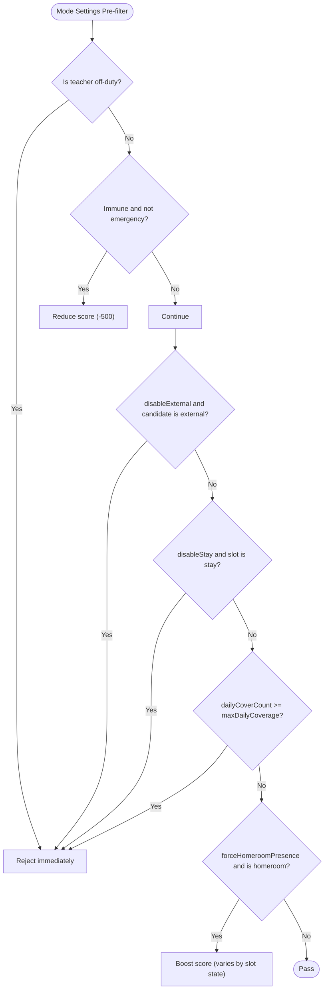
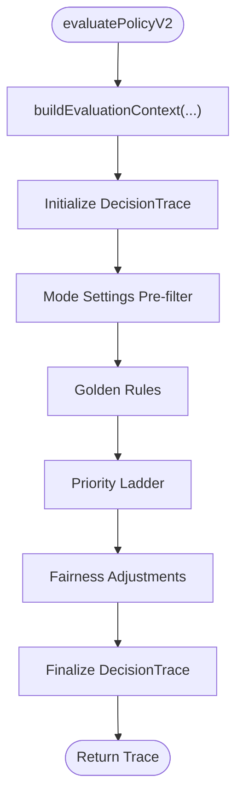
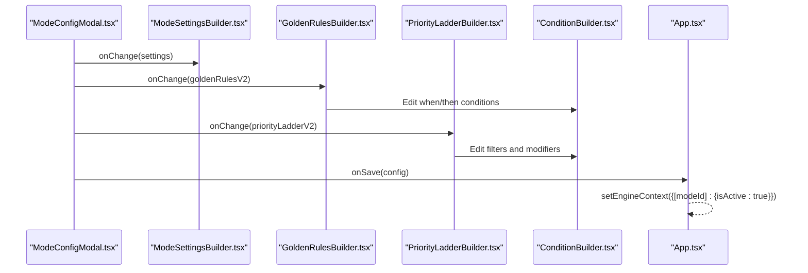
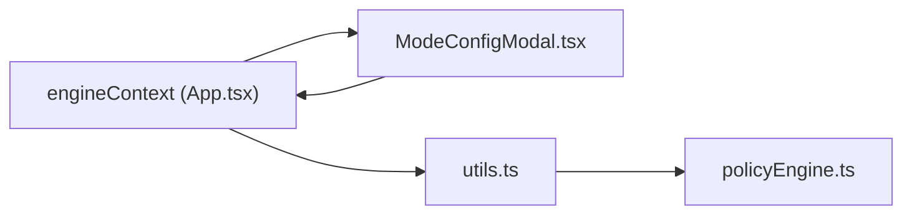
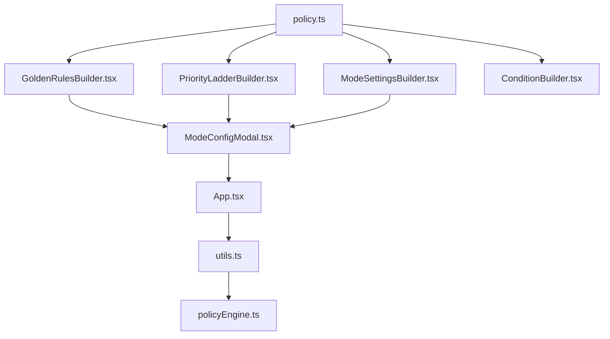

# Policy Engine

<cite>
**Referenced Files in This Document**
- [policy.ts](file://types/policy.ts)
- [policyEngine.ts](file://utils/policyEngine.ts)
- [ConditionBuilder.tsx](file://components/policy/ConditionBuilder.tsx)
- [GoldenRulesBuilder.tsx](file://components/policy/GoldenRulesBuilder.tsx)
- [PriorityLadderBuilder.tsx](file://components/policy/PriorityLadderBuilder.tsx)
- [ModeSettingsBuilder.tsx](file://components/policy/ModeSettingsBuilder.tsx)
- [ModeConfigModal.tsx](file://components/ModeConfigModal.tsx)
- [App.tsx](file://App.tsx)
- [constants.ts](file://constants.ts)
- [utils.ts](file://utils.ts)
</cite>

## Table of Contents
1. [Introduction](#introduction)
2. [Project Structure](#project-structure)
3. [Core Components](#core-components)
4. [Architecture Overview](#architecture-overview)
5. [Detailed Component Analysis](#detailed-component-analysis)
6. [Dependency Analysis](#dependency-analysis)
7. [Performance Considerations](#performance-considerations)
8. [Troubleshooting Guide](#troubleshooting-guide)
9. [Conclusion](#conclusion)

## Introduction
This document explains the Policy Engine responsible for evaluating substitution rules and priorities during operational mode configurations. It covers the architecture of the policy system (Golden Rules, Priority Ladder, and Condition Builder), the rule evaluation logic in policyEngine.ts, the data model for policy configurations in policy.ts, and how ModeConfigModal integrates with the policy builders. It also clarifies the relationship between engineContext in App.tsx and policy configurations, implementation details for priority calculations and rule validation, and troubleshooting guidance for common policy evaluation issues.

## Project Structure
The Policy Engine spans three layers:
- Data model and types: policy.ts defines the rule and configuration structures.
- Evaluation engine: policyEngine.ts implements the evaluation logic and scoring.
- UI builders and modal: components/policy/* provide visual editors for Golden Rules, Priority Ladder, and Mode Settings; ModeConfigModal orchestrates saving and validation.

**Diagram sources**
- [ModeConfigModal.tsx](file://components/ModeConfigModal.tsx#L238-L312)
- [GoldenRulesBuilder.tsx](file://components/policy/GoldenRulesBuilder.tsx#L1-L180)
- [PriorityLadderBuilder.tsx](file://components/policy/PriorityLadderBuilder.tsx#L1-L147)
- [ModeSettingsBuilder.tsx](file://components/policy/ModeSettingsBuilder.tsx#L1-L226)
- [ConditionBuilder.tsx](file://components/policy/ConditionBuilder.tsx#L1-L143)
- [policyEngine.ts](file://utils/policyEngine.ts#L255-L406)
- [policy.ts](file://types/policy.ts#L1-L162)
- [App.tsx](file://App.tsx#L415-L428)
- [constants.ts](file://constants.ts#L109-L168)
- [utils.ts](file://utils.ts#L414-L445)

**Section sources**
- [ModeConfigModal.tsx](file://components/ModeConfigModal.tsx#L238-L312)
- [policyEngine.ts](file://utils/policyEngine.ts#L255-L406)
- [policy.ts](file://types/policy.ts#L1-L162)
- [App.tsx](file://App.tsx#L415-L428)

## Core Components
- Golden Rules: High-level policies that can block assignments or adjust scores. They include when/then clauses and optional exceptions.
- Priority Ladder: Ordered steps that compute a weighted score for candidates based on matching filters and modifiers.
- Condition Builder: A recursive builder for composite conditions with AND/OR/NAND logic and selectable attributes (teacher type, lesson type, subject, time context, relationship).
- Mode Settings: Pre-filter engine that enforces constraints before applying Golden Rules and Priority Ladder.
- Decision Trace: A structured record of evaluation outcomes, including allowed flag, score, matched steps, and breakdown messages.

**Section sources**
- [policy.ts](file://types/policy.ts#L24-L81)
- [policy.ts](file://types/policy.ts#L65-L81)
- [ConditionBuilder.tsx](file://components/policy/ConditionBuilder.tsx#L1-L143)
- [GoldenRulesBuilder.tsx](file://components/policy/GoldenRulesBuilder.tsx#L1-L180)
- [PriorityLadderBuilder.tsx](file://components/policy/PriorityLadderBuilder.tsx#L1-L147)
- [ModeSettingsBuilder.tsx](file://components/policy/ModeSettingsBuilder.tsx#L1-L226)
- [policyEngine.ts](file://utils/policyEngine.ts#L255-L406)

## Architecture Overview
The Policy Engine evaluates a candidate’s eligibility for a substitution slot by:
1. Building an evaluation context from the candidate, target lesson, and system state.
2. Applying Mode Settings as a pre-filter.
3. Evaluating Golden Rules (with exceptions).
4. Computing Priority Ladder scores with modifiers and weights.
5. Applying fairness adjustments.
6. Producing a Decision Trace with a final decision and score.

**Diagram sources**
- [ModeConfigModal.tsx](file://components/ModeConfigModal.tsx#L238-L312)
- [GoldenRulesBuilder.tsx](file://components/policy/GoldenRulesBuilder.tsx#L1-L180)
- [PriorityLadderBuilder.tsx](file://components/policy/PriorityLadderBuilder.tsx#L1-L147)
- [ModeSettingsBuilder.tsx](file://components/policy/ModeSettingsBuilder.tsx#L1-L226)
- [policyEngine.ts](file://utils/policyEngine.ts#L255-L406)
- [App.tsx](file://App.tsx#L415-L428)

## Detailed Component Analysis

### Golden Rules
Golden Rules define high-level constraints and incentives. Each rule has:
- when: A ConditionGroup that must evaluate true.
- then: Effects such as BLOCK_ASSIGNMENT, BOOST_SCORE, PENALIZE_SCORE, etc.
- exceptions: Optional ConditionGroups that can override enforcement.

The evaluation loop:
- Collects enabled rules from the active mode.
- For each rule, evaluates when against the context.
- Applies compliance percentage to decide enforcement.
- Checks exceptions; if matched, the rule does not apply.
- Applies effects (block, boost, penalize) and records applied rules.

**Diagram sources**
- [policyEngine.ts](file://utils/policyEngine.ts#L347-L366)
- [policy.ts](file://types/policy.ts#L24-L53)

**Section sources**
- [policyEngine.ts](file://utils/policyEngine.ts#L347-L366)
- [GoldenRulesBuilder.tsx](file://components/policy/GoldenRulesBuilder.tsx#L1-L180)
- [policy.ts](file://types/policy.ts#L24-L53)

### Priority Ladder
Priority steps define scoring criteria:
- filters: ConditionGroup determining if a step applies.
- scoring: baseScore plus modifiers (ADD, SUBTRACT, MULTIPLY, SET_TO).
- weightPercentage: step contributes (score multiplier) to the final score.
- stopOnMatch: if true, evaluation stops after this step.

Scoring calculation:
- Sum modifiers’ contributions based on when conditions.
- Multiply by weightPercentage.
- Add to total score.

**Diagram sources**
- [policyEngine.ts](file://utils/policyEngine.ts#L368-L395)
- [policy.ts](file://types/policy.ts#L65-L81)

**Section sources**
- [policyEngine.ts](file://utils/policyEngine.ts#L368-L395)
- [PriorityLadderBuilder.tsx](file://components/policy/PriorityLadderBuilder.tsx#L1-L147)
- [policy.ts](file://types/policy.ts#L65-L81)

### Condition Builder
ConditionBuilder renders a tree of conditions with:
- Logical operators (AND/OR/NAND) at group nodes.
- Five selectable attributes per leaf: teacherType, lessonType, subject, timeContext, relationship.
- Supports adding/removing conditions and nested groups.

**Diagram sources**
- [ConditionBuilder.tsx](file://components/policy/ConditionBuilder.tsx#L1-L143)
- [policy.ts](file://types/policy.ts#L4-L17)

**Section sources**
- [ConditionBuilder.tsx](file://components/policy/ConditionBuilder.tsx#L1-L143)
- [policy.ts](file://types/policy.ts#L4-L17)

### Mode Settings (Pre-filter Engine)
Mode Settings act as a pre-filter to reduce the search space and simplify rule enforcement:
- Off-duty detection blocks immediately.
- Immunity considerations reduce score unless in emergency mode.
- Enforces constraints like disabling external staff, specific lesson types, and coverage caps.
- Boosts priority for homeroom teachers and supports proctoring scenarios.

**Diagram sources**
- [policyEngine.ts](file://utils/policyEngine.ts#L296-L345)
- [ModeSettingsBuilder.tsx](file://components/policy/ModeSettingsBuilder.tsx#L1-L226)
- [policy.ts](file://types/policy.ts#L131-L139)

**Section sources**
- [policyEngine.ts](file://utils/policyEngine.ts#L296-L345)
- [ModeSettingsBuilder.tsx](file://components/policy/ModeSettingsBuilder.tsx#L1-L226)
- [policy.ts](file://types/policy.ts#L131-L139)

### Decision Trace and Fairness
DecisionTrace captures:
- allowed flag and finalDecision (APPROVED/REJECTED/FLAGGED).
- rawScore and score (post-modifier).
- Metrics snapshot (load, streak, fairness, immunity, domainMatch).
- Parameters used (teacher type, slot state, relationship).
- Breakdown of decisions and matched/skipped steps.

Fairness adjustments:
- Strict sensitivity halves score if deviation exceeds threshold.
- Flexible sensitivity reduces score by 20% if deviation exceeds threshold.

**Section sources**
- [policyEngine.ts](file://utils/policyEngine.ts#L268-L294)
- [policyEngine.ts](file://utils/policyEngine.ts#L397-L405)

### Rule Evaluation Logic in policyEngine.ts
Key functions:
- buildEvaluationContext: constructs context from candidate, target lesson, schedule, and logs.
- evaluateCondition and evaluateGroup: recursively evaluate conditions with composite logic.
- evaluatePolicyV2: orchestrates pre-filter, Golden Rules, Priority Ladder, and fairness.

**Diagram sources**
- [policyEngine.ts](file://utils/policyEngine.ts#L255-L406)

**Section sources**
- [policyEngine.ts](file://utils/policyEngine.ts#L255-L406)

### Data Model for Policy Configurations in policy.ts
- LogicOp: AND, OR, NAND.
- Condition: leaf node with five attributes.
- ConditionGroup: composite with op and conditions.
- Effect: actions like BLOCK_ASSIGNMENT, BOOST_SCORE, PENALIZE_SCORE, etc.
- ExceptionRule: when/then for exceptions.
- GoldenRuleV2: rule with scope, when, then, exceptions, and metadata.
- ScoreModifier: modifier with operation and value.
- PriorityStepV2: step with filters, scoring, weight, stopOnMatch.
- ModeSettings: domain-specific settings for teachers, lessons, time, class, subject, HR, UI.
- DecisionTrace: evaluation outcome and breakdown.

**Section sources**
- [policy.ts](file://types/policy.ts#L1-L162)

### Integration with ModeConfigModal
ModeConfigModal integrates the policy builders:
- Tabs for Settings, Rules, Priority, Scope, Impact.
- Settings: ModeSettingsBuilder updates ModeSettings.
- Rules: GoldenRulesBuilder edits GoldenRuleV2 with ConditionBuilder.
- Priority: PriorityLadderBuilder edits PriorityStepV2 with ConditionBuilder.
- Scope: Select target scope (all, specific grades, specific classes).
- Save: Validates and persists ModeConfig into engineContext.

**Diagram sources**
- [ModeConfigModal.tsx](file://components/ModeConfigModal.tsx#L238-L312)
- [ModeSettingsBuilder.tsx](file://components/policy/ModeSettingsBuilder.tsx#L1-L226)
- [GoldenRulesBuilder.tsx](file://components/policy/GoldenRulesBuilder.tsx#L1-L180)
- [PriorityLadderBuilder.tsx](file://components/policy/PriorityLadderBuilder.tsx#L1-L147)
- [ConditionBuilder.tsx](file://components/policy/ConditionBuilder.tsx#L1-L143)
- [App.tsx](file://App.tsx#L415-L428)

**Section sources**
- [ModeConfigModal.tsx](file://components/ModeConfigModal.tsx#L238-L312)
- [App.tsx](file://App.tsx#L415-L428)

### Relationship Between engineContext in App.tsx and Policy Configurations
- engineContext stores ModeConfig entries keyed by modeId.
- App.tsx opens ModeConfigModal with initialConfig from engineContext and saves back upon close.
- utils.ts consumes the active ModeConfig and calls evaluatePolicyV2 to compute candidate scores.

**Diagram sources**
- [App.tsx](file://App.tsx#L415-L428)
- [ModeConfigModal.tsx](file://components/ModeConfigModal.tsx#L415-L427)
- [utils.ts](file://utils.ts#L414-L445)
- [policyEngine.ts](file://utils/policyEngine.ts#L255-L406)

**Section sources**
- [App.tsx](file://App.tsx#L415-L428)
- [utils.ts](file://utils.ts#L414-L445)

### Priority Calculations and Rule Validation
- Priority calculations:
  - Base score computed from modifiers (ADD/SUBTRACT/MULTIPLY/SET_TO).
  - Weighted by weightPercentage.
  - Accumulated across matched steps; optional early stop.
- Rule validation:
  - validateModeSafety ensures required fields and constraints are met.
  - ModeConfigModal syncs governing subject between V2 and legacy fields to pass validation.

**Section sources**
- [policyEngine.ts](file://utils/policyEngine.ts#L368-L395)
- [policyEngine.ts](file://utils/policyEngine.ts#L25-L44)
- [ModeConfigModal.tsx](file://components/ModeConfigModal.tsx#L111-L121)

## Dependency Analysis
- UI builders depend on policy.ts types and policyUtils for defaults and options.
- ModeConfigModal depends on builders and passes updated configs to App.tsx.
- App.tsx manages engineContext and triggers evaluation via utils.ts.
- utils.ts invokes policyEngine.ts with ModeConfig and runtime data.

**Diagram sources**
- [policy.ts](file://types/policy.ts#L1-L162)
- [GoldenRulesBuilder.tsx](file://components/policy/GoldenRulesBuilder.tsx#L1-L180)
- [PriorityLadderBuilder.tsx](file://components/policy/PriorityLadderBuilder.tsx#L1-L147)
- [ModeSettingsBuilder.tsx](file://components/policy/ModeSettingsBuilder.tsx#L1-L226)
- [ConditionBuilder.tsx](file://components/policy/ConditionBuilder.tsx#L1-L143)
- [ModeConfigModal.tsx](file://components/ModeConfigModal.tsx#L238-L312)
- [App.tsx](file://App.tsx#L415-L428)
- [utils.ts](file://utils.ts#L414-L445)
- [policyEngine.ts](file://utils/policyEngine.ts#L255-L406)

**Section sources**
- [policy.ts](file://types/policy.ts#L1-L162)
- [ModeConfigModal.tsx](file://components/ModeConfigModal.tsx#L238-L312)
- [App.tsx](file://App.tsx#L415-L428)
- [utils.ts](file://utils.ts#L414-L445)
- [policyEngine.ts](file://utils/policyEngine.ts#L255-L406)

## Performance Considerations
- Composite condition evaluation uses recursion; keep groups shallow and limit nested groups.
- Scoring loops iterate enabled steps; keep step counts reasonable.
- Fairness adjustments multiply scores; consider early exits when allowed.
- Use stopOnMatch to reduce unnecessary evaluations.

[No sources needed since this section provides general guidance]

## Troubleshooting Guide
Common issues and resolutions:
- Immediate rejection due to off-duty:
  - Cause: Candidate is marked off-duty.
  - Resolution: Ensure candidate presence or adjust Mode Settings.
- Immunity penalty:
  - Cause: Candidate is immune and mode is not emergency.
  - Resolution: Allow emergency mode or wait for cooldown.
- External staff blocked:
  - Cause: Mode Settings disable external staff.
  - Resolution: Change settings or select internal candidates.
- Stay/Individual lessons blocked:
  - Cause: Mode Settings disable specific lesson types.
  - Resolution: Adjust settings or change lesson type.
- Daily coverage cap exceeded:
  - Cause: Candidate exceeds maxDailyCoverage.
  - Resolution: Choose another candidate or increase cap.
- Golden Rule blocks assignment:
  - Cause: Rule when matched and compliance satisfied with no exception.
  - Resolution: Adjust rule conditions or exceptions; or override if permitted.
- Low score despite matching filters:
  - Cause: Modifier operations or low weightPercentage.
  - Resolution: Increase baseScore or weightPercentage; add boosting modifiers.
- Validation errors on save:
  - Cause: Missing governing subject or invalid configuration.
  - Resolution: Sync governing subject in ModeConfigModal; fix required fields.

**Section sources**
- [policyEngine.ts](file://utils/policyEngine.ts#L296-L345)
- [policyEngine.ts](file://utils/policyEngine.ts#L347-L366)
- [ModeConfigModal.tsx](file://components/ModeConfigModal.tsx#L111-L121)

## Conclusion
The Policy Engine provides a robust, extensible framework for operational substitution decisions. Golden Rules capture institutional constraints, Priority Ladder encodes nuanced preferences, and Mode Settings act as a pre-filter to streamline evaluation. ModeConfigModal offers a cohesive UI to configure these components, while App.tsx coordinates persistence and evaluation via utils.ts and policyEngine.ts. By following the troubleshooting guidance and leveraging the data model and builders, administrators can tailor policies to diverse operational modes effectively.