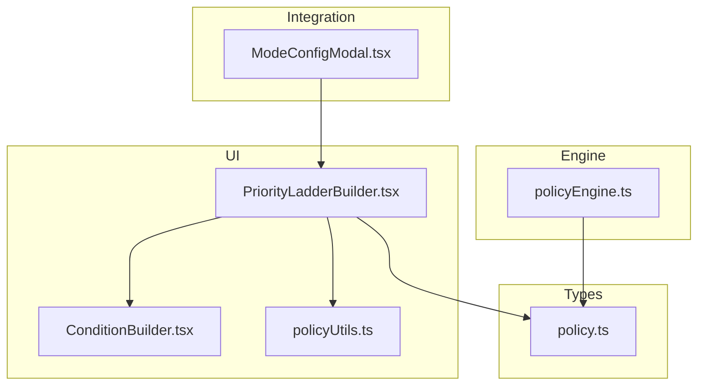
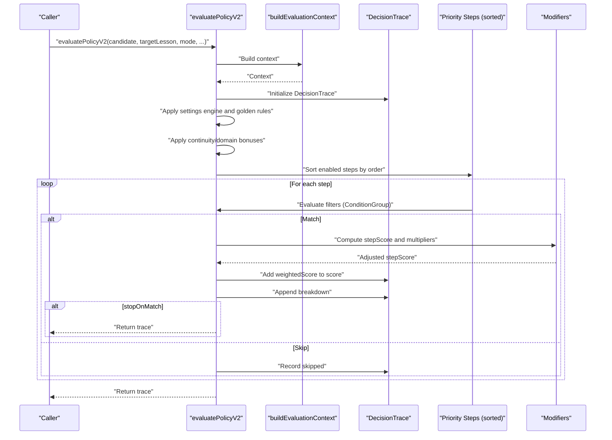
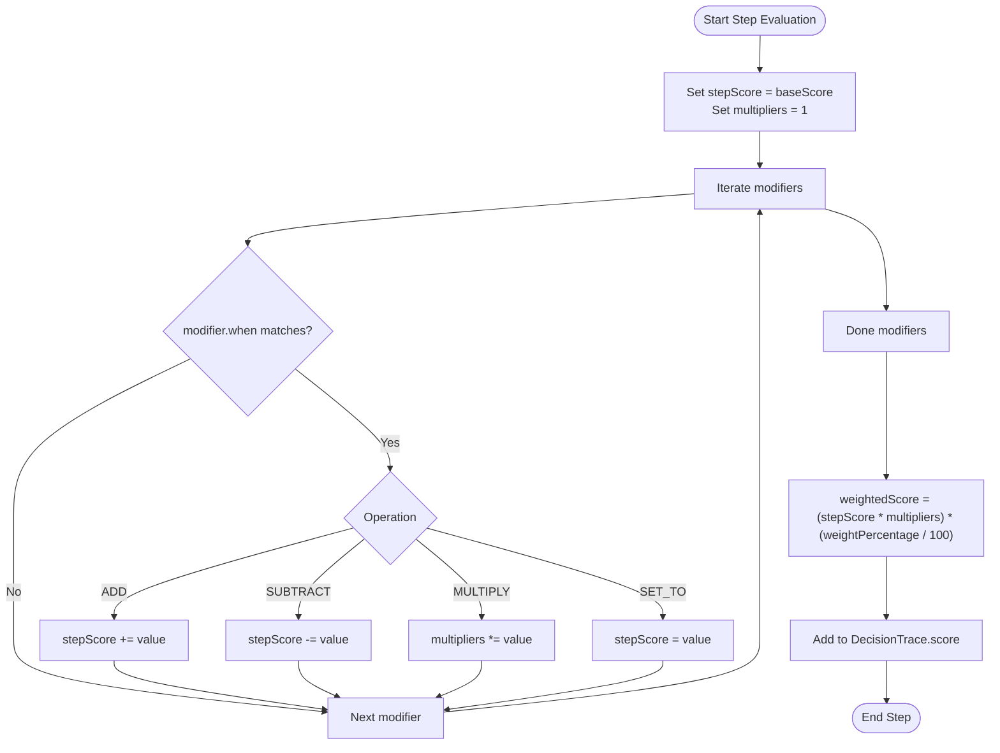
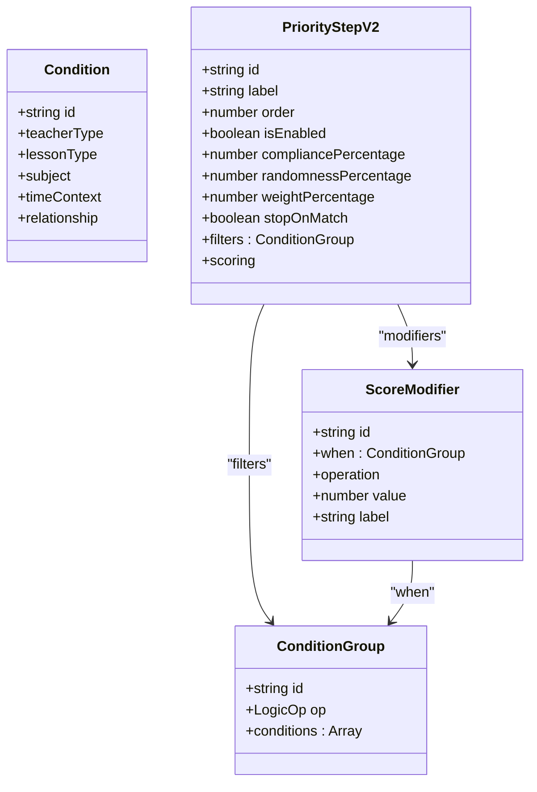
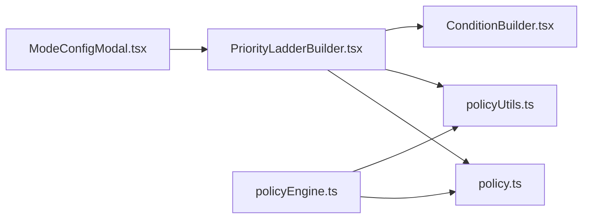

# Priority Ladder

<cite>
**Referenced Files in This Document**
- [PriorityLadderBuilder.tsx](file://components/policy/PriorityLadderBuilder.tsx)
- [policyEngine.ts](file://utils/policyEngine.ts)
- [policy.ts](file://types/policy.ts)
- [ConditionBuilder.tsx](file://components/policy/ConditionBuilder.tsx)
- [policyUtils.ts](file://utils/policyUtils.ts)
- [ModeConfigModal.tsx](file://components/ModeConfigModal.tsx)
</cite>

## Table of Contents
1. [Introduction](#introduction)
2. [Project Structure](#project-structure)
3. [Core Components](#core-components)
4. [Architecture Overview](#architecture-overview)
5. [Detailed Component Analysis](#detailed-component-analysis)
6. [Dependency Analysis](#dependency-analysis)
7. [Performance Considerations](#performance-considerations)
8. [Troubleshooting Guide](#troubleshooting-guide)
9. [Conclusion](#conclusion)
10. [Appendices](#appendices)

## Introduction
This document explains the Priority Ladder feature of the Policy Engine. It describes how the engine ranks substitution candidates using a weighted scoring system based on contextual relevance. The PriorityStepV2 interface defines filters, scoring mechanics, modifiers, and stopOnMatch behavior. The engine evaluates steps in order, applies base scores and multipliers, and accumulates the final score in DecisionTrace. We also show how PriorityLadderBuilder.tsx enables UI-based configuration of priority steps and provide best practices and troubleshooting guidance.

## Project Structure
The Priority Ladder spans UI configuration and runtime evaluation:
- UI builder: PriorityLadderBuilder.tsx and ConditionBuilder.tsx
- Types: policy.ts (includes PriorityStepV2, ConditionGroup, ScoreModifier, DecisionTrace)
- Engine: policyEngine.ts (evaluation logic and DecisionTrace accumulation)
- Utilities: policyUtils.ts (condition helpers and defaults)
- Integration: ModeConfigModal.tsx integrates the builder into the mode configuration UI

**Diagram sources**
- [PriorityLadderBuilder.tsx](file://components/policy/PriorityLadderBuilder.tsx#L1-L147)
- [ConditionBuilder.tsx](file://components/policy/ConditionBuilder.tsx#L1-L143)
- [policyUtils.ts](file://utils/policyUtils.ts#L1-L117)
- [policy.ts](file://types/policy.ts#L1-L162)
- [policyEngine.ts](file://utils/policyEngine.ts#L254-L405)
- [ModeConfigModal.tsx](file://components/ModeConfigModal.tsx#L237-L251)

**Section sources**
- [PriorityLadderBuilder.tsx](file://components/policy/PriorityLadderBuilder.tsx#L1-L147)
- [policyEngine.ts](file://utils/policyEngine.ts#L254-L405)
- [policy.ts](file://types/policy.ts#L1-L162)
- [ConditionBuilder.tsx](file://components/policy/ConditionBuilder.tsx#L1-L143)
- [policyUtils.ts](file://utils/policyUtils.ts#L1-L117)
- [ModeConfigModal.tsx](file://components/ModeConfigModal.tsx#L237-L251)

## Core Components
- PriorityStepV2: Defines a single priority step with label, order, enablement, compliance/randomness percentages, weight percentage, stopOnMatch flag, filters (ConditionGroup), scoring (baseScore and modifiers), and explanation.
- ScoreModifier: Defines conditional adjustments to a step’s score (ADD, SUBTRACT, MULTIPLY, SET_TO) controlled by when (ConditionGroup).
- DecisionTrace: Captures the evaluation outcome, including allowed flag, score, rawScore, matched/skipped steps, metrics snapshot, parameters used, and a breakdown of decisions.

Key behaviors:
- Steps are filtered by isEnabled and sorted by order.
- Each step computes a baseScore, applies modifiers based on when conditions, multiplies by multipliers, and then scales by weightPercentage.
- Accumulated score is recorded in DecisionTrace.score with a textual breakdown.

**Section sources**
- [policy.ts](file://types/policy.ts#L55-L81)
- [policy.ts](file://types/policy.ts#L141-L162)
- [policyEngine.ts](file://utils/policyEngine.ts#L368-L395)

## Architecture Overview
The Priority Ladder evaluation pipeline:
1. Build evaluation context from candidate, target lesson, and logs.
2. Initialize DecisionTrace.
3. Apply settings engine checks and golden rules.
4. Apply continuity/domain bonuses.
5. Iterate priority steps in order:
   - Evaluate filters (ConditionGroup).
   - Compute stepScore and multipliers from modifiers.
   - Weight by weightPercentage.
   - Add to trace.score and record breakdown.
   - Stop if stopOnMatch is true.

**Diagram sources**
- [policyEngine.ts](file://utils/policyEngine.ts#L254-L405)
- [policy.ts](file://types/policy.ts#L55-L81)

## Detailed Component Analysis

### PriorityStepV2 and Scoring Mechanics
PriorityStepV2 encapsulates:
- Identification and presentation: id, label, order, isEnabled, compliancePercentage, randomnessPercentage, explanation.
- Behavioral controls: weightPercentage and stopOnMatch.
- Matching: filters (ConditionGroup) determines whether a step participates.
- Scoring: baseScore plus modifiers (ScoreModifier) with four operations:
  - ADD: add a fixed value
  - SUBTRACT: subtract a fixed value
  - MULTIPLY: multiply the current stepScore by a factor
  - SET_TO: replace stepScore with a fixed value
- Weighting: final stepScore is multiplied by weightPercentage/100 and added to the total.

Scoring flow:
- Initialize stepScore = baseScore.
- For each modifier whose when (ConditionGroup) matches context:
  - Apply operation to stepScore or multipliers.
- Compute weightedScore = (stepScore * multipliers) * (weightPercentage / 100).
- Add weightedScore to DecisionTrace.score.

**Diagram sources**
- [policyEngine.ts](file://utils/policyEngine.ts#L368-L395)
- [policy.ts](file://types/policy.ts#L55-L81)

**Section sources**
- [policy.ts](file://types/policy.ts#L55-L81)
- [policyEngine.ts](file://utils/policyEngine.ts#L368-L395)

### PriorityStepV2 Filters and Condition Evaluation
Filters are defined as ConditionGroup with nested Condition and/or subgroups. The engine evaluates filters using evaluateGroup and evaluateCondition, which check:
- Teacher type
- Lesson type (including shared)
- Subject inclusion
- Time context (e.g., during school, same-day stay)
- Relationship (e.g., same subject, same domain, continuity match, is homeroom)

The builder exposes ConditionBuilder to construct filters with AND/OR logic and nested groups.

**Diagram sources**
- [policy.ts](file://types/policy.ts#L1-L81)

**Section sources**
- [policy.ts](file://types/policy.ts#L1-L81)
- [ConditionBuilder.tsx](file://components/policy/ConditionBuilder.tsx#L1-L143)
- [policyEngine.ts](file://utils/policyEngine.ts#L205-L252)

### DecisionTrace and Breakdown
DecisionTrace captures:
- Audit trail id, timestamp, active mode id
- Allowed flag, score, rawScore
- Golden rules applied/violated/blocked
- Priority steps matched and skipped
- Metrics snapshot and parameters used
- A breakdown array of human-readable reasons

The engine appends entries to breakdown for each priority step contribution and for other adjustments (e.g., continuity bonus, fairness scaling).

**Section sources**
- [policy.ts](file://types/policy.ts#L141-L162)
- [policyEngine.ts](file://utils/policyEngine.ts#L254-L366)
- [policyEngine.ts](file://utils/policyEngine.ts#L368-L405)

### UI-Based Configuration with PriorityLadderBuilder
PriorityLadderBuilder provides:
- Add step with default fields (order, label, isEnabled, weightPercentage, stopOnMatch, filters, scoring).
- Reorder steps up/down and persist order.
- Toggle isEnabled, stopOnMatch, adjust weightPercentage.
- Edit label and baseScore.
- Configure filters via ConditionBuilder.
- Simulation preview showing expected score contribution.

Integration:
- ModeConfigModal renders PriorityLadderBuilder under the “priority” tab and passes the current priorityLadderV2 steps and onChange handler.

**Section sources**
- [PriorityLadderBuilder.tsx](file://components/policy/PriorityLadderBuilder.tsx#L1-L147)
- [ModeConfigModal.tsx](file://components/ModeConfigModal.tsx#L237-L251)
- [ConditionBuilder.tsx](file://components/policy/ConditionBuilder.tsx#L1-L143)
- [policyUtils.ts](file://utils/policyUtils.ts#L43-L56)

### Example: Step Matching and Score Calculation
To illustrate how the engine evaluates steps and accumulates scores, refer to the evaluation loop in the engine:
- Enabled steps are sorted by order.
- For each step, filters are evaluated; if matched, compute stepScore and multipliers from modifiers, apply weighting, and add to trace.score.
- If stopOnMatch is true, evaluation stops after the first match.

See the engine evaluation logic for the exact computation and breakdown appendage.

**Section sources**
- [policyEngine.ts](file://utils/policyEngine.ts#L368-L395)

## Dependency Analysis
- PriorityLadderBuilder depends on:
  - PriorityStepV2 type
  - createEmptyConditionGroup from policyUtils
  - ConditionBuilder for filter construction
- policyEngine.ts depends on:
  - PriorityStepV2, ConditionGroup, ScoreModifier, DecisionTrace from types/policy
  - policyUtils for condition helpers
- ModeConfigModal integrates PriorityLadderBuilder into the mode configuration UI.

**Diagram sources**
- [PriorityLadderBuilder.tsx](file://components/policy/PriorityLadderBuilder.tsx#L1-L147)
- [policyEngine.ts](file://utils/policyEngine.ts#L254-L405)
- [policy.ts](file://types/policy.ts#L1-L162)
- [policyUtils.ts](file://utils/policyUtils.ts#L1-L117)
- [ModeConfigModal.tsx](file://components/ModeConfigModal.tsx#L237-L251)

**Section sources**
- [PriorityLadderBuilder.tsx](file://components/policy/PriorityLadderBuilder.tsx#L1-L147)
- [policyEngine.ts](file://utils/policyEngine.ts#L254-L405)
- [policy.ts](file://types/policy.ts#L1-L162)
- [policyUtils.ts](file://utils/policyUtils.ts#L1-L117)
- [ModeConfigModal.tsx](file://components/ModeConfigModal.tsx#L237-L251)

## Performance Considerations
- Keep filters minimal and specific to reduce evaluateGroup overhead.
- Prefer fewer, broader modifiers over many narrow ones to limit modifier iterations.
- Use stopOnMatch judiciously to short-circuit evaluation when earlier steps are highly discriminative.
- Order steps by expected frequency and impact; place higher-weight steps earlier to maximize early pruning.
- Avoid overly complex nested ConditionGroups; flatten where possible to improve readability and speed.
- Cache repeated context computations if reused across steps (already encapsulated in buildEvaluationContext).

## Troubleshooting Guide
Common issues and resolutions:
- Unexpected zero or negative scores:
  - Verify baseScore and modifiers; ensure SET_TO is not inadvertently reducing score.
  - Confirm weightPercentage is set appropriately.
- Step never matches:
  - Review filters (ConditionGroup) for strictness; use “any” for less restrictive defaults.
  - Test with simplified filters and re-add complexity incrementally.
- Stop-on-match behavior:
  - If stopOnMatch is true, later steps will not contribute; reorder steps or remove stopOnMatch from earlier steps.
- Breakdown not reflecting expected steps:
  - Ensure steps are enabled and ordered correctly; the engine sorts by order.
  - Confirm filters are satisfied by the current context.
- Performance bottlenecks:
  - Simplify filters and reduce nesting.
  - Limit the number of modifiers per step.
  - Use stopOnMatch to prune unnecessary evaluations.

**Section sources**
- [policyEngine.ts](file://utils/policyEngine.ts#L368-L395)
- [PriorityLadderBuilder.tsx](file://components/policy/PriorityLadderBuilder.tsx#L1-L147)

## Conclusion
The Priority Ladder provides a flexible, explainable way to weight substitution candidates by contextual relevance. PriorityStepV2 defines filters, scoring, and control flags; the engine evaluates them in order, applies modifiers and weights, and records outcomes in DecisionTrace. The UI builder enables iterative configuration and simulation, while best practices around ordering and weighting help achieve predictable and performant results.

## Appendices

### Best Practices for Configuration
- Order steps by importance and frequency of occurrence; place the most discriminative steps first.
- Set weightPercentage to reflect relative importance compared to other steps.
- Use stopOnMatch for dominant rules that should preempt further scoring.
- Keep filters precise but not overly restrictive; validate with the simulation preview.
- Use modifiers sparingly and clearly label their intent for maintainability.

### Example References
- Step evaluation and accumulation: [policyEngine.ts](file://utils/policyEngine.ts#L368-L395)
- DecisionTrace fields and breakdown: [policy.ts](file://types/policy.ts#L141-L162)
- UI builder controls and simulation preview: [PriorityLadderBuilder.tsx](file://components/policy/PriorityLadderBuilder.tsx#L1-L147)