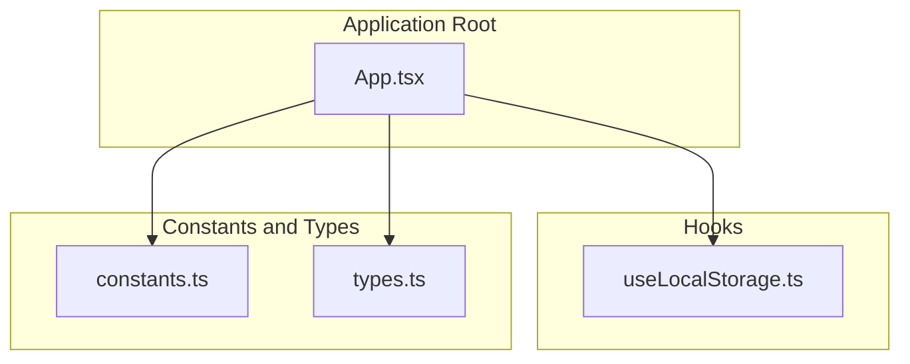
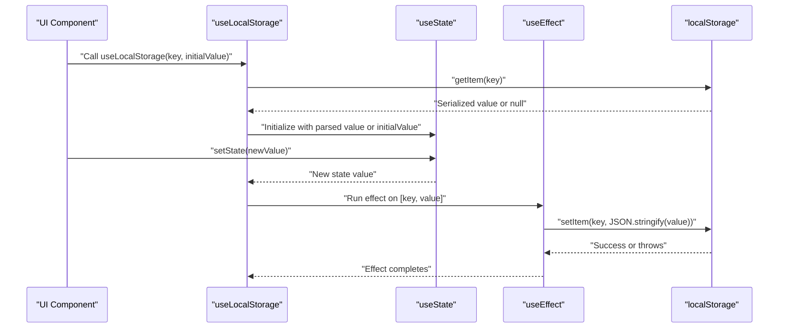
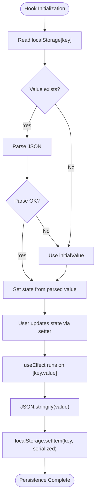
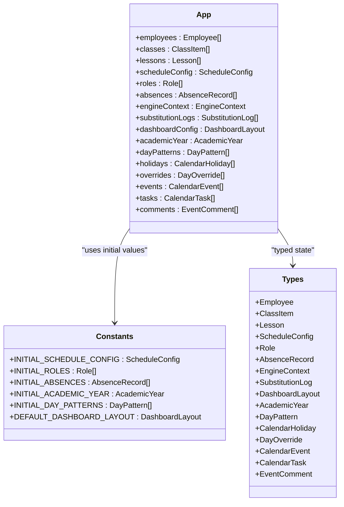
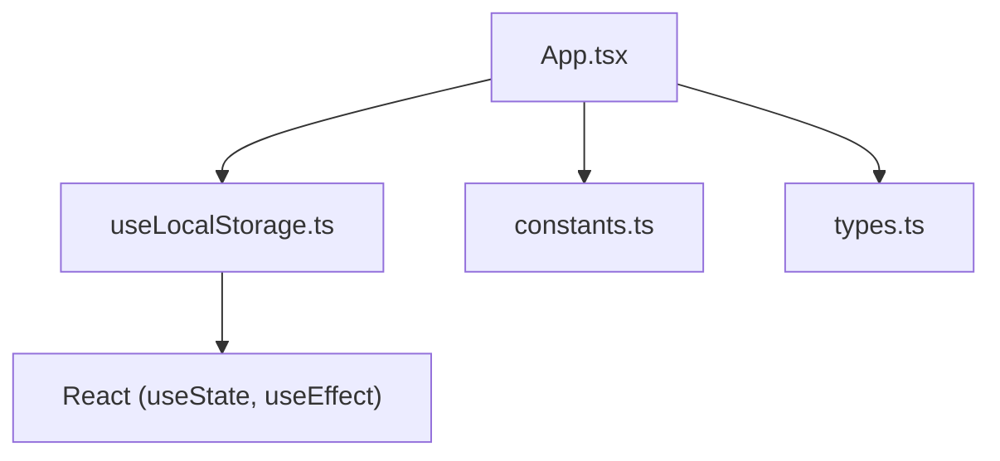

# Local Storage State Management

<cite>
**Referenced Files in This Document**
- [useLocalStorage.ts](file://hooks/useLocalStorage.ts)
- [App.tsx](file://App.tsx)
- [constants.ts](file://constants.ts)
- [types.ts](file://types.ts)
</cite>

## Table of Contents
1. [Introduction](#introduction)
2. [Project Structure](#project-structure)
3. [Core Components](#core-components)
4. [Architecture Overview](#architecture-overview)
5. [Detailed Component Analysis](#detailed-component-analysis)
6. [Dependency Analysis](#dependency-analysis)
7. [Performance Considerations](#performance-considerations)
8. [Troubleshooting Guide](#troubleshooting-guide)
9. [Conclusion](#conclusion)
10. [Appendices](#appendices)

## Introduction
This document explains the local storage state management strategy centered on a custom React hook, useLocalStorage. It describes how the hook synchronizes React state with browser localStorage using useState and useEffect, enabling persistent storage for key application entities such as employees, classes, schedule configurations, calendar data, and user preferences. The implementation is generic and type-safe, leveraging TypeScript generics to ensure correct typing across different data models. Practical examples from the application root demonstrate how multiple useLocalStorage hooks are used to manage domain state. The document also covers error handling during JSON serialization/deserialization, fallback behavior, the reactivity chain (state update → useEffect → localStorage persistence), performance considerations, and best practices for choosing when to persist vs. keep state transient.

## Project Structure
The local storage strategy is implemented in a single reusable hook and consumed widely across the application root and components.

**Diagram sources**
- [useLocalStorage.ts](file://hooks/useLocalStorage.ts#L1-L23)
- [App.tsx](file://App.tsx#L1-L60)
- [constants.ts](file://constants.ts#L1-L120)
- [types.ts](file://types.ts#L1-L120)

**Section sources**
- [useLocalStorage.ts](file://hooks/useLocalStorage.ts#L1-L23)
- [App.tsx](file://App.tsx#L1-L60)
- [constants.ts](file://constants.ts#L1-L120)
- [types.ts](file://types.ts#L1-L120)

## Core Components
- useLocalStorage<T>(key, initialValue): A generic React hook that:
  - Initializes state from localStorage keyed by key, parsing JSON if present; otherwise uses initialValue.
  - Persists state updates to localStorage whenever the value or key changes.
  - Provides a setter that triggers persistence via useEffect.
  - Includes robust error handling for JSON parse/stringify failures.

- Application root usage in App.tsx:
  - Declares multiple useLocalStorage hooks to manage domain state for employees, classes, lessons, schedule configuration, roles, absences, engine context, dashboard layout, calendar-related entities, and more.
  - Uses typed initial values from constants.ts and type definitions from types.ts.

Key characteristics:
- Generic and type-safe: The hook preserves the type of the stored data model.
- Hydration from storage: On mount, the hook reads from localStorage and falls back to the provided initial value if missing or invalid.
- Persistence on change: Every state update is persisted to localStorage asynchronously via useEffect.
- Error resilience: Parse and stringify errors are caught and logged, preventing crashes while preserving fallback behavior.

**Section sources**
- [useLocalStorage.ts](file://hooks/useLocalStorage.ts#L1-L23)
- [App.tsx](file://App.tsx#L36-L52)
- [constants.ts](file://constants.ts#L57-L120)
- [types.ts](file://types.ts#L1-L120)

## Architecture Overview
The persistence architecture follows a predictable reactivity chain: React state update → effect handler → localStorage write. This ensures that the UI remains responsive while keeping the underlying data durable.

**Diagram sources**
- [useLocalStorage.ts](file://hooks/useLocalStorage.ts#L1-L23)

## Detailed Component Analysis

### useLocalStorage Hook Implementation
The hook encapsulates initialization and persistence logic:
- Initialization:
  - Reads the stored item by key.
  - Parses JSON; if parsing fails or item is missing, uses initialValue.
  - Logs errors to the console for observability without crashing.
- Persistence:
  - Subscribes to changes via useEffect with a dependency on [key, value].
  - Serializes the current value to JSON and writes to localStorage.
  - Catches and logs errors to prevent unhandled exceptions.

**Diagram sources**
- [useLocalStorage.ts](file://hooks/useLocalStorage.ts#L1-L23)

**Section sources**
- [useLocalStorage.ts](file://hooks/useLocalStorage.ts#L1-L23)

### Application Root State Management (App.tsx)
The application root composes multiple useLocalStorage hooks to manage domain state. These declarations illustrate the hook’s type-safe usage across diverse models:

- Entities persisted across sessions:
  - employees: Employee[]
  - classes: ClassItem[]
  - lessons: Lesson[]
  - scheduleConfig: ScheduleConfig
  - roles: Role[]
  - absences: AbsenceRecord[]
  - engineContext: EngineContext
  - substitutionLogs: SubstitutionLog[]
  - dashboardConfig: DashboardLayout
  - academicYear: AcademicYear
  - dayPatterns: DayPattern[]
  - calendar-related arrays: calendarHolidays, dayOverrides, calendarEvents, calendarTasks, calendarComments

- Initial values:
  - Typed initial values are sourced from constants.ts for schedule configuration, roles, absences, academic year, day patterns, and dashboard layout.

- Type safety:
  - Each hook is explicitly typed with the corresponding model from types.ts, ensuring compile-time correctness.

**Diagram sources**
- [App.tsx](file://App.tsx#L36-L52)
- [constants.ts](file://constants.ts#L57-L120)
- [types.ts](file://types.ts#L1-L220)

**Section sources**
- [App.tsx](file://App.tsx#L36-L52)
- [constants.ts](file://constants.ts#L57-L120)
- [types.ts](file://types.ts#L1-L220)

### Error Handling and Fallback Behavior
- During hydration:
  - If localStorage item is missing or JSON parsing fails, the hook falls back to initialValue and logs the error.
- During persistence:
  - If JSON serialization fails or writing to localStorage throws, the hook logs the error and continues without crashing.
- Best practice:
  - Ensure that stored data models are serializable and avoid storing functions, symbols, or cyclic references.
  - Keep initial values consistent with the expected shape to minimize parse errors.

**Section sources**
- [useLocalStorage.ts](file://hooks/useLocalStorage.ts#L1-L23)

### Reactivity Chain: State Update to Persistence
- When a component calls the setter returned by useLocalStorage:
  - React updates the state.
  - The useEffect dependency array [key, value] triggers.
  - The effect serializes the value and writes to localStorage.
- This guarantees eventual consistency between in-memory state and persisted storage.

**Section sources**
- [useLocalStorage.ts](file://hooks/useLocalStorage.ts#L1-L23)

## Dependency Analysis
- Hook dependency:
  - useLocalStorage depends on React’s useState and useEffect.
- Application dependency:
  - App.tsx imports useLocalStorage and uses it to manage domain state.
  - App.tsx imports typed initial values from constants.ts and model types from types.ts.
- Coupling and cohesion:
  - The hook is cohesive and decoupled from application logic; it focuses solely on persistence.
  - App.tsx composes multiple instances of the hook, increasing cohesion around domain state management.

**Diagram sources**
- [useLocalStorage.ts](file://hooks/useLocalStorage.ts#L1-L23)
- [App.tsx](file://App.tsx#L1-L60)
- [constants.ts](file://constants.ts#L1-L120)
- [types.ts](file://types.ts#L1-L120)

**Section sources**
- [useLocalStorage.ts](file://hooks/useLocalStorage.ts#L1-L23)
- [App.tsx](file://App.tsx#L1-L60)
- [constants.ts](file://constants.ts#L1-L120)
- [types.ts](file://types.ts#L1-L120)

## Performance Considerations
- Serialization overhead:
  - JSON.stringify and JSON.parse occur on every state change. For large arrays or deeply nested objects, this can be expensive.
  - Mitigation strategies:
    - Persist less frequently by batching updates (e.g., debounce or throttle setters).
    - Prefer smaller, focused state slices per hook to reduce payload sizes.
    - Avoid storing non-essential transient data in localStorage; keep it in memory state.
- Storage limits:
  - localStorage is typically limited to a few megabytes per origin. Exceeding limits causes silent failures or exceptions.
  - Monitor payload sizes and prune unnecessary data.
- Security:
  - localStorage is client-side and not encrypted. Avoid storing sensitive credentials or secrets.
  - For sensitive data, prefer server-side storage with appropriate transport and access controls.
- Best practices:
  - Use useLocalStorage for durable, cross-session preferences and domain data (e.g., schedule config, user preferences).
  - Use useState for ephemeral UI state (e.g., modal visibility, form inputs).
  - Consider structured keys and namespaces to avoid collisions and simplify maintenance.

[No sources needed since this section provides general guidance]

## Troubleshooting Guide
Common issues and resolutions:
- JSON parse error on hydration:
  - Cause: Corrupted or incompatible data in localStorage.
  - Resolution: Clear the offending key or adjust the initial value to match the expected schema.
- JSON stringify error on persistence:
  - Cause: Storing non-serializable values (functions, symbols, undefined).
  - Resolution: Normalize data to plain objects/arrays and remove non-serializable members.
- Silent failures due to storage quota exceeded:
  - Cause: Large payloads exceeding localStorage capacity.
  - Resolution: Reduce payload size, split data, or migrate to IndexedDB for larger datasets.
- Cross-tab synchronization:
  - Observation: Changes in one tab do not automatically reflect in others.
  - Resolution: Listen to storage events if cross-tab sync is required; otherwise, accept single-tab persistence.
- Key naming collisions:
  - Cause: Multiple hooks using overlapping keys.
  - Resolution: Adopt consistent key naming conventions (see Appendices).

**Section sources**
- [useLocalStorage.ts](file://hooks/useLocalStorage.ts#L1-L23)

## Conclusion
The useLocalStorage hook provides a clean, generic, and type-safe mechanism to persist React state to browser localStorage. In the application root, it powers durable state for critical entities such as employees, classes, schedule configuration, calendar data, and user preferences. The reactivity chain ensures that state updates are reliably persisted, with robust error handling and fallback behavior. By following best practices—choosing when to persist vs. keep transient, managing payload sizes, and adopting clear key conventions—the hook delivers a scalable foundation for local persistence.

[No sources needed since this section summarizes without analyzing specific files]

## Appendices

### Key Naming Conventions
- Use descriptive, pluralized keys for collections (e.g., "employees", "classes").
- Use singularized keys for singletons (e.g., "scheduleConfig", "dashboardConfig").
- Consider namespace keys by prefixing with a domain (e.g., "classflow_employees") to avoid collisions.
- Keep keys lowercase and hyphenated or snake_case for readability.

[No sources needed since this section provides general guidance]

### Limitations of localStorage
- Size constraints: Typically a few megabytes per origin; exceeding limits can cause failures.
- No encryption: Data is stored in plaintext; avoid sensitive information.
- Synchronous API: Large serializations can block the UI thread.
- Single-origin scope: Data is shared across tabs but isolated by origin.
- No built-in TTL or cleanup: Implement manual eviction or versioning strategies.

[No sources needed since this section provides general guidance]