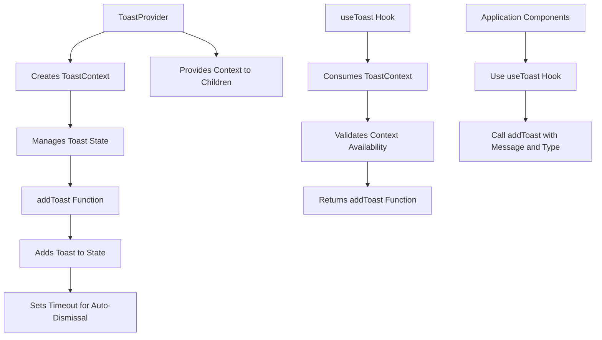
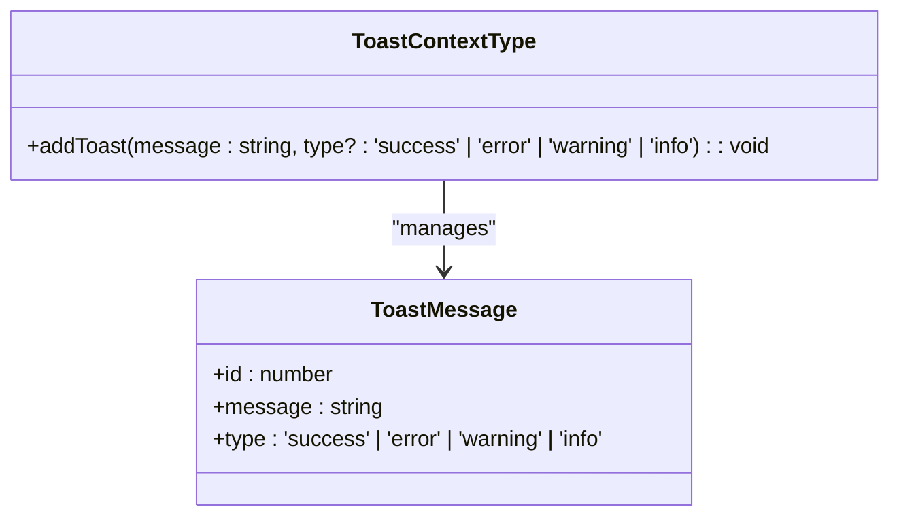
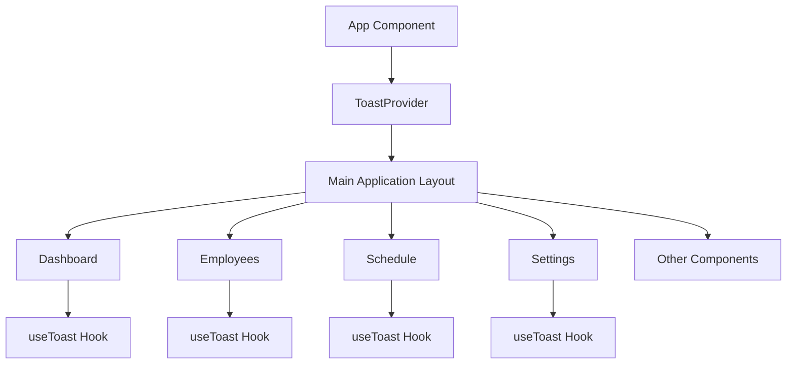
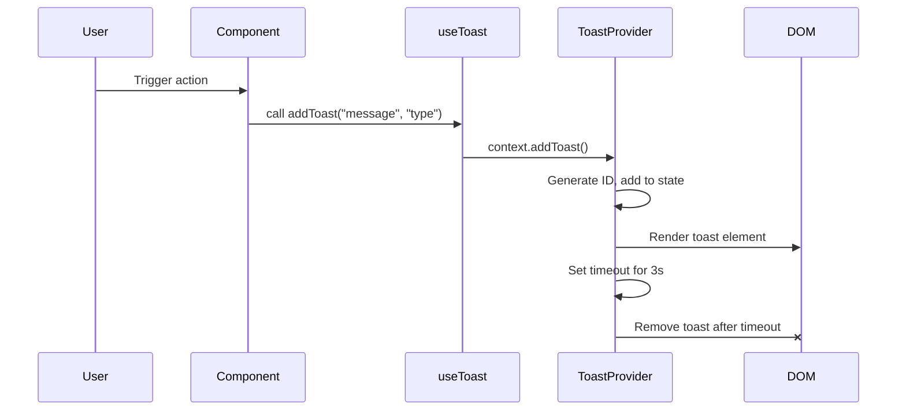

# React Context for Global State

<cite>
**Referenced Files in This Document**   
- [ToastContext.tsx](file://contexts/ToastContext.tsx)
- [App.tsx](file://App.tsx)
- [types.ts](file://types.ts)
- [AbsenceForm.tsx](file://components/AbsenceForm.tsx)
- [CalendarRequestForm.tsx](file://components/CalendarRequestForm.tsx)
</cite>

## Table of Contents
1. [Introduction](#introduction)
2. [ToastContext Architecture](#toastcontext-architecture)
3. [Core Components](#core-components)
4. [Type Definitions](#type-definitions)
5. [Implementation Examples](#implementation-examples)
6. [Visual Design and Styling](#visual-design-and-styling)
7. [Accessibility and User Experience](#accessibility-and-user-experience)
8. [Integration and Scalability](#integration-and-scalability)
9. [Conclusion](#conclusion)

## Introduction
The ToastContext implementation provides a global notification system using React Context API, enabling components throughout the application to display user feedback messages without prop drilling. This documentation details the architecture, implementation, and usage patterns of the toast notification system, which supports different message types (success, error, warning, info) with automatic dismissal after 3 seconds.

## ToastContext Architecture

**Diagram sources**
- [ToastContext.tsx](file://contexts/ToastContext.tsx#L1-L56)

**Section sources**
- [ToastContext.tsx](file://contexts/ToastContext.tsx#L1-L56)

## Core Components

### ToastContextType Interface
The ToastContextType interface defines the contract for the toast context, specifying the addToast method signature that accepts a message string and an optional toast type parameter with a default value of 'success'.

### useToast Custom Hook
The useToast custom hook provides a safe way to consume the toast context with runtime validation. It throws an error if used outside of a ToastProvider, preventing undefined behavior and helping developers identify incorrect usage during development.

### ToastProvider Component
The ToastProvider component manages the state of toast messages using React's useState hook. It implements the following key functionality:
- State management of toast messages array
- addToast method that generates unique IDs and adds messages to state
- Automatic dismissal of toasts after 3 seconds using setTimeout
- Rendering of toast UI elements in a fixed position
- Type-based styling for visual feedback

**Section sources**
- [ToastContext.tsx](file://contexts/ToastContext.tsx#L1-L56)

## Type Definitions

**Diagram sources**
- [types.ts](file://types.ts#L334-L338)
- [ToastContext.tsx](file://contexts/ToastContext.tsx#L5-L7)

**Section sources**
- [types.ts](file://types.ts#L334-L338)
- [ToastContext.tsx](file://contexts/ToastContext.tsx#L5-L7)

## Implementation Examples

### Application Integration
The ToastProvider wraps the entire application in App.tsx, making the toast functionality available to all components. This pattern ensures global accessibility while maintaining a clean component hierarchy.

**Diagram sources**
- [App.tsx](file://App.tsx#L229-L442)

**Section sources**
- [App.tsx](file://App.tsx#L229-L442)

### Component Usage Patterns
Multiple components throughout the application utilize the toast system for user feedback, demonstrating consistent implementation patterns:

#### Absence Form Implementation
The AbsenceForm component uses toast notifications to provide feedback when users attempt to select teachers who are already absent, preventing conflicting assignments.

#### Calendar Request Form Implementation
The CalendarRequestForm component implements toast notifications for various scenarios:
- Validation errors when required fields are missing
- Success messages when assignments are automatically distributed
- Confirmation of event saving
- Logging of substitution records

**Diagram sources**
- [AbsenceForm.tsx](file://components/AbsenceForm.tsx#L104-L299)
- [CalendarRequestForm.tsx](file://components/CalendarRequestForm.tsx#L650-L824)

**Section sources**
- [AbsenceForm.tsx](file://components/AbsenceForm.tsx#L104-L299)
- [CalendarRequestForm.tsx](file://components/CalendarRequestForm.tsx#L650-L824)

## Visual Design and Styling
The toast notifications feature a modern design with the following characteristics:
- Fixed positioning in the bottom-left corner of the screen
- Smooth entrance animation using CSS transitions
- Type-specific background colors:
  - Success: Emerald green
  - Error: Rose red
  - Warning: Amber yellow
  - Info: Blue
- Lucide-react icons for visual recognition
- High contrast text for readability
- Responsive design that works across device sizes
- Proper z-index stacking to ensure visibility

The implementation uses Tailwind CSS for styling with dynamic class binding based on toast type, ensuring maintainability and consistency with the application's design system.

**Section sources**
- [ToastContext.tsx](file://contexts/ToastContext.tsx#L32-L52)

## Accessibility and User Experience
The toast notification system incorporates several accessibility and user experience considerations:

### Visual Feedback
- Distinct color coding for different message types
- Appropriate icons that reinforce message meaning
- Sufficient text contrast against background colors
- Clear, concise messaging

### Timing and Dismissal
- Automatic dismissal after 3 seconds prevents screen clutter
- Duration is long enough for users to read the message
- No manual dismissal mechanism, simplifying the interface

### Animation
- Smooth entrance animation improves user experience
- Transform and opacity transitions provide visual continuity
- Animation enhances the perception of system responsiveness

### Contextual Usage
Components use toast notifications appropriately for:
- Success feedback after operations
- Error messages for validation or system issues
- Warnings for potential problems
- Informational messages for system status

**Section sources**
- [ToastContext.tsx](file://contexts/ToastContext.tsx#L32-L52)
- [index.html](file://index.html#L51-L55)

## Integration and Scalability

### Context Provider Pattern
The ToastContext implementation follows the React Context provider pattern, which offers several advantages:
- Eliminates prop drilling through component trees
- Provides global state management
- Enables consistent API across components
- Simplifies testing and maintenance

### Scalability Considerations
The current implementation can be extended in several ways:
- Adding manual dismissal capability
- Supporting persistent toasts that require user action
- Implementing toast stacking with proper spacing
- Adding progress indicators for long-running operations
- Supporting rich content (links, buttons) within toasts
- Implementing toast categories or grouping

### Performance Optimization
While the current implementation is efficient, potential optimizations include:
- Memoizing the context value to prevent unnecessary re-renders
- Implementing a queue system for high-frequency toast messages
- Adding rate limiting to prevent toast spam
- Using requestAnimationFrame for smoother animations

### Integration with Other Context Providers
The toast system can coexist with other context providers in the application, such as:
- Theme context for visual consistency
- User authentication context
- Localization context for multilingual support
- Configuration context for application settings

This modular approach allows for independent development and testing of context providers while maintaining a cohesive user experience.

**Section sources**
- [App.tsx](file://App.tsx#L229-L442)
- [ToastContext.tsx](file://contexts/ToastContext.tsx#L1-L56)

## Conclusion
The ToastContext implementation provides a robust, reusable notification system that enhances user experience across the application. By leveraging React Context API, it eliminates prop drilling while maintaining type safety through TypeScript interfaces. The system effectively communicates feedback to users with visually distinct messages for different scenarios, automatically dismissing after a reasonable duration to prevent interface clutter.

The implementation demonstrates best practices in React development, including proper error handling in the useToast hook, efficient state management, and accessible design. Components throughout the application consistently use the toast system for user feedback, creating a cohesive experience. The architecture is scalable and could be extended with additional features like manual dismissal, richer content, or integration with analytics to track user interactions with notifications.