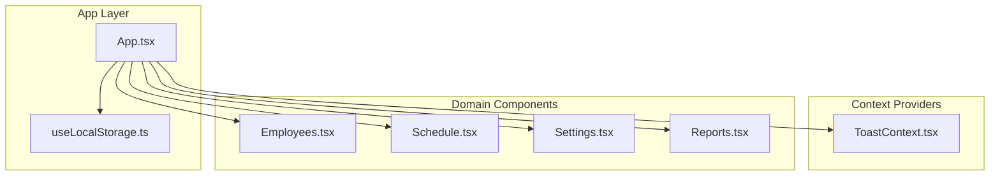
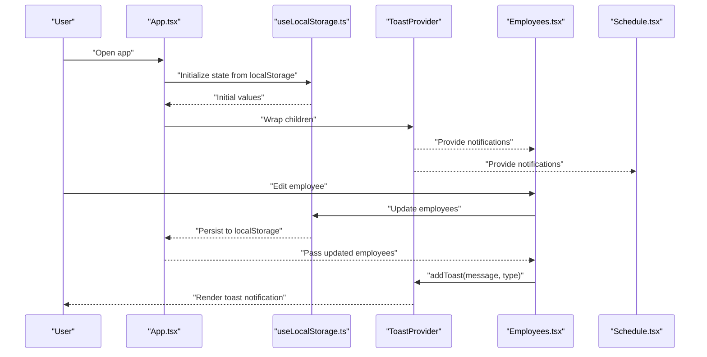
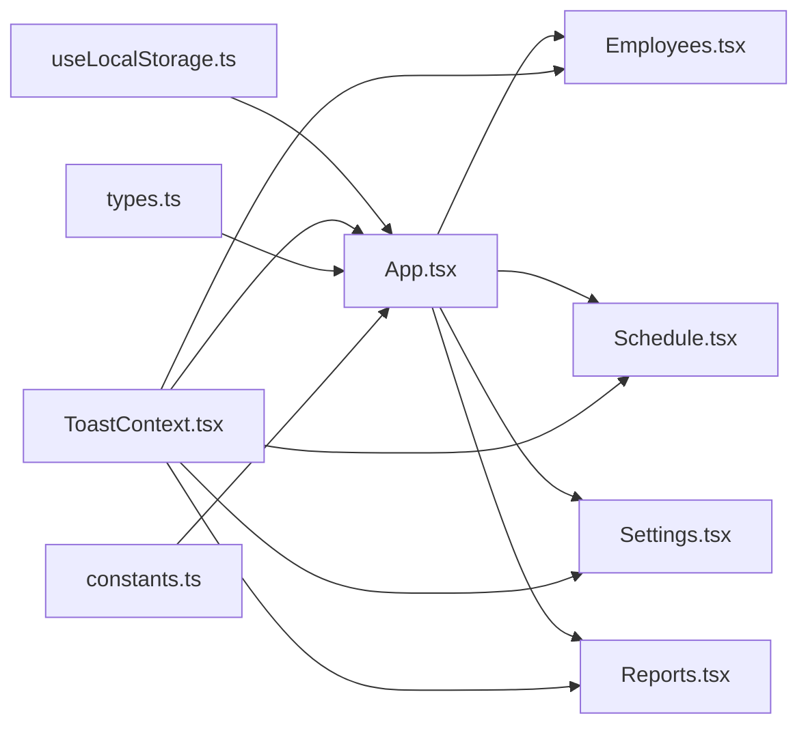

# State Management

<cite>
**Referenced Files in This Document**
- [App.tsx](file://App.tsx)
- [ToastContext.tsx](file://contexts/ToastContext.tsx)
- [useLocalStorage.ts](file://hooks/useLocalStorage.ts)
- [Employees.tsx](file://components/Employees.tsx)
- [Schedule.tsx](file://components/Schedule.tsx)
- [Settings.tsx](file://components/Settings.tsx)
- [Reports.tsx](file://components/Reports.tsx)
- [types.ts](file://types.ts)
- [constants.ts](file://constants.ts)
</cite>

## Table of Contents
1. [Introduction](#introduction)
2. [Project Structure](#project-structure)
3. [Core Components](#core-components)
4. [Architecture Overview](#architecture-overview)
5. [Detailed Component Analysis](#detailed-component-analysis)
6. [Dependency Analysis](#dependency-analysis)
7. [Performance Considerations](#performance-considerations)
8. [Troubleshooting Guide](#troubleshooting-guide)
9. [Conclusion](#conclusion)
10. [Appendices](#appendices)

## Introduction
This document explains the state management architecture used in the application. It focuses on:
- Global state distribution via React Context API
- Notification delivery through a dedicated Toast provider
- Persistent state management using a custom useLocalStorage hook
- How App.tsx orchestrates domain state and passes it down to components
- Integration between context providers and components
- Practical examples of state updates and persistence across sessions
- Trade-offs between local component state, prop drilling, and global context usage

## Project Structure
The state management spans three primary areas:
- Global domain state: managed in App.tsx using useLocalStorage hooks
- Context providers: ToastProvider wraps the app to deliver notifications
- Local component state: used for UI-only concerns inside components

**Diagram sources**
- [App.tsx](file://App.tsx#L1-L120)
- [useLocalStorage.ts](file://hooks/useLocalStorage.ts#L1-L23)
- [ToastContext.tsx](file://contexts/ToastContext.tsx#L1-L56)
- [Employees.tsx](file://components/Employees.tsx#L1-L60)
- [Schedule.tsx](file://components/Schedule.tsx#L1-L40)
- [Settings.tsx](file://components/Settings.tsx#L1-L70)
- [Reports.tsx](file://components/Reports.tsx#L1-L45)

**Section sources**
- [App.tsx](file://App.tsx#L1-L120)
- [useLocalStorage.ts](file://hooks/useLocalStorage.ts#L1-L23)
- [ToastContext.tsx](file://contexts/ToastContext.tsx#L1-L56)

## Core Components
- App.tsx: Declares and manages all domain state using useLocalStorage hooks. It also sets up the ToastProvider and renders the active view with props passed to child components.
- useLocalStorage.ts: A reusable hook that initializes state from localStorage and persists updates back to storage.
- ToastContext.tsx: Provides a global notification service via a context provider and a custom hook useToast.

Key responsibilities:
- Domain state initialization and persistence
- Cross-component notification delivery
- Propagation of state to deeply nested components

**Section sources**
- [App.tsx](file://App.tsx#L36-L110)
- [useLocalStorage.ts](file://hooks/useLocalStorage.ts#L1-L23)
- [ToastContext.tsx](file://contexts/ToastContext.tsx#L1-L56)

## Architecture Overview
The application uses a hybrid state strategy:
- Global domain state is centralized in App.tsx and persisted via useLocalStorage
- Notifications are globally available through ToastProvider
- Components consume state via props and use useToast for feedback

**Diagram sources**
- [App.tsx](file://App.tsx#L36-L110)
- [useLocalStorage.ts](file://hooks/useLocalStorage.ts#L1-L23)
- [ToastContext.tsx](file://contexts/ToastContext.tsx#L1-L56)
- [Employees.tsx](file://components/Employees.tsx#L1-L60)
- [Schedule.tsx](file://components/Schedule.tsx#L1-L40)

## Detailed Component Analysis

### App.tsx: Centralized Domain State and Provider Integration
- Initializes multiple domain entities using useLocalStorage:
  - Employees, Classes, Lessons, ScheduleConfig, Roles, Absences, EngineContext, SubstitutionLogs, DashboardLayout
  - AcademicYear, DayPatterns, Calendar-related entities (Holidays, Overrides, Events, Tasks, Comments)
- Manages UI-only state (activeView, sidebarOpen, scheduleFilter, flash alert mode, kiosk mode, orbit drag state)
- Wraps the entire UI with ToastProvider so all components can trigger notifications
- Passes state and setters down to child components as props

Examples of state updates and persistence:
- Updating employees: [App.tsx](file://App.tsx#L36-L46)
- Updating schedule configuration: [App.tsx](file://App.tsx#L40-L46)
- Updating engine context: [App.tsx](file://App.tsx#L40-L46)
- Triggering toasts: [App.tsx](file://App.tsx#L229-L248) (provider wrapper)
- Passing props to views: [App.tsx](file://App.tsx#L280-L310)

**Section sources**
- [App.tsx](file://App.tsx#L36-L110)
- [App.tsx](file://App.tsx#L228-L310)
- [App.tsx](file://App.tsx#L416-L427)

### useLocalStorage Hook: Persistent State Management
- Reads initial value from localStorage during mount
- Persists updates to localStorage on change
- Handles JSON parsing/serialization errors gracefully

Implementation highlights:
- Initialization from localStorage: [useLocalStorage.ts](file://hooks/useLocalStorage.ts#L1-L12)
- Persistence on state change: [useLocalStorage.ts](file://hooks/useLocalStorage.ts#L14-L20)

Trade-offs:
- Pros: Simple, reliable persistence; minimal boilerplate
- Cons: Single-source persistence; potential for large payloads; synchronous writes

**Section sources**
- [useLocalStorage.ts](file://hooks/useLocalStorage.ts#L1-L23)

### ToastContext: Global Notification Delivery
- Provides a global addToast function via context
- Renders a stack of toasts with automatic dismissal
- Enforces usage within ToastProvider via a custom hook

Integration:
- Wrapped around the app in App.tsx: [App.tsx](file://App.tsx#L228-L248)
- Consumed by components (e.g., Employees.tsx): [Employees.tsx](file://components/Employees.tsx#L1-L25)

**Section sources**
- [ToastContext.tsx](file://contexts/ToastContext.tsx#L1-L56)
- [Employees.tsx](file://components/Employees.tsx#L1-L25)

### Component-Level Consumers: Employees, Schedule, Settings, Reports
- Employees.tsx: Uses props for employees and setters to mutate state; triggers toasts for user feedback
  - Example: Saving edits and deleting records: [Employees.tsx](file://components/Employees.tsx#L146-L215)
  - Example: Bulk deletion and selection: [Employees.tsx](file://components/Employees.tsx#L218-L252)
- Schedule.tsx: Receives lessons and setters; toggles modes via a callback from App.tsx
  - Example: Mode toggling: [Schedule.tsx](file://components/Schedule.tsx#L286-L299)
- Settings.tsx: Receives scheduleConfig and setters; updates configuration and engine context
  - Example: Updating schedule config: [Settings.tsx](file://components/Settings.tsx#L74-L108)
  - Example: Adding a new weighted mode: [Settings.tsx](file://components/Settings.tsx#L233-L247)
- Reports.tsx: Consumes domain data to compute statistics and drive UI state locally
  - Example: Operational report computation: [Reports.tsx](file://components/Reports.tsx#L145-L200)

**Section sources**
- [Employees.tsx](file://components/Employees.tsx#L146-L215)
- [Employees.tsx](file://components/Employees.tsx#L218-L252)
- [Schedule.tsx](file://components/Schedule.tsx#L286-L299)
- [Settings.tsx](file://components/Settings.tsx#L74-L108)
- [Settings.tsx](file://components/Settings.tsx#L233-L247)
- [Reports.tsx](file://components/Reports.tsx#L145-L200)

## Dependency Analysis
- App.tsx depends on:
  - useLocalStorage.ts for state initialization and persistence
  - ToastContext.tsx for notification delivery
  - Types and constants for initial values and domain models
- Components depend on:
  - Props from App.tsx for domain state
  - useToast hook for notifications
  - Utility functions and constants for rendering and calculations

**Diagram sources**
- [App.tsx](file://App.tsx#L1-L120)
- [useLocalStorage.ts](file://hooks/useLocalStorage.ts#L1-L23)
- [ToastContext.tsx](file://contexts/ToastContext.tsx#L1-L56)
- [types.ts](file://types.ts#L1-L200)
- [constants.ts](file://constants.ts#L1-L200)
- [Employees.tsx](file://components/Employees.tsx#L1-L60)
- [Schedule.tsx](file://components/Schedule.tsx#L1-L40)
- [Settings.tsx](file://components/Settings.tsx#L1-L70)
- [Reports.tsx](file://components/Reports.tsx#L1-L45)

**Section sources**
- [App.tsx](file://App.tsx#L1-L120)
- [types.ts](file://types.ts#L1-L200)
- [constants.ts](file://constants.ts#L1-L200)

## Performance Considerations
- useLocalStorage hook writes synchronously to localStorage on every state change. For frequent updates, consider batching or debouncing to reduce write pressure.
- Large arrays (e.g., lessons, absences) serialized to JSON can increase storage size and parsing overhead. Consider pagination or virtualization for rendering-heavy lists.
- Computationally expensive derived data (e.g., schedule overlays) should leverage memoization to avoid recomputation on every render.

[No sources needed since this section provides general guidance]

## Troubleshooting Guide
Common issues and resolutions:
- Toast not showing:
  - Ensure ToastProvider wraps the component tree. See [App.tsx](file://App.tsx#L228-L248).
  - Verify useToast is used within the provider. See [ToastContext.tsx](file://contexts/ToastContext.tsx#L1-L30).
- State not persisting:
  - Confirm keys match between initialization and updates. See [useLocalStorage.ts](file://hooks/useLocalStorage.ts#L1-L23).
  - Check for JSON serialization errors in localStorage. See [useLocalStorage.ts](file://hooks/useLocalStorage.ts#L1-L23).
- Prop drilling concerns:
  - Prefer passing only the necessary props to components. App.tsx centralizes state and avoids deep nesting.
- Component state vs. domain state:
  - Use component-local state for UI-only concerns (e.g., modal visibility, filters). Use domain state for shared data across views.

**Section sources**
- [App.tsx](file://App.tsx#L228-L248)
- [ToastContext.tsx](file://contexts/ToastContext.tsx#L1-L30)
- [useLocalStorage.ts](file://hooks/useLocalStorage.ts#L1-L23)

## Conclusion
The application employs a pragmatic state management strategy:
- Global domain state is centralized and persisted using a custom hook
- Notifications are delivered globally via a context provider
- Components receive only the data they need via props
This approach balances simplicity, reliability, and scalability while keeping the UI responsive and maintainable.

[No sources needed since this section summarizes without analyzing specific files]

## Appendices

### State Updates and Persistence Examples
- Persisting employees:
  - Initialize: [App.tsx](file://App.tsx#L36-L46)
  - Update: [Employees.tsx](file://components/Employees.tsx#L188-L199)
- Persisting schedule configuration:
  - Initialize: [App.tsx](file://App.tsx#L36-L46)
  - Update: [Settings.tsx](file://components/Settings.tsx#L74-L108)
- Persisting engine context:
  - Initialize: [App.tsx](file://App.tsx#L36-L46)
  - Update: [App.tsx](file://App.tsx#L416-L427)
- Triggering toasts:
  - Provider wrapper: [App.tsx](file://App.tsx#L228-L248)
  - Consumer usage: [Employees.tsx](file://components/Employees.tsx#L1-L25)

**Section sources**
- [App.tsx](file://App.tsx#L36-L46)
- [App.tsx](file://App.tsx#L416-L427)
- [Employees.tsx](file://components/Employees.tsx#L1-L25)
- [Settings.tsx](file://components/Settings.tsx#L74-L108)

### Guidance on Choosing State Approaches
- Use local component state for:
  - UI-only flags (e.g., modal open/close, active tab)
  - Short-lived temporary values (e.g., form inputs)
- Use props for:
  - Data shared across a few levels of components
  - Read-only data passed down from a parent
- Use global context for:
  - Cross-cutting concerns (e.g., notifications, theme)
  - Shared domain data accessed by many components
- Use persistent hooks for:
  - Domain entities requiring session continuity (e.g., employees, schedule config)
  - User preferences and dashboard layouts

[No sources needed since this section provides general guidance]