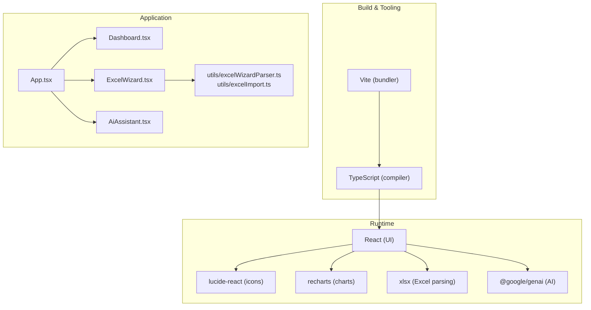
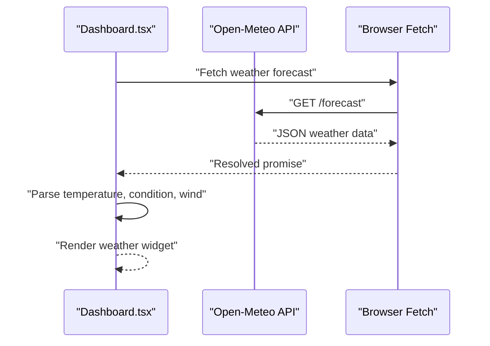
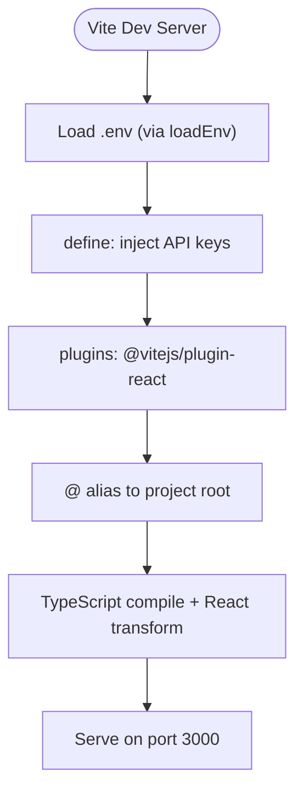
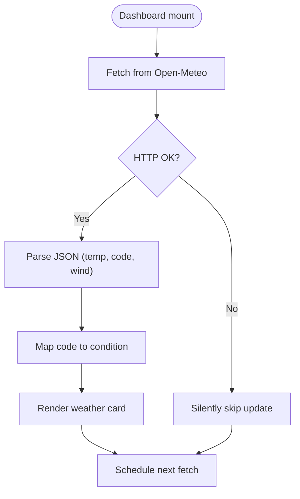
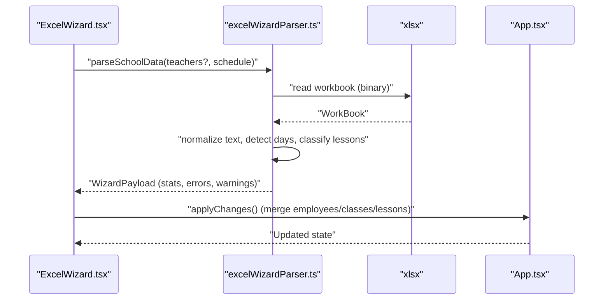
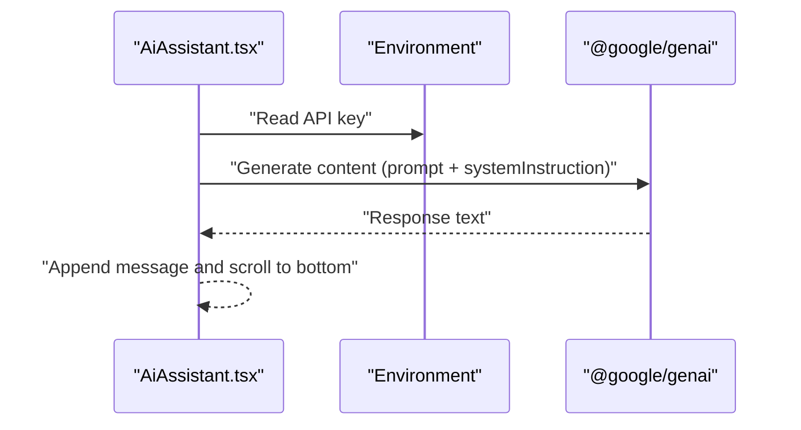
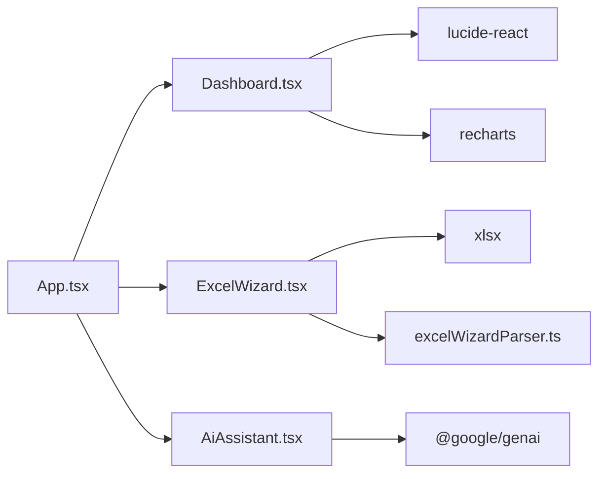

# Technology Stack & Dependencies

<cite>
**Referenced Files in This Document**
- [package.json](file://package.json)
- [vite.config.ts](file://vite.config.ts)
- [tsconfig.json](file://tsconfig.json)
- [App.tsx](file://App.tsx)
- [components/Dashboard.tsx](file://components/Dashboard.tsx)
- [components/ExcelWizard.tsx](file://components/ExcelWizard.tsx)
- [components/AiAssistant.tsx](file://components/AiAssistant.tsx)
- [utils/excelWizardParser.ts](file://utils/excelWizardParser.ts)
- [utils/excelImport.ts](file://utils/excelImport.ts)
- [README.md](file://README.md)
</cite>

## Table of Contents
1. [Introduction](#introduction)
2. [Project Structure](#project-structure)
3. [Core Components](#core-components)
4. [Architecture Overview](#architecture-overview)
5. [Detailed Component Analysis](#detailed-component-analysis)
6. [Dependency Analysis](#dependency-analysis)
7. [Performance Considerations](#performance-considerations)
8. [Troubleshooting Guide](#troubleshooting-guide)
9. [Conclusion](#conclusion)

## Introduction
This section documents the technology stack powering the application, focusing on React with Vite for rapid development, TypeScript for type safety, and key third-party libraries. It explains how dependencies integrate into the component-based architecture, highlights configuration details, and demonstrates practical usage in components such as the Dashboard (weather integration) and ExcelWizard (Excel processing). It also covers environment configuration for AI integration and outlines version compatibility and security considerations.

## Project Structure
The project follows a component-driven architecture with a clear separation of concerns:
- UI components under components/
- Utilities under utils/
- Global state and views orchestrated in App.tsx
- Build-time configuration in vite.config.ts and tsconfig.json
- Package dependencies managed in package.json

**Diagram sources**
- [vite.config.ts](file://vite.config.ts#L1-L24)
- [tsconfig.json](file://tsconfig.json#L1-L29)
- [package.json](file://package.json#L1-L26)
- [App.tsx](file://App.tsx#L1-L200)
- [components/Dashboard.tsx](file://components/Dashboard.tsx#L1-L120)
- [components/ExcelWizard.tsx](file://components/ExcelWizard.tsx#L1-L120)
- [components/AiAssistant.tsx](file://components/AiAssistant.tsx#L1-L60)
- [utils/excelWizardParser.ts](file://utils/excelWizardParser.ts#L1-L40)
- [utils/excelImport.ts](file://utils/excelImport.ts#L1-L40)

**Section sources**
- [package.json](file://package.json#L1-L26)
- [vite.config.ts](file://vite.config.ts#L1-L24)
- [tsconfig.json](file://tsconfig.json#L1-L29)
- [App.tsx](file://App.tsx#L1-L120)

## Core Components
- React with Vite: Provides fast development and hot module replacement, enabling rapid iteration during UI and feature development.
- TypeScript: Ensures type safety across components, utilities, and types, reducing runtime errors and improving maintainability.
- lucide-react: Iconography library integrated throughout components for consistent UI affordances.
- recharts: Used for data visualization within dashboards and reports.
- xlsx: Core library for Excel file parsing and processing in the Excel wizard and import utilities.
- @google/genai: Enables AI-powered chat and insights within the AI Assistant component.

**Section sources**
- [package.json](file://package.json#L1-L26)
- [components/Dashboard.tsx](file://components/Dashboard.tsx#L1-L120)
- [components/ExcelWizard.tsx](file://components/ExcelWizard.tsx#L1-L120)
- [components/AiAssistant.tsx](file://components/AiAssistant.tsx#L1-L60)

## Architecture Overview
The application’s runtime architecture integrates React components with external libraries through clearly defined boundaries:
- UI components import icons from lucide-react and render charts via recharts.
- Excel processing is encapsulated in utilities that rely on xlsx for binary parsing and structured extraction.
- AI integration is isolated in the AiAssistant component, which uses @google/genai to generate contextual responses.
- Vite and TypeScript provide build-time support, with Vite resolving aliases and injecting environment variables.

**Diagram sources**
- [components/Dashboard.tsx](file://components/Dashboard.tsx#L50-L80)

**Section sources**
- [components/Dashboard.tsx](file://components/Dashboard.tsx#L50-L80)

## Detailed Component Analysis

### React + Vite + TypeScript
- Vite configuration:
  - Development server runs on port 3000 and binds to 0.0.0.0 for host accessibility.
  - Plugin stack includes @vitejs/plugin-react for JSX transformations.
  - Environment variables are injected via define for API keys.
  - Path alias @ resolves to the project root for clean imports.
- TypeScript configuration:
  - Targets ES2022, uses ESNext modules, and JSX via react-jsx.
  - Bundler module resolution and isolatedModules enable Vite-friendly builds.
  - Path mapping @/* configured for consistent imports.

**Diagram sources**
- [vite.config.ts](file://vite.config.ts#L1-L24)
- [tsconfig.json](file://tsconfig.json#L1-L29)

**Section sources**
- [vite.config.ts](file://vite.config.ts#L1-L24)
- [tsconfig.json](file://tsconfig.json#L1-L29)

### Weather Integration in Dashboard
- The Dashboard component fetches weather data from Open-Meteo and renders a live weather widget.
- It parses the response to derive temperature, condition, and wind speed, then selects an appropriate icon based on the weather code.
- The component schedules periodic updates and gracefully handles network errors.

**Diagram sources**
- [components/Dashboard.tsx](file://components/Dashboard.tsx#L50-L80)

**Section sources**
- [components/Dashboard.tsx](file://components/Dashboard.tsx#L50-L80)

### Excel Processing in ExcelWizard
- The ExcelWizard orchestrates dual-file ingestion (teachers and schedule) and delegates parsing to utilities.
- The wizard displays diagnostic statistics and warnings, then applies changes to the app state.
- The parsing utilities use xlsx to read binary data, normalize Arabic text, and reconcile teacher/class/slot data.

**Diagram sources**
- [components/ExcelWizard.tsx](file://components/ExcelWizard.tsx#L35-L120)
- [utils/excelWizardParser.ts](file://utils/excelWizardParser.ts#L180-L220)
- [utils/excelImport.ts](file://utils/excelImport.ts#L41-L60)

**Section sources**
- [components/ExcelWizard.tsx](file://components/ExcelWizard.tsx#L35-L120)
- [utils/excelWizardParser.ts](file://utils/excelWizardParser.ts#L180-L220)
- [utils/excelImport.ts](file://utils/excelImport.ts#L41-L60)

### AI Integration in AiAssistant
- The AiAssistant component integrates @google/genai to generate contextual responses using the current date and recent activity logs.
- It reads the API key from environment variables and constructs a system instruction that includes field-awareness.
- Messages are rendered in a chat-like UI with loading states and error notifications.

**Diagram sources**
- [components/AiAssistant.tsx](file://components/AiAssistant.tsx#L25-L57)
- [README.md](file://README.md#L16-L21)

**Section sources**
- [components/AiAssistant.tsx](file://components/AiAssistant.tsx#L25-L57)
- [README.md](file://README.md#L16-L21)

## Dependency Analysis
- Runtime dependencies:
  - lucide-react: Iconography used across components for actions, navigation, and status indicators.
  - recharts: Charting library used for visualizing trends and distributions in dashboards and reports.
  - xlsx: Excel parsing library enabling robust import of timetable matrices and HR lists.
  - @google/genai: AI model integration for conversational insights and recommendations.
- Build dependencies:
  - @vitejs/plugin-react: JSX transform and React Fast Refresh.
  - TypeScript and Vite: Type checking and bundling for modern JS targets.

**Diagram sources**
- [package.json](file://package.json#L1-L26)
- [App.tsx](file://App.tsx#L1-L120)
- [components/Dashboard.tsx](file://components/Dashboard.tsx#L1-L120)
- [components/ExcelWizard.tsx](file://components/ExcelWizard.tsx#L1-L120)
- [components/AiAssistant.tsx](file://components/AiAssistant.tsx#L1-L60)
- [utils/excelWizardParser.ts](file://utils/excelWizardParser.ts#L1-L40)

**Section sources**
- [package.json](file://package.json#L1-L26)
- [App.tsx](file://App.tsx#L1-L120)

## Performance Considerations
- Vite’s fast refresh and tree-shaking reduce bundle sizes and improve iteration speed.
- React.memo is used in the Dashboard’s LiveChronometer to minimize re-renders.
- Efficient chart rendering with recharts avoids unnecessary DOM churn.
- Excel parsing is asynchronous and defers heavy computations to worker-friendly utilities.

[No sources needed since this section provides general guidance]

## Troubleshooting Guide
- Weather widget shows default values:
  - The Dashboard fetches weather data on mount and retries periodically. Network failures are handled silently; ensure the device has internet access.
- Excel import errors:
  - The wizard surfaces sheet and cell-level errors. Validate file formats and column headers as per the parser’s expectations.
- AI assistant not responding:
  - Ensure the GEMINI_API_KEY is set in the environment. The component checks for process.env.API_KEY before generating content.

**Section sources**
- [components/Dashboard.tsx](file://components/Dashboard.tsx#L50-L80)
- [components/ExcelWizard.tsx](file://components/ExcelWizard.tsx#L350-L420)
- [components/AiAssistant.tsx](file://components/AiAssistant.tsx#L25-L57)
- [README.md](file://README.md#L16-L21)

## Conclusion
The application leverages a modern, type-safe stack with React, Vite, and TypeScript to deliver a responsive UI. External libraries enhance functionality: lucide-react for icons, recharts for visualization, xlsx for Excel processing, and @google/genai for AI capabilities. Vite and TypeScript configurations streamline development and build processes, while component boundaries isolate concerns for maintainability and scalability.