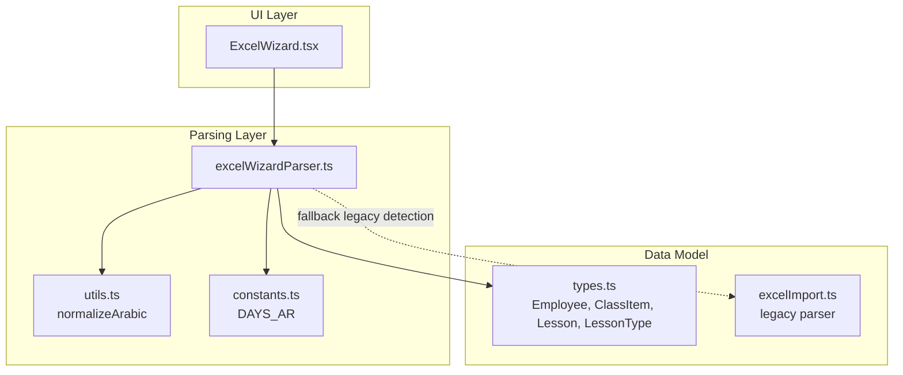
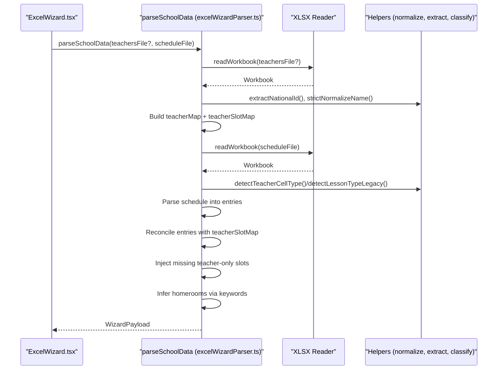
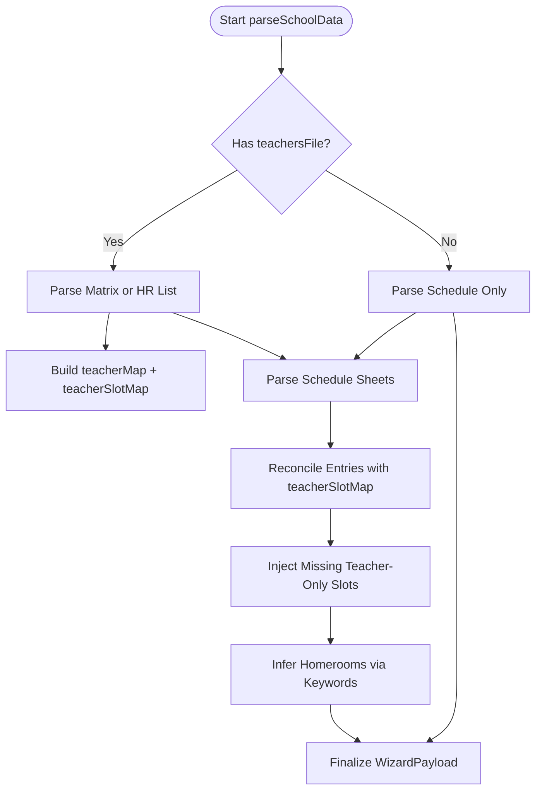
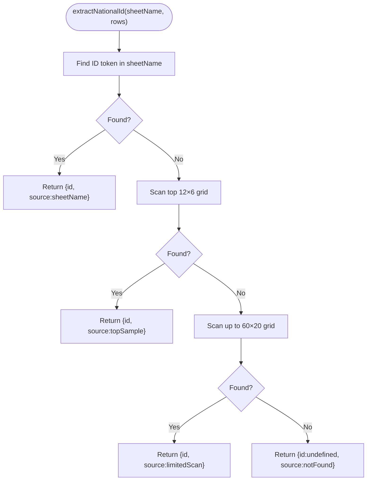
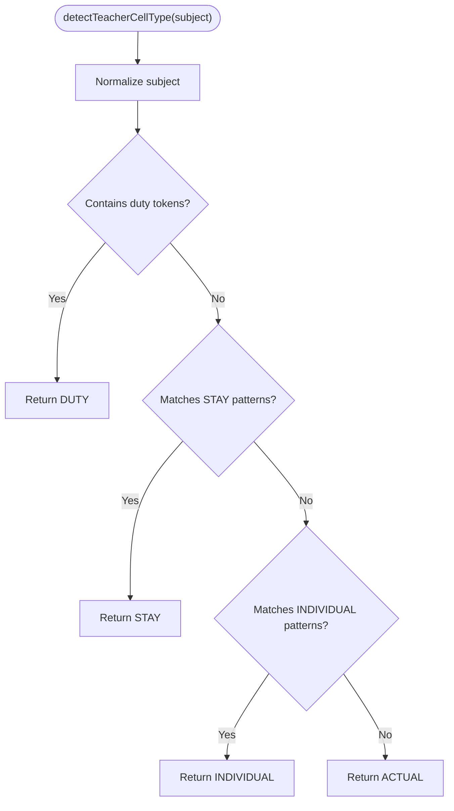
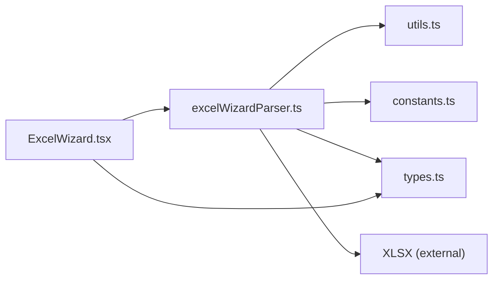

# Advanced Excel Wizard

<cite>
**Referenced Files in This Document**
- [excelWizardParser.ts](file://utils/excelWizardParser.ts)
- [ExcelWizard.tsx](file://components/ExcelWizard.tsx)
- [excelImport.ts](file://utils/excelImport.ts)
- [utils.ts](file://utils.ts)
- [types.ts](file://types.ts)
- [constants.ts](file://constants.ts)
</cite>

## Table of Contents
1. [Introduction](#introduction)
2. [Project Structure](#project-structure)
3. [Core Components](#core-components)
4. [Architecture Overview](#architecture-overview)
5. [Detailed Component Analysis](#detailed-component-analysis)
6. [Dependency Analysis](#dependency-analysis)
7. [Performance Considerations](#performance-considerations)
8. [Troubleshooting Guide](#troubleshooting-guide)
9. [Conclusion](#conclusion)

## Introduction
This document explains the advanced Excel wizard parsing pipeline implemented in excelWizardParser.ts. It focuses on the orchestration of dual-file parsing using a teachers file and a schedule file, robust identity extraction for teachers, authoritative lesson-type classification, reconciliation between schedule entries and teacher matrices, and the final WizardPayload structure. It also covers how the wizard infers homeroom teachers, handles missing or inconsistent data, and provides performance and troubleshooting guidance for large Excel workbooks.

## Project Structure
The wizard spans two primary areas:
- Parser utilities: excelWizardParser.ts defines the parsing logic, helpers, and the WizardPayload model.
- UI integration: ExcelWizard.tsx wires the parser into the app, displays diagnostics, and applies the parsed data to the system.

**Diagram sources**
- [ExcelWizard.tsx](file://components/ExcelWizard.tsx#L1-L120)
- [excelWizardParser.ts](file://utils/excelWizardParser.ts#L1-L120)
- [utils.ts](file://utils.ts#L1-L40)
- [constants.ts](file://constants.ts#L1-L10)
- [types.ts](file://types.ts#L1-L60)
- [excelImport.ts](file://utils/excelImport.ts#L1-L60)

**Section sources**
- [ExcelWizard.tsx](file://components/ExcelWizard.tsx#L1-L120)
- [excelWizardParser.ts](file://utils/excelWizardParser.ts#L1-L120)

## Core Components
- WizardPayload: The unified result container holding normalized teachers, classes, entries, statistics, and diagnostics.
- parseSchoolData: Orchestrates dual-file parsing, identity resolution, authoritative classification, reconciliation, and homeroom inference.
- Helpers:
  - extractNationalId: Robust ID discovery from sheet names and cell grids.
  - strictNormalizeName: Name normalization for deduplication and keying.
  - detectTeacherCellType: Strict classification of teacher matrix cells into ACTUAL, STAY, INDIVIDUAL, DUTY.
  - detectLessonTypeLegacy: Legacy classification for schedule-only scenarios.
  - readWorkbook: Asynchronous XLSX workbook loader.

**Section sources**
- [excelWizardParser.ts](file://utils/excelWizardParser.ts#L60-L120)
- [excelWizardParser.ts](file://utils/excelWizardParser.ts#L108-L178)
- [excelWizardParser.ts](file://utils/excelWizardParser.ts#L180-L200)

## Architecture Overview
The wizard follows a deterministic, authoritative-first pipeline:
1. Optional teachers file parsing (matrix or HR list) to build a teacher map and an authoritative teacherSlotMap keyed by normalized teacher name, day, and period.
2. Schedule file parsing to produce entries, with initial lesson-type determination based on whether a teachers file exists.
3. Reconciliation pass: Force schedule entries to adopt authoritative types from the teacherSlotMap when available; compute teacher totals.
4. Injection pass: Add missing teacher-only slots (STAY/INDIVIDUAL/MEETINGS) not present in the schedule.
5. Homeroom inference: Detect homeroom teachers per class using keyword-based heuristics.
6. Finalization: Produce WizardPayload with normalized entities and statistics.

**Diagram sources**
- [excelWizardParser.ts](file://utils/excelWizardParser.ts#L199-L716)
- [ExcelWizard.tsx](file://components/ExcelWizard.tsx#L35-L70)

## Detailed Component Analysis

### parseSchoolData Orchestration
- Dual-file strategy:
  - Teachers file (optional): Parses either a matrix (per-teacher schedule) or an HR list. Builds a teacherMap keyed by id or normalized name, and a teacherSlotMap keyed by normalized name|day|period with authoritative lesson types.
  - Schedule file (required): Parses class schedule sheets, detects days, and builds entries. Uses authoritative types when available; otherwise falls back to legacy classification.
- Identity resolution:
  - extractNationalId attempts to find a 5–9 digit ID from the sheet name, then scans the top-left grid, then performs a limited full scan. It records the source of discovery.
  - strictNormalizeName removes prefixes and normalizes Arabic characters to a canonical form for deduplication.
- Authoritative classification:
  - detectTeacherCellType enforces strict rules for teacher matrix cells, prioritizing DUTY, STAY, INDIVIDUAL, then defaulting to ACTUAL.
- Reconciliation and injection:
  - First pass reconciles schedule entries to authoritative types and recomputes teacher totals.
  - Second pass injects missing teacher-only slots not present in the schedule.
- Homeroom inference:
  - Keywords like “مهارات”, “تربية”, “حياة”, “توجيه”, “مربي” are matched against subjects; the teacher who teaches the most such lessons to a class is inferred as the homeroom teacher.

**Diagram sources**
- [excelWizardParser.ts](file://utils/excelWizardParser.ts#L199-L716)

**Section sources**
- [excelWizardParser.ts](file://utils/excelWizardParser.ts#L199-L716)

### extractNationalId: Robust ID Discovery
- Strategy:
  1) Try sheet name for an ID token.
  2) Top-sample scan of the first 12 rows × 6 columns.
  3) Limited full scan up to 60 rows × 20 columns.
- Returns the discovered ID and the source of discovery (sheetName, topSample, limitedScan, notFound).

**Diagram sources**
- [excelWizardParser.ts](file://utils/excelWizardParser.ts#L108-L132)

**Section sources**
- [excelWizardParser.ts](file://utils/excelWizardParser.ts#L108-L132)

### strictNormalizeName: Name Standardization
- Removes prefixes (e.g., Dr., Prof.), normalizes Arabic characters, and collapses whitespace.
- Ensures consistent keying for deduplication across files.

**Section sources**
- [excelWizardParser.ts](file://utils/excelWizardParser.ts#L98-L106)
- [utils.ts](file://utils.ts#L17-L27)

### detectTeacherCellType: Strict Classification Rules
- DUTY takes precedence.
- STAY has absolute priority (including team meetings and coordination).
- INDIVIDUAL requires explicit indicators (individual, private, follow-up).
- Default is ACTUAL.

**Diagram sources**
- [excelWizardParser.ts](file://utils/excelWizardParser.ts#L134-L158)

**Section sources**
- [excelWizardParser.ts](file://utils/excelWizardParser.ts#L134-L158)

### detectLessonTypeLegacy: Schedule-Only Classification
- Used when no teachers file is provided.
- Similar logic to strict classification but with legacy allowances (e.g., support treated as individual).

**Section sources**
- [excelWizardParser.ts](file://utils/excelWizardParser.ts#L160-L178)

### Reconciliation and Injection
- Reconciliation pass:
  - For each entry, derive the slot key and, if authoritative, override the lesson type from the teacherSlotMap.
  - Recompute teacher totals (excluding DUTY).
- Injection pass:
  - For each slot in the teacherSlotMap not present in the schedule, add a NO_CLASS entry with the authoritative type and update totals.

**Section sources**
- [excelWizardParser.ts](file://utils/excelWizardParser.ts#L585-L662)

### Homeroom Inference
- For each class, collect entries tagged with homeroom-related keywords.
- Count occurrences per teacher and select the most frequent teacher as the homeroom teacher.
- Mark the teacher’s role as homeroom and add a diagnostic flag.

**Section sources**
- [excelWizardParser.ts](file://utils/excelWizardParser.ts#L664-L700)

### WizardPayload Structure
- Encapsulates:
  - source: Combined file names.
  - importedAtISO: Timestamp.
  - schoolStats: Counts for teachers, classes, sections, days, periods, entries, and skipped sheets/cells.
  - teachers: Normalized teacher records with computed totals and diagnostics.
  - classes: Class records with optional homeroom teacher assignment.
  - entries: Final schedule entries with lesson types.
  - globalFlags: Flags for global behaviors.
  - errors: Aggregated sheet-level, cell-level, and warning messages.

**Section sources**
- [excelWizardParser.ts](file://utils/excelWizardParser.ts#L60-L69)
- [excelWizardParser.ts](file://utils/excelWizardParser.ts#L199-L210)

### UI Integration and Data Application
- ExcelWizard.tsx:
  - Accepts both files, invokes parseSchoolData, and displays statistics and diagnostics.
  - Applies changes by merging teachers, classes, and lessons into the app state, aligning with normalized names and roles.

**Section sources**
- [ExcelWizard.tsx](file://components/ExcelWizard.tsx#L35-L120)
- [ExcelWizard.tsx](file://components/ExcelWizard.tsx#L120-L195)

## Dependency Analysis
- Internal dependencies:
  - excelWizardParser.ts depends on utils.ts for normalizeArabic and constants.ts for canonical day mapping.
  - ExcelWizard.tsx depends on parseSchoolData and types.ts for runtime data models.
- External dependencies:
  - XLSX for workbook parsing.
  - Lucide icons for UI.

**Diagram sources**
- [excelWizardParser.ts](file://utils/excelWizardParser.ts#L1-L40)
- [ExcelWizard.tsx](file://components/ExcelWizard.tsx#L1-L40)
- [utils.ts](file://utils.ts#L1-L40)
- [constants.ts](file://constants.ts#L1-L10)
- [types.ts](file://types.ts#L1-L60)

**Section sources**
- [excelWizardParser.ts](file://utils/excelWizardParser.ts#L1-L40)
- [ExcelWizard.tsx](file://components/ExcelWizard.tsx#L1-L40)

## Performance Considerations
- Memory footprint:
  - teacherMap stores per-teacher records with dedup sets and processed slots; scales linearly with unique identities.
  - teacherSlotMap stores per-slot authoritative types; can grow proportionally to periods × days × unique teachers.
  - processedClasses tracks seen class keys; bounded by number of sheets.
- Scanning strategies:
  - extractNationalId uses top-sample scanning (12×6) and limited full scan (up to 60×20) to minimize cost while improving robustness.
- Complexity:
  - Parsing is O(Sheets × Rows × Columns) plus O(Entries) for reconciliation and injection.
  - Deduplication via strictNormalizeName reduces collisions and improves lookup performance.
- Recommendations:
  - Prefer matrix format when available to leverage authoritative types and reduce ambiguity.
  - Keep sheet names clean and consistent to improve extractNationalId and homeroom inference.
  - For very large files, consider splitting into smaller workbooks or limiting the number of sheets processed.

[No sources needed since this section provides general guidance]

## Troubleshooting Guide
Common issues and resolutions:
- Inconsistent naming:
  - Use strictNormalizeName to standardize names across files; ensure prefixes are removed consistently.
- Missing ID tokens:
  - Rely on top-sample scanning and limited full scan; ensure IDs are present near the top-left corner or within early rows/columns.
- Malformed Excel structures:
  - The parser skips sheets without recognizable headers; verify that the first column contains “الحصة” or “period” and that days appear in headers.
- Ambiguous schedule entries:
  - When no teachers file is provided, legacy detection may misclassify; upload a teachers file to enable strict classification.
- Missing homeroom assignments:
  - The wizard auto-detects homeroom via keywords; if no matches are found, the class remains unassigned.

Diagnostic signals:
- WizardPayload.errors contains aggregated sheetErrors, cellErrors, and warnings.
- WizardPayload.schoolStats includes skippedSheets and skippedCells counts.

**Section sources**
- [excelWizardParser.ts](file://utils/excelWizardParser.ts#L199-L210)
- [excelWizardParser.ts](file://utils/excelWizardParser.ts#L435-L584)
- [ExcelWizard.tsx](file://components/ExcelWizard.tsx#L366-L405)

## Conclusion
The advanced Excel wizard implements a robust, authoritative-first parsing pipeline that harmonizes teacher matrices with class schedules. By extracting IDs from multiple locations, normalizing names, enforcing strict classification rules, and reconciling entries against authoritative slots, it produces a normalized WizardPayload suitable for downstream systems. The wizard also auto-infers homerooms and provides actionable diagnostics to guide users in preparing clean, consistent Excel inputs.