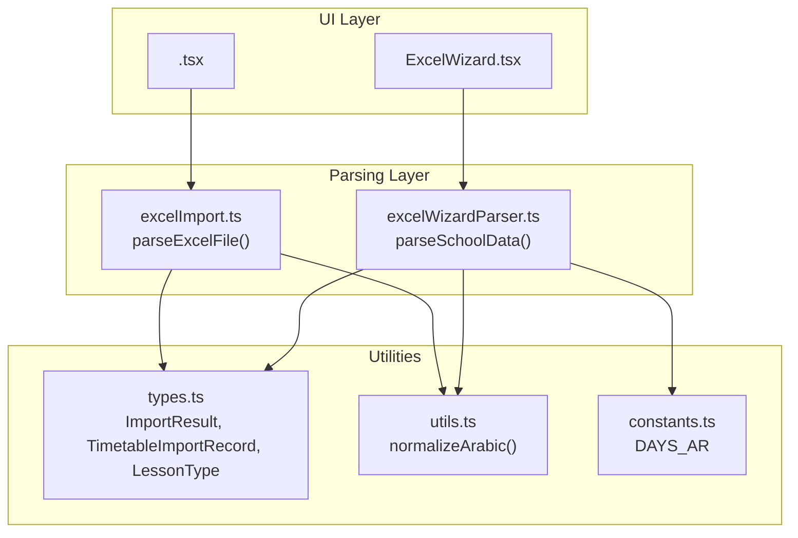
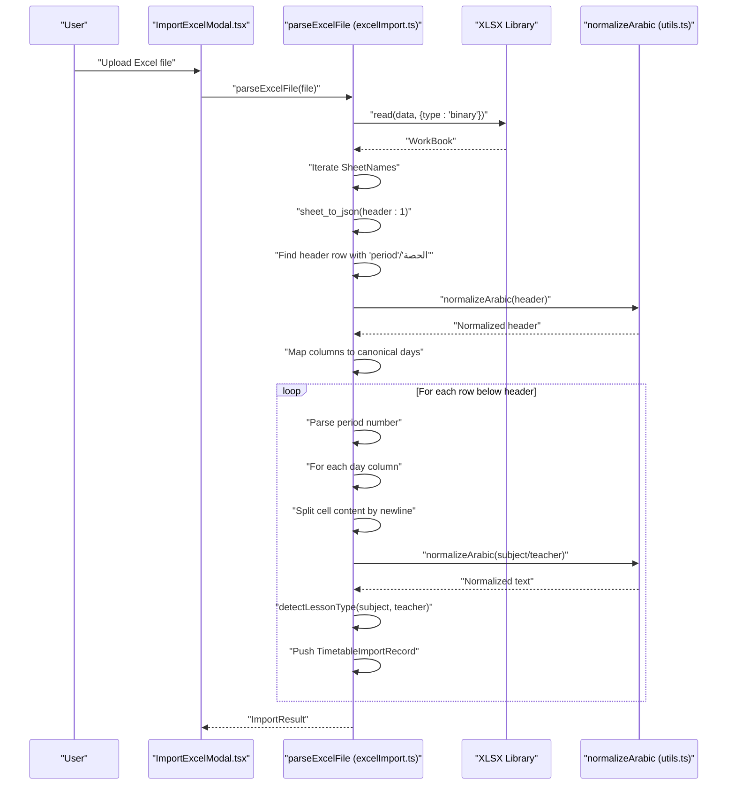
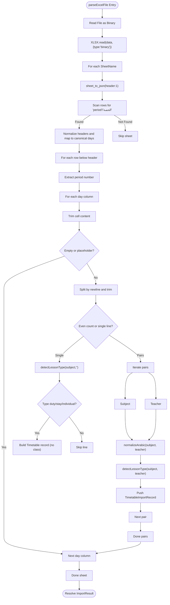
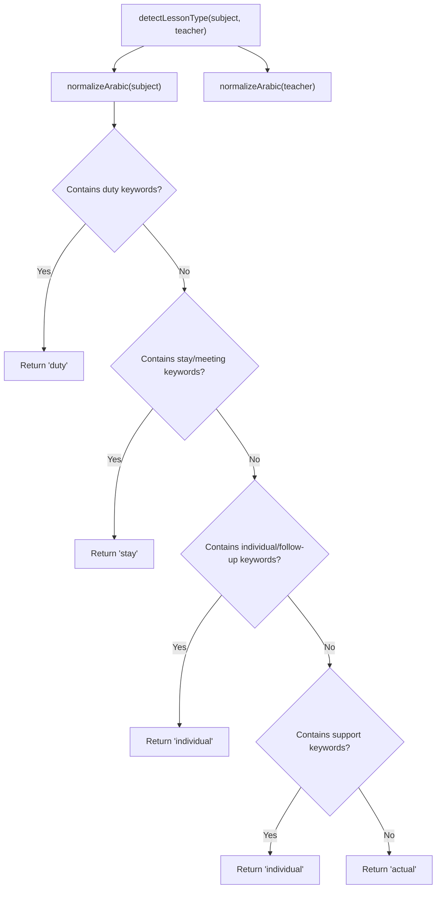
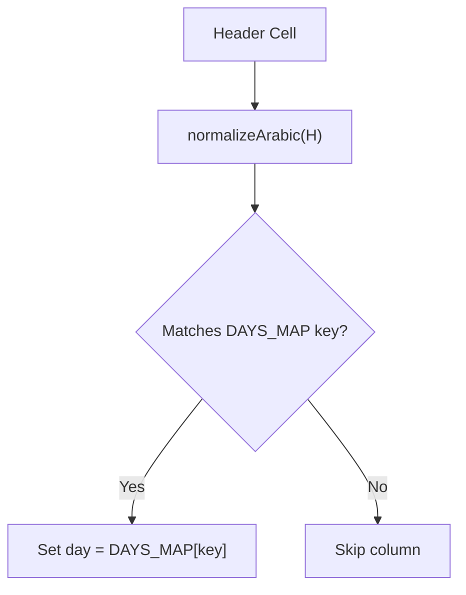
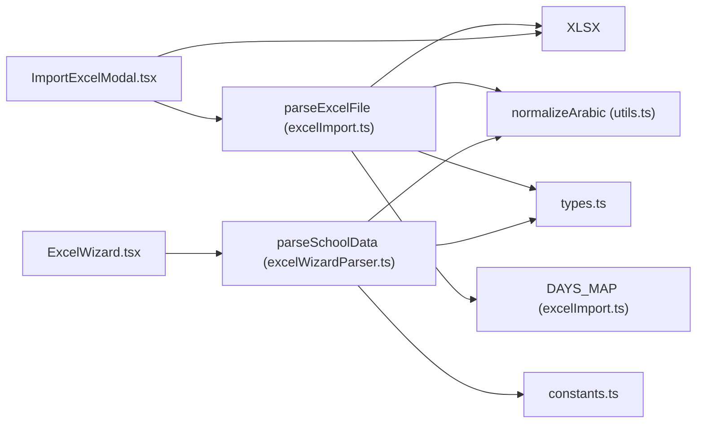

# Basic Excel Import

<cite>
**Referenced Files in This Document**
- [excelImport.ts](file://utils/excelImport.ts)
- [excelWizardParser.ts](file://utils/excelWizardParser.ts)
- [ImportExcelModal.tsx](file://components/ImportExcelModal.tsx)
- [ExcelWizard.tsx](file://components/ExcelWizard.tsx)
- [types.ts](file://types.ts)
- [utils.ts](file://utils.ts)
- [constants.ts](file://constants.ts)
</cite>

## Table of Contents
1. [Introduction](#introduction)
2. [Project Structure](#project-structure)
3. [Core Components](#core-components)
4. [Architecture Overview](#architecture-overview)
5. [Detailed Component Analysis](#detailed-component-analysis)
6. [Dependency Analysis](#dependency-analysis)
7. [Performance Considerations](#performance-considerations)
8. [Troubleshooting Guide](#troubleshooting-guide)
9. [Conclusion](#conclusion)

## Introduction
This document explains the basic Excel import functionality implemented in the repository’s Excel import pipeline. It focuses on the parseExcelFile function in utils/excelImport.ts, detailing how it reads Excel files, detects header rows, normalizes Arabic day names, parses timetable cells into subject-teacher pairs, classifies lessons into duty, stay, individual, or actual categories, and produces a structured ImportResult. It also covers how the UI components ImportExcelModal and ExcelWizard integrate with the parser, and how normalization and error handling are implemented.

## Project Structure
The Excel import feature spans a small set of modules:
- Parser: utils/excelImport.ts implements the basic matrix import logic for class sheets.
- UI Integration: components/ImportExcelModal.tsx and components/ExcelWizard.tsx orchestrate file upload and preview.
- Types and Utilities: types.ts defines ImportResult and related records; utils.ts provides normalizeArabic; constants.ts provides canonical day names.



**Diagram sources**
- [excelImport.ts](file://utils/excelImport.ts#L1-L189)
- [excelWizardParser.ts](file://utils/excelWizardParser.ts#L1-L716)
- [ImportExcelModal.tsx](file://components/ImportExcelModal.tsx#L1-L226)
- [ExcelWizard.tsx](file://components/ExcelWizard.tsx#L1-L486)
- [types.ts](file://types.ts#L354-L382)
- [utils.ts](file://utils.ts#L17-L27)
- [constants.ts](file://constants.ts#L1-L10)

**Section sources**
- [excelImport.ts](file://utils/excelImport.ts#L1-L189)
- [ImportExcelModal.tsx](file://components/ImportExcelModal.tsx#L1-L226)
- [ExcelWizard.tsx](file://components/ExcelWizard.tsx#L1-L486)
- [types.ts](file://types.ts#L354-L382)
- [utils.ts](file://utils.ts#L17-L27)
- [constants.ts](file://constants.ts#L1-L10)

## Core Components
- parseExcelFile: Reads an Excel file, locates the header row containing “period” or “الحصة”, normalizes day column headers, iterates rows, splits multi-line cell content into subject and teacher pairs, classifies lessons, and builds ImportResult.
- ImportExcelModal: Provides a simple UI to upload a matrix-format Excel file, triggers parseExcelFile, and previews results.
- Types: ImportResult, TimetableImportRecord, and LessonType define the output structure and lesson classification.
- normalizeArabic: A shared utility that normalizes Arabic text for robust matching.

Key responsibilities:
- Binary reading and workbook parsing via XLSX.
- Header detection and day normalization.
- Multi-line cell parsing and teacher discovery.
- Lesson type classification using Arabic keyword matching.
- Statistics and error collection.

**Section sources**
- [excelImport.ts](file://utils/excelImport.ts#L16-L39)
- [excelImport.ts](file://utils/excelImport.ts#L41-L189)
- [ImportExcelModal.tsx](file://components/ImportExcelModal.tsx#L36-L60)
- [types.ts](file://types.ts#L354-L382)
- [utils.ts](file://utils.ts#L17-L27)

## Architecture Overview
The basic import follows a straightforward flow: UI triggers parsing, the parser reads the workbook, scans sheets, detects headers, normalizes days, parses cells, classifies lessons, and returns a normalized result.



**Diagram sources**
- [excelImport.ts](file://utils/excelImport.ts#L41-L189)
- [ImportExcelModal.tsx](file://components/ImportExcelModal.tsx#L36-L60)
- [utils.ts](file://utils.ts#L17-L27)

## Detailed Component Analysis

### parseExcelFile Implementation
- Binary reading: Uses FileReader to read the file as binary and XLSX.read to parse into a workbook.
- Header detection: Scans up to a small window of rows to locate the header row containing “period” or “الحصة”.
- Day column mapping: Iterates header cells, normalizes them, and maps to canonical Arabic day names using DAYS_MAP.
- Row iteration: For each row below the header, extracts the period number, then for each day column:
  - Skips empty or placeholder cells.
  - Splits multi-line content into pairs of subject and teacher.
  - Handles single-line content by inferring lesson type and optionally treating as a teacher-only task.
- Lesson classification: detectLessonType uses normalizeArabic to match Arabic keywords for duty, stay, individual, and falls back to actual.
- Output assembly: Builds ImportResult with teachers discovered, timetable records, errors, and statistics.



**Diagram sources**
- [excelImport.ts](file://utils/excelImport.ts#L41-L189)
- [utils.ts](file://utils.ts#L17-L27)

**Section sources**
- [excelImport.ts](file://utils/excelImport.ts#L41-L189)

### detectLessonType Logic
- Uses normalizeArabic to normalize both subject and teacher text.
- Duty detection: Matches Arabic keywords for duty.
- Stay detection: Matches Arabic keywords for stay, team duty, meeting, and variants.
- Individual detection: Matches Arabic keywords for individual, follow-up, and variants.
- Support detection: Treats Arabic support as individual.
- Actual fallback: Everything else is classified as actual.



**Diagram sources**
- [excelImport.ts](file://utils/excelImport.ts#L16-L39)

**Section sources**
- [excelImport.ts](file://utils/excelImport.ts#L16-L39)

### DAYS_MAP Normalization
- The parser maintains a mapping from common Arabic and English variants of day names to a canonical Arabic form.
- During header processing, each header cell is normalized and matched against this map to build a column-to-day index.



**Diagram sources**
- [excelImport.ts](file://utils/excelImport.ts#L6-L15)

**Section sources**
- [excelImport.ts](file://utils/excelImport.ts#L6-L15)

### normalizeArabic Behavior
- Removes diacritics and certain Arabic marks.
- Normalizes “أإآ” to “ا”.
- Converts “ة” to “ه”.
- Converts “ى” to “ي”.
- Collapses whitespace and lowercases.

This ensures robust matching across different character forms in Arabic text.

**Section sources**
- [utils.ts](file://utils.ts#L17-L27)

### ImportResult Structure
- teachers: Array of discovered teacher records.
- timetable: Array of TimetableImportRecord entries.
- errors: Array of error messages collected during parsing.
- stats: Aggregated counts including totalRows, teachersFound, lessonsFound, classesDetected.

```mermaid
classDiagram
class ImportResult {
+teachers : any[]
+timetable : TimetableImportRecord[]
+errors : string[]
+stats : Stats
}
class TimetableImportRecord {
+teacherName : string
+day : string
+period : number
+className : string
+subject : string
+type : LessonType
+rawText : string
}
class Stats {
+totalRows : number
+teachersFound : number
+lessonsFound : number
+classesDetected : number
}
class LessonType {
<<enumeration>>
"actual"
"stay"
"individual"
"duty"
}
ImportResult --> TimetableImportRecord : "contains"
TimetableImportRecord --> LessonType : "uses"
```

**Diagram sources**
- [types.ts](file://types.ts#L354-L382)

**Section sources**
- [types.ts](file://types.ts#L354-L382)

### UI Integration: ImportExcelModal
- Provides a template download button to generate a sample matrix Excel file.
- On file change, calls parseExcelFile and transitions to a preview screen displaying statistics and a sample of the parsed timetable.

**Section sources**
- [ImportExcelModal.tsx](file://components/ImportExcelModal.tsx#L19-L60)
- [ImportExcelModal.tsx](file://components/ImportExcelModal.tsx#L129-L203)

### UI Integration: ExcelWizard
- While ExcelWizard uses a more advanced parser (parseSchoolData), it demonstrates how the parsed data integrates into the broader system by updating employees, classes, and lessons, and by syncing schedule configuration.

**Section sources**
- [ExcelWizard.tsx](file://components/ExcelWizard.tsx#L1-L486)
- [excelWizardParser.ts](file://utils/excelWizardParser.ts#L199-L710)

## Dependency Analysis
- parseExcelFile depends on:
  - XLSX for binary workbook parsing.
  - normalizeArabic for text normalization.
  - DAYS_MAP for day name normalization.
  - Types for ImportResult and TimetableImportRecord.
- ImportExcelModal depends on parseExcelFile and XLSX for template generation.
- ExcelWizard depends on parseSchoolData (advanced parser) and types for downstream integration.



**Diagram sources**
- [excelImport.ts](file://utils/excelImport.ts#L1-L189)
- [ImportExcelModal.tsx](file://components/ImportExcelModal.tsx#L1-L226)
- [excelWizardParser.ts](file://utils/excelWizardParser.ts#L1-L716)
- [utils.ts](file://utils.ts#L17-L27)
- [types.ts](file://types.ts#L354-L382)
- [constants.ts](file://constants.ts#L1-L10)

**Section sources**
- [excelImport.ts](file://utils/excelImport.ts#L1-L189)
- [ImportExcelModal.tsx](file://components/ImportExcelModal.tsx#L1-L226)
- [excelWizardParser.ts](file://utils/excelWizardParser.ts#L1-L716)
- [utils.ts](file://utils.ts#L17-L27)
- [types.ts](file://types.ts#L354-L382)
- [constants.ts](file://constants.ts#L1-L10)

## Performance Considerations
- Binary processing: Reading large Excel files as binary strings can consume significant memory. For very large files, consider streaming or chunked processing if feasible.
- Text normalization: normalizeArabic is invoked frequently during header and content processing; caching normalized keys could reduce repeated computations if needed.
- Memory footprint: Large spreadsheets with many sheets and rows can increase memory usage. Consider limiting scanned header windows and skipping empty rows early.
- XLSX parsing: Converting sheets to JSON arrays can be memory-intensive. If performance becomes an issue, explore alternative parsing strategies or limit the number of processed sheets.

[No sources needed since this section provides general guidance]

## Troubleshooting Guide
Common issues and handling:
- Malformed Excel files:
  - Symptoms: Parsing errors or workbook read failures.
  - Handling: The parser wraps parsing in a try/catch and rejects with a standardized message on failure.
- Missing headers:
  - Symptoms: Header row not found within the scanned window.
  - Handling: The parser skips the sheet and continues; ensure the first column contains “period” or “الحصة” near the top.
- Inconsistent day naming:
  - Symptoms: Columns not recognized as days.
  - Handling: The parser relies on DAYS_MAP normalization; ensure day headers use supported variants (Arabic or English abbreviations).
- Single-line cells:
  - Behavior: Single lines are accepted only if detectLessonType returns duty/stay/individual; otherwise they are skipped.
- Empty or placeholder cells:
  - Behavior: Cells marked empty or placeholders are skipped.

Recommended actions:
- Validate the Excel template and ensure correct header placement.
- Confirm that day headers match supported variants.
- Review the preview statistics and error list in the modal to identify problematic sheets or cells.

**Section sources**
- [excelImport.ts](file://utils/excelImport.ts#L41-L189)
- [ImportExcelModal.tsx](file://components/ImportExcelModal.tsx#L129-L203)

## Conclusion
The basic Excel import functionality in parseExcelFile provides a robust foundation for importing matrix-style Excel schedules. It leverages header detection, Arabic text normalization, and a clear lesson classification scheme to produce a normalized ImportResult. The UI components offer a streamlined way to upload, preview, and confirm imports. For production-scale deployments, consider memory and performance optimizations for very large files, and ensure consistent formatting of headers and day names to maximize reliability.