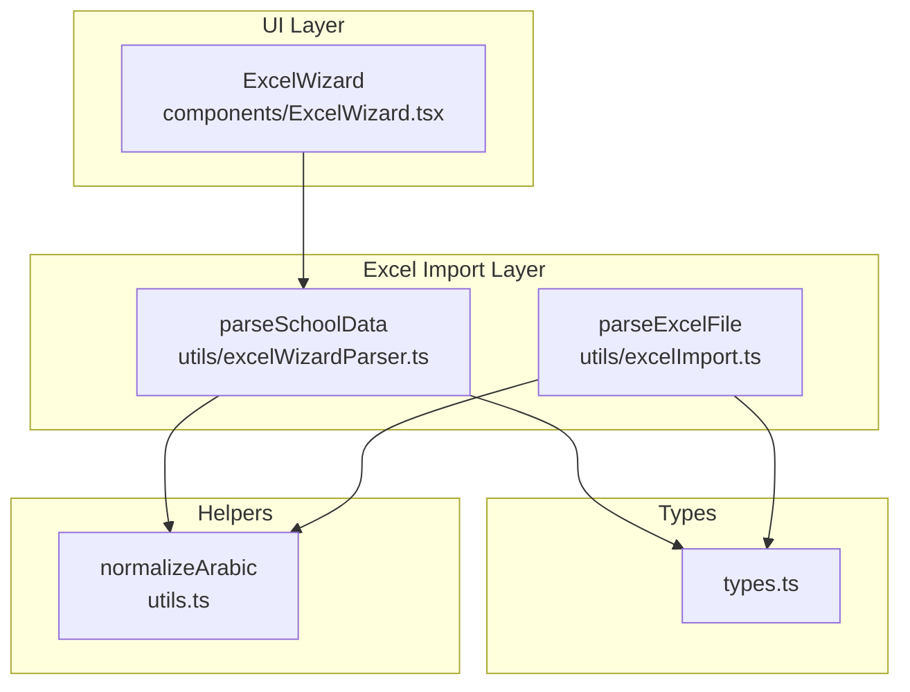
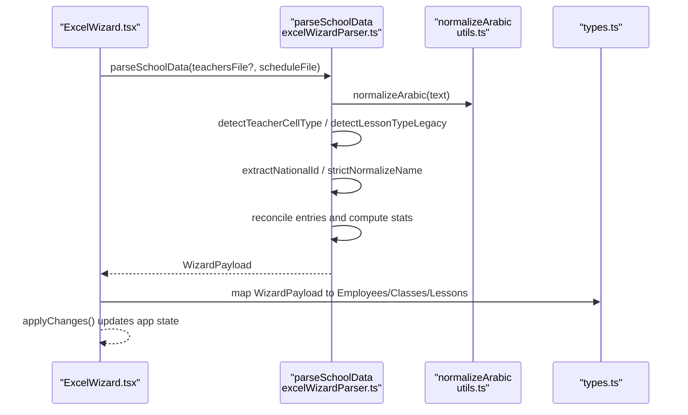
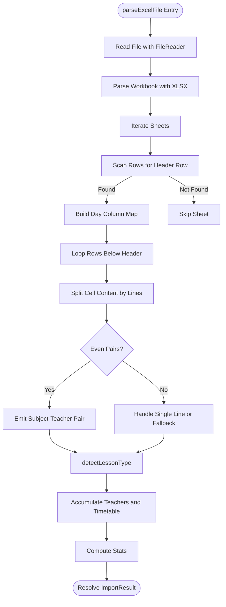
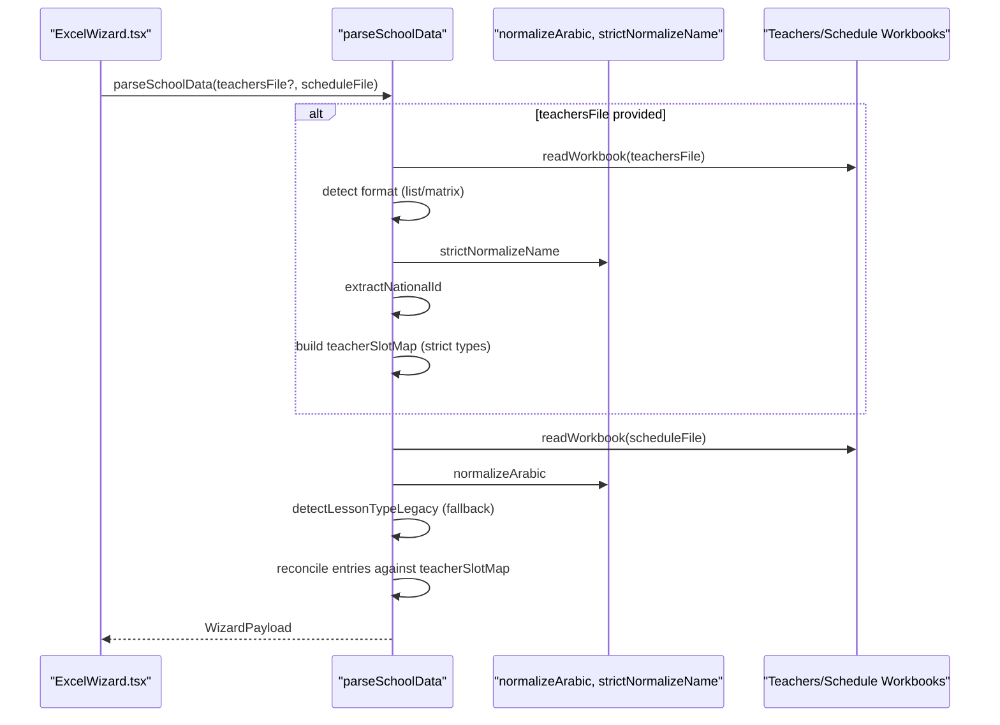
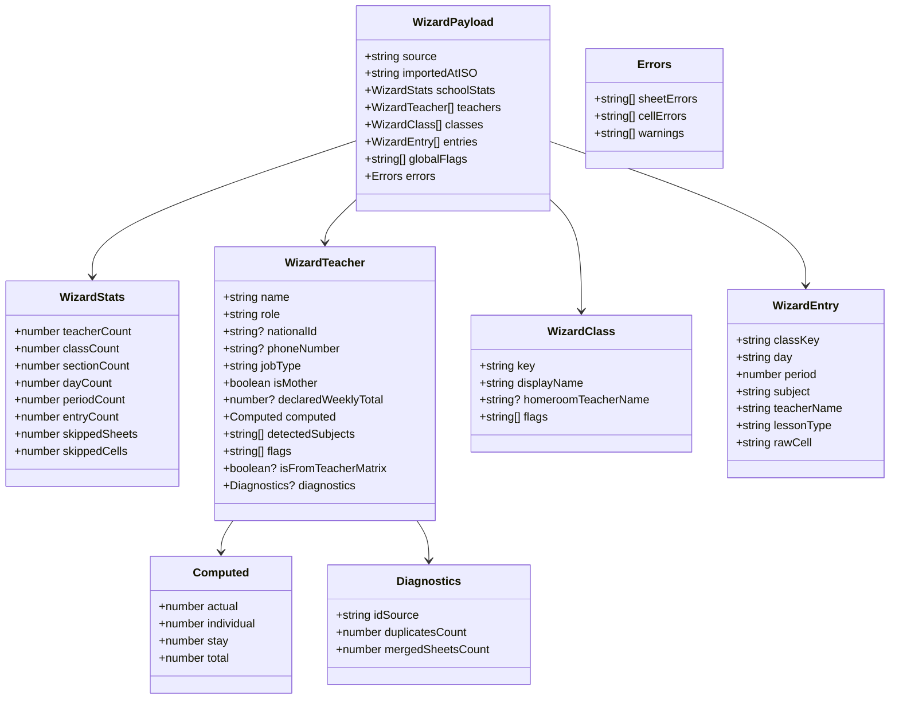
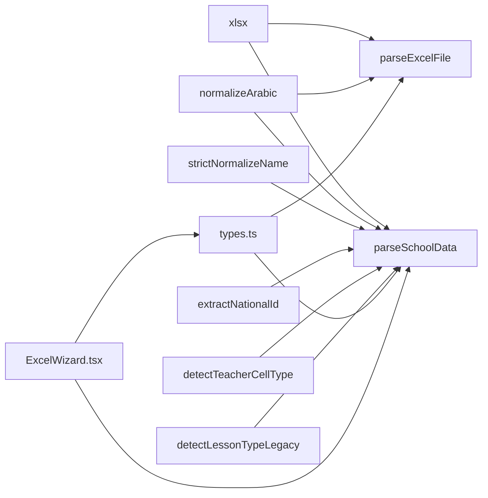

# Excel Import Utilities

<cite>
**Referenced Files in This Document**
- [excelImport.ts](file://utils/excelImport.ts)
- [excelWizardParser.ts](file://utils/excelWizardParser.ts)
- [ExcelWizard.tsx](file://components/ExcelWizard.tsx)
- [types.ts](file://types.ts)
- [utils.ts](file://utils.ts)
</cite>

## Table of Contents
1. [Introduction](#introduction)
2. [Project Structure](#project-structure)
3. [Core Components](#core-components)
4. [Architecture Overview](#architecture-overview)
5. [Detailed Component Analysis](#detailed-component-analysis)
6. [Dependency Analysis](#dependency-analysis)
7. [Performance Considerations](#performance-considerations)
8. [Troubleshooting Guide](#troubleshooting-guide)
9. [Conclusion](#conclusion)
10. [Appendices](#appendices)

## Introduction
This document focuses on the Excel import utilities that power timetable ingestion and reconciliation. It explains how Excel files are parsed, normalized, and transformed into application state. It covers:
- parseExcelFile for processing a single timetable Excel into a simplified ImportResult
- parseSchoolData for a dual-file workflow (teachersFile and scheduleFile), including robust teacher identity resolution, lesson type detection, and reconciliation
- The WizardPayload structure and its downstream integration in ExcelWizard
- Practical examples of data transformation and common pitfalls with solutions

## Project Structure
The Excel import functionality spans two utility modules and a wizard component:
- utils/excelImport.ts: Processes a single timetable Excel into a compact ImportResult
- utils/excelWizardParser.ts: Orchestrates dual-file parsing, identity resolution, and reconciliation into WizardPayload
- components/ExcelWizard.tsx: UI wizard that triggers parsing, displays statistics, and applies changes to app state
- types.ts: Defines ImportResult, WizardPayload, and related types
- utils.ts: Provides normalizeArabic and other helpers used across parsing

**Diagram sources**
- [excelImport.ts](file://utils/excelImport.ts#L1-L189)
- [excelWizardParser.ts](file://utils/excelWizardParser.ts#L1-L716)
- [ExcelWizard.tsx](file://components/ExcelWizard.tsx#L1-L486)
- [types.ts](file://types.ts#L354-L382)
- [utils.ts](file://utils.ts#L17-L27)

**Section sources**
- [excelImport.ts](file://utils/excelImport.ts#L1-L189)
- [excelWizardParser.ts](file://utils/excelWizardParser.ts#L1-L716)
- [ExcelWizard.tsx](file://components/ExcelWizard.tsx#L1-L486)
- [types.ts](file://types.ts#L354-L382)
- [utils.ts](file://utils.ts#L17-L27)

## Core Components
- parseExcelFile: Reads a single Excel timetable, detects headers, maps days, parses rows, and builds a compact ImportResult with teachers and timetable entries. It uses detectLessonType internally and Arabic text normalization.
- parseSchoolData: Dual-file parser that reads a teachers matrix (optional) and a schedule matrix (required). It resolves teacher identities robustly, classifies lessons strictly, reconciles entries, computes workload statistics, and produces WizardPayload for UI and downstream state updates.

**Section sources**
- [excelImport.ts](file://utils/excelImport.ts#L41-L189)
- [excelWizardParser.ts](file://utils/excelWizardParser.ts#L199-L716)

## Architecture Overview
The wizard integrates with the dual-file parser and transforms parsed data into application state. The parser normalizes Arabic text, resolves teacher identities, and reconciles schedule entries with authoritative teacher matrices.

**Diagram sources**
- [ExcelWizard.tsx](file://components/ExcelWizard.tsx#L39-L194)
- [excelWizardParser.ts](file://utils/excelWizardParser.ts#L199-L716)
- [utils.ts](file://utils.ts#L17-L27)
- [types.ts](file://types.ts#L354-L382)

## Detailed Component Analysis

### parseExcelFile (Single Timetable Excel)
Purpose:
- Convert a single timetable Excel into a compact ImportResult containing teachers and timetable entries.

Key behaviors:
- Uses FileReader and XLSX to read binary data and iterate sheets
- Detects header row by scanning early rows for “period” or “الحصة”
- Builds a day-to-column mapping using Arabic day normalization and a canonical map
- Parses rows to extract period, day, subject, and teacher pairs
- Uses detectLessonType to classify lessons
- Normalizes Arabic text for robust matching
- Aggregates stats and returns a structured result

Public interface:
- Function: parseExcelFile(file: File): Promise<ImportResult>
- Parameters: file (Excel file)
- Returns: ImportResult with teachers, timetable, errors, and stats

Integration points:
- Called by ExcelWizard when a single timetable file is provided
- Used to populate temporary state before reconciliation

**Diagram sources**
- [excelImport.ts](file://utils/excelImport.ts#L41-L189)

**Section sources**
- [excelImport.ts](file://utils/excelImport.ts#L41-L189)
- [types.ts](file://types.ts#L354-L382)

### detectLessonType (Single File Parsing)
Behavior:
- Normalizes subject and teacher name
- Classifies as duty, stay, individual, or actual based on keywords and patterns
- Supports Arabic and transliteration variants

Integration:
- Used by parseExcelFile to classify lessons when parsing a single timetable Excel

**Section sources**
- [excelImport.ts](file://utils/excelImport.ts#L16-L39)

### parseSchoolData (Dual-File Parsing and Reconciliation)
Purpose:
- Orchestrate parsing of teachersFile (optional) and scheduleFile (required)
- Resolve teacher identities robustly
- Strictly classify lessons and reconcile schedule entries with authoritative teacher matrices
- Produce WizardPayload for UI and downstream state updates

Key steps:
- Robust teacher identity resolution:
  - extractNationalId: extracts 5–9 digit IDs from sheet name or grid scan
  - strictNormalizeName: cleans and normalizes names for deduplication
- Strict lesson classification:
  - detectTeacherCellType: strict classification for teacher matrix
  - detectLessonTypeLegacy: fallback for schedule-only parsing
- Dual-file reconciliation:
  - Authoritative teacher-slot map keyed by normalized name|day|period
  - Pass A: reconcile entries against authoritative types
  - Pass B: inject missing teacher-only entries (stay/individual/meeting)
- Computation:
  - Compute workload counts per teacher (actual, individual, stay, total)
  - Detect homeroom teachers by keyword matching and frequency
- Output:
  - WizardPayload with teachers, classes, entries, stats, and flags

Public interface:
- Function: parseSchoolData(teachersFile: File | null, scheduleFile: File): Promise<WizardPayload>
- Parameters: teachersFile (optional), scheduleFile (required)
- Returns: WizardPayload

**Diagram sources**
- [excelWizardParser.ts](file://utils/excelWizardParser.ts#L199-L716)
- [utils.ts](file://utils.ts#L17-L27)
- [ExcelWizard.tsx](file://components/ExcelWizard.tsx#L39-L194)

**Section sources**
- [excelWizardParser.ts](file://utils/excelWizardParser.ts#L199-L716)
- [ExcelWizard.tsx](file://components/ExcelWizard.tsx#L39-L194)
- [utils.ts](file://utils.ts#L17-L27)

### WizardPayload and Downstream Integration
WizardPayload structure:
- source, importedAtISO, schoolStats, teachers, classes, entries, globalFlags, errors
- schoolStats includes teacherCount, classCount, sectionCount, dayCount, periodCount, entryCount, skippedSheets, skippedCells
- teachers include role, computed workload, detectedSubjects, flags, and diagnostics
- classes include key/displayName and homeroomTeacherName
- entries include classKey, day, period, subject, teacherName, lessonType, rawCell

Downstream integration in ExcelWizard:
- Applies changes by merging employees, classes, and lessons into app state
- Updates scheduleConfig.periodsPerDay to match imported structure
- Uses normalizeArabic for deduplication and merges detectedSubjects
- Links homeroom teachers to classes

**Diagram sources**
- [excelWizardParser.ts](file://utils/excelWizardParser.ts#L1-L120)
- [excelWizardParser.ts](file://utils/excelWizardParser.ts#L585-L716)

**Section sources**
- [excelWizardParser.ts](file://utils/excelWizardParser.ts#L1-L120)
- [excelWizardParser.ts](file://utils/excelWizardParser.ts#L585-L716)
- [ExcelWizard.tsx](file://components/ExcelWizard.tsx#L59-L194)

### Data Transformation Examples
Concrete examples from the codebase:
- From WizardPayload to Employees:
  - Normalize teacher names for deduplication
  - Merge detectedSubjects with existing subjects
  - Update workload and role flags
- From WizardPayload to Classes:
  - Detect grade level from class display name
  - Infer assistant requirement based on grade
- From WizardPayload to Lessons:
  - Map lessonType to internal enum
  - Allow NO_CLASS entries for stay/individual/duty when teacher is found

These transformations occur in ExcelWizard.applyChanges.

**Section sources**
- [ExcelWizard.tsx](file://components/ExcelWizard.tsx#L59-L194)

## Dependency Analysis
- parseExcelFile depends on:
  - XLSX for reading Excel
  - normalizeArabic for Arabic text normalization
  - detectLessonType for lesson classification
  - types.ImportResult and TimetableImportRecord
- parseSchoolData depends on:
  - XLSX for reading Excel
  - normalizeArabic for Arabic normalization
  - strictNormalizeName for deduplication
  - extractNationalId for robust ID extraction
  - detectTeacherCellType and detectLessonTypeLegacy for classification
  - WizardPayload structure and related types
- ExcelWizard integrates with both parsers and transforms WizardPayload into Employees, Classes, and Lessons

**Diagram sources**
- [excelImport.ts](file://utils/excelImport.ts#L1-L189)
- [excelWizardParser.ts](file://utils/excelWizardParser.ts#L1-L716)
- [ExcelWizard.tsx](file://components/ExcelWizard.tsx#L1-L486)
- [types.ts](file://types.ts#L354-L382)
- [utils.ts](file://utils.ts#L17-L27)

**Section sources**
- [excelImport.ts](file://utils/excelImport.ts#L1-L189)
- [excelWizardParser.ts](file://utils/excelWizardParser.ts#L1-L716)
- [ExcelWizard.tsx](file://components/ExcelWizard.tsx#L1-L486)
- [types.ts](file://types.ts#L354-L382)
- [utils.ts](file://utils.ts#L17-L27)

## Performance Considerations
- Large Excel files:
  - FileReader.readAsBinaryString loads entire file into memory; consider streaming or chunked processing for very large files
  - sheet_to_json with header: 1 converts cells to arrays; for massive spreadsheets, consider row-by-row iteration to reduce peak memory
- Memory usage:
  - Maps and Sets are used extensively (teacherMap, processedClasses, teacherSlotMap, reconciledSlots). For very large datasets, consider:
    - Lazy initialization of maps
    - Periodic cleanup of intermediate structures
    - Avoid storing rawText unless needed
- Normalization overhead:
  - normalizeArabic and strictNormalizeName are invoked frequently; cache normalized keys if repeated lookups are common
- Reconciliation pass:
  - Two-pass reconciliation increases runtime; batch updates and minimize redundant scans
- UI responsiveness:
  - ExcelWizard performs parsing asynchronously; show progress indicators and disable actions until parsing completes

[No sources needed since this section provides general guidance]

## Troubleshooting Guide
Common issues and solutions:
- Malformed Excel files:
  - Missing header row: The parser scans early rows for “period” or “الحصة”; if not found, the sheet is skipped. Ensure the first column contains “period” or “الحصة”.
  - Incorrect day headers: The parser uses a canonical day map; ensure day names are in Arabic or English variants supported by the map.
  - Unpaired subject-teacher lines: The parser expects pairs or a single subject with unknown teacher; unpaired lines are ignored.
- Encoding problems:
  - Use UTF-8 encoded Excel files. If files are saved in legacy encodings, convert them to UTF-8 before importing.
- Inconsistent naming conventions:
  - Use strictNormalizeName to normalize prefixes and diacritics; ensure sheet names and teacher names are consistent.
- ID extraction failures:
  - extractNationalId looks for 5–9 digit numeric tokens; ensure IDs are present in sheet names or near the top-left grid.
- Lesson classification mismatches:
  - detectTeacherCellType prioritizes explicit keywords; adjust subject texts to include recognized terms (e.g., “stay”, “individual”, “meeting”, “-duty”).

**Section sources**
- [excelWizardParser.ts](file://utils/excelWizardParser.ts#L108-L132)
- [excelWizardParser.ts](file://utils/excelWizardParser.ts#L134-L178)
- [excelImport.ts](file://utils/excelImport.ts#L16-L39)

## Conclusion
The Excel import utilities provide a robust pipeline for ingesting timetable data from single or dual Excel sources. They normalize Arabic text, resolve teacher identities, strictly classify lessons, reconcile schedule entries, and produce a structured payload consumed by the wizard UI. By following the troubleshooting tips and performance recommendations, teams can reliably import and integrate large-scale timetable data into the application.

[No sources needed since this section summarizes without analyzing specific files]

## Appendices

### Public Interfaces Summary
- parseExcelFile(file: File): Promise<ImportResult>
  - Parameters: file (Excel timetable)
  - Returns: ImportResult with teachers, timetable, errors, and stats
- parseSchoolData(teachersFile: File | null, scheduleFile: File): Promise<WizardPayload>
  - Parameters: teachersFile (optional), scheduleFile (required)
  - Returns: WizardPayload with teachers, classes, entries, stats, and flags

**Section sources**
- [excelImport.ts](file://utils/excelImport.ts#L41-L189)
- [excelWizardParser.ts](file://utils/excelWizardParser.ts#L199-L210)