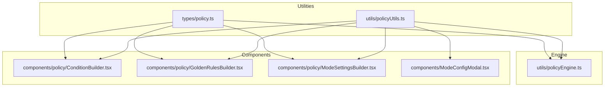
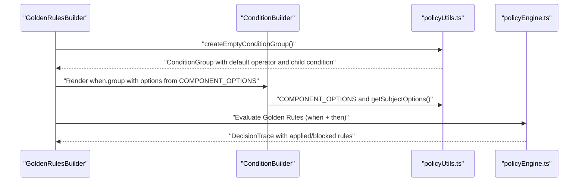
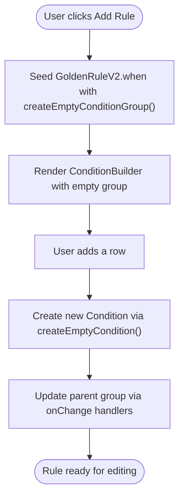
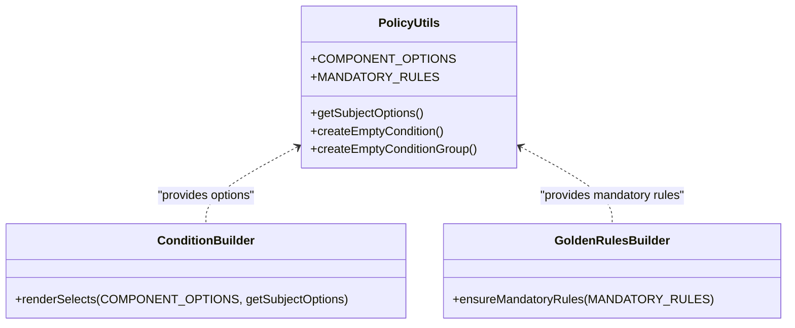
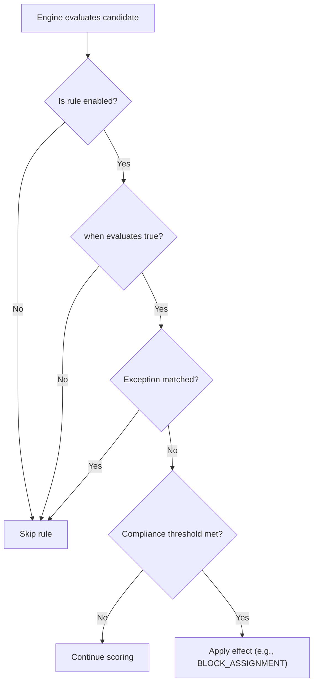
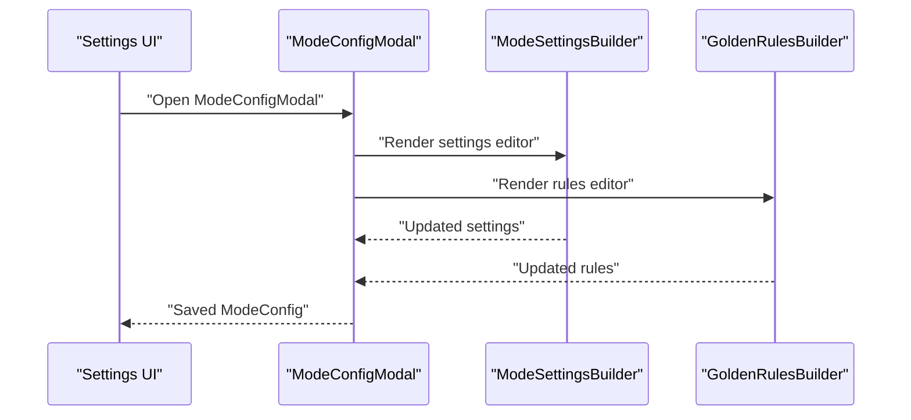
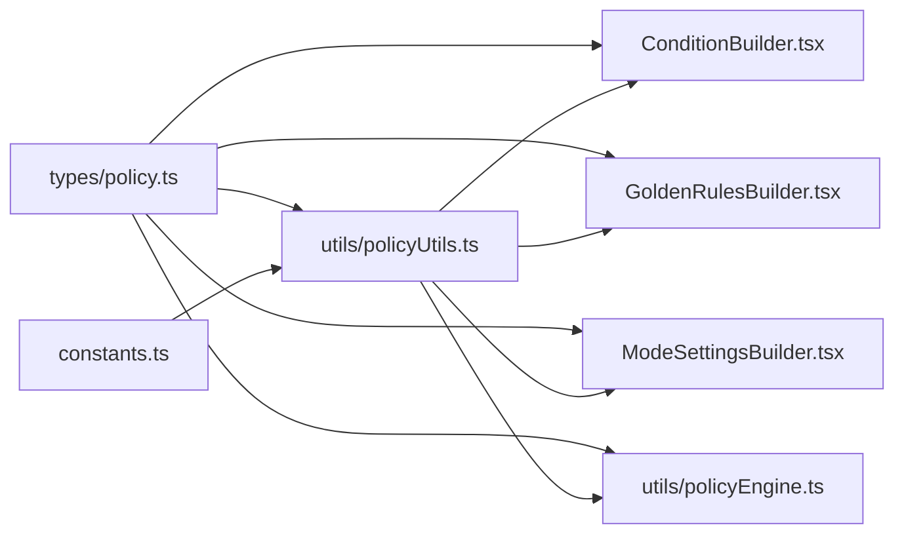

# Policy Configuration Utilities

<cite>
**Referenced Files in This Document**
- [policyUtils.ts](file://utils/policyUtils.ts)
- [policy.ts](file://types/policy.ts)
- [ConditionBuilder.tsx](file://components/policy/ConditionBuilder.tsx)
- [GoldenRulesBuilder.tsx](file://components/policy/GoldenRulesBuilder.tsx)
- [ModeSettingsBuilder.tsx](file://components/policy/ModeSettingsBuilder.tsx)
- [ModeConfigModal.tsx](file://components/ModeConfigModal.tsx)
- [constants.ts](file://constants.ts)
- [policyEngine.ts](file://utils/policyEngine.ts)
</cite>

## Table of Contents
1. [Introduction](#introduction)
2. [Project Structure](#project-structure)
3. [Core Components](#core-components)
4. [Architecture Overview](#architecture-overview)
5. [Detailed Component Analysis](#detailed-component-analysis)
6. [Dependency Analysis](#dependency-analysis)
7. [Performance Considerations](#performance-considerations)
8. [Troubleshooting Guide](#troubleshooting-guide)
9. [Conclusion](#conclusion)

## Introduction
This document explains the policy configuration utilities centered around policyUtils.ts. It focuses on:
- Helper functions that initialize default rule structures for the policy configuration UI
- How COMPONENT_OPTIONS and getSubjectOptions supply dropdown selections aligned with business logic and UI consistency
- MANDATORY_RULES that define critical compliance rules such as “Ironclad Stay Protection” and “Actual Lesson Sanctity”
- Integration with Settings UI and the ModeConfig modal to enforce business-critical constraints
- Best practices for extending the utility set safely

## Project Structure
The policy configuration utilities live in a dedicated utility module and are consumed by policy-related UI components and the engine.

**Diagram sources**
- [policyUtils.ts](file://utils/policyUtils.ts#L1-L117)
- [policy.ts](file://types/policy.ts#L1-L162)
- [ConditionBuilder.tsx](file://components/policy/ConditionBuilder.tsx#L1-L143)
- [GoldenRulesBuilder.tsx](file://components/policy/GoldenRulesBuilder.tsx#L1-L180)
- [ModeSettingsBuilder.tsx](file://components/policy/ModeSettingsBuilder.tsx#L1-L226)
- [ModeConfigModal.tsx](file://components/ModeConfigModal.tsx#L1-L350)
- [policyEngine.ts](file://utils/policyEngine.ts#L1-L406)

**Section sources**
- [policyUtils.ts](file://utils/policyUtils.ts#L1-L117)
- [policy.ts](file://types/policy.ts#L1-L162)
- [ConditionBuilder.tsx](file://components/policy/ConditionBuilder.tsx#L1-L143)
- [GoldenRulesBuilder.tsx](file://components/policy/GoldenRulesBuilder.tsx#L1-L180)
- [ModeSettingsBuilder.tsx](file://components/policy/ModeSettingsBuilder.tsx#L1-L226)
- [ModeConfigModal.tsx](file://components/ModeConfigModal.tsx#L1-L350)
- [policyEngine.ts](file://utils/policyEngine.ts#L1-L406)

## Core Components
- createEmptyCondition: Produces a new Condition with default values suitable for immediate editing in ConditionBuilder.
- createEmptyConditionGroup: Produces a new ConditionGroup initialized with a default operator and a single child condition, enabling rapid rule composition.
- COMPONENT_OPTIONS: Provides consistent dropdown options for teacherType, lessonType, timeContext, and relationship fields.
- getSubjectOptions: Supplies subject dropdown options derived from SUBJECT_PRIORITY_FOR_INDIVIDUAL plus a wildcard option, ensuring alignment with curriculum priorities.
- MANDATORY_RULES: Pre-configures critical compliance rules with strict enforcement, audit requirements, and no override permissions.

These utilities ensure consistent, safe, and business-aligned rule creation and editing across the UI.

**Section sources**
- [policyUtils.ts](file://utils/policyUtils.ts#L1-L117)
- [constants.ts](file://constants.ts#L1-L438)

## Architecture Overview
The policy configuration flow connects UI builders to the policy engine through shared types and utilities.

**Diagram sources**
- [GoldenRulesBuilder.tsx](file://components/policy/GoldenRulesBuilder.tsx#L1-L180)
- [ConditionBuilder.tsx](file://components/policy/ConditionBuilder.tsx#L1-L143)
- [policyUtils.ts](file://utils/policyUtils.ts#L1-L117)
- [policyEngine.ts](file://utils/policyEngine.ts#L255-L406)

## Detailed Component Analysis

### Utility Functions: createEmptyCondition and createEmptyConditionGroup
- Purpose:
  - createEmptyCondition initializes a new Condition with neutral/default values for all fields, ensuring a clean starting point for rule authoring.
  - createEmptyConditionGroup initializes a new ConditionGroup with a default operator and a single child condition, enabling nested rule composition from the outset.
- Usage:
  - GoldenRulesBuilder uses createEmptyConditionGroup to seed the WHEN clause of newly created GoldenRuleV2 entries.
  - ConditionBuilder uses createEmptyCondition to add new rows to a ConditionGroup.
- Benefits:
  - Guarantees consistent IDs and operators.
  - Reduces boilerplate and prevents accidental invalid states during interactive rule building.

**Diagram sources**
- [GoldenRulesBuilder.tsx](file://components/policy/GoldenRulesBuilder.tsx#L25-L45)
- [ConditionBuilder.tsx](file://components/policy/ConditionBuilder.tsx#L13-L41)
- [policyUtils.ts](file://utils/policyUtils.ts#L43-L56)

**Section sources**
- [policyUtils.ts](file://utils/policyUtils.ts#L43-L56)
- [GoldenRulesBuilder.tsx](file://components/policy/GoldenRulesBuilder.tsx#L25-L45)
- [ConditionBuilder.tsx](file://components/policy/ConditionBuilder.tsx#L13-L41)

### Dropdown Options: COMPONENT_OPTIONS and getSubjectOptions
- COMPONENT_OPTIONS:
  - Supplies standardized options for teacherType, lessonType, timeContext, and relationship fields.
  - Ensures UI consistency and predictable behavior across rule editors.
- getSubjectOptions:
  - Combines a wildcard option with SUBJECT_PRIORITY_FOR_INDIVIDUAL to present a curated subject list.
  - Aligns with curriculum priorities and simplifies rule authoring for subject-specific constraints.

**Diagram sources**
- [policyUtils.ts](file://utils/policyUtils.ts#L1-L117)
- [ConditionBuilder.tsx](file://components/policy/ConditionBuilder.tsx#L70-L129)
- [GoldenRulesBuilder.tsx](file://components/policy/GoldenRulesBuilder.tsx#L16-L23)

**Section sources**
- [policyUtils.ts](file://utils/policyUtils.ts#L1-L41)
- [constants.ts](file://constants.ts#L11-L13)
- [ConditionBuilder.tsx](file://components/policy/ConditionBuilder.tsx#L70-L129)
- [GoldenRulesBuilder.tsx](file://components/policy/GoldenRulesBuilder.tsx#L16-L23)

### MANDATORY_RULES: Critical Compliance Rules
- Ironclad Stay Protection:
  - Prevents using stay slots for coverage.
  - Enforced at 100% compliance, audit required, override disallowed.
  - Applied when lessonType equals stay.
- Actual Lesson Sanctity:
  - Prevents pulling a teacher away from an actual lesson to cover another slot.
  - Enforced at 100% compliance, audit required, override disallowed.
  - Applied when lessonType equals actual.
- Integration:
  - GoldenRulesBuilder ensures these rules are always present and cannot be deleted.
  - Engine evaluation enforces these rules strictly during decision-making.

**Diagram sources**
- [policyEngine.ts](file://utils/policyEngine.ts#L347-L367)
- [policyUtils.ts](file://utils/policyUtils.ts#L59-L117)

**Section sources**
- [policyUtils.ts](file://utils/policyUtils.ts#L59-L117)
- [GoldenRulesBuilder.tsx](file://components/policy/GoldenRulesBuilder.tsx#L16-L23)
- [policyEngine.ts](file://utils/policyEngine.ts#L347-L367)

### Integration with Settings UI and ModeConfig Modal
- ModeConfigModal:
  - Hosts the policy configuration tabs: Settings, Rules, Priority, Scope, Impact.
  - Uses ModeSettingsBuilder for pre-filter settings and GoldenRulesBuilder for rule customization.
- Settings:
  - Provides global policy context and links to ModeConfigModal for detailed configuration.
- Data Flow:
  - Users edit settings and rules in the modal.
  - Changes propagate to ModeConfig and are validated before saving.

**Diagram sources**
- [ModeConfigModal.tsx](file://components/ModeConfigModal.tsx#L238-L313)
- [ModeSettingsBuilder.tsx](file://components/policy/ModeSettingsBuilder.tsx#L1-L226)
- [GoldenRulesBuilder.tsx](file://components/policy/GoldenRulesBuilder.tsx#L1-L180)
- [Settings.tsx](file://components/Settings.tsx#L895-L923)

**Section sources**
- [ModeConfigModal.tsx](file://components/ModeConfigModal.tsx#L238-L313)
- [ModeSettingsBuilder.tsx](file://components/policy/ModeSettingsBuilder.tsx#L1-L226)
- [GoldenRulesBuilder.tsx](file://components/policy/GoldenRulesBuilder.tsx#L1-L180)
- [Settings.tsx](file://components/Settings.tsx#L895-L923)

## Dependency Analysis
- policyUtils.ts depends on:
  - types/policy.ts for type definitions (Condition, ConditionGroup, GoldenRuleV2, etc.)
  - constants.ts for SUBJECT_PRIORITY_FOR_INDIVIDUAL
- Components depend on policyUtils.ts for:
  - Dropdown options and rule initialization helpers
- Engine depends on:
  - policyUtils.ts for rule structures and evaluation logic

**Diagram sources**
- [policy.ts](file://types/policy.ts#L1-L162)
- [policyUtils.ts](file://utils/policyUtils.ts#L1-L117)
- [constants.ts](file://constants.ts#L1-L438)
- [policyEngine.ts](file://utils/policyEngine.ts#L1-L406)
- [ConditionBuilder.tsx](file://components/policy/ConditionBuilder.tsx#L1-L143)
- [GoldenRulesBuilder.tsx](file://components/policy/GoldenRulesBuilder.tsx#L1-L180)
- [ModeSettingsBuilder.tsx](file://components/policy/ModeSettingsBuilder.tsx#L1-L226)

**Section sources**
- [policy.ts](file://types/policy.ts#L1-L162)
- [policyUtils.ts](file://utils/policyUtils.ts#L1-L117)
- [constants.ts](file://constants.ts#L1-L438)
- [policyEngine.ts](file://utils/policyEngine.ts#L1-L406)
- [ConditionBuilder.tsx](file://components/policy/ConditionBuilder.tsx#L1-L143)
- [GoldenRulesBuilder.tsx](file://components/policy/GoldenRulesBuilder.tsx#L1-L180)
- [ModeSettingsBuilder.tsx](file://components/policy/ModeSettingsBuilder.tsx#L1-L226)

## Performance Considerations
- Rule evaluation complexity scales with the number of active GoldenRuleV2 entries and their when groups. Keep MANDATORY_RULES minimal and targeted to reduce overhead.
- Using pre-filter settings (ModeSettings) reduces the search space for candidates, improving overall throughput before applying rule checks.
- Prefer grouping conditions with AND/OR to minimize redundant evaluations.

[No sources needed since this section provides general guidance]

## Troubleshooting Guide
Common pitfalls and resolutions:
- Deleting mandatory rules:
  - Symptom: Attempting to remove a mandatory rule fails silently.
  - Cause: GoldenRulesBuilder prevents deletion of mandatory rule IDs.
  - Resolution: Reconfigure the rule’s properties instead of deleting it.
- Inconsistent subject options:
  - Symptom: Subject dropdown appears empty or missing expected values.
  - Cause: SUBJECT_PRIORITY_FOR_INDIVIDUAL not populated or misconfigured.
  - Resolution: Verify constants.ts and ensure getSubjectOptions is used consistently.
- Rule not enforced:
  - Symptom: A rule seems ignored despite high compliance percentage.
  - Cause: Exception matched or when condition did not evaluate to true.
  - Resolution: Inspect the rule’s when group and exceptions; adjust conditions accordingly.
- UI dropdown mismatch:
  - Symptom: Select options do not align with business logic.
  - Cause: Using ad-hoc options instead of COMPONENT_OPTIONS and getSubjectOptions.
  - Resolution: Replace custom options with the provided utility functions.

Best practices for extension:
- Extend MANDATORY_RULES carefully:
  - Define strict enforcement (compliancePercentage 100), auditRequired true, overrideAllowed false.
  - Keep scope minimal and precise to avoid unintended impact.
- Add new subject options:
  - Append to SUBJECT_PRIORITY_FOR_INDIVIDUAL in constants.ts.
  - Ensure getSubjectOptions reflects the change automatically.
- Add new dropdown categories:
  - Introduce new keys in COMPONENT_OPTIONS with consistent value/label pairs.
  - Update ConditionBuilder and related components to render the new select.
- Maintain backward compatibility:
  - Preserve existing option values and labels to avoid breaking saved configurations.
  - Provide migration paths for deprecated keys.

**Section sources**
- [GoldenRulesBuilder.tsx](file://components/policy/GoldenRulesBuilder.tsx#L52-L56)
- [constants.ts](file://constants.ts#L11-L13)
- [policyEngine.ts](file://utils/policyEngine.ts#L347-L367)
- [policyUtils.ts](file://utils/policyUtils.ts#L1-L41)

## Conclusion
The policy configuration utilities in policyUtils.ts provide a robust foundation for building and enforcing policy rules. By standardizing dropdown options, initializing rule structures, and embedding critical compliance rules, they ensure consistent, auditable, and business-aligned behavior across the UI and engine. Following the best practices outlined here will help extend the utility set safely while preserving system integrity.