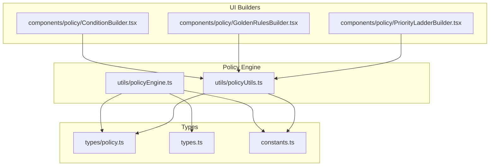
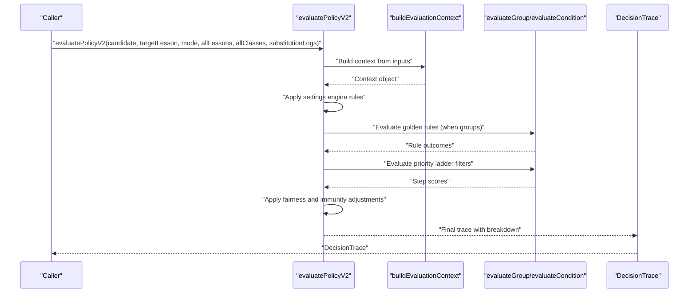
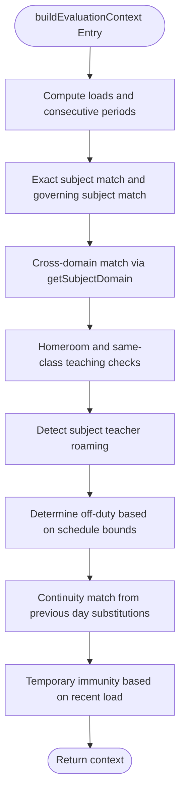
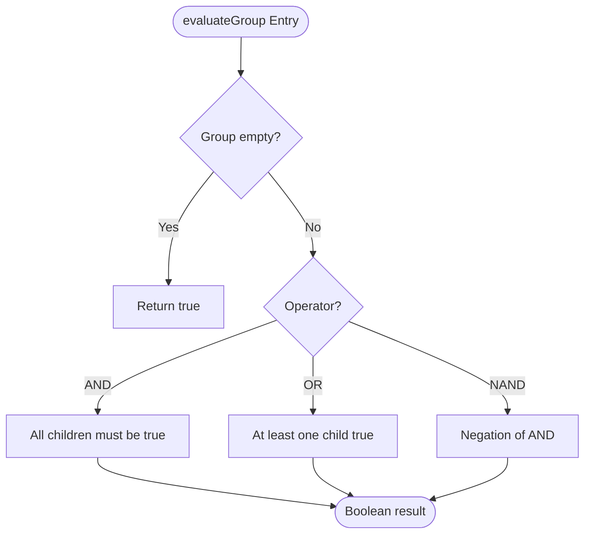
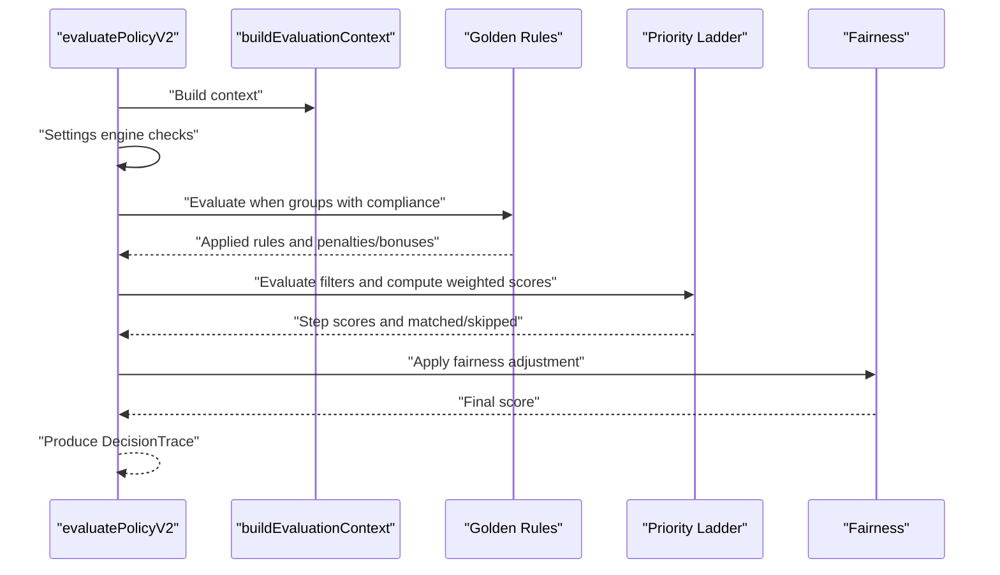
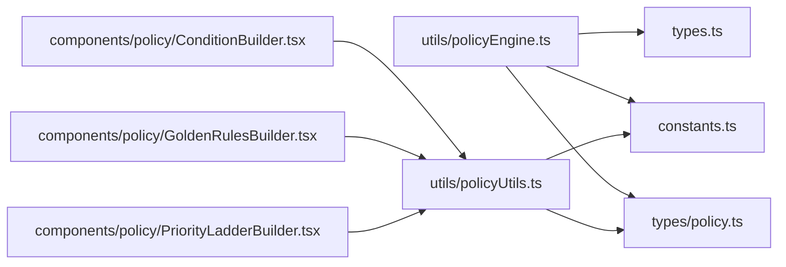

# Policy Engine Utilities

<cite>
**Referenced Files in This Document**
- [policyEngine.ts](file://utils/policyEngine.ts)
- [policyUtils.ts](file://utils/policyUtils.ts)
- [policy.ts](file://types/policy.ts)
- [types.ts](file://types.ts)
- [constants.ts](file://constants.ts)
- [ConditionBuilder.tsx](file://components/policy/ConditionBuilder.tsx)
- [GoldenRulesBuilder.tsx](file://components/policy/GoldenRulesBuilder.tsx)
- [PriorityLadderBuilder.tsx](file://components/policy/PriorityLadderBuilder.tsx)
</cite>

## Table of Contents
1. [Introduction](#introduction)
2. [Project Structure](#project-structure)
3. [Core Components](#core-components)
4. [Architecture Overview](#architecture-overview)
5. [Detailed Component Analysis](#detailed-component-analysis)
6. [Dependency Analysis](#dependency-analysis)
7. [Performance Considerations](#performance-considerations)
8. [Troubleshooting Guide](#troubleshooting-guide)
9. [Conclusion](#conclusion)
10. [Appendices](#appendices)

## Introduction
This document focuses on the policy engine utilities that power decision-making for daily substitution assignments. It explains how the evaluation context is constructed, how conditions and rule groups are evaluated, and how comprehensive scoring and decision tracing are performed. It also documents the public interfaces of key functions, their parameters and return values, and how they integrate with ModeConfig, Lesson, and Employee types. Practical examples illustrate how golden rules and priority steps are evaluated during substitution decisions, and it provides guidance on resolving conflicts and handling edge cases in subject domain matching. Utility functions in policyUtils.ts are described, including creation helpers and mandatory rule definitions, and performance considerations for nested condition group evaluation are addressed.

## Project Structure
The policy engine utilities reside under the utils directory and are complemented by type definitions and UI builders that construct and edit policy configurations. The key files are:
- Policy engine core: utils/policyEngine.ts
- Policy utilities: utils/policyUtils.ts
- Types for policy structures: types/policy.ts
- Shared domain types (Employee, Lesson, ModeConfig): types.ts
- Subject domain constants: constants.ts
- UI builders for policy configuration: components/policy/*.tsx

**Diagram sources**
- [policyEngine.ts](file://utils/policyEngine.ts#L1-L406)
- [policyUtils.ts](file://utils/policyUtils.ts#L1-L117)
- [policy.ts](file://types/policy.ts#L1-L162)
- [types.ts](file://types.ts#L1-L382)
- [constants.ts](file://constants.ts#L1-L438)
- [ConditionBuilder.tsx](file://components/policy/ConditionBuilder.tsx#L1-L143)
- [GoldenRulesBuilder.tsx](file://components/policy/GoldenRulesBuilder.tsx#L1-L180)
- [PriorityLadderBuilder.tsx](file://components/policy/PriorityLadderBuilder.tsx#L1-L147)

**Section sources**
- [policyEngine.ts](file://utils/policyEngine.ts#L1-L406)
- [policyUtils.ts](file://utils/policyUtils.ts#L1-L117)
- [policy.ts](file://types/policy.ts#L1-L162)
- [types.ts](file://types.ts#L1-L382)
- [constants.ts](file://constants.ts#L1-L438)
- [ConditionBuilder.tsx](file://components/policy/ConditionBuilder.tsx#L1-L143)
- [GoldenRulesBuilder.tsx](file://components/policy/GoldenRulesBuilder.tsx#L1-L180)
- [PriorityLadderBuilder.tsx](file://components/policy/PriorityLadderBuilder.tsx#L1-L147)

## Core Components
This section documents the primary functions and their roles in the policy engine.

- buildEvaluationContext
  - Purpose: Construct a decision-making context from candidate, target lesson, schedule, and mode settings.
  - Parameters:
    - candidate: Employee
    - targetLesson: Lesson
    - day: string
    - period: number
    - allLessons: Lesson[]
    - allClasses: ClassItem[]
    - substitutionLogs: SubstitutionLog[]
    - mode?: ModeConfig
  - Returns: Evaluation context object containing teacher, slot, rel, and context fields.
  - Behavior highlights:
    - Computes teacher workload, daily and weekly coverage counts, and consecutive periods.
    - Determines subject match (exact and governing subject), cross-domain match, homeroom status, and whether the teacher is currently teaching in the same class.
    - Detects roaming subject teachers and continuity match from previous day substitutions.
    - Calculates off-duty status based on presence within the teacher’s scheduled periods.
    - Applies temporary immunity based on recent substitution activity.
  - Integration: Uses ModeConfig to extract governing subject and settings for subject prioritization and roaming support.

- evaluateCondition
  - Purpose: Evaluate a single condition against the built context.
  - Parameters:
    - condition: Condition
    - context: any (from buildEvaluationContext)
  - Returns: boolean
  - Behavior highlights:
    - Checks teacher type, lesson type (including shared), subject containment, time context (e.g., same-day stay, during-school, immune period), and relationship categories (same class, same grade, same subject, same domain, continuity match, homeroom, is homeroom).

- evaluateGroup
  - Purpose: Recursively evaluate a nested condition group with AND/OR/NAND semantics.
  - Parameters:
    - group: ConditionGroup
    - context: any
  - Returns: boolean
  - Behavior highlights:
    - Handles empty groups returning true.
    - For AND: all child conditions/groups must be true.
    - For OR: at least one child must be true.
    - For NAND: negation of AND result.

- evaluatePolicyV2
  - Purpose: Comprehensive policy scoring and decision tracing for a candidate substitution.
  - Parameters:
    - candidate: Employee
    - targetLesson: Lesson
    - mode: ModeConfig
    - allLessons: Lesson[]
    - allClasses: ClassItem[]
    - substitutionLogs?: SubstitutionLog[]
  - Returns: DecisionTrace
  - Behavior highlights:
    - Builds evaluation context.
    - Applies settings engine rules (e.g., off-duty, immunity, external restrictions, stay/individual restrictions, daily coverage limits).
    - Enforces golden rules with compliance percentage and exceptions; supports blocking assignments and score adjustments.
    - Evaluates priority ladder steps, applying base scores, modifiers, and weights; supports early stopping on match.
    - Applies fairness adjustments based on sensitivity settings.
    - Produces a detailed trace with breakdown messages, matched and skipped steps, and metrics snapshot.

Public interfaces and types:
- Condition, ConditionGroup, Effect, ExceptionRule, GoldenRuleV2, PriorityStepV2, ScoreModifier, ModeSettings, DecisionTrace are defined in types/policy.ts.
- Employee, Lesson, ClassItem, SubstitutionLog, and ModeConfig are defined in types.ts.
- Subject domain mapping and helper constants are defined in constants.ts.

**Section sources**
- [policyEngine.ts](file://utils/policyEngine.ts#L74-L202)
- [policyEngine.ts](file://utils/policyEngine.ts#L205-L252)
- [policyEngine.ts](file://utils/policyEngine.ts#L255-L405)
- [policy.ts](file://types/policy.ts#L1-L162)
- [types.ts](file://types.ts#L1-L382)
- [constants.ts](file://constants.ts#L1-L438)

## Architecture Overview
The policy engine orchestrates decision-making through a layered process:
- Context building transforms raw data into a structured evaluation context.
- Settings engine enforces hard constraints derived from ModeConfig settings.
- Golden rules apply dynamic, configurable policies with compliance and exceptions.
- Priority ladder assigns weighted scores based on matching filters and modifiers.
- Fairness and immunity adjust the final score.
- DecisionTrace captures allowed status, score, matched items, and explanatory breakdown.

**Diagram sources**
- [policyEngine.ts](file://utils/policyEngine.ts#L255-L405)
- [policyEngine.ts](file://utils/policyEngine.ts#L74-L202)

## Detailed Component Analysis

### buildEvaluationContext
- Responsibilities:
  - Compute teacher workload and fairness deviation.
  - Determine subject match (exact and governing subject) and cross-domain compatibility.
  - Identify homeroom and continuity match.
  - Detect roaming subject teachers and off-duty status.
  - Apply temporary immunity based on recent substitutions.
- Key interactions:
  - Uses ModeConfig to detect governing subject and subject settings.
  - Uses SUBJECT_DOMAINS mapping and getSubjectDomain helper to normalize and match domains.
  - Aggregates data from allLessons, substitutionLogs, and candidate constraints/addons.

**Diagram sources**
- [policyEngine.ts](file://utils/policyEngine.ts#L74-L202)
- [constants.ts](file://constants.ts#L1-L438)

**Section sources**
- [policyEngine.ts](file://utils/policyEngine.ts#L74-L202)
- [constants.ts](file://constants.ts#L1-L438)

### evaluateCondition and evaluateGroup
- evaluateCondition:
  - Validates teacher type, lesson type (including shared), subject containment, time context, and relationship categories.
- evaluateGroup:
  - Recursively evaluates nested groups with logical operators.
  - Handles empty groups, AND/OR/NAND semantics.

**Diagram sources**
- [policyEngine.ts](file://utils/policyEngine.ts#L243-L252)

**Section sources**
- [policyEngine.ts](file://utils/policyEngine.ts#L205-L252)

### evaluatePolicyV2
- Responsibilities:
  - Build context.
  - Apply settings engine rules (off-duty, immunity, external restrictions, stay/individual restrictions, daily coverage).
  - Apply golden rules with compliance percentage and exceptions; supports BLOCK_ASSIGNMENT and score adjustments.
  - Evaluate priority ladder steps with base scores, modifiers, and weights; supports stop-on-match.
  - Adjust score based on fairness sensitivity.
  - Produce DecisionTrace with breakdown, matched/skipped steps, and metrics snapshot.
- Example scenarios:
  - Golden rules: Enforcement of “Stay protection” and “Actual lesson sanctity” blocks assignments when conditions match.
  - Priority ladder: Continuity bonus and domain match bonus; priority steps with multipliers and stop-on-match.

**Diagram sources**
- [policyEngine.ts](file://utils/policyEngine.ts#L255-L405)

**Section sources**
- [policyEngine.ts](file://utils/policyEngine.ts#L255-L405)

### Utility Functions in policyUtils.ts
- createEmptyCondition:
  - Returns a minimal Condition with default values suitable for UI initialization.
- createEmptyConditionGroup:
  - Returns a minimal ConditionGroup with default operator and a single empty condition.
- MANDATORY_RULES:
  - Defines critical golden rules enforced globally, including “Ironclad Stay Protection” and “Actual Lesson Sanctity,” with strict compliance and blocking effects.

These utilities support the policy configuration UI builders by providing initial structures and enforcing system-critical rules.

**Section sources**
- [policyUtils.ts](file://utils/policyUtils.ts#L43-L117)
- [GoldenRulesBuilder.tsx](file://components/policy/GoldenRulesBuilder.tsx#L1-L180)

### UI Builders and Their Integration
- ConditionBuilder.tsx:
  - Renders a hierarchical builder for ConditionGroup with AND/OR operators and five selectable attributes (teacher type, lesson type, subject, time context, relationship).
  - Uses createEmptyCondition and createEmptyConditionGroup to add new rows or nested groups.
- GoldenRulesBuilder.tsx:
  - Manages GoldenRuleV2 lists, ensures mandatory rules are present, and edits rule properties, WHEN conditions, and THEN actions.
  - Integrates with policyUtils for initial rule structures.
- PriorityLadderBuilder.tsx:
  - Manages PriorityStepV2 lists, orders, weights, filters, and scoring modifiers.
  - Uses createEmptyConditionGroup to initialize filters.

**Section sources**
- [ConditionBuilder.tsx](file://components/policy/ConditionBuilder.tsx#L1-L143)
- [GoldenRulesBuilder.tsx](file://components/policy/GoldenRulesBuilder.tsx#L1-L180)
- [PriorityLadderBuilder.tsx](file://components/policy/PriorityLadderBuilder.tsx#L1-L147)
- [policyUtils.ts](file://utils/policyUtils.ts#L43-L117)

## Dependency Analysis
- Internal dependencies:
  - policyEngine.ts depends on types/policy.ts for policy structures, types.ts for domain types, and constants.ts for subject domain mapping.
  - policyUtils.ts depends on types/policy.ts and constants.ts for option sets and mandatory rules.
- UI dependencies:
  - ConditionBuilder.tsx, GoldenRulesBuilder.tsx, and PriorityLadderBuilder.tsx depend on policyUtils.ts for creation helpers and on types/policy.ts for type definitions.

**Diagram sources**
- [policyEngine.ts](file://utils/policyEngine.ts#L1-L406)
- [policyUtils.ts](file://utils/policyUtils.ts#L1-L117)
- [policy.ts](file://types/policy.ts#L1-L162)
- [types.ts](file://types.ts#L1-L382)
- [constants.ts](file://constants.ts#L1-L438)
- [ConditionBuilder.tsx](file://components/policy/ConditionBuilder.tsx#L1-L143)
- [GoldenRulesBuilder.tsx](file://components/policy/GoldenRulesBuilder.tsx#L1-L180)
- [PriorityLadderBuilder.tsx](file://components/policy/PriorityLadderBuilder.tsx#L1-L147)

**Section sources**
- [policyEngine.ts](file://utils/policyEngine.ts#L1-L406)
- [policyUtils.ts](file://utils/policyUtils.ts#L1-L117)
- [policy.ts](file://types/policy.ts#L1-L162)
- [types.ts](file://types.ts#L1-L382)
- [constants.ts](file://constants.ts#L1-L438)
- [ConditionBuilder.tsx](file://components/policy/ConditionBuilder.tsx#L1-L143)
- [GoldenRulesBuilder.tsx](file://components/policy/GoldenRulesBuilder.tsx#L1-L180)
- [PriorityLadderBuilder.tsx](file://components/policy/PriorityLadderBuilder.tsx#L1-L147)

## Performance Considerations
- Nested condition group evaluation:
  - evaluateGroup performs recursive descent over ConditionGroup trees. Complexity is O(N) where N is the total number of leaf conditions plus nested groups.
  - To optimize:
    - Keep condition trees shallow and prune unnecessary branches.
    - Use exceptions judiciously to avoid repeated evaluations.
    - Cache context fields when reused across multiple evaluations.
- Scoring and priority ladder:
  - Iterating through enabled golden rules and priority steps scales linearly with their counts.
  - Prefer enabling only necessary rules and steps in active modes.
- Fairness and immunity adjustments:
  - These are constant-time operations but can reduce score multiplicatively; keep fairness thresholds reasonable to minimize repeated recomputation.
- Subject domain matching:
  - getSubjectDomain runs in O(D) where D is the number of subjects in SUBJECT_DOMAINS. Since D is small, this is negligible.
- Consecutive periods and load calculations:
  - Sorting and scanning lesson/substitution logs is O(L log L) where L is the number of lessons/substitutions for the teacher on the given day. This is acceptable for typical daily schedules.

[No sources needed since this section provides general guidance]

## Troubleshooting Guide
Common issues and best practices:

- Rule conflict resolution:
  - Golden rules with BLOCK_ASSIGNMENT take precedence over score bonuses. If a rule is enforced and not excepted, the assignment is rejected immediately.
  - Use exceptions to selectively override rules when justified. Ensure exceptions are specific and documented.
  - If multiple golden rules apply, enforce compliance percentages independently; the first blocking rule encountered will halt evaluation.

- Edge cases in subject domain matching:
  - Exact subject match uses substring containment; ensure subject names are normalized consistently.
  - Cross-domain matching relies on getSubjectDomain. Verify that SUBJECT_DOMAINS includes all relevant aliases and languages.
  - Governing subject detection considers both legacy and new settings. Ensure mode settings are configured correctly to avoid ambiguity.

- Off-duty and immunity:
  - Off-duty is determined by the teacher’s schedule bounds. Confirm that allLessons reflects the teacher’s actual schedule for the day.
  - Immunity threshold is based on recent substitutions within a fixed window. Adjust mode settings if coverage patterns change.

- Priority ladder ordering:
  - Steps are sorted by order before evaluation. Use stopOnMatch for higher-priority steps to prevent lower-priority scoring.
  - WeightPercentage and modifiers should be tuned to reflect real-world priorities and fairness.

- UI configuration pitfalls:
  - Ensure mandatory golden rules are not deleted; the UI enforces their presence.
  - When adding nested groups, prefer AND for strict conjunction and OR for alternative conditions.

**Section sources**
- [policyEngine.ts](file://utils/policyEngine.ts#L255-L405)
- [policyUtils.ts](file://utils/policyUtils.ts#L43-L117)
- [GoldenRulesBuilder.tsx](file://components/policy/GoldenRulesBuilder.tsx#L1-L180)

## Conclusion
The policy engine utilities provide a robust framework for substitution decisions, combining contextual awareness, configurable golden rules, and a weighted priority ladder. The design emphasizes explainability through DecisionTrace, supports system-critical rules via MANDATORY_RULES, and offers flexible configuration through UI builders. By following best practices for rule composition, subject domain normalization, and fairness tuning, administrators can achieve predictable and auditable substitution outcomes.

[No sources needed since this section summarizes without analyzing specific files]

## Appendices

### Public Interfaces Summary
- buildEvaluationContext
  - Inputs: candidate, targetLesson, day, period, allLessons, allClasses, substitutionLogs, mode?
  - Output: Evaluation context object
- evaluateCondition
  - Inputs: condition, context
  - Output: boolean
- evaluateGroup
  - Inputs: group, context
  - Output: boolean
- evaluatePolicyV2
  - Inputs: candidate, targetLesson, mode, allLessons, allClasses, substitutionLogs?
  - Output: DecisionTrace

**Section sources**
- [policyEngine.ts](file://utils/policyEngine.ts#L74-L202)
- [policyEngine.ts](file://utils/policyEngine.ts#L205-L252)
- [policyEngine.ts](file://utils/policyEngine.ts#L255-L405)