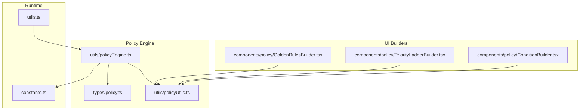
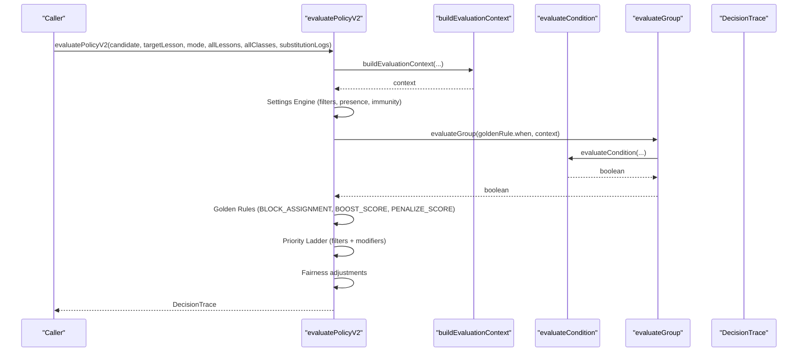
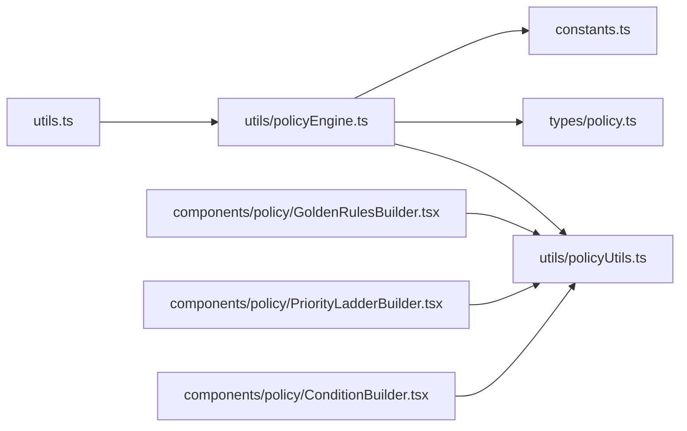
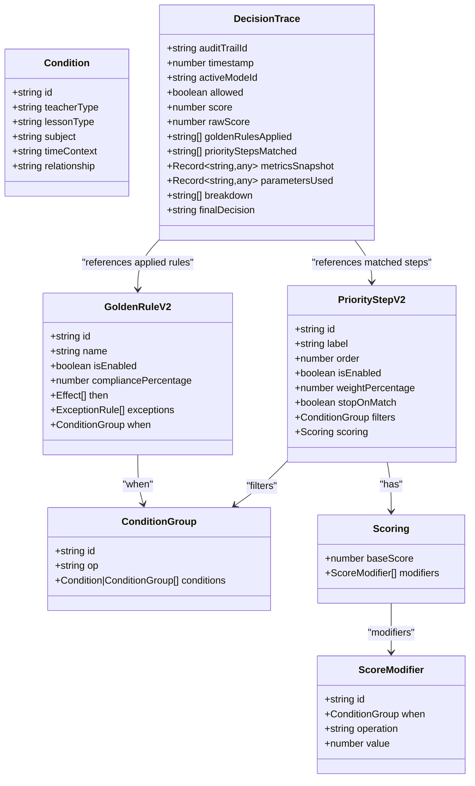

# Policy Evaluation Logic

<cite>
**Referenced Files in This Document**
- [policyEngine.ts](file://utils/policyEngine.ts)
- [policy.ts](file://types/policy.ts)
- [policyUtils.ts](file://utils/policyUtils.ts)
- [constants.ts](file://constants.ts)
- [utils.ts](file://utils.ts)
- [ConditionBuilder.tsx](file://components/policy/ConditionBuilder.tsx)
- [GoldenRulesBuilder.tsx](file://components/policy/GoldenRulesBuilder.tsx)
- [PriorityLadderBuilder.tsx](file://components/policy/PriorityLadderBuilder.tsx)
</cite>

## Table of Contents
1. [Introduction](#introduction)
2. [Project Structure](#project-structure)
3. [Core Components](#core-components)
4. [Architecture Overview](#architecture-overview)
5. [Detailed Component Analysis](#detailed-component-analysis)
6. [Dependency Analysis](#dependency-analysis)
7. [Performance Considerations](#performance-considerations)
8. [Troubleshooting Guide](#troubleshooting-guide)
9. [Conclusion](#conclusion)
10. [Appendices](#appendices)

## Introduction
This document explains the policy evaluation logic implemented in the policy engine, focusing on how decisions are made for substitution assignments. It covers:
- How the evaluation context is built to capture teacher availability, workload, subject compatibility, and operational mode settings
- How conditions and nested condition groups are evaluated using AND/OR/NOT logic
- How the core decision engine orchestrates golden rules, priority steps, fairness adjustments, and final scoring with full explainability via DecisionTrace
- Real-world scenarios such as exam mode proctoring support and continuity of care
- Common issues, edge cases, and performance considerations

## Project Structure
The policy evaluation logic lives primarily in the policy engine utility and is supported by type definitions, constants, and builder components for configuring rules and priority steps.

**Diagram sources**
- [policyEngine.ts](file://utils/policyEngine.ts#L1-L406)
- [policy.ts](file://types/policy.ts#L1-L162)
- [policyUtils.ts](file://utils/policyUtils.ts#L1-L117)
- [utils.ts](file://utils.ts#L400-L445)
- [constants.ts](file://constants.ts#L1-L438)
- [ConditionBuilder.tsx](file://components/policy/ConditionBuilder.tsx#L1-L143)
- [GoldenRulesBuilder.tsx](file://components/policy/GoldenRulesBuilder.tsx#L1-L180)
- [PriorityLadderBuilder.tsx](file://components/policy/PriorityLadderBuilder.tsx#L1-L147)

**Section sources**
- [policyEngine.ts](file://utils/policyEngine.ts#L1-L406)
- [policy.ts](file://types/policy.ts#L1-L162)
- [policyUtils.ts](file://utils/policyUtils.ts#L1-L117)
- [utils.ts](file://utils.ts#L400-L445)
- [constants.ts](file://constants.ts#L1-L438)
- [ConditionBuilder.tsx](file://components/policy/ConditionBuilder.tsx#L1-L143)
- [GoldenRulesBuilder.tsx](file://components/policy/GoldenRulesBuilder.tsx#L1-L180)
- [PriorityLadderBuilder.tsx](file://components/policy/PriorityLadderBuilder.tsx#L1-L147)

## Core Components
- buildEvaluationContext: Constructs a comprehensive evaluation context from candidate, target lesson, schedule, and mode settings. It computes workload, consecutive periods, subject/domain compatibility, continuity of care, off-duty status, and immunity.
- evaluateCondition: Evaluates a single condition against the context (teacher type, lesson type, subject, time context, relationship).
- evaluateGroup: Recursively evaluates nested condition groups using AND/OR/NOT semantics.
- evaluatePolicyV2: Orchestrates the end-to-end decision pipeline, applying settings engine, golden rules, priority ladder, fairness adjustments, and producing a DecisionTrace with explainability.

**Section sources**
- [policyEngine.ts](file://utils/policyEngine.ts#L74-L202)
- [policyEngine.ts](file://utils/policyEngine.ts#L204-L253)
- [policyEngine.ts](file://utils/policyEngine.ts#L254-L406)

## Architecture Overview
The policy engine integrates with runtime data and mode configurations to produce a decision trace. The UI builders allow administrators to define condition groups, golden rules, and priority steps.

**Diagram sources**
- [policyEngine.ts](file://utils/policyEngine.ts#L74-L202)
- [policyEngine.ts](file://utils/policyEngine.ts#L204-L253)
- [policyEngine.ts](file://utils/policyEngine.ts#L254-L406)

## Detailed Component Analysis

### buildEvaluationContext
Purpose:
- Build a structured context for decision-making, including:
  - Teacher profile: type, homeroom, workload, fairness deviation, consecutive periods, off-duty flag, immunity flag
  - Slot state: period, day, state, subject, co-taught flag
  - Relationships: same-class, same-grade, same-subject, same-domain, continuity match, primary teacher for class, taught class today, governing subject match, subject teacher roaming
  - Operational context: internal/external availability, shortage level, absence rate

Key behaviors:
- Computes weekly and daily coverage counts from substitution logs
- Calculates consecutive periods by merging lessons and substitutions for the day
- Determines fairness deviation from average load
- Detects continuity of care by matching yesterday’s substitution logs
- Checks off-duty by verifying presence bounds for the day
- Applies immunity by counting recent substitutions within a window
- Supports governing subject matching for exam mode and cross-competency domain matching

Real-world scenarios:
- Exam mode proctoring support: marks subject teacher roaming when governing subject lessons are scheduled in the same period, enabling “support proctor” priority
- Continuity of care: rewards candidates who covered the absent teacher’s class the previous day

Edge cases:
- Subject domain matching uses a normalized inclusion check; exact matches take precedence over domain matches
- Governing subject detection supports both legacy and new settings structures

**Section sources**
- [policyEngine.ts](file://utils/policyEngine.ts#L74-L202)
- [constants.ts](file://constants.ts#L1-L438)

### evaluateCondition
Purpose:
- Evaluate a single condition against the context, covering:
  - Teacher type: internal/external/any
  - Lesson type: actual, individual, stay, shared, any
  - Subject: exact substring match against slot subject
  - Time context: same-day stay, during school, immune period
  - Relationship: same-class, same-grade, same-homeroom, is-homeroom, same-subject, same-domain, continuity-match

Logic:
- Returns false immediately if any constraint fails; otherwise true

**Section sources**
- [policyEngine.ts](file://utils/policyEngine.ts#L204-L241)

### evaluateGroup
Purpose:
- Recursively evaluate nested condition groups with logical operators:
  - AND: all child conditions/groups must be true
  - OR: at least one child condition/group must be true
  - NOT: negation of AND evaluation (equivalent to NAND-style grouping)

Complexity:
- Worst-case O(N) per group where N is the total number of leaf conditions in the tree
- Recursion depth equals the nesting level of groups

**Section sources**
- [policyEngine.ts](file://utils/policyEngine.ts#L243-L252)

### evaluatePolicyV2
Purpose:
- The core decision engine that orchestrates:
  - Context building
  - Settings engine (filters and constraints)
  - Golden rules enforcement with exceptions
  - Priority ladder scoring with modifiers
  - Fairness adjustments
  - Final scoring and explainability via DecisionTrace

Key stages:
1. Context build and initialization of DecisionTrace
2. Settings engine:
   - Off-duty rejection
   - Immunity penalties (unless in emergency mode)
   - Mode-specific constraints (e.g., disabling external staff, stay/individual restrictions, daily coverage limits)
   - Exam-mode priorities: homeroom presence and governing subject matching/support proctoring
3. Golden rules:
   - Enforce randomly according to compliance percentage
   - Apply BLOCK_ASSIGNMENT, BOOST_SCORE, or PENALIZE_SCORE effects
   - Respect exceptions
4. Priority ladder:
   - Match filters and compute weighted scores with additive/subtractive/multiplicative modifiers
   - Stop on match if configured
5. Fairness:
   - Apply multiplicative adjustments based on fairness sensitivity thresholds

DecisionTrace fields:
- Audit trail, timestamp, active mode, allowed flag, raw and final scores
- Golden rules applied/violated/blocked
- Priority steps matched/skipped
- Metrics snapshot and parameters used
- Human-readable breakdown of decisions

**Section sources**
- [policyEngine.ts](file://utils/policyEngine.ts#L254-L406)

### UI Builders and Rule Authoring
- ConditionBuilder: Visual editor for constructing nested condition groups with AND/OR operators and five axes (teacher type, lesson type, subject, time context, relationship).
- GoldenRulesBuilder: Manages golden rules with WHEN/THEN clauses, compliance/randomness percentages, severity, and exceptions.
- PriorityLadderBuilder: Configures priority steps with filters, base scores, modifiers, weights, and stop-on-match behavior.

These components generate the structures consumed by evaluatePolicyV2.

**Section sources**
- [ConditionBuilder.tsx](file://components/policy/ConditionBuilder.tsx#L1-L143)
- [GoldenRulesBuilder.tsx](file://components/policy/GoldenRulesBuilder.tsx#L1-L180)
- [PriorityLadderBuilder.tsx](file://components/policy/PriorityLadderBuilder.tsx#L1-L147)
- [policyUtils.ts](file://utils/policyUtils.ts#L1-L117)

## Dependency Analysis
The policy engine depends on:
- Types for conditions, groups, golden rules, priority steps, and decision traces
- Constants for subject domain mapping and operational defaults
- Utilities for rule authoring and mandatory golden rules
- Runtime utilities for invoking the engine and sorting candidates

**Diagram sources**
- [policyEngine.ts](file://utils/policyEngine.ts#L1-L406)
- [policy.ts](file://types/policy.ts#L1-L162)
- [policyUtils.ts](file://utils/policyUtils.ts#L1-L117)
- [utils.ts](file://utils.ts#L400-L445)
- [constants.ts](file://constants.ts#L1-L438)
- [ConditionBuilder.tsx](file://components/policy/ConditionBuilder.tsx#L1-L143)
- [GoldenRulesBuilder.tsx](file://components/policy/GoldenRulesBuilder.tsx#L1-L180)
- [PriorityLadderBuilder.tsx](file://components/policy/PriorityLadderBuilder.tsx#L1-L147)

**Section sources**
- [policyEngine.ts](file://utils/policyEngine.ts#L1-L406)
- [policy.ts](file://types/policy.ts#L1-L162)
- [policyUtils.ts](file://utils/policyUtils.ts#L1-L117)
- [utils.ts](file://utils.ts#L400-L445)
- [constants.ts](file://constants.ts#L1-L438)

## Performance Considerations
- Complexity of evaluateGroup scales linearly with the number of leaf conditions in a group; deeply nested groups increase recursion depth and evaluation cost.
- buildEvaluationContext performs filtering and set operations across lessons and substitutions; for large datasets, consider indexing lessons by teacher/day/period to reduce scans.
- Fairness and immunity computations are O(N) over substitution logs; ensure logs are filtered by time windows when possible.
- Randomized enforcement in golden rules introduces variability; cache or memoize repeated evaluations if the same context is reused frequently.
- Best practices:
  - Keep condition groups shallow and specific
  - Prefer exact subject matches over domain matching when possible
  - Use exceptions judiciously to avoid unnecessary evaluations
  - Limit the number of active golden rules and priority steps in high-throughput scenarios

[No sources needed since this section provides general guidance]

## Troubleshooting Guide
Common issues and resolutions:
- Rule conflicts:
  - Symptom: Golden rules block assignment despite priority steps boosting score.
  - Resolution: BLOCK_ASSIGNMENT takes precedence; ensure exceptions are configured for legitimate cases.
- Off-duty rejections:
  - Symptom: Candidates marked off-duty are rejected even if they are available.
  - Resolution: Verify daily lesson bounds and external constraints; adjust settings if needed.
- Immunity penalties:
  - Symptom: Immune candidates receive negative score adjustments.
  - Resolution: Confirm immunity window and mode context; emergency mode bypasses immunity penalties.
- Subject domain mismatches:
  - Symptom: Domain match triggers unexpectedly.
  - Resolution: Normalize subject strings and review SUBJECT_DOMAINS mapping; prefer exact subject matches when feasible.
- Nested condition groups:
  - Symptom: Unexpected evaluation outcomes in deep nesting.
  - Resolution: Simplify groups, use AND/OR clearly, and test with small subsets before deployment.

**Section sources**
- [policyEngine.ts](file://utils/policyEngine.ts#L254-L406)
- [policyEngine.ts](file://utils/policyEngine.ts#L204-L253)
- [policyEngine.ts](file://utils/policyEngine.ts#L74-L202)

## Conclusion
The policy evaluation logic provides a robust, explainable framework for substitution decisions. By combining contextual awareness, configurable golden rules, a flexible priority ladder, and fairness controls, it supports real-world scenarios like exam proctoring and continuity of care. Proper configuration of condition groups and rule sets, along with attention to performance, ensures reliable and transparent outcomes.

[No sources needed since this section summarizes without analyzing specific files]

## Appendices

### Example DecisionTrace Fields
- Audit trail identifiers and timestamps
- Allowed flag and final decision
- Raw and final scores
- Golden rules applied/violated/blocked
- Priority steps matched/skipped
- Metrics snapshot and parameters used
- Human-readable breakdown

**Section sources**
- [policy.ts](file://types/policy.ts#L141-L162)

### Real-World Scenario: Exam Mode Proctoring
- Governing subject matching boosts candidates who are subject specialists.
- If governing subject teachers are roaming (busy elsewhere), support proctor priority is applied to enable specialization.
- External staff may be blocked depending on mode settings.

**Section sources**
- [policyEngine.ts](file://utils/policyEngine.ts#L316-L345)

### Real-World Scenario: Continuity of Care
- Candidates who covered the absent teacher’s class the previous day receive a bonus to encourage continuity.

**Section sources**
- [policyEngine.ts](file://utils/policyEngine.ts#L143-L154)

### Class Diagram: Policy Data Models

**Diagram sources**
- [policy.ts](file://types/policy.ts#L4-L162)