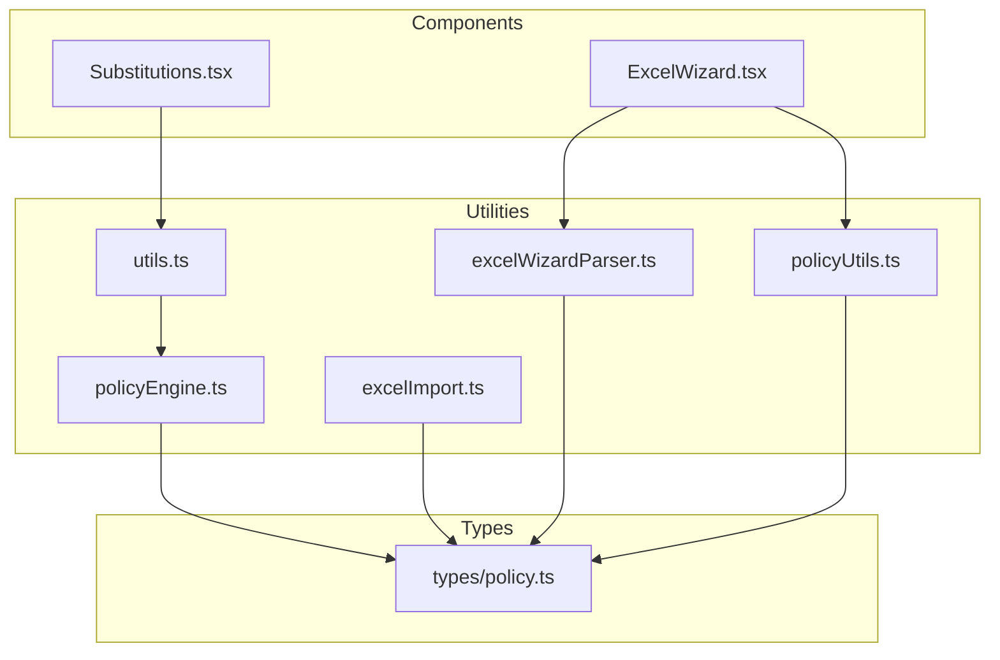
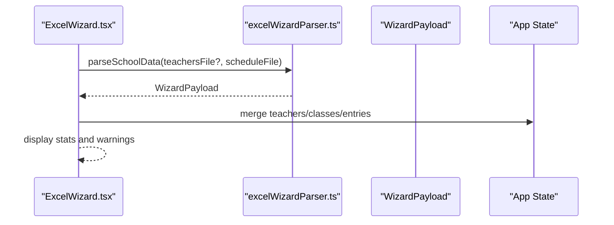
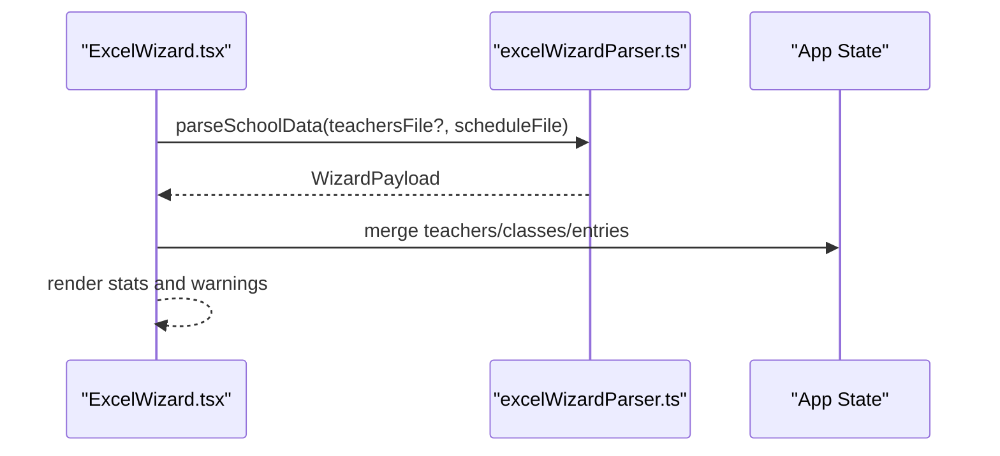
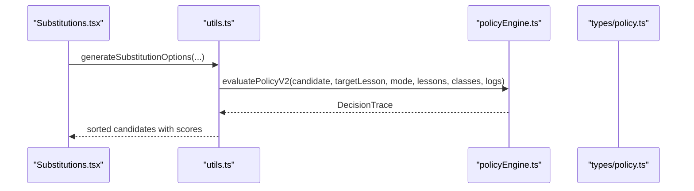
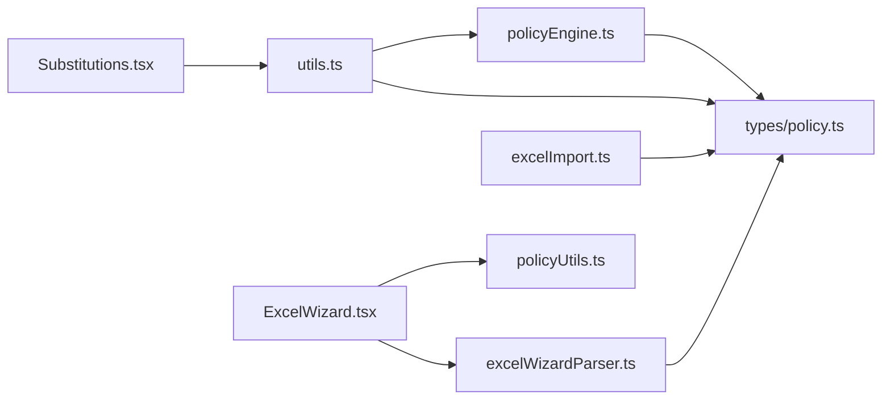

# Utility Functions

<cite>
**Referenced Files in This Document**
- [policyEngine.ts](file://utils/policyEngine.ts)
- [excelImport.ts](file://utils/excelImport.ts)
- [excelWizardParser.ts](file://utils/excelWizardParser.ts)
- [policyUtils.ts](file://utils/policyUtils.ts)
- [utils.ts](file://utils.ts)
- [ExcelWizard.tsx](file://components/ExcelWizard.tsx)
- [Substitutions.tsx](file://components/Substitutions.tsx)
- [policy.ts](file://types/policy.ts)
</cite>

## Table of Contents
1. [Introduction](#introduction)
2. [Project Structure](#project-structure)
3. [Core Components](#core-components)
4. [Architecture Overview](#architecture-overview)
5. [Detailed Component Analysis](#detailed-component-analysis)
6. [Dependency Analysis](#dependency-analysis)
7. [Performance Considerations](#performance-considerations)
8. [Troubleshooting Guide](#troubleshooting-guide)
9. [Conclusion](#conclusion)

## Introduction
This document focuses on the utility functions that power rule evaluation, Excel processing, wizard parsing, and policy-related helpers. It explains the public interfaces, parameters, return values, invocation patterns from components, common issues, and performance considerations for computationally intensive operations.

## Project Structure
The utilities are located under the utils directory and are consumed by components such as ExcelWizard and Substitutions. The policy types define the structures used by the policy engine.

**Diagram sources**
- [policyEngine.ts](file://utils/policyEngine.ts#L1-L406)
- [excelImport.ts](file://utils/excelImport.ts#L1-L189)
- [excelWizardParser.ts](file://utils/excelWizardParser.ts#L1-L716)
- [policyUtils.ts](file://utils/policyUtils.ts#L1-L117)
- [utils.ts](file://utils.ts#L1-L593)
- [ExcelWizard.tsx](file://components/ExcelWizard.tsx#L1-L486)
- [Substitutions.tsx](file://components/Substitutions.tsx#L1-L531)
- [policy.ts](file://types/policy.ts#L1-L162)

**Section sources**
- [policyEngine.ts](file://utils/policyEngine.ts#L1-L406)
- [excelImport.ts](file://utils/excelImport.ts#L1-L189)
- [excelWizardParser.ts](file://utils/excelWizardParser.ts#L1-L716)
- [policyUtils.ts](file://utils/policyUtils.ts#L1-L117)
- [utils.ts](file://utils.ts#L1-L593)
- [ExcelWizard.tsx](file://components/ExcelWizard.tsx#L1-L486)
- [Substitutions.tsx](file://components/Substitutions.tsx#L1-L531)
- [policy.ts](file://types/policy.ts#L1-L162)

## Core Components
- policyEngine.ts: Implements the policy evaluation engine (V2), including context building, condition evaluation, golden rules, priority ladder, and fairness adjustments.
- excelImport.ts: Parses Excel files into a normalized timetable and teacher records, handling Arabic day names and lesson types.
- excelWizardParser.ts: Robust parser for teacher matrix and schedule files, reconciles entries, detects homeroom teachers, and produces a structured payload for UI consumption.
- policyUtils.ts: Provides UI-friendly option lists, empty rule/group builders, and mandatory golden rules for policy configuration.

**Section sources**
- [policyEngine.ts](file://utils/policyEngine.ts#L1-L406)
- [excelImport.ts](file://utils/excelImport.ts#L1-L189)
- [excelWizardParser.ts](file://utils/excelWizardParser.ts#L1-L716)
- [policyUtils.ts](file://utils/policyUtils.ts#L1-L117)

## Architecture Overview
The policy engine integrates with the broader scheduling utilities to generate substitution options. The Excel wizard parses spreadsheets and feeds normalized data into the app state. The policy utilities support configuration and UI composition.

**Diagram sources**
- [ExcelWizard.tsx](file://components/ExcelWizard.tsx#L1-L486)
- [excelWizardParser.ts](file://utils/excelWizardParser.ts#L1-L716)

## Detailed Component Analysis

### policyEngine.ts
Public interfaces:
- validateModeSafety(mode): Validates mode configuration and returns { valid, errors[] }.
- buildEvaluationContext(candidate, targetLesson, day, period, allLessons, allClasses, substitutionLogs, mode?): Builds a context object for evaluation.
- evaluatePolicyV2(candidate, targetLesson, mode, allLessons, allClasses, substitutionLogs?): Evaluates a candidate against the active mode and returns a DecisionTrace.

Key behaviors:
- Context builder computes teacher availability, load, consecutive periods, governing subject match, roaming scenario, continuity match, and temporary immunity.
- Composite condition evaluation supports teacher type, lesson type, subject inclusion, time context, and relationships.
- Golden rules enforce blocking or scoring bonuses/penalties with compliance percentages and exceptions.
- Priority ladder applies weighted scoring with modifiers and stops on match.
- Fairness sensitivity adjusts scores based on deviation from average load.

Common edge cases and solutions:
- Off-duty teachers: Immediate rejection unless manual override is permitted.
- Immunity cooldown: Penalizes candidates who recently covered too many slots.
- Governing subject roaming: Boosts candidates who can support a subject teacher’s roaming needs.
- Fairness strictness: Applies multiplicative penalties for excessive deviation.

Performance considerations:
- Context computation iterates over lessons and logs; consider caching per-day/per-period aggregates.
- Consecutive periods calculation sorts busy periods; ensure early exits when no busy slots exist.
- Golden rules and priority ladder loops scale with rule count; pre-filter enabled rules and short-circuit on stopOnMatch.

**Section sources**
- [policyEngine.ts](file://utils/policyEngine.ts#L1-L406)
- [policy.ts](file://types/policy.ts#L1-L162)

### excelImport.ts
Public interface:
- parseExcelFile(file): Reads an Excel file and returns a Promise resolving to ImportResult with teachers, timetable, errors, and stats.

Parsing logic:
- Detects header row near “period” or “الحصة”.
- Normalizes Arabic day names and lesson types (duty, stay, individual, actual).
- Handles single-line entries (e.g., “متابعة”) and paired subject/teacher lines.
- Skips empty cells and accumulates statistics.

Common issues and solutions:
- Missing header row: Parser skips sheets without detecting a period header.
- Unrecognized day names: Normalize and map to canonical Arabic day names.
- Mixed lesson types: Use detectLessonType to classify reliably.

**Section sources**
- [excelImport.ts](file://utils/excelImport.ts#L1-L189)

### excelWizardParser.ts
Public interface:
- parseSchoolData(teachersFile: File|null, scheduleFile: File): Returns a Promise resolving to WizardPayload.

Parsing stages:
- Teachers file parsing: Supports list format (HR) and robust matrix format with ID extraction, name normalization, and authoritative slot mapping.
- Schedule file parsing: Builds entries from grid cells, infers lesson types based on presence of teachers file, and reconciles entries.
- Reconciliation: Enforces authoritative teacher slot types from the matrix, injects missing teacher-only entries (stay/individual/duty), and recalculates computed loads.
- Homeroom detection: Identifies homeroom teacher by frequency of teaching specific subjects to a class.

Robustness features:
- ID token extraction across sheet names and grid samples.
- Strict and legacy lesson type detection modes.
- Comprehensive error collection and warnings.

**Section sources**
- [excelWizardParser.ts](file://utils/excelWizardParser.ts#L1-L716)

### policyUtils.ts
Public exports:
- COMPONENT_OPTIONS: Option lists for UI builders (teacherType, lessonType, timeContext, relationship).
- getSubjectOptions(): Subject list for UI.
- createEmptyCondition(): Creates a default condition object.
- createEmptyConditionGroup(): Creates a default condition group object.
- MANDATORY_RULES: Predefined golden rules enforced by the UI.

Usage in components:
- ConditionBuilder.tsx and GoldenRulesBuilder.tsx import createEmptyCondition and createEmptyConditionGroup to initialize policy rule editors.
- MANDATORY_RULES ensures critical rules are always present.

**Section sources**
- [policyUtils.ts](file://utils/policyUtils.ts#L1-L117)
- [policy.ts](file://types/policy.ts#L1-L162)

### Invocation Patterns from Components

#### ExcelWizard.tsx
- Uses parseSchoolData to process both teachers and schedule files.
- Applies the resulting payload to update employees, classes, and lessons.
- Displays classification statistics and warnings/errors collected during parsing.

**Diagram sources**
- [ExcelWizard.tsx](file://components/ExcelWizard.tsx#L1-L486)
- [excelWizardParser.ts](file://utils/excelWizardParser.ts#L1-L716)

**Section sources**
- [ExcelWizard.tsx](file://components/ExcelWizard.tsx#L1-L486)

#### Substitutions.tsx and utils.ts
- generateSubstitutionOptions builds a list of eligible substitutes by evaluating each candidate against the active mode using evaluatePolicyV2.
- The function validates mode safety, enforces calendar events, checks off-duty constraints, and computes scores using the policy engine.

**Diagram sources**
- [Substitutions.tsx](file://components/Substitutions.tsx#L1-L531)
- [utils.ts](file://utils.ts#L326-L558)
- [policyEngine.ts](file://utils/policyEngine.ts#L254-L406)
- [policy.ts](file://types/policy.ts#L1-L162)

**Section sources**
- [utils.ts](file://utils.ts#L326-L558)
- [Substitutions.tsx](file://components/Substitutions.tsx#L1-L531)

## Dependency Analysis
- policyEngine.ts depends on types/policy.ts for rule structures and DecisionTrace.
- utils.ts orchestrates policy evaluation and integrates with the policy engine.
- Excel utilities depend on types for ImportResult and LessonType.
- Components import utility functions to drive UI behavior.

**Diagram sources**
- [policyEngine.ts](file://utils/policyEngine.ts#L1-L406)
- [excelImport.ts](file://utils/excelImport.ts#L1-L189)
- [excelWizardParser.ts](file://utils/excelWizardParser.ts#L1-L716)
- [policyUtils.ts](file://utils/policyUtils.ts#L1-L117)
- [utils.ts](file://utils.ts#L1-L593)
- [ExcelWizard.tsx](file://components/ExcelWizard.tsx#L1-L486)
- [Substitutions.tsx](file://components/Substitutions.tsx#L1-L531)
- [policy.ts](file://types/policy.ts#L1-L162)

**Section sources**
- [policyEngine.ts](file://utils/policyEngine.ts#L1-L406)
- [excelImport.ts](file://utils/excelImport.ts#L1-L189)
- [excelWizardParser.ts](file://utils/excelWizardParser.ts#L1-L716)
- [policyUtils.ts](file://utils/policyUtils.ts#L1-L117)
- [utils.ts](file://utils.ts#L1-L593)
- [ExcelWizard.tsx](file://components/ExcelWizard.tsx#L1-L486)
- [Substitutions.tsx](file://components/Substitutions.tsx#L1-L531)
- [policy.ts](file://types/policy.ts#L1-L162)

## Performance Considerations
- Policy evaluation:
  - Minimize repeated scans over lessons/logs by precomputing per-day/per-period sets.
  - Short-circuit golden rules and priority ladder evaluation when stopOnMatch is used.
  - Cache context snapshots for identical inputs to avoid recomputation.
- Excel parsing:
  - Limit scanning windows for ID extraction and header detection.
  - Avoid unnecessary string normalization operations inside tight loops.
- UI-driven evaluations:
  - Debounce or batch requests when generating substitution options for multiple periods.
  - Use memoization for derived stats and normalized names.

[No sources needed since this section provides general guidance]

## Troubleshooting Guide
- Excel parsing errors:
  - Missing period header: Ensure the first column contains “الحصة” or “period”.
  - Unrecognized day names: Confirm headers include canonical Arabic day names or variants mapped by the parser.
  - Mixed content: Each cell should contain paired lines (subject, teacher) or a single-line task.
  - Sheet errors: Review WizardPayload.errors.sheetErrors and cellErrors for actionable messages.

- Policy evaluation edge cases:
  - Off-duty: If a teacher has no lessons today or is outside their scheduled bounds, they are rejected unless manual override is configured.
  - Immunity: Recent coverage history can penalize candidates; adjust mode settings to modify cooldown thresholds.
  - Governing subject roaming: If the governing subject teacher is busy, support candidates are prioritized to enable roaming.
  - Fairness: Strict fairness sensitivity reduces scores for imbalanced coverage; adjust sensitivity or distribution strategies.

- Mode activation validation:
  - validateModeSafety reports critical configuration issues; fix missing identifiers or invalid parameters before enabling modes.

**Section sources**
- [excelWizardParser.ts](file://utils/excelWizardParser.ts#L1-L716)
- [excelImport.ts](file://utils/excelImport.ts#L1-L189)
- [utils.ts](file://utils.ts#L319-L325)
- [policyEngine.ts](file://utils/policyEngine.ts#L25-L44)

## Conclusion
The utility modules provide robust, modular capabilities for policy evaluation, Excel ingestion, and wizard-driven reconciliation. Their interfaces are designed for predictable inputs and outputs, and they integrate cleanly with components to deliver a responsive scheduling experience. By following the troubleshooting tips and performance recommendations, teams can maintain reliability and responsiveness across large datasets and complex rule sets.